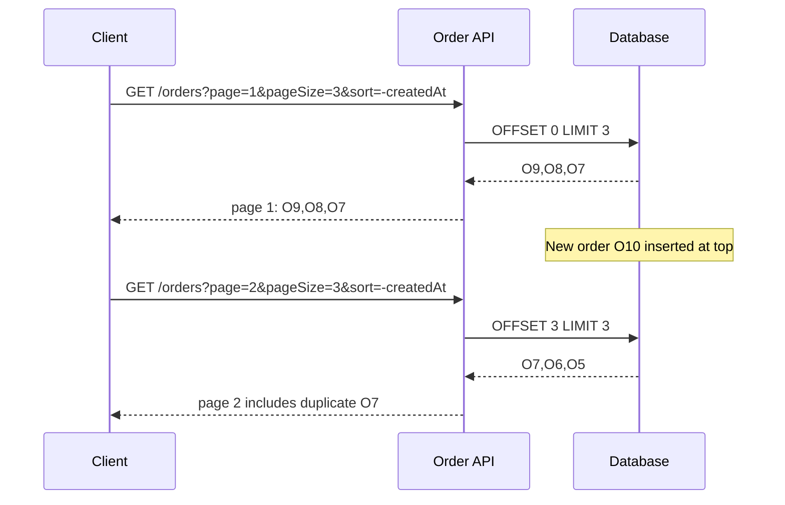

# Part 032 — Pagination, Filtering, Sorting, and Query Stability

A query endpoint looks simple until the data grows.

```http
GET /orders
```

Then someone adds:

```http
GET /orders?status=OPEN
```

Then:

```http
GET /orders?status=OPEN&customerId=C-123&createdAfter=2026-01-01&sort=-createdAt&page=9231&pageSize=500
```

Then production starts showing symptoms:

- slow queries,
- inconsistent pages,
- missing records,
- duplicate records across pages,
- exploding database CPU,
- unstable response latency,
- large payloads,
- cache misses,
- timeouts,
- unreadable client code,
- query parameters that nobody owns.

This part is about designing query APIs that stay stable under growth.

The rule:

> A list/search endpoint is not a thin wrapper over `SELECT *`. It is a bounded communication contract.

---

## 1. Why Pagination Is Not Optional

Every collection grows unless there is an invariant that prevents it.

A microservice list endpoint must assume:

- more rows later,
- more consumers later,
- more filters later,
- more sort modes later,
- more tenants later,
- more retries during incidents,
- more calls from automation than humans.

Therefore every collection endpoint needs a result boundary.

Bad:

```http
GET /cases
```

Returning all cases is not convenient. It is a production hazard.

Better:

```http
GET /cases?pageSize=50&pageToken=eyJ..."
```

Even if the first version has only ten rows, design the contract as if it will eventually have ten million.

---

## 2. The Query Stability Problem

Pagination is not merely splitting a list into chunks.

It is defining what it means to continue reading the same logical result set while data changes.

Consider:

```text
T1: client reads page 1 sorted by created_at desc
T2: new rows are inserted
T3: client reads page 2
```

If the API uses unstable offset pagination, the client may see:

- duplicate items,
- skipped items,
- reordered items,
- inconsistent totals,
- impossible reconciliation.



This is not a rare edge case.

It is the default behavior of offset pagination over changing data.

---

## 3. Pagination Strategies

There are four common strategies.

| Strategy | Shape | Strength | Weakness | Best for |
|---|---|---|---|---|
| Limit only | `?limit=50` | Simple | No continuation | Small bounded collections |
| Offset/page | `?page=3&pageSize=50` or `?offset=100&limit=50` | Easy for humans | Slow/inconsistent at scale | Admin tools, small stable data |
| Cursor/keyset | `?pageToken=...` | Stable, efficient with indexes | More complex; no arbitrary jump | Production APIs over changing data |
| Snapshot pagination | `?snapshotId=...&pageToken=...` | Consistent view | Requires snapshot/read model support | Audits, exports, legal/regulatory reads |

For internal microservices, cursor/keyset pagination should usually be the default for high-volume changing collections.

Offset pagination is acceptable when:

- collection is small,
- data changes rarely,
- exact page number navigation matters,
- performance is bounded,
- instability is acceptable and documented.

---

## 4. Offset Pagination

Offset pagination is easy to understand.

```http
GET /orders?offset=100&pageSize=50
```

SQL-like shape:

```sql
SELECT *
FROM orders
WHERE customer_id = ?
ORDER BY created_at DESC
OFFSET 100
LIMIT 50;
```

The problems:

1. The database may scan/skip many rows.
2. Inserts/deletes before the current offset shift pages.
3. Large offsets get slower.
4. The caller can request pathological offsets.
5. Total counts can be expensive.

Offset pagination is not evil. It is just often misapplied.

Use it deliberately:

```yaml
pagination:
  strategy: offset
  maxOffset: 10000
  maxPageSize: 100
  sortRequired: true
  stability: best-effort
  warning: results may shift when data changes
```

If you cannot explain the stability model, do not expose offset pagination for critical service-to-service workflows.

---

## 5. Cursor / Keyset Pagination

Cursor pagination uses the last seen sort key to continue.

Example response:

```json
{
  "items": [
    { "orderId": "O-100", "createdAt": "2026-07-05T10:00:00Z" },
    { "orderId": "O-099", "createdAt": "2026-07-05T09:59:00Z" }
  ],
  "nextPageToken": "eyJzb3J0IjpbIjIwMjYtMDctMDVUMDk6NTk6MDBaIiwiTy0wOTkiXX0"
}
```

The next request:

```http
GET /orders?pageSize=2&pageToken=eyJzb3J0IjpbIjIwMjYtMDctMDVUMDk6NTk6MDBaIiwiTy0wOTkiXX0
```

SQL-like shape:

```sql
SELECT *
FROM orders
WHERE customer_id = ?
  AND (created_at, order_id) < (?, ?)
ORDER BY created_at DESC, order_id DESC
LIMIT 51;
```

Fetch `pageSize + 1` rows to know if there is another page.

Cursor pagination depends on stable ordering.

---

## 6. Stable Ordering

A paginated API must define deterministic order.

Bad:

```sql
ORDER BY created_at DESC
```

If two rows have the same timestamp, order is not stable.

Better:

```sql
ORDER BY created_at DESC, order_id DESC
```

The final tie-breaker must be unique and stable.

Common stable sort keys:

| Sort purpose | Stable ordering |
|---|---|
| Newest first | `created_at DESC, id DESC` |
| Oldest first | `created_at ASC, id ASC` |
| Last updated | `updated_at DESC, id DESC` |
| Priority queue | `priority DESC, created_at ASC, id ASC` |
| Lexicographic name | `normalized_name ASC, id ASC` |

Do not sort by fields that are frequently updated unless the instability is understood.

For example, sorting by `updated_at DESC` means an item may move between pages as it is updated.

That may be acceptable for dashboards.

It may be unacceptable for exports or regulatory review queues.

---

## 7. Page Token Design

A page token should usually be opaque to callers.

Bad:

```http
GET /orders?afterCreatedAt=2026-07-05T09:59:00Z&afterOrderId=O-099
```

This exposes implementation details and encourages clients to synthesize cursors.

Better:

```http
GET /orders?pageToken=opaque-token
```

The token can contain:

```json
{
  "v": 1,
  "operation": "searchOrders",
  "filtersHash": "sha256:...",
  "sort": ["createdAt:desc", "orderId:desc"],
  "last": {
    "createdAt": "2026-07-05T09:59:00Z",
    "orderId": "O-099"
  },
  "issuedAt": "2026-07-05T10:01:00Z",
  "expiresAt": "2026-07-05T10:31:00Z"
}
```

Then encode and sign it.

Do not trust a client-provided token blindly.

Validate:

- signature,
- token version,
- operation name,
- filter hash,
- sort mode,
- expiration,
- tenant/scope if needed,
- page size constraints.

### 7.1 Token should bind to query shape

A token from this query:

```http
GET /orders?status=OPEN&pageSize=50
```

must not be usable for:

```http
GET /orders?status=CANCELLED&pageToken=...
```

The token should include a hash of normalized filters/sort so the server can reject mismatch.

```http
HTTP/1.1 400 Bad Request
Content-Type: application/problem+json
```

```json
{
  "type": "https://api.example.com/problems/invalid-page-token",
  "title": "Invalid page token",
  "status": 400,
  "detail": "The page token does not match the current query parameters."
}
```

---

## 8. Java Page Token Skeleton

```java
public record PageTokenPayload(
        int version,
        String operation,
        String filtersHash,
        List<String> sort,
        Map<String, String> last,
        Instant issuedAt,
        Instant expiresAt,
        String tenantId
) {}
```

A codec boundary:

```java
public interface PageTokenCodec {
    String encode(PageTokenPayload payload);
    PageTokenPayload decode(String token);
}
```

Implementation outline:

```java
public final class SignedJsonPageTokenCodec implements PageTokenCodec {

    private final ObjectMapper objectMapper;
    private final MacSigner signer;
    private final Clock clock;

    @Override
    public String encode(PageTokenPayload payload) {
        byte[] json = writeJson(payload);
        byte[] signature = signer.sign(json);
        return Base64.getUrlEncoder().withoutPadding()
                .encodeToString(Bytes.concat(json, signature));
    }

    @Override
    public PageTokenPayload decode(String token) {
        byte[] raw = Base64.getUrlDecoder().decode(token);
        TokenParts parts = TokenParts.split(raw);
        signer.verify(parts.payload(), parts.signature());

        PageTokenPayload payload = readJson(parts.payload());
        if (payload.expiresAt().isBefore(clock.instant())) {
            throw new InvalidPageToken("Page token expired");
        }
        return payload;
    }
}
```

Production notes:

- keep token compact;
- use URL-safe base64;
- sign token to prevent tampering;
- optionally encrypt if token contains sensitive data;
- include token version for migration;
- set expiration;
- avoid embedding large filter bodies.

---

## 9. Filtering Model

Filtering is where many APIs accidentally expose database internals.

Bad:

```http
GET /orders?where=status='OPEN' and amount > 100
```

Better:

```http
GET /orders?status=OPEN&minAmount=100
```

Or for complex search:

```http
POST /orders:search
Content-Type: application/json

{
  "status": ["OPEN", "CONFIRMED"],
  "amount": {
    "min": "100.00",
    "currency": "USD"
  },
  "createdAt": {
    "from": "2026-07-01T00:00:00Z",
    "to": "2026-07-05T00:00:00Z"
  }
}
```

A filter contract should define:

- allowed fields,
- allowed operators,
- allowed combinations,
- default constraints,
- maximum cardinality,
- index requirements,
- null semantics,
- time zone semantics,
- enum stability,
- validation errors.

---

## 10. Filter Field Governance

Every filter field is a promise.

When you add:

```http
GET /orders?customerId=C-123
```

you are promising the platform that lookup by `customerId` is a supported access path.

That means:

- the database or read model should index it;
- latency SLO should account for it;
- authorization model should understand it;
- tests should cover it;
- documentation should define it;
- observability should measure it.

Do not add filter fields just because a UI screen requested them once.

### 10.1 Filter registry

For serious APIs, maintain a filter registry:

```yaml
filters:
  customerId:
    type: string
    operators: [eq]
    indexed: true
    requiredWith: []
    maxValues: 1
  status:
    type: enum
    operators: [eq, in]
    indexed: true
    maxValues: 5
  createdAt:
    type: timestamp
    operators: [gte, lt]
    indexed: true
    maxRange: P90D
  amount:
    type: money
    operators: [gte, lte]
    indexed: false
    allowedOnlyWith:
      - customerId
```

This prevents ad-hoc query evolution.

---

## 11. Sorting Model

Sorting is not presentation detail.

It changes access path, index usage, pagination stability, and result semantics.

Allowed sort modes should be explicit.

```text
sort=createdAt
sort=-createdAt
sort=priority,-createdAt
```

Do not allow arbitrary sort fields unless you have a query engine designed for it.

A production sort contract:

```yaml
sortModes:
  newest:
    publicValue: -createdAt
    orderBy:
      - created_at DESC
      - order_id DESC
    cursorFields:
      - createdAt
      - orderId
    default: true
  oldest:
    publicValue: createdAt
    orderBy:
      - created_at ASC
      - order_id ASC
    cursorFields:
      - createdAt
      - orderId
  priorityQueue:
    publicValue: -priority,createdAt
    orderBy:
      - priority DESC
      - created_at ASC
      - order_id ASC
```

Expose stable names if field-level sort is too leaky:

```http
GET /cases?queue=ENFORCEMENT_REVIEW&sortMode=next-action
```

This is often better than:

```http
GET /cases?sort=-riskScore,dueDate,createdAt,id
```

because the service owns the queue semantics.

---

## 12. Search vs List

Do not overload list endpoints with arbitrary search.

| Endpoint | Purpose |
|---|---|
| `GET /orders` | Bounded list over collection using simple filters |
| `POST /orders:search` | Complex query body, maybe full-text/search-index backed |
| `GET /orders/{id}` | Direct lookup by identity |
| `GET /customers/{id}/orders` | Scoped child collection when hierarchy is meaningful |

A list endpoint should be predictable.

A search endpoint may support richer operators but must still be bounded.

Example search contract:

```yaml
operationId: searchCases
kind: query
source: case-search-index
freshness:
  model: eventual
  maxNormalLag: PT10S
filters:
  jurisdiction: required
  lifecycleStatus: optional
  assignedTeam: optional
  fullText: optional
pagination:
  strategy: cursor
  maxPageSize: 100
sortModes:
  - relevance
  - newest
  - dueDate
```

The key is to expose the freshness model. Search index results should not silently pretend to be authoritative workflow state.

---

## 13. Total Count Is Expensive and Often Misleading

Many clients ask for:

```json
{
  "items": [...],
  "totalCount": 1234567
}
```

This can be expensive.

It can also be stale immediately after it is computed.

Alternatives:

```json
{
  "items": [...],
  "nextPageToken": "...",
  "hasMore": true
}
```

Or:

```json
{
  "items": [...],
  "countRelation": "GREATER_THAN_OR_EQUAL",
  "count": 10000
}
```

Or separate count endpoint:

```http
GET /orders:count?status=OPEN
```

with clear cost and freshness policy.

Ask what the consumer actually needs:

- Does it need exact total?
- Does it need approximate total?
- Does it only need to know if there is another page?
- Does it only need badge count under a threshold?
- Does it need export size estimate?

Do not pay for exact count by default.

---

## 14. Page Size Policy

Page size is a resource allocation decision.

Typical policy:

```yaml
pageSize:
  default: 50
  max: 200
  min: 1
  hardResponseBodyLimitBytes: 1048576
  serverMayReturnFewer: true
```

Important: a server may return fewer items than requested.

Reasons:

- response body size limit,
- timeout budget,
- filtered items after authorization,
- backend limitation,
- partial page at end.

A client must not assume:

```text
if item count < pageSize then no more pages
```

It should rely on `nextPageToken` or `hasMore`.

---

## 15. Authorization and Pagination

Authorization can break naive pagination.

Example:

```text
DB page contains 50 rows
caller can see only 13
```

Do you return 13 and a next token?

Usually yes.

But be careful:

- do not leak invisible row counts;
- do not allow page token to reveal hidden IDs;
- apply authorization before returning data;
- avoid infinite loops when many rows are filtered out;
- cap backend scan effort per page.

Policy example:

```yaml
authorizationPagination:
  authorizationApplied: beforeResponse
  maxBackendRowsScannedPerPage: 1000
  nextTokenReturnedWhenScanLimitReached: true
  hiddenCountsExposed: false
```

For high-security domains, prefer authorization-aware indexes/read models.

---

## 16. Multi-Tenant Query Safety

Every query must be tenant-scoped either explicitly or implicitly.

Bad:

```sql
SELECT * FROM cases WHERE status = ?
```

Better:

```sql
SELECT * FROM cases
WHERE tenant_id = ?
  AND status = ?
ORDER BY created_at DESC, case_id DESC
LIMIT ?
```

The tenant constraint should be impossible to forget.

In Java, this often means `TenantContext` is part of query construction:

```java
public record SearchCasesQuery(
        TenantId tenantId,
        Optional<CaseStatus> status,
        PageRequest page,
        SortMode sort
) {}
```

Do not accept tenant ID from an arbitrary query parameter unless that is the explicit API contract and authorized.

---

## 17. Time Filtering Semantics

Time filters are frequent incident sources.

Define:

- timezone expectation,
- inclusive/exclusive boundaries,
- precision,
- clock source,
- field meaning,
- default range,
- maximum range.

Prefer half-open intervals:

```text
createdAt >= from AND createdAt < to
```

API:

```http
GET /orders?createdFrom=2026-07-01T00:00:00Z&createdTo=2026-07-05T00:00:00Z
```

Document:

```yaml
timeRange:
  from: inclusive
  to: exclusive
  timezone: UTC instant required
  maxRange: P90D
```

Avoid ambiguous local dates unless the business domain requires them.

If business dates are jurisdiction-specific, model that explicitly:

```http
GET /cases?businessDate=2026-07-05&jurisdiction=ID-JK
```

Do not pretend a local date is an instant.

---

## 18. Java Request Model

Do not pass raw request parameters deep into your query layer.

Bad:

```java
Map<String, String[]> params
```

Better:

```java
public record SearchOrdersHttpRequest(
        Optional<String> customerId,
        List<String> status,
        Optional<Instant> createdFrom,
        Optional<Instant> createdTo,
        Optional<Integer> pageSize,
        Optional<String> pageToken,
        Optional<String> sort
) {
    SearchOrdersQuery toQuery(TenantId tenantId, QueryPolicy policy) {
        return policy.validateAndNormalize(this, tenantId);
    }
}
```

Normalized query:

```java
public record SearchOrdersQuery(
        TenantId tenantId,
        Optional<CustomerId> customerId,
        Set<OrderStatus> statuses,
        Optional<InstantRange> createdAt,
        PageRequest page,
        SortSpec sort
) {}
```

Separate:

```text
HTTP parsing
validation
normalization
query execution
response mapping
```

This separation makes query rules testable.

---

## 19. Query Policy Object

```java
public final class SearchOrdersQueryPolicy {

    private static final int DEFAULT_PAGE_SIZE = 50;
    private static final int MAX_PAGE_SIZE = 200;
    private static final Duration MAX_CREATED_RANGE = Duration.ofDays(90);

    public SearchOrdersQuery validateAndNormalize(
            SearchOrdersHttpRequest request,
            TenantId tenantId) {

        int pageSize = request.pageSize()
                .orElse(DEFAULT_PAGE_SIZE);

        if (pageSize < 1 || pageSize > MAX_PAGE_SIZE) {
            throw new InvalidQuery("pageSize must be between 1 and " + MAX_PAGE_SIZE);
        }

        InstantRange createdAt = parseCreatedRange(request);
        if (createdAt.duration().compareTo(MAX_CREATED_RANGE) > 0) {
            throw new InvalidQuery("createdAt range must not exceed 90 days");
        }

        SortSpec sort = SortSpec.parseOrDefault(request.sort().orElse("-createdAt"));
        PageCursor cursor = request.pageToken()
                .map(token -> decodeAndValidateToken(token, request, sort, tenantId))
                .orElse(PageCursor.firstPage());

        return new SearchOrdersQuery(
                tenantId,
                request.customerId().map(CustomerId::new),
                parseStatuses(request.status()),
                Optional.of(createdAt),
                new PageRequest(pageSize, cursor),
                sort
        );
    }
}
```

The policy object is the API contract in executable form.

---

## 20. Repository Keyset Query Skeleton

```java
public final class JdbcOrderReadRepository implements OrderReadRepository {

    private final JdbcTemplate jdbc;
    private final PageTokenCodec pageTokenCodec;

    @Override
    public SearchOrdersResult search(SearchOrdersQuery query) {
        int limit = query.page().size() + 1;

        List<OrderRow> rows = jdbc.query(
                buildSql(query),
                bindParams(query, limit),
                OrderRowMapper.INSTANCE
        );

        boolean hasMore = rows.size() > query.page().size();
        List<OrderRow> pageRows = hasMore
                ? rows.subList(0, query.page().size())
                : rows;

        String nextToken = hasMore
                ? encodeNextToken(query, pageRows.get(pageRows.size() - 1))
                : null;

        return OrderReadMapper.toResult(pageRows, nextToken);
    }
}
```

The important pattern is `pageSize + 1`.

Do not run a separate count just to decide if there is another page.

---

## 21. SQL Shape for Keyset Pagination

Descending newest-first:

```sql
SELECT order_id, customer_id, status, created_at
FROM orders
WHERE tenant_id = :tenant_id
  AND (:customer_id IS NULL OR customer_id = :customer_id)
  AND status = ANY(:statuses)
  AND created_at >= :created_from
  AND created_at < :created_to
  AND (
      :cursor_created_at IS NULL
      OR (created_at, order_id) < (:cursor_created_at, :cursor_order_id)
  )
ORDER BY created_at DESC, order_id DESC
LIMIT :limit;
```

Index:

```sql
CREATE INDEX idx_orders_tenant_created_id
ON orders (tenant_id, created_at DESC, order_id DESC);
```

If `customerId` is common:

```sql
CREATE INDEX idx_orders_tenant_customer_created_id
ON orders (tenant_id, customer_id, created_at DESC, order_id DESC);
```

The API filter contract and indexes must evolve together.

---

## 22. Avoid Query Planner Surprises

A filter that seems harmless can destroy performance.

Example:

```http
GET /orders?status=OPEN&notesContains=urgent
```

If `notesContains` requires full table scan, one request can overload the database.

Options:

- reject unsupported filter combination;
- require narrower indexed filter like `customerId` or date range;
- route to search index;
- introduce async export;
- cap scan effort;
- return `400` or `422` with supported query explanation.

Do not silently accept expensive filters.

A good error:

```json
{
  "type": "https://api.example.com/problems/unsupported-filter-combination",
  "title": "Unsupported filter combination",
  "status": 400,
  "detail": "notesContains requires either customerId or createdAt range not greater than 7 days.",
  "supportedCombinations": [
    ["customerId", "notesContains"],
    ["createdFrom", "createdTo", "notesContains"]
  ]
}
```

---

## 23. Response Shape

Recommended response:

```json
{
  "items": [
    {
      "orderId": "O-123",
      "customerId": "C-123",
      "status": "OPEN",
      "createdAt": "2026-07-05T10:00:00Z"
    }
  ],
  "nextPageToken": "eyJ...",
  "resultMetadata": {
    "sort": "-createdAt",
    "pageSize": 50,
    "source": "primary-read-model",
    "freshness": {
      "model": "bounded-stale",
      "observedLagMs": 840
    }
  }
}
```

Keep metadata useful but not noisy.

Avoid returning internal SQL, shard, or index names unless the consumer is operational tooling.

---

## 24. Error Model

Common query errors:

| Error | Status | Meaning |
|---|---:|---|
| Invalid page size | `400` | Client provided illegal bound |
| Invalid page token | `400` | Malformed, expired, mismatched, or tampered token |
| Unsupported filter | `400` or `422` | Filter field/operator not supported |
| Unsupported sort | `400` | Sort mode not supported |
| Range too large | `400` | Query exceeds contract limit |
| Query too expensive | `400`, `422`, or `429` | Depends whether static invalidity or load-shedding |
| Unauthorized filter scope | `403` | Caller cannot query that scope |
| Backend unavailable | `503` | Transient callee/dependency issue |

Use Problem Details style consistently.

Example:

```json
{
  "type": "https://api.example.com/problems/invalid-query",
  "title": "Invalid query",
  "status": 400,
  "detail": "pageSize must be between 1 and 200.",
  "invalidParams": [
    {
      "name": "pageSize",
      "reason": "must be <= 200"
    }
  ]
}
```

---

## 25. Observability

Query APIs need their own telemetry.

Low-cardinality metrics:

```text
http.server.duration{http.route="/orders", operation.kind="query"}
query.result_count{operation="searchOrders"}
query.page_size{operation="searchOrders"}
query.has_more{operation="searchOrders"}
query.invalid.count{reason="invalid_page_token"}
query.source_lag_ms{source="order_read_model"}
```

Avoid high cardinality labels:

```text
customerId
orderId
raw filter string
page token
search text
```

Useful logs should include normalized query metadata:

```json
{
  "operation": "searchOrders",
  "kind": "query",
  "tenantIdHash": "tnt_8f1a",
  "filters": ["customerId", "status", "createdAt"],
  "sort": "-createdAt",
  "pageSize": 50,
  "hasPageToken": true,
  "resultCount": 50,
  "hasMore": true,
  "durationMs": 34
}
```

Never log raw page tokens if they contain sensitive or signed payloads.

---

## 26. Caching Considerations

Query endpoints can sometimes be cached.

But pagination and filters complicate caching.

Cache key must include:

- route,
- normalized filters,
- sort,
- page token,
- representation version,
- tenant/scope,
- authorization-relevant dimensions,
- accept/content negotiation dimensions if used.

Do not cache across security boundaries.

Do not cache mutable search results without freshness policy.

If using HTTP caching semantics, make validators meaningful:

```http
ETag: "orders-search:v3:hash"
Cache-Control: private, max-age=5
```

For internal service-to-service APIs, many teams use application-level caches instead of shared HTTP caches. The same stability rules still apply.

---

## 27. Export Is Not Pagination

A common failure:

```text
Consumer uses paginated endpoint to export millions of rows.
```

This creates:

- long-running workflows over synchronous API,
- inconsistent results,
- timeout/retry ambiguity,
- database load,
- brittle client loops.

If export is a real use case, design it separately:

```http
POST /orders:export
```

Response:

```http
202 Accepted
Location: /operations/export_123
```

Then:

```http
GET /operations/export_123
GET /exports/export_123/files/part-0001
```

Export needs snapshot semantics, resumability, large result handling, and operational throttling.

Do not pretend it is just pagination.

---

## 28. Testing Query Stability

You need tests beyond "returns 200".

### 28.1 Pagination duplicate/skip test

Scenario:

1. create records A, B, C, D ordered by createdAt desc;
2. fetch first page size 2;
3. insert new record E at top;
4. fetch next page using token;
5. assert no duplicate from page 1;
6. assert continuation is stable according to contract.

### 28.2 Token mismatch test

1. fetch page for `status=OPEN`;
2. reuse token with `status=CANCELLED`;
3. expect invalid page token.

### 28.3 Sort tie-breaker test

1. create multiple rows with same `createdAt`;
2. fetch all pages;
3. assert deterministic order;
4. assert no duplicate/missing rows.

### 28.4 Filter limit test

1. request date range > max;
2. expect `400` with Problem Details;
3. assert no database query executed if possible.

### 28.5 Authorization filtering test

1. create visible and invisible rows;
2. fetch pages;
3. assert invisible rows are absent;
4. assert token does not leak hidden IDs;
5. assert pagination terminates.

---

## 29. Consumer Loop Pattern

Client code must be written safely.

```java
public final class OrderReader {

    private final OrderClient client;

    public void readAllOpenOrders(Consumer<OrderSummary> consumer) {
        String pageToken = null;

        do {
            SearchOrdersResponse page = client.searchOrders(new SearchOrdersRequest(
                    Set.of(OrderStatus.OPEN),
                    100,
                    pageToken
            ));

            for (OrderSummary item : page.items()) {
                consumer.accept(item);
            }

            pageToken = page.nextPageToken();
        } while (pageToken != null && !pageToken.isBlank());
    }
}
```

Add production safeguards:

- max total pages,
- caller deadline,
- retry policy,
- duplicate detection if business-critical,
- progress checkpoint,
- rate limit,
- export API for huge reads.

Do not build infinite polling loops without stop conditions.

---

## 30. API Review Checklist

Before approving a list/search endpoint, require answers to:

```text
What is the default page size?
What is the maximum page size?
Is the ordering deterministic?
What is the tie-breaker?
Can data changes cause duplicates or skips?
Is the page token opaque and signed?
Does the token bind to filters/sort/scope?
When does the token expire?
Which filters are allowed?
Which filter combinations are supported?
Which indexes/read models support them?
What is the max time range?
What is the result freshness model?
Is exact total count required?
What happens when query is too expensive?
How is authorization applied?
What metrics/logs/traces exist?
Is export a separate use case?
```

If these answers are missing, the endpoint is not production-ready.

---

## 31. Production Template

```yaml
operationId: searchOrders
kind: query
http:
  method: GET
  path: /orders
pagination:
  strategy: cursor
  pageSize:
    default: 50
    max: 200
  token:
    opaque: true
    signed: true
    expiresAfter: PT30M
    bindsTo:
      - operation
      - tenant
      - normalizedFilters
      - sortMode
sort:
  default: -createdAt
  modes:
    - name: -createdAt
      orderBy:
        - created_at DESC
        - order_id DESC
      stableTieBreaker: order_id
filters:
  customerId:
    operators: [eq]
    indexed: true
  status:
    operators: [in]
    indexed: true
    maxValues: 5
  createdAt:
    operators: [gte, lt]
    indexed: true
    maxRange: P90D
freshness:
  source: primary-read-model
  model: bounded-stale
  maxNormalLag: PT3S
limits:
  hardResponseBodyBytes: 1048576
  maxBackendRowsScanned: 1000
errors:
  invalidPageSize: 400
  invalidPageToken: 400
  unsupportedFilter: 400
  unsupportedSort: 400
  queryTooExpensive: 429
observability:
  metrics:
    - query.duration
    - query.result_count
    - query.page_size
    - query.invalid.count
    - query.source_lag_ms
```

---

## 32. Mental Model

Pagination is not a UI convenience.

Filtering is not arbitrary database access.

Sorting is not presentation detail.

Together, they define the query contract's:

- cost,
- stability,
- consistency,
- security,
- latency,
- evolvability,
- operational safety.

A production list endpoint should feel intentionally narrow.

That narrowness is not a limitation. It is how the service protects its invariants while still giving consumers useful access.

---

## 33. What Comes Next

The next part moves from query shape to write/read efficiency at API boundary:

- bulk endpoints,
- batch endpoints,
- partial failure,
- transaction boundary,
- idempotency at item level,
- response shape for mixed outcomes,
- Java implementation patterns.

Bulk APIs are powerful, but they multiply failure modes.

---

## References

- RFC 9110 — HTTP Semantics: https://datatracker.ietf.org/doc/html/rfc9110
- Google AIP-132 — Standard methods: List: https://google.aip.dev/132
- Google AIP-158 — Pagination: https://google.aip.dev/158
- Google AIP-160 — Filtering: https://google.aip.dev/160
- Google AIP-161 — Field masks: https://google.aip.dev/161
- JSON:API Cursor Pagination Profile: https://jsonapi.org/profiles/ethanresnick/cursor-pagination/
- RFC 9457 — Problem Details for HTTP APIs: https://www.rfc-editor.org/rfc/rfc9457.html
