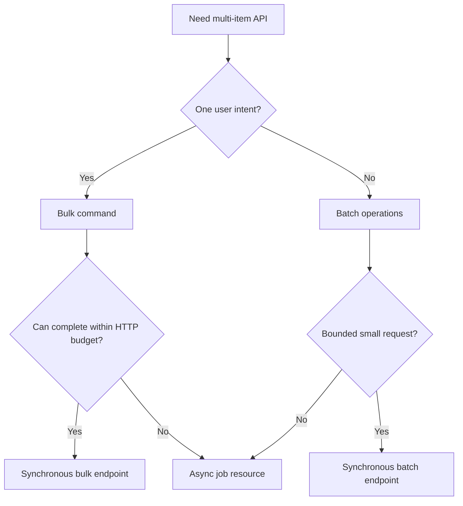
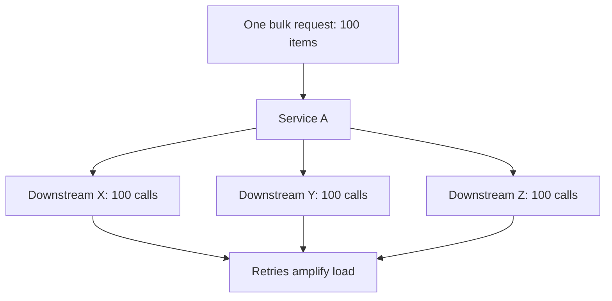

# Part 033 — Bulk and Batch Endpoints Without Breaking Reliability

A single endpoint call is easy to reason about.

```http
POST /payments
```

A bulk endpoint is not just the same endpoint repeated inside one JSON array.

```http
POST /payments:batchCreate
```

The second endpoint changes almost everything:

- the request can partially succeed,
- one client call can create many side effects,
- retrying the request can duplicate many side effects,
- one slow item can hold the whole response hostage,
- one bad item can poison an otherwise valid batch,
- authorization becomes per-item,
- observability needs item-level visibility without exploding metric cardinality,
- validation errors become collections,
- transaction boundaries become explicit design choices,
- backpressure must happen before the database or downstream services melt.

This part is about designing bulk and batch endpoints as **communication contracts**, not convenience wrappers.

The rule:

> A bulk endpoint is a controlled fan-in/fan-out boundary. It must make size, identity, failure, atomicity, retry, and observability explicit.

---

## 1. Batch vs Bulk: Use the Words Precisely

Engineers often use "batch" and "bulk" interchangeably. That is dangerous because the failure model is different.

| Term | Typical Meaning | Example | Communication Risk |
|---|---|---|---|
| Batch read | Fetch many known resources in one request | `POST /orders:batchGet` | Missing IDs, authorization filtering, response ordering |
| Bulk command | Apply one command to many items | `POST /invoices:bulkApprove` | Partial success, duplicate side effects, per-item failure |
| Batch create | Create many resources | `POST /settlements:batchCreate` | Idempotency, validation, uniqueness, transaction boundaries |
| Batch update | Update many resources with independent patches | `PATCH /cases:batchUpdate` | Version conflicts, partial update, stale preconditions |
| Bulk transition | Move many workflow entities to a new state | `POST /cases:bulkEscalate` | Domain invariant breakage, authorization, audit correctness |
| Async import | Submit a large file or dataset for later processing | `POST /imports` | Job lifecycle, replay, progress, cancellation |

A useful distinction:

- **Batch** usually means "many independent operations in one request".
- **Bulk** usually means "one logical operation over many targets".

Example:

```http
POST /orders:batchGet
```

means: "get these independent orders".

```http
POST /cases:bulkAssign
```

means: "assign this set of cases as one user-intended operation".

That distinction matters because a bulk transition often needs one audit event, one approval context, one reason code, and one user intent, even if item outcomes differ.

---

## 2. Why Bulk Endpoints Exist

Bulk endpoints are not automatically better than repeated single-item calls.

They exist for specific reasons:

1. **Reduce round trips** when client-to-service latency dominates.
2. **Preserve user intent** when one UI action applies to many entities.
3. **Centralize authorization and invariant checks** instead of scattering them across client loops.
4. **Control server-side concurrency** instead of letting each client fan out wildly.
5. **Provide consistent item-level outcome reporting**.
6. **Move large work into an async job** when synchronous request/response is the wrong communication shape.

Bad reason:

> "The single endpoint is slow, so let us add a batch endpoint."

That usually hides a deeper issue: missing index, poor API shape, N+1 downstream calls, unbounded payloads, or bad client behavior.

Bulk is a communication pattern, not a performance bandage.

---

## 3. The Core Design Question

Before designing a bulk endpoint, answer this:

> Is this request one operation with many targets, or many operations packaged together?

The answer decides response shape, audit model, idempotency, transaction strategy, and retry semantics.



A bulk action like "approve 300 cases" is one user intent.

A batch create request containing 300 unrelated records is many operations packaged together.

This difference affects audit:

- one bulk action may create one parent audit event plus item details,
- batch create may create independent audit entries for each resource.

It also affects idempotency:

- one bulk action may have one idempotency key for the whole operation,
- batch create may additionally need per-item client request IDs.

---

## 4. First-Class Constraints

A production bulk endpoint must publish constraints as part of the contract.

Example:

```yaml
maxItems: 100
maxPayloadBytes: 1048576
maxItemPayloadBytes: 8192
atomicity: per-item
ordering: response matches request order
idempotency: required
authorization: evaluated per item
maxSyncDuration: 2s
largeRequests: use async job endpoint
```

If these constraints are not explicit, clients infer them by accident.

That creates production failure modes:

- one client sends 10 items and works,
- another sends 10,000 items and times out,
- retry duplicates work,
- service owner adds hidden limits,
- clients interpret generic `500` as retryable,
- operational team cannot distinguish valid load from abusive load.

The contract should make the envelope visible.

---

## 5. Hard Limits Are Not Optional

Every bulk endpoint needs limits.

At minimum:

| Limit | Why It Exists |
|---|---|
| Maximum item count | Protects memory, DB, downstream fan-out, response size |
| Maximum request body size | Prevents payload amplification |
| Maximum item size | Prevents one giant item hiding in a valid batch |
| Maximum response body size | Prevents response serialization blow-up |
| Maximum processing time | Prevents HTTP thread/event-loop starvation |
| Maximum concurrency per request | Prevents one request from becoming an internal DDoS |
| Maximum outstanding bulk operations per caller | Protects service-level capacity |

Bad:

```java
for (ApproveCaseRequest item : request.items()) {
    approveCase(item.caseId(), request.reason());
}
```

Better:

```java
if (request.items().size() > properties.maxItems()) {
    throw new BulkRequestTooLargeException(properties.maxItems());
}

payloadSizeGuard.verify(request);
callerQuotaGuard.verify(caller, "cases.bulkApprove");
```

The limit should be enforced at the edge of the application service, before any side effect.

---

## 6. The Request Shape

A bulk request should not be a naked array.

Bad:

```json
[
  { "caseId": "CASE-1" },
  { "caseId": "CASE-2" }
]
```

Better:

```json
{
  "requestId": "bulk-2026-07-05-001",
  "reason": "Evidence threshold met",
  "items": [
    {
      "clientItemId": "line-001",
      "caseId": "CASE-1",
      "expectedVersion": 7
    },
    {
      "clientItemId": "line-002",
      "caseId": "CASE-2",
      "expectedVersion": 3
    }
  ]
}
```

Important fields:

| Field | Purpose |
|---|---|
| `requestId` | Client-visible operation identity; useful for logs/audit but not always a substitute for `Idempotency-Key` |
| `clientItemId` | Stable item identity inside the request; needed for error mapping |
| Target ID | Resource being operated on |
| Expected version / ETag | Prevents stale writes |
| Shared command fields | Reason, actor context, effective date, note, policy reference |
| Per-item command fields | Item-specific override where allowed |

A request without per-item identity is painful to debug.

If the 17th item fails, the client should not have to infer which business object failed from array position alone.

---

## 7. The Response Shape

A bulk endpoint needs a response that tells the truth.

Bad:

```json
{
  "success": false
}
```

Better:

```json
{
  "operationId": "BULK-APPROVE-20260705-00042",
  "status": "PARTIAL_SUCCESS",
  "summary": {
    "requested": 3,
    "succeeded": 2,
    "failed": 1,
    "skipped": 0
  },
  "results": [
    {
      "clientItemId": "line-001",
      "caseId": "CASE-1",
      "status": "SUCCEEDED",
      "resourceVersion": 8
    },
    {
      "clientItemId": "line-002",
      "caseId": "CASE-2",
      "status": "FAILED",
      "error": {
        "code": "CASE_VERSION_CONFLICT",
        "message": "Case CASE-2 is at version 4, expected version 3.",
        "retryable": false
      }
    },
    {
      "clientItemId": "line-003",
      "caseId": "CASE-3",
      "status": "SUCCEEDED",
      "resourceVersion": 12
    }
  ]
}
```

The response should answer:

- Was the overall request accepted?
- Which items were processed?
- Which items succeeded?
- Which failed?
- Why did they fail?
- Are failures retryable?
- Did any item have unknown outcome?
- Can the client safely retry the whole request?
- What operation ID should be used for support/audit?

---

## 8. Overall HTTP Status vs Item Status

A common mistake is to put all semantics into item results and always return `200 OK`.

Another mistake is to return `500` when one item fails validation.

Use the HTTP status for the **envelope outcome**.

Use item status for **per-item outcome**.

| Scenario | HTTP Status | Body |
|---|---:|---|
| Request envelope invalid JSON | `400` | Problem Details |
| Caller not authenticated | `401` | Problem Details |
| Caller cannot use bulk operation at all | `403` | Problem Details |
| Too many items | `413` or `422` | Problem Details with limit |
| Rate limit exceeded | `429` | Problem Details, maybe `Retry-After` |
| Service overloaded before processing | `503` | Problem Details |
| Valid request, all items succeed | `200` | Bulk result |
| Valid request, some item-level failures | `200` | Bulk result with `PARTIAL_SUCCESS` |
| Valid request accepted for async processing | `202` | Job resource representation |

Why not always use `207 Multi-Status`?

`207` exists in WebDAV and can express multiple independent statuses, but many internal API ecosystems do not standardize on it. For ordinary JSON HTTP APIs, a `200` with an explicit bulk result body is usually easier for clients, gateways, generated SDKs, and observability tools. Use `207` only if your organization has a clear convention and client support.

The important invariant is not the exact code. The invariant is:

> HTTP status describes whether the bulk envelope was accepted and processed as a request. Item result describes business outcome per target.

---

## 9. Atomic vs Per-Item Processing

There are two major modes.

### 9.1 All-or-Nothing

Either every item succeeds, or none is committed.

Useful when:

- the operation is truly one business transaction,
- partial success would violate a domain invariant,
- item count is small,
- all items live in the same transactional boundary,
- processing can complete within the HTTP budget.

Example:

```json
{
  "atomicity": "ALL_OR_NOTHING",
  "items": [ ... ]
}
```

Risks:

- larger lock footprint,
- longer transaction time,
- greater deadlock chance,
- poor scalability,
- timeout can still leave the client uncertain unless idempotency is implemented.

### 9.2 Per-Item Outcome

Each item commits independently.

Useful when:

- items are independent,
- partial completion is acceptable,
- retry can target failed items,
- large fan-out is expected,
- some items may fail due to domain state.

Risks:

- client must handle partial success,
- audit must be explicit,
- retry must avoid duplicating successful items,
- summary status must be accurate.

Default recommendation:

> Prefer per-item outcome for bulk APIs unless the domain explicitly requires all-or-nothing.

Do not choose all-or-nothing because it feels simpler. It is usually simpler only for the first demo.

---

## 10. Synchronous vs Asynchronous Bulk

Some bulk requests should not be synchronous HTTP requests.

Use synchronous processing when:

- item count is small and bounded,
- p95 can stay below your HTTP deadline,
- failure result can be returned immediately,
- no heavy downstream fan-out is needed,
- result payload is bounded.

Use async job processing when:

- item count can be large,
- work can take seconds/minutes,
- retries/replays need operational control,
- progress reporting matters,
- cancellation matters,
- result file/report is large,
- downstream calls may be throttled.

Async shape:

```http
POST /case-bulk-approval-jobs
Idempotency-Key: "9b41ff28-4e6a-4a78-b01c-26d5919f4455"
Content-Type: application/json
```

```json
{
  "reason": "Evidence threshold met",
  "items": [
    { "clientItemId": "line-001", "caseId": "CASE-1", "expectedVersion": 7 }
  ]
}
```

Response:

```http
HTTP/1.1 202 Accepted
Location: /case-bulk-approval-jobs/JOB-123
```

```json
{
  "jobId": "JOB-123",
  "status": "ACCEPTED",
  "links": {
    "self": "/case-bulk-approval-jobs/JOB-123",
    "results": "/case-bulk-approval-jobs/JOB-123/results"
  }
}
```

Job polling:

```http
GET /case-bulk-approval-jobs/JOB-123
```

```json
{
  "jobId": "JOB-123",
  "status": "RUNNING",
  "summary": {
    "requested": 1000,
    "processed": 724,
    "succeeded": 700,
    "failed": 24
  }
}
```

The async job is often the more honest API.

If the operation is not naturally short, do not pretend it is short by increasing HTTP timeouts.

---

## 11. Bulk Endpoint Decision Matrix

| Question | If Yes | If No |
|---|---|---|
| Can a single bad item invalidate the whole business operation? | Consider all-or-nothing | Prefer per-item outcome |
| Can processing exceed a few seconds? | Use async job | Synchronous may be acceptable |
| Is result payload large? | Store result and provide link | Return inline result |
| Is each item independently retryable? | Include item IDs and failure codes | Use operation-level retry only |
| Can clients retry safely? | Require idempotency | Do not allow automatic retry |
| Does each item require authorization? | Model per-item forbidden result | Operation-level auth may be enough |
| Does item order matter? | Publish ordering semantics | Treat order as not meaningful |

---

## 12. Per-Item Authorization

Bulk endpoints are dangerous if authorization is checked only once.

Bad:

```java
authorization.requirePermission(actor, "CASE_APPROVE");

for (Item item : request.items()) {
    caseService.approve(item.caseId(), actor, request.reason());
}
```

This checks whether the actor can approve cases in general. It does not check whether they can approve each specific case.

Better:

```java
authorization.requireOperation(actor, "CASE_BULK_APPROVE");

for (BulkApproveItem item : request.items()) {
    if (!authorization.canApproveCase(actor, item.caseId())) {
        results.add(BulkItemResult.failed(
            item.clientItemId(),
            item.caseId(),
            "FORBIDDEN_FOR_CASE",
            false
        ));
        continue;
    }

    results.add(processOne(item));
}
```

In regulatory or enforcement systems, this matters because each case may have:

- jurisdiction constraints,
- confidentiality flags,
- assigned team ownership,
- conflict-of-interest rules,
- escalation state,
- legal hold,
- case category restrictions.

A bulk endpoint must not become a privilege escalation shortcut.

---

## 13. Validation Strategy

Bulk validation has two layers.

### 13.1 Envelope Validation

Reject the whole request when the envelope is invalid:

- missing required shared field,
- invalid JSON,
- too many items,
- duplicate `clientItemId`,
- duplicate target ID when not allowed,
- unsupported atomicity mode,
- request body too large.

### 13.2 Item Validation

Return item-level failure when individual item is invalid:

- invalid target ID,
- missing item-specific field,
- stale version,
- illegal state transition,
- item not found,
- forbidden item,
- business rule violation.

Example:

```json
{
  "status": "PARTIAL_SUCCESS",
  "summary": {
    "requested": 4,
    "succeeded": 2,
    "failed": 2
  },
  "results": [
    {
      "clientItemId": "line-003",
      "caseId": "CASE-3",
      "status": "FAILED",
      "error": {
        "code": "CASE_NOT_FOUND",
        "retryable": false
      }
    },
    {
      "clientItemId": "line-004",
      "caseId": "CASE-4",
      "status": "FAILED",
      "error": {
        "code": "CASE_LOCKED_BY_LEGAL_HOLD",
        "retryable": false
      }
    }
  ]
}
```

Avoid mixing envelope errors and item errors randomly. It makes client behavior inconsistent.

---

## 14. Duplicate Items

Decide explicitly whether duplicate target IDs are allowed.

Example request:

```json
{
  "items": [
    { "clientItemId": "line-001", "caseId": "CASE-1" },
    { "clientItemId": "line-002", "caseId": "CASE-1" }
  ]
}
```

Options:

| Policy | Behavior |
|---|---|
| Reject envelope | `422` because target appears twice |
| Process first, mark duplicate | First succeeds/fails, second gets `DUPLICATE_TARGET` |
| Allow duplicates | Dangerous unless operation is naturally idempotent |

Default recommendation:

> Reject duplicate target IDs at envelope validation unless there is a clear domain reason to allow them.

Duplicate targets often indicate a client bug.

---

## 15. Ordering Semantics

A bulk endpoint must define response ordering.

Common choices:

1. Response `results` preserve request item order.
2. Response `results` are unordered and must be matched by `clientItemId`.
3. Response groups by status.

Best default:

> Preserve request order and require `clientItemId` for stable matching.

Why both?

- Order preservation helps humans and simple clients.
- `clientItemId` protects clients if order changes later, results are paginated, or async results are retrieved from storage.

---

## 16. Retry Semantics

Bulk endpoints and retries are a dangerous combination.

Imagine this:

1. Client sends 100 payment captures.
2. Server processes 80.
3. Server times out before returning response.
4. Client retries the same request.
5. The first 80 may be captured twice unless the API is idempotent.

For any bulk command with side effects, choose one:

- require operation-level idempotency key,
- require per-item idempotency key,
- make the operation naturally idempotent by target state and expected version,
- forbid automatic retry.

Do not rely on HTTP method alone. `POST` is not idempotent by default. `PUT` and `DELETE` are defined as idempotent at HTTP method level, but application side effects like audit, notification, billing, and workflow transition can still duplicate unless designed carefully.

---

## 17. Idempotency Model for Bulk

A robust bulk command often uses two layers:

1. **Operation idempotency**: same request returns same operation outcome.
2. **Item idempotency**: each item has stable identity and can be retried safely.

Example:

```http
POST /cases:bulkApprove
Idempotency-Key: "bulk-approve-01HN4Q2R6D9"
```

```json
{
  "requestId": "ui-selection-20260705-01",
  "reason": "Evidence threshold met",
  "items": [
    {
      "clientItemId": "line-001",
      "caseId": "CASE-1",
      "expectedVersion": 7
    }
  ]
}
```

The server can store:

- idempotency key,
- request fingerprint,
- operation ID,
- final response summary,
- item results,
- expiry time.

Part 034 covers this deeply.

For now, the bulk rule is simple:

> If the client may retry a bulk command, the server must be able to recognize the retry.

---

## 18. Transaction Strategy

### 18.1 One Transaction for Everything

```java
@Transactional
public BulkApproveResponse approve(BulkApproveRequest request) {
    for (BulkApproveItem item : request.items()) {
        approveOne(item);
    }
    return response;
}
```

This is tempting, but it scales poorly.

Problems:

- long transaction,
- lock contention,
- large rollback cost,
- deadlocks,
- timeout ambiguity,
- memory pressure in persistence context,
- all-or-nothing even when not required.

Use only for small, truly atomic operations.

### 18.2 Transaction per Item

```java
public BulkApproveResponse approve(BulkApproveRequest request) {
    List<BulkItemResult> results = new ArrayList<>();

    for (BulkApproveItem item : request.items()) {
        results.add(transactionTemplate.execute(status -> approveOne(item)));
    }

    return BulkApproveResponse.from(results);
}
```

This is better for independent item outcomes.

But it needs:

- idempotency,
- per-item error mapping,
- careful retry policy,
- audit model,
- metrics.

### 18.3 Async Work Queue

For large workloads:


This decouples HTTP request duration from work duration.

It also lets the server apply controlled concurrency.

---

## 19. Avoid Internal Fan-Out Explosions

A bulk endpoint can accidentally multiply load.

Example:

- client sends 100 items,
- service calls 5 downstream services per item,
- each downstream call retries 3 times,
- one user request can trigger 1,500 downstream attempts.



Bulk endpoint implementation must have internal concurrency limits.

Bad:

```java
request.items().parallelStream()
    .map(this::processOne)
    .toList();
```

Better:

```java
private final ExecutorService bulkExecutor = Executors.newFixedThreadPool(8);

public List<BulkItemResult> process(BulkApproveRequest request) {
    List<CompletableFuture<BulkItemResult>> futures = request.items().stream()
        .map(item -> CompletableFuture.supplyAsync(() -> processOne(item), bulkExecutor))
        .toList();

    return futures.stream()
        .map(CompletableFuture::join)
        .toList();
}
```

Even better: use bounded queues, semaphores, and operation-level limits, not only a fixed thread pool.

---

## 20. Database Access Pattern

Bulk endpoints often expose inefficient data access.

Bad:

```java
for (BulkApproveItem item : request.items()) {
    CaseRecord c = caseRepository.findById(item.caseId()).orElseThrow();
    c.approve();
    caseRepository.save(c);
}
```

This creates N queries plus N updates.

Better pattern:

1. Extract target IDs.
2. Fetch all relevant rows in one bounded query.
3. Build map by ID.
4. Process items against map.
5. Apply updates in controlled batches.

Example:

```java
List<CaseId> caseIds = request.items().stream()
    .map(BulkApproveItem::caseId)
    .distinct()
    .toList();

Map<CaseId, CaseRecord> casesById = caseRepository.findAllByIdsForUpdate(caseIds).stream()
    .collect(Collectors.toMap(CaseRecord::id, Function.identity()));

List<BulkItemResult> results = new ArrayList<>();

for (BulkApproveItem item : request.items()) {
    CaseRecord record = casesById.get(item.caseId());
    if (record == null) {
        results.add(BulkItemResult.notFound(item));
        continue;
    }
    results.add(approveLoadedCase(item, record));
}

caseRepository.saveAll(changedCases(casesById.values()));
```

But be careful: `findAllByIdsForUpdate` may lock many rows. Use this only when the item count is small and bounded.

For larger workloads, async worker with chunking is safer.

---

## 21. Java DTO Example

```java
public record BulkApproveCasesRequest(
    String requestId,
    String reason,
    List<BulkApproveCaseItem> items
) {}

public record BulkApproveCaseItem(
    String clientItemId,
    String caseId,
    long expectedVersion
) {}

public record BulkApproveCasesResponse(
    String operationId,
    BulkOperationStatus status,
    BulkSummary summary,
    List<BulkApproveCaseResult> results
) {}

public enum BulkOperationStatus {
    SUCCEEDED,
    PARTIAL_SUCCESS,
    FAILED
}

public record BulkSummary(
    int requested,
    int succeeded,
    int failed,
    int skipped
) {}

public record BulkApproveCaseResult(
    String clientItemId,
    String caseId,
    BulkItemStatus status,
    Long resourceVersion,
    BulkItemError error
) {}

public enum BulkItemStatus {
    SUCCEEDED,
    FAILED,
    SKIPPED,
    UNKNOWN
}

public record BulkItemError(
    String code,
    String message,
    boolean retryable
) {}
```

Keep DTOs separate from domain objects.

A bulk response is a communication artifact. It should not expose your internal aggregate structure.

---

## 22. Spring Controller Example

```java
@RestController
@RequestMapping("/cases")
final class CaseBulkController {

    private final BulkApproveCasesUseCase useCase;

    CaseBulkController(BulkApproveCasesUseCase useCase) {
        this.useCase = useCase;
    }

    @PostMapping(":bulkApprove")
    ResponseEntity<BulkApproveCasesResponse> bulkApprove(
        @RequestHeader("Idempotency-Key") String idempotencyKey,
        @Valid @RequestBody BulkApproveCasesRequest request,
        Principal principal
    ) {
        BulkApproveCasesResponse response = useCase.approve(
            principal.getName(),
            idempotencyKey,
            request
        );

        return ResponseEntity.ok(response);
    }
}
```

This controller does not contain bulk processing logic.

Its job:

- parse request,
- enforce required headers,
- pass caller identity,
- map response.

The use case owns policy.

---

## 23. Use Case Skeleton

```java
final class BulkApproveCasesUseCase {

    private final BulkEndpointPolicy policy;
    private final AuthorizationService authorization;
    private final CaseRepository caseRepository;
    private final TransactionTemplate tx;
    private final BulkAuditService audit;

    BulkApproveCasesResponse approve(
        String actorId,
        String idempotencyKey,
        BulkApproveCasesRequest request
    ) {
        policy.validateEnvelope(request);
        authorization.requireOperation(actorId, "CASE_BULK_APPROVE");

        String operationId = audit.startBulkOperation(actorId, request.requestId(), request.reason());

        List<BulkApproveCaseResult> results = new ArrayList<>();

        for (BulkApproveCaseItem item : request.items()) {
            BulkApproveCaseResult result = tx.execute(status -> processOne(actorId, operationId, item, request.reason()));
            results.add(result);
        }

        BulkSummary summary = BulkSummaryCalculator.calculate(results);
        BulkOperationStatus status = BulkOperationStatusCalculator.calculate(summary);

        audit.finishBulkOperation(operationId, summary, status);

        return new BulkApproveCasesResponse(operationId, status, summary, results);
    }

    private BulkApproveCaseResult processOne(
        String actorId,
        String operationId,
        BulkApproveCaseItem item,
        String reason
    ) {
        if (!authorization.canApproveCase(actorId, item.caseId())) {
            return BulkApproveCaseResultFactory.failed(item, "FORBIDDEN_FOR_CASE", false);
        }

        Optional<CaseRecord> found = caseRepository.findByIdForUpdate(item.caseId());
        if (found.isEmpty()) {
            return BulkApproveCaseResultFactory.failed(item, "CASE_NOT_FOUND", false);
        }

        CaseRecord record = found.get();

        if (record.version() != item.expectedVersion()) {
            return BulkApproveCaseResultFactory.failed(item, "CASE_VERSION_CONFLICT", false);
        }

        record.approve(reason, actorId, operationId);
        caseRepository.save(record);

        return BulkApproveCaseResultFactory.succeeded(item, record.version());
    }
}
```

This example intentionally uses transaction per item.

For all-or-nothing semantics, you would use one transaction around the entire operation and return envelope-level failure if any item cannot be processed.

---

## 24. Async Job DTOs

For large work:

```java
public record CreateBulkApprovalJobRequest(
    String requestId,
    String reason,
    List<BulkApproveCaseItem> items
) {}

public record BulkApprovalJobResponse(
    String jobId,
    BulkJobStatus status,
    BulkSummary summary,
    Map<String, String> links
) {}

public enum BulkJobStatus {
    ACCEPTED,
    RUNNING,
    COMPLETED,
    COMPLETED_WITH_FAILURES,
    FAILED,
    CANCELLED
}
```

Job resource endpoints:

```http
POST /case-bulk-approval-jobs
GET /case-bulk-approval-jobs/{jobId}
GET /case-bulk-approval-jobs/{jobId}/results
POST /case-bulk-approval-jobs/{jobId}:cancel
```

Do not make the client keep a long HTTP connection open for work that should be a job.

---

## 25. Backpressure and Load Shedding

Bulk endpoints need explicit rejection rules.

Examples:

- reject when too many active bulk jobs exist,
- reject when caller exceeds concurrent bulk limit,
- reject when downstream dependency is unhealthy,
- reject when queue depth is too high,
- degrade to async job instead of synchronous processing,
- reduce per-job worker concurrency.

Example response:

```http
HTTP/1.1 429 Too Many Requests
Retry-After: 30
Content-Type: application/problem+json
```

```json
{
  "type": "https://errors.example.com/bulk-concurrency-limit",
  "title": "Bulk operation limit exceeded",
  "status": 429,
  "detail": "Caller has 3 active bulk approval jobs; maximum allowed is 3.",
  "code": "BULK_CONCURRENCY_LIMIT"
}
```

Rejecting early is better than accepting work that will time out later.

---

## 26. Observability Model

Bulk endpoints need both operation-level and item-level visibility.

Operation-level metrics:

- `bulk.requests.total`,
- `bulk.items.requested`,
- `bulk.items.succeeded`,
- `bulk.items.failed`,
- `bulk.duration`,
- `bulk.active.jobs`,
- `bulk.queue.depth`,
- `bulk.rejected.total`.

Recommended dimensions:

- operation name,
- caller service,
- outcome,
- failure class,
- async/sync mode.

Avoid dimensions:

- case ID,
- item ID,
- user ID,
- raw error message.

For traces:

- one span for bulk request,
- events or structured logs for item failures,
- do not create one span per item when item count can be large unless sampling is controlled.

For logs:

```json
{
  "event": "bulk_item_failed",
  "operationId": "BULK-123",
  "operation": "cases.bulkApprove",
  "clientItemId": "line-002",
  "targetType": "case",
  "failureCode": "CASE_VERSION_CONFLICT",
  "retryable": false
}
```

Do not log full payloads by default.

---

## 27. Security and Abuse Cases

Bulk endpoints increase blast radius.

Threats:

- a caller processes too many sensitive resources at once,
- bulk endpoint bypasses item-level authorization,
- huge payload causes memory pressure,
- repeated bulk retry amplifies downstream load,
- request body contains PII and gets logged,
- one user action creates massive audit or notification spam,
- async result endpoint leaks item details to unauthorized caller.

Controls:

- item-level authorization,
- max item count,
- caller quota,
- idempotency,
- audit parent operation,
- result access control,
- request body redaction,
- suspicious usage alerts.

In enforcement or regulatory case management, bulk endpoints should often require stronger permission than single-item endpoints because the operational impact is larger.

---

## 28. Contract Example in OpenAPI Style

```yaml
paths:
  /cases:bulkApprove:
    post:
      operationId: bulkApproveCases
      summary: Approve multiple cases with per-item outcomes.
      parameters:
        - name: Idempotency-Key
          in: header
          required: true
          schema:
            type: string
      requestBody:
        required: true
        content:
          application/json:
            schema:
              $ref: '#/components/schemas/BulkApproveCasesRequest'
      responses:
        '200':
          description: Bulk request processed with item-level outcomes.
          content:
            application/json:
              schema:
                $ref: '#/components/schemas/BulkApproveCasesResponse'
        '400':
          description: Invalid request envelope.
        '413':
          description: Request payload or item count too large.
        '429':
          description: Caller exceeded bulk operation limit.
        '503':
          description: Service overloaded before processing.
```

A generated client can call this endpoint, but generated code will not understand the operational semantics unless you document them and wrap them behind a domain client.

---

## 29. Failure Modes

| Failure Mode | Symptom | Prevention |
|---|---|---|
| Unbounded item count | Memory/CPU spike | Max item count, request size limit |
| Duplicate side effects | Retried bulk creates duplicate records | Idempotency key, per-item dedup |
| Partial success hidden | Client thinks all failed or all succeeded | Explicit item result model |
| Overlong transaction | Lock contention, deadlock | Per-item transaction or async worker |
| Internal fan-out storm | Downstream overload | Concurrency limits, retry budget |
| Authorization bypass | User modifies unauthorized resources | Per-item authorization |
| Poor error taxonomy | Client retries non-retryable errors | Error code + retryable flag |
| High-cardinality telemetry | Metrics backend cost spike | Controlled labels/dimensions |
| Response too large | Serialization timeout | Async result pagination/file |
| Job result leak | Unauthorized user reads result | Result-level access control |

---

## 30. Testing Strategy

Test more than happy path.

Required tests:

1. Empty item list rejected.
2. Max item count enforced.
3. Duplicate `clientItemId` rejected.
4. Duplicate target ID policy enforced.
5. All succeed.
6. One validation failure returns partial success.
7. One authorization failure returns item-level forbidden.
8. One stale version returns conflict item result.
9. Envelope auth failure returns `403`.
10. Retry with same idempotency key returns same result.
11. Retry with same key but different payload is rejected.
12. Large request switches to async or is rejected.
13. Internal downstream timeout produces retryable/unknown item result as designed.
14. Metrics summary matches item results.
15. Audit parent operation exists even for partial success.

Example assertion:

```java
assertThat(response.status()).isEqualTo(BulkOperationStatus.PARTIAL_SUCCESS);
assertThat(response.summary().requested()).isEqualTo(3);
assertThat(response.summary().succeeded()).isEqualTo(2);
assertThat(response.summary().failed()).isEqualTo(1);

assertThat(response.results())
    .extracting(BulkApproveCaseResult::clientItemId)
    .containsExactly("line-001", "line-002", "line-003");
```

---

## 31. Practical Design Checklist

Before approving a bulk endpoint design, answer these:

- What is the maximum item count?
- What is the maximum request size?
- Is the operation all-or-nothing or per-item?
- Is the operation synchronous or async?
- What is the expected p95 duration?
- What happens when one item fails?
- What happens when the response times out after partial processing?
- Is `Idempotency-Key` required?
- Is there per-item client identity?
- Are duplicate target IDs allowed?
- Is response order guaranteed?
- Is authorization per operation, per item, or both?
- Are results paginated for async jobs?
- What metrics exist?
- What logs exist?
- What dashboard shows partial failures?
- What is the operator runbook?
- How are old job results expired?

If the design cannot answer these, it is not production-ready.

---

## 32. Reference Implementation Shape

Recommended package shape:

```text
case-service/
  src/main/java/com/example/caseapp/
    api/http/bulk/
      CaseBulkController.java
      BulkApproveCasesRequest.java
      BulkApproveCasesResponse.java
      BulkApproveCaseItem.java
      BulkApproveCaseResult.java
      BulkItemError.java
    application/bulk/
      BulkApproveCasesUseCase.java
      BulkEndpointPolicy.java
      BulkSummaryCalculator.java
      BulkOperationStatusCalculator.java
    domain/casework/
      CaseRecord.java
      CaseState.java
      CaseTransitionPolicy.java
    infrastructure/persistence/
      CaseRepository.java
    infrastructure/audit/
      BulkAuditService.java
    infrastructure/idempotency/
      IdempotencyService.java
```

Keep bulk-specific DTOs at the API/application boundary.

Do not infect core domain aggregates with transport-specific fields like `clientItemId`, `retryable`, `httpStatus`, or `operationId` unless they are genuine domain concepts.

---

## 33. Mental Model

A good bulk endpoint is not this:

```text
for each item: call the single endpoint
```

It is this:

```text
validate operation envelope
claim idempotency key
apply authorization policy
establish operation identity
process bounded items under controlled concurrency
record item-level outcome
publish/audit durable result
return truthful summary
```

The difference is production readiness.

---

## 34. Key Takeaways

- Bulk endpoints amplify both productivity and failure.
- Never accept unbounded item counts.
- Separate envelope outcome from item outcome.
- Prefer per-item result unless the domain requires all-or-nothing.
- Use async job resources for large or long-running work.
- Require idempotency for retryable side-effecting bulk commands.
- Check authorization per item when resources have different access constraints.
- Control internal fan-out; never let one request become an unbounded downstream storm.
- Design observability at operation level and item failure level.
- Treat bulk API design as an operational contract, not just a JSON array.

---

## References

- RFC 9110 — HTTP Semantics: https://www.rfc-editor.org/rfc/rfc9110.html
- RFC 9457 — Problem Details for HTTP APIs: https://www.rfc-editor.org/rfc/rfc9457.html
- Google AIP general index for standard, custom, batch, and long-running methods: https://google.aip.dev/general
- Google AIP-231 — Batch Get: https://google.aip.dev/231
- Google AIP-233 — Batch Create: https://google.aip.dev/233
- Google AIP-151 — Long-running operations: https://google.aip.dev/151
