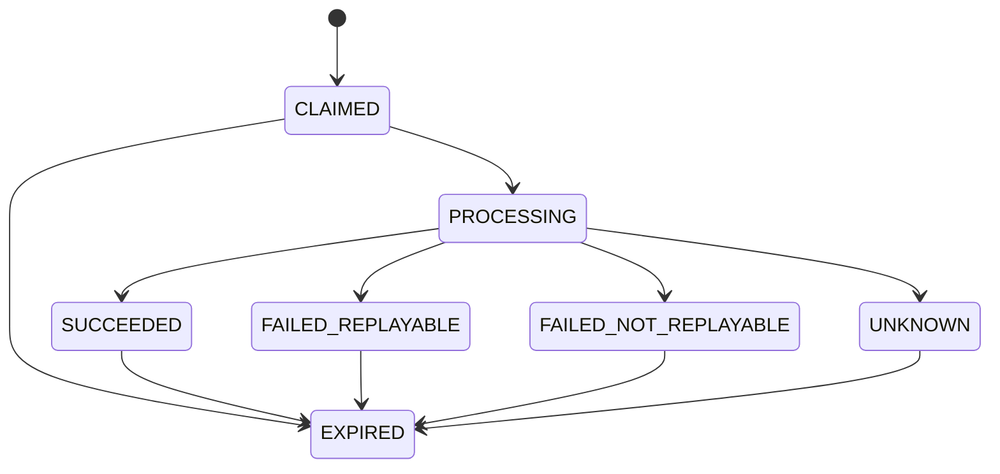
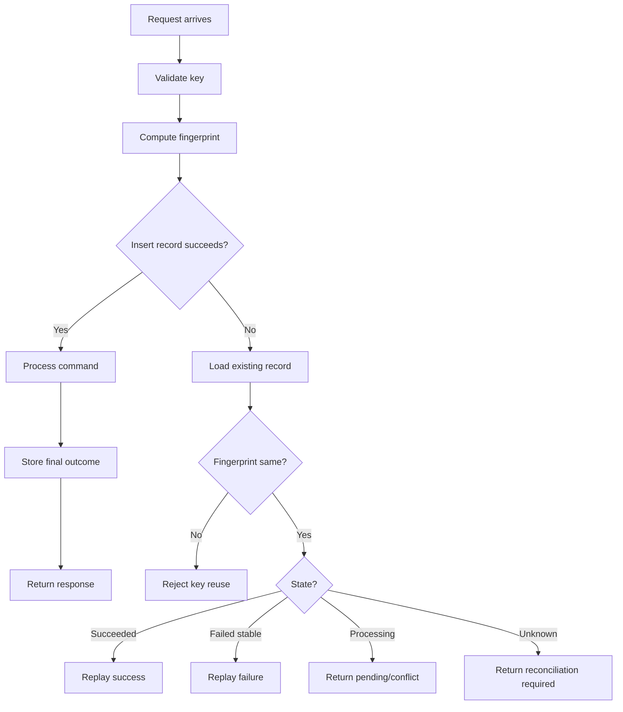
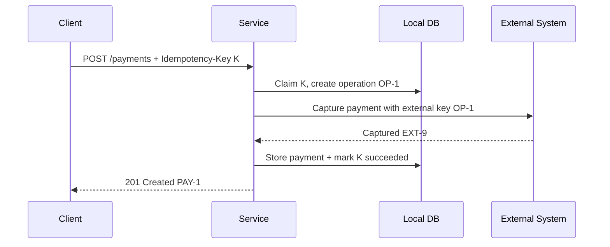

# Part 034 — Idempotency-Key Pattern for Commands

The hardest part of HTTP command APIs is not sending the request.

The hardest part is answering this question after a timeout:

> Did the server apply the side effect or not?

Example:

```http
POST /payments
```

Client sends the request. The server receives it. The server charges the card. Then the connection drops before the response reaches the client.

From the client perspective, the outcome is unknown.

If the client retries blindly, the customer may be charged twice.

The `Idempotency-Key` pattern exists to make retry of non-idempotent commands safer.

The rule:

> A retried command must be recognized as the same command, not treated as a new command.

---

## 1. HTTP Idempotency vs Application Idempotency

HTTP defines some methods as idempotent at the method semantics level. For example, `PUT` and `DELETE` are idempotent in the sense that multiple identical requests should have the same intended effect on the target resource state.

But application reality is more complicated.

A repeated `DELETE /cases/123` may not delete the case twice, but it might still:

- write duplicate audit events,
- send duplicate notifications,
- trigger duplicate downstream messages,
- update `lastModifiedAt`,
- create duplicate workflow comments,
- consume duplicate quota.

A repeated `POST /payments` is worse: it may create another payment.

So distinguish:

| Concept | Meaning |
|---|---|
| HTTP method idempotency | Semantics of repeating a method against a resource |
| Application idempotency | Business side effects are not duplicated |
| Transport retry safety | Client/proxy may retry without causing duplicate harm |
| Idempotency-Key pattern | Server recognizes repeated command identity and returns stable outcome |

For microservices, the important one is application idempotency.

---

## 2. When You Need Idempotency-Key

Require `Idempotency-Key` for commands where all are true:

1. The request changes state.
2. The operation may be retried by client, SDK, gateway, job runner, or operator.
3. Duplicate side effects are harmful.
4. The client may observe timeout, connection reset, `502`, `503`, or unknown response.

Common examples:

- create payment,
- submit application,
- approve case,
- assign case,
- create settlement,
- start enforcement action,
- send notification,
- import data,
- bulk transition,
- publish externally visible command.

Do not reserve idempotency only for payment APIs. Any side-effecting command with retry can duplicate harm.

---

## 3. When You May Not Need It

You may not need `Idempotency-Key` when:

- operation is naturally idempotent by resource state and version,
- duplicate request is harmless,
- client never retries automatically and user can safely re-check state,
- command is internal and protected by another deduplication key,
- operation is a pure query.

But be careful.

"The client never retries" often becomes false later when:

- a load balancer retries,
- a generated SDK adds retry,
- a background worker retries,
- a service mesh retries,
- an operator reruns a failed job,
- a user double-clicks.

If duplicate side effects are expensive, design idempotency at the server boundary.

---

## 4. The Basic Contract

Client sends:

```http
POST /payments
Idempotency-Key: "8e03978e-40d5-43e8-bc93-6894a57f9324"
Content-Type: application/json
```

```json
{
  "customerId": "CUST-123",
  "amount": "100.00",
  "currency": "USD",
  "sourceAccountId": "SRC-1"
}
```

Server stores:

- key,
- key scope,
- request fingerprint,
- processing state,
- response status,
- response body,
- resource ID or operation ID,
- timestamps,
- expiry.

If the same key and same request are seen again, server returns the same final response.

If the same key is reused with a different request, server rejects it.

---

## 5. Key Scope

An idempotency key must have scope.

Bad uniqueness model:

```text
idempotency_key unique globally
```

This can create accidental conflicts across tenants, services, operations, or callers.

Better:

```text
tenant_id + caller_id + operation_name + idempotency_key
```

Example scope fields:

| Field | Why |
|---|---|
| Tenant ID | Prevent cross-tenant collision |
| Caller service/client ID | Prevent unrelated caller collision |
| Operation name | Same key can be reused for different operation class if scoped |
| HTTP method + route template | Useful for routing-level implementation |
| Principal/user ID | Optional; depends on security model |

Recommended uniqueness:

```sql
UNIQUE (tenant_id, caller_id, operation_name, idempotency_key)
```

Avoid placing raw URL path with resource IDs into high-cardinality metric labels, but storing route/operation in the database is fine.

---

## 6. Request Fingerprint

The server must prevent this:

```http
POST /payments
Idempotency-Key: "same-key"
```

First body:

```json
{ "amount": "100.00", "currency": "USD" }
```

Second body:

```json
{ "amount": "999.00", "currency": "USD" }
```

Same key, different command.

That should be rejected.

A request fingerprint is a stable hash of the semantic request payload.

```text
fingerprint = SHA-256(canonical(method, route, tenant, caller, normalized_body))
```

Important details:

- canonicalize JSON before hashing,
- ignore insignificant formatting differences,
- include operation identity,
- include tenant/caller scope if relevant,
- do not include volatile headers like trace ID,
- do not include authentication token value,
- carefully decide whether to include idempotency key itself.

If body is large, store only the hash, not the full body, unless audit/legal requirements demand more.

---

## 7. State Machine

An idempotency record is not just a cache entry.

It has lifecycle.



Recommended states:

| State | Meaning | Retry Behavior |
|---|---|---|
| `CLAIMED` | Key reserved, processing not yet started | Usually return conflict or wait/poll |
| `PROCESSING` | Original request is still running | Return `409`/`425` style response or poll link |
| `SUCCEEDED` | Side effect committed and response stored | Replay stored response |
| `FAILED_REPLAYABLE` | Failure response is stable and should be replayed | Replay stored response |
| `FAILED_NOT_REPLAYABLE` | Failure was before side effect and client may retry with new key | Return stored failure, maybe allow new key |
| `UNKNOWN` | System cannot prove outcome | Require reconciliation |
| `EXPIRED` | Record expired; key may no longer protect retry | Treat as new only if policy allows |

The exact names are not important. The lifecycle is.

---

## 8. Response Replay

For successful completed requests, return the stored response.

Original:

```http
HTTP/1.1 201 Created
Location: /payments/PAY-123
```

```json
{
  "paymentId": "PAY-123",
  "status": "CAPTURED"
}
```

Retry with same key and same fingerprint:

```http
HTTP/1.1 201 Created
Location: /payments/PAY-123
Idempotency-Replayed: true
```

```json
{
  "paymentId": "PAY-123",
  "status": "CAPTURED"
}
```

`Idempotency-Replayed` is not a universal standard header; it is an internal convention you may define. If used, document it.

The important part is stable semantics:

- same status code,
- same resource identity,
- same body shape,
- no duplicate side effect.

---

## 9. What to Store

A practical database table:

```sql
CREATE TABLE idempotency_record (
    id BIGSERIAL PRIMARY KEY,
    tenant_id TEXT NOT NULL,
    caller_id TEXT NOT NULL,
    operation_name TEXT NOT NULL,
    idempotency_key TEXT NOT NULL,
    request_fingerprint TEXT NOT NULL,
    state TEXT NOT NULL,
    http_status INTEGER,
    response_body JSONB,
    resource_type TEXT,
    resource_id TEXT,
    operation_id TEXT,
    error_code TEXT,
    locked_until TIMESTAMPTZ,
    created_at TIMESTAMPTZ NOT NULL,
    updated_at TIMESTAMPTZ NOT NULL,
    expires_at TIMESTAMPTZ NOT NULL,
    UNIQUE (tenant_id, caller_id, operation_name, idempotency_key)
);

CREATE INDEX idx_idempotency_expiry
    ON idempotency_record (expires_at);

CREATE INDEX idx_idempotency_operation
    ON idempotency_record (tenant_id, operation_name, operation_id);
```

Do not store secrets or full sensitive payloads unless there is a reason.

If response body contains sensitive fields, consider storing:

- response resource ID,
- response summary,
- encrypted response body,
- or enough data to rebuild response from durable resource state.

---

## 10. Claim Algorithm

When a request arrives:

```text
1. Validate Idempotency-Key syntax.
2. Compute request fingerprint.
3. Try to insert idempotency record with state=CLAIMED.
4. If insert succeeds, process original request.
5. If insert conflicts, load existing record.
6. If fingerprint differs, reject key reuse.
7. If existing record succeeded, replay response.
8. If existing record is processing, return conflict/pending.
9. If existing record failed with stable response, replay failure.
10. If existing record unknown, require reconciliation.
```

Mermaid view:



---

## 11. Java Model

```java
public record IdempotencyScope(
    String tenantId,
    String callerId,
    String operationName
) {}

public record IdempotencyCommand(
    IdempotencyScope scope,
    String key,
    String fingerprint,
    Duration ttl
) {}

public enum IdempotencyState {
    CLAIMED,
    PROCESSING,
    SUCCEEDED,
    FAILED_REPLAYABLE,
    FAILED_NOT_REPLAYABLE,
    UNKNOWN
}

public record StoredHttpResponse(
    int status,
    Map<String, String> headers,
    String body
) {}

public sealed interface IdempotencyDecision
    permits IdempotencyDecision.Proceed,
            IdempotencyDecision.Replay,
            IdempotencyDecision.RejectConflict,
            IdempotencyDecision.RejectFingerprintMismatch,
            IdempotencyDecision.ReconciliationRequired {

    record Proceed(long recordId) implements IdempotencyDecision {}

    record Replay(StoredHttpResponse response) implements IdempotencyDecision {}

    record RejectConflict(String message) implements IdempotencyDecision {}

    record RejectFingerprintMismatch() implements IdempotencyDecision {}

    record ReconciliationRequired(String operationId) implements IdempotencyDecision {}
}
```

The application use case should not know SQL details.

It should receive a decision.

---

## 12. Repository Claim with Unique Constraint

```java
final class JdbcIdempotencyRepository {

    private final JdbcTemplate jdbc;

    ClaimResult claim(IdempotencyCommand command, Instant now) {
        try {
            Long id = jdbc.queryForObject("""
                INSERT INTO idempotency_record (
                    tenant_id,
                    caller_id,
                    operation_name,
                    idempotency_key,
                    request_fingerprint,
                    state,
                    created_at,
                    updated_at,
                    expires_at
                ) VALUES (?, ?, ?, ?, ?, 'CLAIMED', ?, ?, ?)
                RETURNING id
                """,
                Long.class,
                command.scope().tenantId(),
                command.scope().callerId(),
                command.scope().operationName(),
                command.key(),
                command.fingerprint(),
                now,
                now,
                now.plus(command.ttl())
            );

            return ClaimResult.claimed(id);
        } catch (DuplicateKeyException duplicate) {
            IdempotencyRecord existing = findExisting(command.scope(), command.key());
            return ClaimResult.existing(existing);
        }
    }
}
```

The unique constraint is the concurrency primitive.

Do not implement this with "check then insert" without a unique constraint. Two concurrent retries can pass the check and both execute.

---

## 13. Handling Concurrent Same-Key Requests

Scenario:

1. Client sends request with key `K`.
2. Client times out after 100ms.
3. Client immediately retries with key `K`.
4. Original request is still processing.

The server should not process both.

Possible responses for the second request:

```http
HTTP/1.1 409 Conflict
Content-Type: application/problem+json
Retry-After: 2
```

```json
{
  "type": "https://errors.example.com/idempotency-request-in-progress",
  "title": "Request with this idempotency key is still processing",
  "status": 409,
  "code": "IDEMPOTENCY_REQUEST_IN_PROGRESS"
}
```

Alternative: block briefly waiting for the first request to finish, then replay.

Default recommendation:

> For synchronous APIs, wait only a very short bounded duration. If still processing, return a clear in-progress response with retry guidance.

Never let duplicate same-key requests run concurrently.

---

## 14. Fingerprint Mismatch

If same key but different fingerprint:

```http
HTTP/1.1 422 Unprocessable Content
Content-Type: application/problem+json
```

```json
{
  "type": "https://errors.example.com/idempotency-key-reuse",
  "title": "Idempotency key was reused with a different request",
  "status": 422,
  "code": "IDEMPOTENCY_KEY_REUSED_WITH_DIFFERENT_REQUEST"
}
```

Some systems use `409 Conflict`. Either can be reasonable if standardized internally.

The important invariant:

> Same idempotency key in the same scope must not represent two different commands.

---

## 15. Missing Key

For operations that require idempotency:

```http
HTTP/1.1 400 Bad Request
Content-Type: application/problem+json
```

```json
{
  "type": "https://errors.example.com/missing-idempotency-key",
  "title": "Missing Idempotency-Key header",
  "status": 400,
  "code": "MISSING_IDEMPOTENCY_KEY"
}
```

Do not silently generate a key on the server for retry protection.

A server-generated key protects nothing across client retries because the retry would receive a different key unless the client already has it.

Server-generated operation IDs are useful for tracking, but they are not a replacement for client-provided idempotency keys.

---

## 16. TTL and Expiry

Idempotency records cannot live forever.

TTL depends on business risk.

| Operation | Example TTL |
|---|---:|
| UI command with low duplicate harm | 1–24 hours |
| Payment or external financial command | Days to weeks |
| Bulk regulatory action | Days to months, depending on audit requirement |
| Async import | Until job result retention expires |

After expiry, the server may no longer recognize retry of an old key.

Document this clearly.

Example response when key is expired but resource can be found:

```json
{
  "code": "IDEMPOTENCY_KEY_EXPIRED",
  "message": "The idempotency key expired. Query the resource by business reference before retrying."
}
```

For high-risk commands, combine idempotency key with a business unique constraint.

Example:

```sql
UNIQUE (tenant_id, external_payment_reference)
```

This protects against duplicates even after idempotency TTL.

---

## 17. Idempotency Is Not Only a Cache

A naive implementation:

```text
if key exists: return cached response
else: execute command and cache response
```

This fails under concurrency and crashes.

Correct implementation must handle:

- claim before side effect,
- unique constraint,
- processing state,
- final outcome persistence,
- fingerprint mismatch,
- in-progress retry,
- crash after side effect but before response cache update,
- expiry,
- reconciliation.

The dangerous window:

```text
side effect committed
process crashes
idempotency record not updated
```

If this can happen, the next retry may see `PROCESSING` forever or `UNKNOWN`.

Design for it.

---

## 18. Transaction Boundary Problem

Ideal case:

```text
transaction begins
  claim idempotency record
  apply business state change
  store response outcome
transaction commits
```

This works when idempotency table and business state live in the same database.

But many commands call external systems:

```text
claim key in DB
call external payment provider
store result in DB
```

The external call cannot be rolled back by your database transaction.

Therefore you need one or more of:

- external provider idempotency key,
- local business unique reference,
- outbox worker,
- reconciliation process,
- operation state machine.

For external side effects, pass your idempotency key or derived operation ID downstream if that downstream system supports idempotency.

---

## 19. Safe Local Transaction Pattern

For a local create command:

```java
@Transactional
public CreateCaseResponse createCase(
    Caller caller,
    String idempotencyKey,
    CreateCaseRequest request
) {
    IdempotencyCommand command = idempotencyCommandFactory.create(
        caller,
        "cases.create",
        idempotencyKey,
        request
    );

    IdempotencyDecision decision = idempotencyService.claim(command);

    if (decision instanceof IdempotencyDecision.Replay replay) {
        return responseMapper.fromStored(replay.response());
    }

    if (decision instanceof IdempotencyDecision.Proceed proceed) {
        CaseRecord record = CaseRecord.create(request.subject(), caller.userId());
        caseRepository.save(record);

        CreateCaseResponse response = new CreateCaseResponse(record.id(), record.version());

        idempotencyService.markSucceeded(
            proceed.recordId(),
            StoredHttpResponse.created("/cases/" + record.id(), response)
        );

        return response;
    }

    throw idempotencyExceptionMapper.map(decision);
}
```

This works only if `claim`, business write, and `markSucceeded` are in one transaction.

If `markSucceeded` fails but business write commits, retry behavior becomes ambiguous.

---

## 20. More Robust Command Operation Pattern

For important operations, create an operation record as the durable source of truth.

```sql
CREATE TABLE command_operation (
    operation_id TEXT PRIMARY KEY,
    tenant_id TEXT NOT NULL,
    operation_name TEXT NOT NULL,
    business_reference TEXT,
    state TEXT NOT NULL,
    result_resource_type TEXT,
    result_resource_id TEXT,
    failure_code TEXT,
    created_at TIMESTAMPTZ NOT NULL,
    updated_at TIMESTAMPTZ NOT NULL
);
```

The idempotency record points to operation ID.

```text
idempotency key -> command operation -> business result
```

This lets you:

- recover after crash,
- expose operation status,
- reconcile unknown outcomes,
- replay response from resource state,
- integrate with async jobs.

---

## 21. External Side Effect Pattern

For external systems:



If the service crashes after the external system captures payment but before local DB update, retry must not capture again.

Ways to reduce risk:

- use external idempotency key,
- query external system by operation reference during recovery,
- store operation before external call,
- run reconciliation worker for stuck operations,
- mark uncertain operations as `UNKNOWN` instead of retrying blindly.

---

## 22. Idempotency and Outbox

When command processing emits events, idempotency must include event publication.

Bad:

```text
create case
return 201
publish CaseCreated event later without dedup
```

Retry may create duplicate events or miss events depending on crash timing.

Better:

```text
transaction:
  claim idempotency key
  create case
  insert outbox event with stable event ID
  store idempotency response
commit

outbox worker:
  publish event
  mark outbox row sent
```

Use stable event IDs:

```text
event_id = operation_id + ":case-created"
```

Downstream consumers should still be idempotent, but the producer should not generate new event identity for a replayed command.

---

## 23. Bulk Idempotency

Bulk commands need special handling.

Operation-level key:

```http
POST /cases:bulkApprove
Idempotency-Key: "bulk-K"
```

Per-item identity:

```json
{
  "items": [
    { "clientItemId": "line-001", "caseId": "CASE-1" },
    { "clientItemId": "line-002", "caseId": "CASE-2" }
  ]
}
```

Recommended storage:

```sql
CREATE TABLE bulk_item_result (
    operation_id TEXT NOT NULL,
    client_item_id TEXT NOT NULL,
    target_id TEXT NOT NULL,
    state TEXT NOT NULL,
    result_resource_id TEXT,
    failure_code TEXT,
    retryable BOOLEAN,
    created_at TIMESTAMPTZ NOT NULL,
    updated_at TIMESTAMPTZ NOT NULL,
    PRIMARY KEY (operation_id, client_item_id)
);
```

Retry behavior:

- same key + same payload returns same bulk response,
- succeeded items are not reprocessed,
- failed stable items are returned as failures,
- in-progress async job returns job status,
- different payload with same key is rejected.

For per-item retry, clients can submit a new bulk request containing only failed retryable items with a new operation idempotency key.

---

## 24. Idempotency for Natural Resource Keys

Sometimes resource creation has a natural business key.

Example:

```http
PUT /case-submissions/SUB-123
```

This may be naturally idempotent because the client chooses the resource ID.

But compare:

```http
POST /case-submissions
```

Here the server chooses the ID. Retrying can create duplicates unless the request includes:

- idempotency key,
- external reference,
- or unique business key.

Using client-selected resource IDs can be a good design when the caller has a stable business identifier.

But do not force fake client-generated IDs just to avoid idempotency. Sometimes an explicit `Idempotency-Key` is clearer.

---

## 25. Idempotency Key Format

Good keys:

- high entropy,
- opaque,
- generated by caller,
- stable across retry of same command,
- not reused for different commands,
- not meaningful business secrets.

Examples:

```text
"8e03978e-40d5-43e8-bc93-6894a57f9324"
"01J0ZK7HD6ZMM1VTF1K9H7EK2M"
```

Bad keys:

```text
"123"
"today"
"retry"
"user@example.com"
"case-123"
```

Do not put PII in keys. Keys appear in logs, traces, gateway metadata, and support tooling.

---

## 26. Header Syntax Note

The IETF HTTPAPI working group has worked on an `Idempotency-Key` HTTP header field draft. The draft describes the header as a way to make non-idempotent methods such as `POST` and `PATCH` fault-tolerant. As of the searched 2025 draft version, it is an Internet-Draft rather than a finalized RFC.

Practical implication:

- Use `Idempotency-Key` because it is a common and readable convention.
- Document your exact behavior.
- Do not assume every gateway/library implements it automatically.
- Treat syntax, expiry, fingerprinting, and error scenarios as your service contract.

---

## 27. Security Considerations

Idempotency storage can become an attack surface.

Risks:

- attacker floods unique keys to fill storage,
- attacker reuses known key to infer prior response,
- key contains PII,
- response cache stores sensitive body unencrypted,
- fingerprint excludes tenant/caller and allows cross-caller replay,
- long TTL leaks business activity.

Controls:

- authenticate before idempotency lookup where possible,
- scope key by tenant/caller/operation,
- rate limit unique keys per caller,
- enforce key length and format,
- expire records,
- encrypt sensitive stored response,
- avoid logging full key when not needed,
- store key hash if operationally acceptable.

Example logging:

```json
{
  "event": "idempotency_replay",
  "operation": "payments.create",
  "callerId": "checkout-service",
  "keyHashPrefix": "a7f24c9e",
  "state": "SUCCEEDED"
}
```

---

## 28. Interaction with Retry Policy

Idempotency does not mean "retry forever".

Client retry policy still needs:

- timeout budget,
- max attempts,
- exponential backoff,
- jitter,
- retryable status classification,
- deadline propagation,
- circuit breaker awareness.

Server idempotency protects against duplicate side effects. It does not protect the service from retry storms.

Good client behavior:

```text
maxAttempts = 2 or 3
backoff = exponential with jitter
totalDeadline = user/request budget
same Idempotency-Key for every attempt of same command
new Idempotency-Key only for a new user intent
```

Bad behavior:

```text
retry every second forever with new key each time
```

New key means new command.

---

## 29. Idempotency and UI Double Submit

Common flow:

1. User clicks "Submit".
2. Browser sends command with key `K`.
3. User double-clicks or refreshes.
4. Same command is sent again.

If the frontend generated a stable key per form submission, duplicate submit is safe.

If the frontend generates a new key per click, the server sees two commands.

For UI clients:

- generate key when form/session action is created,
- persist key through retry/reload where reasonable,
- disable button as UX improvement, not as correctness mechanism,
- display existing operation result on replay.

Correctness belongs on the server.

---

## 30. Gateway and Service Mesh Interaction

Gateways and service meshes may retry requests.

Be careful with automatic retries on non-idempotent methods.

Policy:

- do not auto-retry `POST` unless idempotency key is present and operation is known safe,
- do not let gateway generate new key,
- propagate `Idempotency-Key` to the owning service,
- ensure logs/traces do not leak sensitive key content,
- document which layer owns idempotency enforcement.

Usually the application service should own enforcement because it understands operation semantics and durable business state.

The gateway can enforce presence and basic format.

---

## 31. Error Taxonomy

Recommended error codes:

| Code | Meaning | Retry With Same Key? |
|---|---|---|
| `MISSING_IDEMPOTENCY_KEY` | Required key not provided | No, resend with key |
| `INVALID_IDEMPOTENCY_KEY` | Bad syntax/length | No, use valid key |
| `IDEMPOTENCY_KEY_REUSED_WITH_DIFFERENT_REQUEST` | Fingerprint mismatch | No |
| `IDEMPOTENCY_REQUEST_IN_PROGRESS` | Original request still processing | Yes, after delay |
| `IDEMPOTENCY_RECORD_EXPIRED` | Key is too old | Usually no; query state first |
| `IDEMPOTENCY_OUTCOME_UNKNOWN` | Server cannot prove result | Do not retry blindly; reconcile |

Map these to Problem Details.

Example:

```json
{
  "type": "https://errors.example.com/idempotency-outcome-unknown",
  "title": "Command outcome is unknown",
  "status": 409,
  "code": "IDEMPOTENCY_OUTCOME_UNKNOWN",
  "operationId": "OP-123",
  "detail": "The operation may have reached an external dependency. Query operation status before retrying."
}
```

---

## 32. Testing Strategy

Required tests:

1. Missing key rejected for command requiring idempotency.
2. Invalid key syntax rejected.
3. First request processes normally.
4. Same key + same payload replays response.
5. Same key + different payload rejected.
6. Concurrent same-key requests process only once.
7. Timeout simulation followed by retry returns final result.
8. Failure before side effect behaves as designed.
9. Failure after side effect but before response storage enters recovery path.
10. Expired key behavior is documented and tested.
11. Idempotency scope prevents cross-caller replay.
12. Stored response does not expose sensitive data to wrong caller.
13. Outbox event identity is stable across replay.
14. Bulk retry does not reprocess succeeded items.

Concurrency test idea:

```java
int attempts = 20;
ExecutorService executor = Executors.newFixedThreadPool(attempts);
CountDownLatch start = new CountDownLatch(1);

List<Future<CreatePaymentResponse>> futures = IntStream.range(0, attempts)
    .mapToObj(i -> executor.submit(() -> {
        start.await();
        return client.createPayment("same-key", request);
    }))
    .toList();

start.countDown();

List<CreatePaymentResponse> responses = futures.stream()
    .map(Futures::getUnchecked)
    .toList();

assertThat(paymentRepository.countByExternalReference(request.externalReference()))
    .isEqualTo(1);

assertThat(responses)
    .extracting(CreatePaymentResponse::paymentId)
    .containsOnly(responses.getFirst().paymentId());
```

The exact test helper does not matter. The invariant does.

---

## 33. Operational Runbook

Operators need answers:

- How many idempotency records are stuck in `PROCESSING`?
- Which operations are `UNKNOWN`?
- How many replays happen per operation?
- Are clients reusing keys with different payloads?
- Is idempotency storage growing too fast?
- Are records expiring before clients retry?
- Is one caller generating excessive unique keys?
- Which downstream dependency causes unknown outcomes?

Metrics:

```text
idempotency.claims.total{operation,outcome}
idempotency.replays.total{operation}
idempotency.fingerprint_mismatch.total{operation,caller}
idempotency.in_progress.total{operation}
idempotency.unknown.total{operation}
idempotency.records.active{operation}
idempotency.expired.total{operation}
```

Alerts:

- high fingerprint mismatch rate,
- stuck `PROCESSING` records above threshold,
- unknown outcomes above zero for high-risk operation,
- storage cleanup lag,
- caller unique-key flood.

---

## 34. Cleanup Job

Records need expiry.

```java
final class IdempotencyCleanupJob {

    private final IdempotencyRepository repository;
    private final Clock clock;

    void run() {
        Instant now = clock.instant();
        int deleted = repository.deleteExpiredBefore(now.minus(Duration.ofMinutes(10)), 10_000);
        log.info("idempotency cleanup deleted {} expired records", deleted);
    }
}
```

Use chunked deletion.

Do not run one huge delete that locks the table and harms command traffic.

For regulated systems, replace deletion with archival or tombstoning if audit policy requires retention.

---

## 35. Common Anti-Patterns

### Anti-Pattern 1: Key Exists Means Success

Bad:

```java
if (idempotencyRepository.exists(key)) {
    return ok();
}
```

Existence is not success. The record may be processing, failed, unknown, or expired.

### Anti-Pattern 2: Cache Only After Success

Bad:

```java
response = process();
cache.put(key, response);
```

Concurrent requests can process before cache is populated.

### Anti-Pattern 3: New Key on Retry

Bad client behavior:

```java
for (int attempt = 0; attempt < 3; attempt++) {
    client.post(request, UUID.randomUUID().toString());
}
```

This creates three different commands.

### Anti-Pattern 4: Fingerprint Raw JSON String

Raw JSON hashing treats formatting or field order as different commands.

Canonicalize.

### Anti-Pattern 5: Infinite TTL

Idempotency table becomes permanent command cache.

Use TTL, archive, or business-key uniqueness.

### Anti-Pattern 6: Idempotency Without Business Constraints

Idempotency TTL eventually expires. High-value operations still need natural uniqueness where possible.

---

## 36. Practical Checklist

Before shipping a command endpoint:

- Does it require `Idempotency-Key`?
- What is the key scope?
- What is the key format and max length?
- What is the TTL?
- Is request fingerprint canonicalized?
- What happens on fingerprint mismatch?
- What happens while original request is processing?
- Is response replayed exactly or reconstructed?
- Are sensitive responses encrypted or minimized?
- Is there a unique database constraint?
- Is claim atomic?
- Does the transaction include business state and idempotency outcome?
- If external side effect exists, is downstream idempotency supported?
- Is there reconciliation for unknown outcomes?
- Does retry use the same key?
- Are gateway retries safe?
- Are metrics and alerts defined?
- Is cleanup safe?

---

## 37. Mental Model

Idempotency is not this:

```text
cache response by key
```

It is this:

```text
same user intent + same operation + same payload + same key
  => one durable command outcome
  => safely replayable response
  => no duplicate side effect
```

If the server cannot prove that, it should not pretend the retry is safe.

---

## 38. Key Takeaways

- The main enemy is unknown outcome after timeout or connection failure.
- `Idempotency-Key` makes retries safer for side-effecting commands.
- Same key must mean same command within a defined scope.
- Store request fingerprint to reject accidental key reuse.
- Use a unique constraint to make claim atomic.
- Model lifecycle: claimed, processing, succeeded, failed, unknown, expired.
- Replay stable final responses.
- Do not process concurrent same-key requests twice.
- External side effects require downstream idempotency or reconciliation.
- Bulk endpoints need both operation-level and item-level idempotency thinking.
- Idempotency reduces duplicate side effects; it does not replace retry budgets, rate limits, or circuit breakers.

---

## References

- RFC 9110 — HTTP Semantics: https://www.rfc-editor.org/rfc/rfc9110.html
- RFC 9457 — Problem Details for HTTP APIs: https://www.rfc-editor.org/rfc/rfc9457.html
- IETF HTTPAPI Internet-Draft — The Idempotency-Key HTTP Header Field: https://datatracker.ietf.org/doc/html/draft-ietf-httpapi-idempotency-key-header
- AWS Builders Library — Timeouts, retries, and backoff with jitter: https://aws.amazon.com/builders-library/timeouts-retries-and-backoff-with-jitter/
- Stripe API idempotent requests documentation: https://docs.stripe.com/api/idempotent_requests
