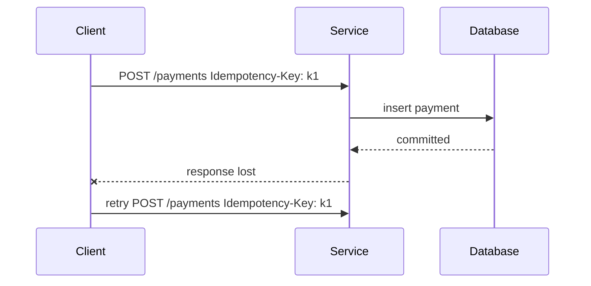
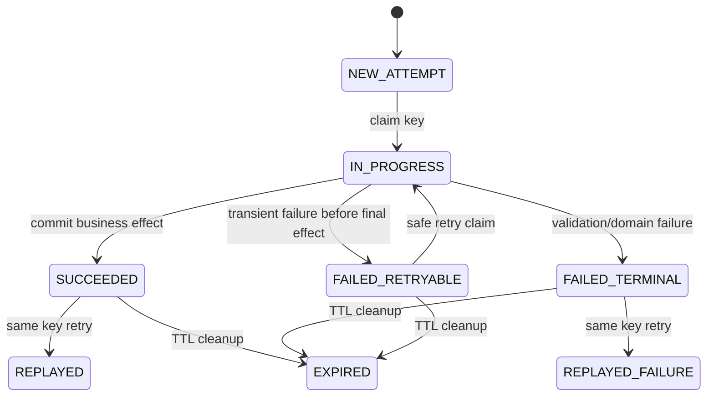
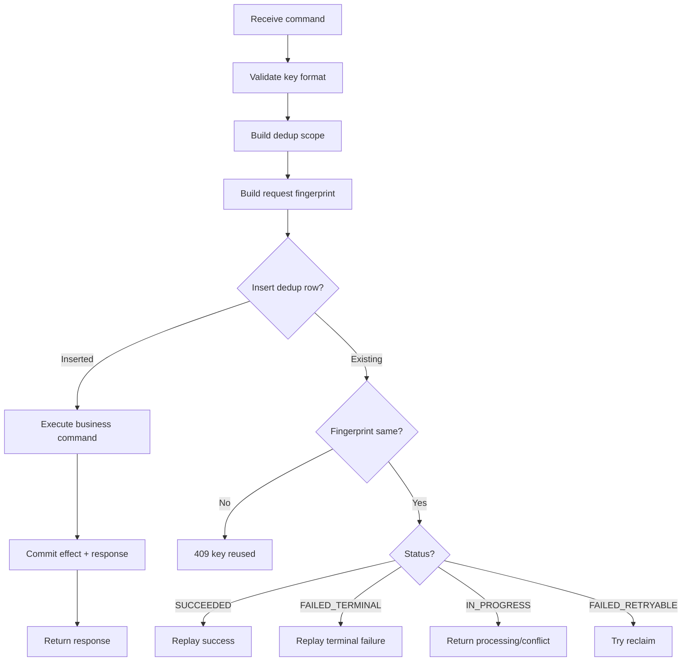
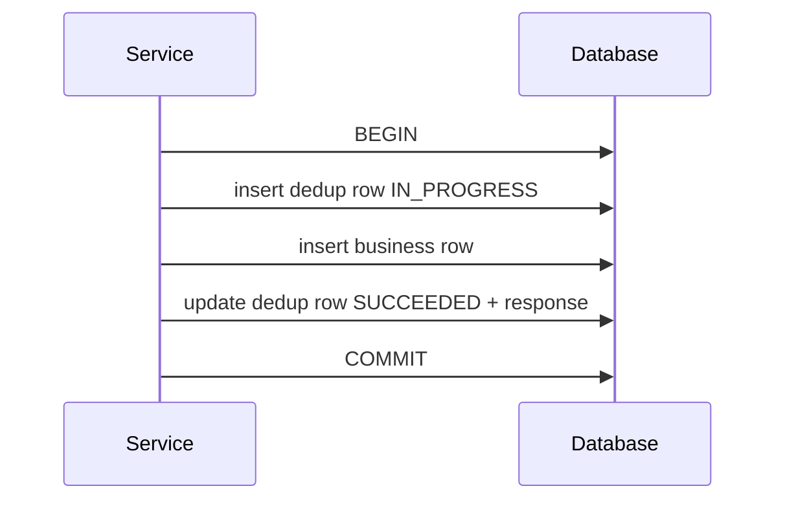
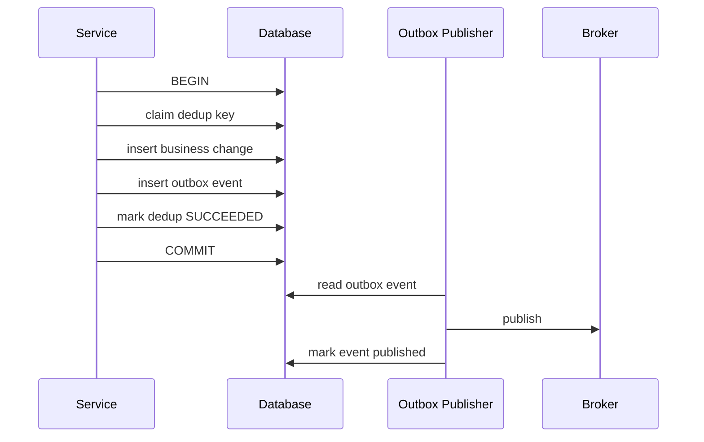
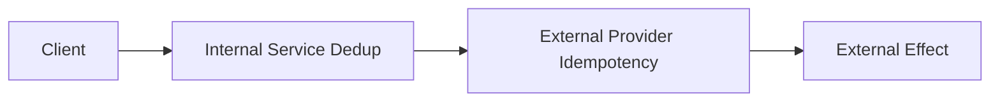
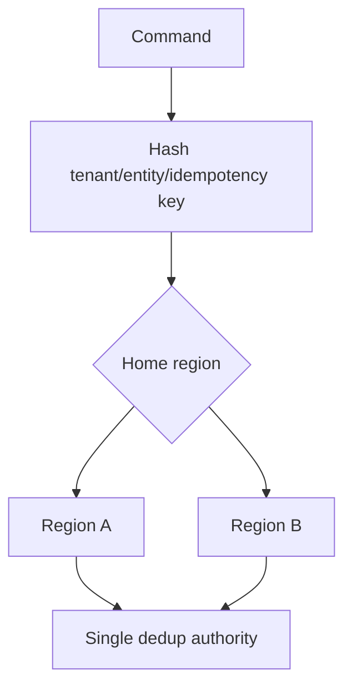

# Part 035 — Request Deduplication and Replay Safety

A distributed system will eventually ask the same service to do the same thing more than once.

That is not a bug.

It is a normal consequence of:

- timeout,
- retry,
- connection reset,
- gateway timeout,
- load balancer retry,
- user double submit,
- client-side retry after app restart,
- job retry,
- batch retry,
- workflow engine retry,
- message replay,
- deployment rollback,
- regional failover.

The real question is not:

> Can duplicates happen?

The real question is:

> What will the service do when duplicates happen?

A production service must not depend on "the caller will never retry."

It must define duplicate behavior.

---

## 1. The Core Model

Request deduplication is the server-side discipline of recognizing repeated attempts of the same logical request and preventing duplicate business effects.

The simplest rule:

> Same command identity, same effective result.

That does not always mean the same HTTP response body byte-for-byte. But it does mean the same business outcome.

Example:

```http
POST /case-escalations
Idempotency-Key: esc-req-01HZY6VB5P4B2P1
```

First attempt:

- creates escalation `ESC-1001`,
- writes audit event,
- publishes `CaseEscalated`,
- returns `201 Created`.

Second attempt with the same key:

- must not create `ESC-1002`,
- must not write duplicate audit event,
- must not publish duplicate downstream event,
- should return the original result or a stable representation of it.

This is the difference between **transport retry** and **business duplication**.

---

## 2. Deduplication vs Idempotency vs Replay

These terms are often mixed. Keep them separate.

| Term | Meaning | Example |
|---|---|---|
| Idempotency | Repeating the same operation has the same intended effect | `PUT /users/123/profile` with same profile |
| Deduplication | Detect duplicate command attempts and suppress duplicate execution | Same `Idempotency-Key` for `POST /payments` |
| Replay | Re-sending an old request or message after time has passed | Client retry after timeout; Kafka replay |
| Response replay | Returning stored outcome for a previously completed request | Return original `201` result for repeated key |
| Concurrency control | Prevent conflicting simultaneous updates | `If-Match` with version/ETag |
| Exactly-once effect | Business effect happens once despite at-least-once delivery | Outbox + idempotent consumer + dedup store |

A good system usually needs more than one.

Deduplication is not a replacement for concurrency control.

Concurrency control answers:

> Is this update still valid against the current state?

Deduplication answers:

> Have I already processed this logical command?

They solve different problems.

---

## 3. Where Duplicates Come From

### 3.1 Client retry after unknown outcome

The client sends a command. The server commits. The response is lost.



Without deduplication, the retry can create a second payment.

With deduplication, the service returns the first outcome.

---

### 3.2 Gateway or proxy retry

Even when the application code does not retry, infrastructure might.

If a proxy retries an unsafe method without an application-level idempotency key, it can duplicate side effects.

Production rule:

> Do not allow transparent retries of unsafe commands unless there is a deduplication contract.

---

### 3.3 User double submit

For user-triggered workflows, duplicate intent can come from UI behavior.

Examples:

- double-click submit,
- browser refresh,
- mobile app resend,
- offline app sync,
- frontend retry after timeout.

The backend should still own deduplication because UI-only protection is not reliable.

---

### 3.4 Batch retry

Bulk endpoints amplify duplication.

```http
POST /case-escalations:batchCreate
```

If the batch has 100 items and item 73 times out, what should the client retry?

The whole batch?

Only failed items?

How does the server know item 1 was already completed?

Dedup must support item-level identity when the operation is bulk.

---

### 3.5 Workflow retry

Workflow engines retry tasks.

A handler invoked by a workflow engine must assume at-least-once execution unless the engine explicitly guarantees otherwise at the business boundary.

The same handler may be called again after process restart, worker crash, incident recovery, or manual replay.

---

### 3.6 Message replay crossing into HTTP

A consumer may process an event and call an HTTP command.

If the event is replayed, the HTTP command may be repeated.


If the HTTP command is not dedup-safe, replaying the event can duplicate the downstream effect.

---

## 4. The Request Identity Model

Dedup starts with identity.

A server must know what "same request" means.

A weak identity model creates either false positives or false negatives.

| Identity component | Purpose |
|---|---|
| Tenant/account scope | Prevent cross-tenant key collision |
| Caller/client identity | Prevent one caller replaying another caller's key |
| Operation name | Prevent same key used across unrelated commands |
| Idempotency key | Caller-provided logical request identity |
| Request fingerprint | Detect key reuse with different payload |
| Resource target | Scope command to a target entity when applicable |
| Time window/TTL | Bound storage and replay period |

A robust dedup key is not just:

```text
idempotency_key
```

It is closer to:

```text
tenant_id + caller_id + operation_name + idempotency_key
```

And then store a request fingerprint separately.

---

## 5. Why Request Fingerprint Matters

A caller might accidentally reuse the same key with a different payload.

Example:

First request:

```json
{
  "caseId": "CASE-100",
  "targetQueue": "FRAUD_REVIEW"
}
```

Second request, same key:

```json
{
  "caseId": "CASE-100",
  "targetQueue": "LEGAL_REVIEW"
}
```

This is not a duplicate.

It is a key collision or caller bug.

The server should reject it.

Common response:

```http
409 Conflict
Content-Type: application/problem+json
```

```json
{
  "type": "https://errors.example.internal/idempotency-key-reused",
  "title": "Idempotency key reused with different request",
  "status": 409,
  "detail": "The same idempotency key was previously used with a different request fingerprint.",
  "instance": "/case-escalations"
}
```

The fingerprint should be based on a canonical representation of relevant request fields.

Do not hash raw JSON bytes unless canonicalization is guaranteed.

Bad fingerprint inputs:

- raw JSON string with unstable field order,
- headers that change per attempt,
- timestamps generated by client,
- trace IDs,
- signatures,
- irrelevant metadata.

Good fingerprint inputs:

- operation name,
- stable target resource,
- stable command fields,
- stable caller identity,
- semantic version of the command shape.

---

## 6. Dedup State Machine

A dedup entry should have a lifecycle.



Recommended states:

| State | Meaning | Retry behavior |
|---|---|---|
| `IN_PROGRESS` | Another attempt is processing the same key | return `409`, `425`, or `202` depending on policy |
| `SUCCEEDED` | Business effect completed | replay stored successful response |
| `FAILED_TERMINAL` | Request was validly rejected | replay failure or return same error |
| `FAILED_RETRYABLE` | Processing failed before final effect | allow retry after lock expiry |
| `EXPIRED` | Dedup record removed or no longer usable | treat as new only if business safe |

The dangerous state is `IN_PROGRESS`.

If a second request arrives while the first is running, do not execute the command twice.

---

## 7. Storage Design

A relational store works well because dedup requires uniqueness and transactional behavior.

Example PostgreSQL table:

```sql
CREATE TABLE request_deduplication (
    tenant_id           TEXT        NOT NULL,
    caller_id           TEXT        NOT NULL,
    operation_name      TEXT        NOT NULL,
    idempotency_key     TEXT        NOT NULL,
    request_fingerprint TEXT        NOT NULL,

    status              TEXT        NOT NULL,
    response_status     INTEGER,
    response_headers    JSONB,
    response_body       JSONB,

    resource_type       TEXT,
    resource_id         TEXT,

    error_code          TEXT,
    error_message       TEXT,

    locked_until        TIMESTAMPTZ,
    created_at          TIMESTAMPTZ NOT NULL DEFAULT now(),
    updated_at          TIMESTAMPTZ NOT NULL DEFAULT now(),
    expires_at          TIMESTAMPTZ NOT NULL,

    PRIMARY KEY (
      tenant_id,
      caller_id,
      operation_name,
      idempotency_key
    )
);

CREATE INDEX idx_request_deduplication_expires_at
    ON request_deduplication (expires_at);
```

Important choices:

| Column | Why it exists |
|---|---|
| `request_fingerprint` | Reject same key with different command |
| `status` | Know whether to execute, wait, replay, or reject |
| `response_*` | Response replay |
| `resource_type/resource_id` | Reconstruct response without storing sensitive body |
| `locked_until` | Recover from crashed `IN_PROGRESS` attempt |
| `expires_at` | Storage cleanup |

---

## 8. The Claim-Execute-Record Algorithm

A safe server-side flow:



Pseudo-code:

```java
public HttpResponse<?> handle(CreateEscalationRequest request, RequestContext ctx) {
    DedupScope scope = DedupScope.of(
        ctx.tenantId(),
        ctx.callerId(),
        "CreateCaseEscalation",
        ctx.idempotencyKey()
    );

    String fingerprint = fingerprintService.fingerprint(request);

    DedupDecision decision = deduplicationService.claim(scope, fingerprint);

    return switch (decision.kind()) {
        case FIRST_ATTEMPT -> executeAndRecord(scope, request);
        case REPLAY_SUCCESS -> replay(decision.recordedResponse());
        case REPLAY_FAILURE -> replay(decision.recordedFailure());
        case KEY_REUSED_WITH_DIFFERENT_PAYLOAD -> conflict();
        case ALREADY_IN_PROGRESS -> stillProcessing();
        case RETRYABLE_RECLAIMED -> executeAndRecord(scope, request);
    };
}
```

The transaction boundary is critical.

At minimum, the dedup claim and business effect must be coordinated so a crash does not leave the system unable to decide what happened.

---

## 9. Transaction Boundary Options

### Option A — Same database transaction

Use when the dedup table and business table are in the same database.



This is the simplest strong design.

Benefits:

- easy uniqueness,
- easy response replay,
- clear recovery,
- strong local consistency.

Limitations:

- only works for local database side effects,
- external calls need additional care.

---

### Option B — Business effect plus transactional outbox

Use when the command publishes an event.



This prevents a duplicate HTTP retry from creating duplicate outbox events.

Downstream consumers should still be idempotent because broker delivery is usually at-least-once.

---

### Option C — External side effect with provider idempotency

Use when the command calls an external side-effecting API.

Example:

- payment provider,
- notification provider,
- document signing provider,
- sanctions screening provider,
- external regulator gateway.

The local service should pass a stable idempotency key to the external provider if supported.



If the provider does not support idempotency, you need a stronger local workflow:

1. create local intent,
2. perform external call once from a controlled worker,
3. record provider response,
4. reconcile unknown outcomes,
5. expose stable status to callers.

Do not blindly retry external side effects.

---

## 10. Response Replay Strategies

There are three common strategies.

### 10.1 Store full response

Store:

- status code,
- relevant headers,
- response body.

Good for:

- small responses,
- command APIs,
- stable JSON result,
- fast replay.

Bad for:

- sensitive data,
- large response,
- response containing time-sensitive fields,
- fields requiring current authorization filtering.

### 10.2 Store resource pointer

Store:

- resource type,
- resource ID,
- outcome status.

On replay, re-fetch the resource and build response.

Good for:

- large resource representation,
- privacy-sensitive response,
- response shape changes,
- current authorization filtering.

Bad for:

- response may not be byte-identical,
- resource may have changed,
- replay may become slower.

### 10.3 Store minimal outcome

Store only:

- command accepted/completed,
- resource ID,
- domain outcome code.

Good for internal services where caller only needs stable outcome.

Bad if consumers expect exact original response.

Recommended default:

> Store minimal outcome plus resource pointer. Store full response only when the response is small, non-sensitive, and operationally useful.

---

## 11. Handling `IN_PROGRESS`

When a duplicate request arrives while the original is still running, you have options.

| Strategy | Response | Use when |
|---|---|---|
| Return conflict | `409 Conflict` | Caller should retry later with same key |
| Return accepted | `202 Accepted` | Command is async or may still complete |
| Wait briefly | `200/201` replay if original completes quickly | Low latency operations with bounded wait |
| Return locked | `423 Locked` | WebDAV-specific; usually avoid for generic APIs |
| Return too early | `425 Too Early` | Usually tied to HTTP early data semantics; avoid unless you know why |

Pragmatic internal default:

```http
409 Conflict
Retry-After: 1
Content-Type: application/problem+json
```

```json
{
  "type": "https://errors.example.internal/request-in-progress",
  "title": "Request already in progress",
  "status": 409,
  "detail": "A request with the same idempotency key is already being processed. Retry with the same key.",
  "extensions": {
    "retryable": true
  }
}
```

For async commands:

```http
202 Accepted
Location: /operations/op-123
```

The important rule:

> Never execute the same in-progress command concurrently.

---

## 12. TTL and Expiry

Dedup records cannot live forever unless storage is designed for it.

TTL depends on business risk.

| Operation type | Suggested retention |
|---|---|
| Low-risk internal command | hours to days |
| Payment/financial movement | days to months depending on reconciliation needs |
| Regulatory action | long retention, maybe audit-retained |
| Batch job command | at least job replay window |
| External provider call | at least provider idempotency retention window |

Expiry is not just cleanup.

Expiry changes semantics.

If a retry arrives after expiry, the service may treat it as new.

That may be unsafe for high-risk commands.

For high-risk operations, store a permanent business uniqueness key separate from short-term dedup.

Example:

```sql
CREATE UNIQUE INDEX uq_payment_business_reference
    ON payment (tenant_id, merchant_reference);
```

Dedup prevents retry duplication.

Business uniqueness prevents semantic duplication.

You often need both.

---

## 13. Multi-Region Deduplication

Multi-region active-active systems make dedup harder.

If the same request can hit two regions at once, local-region dedup tables are insufficient.

Options:

| Option | Behavior | Trade-off |
|---|---|---|
| Route key to home region | Stronger dedup | Adds routing complexity |
| Globally consistent store | Stronger correctness | Higher latency/cost |
| Region-scoped keys | Simpler | Duplicates possible across regions |
| Reconciliation-based dedup | Eventually correct | Side effect may already happen |
| External provider idempotency | Helps external calls | Depends on provider support |

For high-risk commands, prefer deterministic routing by dedup key or business entity.



Do not assume eventual replication prevents duplicates.

Two regions can accept the same key before replication converges.

---

## 14. Dedup in Bulk APIs

For batch commands, use item-level identity.

Example request:

```json
{
  "batchId": "batch-2026-07-05-001",
  "items": [
    {
      "itemKey": "case-100-escalate",
      "caseId": "CASE-100",
      "targetQueue": "FRAUD_REVIEW"
    },
    {
      "itemKey": "case-101-escalate",
      "caseId": "CASE-101",
      "targetQueue": "LEGAL_REVIEW"
    }
  ]
}
```

Dedup scope:

```text
tenant_id + caller_id + operation_name + batch_id + item_key
```

Response:

```json
{
  "batchId": "batch-2026-07-05-001",
  "results": [
    {
      "itemKey": "case-100-escalate",
      "status": "SUCCEEDED",
      "resourceId": "ESC-1001"
    },
    {
      "itemKey": "case-101-escalate",
      "status": "FAILED",
      "errorCode": "CASE_NOT_ESCALATABLE"
    }
  ]
}
```

Avoid a single dedup key for the entire batch if partial retry is required.

A whole-batch key is acceptable only when the whole batch is atomic.

---

## 15. Dedup and Authorization

Authorization must be part of the design.

A dangerous bug:

1. User A submits request with key `k1`.
2. User A loses access.
3. User A retries `k1`.
4. Server replays sensitive response without re-checking access.

Options:

| Policy | Behavior |
|---|---|
| Replay without auth recheck | Fast but risky |
| Recheck current access before replay | Safer for sensitive data |
| Replay minimal outcome only | Reduces data leakage |
| Scope key by caller identity | Prevents cross-caller replay |

Recommended internal default:

- scope dedup key by tenant and caller/client identity,
- re-check current authorization before returning sensitive response,
- store minimal outcome instead of full response for sensitive commands.

---

## 16. Dedup and Audit

A duplicate request should not create duplicate business audit events.

But it may create technical audit or access logs.

Separate these:

| Event type | Duplicate retry behavior |
|---|---|
| Business audit event | Once per logical command |
| Outbox domain event | Once per logical command |
| Access log | Once per HTTP attempt |
| Security audit | Depends on policy |
| Metric counter | Count both attempts and dedup hits separately |

Useful metrics:

```text
http.server.requests{operation="createEscalation", outcome="dedup_replay"}
dedup.claims.total
dedup.replays.total
dedup.in_progress.total
dedup.key_reuse_conflicts.total
dedup.expired_retries.total
```

A replay is not invisible. It is operationally important.

---

## 17. Java Implementation Skeleton

### 17.1 Dedup scope

```java
public record DedupScope(
    String tenantId,
    String callerId,
    String operationName,
    String idempotencyKey
) {
    public DedupScope {
        requireNonBlank(tenantId, "tenantId");
        requireNonBlank(callerId, "callerId");
        requireNonBlank(operationName, "operationName");
        requireNonBlank(idempotencyKey, "idempotencyKey");
    }

    private static void requireNonBlank(String value, String field) {
        if (value == null || value.isBlank()) {
            throw new IllegalArgumentException(field + " must not be blank");
        }
    }
}
```

### 17.2 Dedup decision

```java
public sealed interface DedupDecision permits
    DedupDecision.FirstAttempt,
    DedupDecision.ReplaySuccess,
    DedupDecision.ReplayFailure,
    DedupDecision.InProgress,
    DedupDecision.KeyReuseConflict,
    DedupDecision.RetryableReclaimed {

    record FirstAttempt() implements DedupDecision {}

    record ReplaySuccess(RecordedResponse response) implements DedupDecision {}

    record ReplayFailure(RecordedResponse response) implements DedupDecision {}

    record InProgress(Instant retryAfter) implements DedupDecision {}

    record KeyReuseConflict(String existingFingerprint, String currentFingerprint)
        implements DedupDecision {}

    record RetryableReclaimed() implements DedupDecision {}
}
```

### 17.3 Repository contract

```java
public interface RequestDeduplicationRepository {
    DedupDecision claim(DedupScope scope, String requestFingerprint, Instant lockedUntil, Instant expiresAt);

    void recordSuccess(DedupScope scope, RecordedResponse response, ResourcePointer pointer);

    void recordTerminalFailure(DedupScope scope, RecordedResponse response);

    void recordRetryableFailure(DedupScope scope, String errorCode, String message);
}
```

### 17.4 Service wrapper

```java
public final class DeduplicatedCommandExecutor {
    private final RequestDeduplicationRepository repository;
    private final Clock clock;

    public <T> T execute(
        DedupScope scope,
        String fingerprint,
        CommandResponseMapper<T> responseMapper,
        Supplier<CommandExecutionResult> command
    ) {
        Instant now = clock.instant();

        DedupDecision decision = repository.claim(
            scope,
            fingerprint,
            now.plusSeconds(30),
            now.plus(Duration.ofDays(7))
        );

        return switch (decision) {
            case DedupDecision.FirstAttempt ignored ->
                executeFirstAttempt(scope, responseMapper, command);

            case DedupDecision.RetryableReclaimed ignored ->
                executeFirstAttempt(scope, responseMapper, command);

            case DedupDecision.ReplaySuccess replay ->
                responseMapper.fromRecorded(replay.response());

            case DedupDecision.ReplayFailure replay ->
                throw responseMapper.toException(replay.response());

            case DedupDecision.InProgress inProgress ->
                throw new RequestAlreadyInProgressException(inProgress.retryAfter());

            case DedupDecision.KeyReuseConflict conflict ->
                throw new IdempotencyKeyReuseException();
        };
    }

    private <T> T executeFirstAttempt(
        DedupScope scope,
        CommandResponseMapper<T> responseMapper,
        Supplier<CommandExecutionResult> command
    ) {
        try {
            CommandExecutionResult result = command.get();
            repository.recordSuccess(scope, result.recordedResponse(), result.resourcePointer());
            return responseMapper.fromExecution(result);
        } catch (TerminalCommandException ex) {
            repository.recordTerminalFailure(scope, responseMapper.recordFailure(ex));
            throw ex;
        } catch (RuntimeException ex) {
            repository.recordRetryableFailure(scope, "TRANSIENT_FAILURE", ex.getMessage());
            throw ex;
        }
    }
}
```

This is only a skeleton. Real implementation must align transaction boundaries carefully.

---

## 18. SQL Claim Pattern

One practical approach:

```sql
INSERT INTO request_deduplication (
    tenant_id,
    caller_id,
    operation_name,
    idempotency_key,
    request_fingerprint,
    status,
    locked_until,
    expires_at
)
VALUES (
    :tenant_id,
    :caller_id,
    :operation_name,
    :idempotency_key,
    :request_fingerprint,
    'IN_PROGRESS',
    :locked_until,
    :expires_at
)
ON CONFLICT (
    tenant_id,
    caller_id,
    operation_name,
    idempotency_key
)
DO NOTHING;
```

If insert succeeds, this is the first attempt.

If insert does not succeed, read the existing row:

```sql
SELECT *
FROM request_deduplication
WHERE tenant_id = :tenant_id
  AND caller_id = :caller_id
  AND operation_name = :operation_name
  AND idempotency_key = :idempotency_key;
```

Then decide:

```text
if fingerprint differs -> 409 key reuse
if status SUCCEEDED -> replay
if status FAILED_TERMINAL -> replay failure
if status IN_PROGRESS and locked_until > now -> in progress
if status IN_PROGRESS and locked_until <= now -> attempt reclaim
```

Reclaim pattern:

```sql
UPDATE request_deduplication
SET locked_until = :new_locked_until,
    updated_at = now()
WHERE tenant_id = :tenant_id
  AND caller_id = :caller_id
  AND operation_name = :operation_name
  AND idempotency_key = :idempotency_key
  AND request_fingerprint = :request_fingerprint
  AND status IN ('IN_PROGRESS', 'FAILED_RETRYABLE')
  AND locked_until <= now();
```

Only one process should win the reclaim.

---

## 19. Common Failure Modes

### 19.1 Dedup row committed but business effect not committed

If the dedup row says `IN_PROGRESS` forever, retries are blocked.

Mitigation:

- `locked_until`,
- reclaim logic,
- transactionally record final outcome,
- operational alert on stale `IN_PROGRESS`.

---

### 19.2 Business effect committed but dedup result not recorded

This is dangerous.

If retry cannot discover the completed business effect, it may execute again.

Mitigation:

- same transaction for dedup and business effect,
- business uniqueness constraint,
- resource pointer lookup,
- reconciliation job.

---

### 19.3 Duplicate event published

If retry creates a second outbox event, downstream duplication happens.

Mitigation:

- insert business change and outbox event in same transaction as dedup claim,
- outbox event unique key tied to command identity,
- downstream idempotent consumer.

---

### 19.4 Different payload accepted under same key

This is a caller bug that corrupts dedup semantics.

Mitigation:

- request fingerprint,
- `409 Conflict`,
- metric and alert if frequent.

---

### 19.5 Dedup storage hot key

A buggy caller may spam the same key.

Mitigation:

- rate limit by caller,
- fast replay path,
- bounded wait,
- reject malformed keys,
- alert on repeated `IN_PROGRESS` conflicts.

---

### 19.6 TTL too short

A client retries after dedup record expires.

Mitigation:

- TTL aligned with retry/reconciliation window,
- business uniqueness constraints,
- archived dedup record for high-risk operations.

---

## 20. Testing Deduplication

Minimum tests:

| Scenario | Expected behavior |
|---|---|
| First request succeeds | Business effect created once |
| Same key same payload retry | Original result replayed |
| Same key different payload | `409 Conflict` |
| Duplicate while first in progress | No second effect |
| Timeout after commit then retry | Original result replayed |
| Failure before commit then retry | Command can execute safely |
| Terminal validation failure retry | Same failure returned |
| Batch partial retry | Completed items not duplicated |
| Expired key retry | Behavior matches documented policy |
| Authorization changed before replay | Sensitive data not leaked |

Concurrency test:

```java
@Test
void duplicateConcurrentRequestsCreateOnlyOneEscalation() throws Exception {
    int attempts = 20;
    ExecutorService executor = Executors.newFixedThreadPool(attempts);

    List<Callable<HttpResponse<String>>> calls = IntStream.range(0, attempts)
        .mapToObj(i -> (Callable<HttpResponse<String>>) () -> client.createEscalation(
            "tenant-a",
            "caller-a",
            "same-idempotency-key",
            request
        ))
        .toList();

    List<HttpResponse<String>> responses = executor.invokeAll(calls).stream()
        .map(future -> uncheckedGet(future))
        .toList();

    assertThat(escalationRepository.countByCaseId("CASE-100")).isEqualTo(1);
    assertThat(outboxRepository.countByAggregateId("CASE-100")).isEqualTo(1);
}
```

---

## 21. Operational Runbook

When duplicate-related incidents occur, ask:

1. Which operation?
2. Which tenant/caller?
3. Which idempotency key?
4. Was the duplicate same payload or different payload?
5. Did dedup record exist?
6. Was status `IN_PROGRESS`, `SUCCEEDED`, or expired?
7. Was business uniqueness violated?
8. Was an outbox event duplicated?
9. Did an external provider receive duplicate calls?
10. Was there a retry storm or gateway retry?

Useful queries:

```sql
SELECT status, count(*)
FROM request_deduplication
WHERE created_at > now() - interval '1 hour'
GROUP BY status;

SELECT tenant_id, caller_id, operation_name, idempotency_key, status, locked_until
FROM request_deduplication
WHERE status = 'IN_PROGRESS'
  AND locked_until < now()
ORDER BY locked_until ASC
LIMIT 100;

SELECT tenant_id, caller_id, operation_name, count(*)
FROM request_deduplication
WHERE created_at > now() - interval '1 hour'
GROUP BY tenant_id, caller_id, operation_name
ORDER BY count(*) DESC
LIMIT 20;
```

---

## 22. Design Checklist

Before exposing a side-effecting command API, answer:

- Does the operation require `Idempotency-Key`?
- What is the dedup scope?
- What fields are included in the request fingerprint?
- What is the TTL?
- What happens during `IN_PROGRESS`?
- Is the response replayed or reconstructed?
- Are authorization checks applied on replay?
- Is business uniqueness also enforced?
- Is outbox publication dedup-safe?
- Are external calls idempotent or reconciled?
- Are metrics emitted for first attempt, replay, conflict, and stale lock?
- Is duplicate behavior documented in OpenAPI?
- Are concurrency tests included?
- Is there a cleanup/reconciliation job?

---

## 23. The Real Lesson

Request deduplication is not a small helper around `POST`.

It is a business safety boundary.

Without it, retry is dangerous.

Without retry, distributed communication is fragile.

So a mature service does both:

```text
retryable client behavior
+ dedup-safe server behavior
+ idempotent business model
+ observable replay behavior
```

That is how HTTP command APIs survive real networks.

---

## References

- RFC 9110 — HTTP Semantics: https://datatracker.ietf.org/doc/html/rfc9110
- RFC 9457 — Problem Details for HTTP APIs: https://www.rfc-editor.org/rfc/rfc9457.html
- IETF HTTPAPI Idempotency-Key Header draft: https://datatracker.ietf.org/doc/html/draft-ietf-httpapi-idempotency-key-header
- Stripe — Designing robust and predictable APIs with idempotency: https://stripe.com/blog/idempotency
- Stripe API idempotent requests: https://docs.stripe.com/api/idempotent_requests
- AWS Builders Library — Timeouts, retries, and backoff with jitter: https://aws.amazon.com/builders-library/timeouts-retries-and-backoff-with-jitter/
