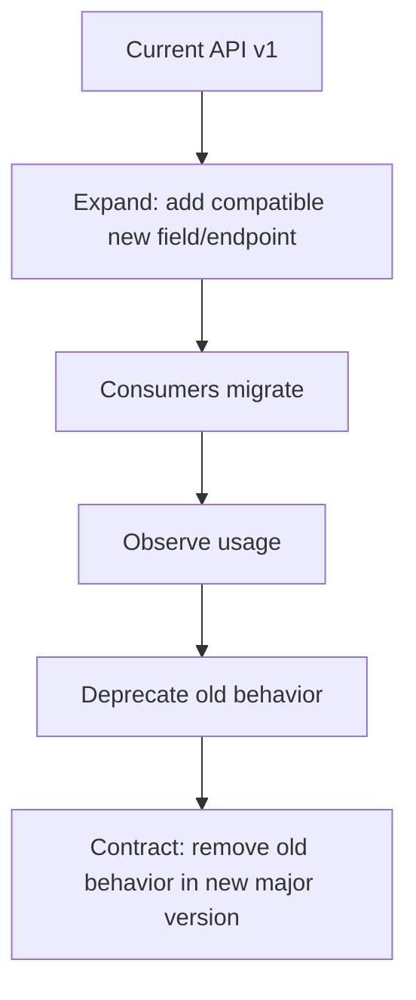
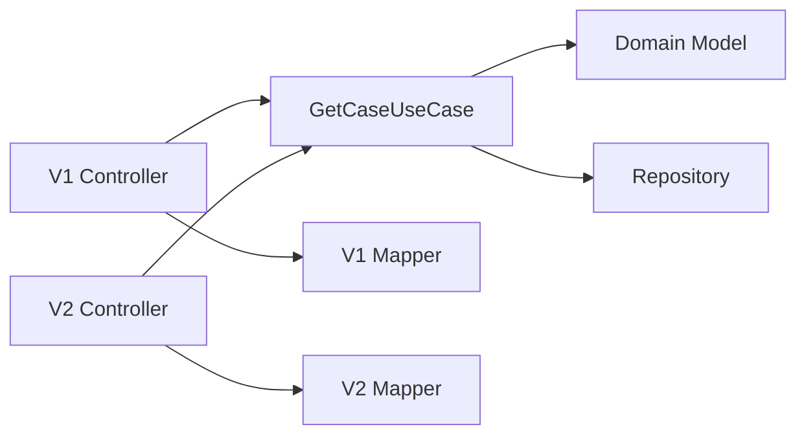
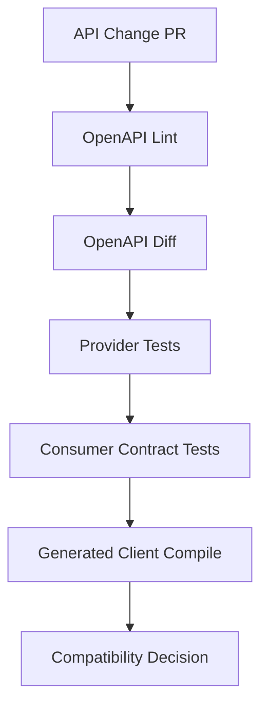
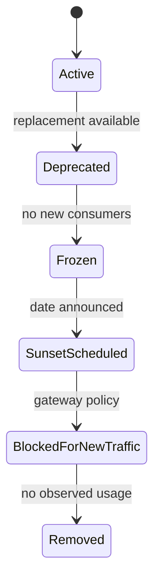
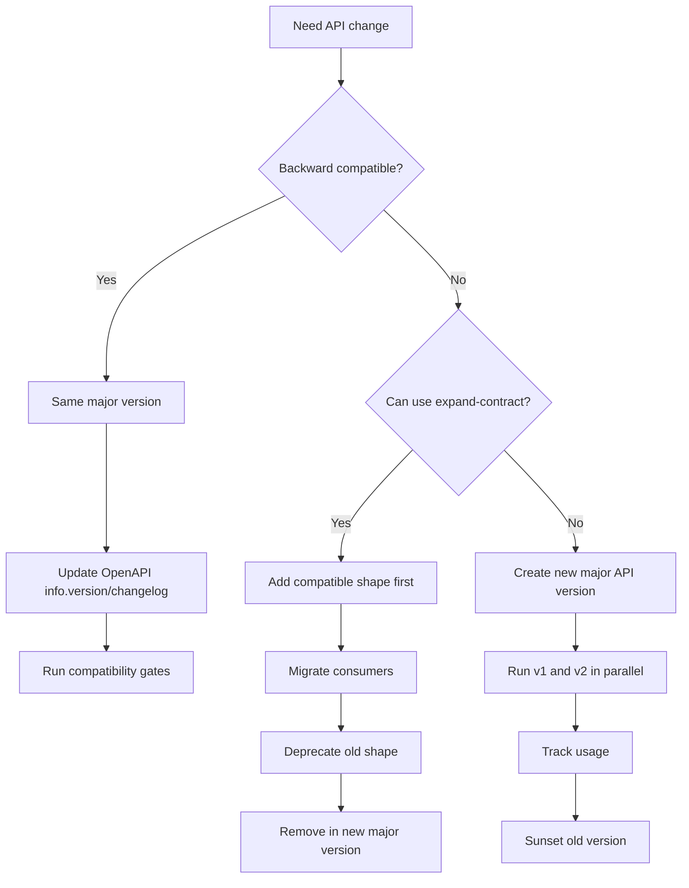

# Part 036 — HTTP API Versioning for Internal Services

API versioning is not about choosing between:

```text
/v1/orders
```

and:

```http
Accept: application/vnd.example.orders+json;version=1
```

That is only the visible syntax.

The real problem is compatibility.

A service evolves.

Consumers evolve at different speeds.

Deployments are staggered.

Rollbacks happen.

Generated clients lag.

Old workers keep running.

Batch jobs call old endpoints.

A versioning strategy answers:

> How can the provider change without breaking consumers that are still correct according to the old contract?

For internal microservices, versioning is not decoration.

It is operational risk management.

---

## 1. Contract Is More Than JSON Shape

An HTTP API contract includes:

| Contract area | Examples |
|---|---|
| Endpoint address | path, method, host, gateway route |
| Request shape | fields, types, requiredness, validation rules |
| Response shape | fields, nullability, enum values, pagination model |
| Status code semantics | `200`, `201`, `202`, `400`, `409`, `412`, `429`, `503` |
| Error body | problem type, error code, field violations |
| Headers | idempotency, trace, precondition, pagination, rate limit |
| Behavior | side effects, ordering, dedup, consistency |
| Performance envelope | timeout budget, page size, payload size |
| Security assumptions | auth requirements, scope checks, tenant isolation |
| Observability | operation name, trace semantics, metric labels |
| Deprecation rules | sunset, replacement, support window |

Breaking a consumer does not require changing JSON.

You can break a consumer by:

- changing status code,
- changing retryability,
- tightening validation,
- changing default sort order,
- removing an error code,
- adding a mandatory header,
- changing pagination token meaning,
- making a previously synchronous command asynchronous,
- changing authorization requirements,
- changing idempotency semantics,
- changing timeout envelope.

Versioning must govern behavior, not just schema.

---

## 2. The First Rule: Avoid Versions When Additive Compatibility Is Enough

The best API version is often no new version.

If the change is backward-compatible, evolve the same endpoint.

Examples of usually compatible changes:

| Change | Usually compatible? | Notes |
|---|---:|---|
| Add optional response field | Yes | Consumers must ignore unknown fields |
| Add optional request field | Yes | Server must preserve old behavior when absent |
| Add new endpoint | Yes | Existing consumers unaffected |
| Add new enum value | Risky | Many generated clients break or map badly |
| Add pagination metadata | Usually yes | If old fields preserved |
| Add new error detail extension | Yes | If old error code/status preserved |
| Increase max page size | Usually yes | Could affect memory if clients depend on old size |
| Add rate-limit headers | Yes | Unless required for correctness |

The provider should optimize for:

```text
compatible evolution first,
major version only when compatibility is impossible or unsafe.
```

Versioning every small change is not maturity.

It is often contract design failure.

---

## 3. Breaking Change Taxonomy

A breaking change is any change that can make an existing correct consumer fail.

### 3.1 Structural breaking changes

Examples:

- remove response field,
- rename field,
- change type,
- make optional request field required,
- remove endpoint,
- remove status code behavior,
- change error format.

### 3.2 Semantic breaking changes

Examples:

- `POST /case-escalations` used to be sync, now returns `202 Accepted`,
- `GET /cases` default sort changes from `createdAt desc` to `updatedAt desc`,
- `DELETE` used to soft-delete, now hard-deletes,
- retrying same idempotency key used to replay success, now returns `409`,
- `409` used to mean domain conflict, now means duplicate-in-progress.

Semantic breaks are more dangerous because schema diff tools may not detect them.

### 3.3 Operational breaking changes

Examples:

- timeout envelope changes from 200 ms to 3 seconds,
- max page size reduced from 500 to 50,
- endpoint begins returning `429`,
- compression required,
- request body limit reduced,
- endpoint moved behind a different gateway with different auth.

### 3.4 Security breaking changes

Examples:

- new scope required,
- tenant resolution header changes,
- service account no longer allowed,
- response now redacts fields required by old consumers.

Security changes may be necessary, but they are still compatibility events.

---

## 4. Change Classification Matrix

Use a matrix before every API change.

| Change | Compatible? | Needs new major version? | Needs consumer comms? |
|---|---:|---:|---:|
| Add optional response field | Yes | No | Usually no |
| Add required response field | Usually yes | No | Maybe |
| Remove response field | No | Yes or deprecate first | Yes |
| Rename field | No | Yes or add new + deprecate old | Yes |
| Change field type | No | Yes | Yes |
| Add optional request field | Yes | No | Maybe |
| Add required request field | No | Yes or phased defaulting | Yes |
| Tighten validation | Often no | Maybe | Yes |
| Loosen validation | Usually yes | No | Maybe |
| Add enum value | Risky | Maybe | Yes |
| Remove enum value | No | Yes | Yes |
| Change status code | Often no | Maybe | Yes |
| Add new error code | Risky | Maybe | Yes |
| Remove error code | No | Yes | Yes |
| Change pagination token | No | Yes or dual token | Yes |
| Change sorting default | No | Maybe | Yes |
| Make sync command async | No | Yes | Yes |
| Add idempotency requirement | No for old clients | Needs phased rollout | Yes |

This table is intentionally conservative.

Internal consumers often use generated clients, strict deserializers, enums, switch statements, and assumptions that are not visible in OpenAPI.

---

## 5. Where to Put the Version

There are several approaches.

### 5.1 URI path version

```http
GET /v1/cases/CASE-100
GET /v2/cases/CASE-100
```

Pros:

- obvious,
- easy gateway routing,
- easy logs/metrics,
- easy documentation,
- works well with generated clients.

Cons:

- version becomes part of resource address,
- can encourage over-versioning,
- hard to version only one operation.

Good for internal service APIs where operational clarity matters.

---

### 5.2 Header version

```http
GET /cases/CASE-100
X-Api-Version: 2
```

Pros:

- clean paths,
- version negotiation possible,
- route can remain stable.

Cons:

- less visible,
- easier to forget,
- gateway/routing/metrics need header-aware setup,
- caching/proxy behavior must be carefully configured.

Good when gateway and tooling are mature.

---

### 5.3 Media type version

```http
Accept: application/vnd.example.case.v2+json
```

Pros:

- aligns with representation versioning,
- can version response shape independently.

Cons:

- more complex,
- less familiar to many internal teams,
- generated client tooling may be less convenient.

Good for public APIs or representation-heavy APIs.

---

### 5.4 Query parameter version

```http
GET /cases/CASE-100?api-version=2
```

Pros:

- easy to test manually,
- visible.

Cons:

- weak semantic fit,
- can pollute business query parameters,
- can interact poorly with caching and logs.

Use sparingly.

---

### 5.5 Hostname version

```http
https://case-v1.internal
https://case-v2.internal
```

Pros:

- strong operational isolation,
- easy traffic splitting.

Cons:

- heavy,
- duplicates infrastructure,
- not ideal for many APIs.

Good for platform-level migrations or incompatible runtime stacks.

---

## 6. Recommended Internal Default

For most Java internal microservices:

1. Prefer backward-compatible evolution without endpoint version bump.
2. Use path major version for rare breaking API families.
3. Keep minor/patch changes in OpenAPI `info.version`, artifact version, and changelog.
4. Do not create `/v2` for every additive field.
5. Do not keep old major versions forever without ownership and telemetry.
6. Route `/v1` and `/v2` explicitly through gateway/service mesh.
7. Track consumers per operation and version.

Example:

```http
GET /v1/cases/{caseId}
GET /v2/cases/{caseId}
```

OpenAPI:

```yaml
openapi: 3.2.0
info:
  title: Case Service Internal API
  version: 2.4.1
paths:
  /v2/cases/{caseId}:
    get:
      operationId: getCaseV2
```

Important distinction:

| Version | Meaning |
|---|---|
| Path major version `/v2` | Breaking API family version |
| OpenAPI `info.version` | Version of the API description/document |
| Java artifact version | Version of generated/client library |
| Service deployment version | Runtime build currently deployed |

These are related but not identical.

Do not conflate them.

---

## 7. Expand-Contract Migration

The safest way to introduce breaking changes is not a big bang.

Use expand-contract.



Example: rename `ownerId` to `assigneeId`.

Bad migration:

```json
{
  "assigneeId": "U-123"
}
```

Old consumers expected:

```json
{
  "ownerId": "U-123"
}
```

Safer migration:

Phase 1:

```json
{
  "ownerId": "U-123",
  "assigneeId": "U-123"
}
```

Phase 2:

- consumers migrate to `assigneeId`,
- provider tracks field usage if possible,
- OpenAPI marks `ownerId` deprecated.

Phase 3:

- remove `ownerId` only in `/v2`,
- keep `/v1` until sunset.

---

## 8. Parallel Version Runtime Patterns

### 8.1 Controller duplication

```text
api/
  v1/
    CaseControllerV1.java
    CaseResponseV1.java
  v2/
    CaseControllerV2.java
    CaseResponseV2.java
application/
  GetCaseUseCase.java
domain/
  Case.java
```

Good:

- explicit,
- easy to reason about,
- clean generated docs.

Bad:

- duplicated controller code,
- can diverge.

Use when versions differ materially.

---

### 8.2 Shared application use case, versioned adapters



This is the recommended default.

The domain/application layer should not become versioned just because HTTP representations are versioned.

Version at the edge.

---

### 8.3 Single controller with conditional response

```java
@GetMapping("/cases/{id}")
public ResponseEntity<?> getCase(
    @PathVariable String id,
    @RequestHeader("X-Api-Version") int version
) {
    CaseView view = useCase.get(id);

    if (version == 1) {
        return ResponseEntity.ok(v1Mapper.toResponse(view));
    }

    return ResponseEntity.ok(v2Mapper.toResponse(view));
}
```

This can work for small differences.

But it becomes messy when behavior diverges.

Avoid large `if (version)` logic inside core business flows.

---

## 9. Java DTO Versioning

Do not expose domain objects directly.

Bad:

```java
public record Case(
    String id,
    CaseStatus status,
    String internalRiskScore,
    String regulatoryRoutingHint
) {}
```

Good:

```java
public record CaseResponseV1(
    String id,
    String status,
    String ownerId
) {}

public record CaseResponseV2(
    String id,
    String status,
    String assigneeId,
    String lifecycleState
) {}
```

Mapper:

```java
public final class CaseHttpMapper {
    public CaseResponseV1 toV1(CaseView view) {
        return new CaseResponseV1(
            view.id(),
            view.status().externalCode(),
            view.assigneeId()
        );
    }

    public CaseResponseV2 toV2(CaseView view) {
        return new CaseResponseV2(
            view.id(),
            view.status().externalCode(),
            view.assigneeId(),
            view.lifecycleState().externalCode()
        );
    }
}
```

The versioned DTO is a stability boundary.

It protects consumers from internal refactoring.

---

## 10. Versioning Request Commands

Versioning commands is more sensitive than versioning queries.

A query shape change can break reads.

A command shape change can break side effects.

Example v1:

```json
{
  "caseId": "CASE-100",
  "targetQueue": "FRAUD_REVIEW"
}
```

Example v2:

```json
{
  "caseId": "CASE-100",
  "assignment": {
    "queue": "FRAUD_REVIEW",
    "priority": "HIGH"
  },
  "reasonCode": "SUSPICIOUS_ACTIVITY"
}
```

Rules:

- old command semantics must remain stable,
- idempotency key scope should include operation version,
- request fingerprint must include command version,
- validation changes require rollout care,
- error codes must remain meaningful.

Dedup scope example:

```text
tenant_id + caller_id + operation_name + major_version + idempotency_key
```

Do not allow `/v1` and `/v2` commands to collide on the same dedup key unless intentionally designed.

---

## 11. Versioning Error Models

Errors are part of the contract.

Bad versioning:

```json
{
  "message": "Invalid request"
}
```

Then later:

```json
{
  "error": {
    "code": "CASE_NOT_FOUND"
  }
}
```

This breaks clients.

Better:

```json
{
  "type": "https://errors.example.internal/case-not-found",
  "title": "Case not found",
  "status": 404,
  "detail": "Case CASE-100 was not found.",
  "extensions": {
    "code": "CASE_NOT_FOUND",
    "retryable": false
  }
}
```

When evolving errors:

| Change | Compatibility |
|---|---|
| Add new extension field | Usually compatible |
| Change `type` URI | Breaking if clients depend on it |
| Change `status` | Often breaking |
| Remove `code` | Breaking |
| Add new `code` | Risky |
| Change retryability | Breaking operationally |

Versioning errors matters because clients often encode retry, fallback, alerting, and user messaging based on error codes.

---

## 12. Versioning Pagination

Pagination is a contract.

Breaking changes:

- changing token format without dual support,
- changing default sort order,
- changing page size limits,
- changing whether deleted records appear,
- changing stable ordering guarantee,
- changing filter semantics.

Safer approach:

```http
GET /v1/cases?pageToken=old-token
GET /v2/cases?pageToken=new-token
```

Or include token version inside an opaque token:

```json
{
  "v": 2,
  "sort": ["createdAt", "id"],
  "last": ["2026-07-05T01:00:00Z", "CASE-100"]
}
```

Then sign/encrypt/encode it.

Consumers should not parse page tokens.

Providers should not silently reinterpret old tokens under new semantics.

---

## 13. Versioning and OpenAPI

OpenAPI describes HTTP APIs in a machine-readable way.

Use it as a compatibility artifact.

Recommended repository structure:

```text
api/
  openapi/
    case-service-v1.yaml
    case-service-v2.yaml
  changelog/
    2026-07-05-add-assignee-id.md
```

Use OpenAPI for:

- generated client compatibility,
- documentation,
- diffing,
- contract tests,
- stub generation,
- API review,
- governance gates.

But remember:

> OpenAPI describes a lot, not everything.

It may not fully capture:

- timeout guarantees,
- retry semantics,
- idempotency behavior,
- consistency model,
- authorization nuance,
- side effects,
- operational constraints.

Put those in descriptions, extensions, ADRs, and tests.

Example extension:

```yaml
paths:
  /v1/case-escalations:
    post:
      operationId: createCaseEscalation
      x-communication-policy:
        idempotencyRequired: true
        retryableByClient: true
        timeoutBudgetMs: 500
        sideEffects:
          - create escalation
          - write audit event
          - publish CaseEscalated
```

---

## 14. Compatibility Gates

A mature service should not rely on humans to spot breaking changes manually.

Useful gates:

| Gate | Purpose |
|---|---|
| OpenAPI diff | Detect structural contract breaks |
| Consumer contract tests | Verify real consumer expectations |
| Generated client compile test | Catch enum/type/nullability breaks |
| Stub replay tests | Verify old client against new provider |
| Canary consumer traffic | Observe live compatibility |
| Deprecation usage telemetry | Know who still uses old version |
| Error/status code regression tests | Preserve operational behavior |

CI flow:



Do not merge API changes that accidentally break known consumers.

---

## 15. Consumer Telemetry

Versioning without consumer telemetry becomes guesswork.

At minimum, record:

- API version,
- operation ID,
- caller service,
- client library version,
- response status,
- error code,
- idempotency use,
- deprecated field/endpoint usage if detectable.

Example metric dimensions:

```text
http.server.requests{
  service="case-service",
  api_version="v1",
  operation="getCase",
  caller="workflow-service",
  status="200"
}
```

Deprecation dashboard:

| API | Version | Caller | Requests/day | Last seen | Owner |
|---|---|---|---:|---|---|
| Case API | v1 | workflow-service | 130k | 2026-07-05 | Case Platform |
| Case API | v1 | reporting-job | 9k | 2026-07-05 | Data Platform |
| Case API | v2 | portal-service | 240k | 2026-07-05 | Portal |

Do not sunset an internal API until you know who still calls it.

---

## 16. Deprecation and Sunset

A deprecation lifecycle:



Deprecation notice should include:

- what is deprecated,
- replacement endpoint,
- migration guide,
- compatibility differences,
- deadline,
- owner,
- support channel,
- risk of non-migration.

HTTP can include deprecation-related headers where appropriate, but internal systems should not depend only on headers.

Use:

- API catalog,
- Slack/Teams announcements,
- ADR,
- generated client warnings,
- dashboard,
- gateway policy,
- owner escalation.

---

## 17. Versioning Generated Clients

Generated clients are useful but can hide compatibility issues.

Rules:

1. Generated code is not the domain boundary.
2. Wrap generated clients in a service-owned client adapter.
3. Version generated artifacts explicitly.
4. Compile known consumers against new generated clients before rollout.
5. Do not force all consumers to upgrade for additive server changes.
6. Avoid generated enum exhaustiveness traps.

Generated enum trap:

```java
switch (status) {
    case OPEN -> ...
    case CLOSED -> ...
}
```

If provider adds:

```text
SUSPENDED
```

Old client may fail.

Safer:

```java
default -> handleUnknownStatus(status);
```

OpenAPI enum changes are not always harmless in generated clients.

---

## 18. Versioning Status Codes and Retries

Changing status codes can change client behavior.

Example:

Old:

```http
503 Service Unavailable
Retry-After: 1
```

New:

```http
500 Internal Server Error
```

A client may stop retrying.

Example:

Old:

```http
409 Conflict
```

Meaning: duplicate request in progress, retry with same idempotency key.

New:

```http
409 Conflict
```

Meaning: domain conflict, do not retry.

Same code, different semantics.

This is a semantic breaking change.

Define error `type` and retryability explicitly.

```json
{
  "type": "https://errors.example.internal/request-in-progress",
  "status": 409,
  "extensions": {
    "code": "REQUEST_IN_PROGRESS",
    "retryable": true
  }
}
```

---

## 19. Versioning Security Behavior

Security changes can be compatible at the API shape level and breaking at runtime.

Examples:

- endpoint now requires `case:read:sensitive`,
- service-to-service caller must send audience-specific token,
- tenant header no longer accepted,
- field-level redaction added.

Security migration strategy:

1. add telemetry for who would fail under new rule,
2. run in shadow/evaluation mode,
3. notify owners,
4. add support for new credential/scope,
5. require new behavior for new version,
6. enforce old version only after migration window or emergency exception.

Do not surprise internal consumers with security breaks unless there is an active incident or compliance requirement.

---

## 20. Versioning and Deployment

API versioning must survive deployment realities.

During rolling deploy:

```text
old pod + new pod + old client + new client
```

All combinations may exist.

Compatibility matrix:

| Client | Server | Must work? |
|---|---|---:|
| old client | old server | Yes |
| old client | new server | Yes during compatible rollout |
| new client | old server | Only if rollout ordered carefully |
| new client | new server | Yes |

For backward-compatible provider-first rollout:

1. deploy server that accepts old and new shape,
2. deploy clients using new shape,
3. observe migration,
4. remove old shape in later version.

For client-first rollout, the old server must already tolerate the new request shape, which is often not true.

Provider-first is usually safer for additive server changes.

---

## 21. Internal API Versioning Policy Template

```md
# API Versioning Policy

## Scope
Applies to service-to-service HTTP APIs owned by this service.

## Compatibility
The service may add optional response fields, optional request fields, new endpoints, and new error extensions without major version bump.

## Breaking Changes
The following require a new major API version or explicit migration plan:
- removed or renamed fields
- changed field types
- newly required request fields
- changed status code semantics
- changed error code semantics
- changed idempotency behavior
- changed pagination token semantics
- changed authorization requirements
- changed side effects

## Version Placement
Major versions are represented in the path: `/v1`, `/v2`.

## Deprecation
Deprecated versions require:
- replacement endpoint
- migration guide
- consumer telemetry
- owner notification
- sunset date
- exception process

## OpenAPI
Each major version has a separate OpenAPI document.

## Governance
API changes require:
- OpenAPI diff
- provider tests
- relevant consumer contract tests
- migration ADR for breaking changes
```

---

## 22. Java Implementation Layout

Recommended layout:

```text
com.example.casecommunication
  api
    v1
      CaseControllerV1.java
      CaseResponseV1.java
      CreateEscalationRequestV1.java
      ProblemTypesV1.java
    v2
      CaseControllerV2.java
      CaseResponseV2.java
      CreateEscalationRequestV2.java
      ProblemTypesV2.java
  application
    GetCaseUseCase.java
    CreateEscalationUseCase.java
  domain
    Case.java
    Escalation.java
  infrastructure
    persistence
    messaging
```

Controller v1:

```java
@RestController
@RequestMapping("/v1/cases")
public final class CaseControllerV1 {
    private final GetCaseUseCase getCaseUseCase;
    private final CaseApiMapper mapper;

    @GetMapping("/{caseId}")
    public CaseResponseV1 getCase(@PathVariable String caseId) {
        CaseView view = getCaseUseCase.get(caseId);
        return mapper.toV1(view);
    }
}
```

Controller v2:

```java
@RestController
@RequestMapping("/v2/cases")
public final class CaseControllerV2 {
    private final GetCaseUseCase getCaseUseCase;
    private final CaseApiMapper mapper;

    @GetMapping("/{caseId}")
    public CaseResponseV2 getCase(@PathVariable String caseId) {
        CaseView view = getCaseUseCase.get(caseId);
        return mapper.toV2(view);
    }
}
```

One use case.

Two edge representations.

This keeps versioning out of the domain model.

---

## 23. Testing Version Compatibility

Test categories:

| Test | Purpose |
|---|---|
| v1 endpoint test | Ensure v1 behavior preserved |
| v2 endpoint test | Ensure new behavior works |
| cross-version mapper test | Ensure same domain state maps correctly |
| OpenAPI snapshot test | Detect accidental contract drift |
| old client integration test | Verify old generated client still works |
| error compatibility test | Preserve status/error semantics |
| deprecation telemetry test | Ensure caller/version metrics emitted |

Example mapper test:

```java
@Test
void mapsCaseToV1WithoutLeakingV2Fields() {
    CaseView view = new CaseView(
        "CASE-100",
        CaseStatus.OPEN,
        "U-123",
        LifecycleState.UNDER_REVIEW
    );

    CaseResponseV1 response = mapper.toV1(view);

    assertThat(response.id()).isEqualTo("CASE-100");
    assertThat(response.ownerId()).isEqualTo("U-123");
}
```

Example OpenAPI diff gate:

```text
current main branch OpenAPI
vs
pull request OpenAPI

fail if:
- response field removed
- request field made required
- status code removed
- operation removed
- schema type changed
```

Human review is still needed for semantic changes.

---

## 24. Anti-Patterns

### 24.1 Versioning every deploy

Bad:

```text
/v2026-07-05/cases
/v2026-07-06/cases
```

This creates consumer chaos.

Deployment version is not API version.

---

### 24.2 No version, no compatibility policy

Bad:

```text
"Internal API, we can change it anytime."
```

Internal APIs often have more hidden consumers than public APIs.

No policy means accidental production coupling.

---

### 24.3 Shared DTO library as versioning strategy

A shared Java DTO library can make compile-time reuse easier.

It can also create lockstep deployments.

If every consumer must upgrade the DTO library before the provider changes, you have converted network compatibility into dependency hell.

Prefer wire contracts plus consumer-owned adapters.

---

### 24.4 Versioning only the URL but not behavior

`/v2` is meaningless if:

- error codes change unpredictably,
- old semantics are not documented,
- generated client is not versioned,
- gateway routes are mixed,
- telemetry cannot distinguish callers.

---

### 24.5 Removing old version without usage data

If you cannot answer:

> Who still calls `/v1`?

You are not ready to remove `/v1`.

---

## 25. Decision Model

Use this flow:



The discipline:

> Do not version because it is easy. Version because compatibility requires a new contract boundary.

---

## 26. The Real Lesson

HTTP API versioning is a lifecycle.

It includes:

- compatibility classification,
- OpenAPI governance,
- deployment sequencing,
- generated client management,
- consumer telemetry,
- deprecation,
- sunset,
- operational rollback.

A top-tier internal API does not merely expose `/v1`.

It can explain:

1. what changes are safe,
2. what changes are breaking,
3. how consumers migrate,
4. how old versions are supported,
5. how removal is proven safe.

That is the difference between an endpoint and a platform contract.

---

## References

- RFC 9110 — HTTP Semantics: https://datatracker.ietf.org/doc/html/rfc9110
- OpenAPI Specification 3.2.0: https://spec.openapis.org/oas/v3.2.0.html
- OpenAPI Initiative: https://www.openapis.org/
- Microsoft Graph — Versioning, support, and breaking change policies: https://learn.microsoft.com/en-us/graph/versioning-and-support
- Google AIP-181 — Stability levels: https://google.aip.dev/181
- Google AIP-185 — API versioning: https://google.aip.dev/185
- RFC 9457 — Problem Details for HTTP APIs: https://www.rfc-editor.org/rfc/rfc9457.html
