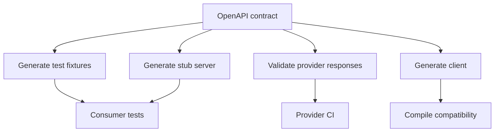
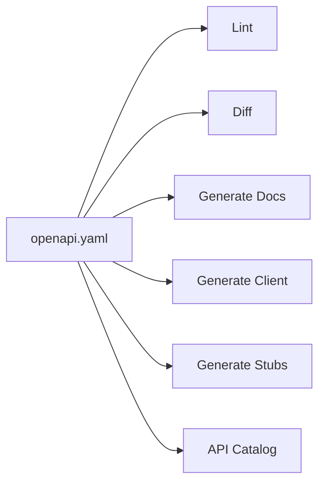

# Part 037 — OpenAPI for Internal Service Communication

OpenAPI is often treated as API documentation.

That is too small.

For internal microservices, OpenAPI should be treated as a **communication contract artifact**.

It answers:

> What can this service be called for, what does it promise, what can fail, and how should consumers integrate safely?

A good OpenAPI file is not a pretty Swagger UI page.

It is a machine-readable boundary used for:

- API review,
- contract governance,
- client generation,
- mock/stub generation,
- compatibility diff,
- security review,
- test generation,
- documentation,
- platform catalog,
- gateway policy,
- consumer onboarding,
- deprecation and ownership.

The practical goal is simple:

> Make service communication explicit enough that humans, tests, and tools can reason about it before production traffic does.

---

## 1. What OpenAPI Is and Is Not

OpenAPI describes HTTP APIs in a standard, language-agnostic way.

It can describe:

- paths,
- methods,
- parameters,
- headers,
- request bodies,
- response bodies,
- status codes,
- media types,
- schemas,
- examples,
- security schemes,
- tags,
- operation metadata,
- reusable components.

It cannot fully describe everything that matters in production communication.

It does not automatically capture:

- real latency envelope,
- retry safety,
- idempotency storage behavior,
- eventual consistency,
- side effects,
- downstream dependency graph,
- exact authorization semantics,
- business invariants,
- partial failure policy,
- operational runbook,
- rollback strategy.

So the right posture is:

```text
OpenAPI is necessary, not sufficient.
```

Use OpenAPI as the **structured contract spine**, then attach operational meaning through descriptions, examples, extensions, ADRs, tests, and runbooks.

---

## 2. Contract-First vs Code-First

There are two common workflows.

### 2.1 Code-first

The team writes Java controllers first, then generates OpenAPI from annotations/runtime scanning.

Example tools:

- springdoc-openapi,
- Swagger annotations,
- MicroProfile OpenAPI.

Benefits:

- fast for existing services,
- less duplicate specification effort,
- close to implementation,
- useful for documentation.

Risks:

- implementation leaks into contract,
- accidental endpoint changes become contract changes,
- generated spec may miss behavior,
- schema may reflect internal DTOs,
- status codes and errors may be incomplete,
- review happens too late.

### 2.2 Contract-first

The team designs OpenAPI first, reviews it, then implements server/client against it.

Benefits:

- API reviewed before implementation,
- consumer expectations explicit,
- compatibility easier to manage,
- generated clients/stubs available earlier,
- good fit for multi-team service boundaries.

Risks:

- spec can drift from implementation,
- over-design without feedback,
- developers may see YAML as bureaucracy,
- generated code can become awkward.

### 2.3 Production default

For mature internal microservices:

```text
contract-first for public/internal platform APIs,
code-first with strict diff governance for smaller owned APIs,
but always contract-verified in CI.
```

The distinction is less important than this invariant:

> The OpenAPI contract must be versioned, reviewed, tested, and kept in sync with runtime behavior.

---

## 3. Repository Layout

Recommended layout:

```text
case-service/
  api/
    openapi/
      case-service-v1.yaml
      case-service-v2.yaml
    examples/
      create-escalation-request.json
      create-escalation-response.json
      validation-error.json
    changelog/
      2026-07-05-add-assignee-id.md
  src/
    main/
      java/
  build.gradle.kts
  docs/
    adr/
      0007-api-versioning-policy.md
```

For larger organizations:

```text
api-contracts/
  case-service/
    v1/
      openapi.yaml
      examples/
      changelog/
    v2/
      openapi.yaml
  workflow-service/
  document-service/
  common/
    problem-details.yaml
    pagination.yaml
    headers.yaml
```

Central contract repo gives governance.

Service-local contract gives stronger implementation ownership.

The right choice depends on org structure, but the invariant is:

> Each service API contract must have an owner and release lifecycle.

---

## 4. A Minimal but Useful OpenAPI Skeleton

```yaml
openapi: 3.2.0
info:
  title: Case Service Internal API
  version: 1.8.0
  description: >
    Internal API for case retrieval and case escalation commands.
    This contract is consumed by workflow-service, portal-service, and reporting-service.
servers:
  - url: https://case-service.internal.example.com
    description: Internal production route
tags:
  - name: Cases
    description: Case query operations
  - name: Escalations
    description: Case escalation command operations
paths: {}
components:
  schemas: {}
  responses: {}
  parameters: {}
  headers: {}
  securitySchemes: {}
```

Even this skeleton already defines:

- API name,
- contract version,
- intended scope,
- server route,
- ownership structure through tags.

But it is not enough.

Production OpenAPI needs operational precision.

---

## 5. Operation Design

Every operation should be named intentionally.

Bad:

```yaml
operationId: getUsingGET_1
```

Good:

```yaml
operationId: getCaseById
```

Operation IDs matter because they often become:

- generated method names,
- metrics labels,
- documentation anchors,
- trace/span operation names,
- governance identifiers,
- compatibility records.

Recommended naming:

```text
verb + domain object + qualifier
```

Examples:

```text
getCaseById
searchCases
createCaseEscalation
cancelCaseEscalation
getOperationStatus
```

Avoid:

- framework-generated names,
- method names tied to controller class,
- names that include version unless necessary,
- names that describe transport instead of intent.

---

## 6. Operation Description Should Include Behavior

A production operation description should not merely say:

```text
Creates a case escalation.
```

Better:

```yaml
summary: Create case escalation
description: >
  Creates a new escalation request for a case.

  This operation is side-effecting and requires Idempotency-Key.
  Repeating the same request with the same Idempotency-Key returns the original outcome.
  If the same key is reused with a different request fingerprint, the service returns 409.

  The command writes a business audit record and publishes CaseEscalated after commit.
  The response is synchronous when validation and assignment are completed within the timeout budget.
```

This tells the consumer:

- operation is side-effecting,
- idempotency is required,
- retry behavior is defined,
- audit/event side effects exist,
- timeout behavior is bounded.

That is real communication documentation.

---

## 7. Reusable Headers

Internal service communication often depends on headers.

Define them once.

```yaml
components:
  parameters:
    CorrelationIdHeader:
      name: X-Correlation-Id
      in: header
      required: false
      schema:
        type: string
        maxLength: 128
      description: >
        Optional caller-provided correlation identifier. Trace propagation uses W3C traceparent;
        this value is for business/support correlation only.

    IdempotencyKeyHeader:
      name: Idempotency-Key
      in: header
      required: true
      schema:
        type: string
        minLength: 16
        maxLength: 128
        pattern: "^[A-Za-z0-9._:-]+$"
      description: >
        Required for side-effecting commands. The key is scoped by tenant, caller, operation,
        and API major version. Same key and same request fingerprint replays the original outcome.
        Same key with different request fingerprint returns 409.
```

Do not leave header semantics implicit.

Headers are part of the contract.

---

## 8. Trace and Baggage Headers

Usually you do **not** need to define every tracing header as required operation parameters.

Instrumentation handles:

- `traceparent`,
- `tracestate`,
- `baggage`.

But you should document propagation policy.

Example extension:

```yaml
x-observability:
  tracePropagation: w3c-trace-context
  baggagePolicy:
    allowedKeys:
      - tenant.id
      - caller.service
    forbiddenKeys:
      - authorization
      - cookie
      - personal_data
```

OpenAPI does not enforce this by itself.

But API governance tools can read extensions.

---

## 9. Error Modeling with Problem Details

Use a consistent error body.

```yaml
components:
  schemas:
    Problem:
      type: object
      required:
        - type
        - title
        - status
      properties:
        type:
          type: string
          format: uri
          description: Stable error type URI.
        title:
          type: string
        status:
          type: integer
          format: int32
        detail:
          type: string
        instance:
          type: string
        extensions:
          type: object
          additionalProperties: true
          description: Service-specific machine-readable details.
```

Then define reusable responses:

```yaml
components:
  responses:
    BadRequest:
      description: Request is malformed or violates schema-level validation.
      content:
        application/problem+json:
          schema:
            $ref: "#/components/schemas/Problem"
          examples:
            invalidRequest:
              value:
                type: "https://errors.example.internal/invalid-request"
                title: "Invalid request"
                status: 400
                extensions:
                  code: "INVALID_REQUEST"
                  retryable: false

    Conflict:
      description: Request conflicts with current resource state or idempotency state.
      content:
        application/problem+json:
          schema:
            $ref: "#/components/schemas/Problem"
```

For each operation, document expected errors.

Bad:

```yaml
responses:
  "500":
    description: Internal server error
```

Better:

```yaml
responses:
  "201":
    description: Escalation created
  "400":
    $ref: "#/components/responses/BadRequest"
  "401":
    $ref: "#/components/responses/Unauthorized"
  "403":
    $ref: "#/components/responses/Forbidden"
  "404":
    $ref: "#/components/responses/CaseNotFound"
  "409":
    $ref: "#/components/responses/Conflict"
  "422":
    $ref: "#/components/responses/DomainValidationFailed"
  "429":
    $ref: "#/components/responses/RateLimited"
  "503":
    $ref: "#/components/responses/ServiceUnavailable"
```

Consumers build retry, fallback, and user messaging from errors.

So errors deserve first-class design.

---

## 10. Modeling Retriability

OpenAPI has no universal standard field for retryability.

Use error extensions and/or vendor extensions.

Example error body:

```json
{
  "type": "https://errors.example.internal/dependency-timeout",
  "title": "Dependency timeout",
  "status": 503,
  "detail": "Assignment service did not respond within the configured deadline.",
  "extensions": {
    "code": "DEPENDENCY_TIMEOUT",
    "retryable": true,
    "retryAfterMillis": 1000
  }
}
```

OpenAPI schema:

```yaml
components:
  schemas:
    ErrorExtensions:
      type: object
      properties:
        code:
          type: string
          example: DEPENDENCY_TIMEOUT
        retryable:
          type: boolean
        retryAfterMillis:
          type: integer
          format: int64
          minimum: 0
```

Operation extension:

```yaml
x-retry-policy:
  clientRetryAllowed: true
  retryableStatuses:
    - 429
    - 503
  unsafeWithoutIdempotencyKey: true
```

This does not replace code review.

It makes review automatable.

---

## 11. Modeling Idempotent Commands

Example command operation:

```yaml
paths:
  /v1/case-escalations:
    post:
      tags:
        - Escalations
      operationId: createCaseEscalation
      summary: Create case escalation
      parameters:
        - $ref: "#/components/parameters/IdempotencyKeyHeader"
        - $ref: "#/components/parameters/CorrelationIdHeader"
      requestBody:
        required: true
        content:
          application/json:
            schema:
              $ref: "#/components/schemas/CreateCaseEscalationRequest"
            examples:
              fraudReview:
                value:
                  caseId: "CASE-100"
                  targetQueue: "FRAUD_REVIEW"
                  reasonCode: "SUSPICIOUS_ACTIVITY"
      responses:
        "201":
          description: Escalation created.
          headers:
            Location:
              schema:
                type: string
              description: URI of created escalation.
          content:
            application/json:
              schema:
                $ref: "#/components/schemas/CreateCaseEscalationResponse"
        "409":
          $ref: "#/components/responses/Conflict"
      x-communication-policy:
        sideEffecting: true
        idempotencyRequired: true
        duplicateBehavior: replay-original-outcome
        sameKeyDifferentPayloadStatus: 409
```

The custom extension is not decorative.

It enables:

- lint rule,
- API review checklist,
- generated docs,
- test fixture generation,
- consistency across services.

---

## 12. Modeling Queries

Query endpoints need stable pagination and filtering.

```yaml
paths:
  /v1/cases:
    get:
      tags:
        - Cases
      operationId: searchCases
      summary: Search cases
      parameters:
        - name: status
          in: query
          required: false
          schema:
            type: array
            items:
              $ref: "#/components/schemas/CaseStatus"
          style: form
          explode: true
        - name: pageSize
          in: query
          required: false
          schema:
            type: integer
            minimum: 1
            maximum: 200
            default: 50
        - name: pageToken
          in: query
          required: false
          schema:
            type: string
          description: >
            Opaque pagination token returned by the previous response.
            Consumers must not parse or construct this value.
      responses:
        "200":
          description: Search result page.
          content:
            application/json:
              schema:
                $ref: "#/components/schemas/SearchCasesResponse"
      x-query-policy:
        pagination: cursor
        stableSort:
          - createdAt: desc
          - caseId: desc
        maxPageSize: 200
```

Response:

```yaml
components:
  schemas:
    SearchCasesResponse:
      type: object
      required:
        - items
      properties:
        items:
          type: array
          items:
            $ref: "#/components/schemas/CaseSummary"
        nextPageToken:
          type: string
          nullable: true
          description: Opaque token for the next page, or null if no next page exists.
```

Documenting "opaque token" matters.

Otherwise consumers parse it and lock you into implementation details.

---

## 13. Schema Design Rules

### 13.1 Use explicit required fields

```yaml
CreateCaseEscalationRequest:
  type: object
  required:
    - caseId
    - targetQueue
    - reasonCode
  properties:
    caseId:
      type: string
      pattern: "^CASE-[0-9]+$"
    targetQueue:
      type: string
    reasonCode:
      type: string
```

Do not rely on Java validation annotations alone.

The contract should say what is required.

### 13.2 Avoid leaking internal enums blindly

Bad:

```yaml
CaseStatus:
  type: string
  enum:
    - DB_OPEN_STATE
    - DB_CLOSED_STATE
```

Good:

```yaml
CaseStatus:
  type: string
  description: >
    External lifecycle status. Consumers must tolerate unknown values.
  enum:
    - OPEN
    - UNDER_REVIEW
    - CLOSED
```

Add a warning:

```yaml
x-extensible-enum: true
```

Why?

Generated clients can break when new enum values appear.

### 13.3 Prefer domain-specific scalar formats carefully

```yaml
CaseId:
  type: string
  pattern: "^CASE-[0-9]+$"
  example: "CASE-100"
```

Reusable scalar schemas are useful.

But over-modeling every string can make specs noisy.

Use reusable schemas for important domain identifiers, not every field.

### 13.4 Set bounds

Bad:

```yaml
comment:
  type: string
```

Good:

```yaml
comment:
  type: string
  minLength: 1
  maxLength: 2000
```

Bounds are communication safety.

They protect:

- memory,
- logs,
- database columns,
- UI rendering,
- gateway limits,
- abuse scenarios.

---

## 14. Examples Are Part of the Contract

Examples catch ambiguity faster than schemas.

For every important operation, include:

- success example,
- validation error example,
- conflict example,
- not found example,
- rate limit/overload example,
- idempotency replay example if relevant.

Example:

```yaml
examples:
  keyReuseConflict:
    summary: Same Idempotency-Key reused with different payload
    value:
      type: "https://errors.example.internal/idempotency-key-reused"
      title: "Idempotency key reused"
      status: 409
      detail: "The idempotency key was previously used with a different request fingerprint."
      extensions:
        code: "IDEMPOTENCY_KEY_REUSED"
        retryable: false
```

Examples should be valid and tested.

Do not let examples become stale marketing copy.

---

## 15. Security Schemes

Internal does not mean unauthenticated.

Example:

```yaml
components:
  securitySchemes:
    ServiceJwt:
      type: http
      scheme: bearer
      bearerFormat: JWT
      description: >
        Service-to-service JWT issued by internal identity provider.
        Token audience must be case-service.
security:
  - ServiceJwt: []
```

Operation-specific requirements:

```yaml
paths:
  /v1/cases/{caseId}:
    get:
      security:
        - ServiceJwt: []
      x-authorization:
        requiredPermissions:
          - case:read
        tenantIsolation: required
```

OpenAPI can describe the authentication mechanism.

Authorization semantics often need extensions or documentation.

---

## 16. Vendor Extensions for Internal Governance

OpenAPI allows extension fields with `x-`.

Use them deliberately.

Possible extension namespace:

```yaml
x-service:
  owner: case-platform
  slackChannel: "#case-platform"
  tier: critical
  dataClassification: confidential

x-communication-policy:
  timeoutBudgetMs: 500
  idempotencyRequired: true
  clientRetryAllowed: true
  maxRequestBytes: 32768
  maxResponseBytes: 1048576
  consistency: read-your-writes-not-guaranteed

x-observability:
  operationMetric: case.create_escalation
  traceSpanName: POST /v1/case-escalations
  cardinalityRisk: low

x-deprecation:
  status: active
  replacement: null
  sunsetDate: null
```

Do not add arbitrary extensions nobody reads.

Each extension should have at least one consumer:

- linter,
- documentation generator,
- review checklist,
- gateway config,
- dashboard,
- security scanner.

---

## 17. Linting OpenAPI

Linting turns API style into executable governance.

Example Spectral ruleset idea:

```yaml
extends:
  - spectral:oas

rules:
  operation-operationId:
    description: Every operation must have operationId.
    given: $.paths[*][*]
    then:
      field: operationId
      function: truthy

  no-unsafe-post-without-idempotency:
    description: Side-effecting POST operations must require Idempotency-Key.
    given: $.paths[*].post
    then:
      function: schema
      functionOptions:
        schema:
          type: object
          required:
            - x-communication-policy
```

More useful lint rules:

| Rule | Why |
|---|---|
| Every operation has `operationId` | Stable tooling identity |
| Every operation has success and error responses | Avoid undocumented failures |
| `POST` command has idempotency policy | Retry safety |
| Pagination endpoints define max page size | Capacity safety |
| Schemas define max string length | Payload safety |
| Error responses use `application/problem+json` | Consistent error handling |
| No undocumented `default` response only | Consumers need explicit behavior |
| Deprecated operation has replacement/sunset | Lifecycle management |
| No raw `object` without schema | Contract precision |
| No internal package/class names | Prevent implementation leakage |

---

## 18. OpenAPI Diffing

Diffing detects accidental breaking changes.

CI should compare:

```text
main branch OpenAPI
vs
pull request OpenAPI
```

Fail or require approval for:

- removed path,
- removed method,
- removed response code,
- request field made required,
- response field removed,
- schema type changed,
- enum value removed,
- operationId changed,
- security requirement changed,
- pagination token semantics changed.

Some semantic changes cannot be detected automatically.

For those, require an API change checklist.

Example PR checklist:

```md
## API Change Checklist

- [ ] OpenAPI diff reviewed
- [ ] Breaking change classification documented
- [ ] Error/status code semantics unchanged or migration documented
- [ ] Idempotency behavior unchanged or migration documented
- [ ] Pagination behavior unchanged or migration documented
- [ ] Known consumers identified
- [ ] Consumer contract tests updated
- [ ] Deprecation/sunset plan included if needed
```

---

## 19. Contract Testing From OpenAPI

OpenAPI can drive multiple test types.

| Test type | Purpose |
|---|---|
| Request validation | Provider rejects invalid requests |
| Response validation | Provider returns schema-compliant responses |
| Stub generation | Consumer tests against provider-like behavior |
| Example validation | Examples are valid against schema |
| Compatibility diff | No accidental breaking change |
| Negative testing | Invalid inputs produce documented errors |
| Fuzz/property testing | Explore schema boundaries |

Example test flow:



Do not confuse generated stub tests with real provider behavior.

Stubs validate consumer assumptions.

Provider tests validate implementation.

You need both.

---

## 20. Documentation Site vs Contract Source

Swagger UI or Redoc is not the source of truth.

The source of truth is the version-controlled OpenAPI document.

Documentation site should be generated from it.



If someone edits docs manually but not OpenAPI, drift starts.

If someone edits controller but not OpenAPI, drift starts.

A mature pipeline makes drift visible.

---

## 21. OpenAPI and Java Server Implementation

### 21.1 Controller boundary

Keep the controller close to contract.

```java
@RestController
@RequestMapping("/v1/case-escalations")
public final class CaseEscalationController {
    private final CreateEscalationUseCase useCase;
    private final CaseEscalationApiMapper mapper;

    @PostMapping
    public ResponseEntity<CreateCaseEscalationResponse> create(
        @RequestHeader("Idempotency-Key") String idempotencyKey,
        @Valid @RequestBody CreateCaseEscalationRequest request
    ) {
        CreateEscalationCommand command = mapper.toCommand(request, idempotencyKey);
        CreateEscalationResult result = useCase.execute(command);

        return ResponseEntity
            .created(URI.create("/v1/case-escalations/" + result.escalationId()))
            .body(mapper.toResponse(result));
    }
}
```

Rules:

- controller DTOs match OpenAPI schemas,
- controller maps into application commands,
- domain model does not depend on OpenAPI generated classes,
- errors are mapped consistently to Problem Details.

### 21.2 Generated server interfaces

Some teams generate server interfaces from OpenAPI.

This can be useful for contract-first enforcement.

But avoid letting generated code dominate application architecture.

Recommended:

```text
Generated API interface
        |
Controller adapter implements interface
        |
Application use case
        |
Domain
```

Not:

```text
Generated model everywhere in domain and database
```

---

## 22. OpenAPI and Java Client Implementation

Generated clients can help, but they should be wrapped.


Owned adapter responsibilities:

- map generated DTO to domain DTO,
- map generated exceptions to domain exception taxonomy,
- enforce timeout/retry/idempotency policy,
- attach headers,
- emit telemetry,
- hide generated client churn.

Never let generated OpenAPI model become your internal domain model.

Generated code is an integration detail.

---

## 23. Common OpenAPI Anti-Patterns

### 23.1 Spec as afterthought

The service is already deployed, then someone generates a spec.

Result:

- undocumented status codes,
- incomplete errors,
- internal models exposed,
- no consumer review,
- no compatibility guarantee.

### 23.2 One giant shared spec for all services

This can become unreviewable.

Prefer service-owned specs with reusable shared components.

### 23.3 Every field nullable

This destroys contract precision.

If everything is nullable, consumers cannot reason.

### 23.4 No examples

Schemas show shape.

Examples show intent.

You need both.

### 23.5 `default` response only

Bad:

```yaml
responses:
  default:
    description: Error
```

Consumers need to know whether a failure is:

- validation,
- auth,
- not found,
- conflict,
- rate limit,
- overload,
- dependency failure.

### 23.6 Enum without unknown handling

OpenAPI enum looks precise, but generated clients may fail when provider adds values.

Document extensibility or avoid strict enums when values evolve frequently.

### 23.7 OpenAPI says one thing, runtime does another

This is the worst failure.

A wrong spec is worse than no spec because it creates false confidence.

---

## 24. Production OpenAPI Review Checklist

Before approving an internal API:

### Identity

- Does every operation have stable `operationId`?
- Are tags meaningful?
- Is owner/contact known?
- Is API major version clear?

### Request/response

- Are required fields explicit?
- Are string lengths bounded?
- Are array sizes bounded?
- Are examples present?
- Are unknown enum values considered?

### HTTP semantics

- Are methods appropriate?
- Are status codes intentional?
- Are redirects avoided unless needed?
- Are cacheability and idempotency clear?

### Failure

- Are errors Problem Details?
- Are retryable vs non-retryable failures clear?
- Are 409/412/422 semantics separated?
- Are overload/rate-limit responses documented?

### Reliability

- Are side effects documented?
- Is `Idempotency-Key` required for unsafe commands?
- Is duplicate behavior documented?
- Are timeout budgets described?

### Query

- Is pagination stable?
- Is `pageToken` opaque?
- Are filter/sort fields documented?
- Are max page sizes bounded?

### Security

- Is auth mechanism declared?
- Are permission requirements documented?
- Is tenant isolation documented?
- Is sensitive data classified?

### Lifecycle

- Is deprecation policy present?
- Are breaking changes classified?
- Is diff/lint enforced?
- Are known consumers identified?

---

## 25. The Real Lesson

OpenAPI is not a YAML chore.

It is a **shared executable memory** of how services communicate.

Used poorly, it becomes stale documentation.

Used well, it becomes:

```text
design artifact
+ contract artifact
+ testing artifact
+ governance artifact
+ documentation artifact
+ migration artifact
```

For internal Java microservices, that is the difference between:

```text
"Here is an endpoint."
```

and:

```text
"Here is a service boundary that consumers can safely build on."
```

---

## References

- OpenAPI Specification v3.2.0: https://spec.openapis.org/oas/v3.2.0.html
- OpenAPI Initiative: https://www.openapis.org/
- RFC 9110 — HTTP Semantics: https://datatracker.ietf.org/doc/html/rfc9110
- RFC 9457 — Problem Details for HTTP APIs: https://www.rfc-editor.org/rfc/rfc9457.html
- W3C Trace Context: https://www.w3.org/TR/trace-context/
- W3C Baggage: https://www.w3.org/TR/baggage/
- Stoplight Spectral: https://stoplight.io/open-source/spectral
- OpenAPI Generator: https://openapi-generator.tech/
