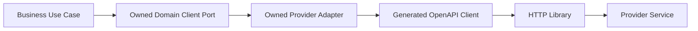
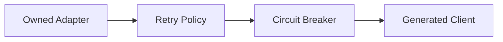
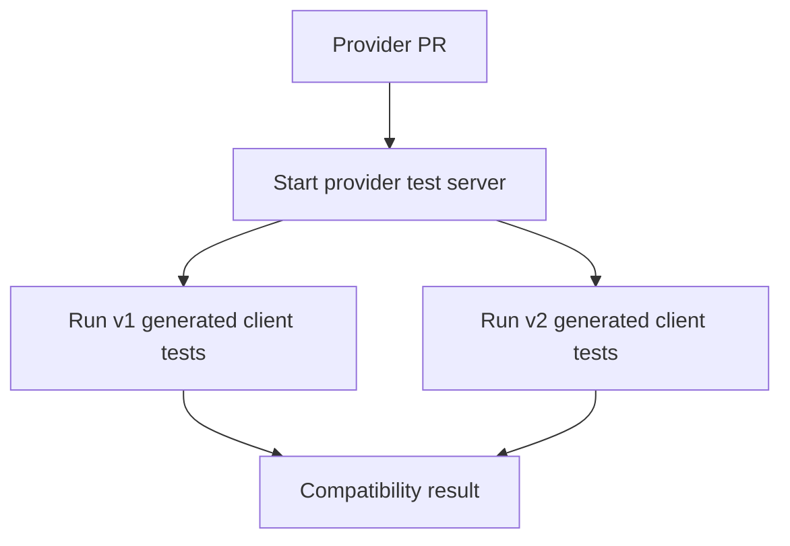
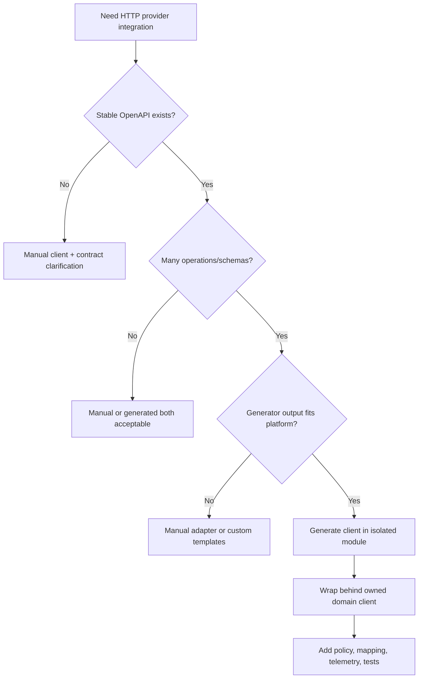

# Part 038 — Generated Clients: Productivity, Drift, and Failure Modes

Generated clients are attractive.

You write an OpenAPI spec.

A tool generates Java code.

Now the consumer can call the provider with typed methods instead of manually building HTTP requests.

That can be useful.

But in production microservices, generated clients are not a free abstraction.

They can create hidden coupling, wrong retry behavior, unreadable failure modes, dependency conflicts, enum crashes, and lockstep deployments.

The rule is not:

> Never generate clients.

The rule is:

> Never confuse generated code with a production communication boundary.

Generated code is a transport adapter.

Your service still needs an owned boundary around it.

---

## 1. Why Generated Clients Exist

Generated clients solve real problems:

- reduce boilerplate,
- keep request/response types aligned with OpenAPI,
- expose typed method names,
- support faster consumer onboarding,
- reduce manual serialization bugs,
- provide basic auth/header hooks,
- standardize low-level HTTP usage.

For internal APIs, they can accelerate integration.

But they do not solve:

- timeout policy,
- retry policy,
- idempotency policy,
- circuit breaking,
- domain exception taxonomy,
- fallback behavior,
- observability,
- sensitive logging,
- version migration,
- semantic compatibility,
- generated dependency conflicts.

Those still belong to engineering design.

---

## 2. The Correct Mental Model

A generated client is not the client.

It is one layer inside the client.



The owned adapter is where production policy lives.

It controls:

- timeouts,
- retry eligibility,
- idempotency keys,
- headers,
- telemetry,
- error mapping,
- DTO mapping,
- version selection,
- fallback,
- privacy/logging,
- config validation.

If business code calls generated client directly, you have skipped your communication boundary.

---

## 3. Generated Client Benefits

Generated clients are especially useful when:

| Situation | Benefit |
|---|---|
| Many request/response schemas | Avoid manual DTO drift |
| Contract-first workflow | Compile against contract early |
| Many consumers | Standard client reduces onboarding |
| Strong governance | Generated code enforces spec shape |
| Multiple languages | Consistent client generation across stacks |
| API catalog platform | Clients published as artifacts |
| Stubs and tests | Same contract can generate fixtures |

They are less useful when:

- API is small and stable,
- schema is simple,
- custom domain mapping is heavy,
- generated library quality is weak,
- consumers need strict control over transport,
- the provider changes often without governance.

---

## 4. Pitfall: Generated DTO Leakage

Bad:

```java
public final class EscalationWorkflowService {
    private final CaseServiceApi caseServiceApi;

    public void escalate(CreateCaseEscalationRequest request) {
        caseServiceApi.createCaseEscalation(request);
    }
}
```

`CreateCaseEscalationRequest` here is generated from provider contract.

Now provider shape leaks into consumer business logic.

Problems:

- provider field names become business concepts,
- provider version changes ripple everywhere,
- tests become provider-shaped,
- domain model follows transport schema,
- migration requires touching core logic.

Better:

```java
public interface CaseEscalationClient {
    EscalationId createEscalation(CreateEscalationCommand command);
}
```

Owned adapter:

```java
public final class OpenApiCaseEscalationClient implements CaseEscalationClient {
    private final CaseEscalationsApi generatedApi;
    private final IdempotencyKeyFactory idempotencyKeyFactory;
    private final CaseApiMapper mapper;

    @Override
    public EscalationId createEscalation(CreateEscalationCommand command) {
        String key = idempotencyKeyFactory.forCommand(command);

        CreateCaseEscalationRequest request = mapper.toGeneratedRequest(command);

        CreateCaseEscalationResponse response =
            generatedApi.createCaseEscalation(key, request);

        return new EscalationId(response.getEscalationId());
    }
}
```

The generated DTO is contained.

---

## 5. Pitfall: Exception Leakage

Generated clients often throw tool-specific exceptions.

Examples:

```java
ApiException
RestClientResponseException
WebClientResponseException
FeignException
ProcessingException
```

If these leak upward, business code becomes transport-aware.

Bad:

```java
try {
    caseServiceApi.createCaseEscalation(request);
} catch (ApiException ex) {
    if (ex.getCode() == 409) {
        // ...
    }
}
```

Better:

```java
try {
    caseEscalationClient.createEscalation(command);
} catch (DuplicateCommandInProgressException ex) {
    // retry later
} catch (CaseNotEscalatableException ex) {
    // business handling
}
```

The adapter maps provider errors into a consumer-owned exception taxonomy.

Example mapper:

```java
public final class CaseServiceErrorMapper {
    public RuntimeException map(ApiException ex) {
        Problem problem = parseProblem(ex.getResponseBody());

        return switch (problem.code()) {
            case "CASE_NOT_FOUND" ->
                new RemoteCaseNotFoundException(problem.detail(), ex);
            case "CASE_NOT_ESCALATABLE" ->
                new CaseNotEscalatableException(problem.detail(), ex);
            case "REQUEST_IN_PROGRESS" ->
                new DuplicateCommandInProgressException(problem.retryAfter(), ex);
            case "RATE_LIMITED" ->
                new RemoteRateLimitedException(problem.retryAfter(), ex);
            default ->
                new CaseServiceUnavailableException("Unknown provider error", ex);
        };
    }
}
```

Generated exceptions are not domain errors.

---

## 6. Pitfall: Missing Timeout Policy

Generated clients may come with defaults that are unsafe or unclear.

Common problems:

- no total timeout,
- infinite read timeout,
- default connect timeout too high,
- no pool acquisition timeout,
- per-request timeout unavailable,
- async future without deadline,
- generated code hides the underlying HTTP client.

A production generated client wrapper must configure:

```yaml
case-service:
  base-url: https://case-service.internal
  timeout:
    connect: 100ms
    response: 400ms
    total: 500ms
  pool:
    max-connections: 100
    max-connections-per-route: 50
    acquisition-timeout: 50ms
```

Then validate config at startup.

Bad:

```java
new ApiClient().setBasePath(baseUrl);
```

Better:

```java
ApiClient apiClient = new ApiClient(httpClientWithPolicy);
apiClient.setBasePath(config.baseUrl());
apiClient.setConnectTimeout(config.connectTimeoutMillis());
apiClient.setReadTimeout(config.readTimeoutMillis());
```

The exact method names depend on generator/library.

The principle does not.

---

## 7. Pitfall: Wrong Retry Behavior

Generated clients do not know business semantics.

They cannot know:

- whether `POST` is idempotent,
- whether `409` is retryable,
- whether `503` happened before or after side effect,
- whether `Idempotency-Key` is present,
- whether timeout means unknown outcome,
- whether fallback is allowed.

So retry must be controlled outside generated code.



Retry rule example:

```java
Retry retry = Retry.of("case-service-create-escalation",
    RetryConfig.custom()
        .maxAttempts(2)
        .waitDuration(Duration.ofMillis(80))
        .retryOnException(this::isRetryable)
        .build()
);
```

But for unsafe commands:

```text
retry only if Idempotency-Key is present and provider contract says duplicate replay is supported.
```

Generated clients cannot enforce this alone.

---

## 8. Pitfall: Enum Expansion Breaks Consumers

OpenAPI enum:

```yaml
CaseStatus:
  type: string
  enum:
    - OPEN
    - CLOSED
```

Generated Java enum:

```java
public enum CaseStatus {
    OPEN,
    CLOSED
}
```

Provider later adds:

```yaml
- UNDER_REVIEW
```

Old generated client may:

- fail deserialization,
- map to null,
- throw unknown enum exception,
- break switch exhaustiveness,
- silently drop value depending on library.

Consumer code:

```java
switch (status) {
    case OPEN -> ...
    case CLOSED -> ...
}
```

Now what happens with `UNDER_REVIEW`?

Mitigations:

- document extensible enums,
- configure generator unknown-enum handling if supported,
- avoid strict enum for high-churn values,
- map generated enum to consumer-owned enum with `UNKNOWN`,
- test unknown values.

Consumer-owned enum:

```java
public enum CaseLifecycle {
    OPEN,
    UNDER_REVIEW,
    CLOSED,
    UNKNOWN
}
```

Mapper:

```java
public CaseLifecycle mapStatus(String providerStatus) {
    return switch (providerStatus) {
        case "OPEN" -> CaseLifecycle.OPEN;
        case "UNDER_REVIEW" -> CaseLifecycle.UNDER_REVIEW;
        case "CLOSED" -> CaseLifecycle.CLOSED;
        default -> CaseLifecycle.UNKNOWN;
    };
}
```

Sometimes representing provider enum as raw string at the edge is safer.

---

## 9. Pitfall: Nullability Mismatch

OpenAPI required/nullable semantics can map awkwardly into Java.

Problems:

- missing field vs explicit null,
- optional field generated as nullable reference,
- `Optional<T>` in DTOs,
- primitive vs wrapper types,
- validation annotations not generated,
- Jackson config differences.

Example bug:

```yaml
amount:
  type: number
```

Generated Java:

```java
private BigDecimal amount;
```

But field is not in `required`.

Now `amount` can be null.

If business code assumes non-null, failure happens later.

Rules:

- use `required` explicitly,
- avoid nullable unless semantically meaningful,
- validate generated DTOs before mapping,
- map into non-null domain types,
- test missing and explicit-null cases.

Adapter mapper:

```java
public Money mapAmount(BigDecimal amount) {
    if (amount == null) {
        throw new ProviderContractViolationException("amount is missing");
    }
    return Money.of(amount);
}
```

Generated DTOs should not be trusted blindly.

---

## 10. Pitfall: Generated Client as Shared Library Coupling

Publishing `case-service-client.jar` can be helpful.

But it can also create lockstep dependency coupling.

Failure pattern:

1. Provider changes OpenAPI.
2. Provider publishes client `2.0.0`.
3. Consumer upgrades client.
4. Transitive dependencies change.
5. Consumer build breaks.
6. Provider rollout is blocked by consumer dependency conflicts.

Or:

1. Provider deploys new server.
2. Consumer still uses old generated client.
3. Old client cannot parse new response.
4. Runtime failure.

A generated client artifact must follow compatibility rules.

Recommended:

- publish generated client per API major version,
- avoid forcing client upgrades for additive server changes,
- keep dependencies minimal,
- avoid leaking heavy HTTP stacks transitively,
- test old generated clients against new provider,
- publish changelog,
- define support window.

---

## 11. Pitfall: Dependency Conflicts

Generated clients may depend on:

- OkHttp,
- Apache HttpClient,
- Jersey,
- Jackson,
- Gson,
- Jakarta REST,
- Spring WebClient,
- Retrofit,
- Reactor,
- validation APIs.

In a large Java service, this can conflict with existing stack.

Examples:

- generated client pulls a different Jackson version,
- WebClient client pulls Reactor into non-reactive service,
- Jersey client conflicts with Jakarta EE runtime,
- OkHttp dispatcher thread behavior surprises platform,
- transitive logging dependencies differ.

Mitigations:

- choose generator library intentionally,
- review generated POM,
- use dependency constraints,
- shade only when truly necessary,
- publish thin generated model/client when possible,
- prefer internally standardized HTTP stack.

Do not allow every provider team to choose arbitrary generator libraries.

That creates platform entropy.

---

## 12. Pitfall: Serialization Configuration Drift

Provider serializes with one configuration.

Generated client deserializes with another.

Problems:

- date/time format mismatch,
- unknown property handling,
- enum case handling,
- BigDecimal precision,
- null inclusion,
- polymorphic schema,
- `oneOf`/`anyOf` mapping,
- binary payload handling.

Example:

Provider returns:

```json
{
  "createdAt": "2026-07-05T10:15:30.123456Z"
}
```

Client generated model expects `OffsetDateTime`.

But mapper truncates precision or fails depending on library.

Mitigations:

- contract examples with date/time fields,
- provider response validation,
- consumer stub tests,
- shared serialization policy,
- avoid ambiguous formats,
- use standard ISO-8601 for date-time,
- test unknown fields.

---

## 13. Pitfall: `oneOf`, `anyOf`, and Polymorphism

OpenAPI supports composition constructs.

Generators vary in how well they handle them.

Example:

```yaml
PaymentInstrument:
  oneOf:
    - $ref: "#/components/schemas/CardInstrument"
    - $ref: "#/components/schemas/BankAccountInstrument"
  discriminator:
    propertyName: type
```

Generated Java may become:

- inheritance hierarchy,
- wrapper class,
- `Object`,
- unhelpful interface,
- library-specific discriminator logic.

For internal APIs, avoid clever schema shapes unless there is strong generator/tooling support.

Prefer explicit tagged object when interoperability matters:

```yaml
PaymentInstrument:
  type: object
  required:
    - type
  properties:
    type:
      type: string
      enum:
        - CARD
        - BANK_ACCOUNT
    card:
      $ref: "#/components/schemas/CardInstrument"
    bankAccount:
      $ref: "#/components/schemas/BankAccountInstrument"
```

This is less elegant but often more operationally stable.

---

## 14. Pitfall: Generated Client Hides HTTP Semantics

A generated method:

```java
api.createCaseEscalation(request);
```

hides:

- method is `POST`,
- command is unsafe,
- status `201` vs `202`,
- `409` may be retryable or terminal,
- `Idempotency-Key` is required,
- `Retry-After` matters,
- request may time out after commit.

The wrapper should restore semantic clarity.

```java
public EscalationId createEscalation(CreateEscalationCommand command) {
    IdempotencyKey key = idempotencyKeyFactory.create(command.commandId());

    return communicationPolicy.executeCommand(
        "case-service.createCaseEscalation",
        key,
        () -> callGeneratedClient(key, command)
    );
}
```

The code should make the distributed-system meaning visible.

---

## 15. Pitfall: Over-Generated Surface Area

If a provider has 80 endpoints, a generated client exposes all 80.

Consumer may call anything.

This bypasses intended use.

Better:

```java
public interface CaseLookupClient {
    CaseSnapshot getCase(CaseId caseId);
}

public interface CaseEscalationClient {
    EscalationId createEscalation(CreateEscalationCommand command);
}
```

Expose only the operations the consumer needs.

The generated client remains private inside infrastructure adapter.

This reduces accidental coupling to provider surface area.

---

## 16. Pitfall: Breaking OperationId Changes

`operationId` often becomes generated method name.

Change:

```yaml
operationId: createEscalation
```

to:

```yaml
operationId: createCaseEscalation
```

Generated method changes.

Consumers fail compilation.

That may be acceptable as a deliberate major change, but it is often accidental.

Governance rule:

> Do not change `operationId` without compatibility review.

If operation naming is bad, fix it early before wide adoption.

---

## 17. Pitfall: Generated Code in Source Control

Teams debate whether to commit generated clients.

Options:

| Option | Pros | Cons |
|---|---|---|
| Commit generated code | Reproducible review, no generator needed at build | Large diffs, merge noise |
| Generate at build | Fresh from spec, less repo noise | Build depends on generator determinism |
| Publish generated artifact | Consumers depend on versioned JAR | Artifact lifecycle required |
| Generate in dedicated module | Clear isolation | More build setup |

Recommended internal platform pattern:

```text
provider publishes versioned OpenAPI
platform generates versioned client artifact
consumer wraps generated client behind owned port
```

For service-local clients:

```text
do not scatter generated code across business modules;
isolate it in infrastructure/generated-client module.
```

---

## 18. Build Reproducibility

Generated code must be reproducible.

Pin:

- generator version,
- input OpenAPI file,
- generator config,
- template version,
- Java package names,
- library option,
- date/timestamp suppression if possible,
- formatting rules.

Example Gradle concept:

```kotlin
openApiGenerate {
    generatorName.set("java")
    inputSpec.set("$rootDir/api/openapi/case-service-v1.yaml")
    outputDir.set("$buildDir/generated/openapi/case-service")
    apiPackage.set("com.example.caseclient.generated.api")
    modelPackage.set("com.example.caseclient.generated.model")
    configOptions.set(
        mapOf(
            "library" to "native",
            "dateLibrary" to "java8",
            "hideGenerationTimestamp" to "true"
        )
    )
}
```

Treat generator config as source code.

A generator upgrade is a dependency upgrade and should be reviewed.

---

## 19. Safe Wrapper Architecture

Recommended module layout in a consumer service:

```text
workflow-service/
  src/main/java/com/example/workflow/
    domain/
    application/
    infrastructure/
      caseclient/
        CaseEscalationClient.java
        OpenApiCaseEscalationClient.java
        CaseServiceClientConfig.java
        CaseServiceErrorMapper.java
        CaseServiceMapper.java
      generated/
        casev1/
          api/
          model/
```

Owned port:

```java
public interface CaseEscalationClient {
    EscalationId createEscalation(CreateEscalationCommand command);
}
```

Config:

```java
public record CaseServiceClientConfig(
    URI baseUrl,
    Duration connectTimeout,
    Duration responseTimeout,
    int maxConnections,
    boolean retryEnabled
) {
    public CaseServiceClientConfig {
        if (connectTimeout.isNegative() || connectTimeout.isZero()) {
            throw new IllegalArgumentException("connectTimeout must be positive");
        }
        if (responseTimeout.compareTo(connectTimeout) < 0) {
            throw new IllegalArgumentException("responseTimeout must be >= connectTimeout");
        }
    }
}
```

Adapter:

```java
public final class OpenApiCaseEscalationClient implements CaseEscalationClient {
    private final CaseEscalationsApi api;
    private final CaseServiceMapper mapper;
    private final CaseServiceErrorMapper errorMapper;
    private final CommunicationPolicy communicationPolicy;

    @Override
    public EscalationId createEscalation(CreateEscalationCommand command) {
        return communicationPolicy.execute(
            "case-service.createCaseEscalation",
            () -> doCreateEscalation(command)
        );
    }

    private EscalationId doCreateEscalation(CreateEscalationCommand command) {
        try {
            String key = command.idempotencyKey().value();
            CreateCaseEscalationRequest request = mapper.toGenerated(command);
            CreateCaseEscalationResponse response = api.createCaseEscalation(key, request);
            return mapper.toEscalationId(response);
        } catch (ApiException ex) {
            throw errorMapper.map(ex);
        }
    }
}
```

The generated API is hidden.

Business code sees a meaningful client.

---

## 20. Observability Wrapper

Generated clients rarely emit exactly the telemetry you need.

Wrapper should emit:

- provider service,
- operation name,
- API version,
- caller service,
- status code,
- error code,
- retry count,
- timeout type,
- circuit breaker result,
- payload size bucket,
- dedup replay if observable.

Example:

```java
Timer.Sample sample = Timer.start(meterRegistry);
try {
    EscalationId result = call();
    sample.stop(successTimer);
    return result;
} catch (RuntimeException ex) {
    sample.stop(errorTimer(errorClassifier.classify(ex)));
    throw ex;
}
```

Trace attributes:

```text
rpc.system=http
http.request.method=POST
server.address=case-service.internal
url.template=/v1/case-escalations
service.target=case-service
api.version=v1
operation.name=createCaseEscalation
```

Avoid high-cardinality attributes:

- raw URL with IDs,
- idempotency key,
- case ID,
- user ID,
- full error detail.

---

## 21. Security and Privacy

Generated clients can accidentally log sensitive data.

Risks:

- debug logging request/response body,
- exceptions include response body,
- generated `toString()` prints PII,
- authorization headers logged,
- idempotency keys logged,
- stack traces include payload.

Mitigations:

- disable body logging by default,
- redact sensitive headers,
- avoid logging generated DTO `toString()`,
- map errors to safe messages,
- enforce data classification in wrapper,
- review generated code logging behavior.

Example safe log:

```java
logger.warn(
    "Case service call failed operation={} status={} errorCode={} retryable={}",
    "createCaseEscalation",
    error.status(),
    error.code(),
    error.retryable()
);
```

Do not log:

```java
logger.warn("Request failed: {}", request);
```

---

## 22. Versioning Generated Clients

A provider API may have:

```text
/v1
/v2
```

Generated artifacts should reflect that.

Example:

```text
com.example.internal:case-service-client-v1:1.12.0
com.example.internal:case-service-client-v2:2.1.0
```

Consumer wrapper can support both during migration:

```java
public final class MigratingCaseClient implements CaseEscalationClient {
    private final CaseEscalationClient v1;
    private final CaseEscalationClient v2;
    private final MigrationConfig config;

    @Override
    public EscalationId createEscalation(CreateEscalationCommand command) {
        if (config.useV2For(command.tenantId())) {
            return v2.createEscalation(command);
        }
        return v1.createEscalation(command);
    }
}
```

This enables:

- canary migration,
- tenant-by-tenant rollout,
- fallback to v1,
- comparative testing.

Do not mix v1/v2 generated DTOs in business logic.

---

## 23. Testing Generated Client Wrappers

Minimum tests:

| Test | Purpose |
|---|---|
| Mapping test | Domain command maps to generated request correctly |
| Error mapping test | Provider Problem Details maps to owned exception |
| Timeout test | Wrapper enforces configured timeout |
| Retry test | Only retryable failure is retried |
| Idempotency test | Unsafe command sends stable key |
| Unknown enum test | New provider value does not crash business logic |
| Nullability test | Missing required provider field is detected |
| Observability test | Metrics/logs/traces use stable labels |
| Contract stub test | Wrapper works against generated/provider stub |
| Old client compatibility test | Old generated client still works with new provider |

Wire-level stub example:

```java
stubFor(post(urlEqualTo("/v1/case-escalations"))
    .withHeader("Idempotency-Key", matching(".+"))
    .willReturn(created()
        .withHeader("Content-Type", "application/json")
        .withBody("""
          {
            "escalationId": "ESC-1001"
          }
        """)));
```

Wrapper test:

```java
@Test
void sendsIdempotencyKeyForCreateEscalation() {
    EscalationId id = client.createEscalation(command);

    assertThat(id.value()).isEqualTo("ESC-1001");

    verify(postRequestedFor(urlEqualTo("/v1/case-escalations"))
        .withHeader("Idempotency-Key", equalTo(command.idempotencyKey().value())));
}
```

---

## 24. Provider-Side Compatibility Tests With Old Clients

A strong provider tests itself against old generated clients.



This catches:

- removed field,
- changed enum,
- changed status code,
- changed content type,
- changed error body,
- changed operation path.

OpenAPI diff catches structural changes.

Old-client tests catch real generated-code behavior.

Use both.

---

## 25. Generator Configuration Checklist

Before adopting a generated Java client, decide:

- Which generator?
- Which HTTP library?
- Which JSON library?
- How are dates represented?
- How are enums handled?
- How are unknown properties handled?
- How are nullable fields represented?
- How are validation annotations generated?
- Does generated code expose synchronous, async, or reactive API?
- How are errors exposed?
- Can timeouts be configured?
- Can headers be injected per request?
- Is response status accessible?
- Are response headers accessible?
- Are request/response interceptors supported?
- Are dependencies acceptable?
- Is generated code deterministic?
- Is generator version pinned?

If you cannot answer these, you are not ready to use the generated client in production.

---

## 26. When Not to Generate

Manual clients may be better when:

- API surface is tiny,
- high-performance low-level control is needed,
- generator output is unstable,
- endpoint has unusual streaming/binary behavior,
- consumer needs only one operation,
- generated dependency stack conflicts with platform,
- domain mapping cost exceeds boilerplate savings.

Manual does not mean sloppy.

A manual client still needs:

- contract tests,
- DTOs,
- error mapping,
- timeouts,
- observability,
- retry policy,
- idempotency handling.

Generated vs manual is not maturity.

Owned boundary is maturity.

---

## 27. Decision Model



Use generation when it reduces mechanical risk.

Do not use it when it increases operational risk.

---

## 28. Anti-Pattern Summary

| Anti-pattern | Consequence |
|---|---|
| Business code calls generated API directly | Provider contract leaks everywhere |
| Generated DTOs used as domain models | Lockstep coupling and semantic confusion |
| Generated exceptions leak upward | Transport-aware business logic |
| No timeout override | Latency incidents |
| Generated retry enabled blindly | Duplicate side effects |
| Strict enums everywhere | Old clients break on new values |
| No wrapper tests | Contract drift discovered in production |
| Unpinned generator version | Non-reproducible builds |
| Heavy transitive dependencies | Platform conflicts |
| Logging generated DTOs | Sensitive data leakage |
| OperationId changes casually | Consumer compile breaks |
| One generated mega-client exposed | Consumer over-coupling |

---

## 29. Production-Grade Pattern

The mature pattern:

```text
OpenAPI contract
→ generated low-level client
→ owned adapter
→ domain client port
→ application use case
```

With:

- pinned generator,
- isolated generated module,
- explicit config,
- timeouts,
- retry and circuit breaker policy,
- idempotency-key handling,
- problem-details error mapping,
- DTO mapping,
- unknown enum handling,
- observability,
- security redaction,
- contract/stub tests,
- old-client compatibility tests,
- versioned artifact lifecycle.

This is more work than calling generated code directly.

It is also the difference between convenience and production reliability.

---

## 30. The Real Lesson

Generated clients are accelerators.

They are not architecture.

They can reduce boilerplate and schema drift, but they can also hide distributed-systems decisions that must remain explicit.

A top-tier Java microservice team uses generated clients like this:

```text
generate the mechanical layer,
own the semantic layer.
```

The provider owns the contract.

The consumer owns its boundary.

The generated code sits between them, useful but contained.

That is the safe way to get productivity without surrendering architecture.

---

## References

- OpenAPI Specification v3.2.0: https://spec.openapis.org/oas/v3.2.0.html
- OpenAPI Generator Java generator documentation: https://openapi-generator.tech/docs/generators/java/
- OpenAPI Generator generators list: https://openapi-generator.tech/docs/generators/
- OpenAPI Generator configuration docs: https://openapi-generator.tech/docs/configuration/
- RFC 9110 — HTTP Semantics: https://datatracker.ietf.org/doc/html/rfc9110
- RFC 9457 — Problem Details for HTTP APIs: https://www.rfc-editor.org/rfc/rfc9457.html
- Spring RestClient reference: https://docs.spring.io/spring-framework/reference/integration/rest-clients.html
- JDK HttpClient API: https://docs.oracle.com/en/java/javase/25/docs/api/java.net.http/java/net/http/HttpClient.html
