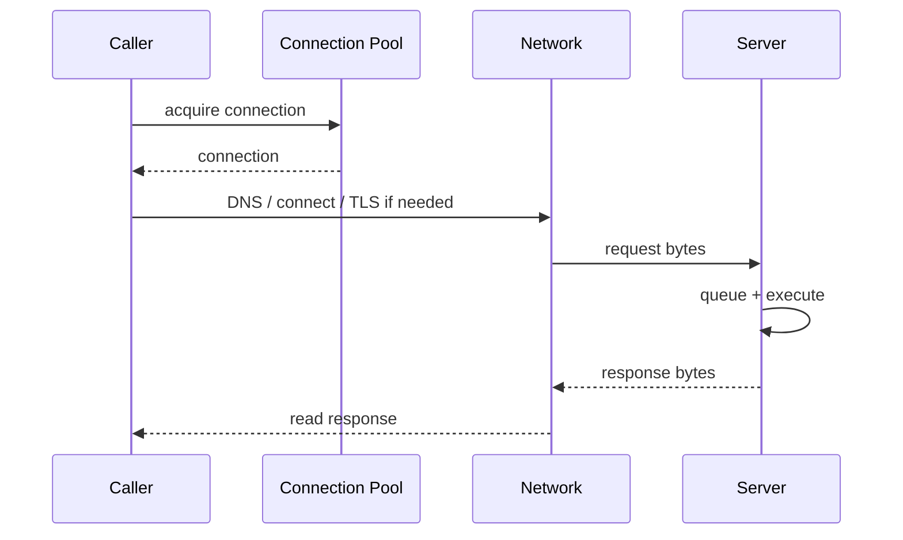
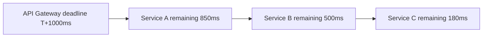
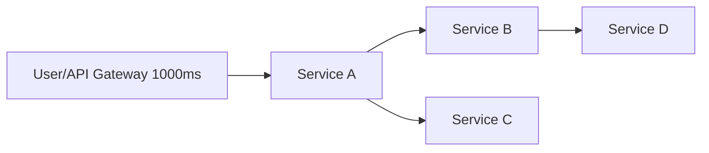
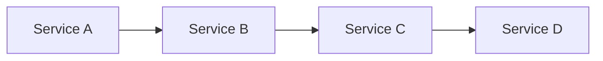
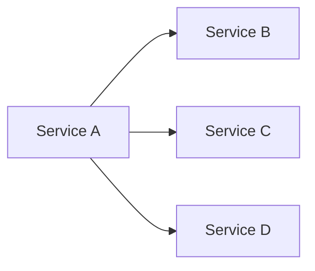
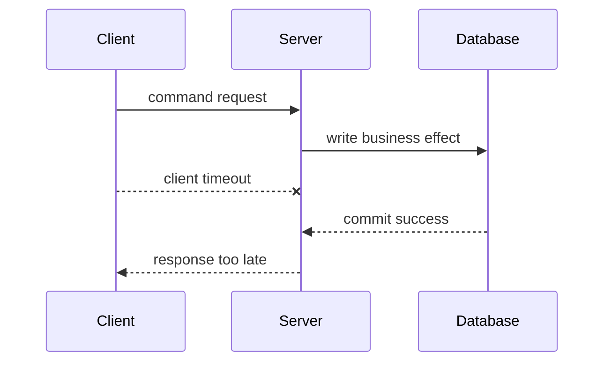
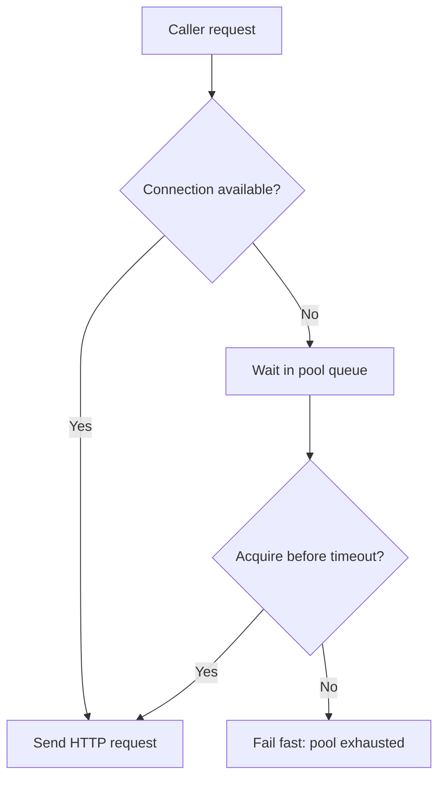

# Part 039 — Timeout Design: Connect, Read, Write, Total, Deadline

A timeout is not just a number.

It is a statement:

> How long is this caller willing to let one dependency consume its latency budget, threads, sockets, memory, and user patience?

In microservices, a missing or wrong timeout is not a local mistake.

It can become:

- thread exhaustion,
- connection pool starvation,
- request queue buildup,
- cascading failure,
- retry storm,
- stuck workflow,
- high tail latency,
- misleading success rate,
- expensive resource leak.

A production service must not say:

```text
"Call dependency X."
```

It must say:

```text
"Call dependency X within this budget, with this cancellation behavior, and fail in this classified way when the budget is exhausted."
```

That is timeout design.

---

## 1. The Core Mental Model

Every remote call has a timeline.



A single "timeout" may or may not cover all of these phases.

A robust client distinguishes:

| Timeout | What it bounds |
|---|---|
| Pool acquisition timeout | Waiting for a connection from client pool |
| DNS timeout | Resolving service name |
| Connect timeout | Establishing TCP connection |
| TLS handshake timeout | Negotiating TLS |
| Write timeout | Sending request bytes |
| Read/socket timeout | Waiting between response bytes |
| Response timeout | Time until complete response |
| Total attempt timeout | One attempt from start to finish |
| End-to-end deadline | Whole operation across retries and hops |
| Server execution timeout | Server-side processing budget |
| Queue timeout | Time request may wait before execution |

Many incidents happen because teams configure one timeout and assume it covers all phases.

It often does not.

---

## 2. Timeout vs Deadline

A timeout is usually relative.

```text
wait up to 200 ms from now
```

A deadline is absolute.

```text
complete before 2026-07-05T10:15:30.500Z
```

In a single local call, either can work.

Across a call chain, deadline is more reliable.



If every service independently sets `500 ms`, a chain can exceed the user's original budget.

If every service propagates a deadline, downstream services know how much time is actually left.

Rule:

> Use local timeouts to bound specific phases, but use an end-to-end deadline to bound the operation.

---

## 3. Why "No Timeout" Is a Production Bug

Without timeouts:

- caller threads wait indefinitely,
- async tasks accumulate,
- connection pools fill,
- upstream requests wait,
- health checks may still pass,
- retries from other layers pile on,
- dependency failure becomes caller failure.

Bad:

```java
HttpClient client = HttpClient.newHttpClient();
HttpRequest request = HttpRequest.newBuilder(uri).GET().build();
client.send(request, BodyHandlers.ofString());
```

This is not production behavior.

It has no explicit operational budget.

Better:

```java
HttpClient client = HttpClient.newBuilder()
    .connectTimeout(Duration.ofMillis(100))
    .build();

HttpRequest request = HttpRequest.newBuilder(uri)
    .timeout(Duration.ofMillis(450))
    .GET()
    .build();
```

This is still not complete, but it is at least explicit.

---

## 4. Timeout Is a Load-Shedding Mechanism

Timeouts are often explained as user experience.

They are also capacity protection.

If a downstream service slows from 50 ms to 5 seconds, each caller holds resources 100x longer.

Simple capacity math:

```text
concurrent_in_flight ≈ request_rate_per_second × average_latency_seconds
```

At 1000 RPS:

| Average downstream latency | In-flight calls |
|---:|---:|
| 50 ms | 50 |
| 500 ms | 500 |
| 5 s | 5000 |

Timeouts cap how long a dependency can occupy caller resources.

Without a cap, a slow dependency becomes a resource leak.

---

## 5. False Timeout vs Late Failure

A timeout that is too short creates false failures.

A timeout that is too long creates resource exhaustion.

You are choosing a trade-off.

```text
too short  -> false timeout, unnecessary retry, lower success
too long   -> slow failure, resource exhaustion, cascading failure
```

AWS describes a common approach: choose an acceptable false-timeout rate, then select a downstream latency percentile such as p99.9 for that rate, adding padding when latency distribution is tight or when cross-network variability exists.

For internal microservices, use actual downstream latency data.

Not vibes.

---

## 6. Percentile-Based Timeout Selection

Suppose dependency latency histogram:

| Percentile | Latency |
|---:|---:|
| p50 | 25 ms |
| p90 | 70 ms |
| p99 | 180 ms |
| p99.9 | 420 ms |

If caller can tolerate 0.1% false timeouts, start near p99.9.

Then add margin for:

- network jitter,
- TLS handshake,
- GC pauses,
- deployment warmup,
- DNS refresh,
- cross-AZ variance,
- proxy/mesh overhead,
- client queueing,
- metric staleness.

Example:

```text
base = p99.9 latency = 420 ms
padding = 80 ms
timeout = 500 ms
```

But this must fit the caller's end-to-end budget.

If the caller only has 300 ms remaining, the timeout cannot be 500 ms.

---

## 7. Budgeting Across a Call Chain

Imagine an external request has 1000 ms budget.



Service A must reserve time for:

- its own processing,
- parallel/serial downstream calls,
- serialization,
- response writing,
- retry if allowed,
- cleanup/logging overhead.

Naive budget:

```text
A total budget: 1000 ms
A local work: 100 ms
B call: 500 ms
C call: 500 ms
```

If B and C are serial, this already exceeds budget.

Better:

```text
gateway deadline: 1000 ms
A local pre-work: 80 ms
B call attempt budget: 250 ms
C call attempt budget: 250 ms
A local post-work: 80 ms
safety margin: 100 ms
```

Budget must reflect call topology.

Parallel calls have different math from serial calls.

---

## 8. Serial vs Parallel Budget

### 8.1 Serial calls



Total latency is roughly additive:

```text
total ≈ A + B + C + D + network overhead
```

Serial call chains need strict deadline propagation.

### 8.2 Parallel calls



Total latency is roughly the max of parallel calls:

```text
total ≈ max(B, C, D) + aggregation overhead
```

But resource usage is additive.

Parallel calls can reduce latency while increasing load.

Timeouts must consider both.

---

## 9. Per-Attempt Timeout vs Total Deadline

Retries need both.

```text
total deadline = 800 ms
max attempts = 3
per attempt timeout = 250 ms
backoff = 50 ms + jitter
```

This may already exceed budget:

```text
250 + 50 + 250 + 100 + 250 = 900 ms
```

So retry planning must be budget-aware.

Better:

```text
total deadline = 800 ms
attempt 1 = 250 ms
backoff = 50 ms
attempt 2 = min(250 ms, remaining budget - margin)
no third attempt if remaining budget insufficient
```

Rule:

> A retry policy without deadline awareness is incomplete.

---

## 10. Timeout Types in Java HTTP Clients

### 10.1 JDK `HttpClient`

JDK `HttpClient` supports a client-level connect timeout and request-level timeout.

```java
HttpClient client = HttpClient.newBuilder()
    .connectTimeout(Duration.ofMillis(100))
    .version(HttpClient.Version.HTTP_2)
    .build();

HttpRequest request = HttpRequest.newBuilder(uri)
    .timeout(Duration.ofMillis(450))
    .GET()
    .build();

HttpResponse<String> response = client.send(request, HttpResponse.BodyHandlers.ofString());
```

Important:

- client is immutable after creation,
- client can be reused for many requests,
- connect timeout is not the same as total operation budget,
- request timeout bounds the request/response operation from the API perspective,
- async calls still need deadline/cancellation handling.

### 10.2 Spring `RestClient`

Spring `RestClient` delegates to a request factory / underlying HTTP client.

You must configure the underlying client.

Conceptual example:

```java
ClientHttpRequestFactory requestFactory = createRequestFactoryWithTimeouts(
    connectTimeout,
    readTimeout,
    poolAcquisitionTimeout
);

RestClient restClient = RestClient.builder()
    .requestFactory(requestFactory)
    .baseUrl(config.baseUrl().toString())
    .build();
```

Do not assume framework defaults are production defaults.

### 10.3 Spring `WebClient`

`WebClient` often uses Reactor Netty.

Timeouts can exist at multiple layers:

- connect timeout,
- response timeout,
- read/write handlers,
- reactive `.timeout(...)`,
- pool acquisition timeout.

Conceptual example:

```java
HttpClient httpClient = HttpClient.create()
    .responseTimeout(Duration.ofMillis(450));

WebClient webClient = WebClient.builder()
    .clientConnector(new ReactorClientHttpConnector(httpClient))
    .baseUrl(config.baseUrl().toString())
    .build();
```

Reactive timeout does not automatically cancel all external work unless the underlying transport and server observe cancellation correctly.

### 10.4 OpenFeign

Feign timeout behavior depends on the configured `Client`.

You need explicit connect/read timeouts and a clear retryer policy.

Bad:

```java
@FeignClient(name = "case-service")
interface CaseApi {
    @PostMapping("/v1/case-escalations")
    Response create(Request request);
}
```

Better:

```yaml
spring:
  cloud:
    openfeign:
      client:
        config:
          case-service:
            connectTimeout: 100
            readTimeout: 450
```

Still, this is only part of the policy.

You also need idempotency, retry eligibility, error mapping, and observability.

---

## 11. Server-Side Timeout and Cancellation

Client timeout does not automatically mean server stops work.

Scenario:



Client sees timeout.

Server may still commit.

This is an **unknown outcome**.

For commands, this means:

- client must not assume failure,
- retry must use idempotency key,
- server must support dedup/replay,
- audit/outbox must be stable.

Server-side cancellation helps but is not enough.

Some work cannot be cancelled after it has committed.

---

## 12. gRPC Deadlines

gRPC has first-class deadline support.

A client can set a deadline; when it expires, the RPC is cancelled. Servers should stop ongoing work when cancellation is observed.

Conceptual Java:

```java
CaseServiceGrpc.CaseServiceBlockingStub stub =
    CaseServiceGrpc.newBlockingStub(channel)
        .withDeadlineAfter(450, TimeUnit.MILLISECONDS);

CaseResponse response = stub.getCase(request);
```

For call chains, gRPC can propagate deadlines so downstream services receive the remaining budget rather than inventing new independent timeouts.

The model is stronger than ad-hoc HTTP timeout headers, but the design obligation is the same:

> Downstream work must respect the remaining budget and stop wasting resources when the caller no longer cares.

---

## 13. Deadline Propagation Over HTTP

HTTP does not define one universal deadline header for all systems.

Many organizations define internal headers.

Example:

```http
X-Request-Deadline: 2026-07-05T10:15:30.500Z
```

Or:

```http
X-Timeout-Ms: 450
```

Absolute deadline is usually better because relative timeout can be distorted by queueing and proxy delay.

Service behavior:

```java
public Deadline resolveDeadline(HttpServletRequest request, Clock clock) {
    Instant inbound = parseDeadlineHeader(request.getHeader("X-Request-Deadline"));
    Instant localMaximum = clock.instant().plus(config.maxRequestDuration());

    Instant effective = inbound == null
        ? localMaximum
        : min(inbound, localMaximum);

    return new Deadline(effective);
}
```

Rules:

- never extend caller deadline,
- cap inbound deadline by service maximum,
- reject impossible deadlines early,
- propagate remaining budget downstream,
- include safety margin for response serialization.

---

## 14. Timeout Headers Are Trust Boundaries

Do not blindly trust caller-provided timeout/deadline headers.

A malicious or buggy caller can send:

```http
X-Request-Deadline: 2099-01-01T00:00:00Z
```

or:

```http
X-Timeout-Ms: 600000
```

The service must cap it.

```text
effective_deadline = min(caller_deadline, now + service_max_deadline)
```

For internal service-to-service calls, caller identity still matters.

Different callers may have different allowed maximums.

---

## 15. Queue Time Must Count

Many systems measure only handler execution time.

That hides overload.

Request lifecycle:

```text
arrival -> queue -> handler starts -> downstream call -> response
```

If a request waits 900 ms in queue and then gets 500 ms handler timeout, the user sees 1400 ms.

Timeout budget should include queue time.

In server frameworks, this can be hard.

Mitigation:

- gateway/request deadline header,
- early rejection when remaining budget is too small,
- thread pool queue limits,
- bulkheads,
- load shedding,
- metrics for queue delay,
- separate server request timeout.

---

## 16. Timeout and Connection Pool Acquisition

Connection pool wait is often forgotten.

Suppose pool has 50 connections.

Dependency slows.

All 50 are occupied.

New requests wait for a connection.

If pool acquisition has no timeout, callers pile up before even sending the request.



Pool acquisition timeout should usually be short.

It protects caller resources and reveals saturation quickly.

---

## 17. Timeout and DNS

DNS can be a hidden source of latency.

Problems:

- slow resolver,
- stale DNS cache,
- frequent service endpoint changes,
- blocking DNS in client path,
- resolver overload,
- JVM DNS caching policy mismatch.

For Kubernetes, service DNS is common, but the client may also sit behind service mesh or gateway.

Design rules:

- know whether your HTTP client resolves per connection or caches,
- understand JVM DNS TTL configuration,
- avoid ultra-low DNS TTL without reason,
- monitor connection errors separately from response timeout,
- warm critical clients during startup if appropriate.

Do not hide DNS latency inside a vague "read timeout."

---

## 18. Timeout and TLS

TLS handshake can dominate first request latency after deployment or connection churn.

Failure pattern:

1. Service deploys.
2. New pods start.
3. No warm connections.
4. First requests include TCP + TLS setup.
5. Timeout was tuned only for warm request latency.
6. False timeouts spike after deployment.

Mitigations:

- connection warmup,
- slightly padded connect/request timeout,
- separate connect vs response metrics,
- readiness that waits for critical clients to initialize if justified,
- avoid excessive connection churn.

A tight timeout with no warmup can fail only during deployments, which makes diagnosis harder.

---

## 19. Timeout and Streaming

Streaming APIs complicate timeout semantics.

For a normal request, "complete response within 500 ms" is meaningful.

For a stream, response may remain open for minutes.

Timeout model changes:

| Timeout | Streaming meaning |
|---|---|
| Connect timeout | Still applies |
| First byte timeout | Time until stream begins |
| Idle timeout | Max silence between messages |
| Total stream timeout | Max lifetime of stream |
| Per-message processing timeout | Consumer processing budget |
| Cancellation deadline | When caller no longer wants stream |

Do not apply short normal request timeout to long-lived streams.

Use idle timeout and cancellation policy.

---

## 20. Timeout and Database Calls

This series focuses on communication, but HTTP service timeouts interact with database timeouts.

If HTTP request deadline is 500 ms but database query timeout is 5 seconds, the server may keep working after client has gone.

Align:

```text
HTTP inbound deadline
> application use case budget
> downstream HTTP/gRPC budget
> database statement timeout
```

The server should not spend 5 seconds on a query for a request whose caller timed out after 500 ms.

---

## 21. TimeLimiter and Future Cancellation

Resilience4j `TimeLimiter` can decorate asynchronous operations and time-limit them.

Conceptual example:

```java
TimeLimiterConfig config = TimeLimiterConfig.custom()
    .timeoutDuration(Duration.ofMillis(450))
    .cancelRunningFuture(true)
    .build();

TimeLimiter timeLimiter = TimeLimiter.of(config);

Supplier<CompletionStage<CaseResponse>> supplier =
    () -> caseClient.getCaseAsync(caseId);

CompletionStage<CaseResponse> limited =
    timeLimiter.executeCompletionStage(scheduler, supplier);
```

Important nuance:

> Cancelling a future is not the same as cancelling remote work.

The underlying HTTP client and server must observe cancellation for resource savings.

Even then, side effects already committed cannot be undone.

---

## 22. Choosing Timeout Values by Operation Type

| Operation type | Typical timeout posture |
|---|---|
| Internal metadata lookup | very short, fail fast |
| User-facing query | bounded by user SLA |
| Internal command | short enough to protect caller, with idempotency for retry |
| Bulk command | often async instead of long sync timeout |
| Report export | async job, not long HTTP request |
| External provider call | depends on provider SLA, usually isolated |
| Health check | very short, no heavy dependency |
| Readiness check | bounded, must avoid cascading dependency check storms |

Do not use one global timeout for every dependency and operation.

Timeouts are operation-specific.

---

## 23. Timeout Classification

When timeout happens, classify it.

Bad error:

```text
TimeoutException
```

Better taxonomy:

| Timeout class | Meaning |
|---|---|
| `POOL_ACQUISITION_TIMEOUT` | Could not acquire local connection |
| `CONNECT_TIMEOUT` | Could not establish connection |
| `TLS_HANDSHAKE_TIMEOUT` | TLS negotiation too slow |
| `WRITE_TIMEOUT` | Could not send request bytes |
| `FIRST_BYTE_TIMEOUT` | Server did not start response |
| `READ_TIMEOUT` | Response stalled |
| `TOTAL_ATTEMPT_TIMEOUT` | Attempt exceeded per-attempt budget |
| `DEADLINE_EXCEEDED` | End-to-end deadline exhausted |
| `SERVER_EXECUTION_TIMEOUT` | Server aborted due to own budget |

This matters because the fixes differ.

Pool timeout is often caller-side saturation.

Read timeout is often downstream slow execution.

Deadline exceeded may mean budget planning is wrong.

---

## 24. Observability

Timeout metrics must answer:

- which dependency?
- which operation?
- which timeout type?
- what was the configured budget?
- how much budget remained?
- was there a retry?
- did retry succeed?
- was the command idempotent?
- did circuit breaker open later?

Metric examples:

```text
http.client.request.duration{dependency="case-service",operation="getCase"}
http.client.timeouts.total{dependency="case-service",operation="getCase",type="connect"}
http.client.timeouts.total{dependency="case-service",operation="createEscalation",type="deadline"}
http.client.pool.pending{dependency="case-service"}
http.client.pool.acquisition.timeouts{dependency="case-service"}
```

Log safe structured fields:

```json
{
  "event": "remote_call_timeout",
  "dependency": "case-service",
  "operation": "createCaseEscalation",
  "timeoutType": "TOTAL_ATTEMPT_TIMEOUT",
  "attempt": 1,
  "configuredTimeoutMs": 450,
  "remainingDeadlineMs": 0,
  "idempotencyKeyPresent": true,
  "retryable": true
}
```

Never log raw tokens, full payloads, or idempotency keys in plaintext.

---

## 25. Alerting

Do not alert on a single timeout.

Alert on patterns.

Useful alerts:

| Alert | Meaning |
|---|---|
| timeout rate above baseline | dependency or network regression |
| pool acquisition timeout > 0 | caller-side saturation |
| deadline exceeded at ingress | upstream/gateway budget mismatch |
| timeout + retry surge | retry storm risk |
| timeout + circuit breaker open | dependency failure contained |
| timeout p99 increasing | early warning before error rate rises |
| stale in-flight requests | cancellation not working |

Timeouts are symptoms.

The alert should help locate whether the problem is:

- caller,
- network,
- proxy,
- dependency,
- database,
- overload,
- bad timeout config.

---

## 26. Testing Timeout Behavior

Minimum tests:

| Test | Expected behavior |
|---|---|
| dependency responds within budget | success |
| dependency delays beyond timeout | timeout exception mapped |
| connect fails | connect failure classified |
| pool exhausted | pool timeout classified |
| timeout on command | retry only with idempotency key |
| retry deadline exhausted | no extra attempt |
| server observes cancellation | long work stops when client cancels |
| response body stalls | read timeout fires |
| timeout metrics emitted | correct labels |
| timeout does not leak PII | safe logs |

WireMock-style delay test:

```java
stubFor(get(urlEqualTo("/v1/cases/CASE-100"))
    .willReturn(okJson("""
      {"id":"CASE-100","status":"OPEN"}
    """).withFixedDelay(1000)));

assertThatThrownBy(() -> client.getCase(new CaseId("CASE-100")))
    .isInstanceOf(CaseServiceTimeoutException.class);
```

Deadline test:

```java
@Test
void doesNotStartSecondAttemptWhenDeadlineCannotFit() {
    Deadline deadline = Deadline.after(Duration.ofMillis(300));
    RetryPolicy retryPolicy = new RetryPolicy(3, Duration.ofMillis(250));

    RetryDecision decision = retryPolicy.afterFailure(
        Attempt.failedAfter(Duration.ofMillis(260)),
        deadline
    );

    assertThat(decision.shouldRetry()).isFalse();
}
```

---

## 27. Common Anti-Patterns

### 27.1 One global timeout

```yaml
timeout: 30s
```

This is almost always wrong.

Different dependencies and operations have different budgets.

### 27.2 Timeout longer than caller deadline

If caller deadline is 500 ms, downstream timeout of 2 seconds wastes resources.

### 27.3 Timeout without idempotency

Timeout on a command creates unknown outcome.

Retrying without idempotency can duplicate side effects.

### 27.4 Read timeout only

Read timeout may not cover connection acquisition, DNS, TLS, write, or total attempt.

### 27.5 Infinite async work

Async code without deadline can leak tasks just as badly as blocking code leaks threads.

### 27.6 Timeout swallowed as generic 500

Timeout should be classified and mapped intentionally.

### 27.7 Server ignores cancellation

Client times out but server keeps doing expensive work.

### 27.8 Timeout tuned from average latency

Average latency hides tail behavior.

Use percentiles and false-timeout target.

---

## 28. Production Timeout Policy Template

```yaml
dependencies:
  case-service:
    operations:
      getCase:
        totalDeadlineMs: 300
        connectTimeoutMs: 50
        poolAcquisitionTimeoutMs: 25
        responseTimeoutMs: 250
        retry:
          enabled: true
          maxAttempts: 2
          requiresIdempotency: false
      createEscalation:
        totalDeadlineMs: 600
        connectTimeoutMs: 75
        poolAcquisitionTimeoutMs: 30
        responseTimeoutMs: 450
        retry:
          enabled: true
          maxAttempts: 2
          requiresIdempotency: true
    maxInboundDeadlineMs: 1000
    observability:
      emitTimeoutType: true
      emitRemainingDeadline: true
```

This is better than a hidden timeout buried in code.

Policy should be:

- reviewed,
- versioned,
- validated at startup,
- visible in runbooks,
- connected to dashboard.

---

## 29. Design Checklist

Before shipping a synchronous dependency call:

- What is the end-to-end caller deadline?
- What is the per-attempt timeout?
- What is the connect timeout?
- What is the pool acquisition timeout?
- Is DNS/TLS included or measured separately?
- What happens if timeout fires after server commits?
- Is the operation safe/idempotent/retryable?
- Is an idempotency key required for command retry?
- Is deadline propagated downstream?
- Does the server observe cancellation?
- Are timeout types classified?
- Are metrics/logs/traces emitted?
- Are timeout tests included?
- Is the timeout shorter than the caller's remaining budget?
- Is there a safety margin for serialization/response?
- Are platform/gateway/mesh timeouts aligned?

---

## 30. The Real Lesson

Timeout design is not:

```text
set readTimeout = 500 ms
```

Timeout design is:

```text
preserve caller deadline
bound each resource wait
prevent overload
classify failure
support safe retry
cancel wasted work
observe tail behavior
```

A top-tier Java microservice treats time as a resource.

Every remote call must spend that resource deliberately.

---

## References

- RFC 9110 — HTTP Semantics: https://datatracker.ietf.org/doc/html/rfc9110
- AWS Builders Library — Timeouts, retries, and backoff with jitter: https://aws.amazon.com/builders-library/timeouts-retries-and-backoff-with-jitter/
- gRPC Deadlines: https://grpc.io/docs/guides/deadlines/
- gRPC Cancellation: https://grpc.io/docs/guides/cancellation/
- JDK HttpClient API: https://docs.oracle.com/en/java/javase/25/docs/api/java.net.http/java/net/http/HttpClient.html
- Spring Framework REST Clients: https://docs.spring.io/spring-framework/reference/integration/rest-clients.html
- Spring WebClient: https://docs.spring.io/spring-framework/reference/web/webflux-webclient.html
- Resilience4j TimeLimiter: https://resilience4j.readme.io/docs/timeout
