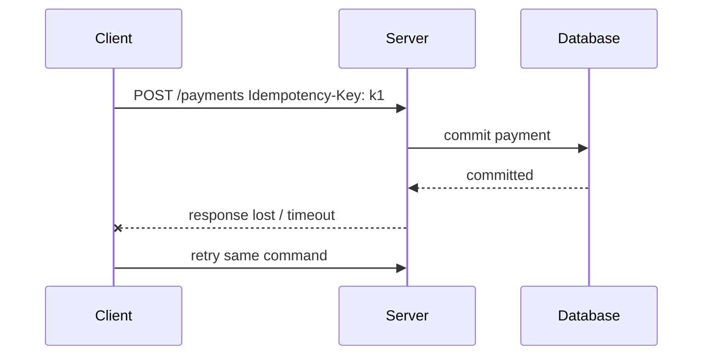
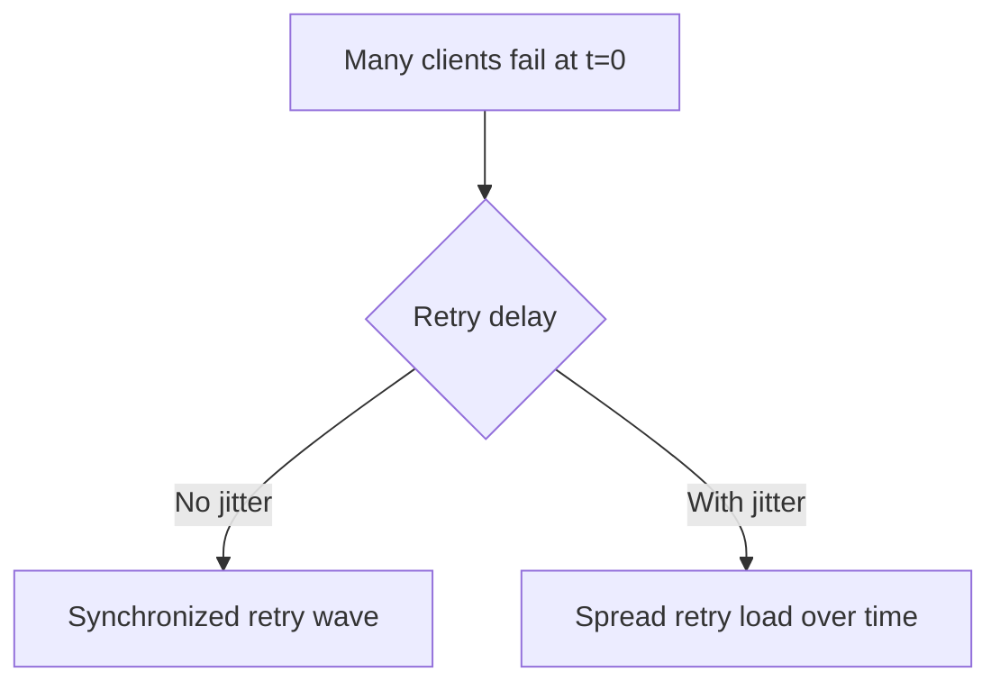
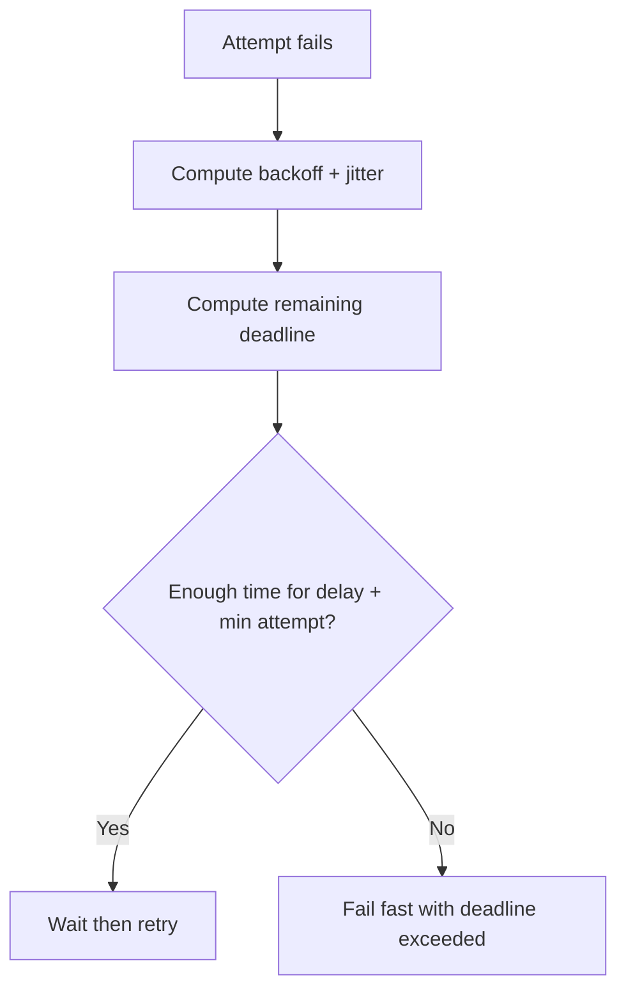
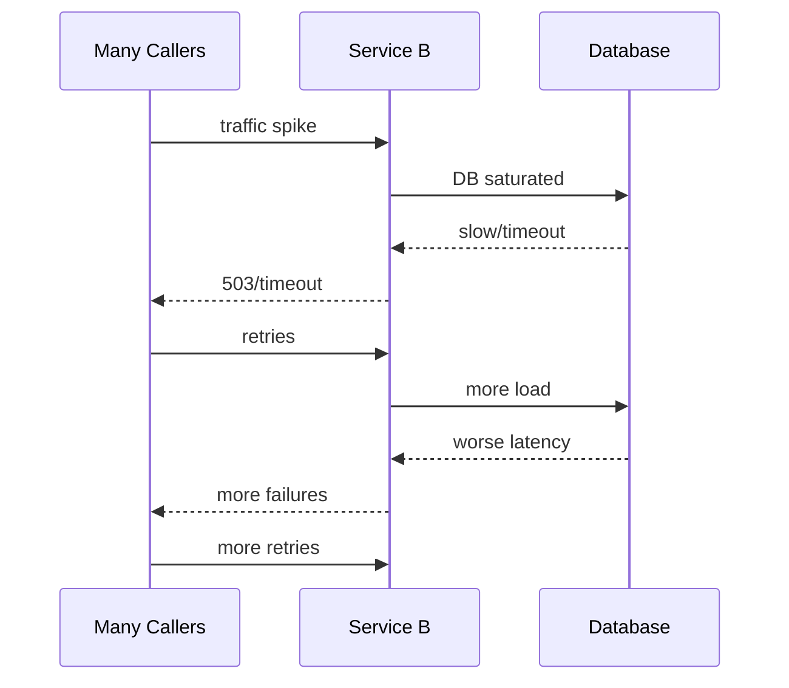
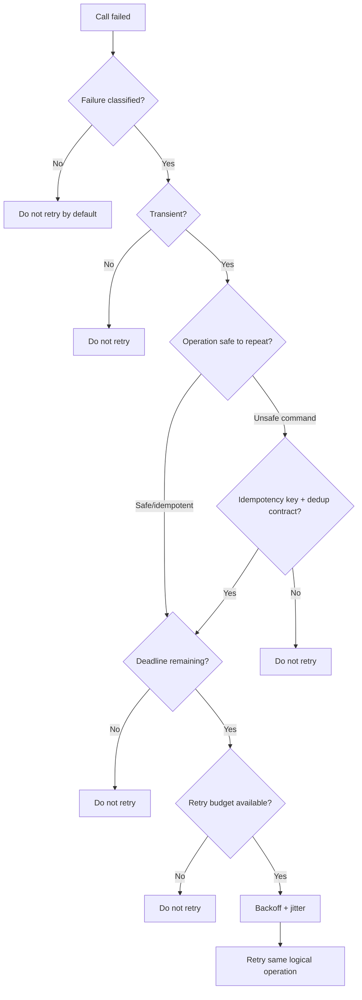

# Part 040 — Retry Design: Backoff, Jitter, Budgets, and Retry Storms

Retry is one of the most misunderstood resilience patterns.

A retry can turn a transient failure into success.

A retry can also turn a small overload into an outage.

The difference is design.

Bad retry:

```text
try again immediately, everywhere, for everything
```

Production retry:

```text
retry only when the failure is likely transient,
only when the operation is safe to repeat,
only while there is remaining deadline,
only with backoff and jitter,
only within a retry budget,
and only at the right layer.
```

Retry is not "error handling."

Retry is controlled re-execution of a distributed operation.

---

## 1. The Core Mental Model

A retry asks:

> Should this caller spend more time and more load to try the same operation again?

That question has several dimensions.

| Dimension | Question |
|---|---|
| Failure type | Is the failure transient? |
| Operation semantics | Is repeating safe? |
| Outcome knowledge | Did the server maybe commit? |
| Deadline | Is there enough time left? |
| Load | Will retry worsen overload? |
| Layering | Is another layer already retrying? |
| Backoff | When should retry happen? |
| Jitter | How do we avoid synchronized retry waves? |
| Budget | How many retries can the system afford? |
| Observability | Can we distinguish original attempts from retries? |

A retry policy that ignores any of these is incomplete.

---

## 2. Retry Is Not a Substitute for Correctness

If a dependency always fails because of bad input, retry does nothing.

If a command times out after committing, retry without dedup can duplicate side effects.

If the system is overloaded, retry can increase load when the system needs less load.

Retry solves a narrow problem:

```text
transient failure where a later attempt has a reasonable chance of success
```

Examples:

- short network blip,
- one connection reset,
- temporary overload with admission control,
- leader failover,
- DNS refresh race,
- small tail-latency event,
- short proxy restart.

Retries do not solve:

- invalid request,
- authorization failure,
- domain conflict,
- schema mismatch,
- permanent missing resource,
- non-idempotent command without dedup,
- downstream capacity collapse,
- misconfigured endpoint,
- incompatible API version.

---

## 3. Retry Eligibility Matrix

Start with HTTP status and exception taxonomy.

| Result | Retry? | Reason |
|---|---:|---|
| `400 Bad Request` | No | Caller bug |
| `401 Unauthorized` | Usually no | Credential/auth problem |
| `403 Forbidden` | No | Authorization decision |
| `404 Not Found` | Usually no | Unless eventual creation/read model lag is expected |
| `409 Conflict` | Depends | Could be retryable in-progress or terminal domain conflict |
| `412 Precondition Failed` | No automatic retry | Caller must re-read and re-evaluate |
| `422 Unprocessable Content` | No | Domain validation failure |
| `425 Too Early` | Depends | Only if request can be safely retried |
| `429 Too Many Requests` | Yes, with `Retry-After`/backoff | Server is throttling |
| `500 Internal Server Error` | Maybe | Only if classified transient |
| `502 Bad Gateway` | Maybe | Often transient proxy/upstream failure |
| `503 Service Unavailable` | Yes, carefully | Usually overload/maintenance; respect `Retry-After` |
| `504 Gateway Timeout` | Maybe | Outcome may be unknown for commands |
| connect timeout | Maybe | Request likely not processed |
| connection refused | Maybe | If failover/deploy expected |
| read timeout | Dangerous for commands | Server may have processed |
| connection reset after write | Dangerous for commands | Outcome may be unknown |
| DNS failure | Maybe | If transient resolver issue |
| TLS failure | Usually no | Often config/cert problem |

Never encode retry solely as:

```java
status >= 500
```

That is too crude.

---

## 4. Safe, Idempotent, and Unsafe Operations

HTTP semantics classify methods like `GET`, `HEAD`, `OPTIONS`, and `TRACE` as safe, and methods like `PUT` and `DELETE` as idempotent when implemented according to their semantics. `POST` is not generally idempotent.

But method alone is not enough.

A `GET` may be expensive.

A `DELETE` may trigger asynchronous side effects.

A `POST` may be retry-safe with `Idempotency-Key`.

Use service contract semantics.

| Operation | Retry posture |
|---|---|
| `GET /cases/{id}` | Usually retryable if transient |
| `GET /cases?query` | Retryable if query is bounded |
| `POST /case-escalations` without idempotency | Do not retry automatically |
| `POST /case-escalations` with idempotency and dedup | Retryable under policy |
| `PUT /cases/{id}` with full replacement | Usually retryable if idempotent |
| `PATCH /cases/{id}` | Depends heavily on patch semantics |
| `DELETE /cases/{id}` | Depends on delete semantics and side effects |

Rule:

> Retry is allowed by operation contract, not by developer optimism.

---

## 5. Unknown Outcome

The hardest retry problem is unknown outcome.

Scenario:



From the client's perspective:

```text
timeout
```

From the server's perspective:

```text
success
```

If the client retries without a stable idempotency key, it may create a second payment.

Therefore:

```text
timeout on unsafe command = unknown outcome
```

Retry policy must know this.

For commands:

- require idempotency key,
- retry with the same key,
- server deduplicates and replays outcome,
- response mapping handles replay.

---

## 6. Retry Amplification

Retries multiply load.

If one request fans out to three services and each layer retries three times, the load amplification can be enormous.

Simple chain:


Worst-case attempts:

```text
3 × 3 × 3 = 27 attempts
```

For a five-layer stack:

```text
3^5 = 243 attempts
```

This is how retry storms happen.

AWS explicitly warns about retries at multiple layers multiplying load and recommends retrying at a single point in the stack for many cases.

Rule:

> Prefer one owner for retries per logical operation.

---

## 7. Where Should Retry Live?

Possible retry locations:

| Layer | Pros | Cons |
|---|---|---|
| SDK/generated client | Easy reuse | May lack business semantics |
| Owned client adapter | Best semantic control | Requires discipline |
| Service mesh/proxy | Centralized | Often lacks idempotency/business context |
| Gateway | Good at edge/transient network | Dangerous for unsafe methods |
| Workflow engine | Durable retries | Longer feedback loop, must be idempotent |
| Message broker | Natural at-least-once retry | Requires idempotent consumer |
| Database driver | Useful for connection failover | Dangerous for transaction semantics |

For synchronous Java microservice calls, default to:

```text
owned client adapter owns retries
```

because it knows:

- operation name,
- idempotency,
- caller deadline,
- exception mapping,
- fallback rules,
- observability context.

Use mesh/gateway retries sparingly and only where semantics are safe.

---

## 8. Immediate Retry Is Usually Wrong

Immediate retry can work when failure is caused by a single bad connection.

But under overload, immediate retry adds load exactly when the dependency needs relief.

Bad:

```java
for (int i = 0; i < 3; i++) {
    try {
        return call();
    } catch (Exception ignored) {
        // immediately try again
    }
}
```

Better:

```text
attempt 1
wait with backoff + jitter
attempt 2
wait with larger backoff + jitter
attempt 3 if deadline allows
```

Retry spacing is not politeness.

It is overload control.

---

## 9. Exponential Backoff

Exponential backoff increases delay between attempts.

Example:

```text
base = 50 ms
attempt 1 delay = 50 ms
attempt 2 delay = 100 ms
attempt 3 delay = 200 ms
attempt 4 delay = 400 ms
```

Capped exponential backoff:

```text
delay = min(maxDelay, base * 2^attempt)
```

Example:

```text
base = 50 ms
max = 500 ms

50, 100, 200, 400, 500, 500, 500
```

Without cap, retry can exceed useful deadlines.

With cap but without budget, retries can continue too long.

Backoff must be combined with:

- max attempts,
- total deadline,
- retry budget,
- jitter,
- server feedback.

---

## 10. Jitter

If many clients fail at the same time and all retry after exactly 100 ms, they create waves.

```text
t=0 failure
t=100ms all retry
t=300ms all retry
t=700ms all retry
```

Jitter randomizes delay to spread retries.



Common strategies:

| Strategy | Description |
|---|---|
| Full jitter | random between 0 and exponential cap |
| Equal jitter | half delay fixed, half randomized |
| Decorrelated jitter | next delay depends on previous delay with randomness |
| Fixed random jitter | fixed delay plus random variation |

AWS popularized the practical use of exponential backoff with jitter for distributed client retries.

Default recommendation:

```text
use capped exponential backoff with jitter
```

Do not use synchronized fixed delays across a fleet.

---

## 11. Retry-After

HTTP `Retry-After` can tell the client when to retry.

It can be an HTTP date or a delay in seconds.

Examples:

```http
Retry-After: 120
```

```http
Retry-After: Fri, 31 Dec 1999 23:59:59 GMT
```

Use it for:

- `429 Too Many Requests`,
- `503 Service Unavailable`,
- maintenance windows,
- explicit throttling.

Client behavior:

```text
delay = max(local_backoff_with_jitter, server_retry_after)
```

But still respect:

- caller deadline,
- maximum delay,
- user SLA,
- retry budget.

If `Retry-After` says 60 seconds but the user request deadline is 800 ms, do not block the user request for 60 seconds.

Return a classified failure or switch to async workflow.

---

## 12. Retry Budget

A retry budget limits how many retries a caller can issue relative to successful/original traffic.

Example policy:

```text
retry_attempts <= 10% of original_attempts over rolling window
```

If a service makes 10,000 original calls/minute, it may allow at most 1,000 retry attempts/minute.

Why?

Because during dependency failure, every caller wants to retry. Without a budget, retry load can become unbounded.

Retry budget can be implemented as:

- token bucket,
- sliding window counter,
- adaptive concurrency controller,
- rate limiter around retry attempts,
- service-mesh/gateway policy if semantics are safe.

Local simple token bucket:

```java
public final class RetryBudget {
    private final AtomicInteger tokens = new AtomicInteger();

    public boolean tryAcquireRetryToken() {
        while (true) {
            int current = tokens.get();
            if (current <= 0) {
                return false;
            }
            if (tokens.compareAndSet(current, current - 1)) {
                return true;
            }
        }
    }
}
```

A retry budget is not a replacement for circuit breaker.

It limits retry volume.

Circuit breaker stops calls when failure is sustained.

They complement each other.

---

## 13. Deadline-Aware Retry

Retry should stop when remaining deadline cannot fit another useful attempt.



Pseudo-code:

```java
RetryDecision afterFailure(Failure failure, Deadline deadline, int nextAttempt) {
    if (!isRetryable(failure)) {
        return RetryDecision.stop("not retryable");
    }

    Duration delay = backoff.delayFor(nextAttempt);
    Duration remaining = deadline.remaining();

    if (remaining.compareTo(delay.plus(minUsefulAttemptDuration)) < 0) {
        return RetryDecision.stop("insufficient deadline");
    }

    return RetryDecision.retryAfter(delay);
}
```

This avoids starting an attempt that cannot possibly complete before the caller gives up.

---

## 14. Retry and Circuit Breaker

Retry and circuit breaker must be composed carefully.

Two common orders:

### 14.1 Circuit breaker outside retry

```text
CircuitBreaker(Retry(Call))
```

The circuit breaker sees one logical call outcome.

Good when you want circuit breaker metrics at logical-operation level.

### 14.2 Retry outside circuit breaker

```text
Retry(CircuitBreaker(Call))
```

The circuit breaker sees each attempt.

Good when you want breaker to react quickly to attempt-level failures.

But it can open faster.

There is no universal answer.

For most service-to-service calls:

```text
Bulkhead -> TimeLimiter/Deadline -> Retry -> CircuitBreaker
```

or:

```text
Bulkhead -> CircuitBreaker -> Retry -> TimeLimiter
```

depends on whether timeout/retry should be counted as breaker failures per attempt or per logical call.

The important point:

> Define the composition intentionally and test the resulting metrics.

Do not stack decorators randomly.

---

## 15. Retry and Rate Limiting

If dependency returns `429`, the client should reduce rate.

Retrying `429` aggressively is self-defeating.

Policy:

- respect `Retry-After`,
- apply client-side rate limiter,
- add jitter,
- use retry budget,
- consider dropping low-priority work,
- surface backpressure to upstream.

For synchronous user-facing calls, sometimes the best answer is:

```http
429 Too Many Requests
```

or:

```http
503 Service Unavailable
```

rather than waiting and retrying until the user times out.

---

## 16. Retry and Bulkheads

Retries consume capacity.

If each original request can produce retries, bulkhead limits must consider retry attempts.

Example:

```text
max concurrent dependency calls = 100
retry max attempts = 3
```

During failure, 100 user requests can occupy all 100 slots with repeated attempts.

Mitigations:

- limit retries separately from original attempts,
- isolate dependency with a bulkhead,
- use small retry count,
- use retry budget,
- fail fast when bulkhead saturated,
- do not queue retries indefinitely.

---

## 17. Retry and Fallback

A fallback may be better than retry.

Examples:

| Scenario | Better than retry |
|---|---|
| read cache available | return stale data |
| optional enrichment fails | omit enrichment |
| recommendation service fails | use default ranking |
| external non-critical notification fails | enqueue async job |
| user-facing report too slow | return job accepted |

Retry is not the only recovery mechanism.

Sometimes the right policy is:

```text
attempt once, then degrade
```

---

## 18. Java Retry Policy Object

Do not scatter retry rules across code.

Create explicit policy.

```java
public record RetryPolicy(
    int maxAttempts,
    Duration baseDelay,
    Duration maxDelay,
    boolean jitterEnabled,
    Set<Integer> retryableStatuses,
    boolean requiresIdempotencyForCommands
) {
    public RetryPolicy {
        if (maxAttempts < 1) {
            throw new IllegalArgumentException("maxAttempts must be >= 1");
        }
        if (baseDelay.isNegative() || baseDelay.isZero()) {
            throw new IllegalArgumentException("baseDelay must be positive");
        }
        if (maxDelay.compareTo(baseDelay) < 0) {
            throw new IllegalArgumentException("maxDelay must be >= baseDelay");
        }
    }
}
```

Retry classifier:

```java
public final class RetryClassifier {
    public boolean isRetryable(RemoteCallFailure failure, OperationSemantics semantics) {
        if (failure.isCallerBug()) {
            return false;
        }

        if (semantics.isUnsafeCommand() && !semantics.hasIdempotencyKey()) {
            return false;
        }

        if (failure.statusCode().isPresent()) {
            int status = failure.statusCode().getAsInt();
            return status == 429 || status == 502 || status == 503 || status == 504;
        }

        return failure.isTransientNetworkFailure();
    }
}
```

This makes retry behavior reviewable.

---

## 19. Backoff Implementation

Example full jitter:

```java
public final class ExponentialBackoffWithJitter {
    private final Duration baseDelay;
    private final Duration maxDelay;
    private final RandomGenerator random;

    public Duration delayForAttempt(int attemptNumber) {
        long baseMillis = baseDelay.toMillis();
        long maxMillis = maxDelay.toMillis();

        long exponential = baseMillis * (1L << Math.min(attemptNumber - 1, 20));
        long capped = Math.min(maxMillis, exponential);

        long jittered = random.nextLong(capped + 1);
        return Duration.ofMillis(jittered);
    }
}
```

Notes:

- cap exponent to avoid overflow,
- use monotonic time for elapsed/deadline calculations,
- test distribution if policy matters,
- avoid zero-delay for high-load dependencies if it causes hot loops.

---

## 20. Resilience4j Retry

Resilience4j provides retry as one of its fault-tolerance decorators.

Conceptual synchronous example:

```java
RetryConfig config = RetryConfig.custom()
    .maxAttempts(2)
    .waitDuration(Duration.ofMillis(80))
    .retryOnException(throwable -> retryClassifier.isRetryable(throwable))
    .build();

Retry retry = Retry.of("case-service-create-escalation", config);

Supplier<EscalationId> decorated =
    Retry.decorateSupplier(retry, () -> callCaseService(command));

EscalationId result = decorated.get();
```

Spring Boot-style configuration concept:

```yaml
resilience4j:
  retry:
    instances:
      caseServiceCreateEscalation:
        maxAttempts: 2
        waitDuration: 80ms
        retryExceptions:
          - com.example.communication.RemoteTransientException
        ignoreExceptions:
          - com.example.communication.RemoteValidationException
```

Important:

- `maxAttempts` usually includes the initial attempt,
- exception classification must be domain-aware,
- unsafe command retry must verify idempotency,
- combine with time limiter/deadline,
- expose retry metrics.

---

## 21. Retry With Idempotency-Key

For unsafe command:

```java
public EscalationId createEscalation(CreateEscalationCommand command) {
    IdempotencyKey key = command.idempotencyKey();

    return retryExecutor.execute(
        OperationSemantics.unsafeCommandWithIdempotency("createCaseEscalation", key),
        () -> generatedApi.createCaseEscalation(key.value(), mapper.toRequest(command))
    );
}
```

Rules:

- generate idempotency key once per logical command,
- reuse the same key on all attempts,
- do not generate a new key per retry,
- include key in request fingerprint server-side,
- classify duplicate replay as success when provider returns original outcome.

Bad:

```java
for (int attempt = 0; attempt < 3; attempt++) {
    String key = UUID.randomUUID().toString(); // wrong
    api.createCaseEscalation(key, request);
}
```

This defeats deduplication.

---

## 22. Retry With `Retry-After`

Pseudo-code:

```java
Duration computeDelay(Failure failure, int nextAttempt) {
    Optional<Duration> serverDelay = failure.retryAfter();
    Duration localDelay = backoff.delayForAttempt(nextAttempt);

    if (serverDelay.isPresent()) {
        return max(localDelay, capRetryAfter(serverDelay.get()));
    }

    return localDelay;
}
```

Policy choices:

- cap absurdly long `Retry-After`,
- do not exceed caller deadline,
- do not sleep synchronous request thread for long delays,
- for long retry-after, return retryable failure or enqueue async work.

Example:

```text
Retry-After: 30 seconds
caller deadline remaining: 400 ms
```

Do not wait 30 seconds inside a user-facing request.

Return a controlled failure.

---

## 23. Retry in Async Workflows

For background jobs/workflows, retry can be more patient.

But it still needs idempotency.

Differences from synchronous request retry:

| Synchronous request | Background workflow |
|---|---|
| tight deadline | longer retry window |
| user waiting | no direct user wait |
| few attempts | more attempts possible |
| short backoff | larger backoff |
| immediate error response | durable retry state |
| retry budget still needed | retry budget still needed |

Workflow retry policy should include:

- max attempts or max age,
- exponential backoff with jitter,
- dead-letter/failure state,
- idempotency key,
- human/manual remediation for terminal failures,
- external provider reconciliation for unknown outcomes.

---

## 24. Retry Storm Scenario

A common outage pattern:



Self-inflicted failure.

Mitigations:

- bounded retries,
- backoff with jitter,
- retry budget,
- circuit breaker,
- load shedding,
- rate limiting,
- bulkheads,
- honoring `Retry-After`,
- single retry owner,
- adaptive concurrency.

---

## 25. Observability

Retry metrics must separate original attempts from retries.

Metrics:

```text
remote.calls.total{dependency,operation,attempt="initial"}
remote.calls.total{dependency,operation,attempt="retry"}
remote.retry.attempts.total{dependency,operation,reason}
remote.retry.exhausted.total{dependency,operation}
remote.retry.budget.denied.total{dependency,operation}
remote.retry.success_after_retry.total{dependency,operation}
remote.retry.delay.ms{dependency,operation}
```

Useful dimensions:

- dependency,
- operation,
- API version,
- caller,
- failure class,
- status code group,
- retry attempt number,
- idempotency present,
- retry budget decision.

Avoid high cardinality:

- raw exception message,
- resource ID,
- idempotency key,
- full URL,
- user ID.

Trace events:

```text
retry.scheduled attempt=2 delay_ms=87 reason=503
retry.skipped reason=deadline_exhausted
retry.skipped reason=not_idempotent
retry.budget_denied
```

Logs should explain retry decision, not dump payload.

---

## 26. Alerting

Good retry alerts:

| Alert | Meaning |
|---|---|
| retry rate > baseline | dependency instability or bad classifier |
| retry exhausted rate rising | user-visible failures likely |
| retry success after retry rising | transient issues hidden by retry |
| retry budget denied | retry load too high |
| retry attempts plus latency rising | overload amplification risk |
| retries on unsafe command without idempotency | correctness bug |
| retries at multiple layers detected | amplification risk |

Important:

> Retry can hide incidents until latency and cost rise.

A service with high final success rate may still be unhealthy if many calls require retries.

---

## 27. Testing Retry Behavior

Minimum tests:

| Test | Expected behavior |
|---|---|
| transient 503 then success | one retry, success |
| 400 validation error | no retry |
| 401/403 | no retry |
| 409 retryable in-progress | retry if contract says retryable |
| 409 domain conflict | no retry |
| timeout on GET | retry if deadline allows |
| timeout on command without idempotency | no retry |
| timeout on command with idempotency | retry with same key |
| retry-after too long | no synchronous wait beyond deadline |
| retry budget exhausted | no retry |
| backoff jitter applied | delays not synchronized |
| deadline insufficient | skip retry |
| metrics emitted | attempts and final outcome visible |

Example:

```java
@Test
void retries503ThenSucceeds() {
    stubFor(get(urlEqualTo("/v1/cases/CASE-100"))
        .inScenario("transient")
        .whenScenarioStateIs(STARTED)
        .willReturn(serviceUnavailable())
        .willSetStateTo("recovered"));

    stubFor(get(urlEqualTo("/v1/cases/CASE-100"))
        .inScenario("transient")
        .whenScenarioStateIs("recovered")
        .willReturn(okJson("""
          {"id":"CASE-100","status":"OPEN"}
        """)));

    CaseSnapshot snapshot = client.getCase(new CaseId("CASE-100"));

    assertThat(snapshot.id().value()).isEqualTo("CASE-100");

    verify(2, getRequestedFor(urlEqualTo("/v1/cases/CASE-100")));
}
```

Command idempotency test:

```java
@Test
void retriesCommandWithSameIdempotencyKey() {
    client.createEscalation(command);

    verify(postRequestedFor(urlEqualTo("/v1/case-escalations"))
        .withHeader("Idempotency-Key", equalTo(command.idempotencyKey().value())));
}
```

No retry test:

```java
@Test
void doesNotRetryValidationError() {
    stubFor(post(urlEqualTo("/v1/case-escalations"))
        .willReturn(badRequest().withBody(problem("INVALID_REQUEST"))));

    assertThatThrownBy(() -> client.createEscalation(command))
        .isInstanceOf(RemoteValidationException.class);

    verify(1, postRequestedFor(urlEqualTo("/v1/case-escalations")));
}
```

---

## 28. Production Retry Policy Template

```yaml
dependencies:
  case-service:
    operations:
      getCase:
        retry:
          enabled: true
          ownerLayer: client-adapter
          maxAttempts: 2
          baseDelayMs: 30
          maxDelayMs: 120
          jitter: full
          retryableStatuses: [429, 502, 503, 504]
          retryableExceptions:
            - CONNECT_TIMEOUT
            - CONNECTION_RESET_BEFORE_WRITE
          deadlineAware: true
          retryBudget:
            enabled: true
            ratio: 0.10

      createEscalation:
        retry:
          enabled: true
          ownerLayer: client-adapter
          maxAttempts: 2
          requiresIdempotencyKey: true
          sameIdempotencyKeyAcrossAttempts: true
          retryableStatuses: [429, 502, 503]
          nonRetryableStatuses: [400, 401, 403, 404, 422]
          unknownOutcomeHandling: dedup-replay-required
          deadlineAware: true
          jitter: full
```

This policy is reviewable.

It is much safer than retry hidden in a library default.

---

## 29. Anti-Patterns

### 29.1 Retry everything

```java
catch (Exception e) {
    retry();
}
```

This retries caller bugs, auth failures, and terminal domain errors.

### 29.2 Retry unsafe commands without idempotency

This creates duplicate side effects.

### 29.3 Retry at every layer

Client, gateway, mesh, SDK, and workflow all retrying can multiply load.

### 29.4 No jitter

Synchronized clients create retry waves.

### 29.5 No retry budget

During dependency failure, retry traffic becomes unbounded.

### 29.6 Retry past deadline

The caller has already given up.

### 29.7 Retry on bulk endpoint as whole batch without item identity

Partial success becomes duplicate work.

### 29.8 Hide retry attempts in success metrics

Final success is not enough. Success-after-retry is still a signal.

### 29.9 Sleep a request thread for long `Retry-After`

Use async workflow or return controlled failure.

### 29.10 Generate a new idempotency key per retry

This breaks deduplication.

---

## 30. Decision Model



This is the policy you want engineers to internalize.

---

## 31. Design Checklist

Before enabling retry:

- Which layer owns retry?
- Is another layer also retrying?
- What failures are retryable?
- What failures are explicitly non-retryable?
- Is the operation safe/idempotent?
- For commands, is `Idempotency-Key` required?
- Is the same key reused across attempts?
- Is retry deadline-aware?
- What is max attempts?
- What is base delay?
- What is max delay?
- Which jitter strategy is used?
- Is `Retry-After` honored?
- Is there a retry budget?
- Are retries observable separately?
- Are retry storms tested or simulated?
- Are gateway/mesh retries disabled or aligned?
- Is fallback better than retry?
- Is bulk retry item-level safe?
- Are generated clients prevented from hidden retry defaults?

---

## 32. The Real Lesson

Retry is not resilience by itself.

Retry is load.

Retry is duplicate risk.

Retry is latency.

Retry is also sometimes the cheapest way to survive transient failure.

A mature Java microservice does not ask:

```text
Should we retry?
```

It asks:

```text
Is this failure transient,
is the operation repeatable,
is the outcome known,
is there budget left,
will this worsen overload,
and are we retrying at the right layer?
```

That is the difference between resilience and self-inflicted outage.

---

## References

- AWS Builders Library — Timeouts, retries, and backoff with jitter: https://aws.amazon.com/builders-library/timeouts-retries-and-backoff-with-jitter/
- AWS Architecture Blog — Exponential Backoff and Jitter: https://aws.amazon.com/blogs/architecture/exponential-backoff-and-jitter/
- RFC 9110 — HTTP Semantics: https://datatracker.ietf.org/doc/html/rfc9110
- RFC 6585 — Additional HTTP Status Codes: https://www.rfc-editor.org/rfc/rfc6585
- Resilience4j Retry: https://resilience4j.readme.io/docs/retry
- Resilience4j Getting Started: https://resilience4j.readme.io/docs/getting-started
- gRPC Deadlines: https://grpc.io/docs/guides/deadlines/
- gRPC Retry Guide: https://grpc.io/docs/guides/retry/
