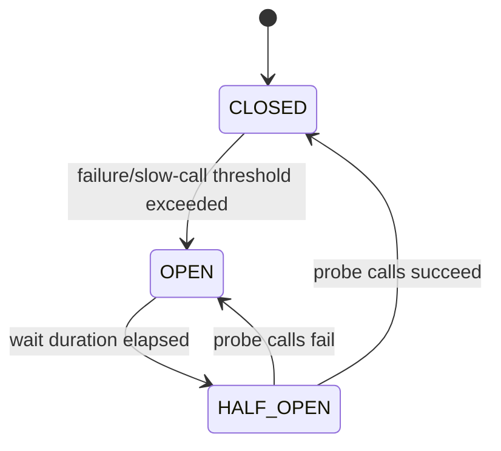
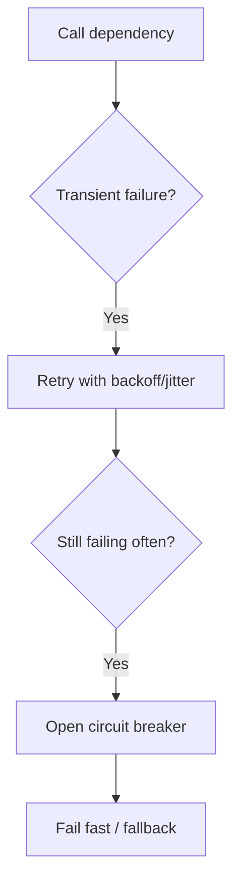
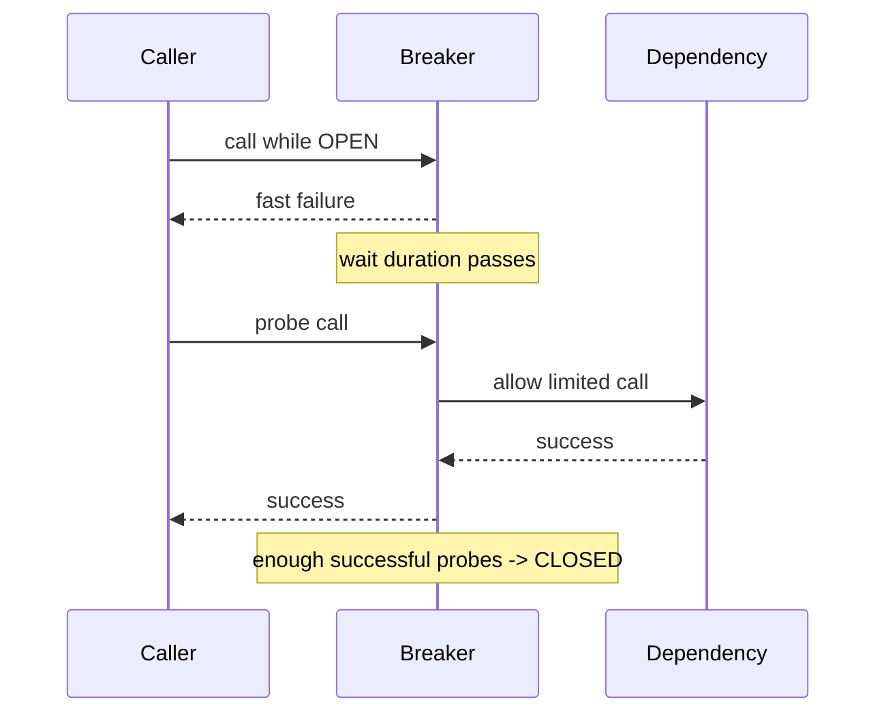
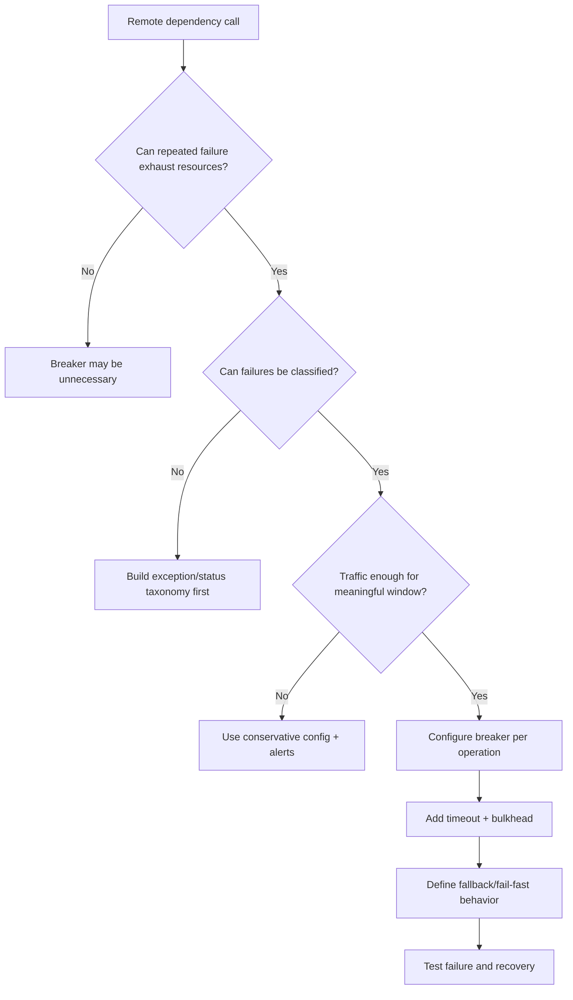

# Part 041 — Circuit Breaker Design with Resilience4j

A circuit breaker is not a magic shield.

It does not make a broken dependency healthy.

It does not make an unsafe command safe.

It does not replace timeout, retry, bulkhead, fallback, or capacity planning.

A circuit breaker does one specific thing:

> It stops sending calls to a dependency that is already showing sustained failure or unacceptable slowness.

That sounds small.

In a distributed system, it is critical.

Without a circuit breaker, every caller continues to spend resources on a dependency that is unlikely to succeed. Those wasted calls consume threads, sockets, connection pools, CPU, queues, retries, and user latency budget.

A circuit breaker converts repeated expensive failure into fast, classified failure.

That is failure containment.

---

## 1. The Core Mental Model

Imagine a caller repeatedly invoking a dependency.


When the dependency is healthy, calls pass through.

When enough calls fail or become too slow, the breaker opens.



The states mean:

| State | Meaning | Caller behavior |
|---|---|---|
| `CLOSED` | Dependency assumed healthy | Calls are allowed |
| `OPEN` | Dependency assumed unhealthy | Calls are rejected immediately |
| `HALF_OPEN` | Dependency is being tested | Limited probe calls are allowed |

Resilience4j also has special states such as `DISABLED`, `FORCED_OPEN`, and `METRICS_ONLY`, but the production mental model is still closed/open/half-open.

---

## 2. Why Circuit Breaker Exists

Remote calls fail differently from local calls.

A local method failure is usually cheap.

A remote call failure may require:

- connection acquisition,
- DNS lookup,
- TCP connect,
- TLS handshake,
- request serialization,
- proxy routing,
- server queueing,
- server execution,
- timeout waiting,
- response parsing,
- retry attempt.

If a dependency is already failing, repeating this full process for every request wastes resources.

Circuit breaker short-circuits the call.

```text
dependency unhealthy
→ do not spend full remote-call cost
→ fail fast
→ protect caller
→ give dependency time to recover
```

Martin Fowler describes the circuit breaker as wrapping a protected function call, monitoring failures, and tripping once failures reach a threshold so future calls return without invoking the protected function.

---

## 3. Circuit Breaker Is Not Retry

Retry and circuit breaker solve different problems.

| Pattern | Question |
|---|---|
| Retry | Should this failed attempt be tried again? |
| Circuit breaker | Should this dependency be called at all right now? |

Retry is optimistic.

Circuit breaker is defensive.

A typical interaction:



Bad design:

```text
retry forever behind a breaker that never opens
```

Also bad:

```text
breaker opens on one failure in low traffic
```

Good design:

```text
small bounded retry for transient failure
+ circuit breaker for sustained failure
+ bulkhead to isolate capacity
+ fallback or fail-fast response
```

---

## 4. Circuit Breaker Is Not Timeout

Timeout bounds one call.

Circuit breaker uses outcomes from many calls.

| Pattern | Scope |
|---|---|
| Timeout | One attempt |
| Circuit breaker | Rolling health of dependency/operation |

Without timeout, a call may hang too long before the breaker can classify it.

Without circuit breaker, many calls can repeatedly time out.

They are complementary.

```text
timeout -> turns slow call into bounded failure
circuit breaker -> stops repeated bounded failures
```

---

## 5. Circuit Breaker Is Not Bulkhead

Bulkhead limits concurrent resource usage.

Circuit breaker stops calls based on failure health.

| Pattern | Protects against |
|---|---|
| Bulkhead | One dependency consuming too many caller resources |
| Circuit breaker | Repeated calls to unhealthy dependency |
| Timeout | One call taking too long |
| Retry | One transient failure |
| Rate limiter | Caller sending too much traffic |

If a dependency is slow but still below breaker threshold, bulkhead still protects the caller.

If bulkhead is saturated, circuit breaker may not know the dependency is failing; it only sees rejected local calls if configured to record them.

Again: complementary, not substitutes.

---

## 6. What Counts as Failure?

This is the most important design decision.

Not every exception should open the breaker.

Failure categories:

| Failure | Count as breaker failure? | Reason |
|---|---:|---|
| `400 Bad Request` | No | Caller bug, not dependency health |
| `401 Unauthorized` | Usually no | Credential/config issue |
| `403 Forbidden` | No | Authorization decision |
| `404 Not Found` | Usually no | Domain result |
| `409 Conflict` domain conflict | No | Business conflict |
| `409 Request in progress` from dedup | Usually no | Retry/dedup state, not health |
| `422 Domain validation` | No | Caller/domain problem |
| `429 Too Many Requests` | Maybe | Dependency throttling; may indicate overload |
| `500 Internal Server Error` | Yes if provider fault |
| `502 Bad Gateway` | Yes |
| `503 Service Unavailable` | Yes |
| `504 Gateway Timeout` | Yes, with unknown outcome caution |
| connect timeout | Yes |
| read timeout | Yes |
| pool acquisition timeout | Maybe, but caller-side saturation |
| bulkhead full | Usually no for dependency breaker |
| circuit open | Not a remote failure; do not double count blindly |

A circuit breaker should reflect dependency health, not caller mistakes.

If caller sends invalid requests and gets many `400`s, opening the breaker would hide a caller bug and block valid traffic.

---

## 7. Exception Classification in Java

Use explicit classification.

```java
public final class CircuitBreakerFailureClassifier {
    public boolean shouldRecordFailure(Throwable throwable) {
        if (throwable instanceof RemoteValidationException) {
            return false;
        }

        if (throwable instanceof RemoteAuthenticationException) {
            return false;
        }

        if (throwable instanceof RemoteAuthorizationException) {
            return false;
        }

        if (throwable instanceof RemoteDomainConflictException) {
            return false;
        }

        if (throwable instanceof RemoteRateLimitedException) {
            return true;
        }

        if (throwable instanceof RemoteDependencyUnavailableException) {
            return true;
        }

        if (throwable instanceof RemoteTimeoutException) {
            return true;
        }

        return true;
    }
}
```

Resilience4j supports predicates such as:

- `recordException`,
- `ignoreException`,
- `recordExceptions`,
- `ignoreExceptions`.

Do not rely on default exception classification for production-grade semantics.

---

## 8. Failure Rate Threshold

A circuit breaker should not open after one random failure.

It should open after enough evidence.

Resilience4j calculates failure rate when a minimum number of calls has been recorded.

Example config:

```java
CircuitBreakerConfig config = CircuitBreakerConfig.custom()
    .slidingWindowType(CircuitBreakerConfig.SlidingWindowType.COUNT_BASED)
    .slidingWindowSize(100)
    .minimumNumberOfCalls(50)
    .failureRateThreshold(50.0f)
    .build();
```

Meaning:

```text
look at last 100 calls
do not calculate until at least 50 calls exist
open if >= 50% are failures
```

This avoids opening due to tiny sample size.

But beware low-traffic services.

If an operation receives 5 calls/minute, `minimumNumberOfCalls=100` may delay breaker reaction too long.

---

## 9. Count-Based vs Time-Based Sliding Window

Resilience4j supports count-based and time-based sliding windows.

### Count-based

```text
last N calls
```

Good when:

- traffic rate is stable,
- you want fixed sample size,
- operation gets enough calls.

Risk:

- under low traffic, old failures remain influential for a long time,
- under high traffic, window covers a very short time.

### Time-based

```text
last N seconds
```

Good when:

- you want time-local health,
- traffic rate varies,
- operational dashboards are time-based.

Risk:

- low traffic may still have insufficient samples,
- threshold may be noisy without `minimumNumberOfCalls`.

Decision:

| Traffic pattern | Better starting point |
|---|---|
| high, stable traffic | count-based or time-based both ok |
| low traffic | time-based with careful minimum calls |
| bursty traffic | time-based often easier |
| batch jobs | count-based may be clearer |
| critical command API | conservative threshold + alerts |

---

## 10. Slow Call Rate

Failure is not only exception.

A dependency that becomes very slow can cause cascading failure before it returns errors.

Resilience4j supports slow call rate.

Example:

```java
CircuitBreakerConfig config = CircuitBreakerConfig.custom()
    .slowCallDurationThreshold(Duration.ofMillis(500))
    .slowCallRateThreshold(50.0f)
    .minimumNumberOfCalls(50)
    .build();
```

Meaning:

```text
a call slower than 500 ms is slow
if >= 50% of measured calls are slow, open breaker
```

Slow-call circuit breaking is powerful.

It protects callers before hard failures happen.

But tune carefully:

- too low threshold → false opens during normal tail latency,
- too high threshold → slow dependency already harms caller,
- not aligned with timeout → slow call may be counted only after timeout.

`slowCallDurationThreshold` should relate to operation latency budget.

---

## 11. Half-Open Probes

After the breaker has been open for some time, it moves to half-open.

Half-open allows limited test calls.



Important settings:

| Setting | Meaning |
|---|---|
| `waitDurationInOpenState` | How long to stay open before probing |
| `permittedNumberOfCallsInHalfOpenState` | Number of probe calls allowed |
| `maxWaitDurationInHalfOpenState` | Avoid staying half-open forever |
| automatic transition | Whether breaker transitions without incoming calls |

Half-open probe volume must be small.

If you allow too many half-open calls, a recovering dependency can be hit by a surge.

---

## 12. Choosing Wait Duration

If wait duration is too short, the breaker hammers a dependency that is still down.

If too long, recovery is delayed.

Starting points:

| Dependency type | Starting wait duration |
|---|---:|
| fast internal service | 5–30 seconds |
| overloaded service | 10–60 seconds |
| external provider | 30 seconds–minutes |
| database-backed critical service | depends on failover/recovery time |
| batch/background dependency | longer is acceptable |

Use real incident data:

- deploy restart time,
- leader failover time,
- dependency autoscaling time,
- cache warmup time,
- database recovery time.

Circuit breaker timing should reflect how dependencies actually recover.

---

## 13. Circuit Breaker Granularity

Do not create one global breaker for everything.

Bad:

```text
case-service circuit breaker
```

If `searchCases` fails, `getCaseById` also gets blocked.

Better:

```text
case-service.getCaseById
case-service.searchCases
case-service.createEscalation
```

Granularity choices:

| Granularity | Pros | Cons |
|---|---|---|
| per dependency | simple | unrelated operations affect each other |
| per operation | good default | more config/metrics |
| per dependency + operation + tenant | precise | high cardinality risk |
| per endpoint path | maps to HTTP | path templates needed |
| per caller/provider pair | useful platform view | config complexity |

Default:

```text
one circuit breaker per dependency operation
```

Avoid dynamic breaker names using IDs, tenants, users, or raw URLs.

That creates cardinality explosion.

---

## 14. Circuit Breaker and Fallback

When breaker opens, what should happen?

Options:

| Strategy | Use when |
|---|---|
| fail fast | command cannot proceed safely |
| return stale cache | read can tolerate staleness |
| omit optional enrichment | dependency is non-critical |
| enqueue async work | command can be deferred |
| return degraded response | user can proceed with partial data |
| use alternate provider | safe alternate exists |

Fallback must be semantically valid.

Bad fallback:

```text
payment provider unavailable -> pretend payment succeeded
```

Good fallback:

```text
recommendation service unavailable -> return default ranking
```

For regulatory/case-management systems, be especially careful.

Failing closed is often safer than pretending success.

---

## 15. Resilience4j Basic Usage

```java
CircuitBreakerConfig config = CircuitBreakerConfig.custom()
    .slidingWindowType(CircuitBreakerConfig.SlidingWindowType.COUNT_BASED)
    .slidingWindowSize(100)
    .minimumNumberOfCalls(50)
    .failureRateThreshold(50.0f)
    .slowCallDurationThreshold(Duration.ofMillis(500))
    .slowCallRateThreshold(50.0f)
    .waitDurationInOpenState(Duration.ofSeconds(20))
    .permittedNumberOfCallsInHalfOpenState(5)
    .recordException(throwable -> failureClassifier.shouldRecordFailure(throwable))
    .ignoreException(throwable -> failureClassifier.shouldIgnore(throwable))
    .build();

CircuitBreaker breaker = CircuitBreaker.of("case-service.createEscalation", config);

Supplier<EscalationId> decorated =
    CircuitBreaker.decorateSupplier(breaker, () -> callCaseService(command));

EscalationId result = decorated.get();
```

This is the mechanical part.

The real work is choosing names, thresholds, classification, composition, fallback, and alerts.

---

## 16. Spring Boot Configuration Style

Conceptual configuration:

```yaml
resilience4j:
  circuitbreaker:
    instances:
      caseServiceCreateEscalation:
        slidingWindowType: COUNT_BASED
        slidingWindowSize: 100
        minimumNumberOfCalls: 50
        failureRateThreshold: 50
        slowCallDurationThreshold: 500ms
        slowCallRateThreshold: 50
        waitDurationInOpenState: 20s
        permittedNumberOfCallsInHalfOpenState: 5
        automaticTransitionFromOpenToHalfOpenEnabled: true
```

Configuration should be owned like production policy.

Do not bury thresholds inside annotations without review.

---

## 17. Annotation Convenience and Its Trap

Spring annotation style can be convenient:

```java
@CircuitBreaker(name = "caseServiceCreateEscalation", fallbackMethod = "fallback")
public EscalationId createEscalation(CreateEscalationCommand command) {
    return callRemote(command);
}
```

But annotation use can hide:

- decorator ordering,
- retry interaction,
- exception mapping,
- idempotency policy,
- fallback semantics,
- operation naming,
- metrics labels.

For critical service-to-service communication, explicit client adapter composition is often clearer.

Annotation is acceptable when policy is simple and centrally configured.

---

## 18. Decorator Ordering

Composition matters.

Example:

```java
Supplier<Response> supplier = () -> remoteCall();

Supplier<Response> decorated =
    Decorators.ofSupplier(supplier)
        .withBulkhead(bulkhead)
        .withTimeLimiter(timeLimiter, scheduler)
        .withRetry(retry)
        .withCircuitBreaker(circuitBreaker)
        .decorate();
```

But the meaning depends on ordering.

Questions:

- Should breaker see each retry attempt or the final logical call?
- Should bulkhead count retries separately?
- Should timeout apply per attempt or whole logical call?
- Should fallback happen after breaker open or after retry exhaustion?
- Should rate limiter limit original calls or attempts?

There is no universal order.

You must decide and test.

Common practical approach for synchronous dependency operation:

```text
rate limit
→ bulkhead
→ circuit breaker
→ retry with deadline awareness
→ timeout per attempt
→ remote call
```

But some teams place retry outside breaker so breaker sees individual attempt failures.

The key is not memorizing one order.

The key is knowing what each order means.

---

## 19. Circuit Breaker and Retry Ordering

### Option A — Breaker outside retry

```text
CircuitBreaker(Retry(Call))
```

Breaker sees one result after retries.

Pros:

- breaker represents logical operation success/failure,
- transient failures hidden by retry do not open breaker quickly,
- less sensitive.

Cons:

- dependency may receive more attempts before breaker reacts,
- sustained failure may be detected later.

### Option B — Retry outside breaker

```text
Retry(CircuitBreaker(Call))
```

Breaker sees each attempt.

Pros:

- breaker reacts faster,
- protects dependency sooner.

Cons:

- breaker may open from transient attempt failures,
- retry may immediately hit open breaker,
- metrics need careful interpretation.

For user-facing command APIs, I often prefer:

```text
limited retry inside logical operation,
breaker records final outcome plus slow-call metrics
```

For high-volume low-latency reads, attempt-level breaker can be acceptable.

Test with failure simulations.

---

## 20. Circuit Breaker and Bulkhead Ordering

If bulkhead is outside breaker:

```text
Bulkhead(CircuitBreaker(Call))
```

Then calls rejected by bulkhead do not reach breaker.

Good: breaker reflects dependency health, not local saturation.

If breaker is outside bulkhead:

```text
CircuitBreaker(Bulkhead(Call))
```

Then bulkhead rejections may be counted as breaker failures depending on config.

This can open breaker due to caller-side capacity saturation, not dependency failure.

Default recommendation:

```text
bulkhead outside dependency breaker
```

and do not count `BulkheadFullException` as dependency failure unless deliberately modeling end-to-end operation health.

---

## 21. Circuit Breaker and Timeout

Timeout should happen before breaker records outcome.

If a remote call exceeds timeout:

- timeout aborts attempt,
- breaker records failure or slow call,
- retry policy decides next attempt,
- fallback/fail-fast handles final result.

But distinguish:

| Timeout type | Count in breaker? |
|---|---:|
| remote response timeout | Yes |
| connect timeout | Yes |
| TLS timeout | Yes |
| pool acquisition timeout | Usually no for dependency health |
| deadline exceeded before call starts | No remote call happened |
| bulkhead queue timeout | Usually no for dependency health |

This classification matters.

---

## 22. Circuit Breaker and Commands

For side-effecting commands, circuit breaker open means:

> Do not call dependency.

What should the caller do?

Options:

- return `503` to upstream,
- enqueue command for later processing,
- fail workflow step and retry later,
- use alternate route,
- block only non-critical operation,
- degrade UI.

Do not silently drop commands.

Do not pretend success.

For commands, circuit breaker protects the caller from wasting resources, but business correctness still depends on:

- idempotency,
- deduplication,
- outbox,
- reconciliation,
- durable workflow state.

---

## 23. Circuit Breaker and Reads

Reads often have safer fallbacks.

Examples:

- cache fallback,
- stale read model,
- partial response,
- default configuration,
- previous known value.

But stale fallback must be explicit.

Example response metadata:

```json
{
  "caseId": "CASE-100",
  "status": "OPEN",
  "dataFreshness": {
    "source": "cache",
    "cachedAt": "2026-07-05T10:15:30Z",
    "stale": true
  }
}
```

Do not hide stale data if consumers need strong freshness.

---

## 24. Circuit Breaker Metrics

Minimum metrics:

```text
resilience4j.circuitbreaker.state{name}
resilience4j.circuitbreaker.calls{name,kind}
resilience4j.circuitbreaker.failure.rate{name}
resilience4j.circuitbreaker.slow.call.rate{name}
resilience4j.circuitbreaker.buffered.calls{name}
resilience4j.circuitbreaker.not.permitted.calls{name}
```

Operational dashboard should show:

- breaker state over time,
- call volume,
- failure rate,
- slow call rate,
- not-permitted calls,
- dependency latency,
- timeout rate,
- retry rate,
- fallback rate,
- upstream error rate.

A breaker opening is not always bad.

It may be protecting the system correctly.

The dashboard should show whether user impact is contained.

---

## 25. Alerts

Good alerts:

| Alert | Meaning |
|---|---|
| breaker open for critical dependency | dependency outage or sustained slowness |
| not-permitted calls high | traffic being failed fast |
| breaker flapping | thresholds/wait duration unstable or dependency unstable |
| slow call rate rising | early degradation |
| fallback rate rising | degraded mode active |
| open breaker plus retry surge | retry policy may be misordered |
| breaker never opens despite timeouts | classifier/config wrong |
| breaker opens with low traffic | minimum calls/window too low |

Avoid alerting on every state transition.

Alert on sustained or high-impact states.

---

## 26. Circuit Breaker Events

Resilience4j exposes events such as:

- state transition,
- success,
- error,
- ignored error,
- slow call,
- call not permitted.

Use events for logs and diagnostics.

Example:

```java
breaker.getEventPublisher()
    .onStateTransition(event -> logger.warn(
        "Circuit breaker state changed name={} transition={}",
        event.getCircuitBreakerName(),
        event.getStateTransition()
    ))
    .onCallNotPermitted(event -> metrics.incrementNotPermitted(event.getCircuitBreakerName()));
```

Do not log every success/error event in high-volume systems.

Use metrics for volume.

Use logs for state changes and unusual events.

---

## 27. Testing Circuit Breaker Behavior

Minimum tests:

| Scenario | Expected behavior |
|---|---|
| enough failures exceed threshold | breaker opens |
| failures below minimum calls | breaker does not open |
| ignored exception | not counted as failure |
| slow calls exceed threshold | breaker opens |
| open breaker | remote call not invoked |
| after wait duration | limited half-open probes allowed |
| half-open success | breaker closes |
| half-open failure | breaker reopens |
| fallback on open | correct degraded/fail-fast behavior |
| metrics emitted | state and not-permitted visible |

Example conceptual test:

```java
@Test
void opensAfterFailureRateThreshold() {
    CircuitBreaker breaker = CircuitBreaker.of("test", CircuitBreakerConfig.custom()
        .slidingWindowSize(10)
        .minimumNumberOfCalls(10)
        .failureRateThreshold(50)
        .build());

    Supplier<String> failing = CircuitBreaker.decorateSupplier(
        breaker,
        () -> { throw new RemoteDependencyUnavailableException(); }
    );

    for (int i = 0; i < 10; i++) {
        assertThatThrownBy(failing::get).isInstanceOf(RuntimeException.class);
    }

    assertThat(breaker.getState()).isEqualTo(CircuitBreaker.State.OPEN);
}
```

Half-open test:

```java
@Test
void closesAfterSuccessfulHalfOpenProbes() {
    // Use a test clock or very short waitDurationInOpenState.
    // Force breaker open, wait, allow permitted probe calls, then assert CLOSED.
}
```

Use deterministic configs in tests.

Do not make unit tests sleep for real production durations.

---

## 28. Chaos and Load Testing

Circuit breaker behavior should be verified under realistic failure.

Test cases:

- dependency returns 503 for 60 seconds,
- dependency latency jumps to 2 seconds,
- 10% random connection resets,
- gateway timeout spike,
- dependency partially recovers,
- one operation fails while another remains healthy,
- half-open probe surge,
- retry + breaker interaction,
- fallback cache under load,
- low-traffic operation threshold behavior.

Questions to answer:

- Does breaker open when expected?
- Does it prevent connection/thread exhaustion?
- Does it flap?
- Are fallbacks safe?
- Do retries stop when breaker opens?
- Do alerts fire correctly?
- Does recovery happen without a thundering herd?

---

## 29. Production Policy Template

```yaml
dependencies:
  case-service:
    operations:
      getCase:
        circuitBreaker:
          enabled: true
          slidingWindowType: TIME_BASED
          slidingWindowSizeSeconds: 30
          minimumNumberOfCalls: 100
          failureRateThreshold: 50
          slowCallDurationThresholdMs: 300
          slowCallRateThreshold: 50
          waitDurationInOpenStateSeconds: 15
          permittedCallsInHalfOpenState: 10
          recordFailures:
            - CONNECT_TIMEOUT
            - READ_TIMEOUT
            - HTTP_502
            - HTTP_503
            - HTTP_504
          ignoreFailures:
            - HTTP_400
            - HTTP_401
            - HTTP_403
            - HTTP_404
            - HTTP_409_DOMAIN_CONFLICT
            - HTTP_422
          fallback: stale-cache-if-fresh-enough

      createEscalation:
        circuitBreaker:
          enabled: true
          slidingWindowType: COUNT_BASED
          slidingWindowSize: 100
          minimumNumberOfCalls: 50
          failureRateThreshold: 40
          slowCallDurationThresholdMs: 600
          slowCallRateThreshold: 60
          waitDurationInOpenStateSeconds: 30
          permittedCallsInHalfOpenState: 5
          fallback: fail-fast-503
```

Policy should be:

- visible,
- versioned,
- reviewed,
- tested,
- connected to dashboards,
- aligned with timeout/retry/bulkhead policy.

---

## 30. Common Anti-Patterns

### 30.1 One breaker for all operations

A slow search endpoint opens the breaker for a fast lookup endpoint.

### 30.2 Counting caller errors as dependency failures

Bad request traffic opens the dependency breaker.

### 30.3 Too-low minimum calls

Breaker opens from tiny samples.

### 30.4 Too-high minimum calls

Breaker reacts too late.

### 30.5 No slow-call threshold

Dependency becomes very slow but breaker remains closed until hard failures.

### 30.6 Breaker without timeout

Calls hang too long before breaker gets evidence.

### 30.7 Breaker without bulkhead

Even while breaker is closed, slow calls can exhaust caller resources.

### 30.8 Fallback that lies

Returning fake success for a failed command corrupts business state.

### 30.9 Hidden annotation policy

Critical communication behavior is invisible in code review.

### 30.10 No alert on open breaker

Breaker protects system, but nobody knows degradation is active.

---

## 31. Decision Model



Circuit breaker is useful only when the service can classify outcomes and define safe behavior when calls are blocked.

---

## 32. Design Checklist

Before enabling a circuit breaker:

- What dependency and operation does it protect?
- What is the breaker name?
- Is the name low-cardinality?
- Which failures count?
- Which failures are ignored?
- Are slow calls counted?
- What is slow-call threshold?
- What is failure-rate threshold?
- What is sliding window type and size?
- What is minimum number of calls?
- What is wait duration in open state?
- How many half-open probes are allowed?
- What fallback or fail-fast behavior applies?
- How does it compose with retry?
- How does it compose with timeout?
- How does it compose with bulkhead?
- Are commands idempotent if retry exists?
- Are metrics and alerts configured?
- Are half-open and recovery tested?
- Is config documented in runbook?

---

## 33. The Real Lesson

Circuit breaker is not about being clever.

It is about refusing to keep doing something that is already known to be harmful.

A production Java microservice uses circuit breakers to preserve:

- caller capacity,
- dependency recovery time,
- predictable failure,
- observable degradation,
- user-facing containment.

The breaker is not the resilience strategy.

It is one containment boundary inside a larger strategy:

```text
timeout
+ retry with budget
+ circuit breaker
+ bulkhead
+ fallback/load shedding
+ observability
```

That is how synchronous communication fails safely instead of failing everywhere.

---

## References

- Resilience4j CircuitBreaker documentation: https://resilience4j.readme.io/docs/circuitbreaker
- Resilience4j Getting Started: https://resilience4j.readme.io/docs/getting-started
- Martin Fowler — Circuit Breaker: https://martinfowler.com/bliki/CircuitBreaker.html
- Google SRE Book — Addressing Cascading Failures: https://sre.google/sre-book/addressing-cascading-failures/
- Google SRE Book — Production Services Best Practices: https://sre.google/sre-book/service-best-practices/
- AWS Builders Library — Timeouts, retries, and backoff with jitter: https://aws.amazon.com/builders-library/timeouts-retries-and-backoff-with-jitter/
