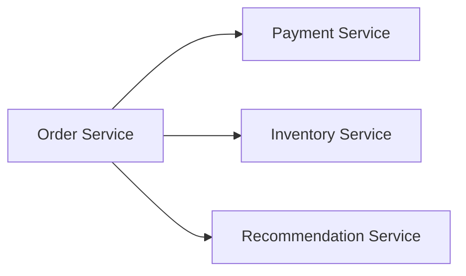
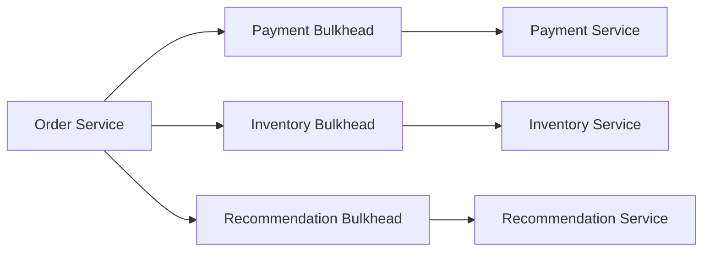
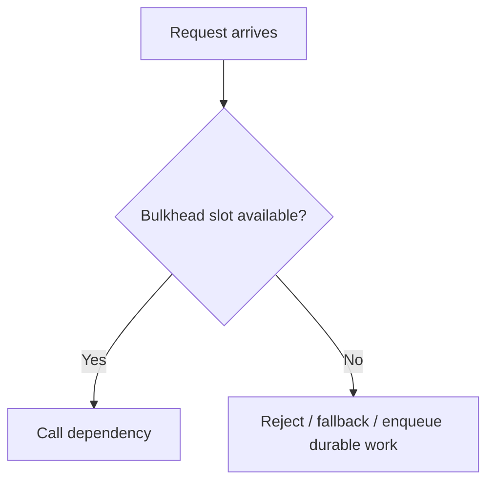
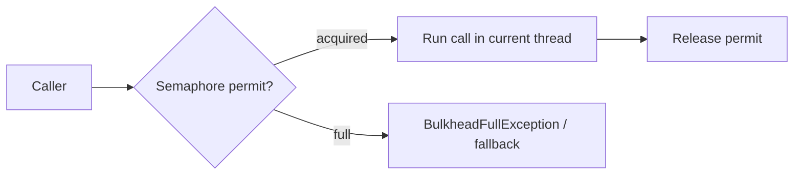
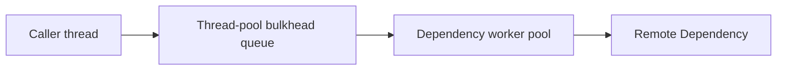
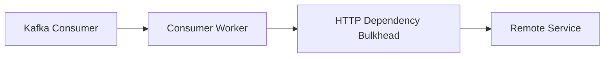
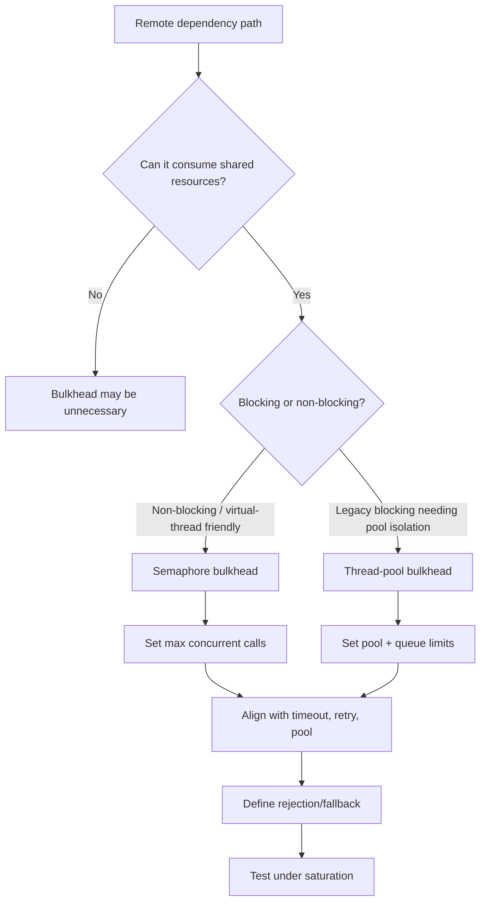

# Part 042 — Bulkhead Isolation: Thread, Semaphore, Queue, Pool

A bulkhead is a failure isolation boundary.

The name comes from ships: compartments prevent flooding in one section from sinking the entire vessel.

In microservices, the same idea applies:

> One slow or failing dependency must not consume all caller resources.

Without bulkheads, a single dependency can exhaust:

- request threads,
- virtual threads,
- worker pools,
- HTTP client connections,
- database connections,
- message consumer threads,
- CPU,
- memory,
- queues,
- retry capacity.

Bulkhead isolation is not just a pattern.

It is resource governance.

---

## 1. The Core Problem

Suppose a service handles 1000 RPS and calls three dependencies:



If Recommendation Service becomes slow, calls to it may accumulate.

Without isolation, it can consume the same shared thread pool used by payment and inventory operations.

Result:

```text
non-critical recommendation failure
→ all threads blocked
→ payment path fails
→ inventory path fails
→ order service outage
```

A bulkhead prevents that.



Each dependency gets bounded capacity.

If one fills up, it fails fast or queues only within its own limits.

---

## 2. Bulkhead vs Circuit Breaker

They are often confused.

| Pattern | Controls | Main purpose |
|---|---|---|
| Bulkhead | Concurrency/resource usage | Prevent one dependency from consuming all local capacity |
| Circuit breaker | Whether calls are allowed based on failure health | Stop calling unhealthy dependency |
| Timeout | Duration of one attempt | Bound resource hold time |
| Retry | Re-execution | Recover transient failures |
| Rate limiter | Call admission over time | Limit request rate |

Bulkhead answers:

> How many concurrent calls to this dependency are allowed?

Circuit breaker answers:

> Should this dependency be called at all right now?

You usually need both.

---

## 3. Bulkhead Is Capacity Math

A bulkhead limit should not be guessed.

Use Little's Law intuition:

```text
concurrency ≈ throughput × latency
```

If a dependency call has:

```text
target throughput = 200 requests/second
p95 latency = 100 ms = 0.1 s
```

Expected concurrency:

```text
200 × 0.1 = 20
```

Add headroom:

```text
bulkhead max concurrent calls = 30–40
```

If latency degrades to 1 second:

```text
200 × 1.0 = 200 concurrent calls
```

Without a bulkhead, the caller may allow 200 in-flight calls.

With bulkhead limit 40, the caller rejects or sheds excess calls before all capacity is consumed.

---

## 4. Bulkhead Protects the Caller First

This is an important mindset.

A bulkhead does not primarily protect the dependency.

It protects the caller from being consumed by the dependency.

When the bulkhead is full, the caller should usually fail fast, degrade, or apply backpressure.

It should not create an unbounded queue.



The point is controlled refusal.

Uncontrolled waiting is how overload spreads.

---

## 5. Semaphore Bulkhead

A semaphore bulkhead limits concurrent executions.

```text
maxConcurrentCalls = 50
```

If 50 calls are already running, the 51st is rejected or waits for a bounded duration.



Resilience4j's `SemaphoreBulkhead` works across threading and I/O models because it uses a semaphore and does not create a shadow thread pool.

Use semaphore bulkhead when:

- caller already has appropriate execution model,
- calls are non-blocking or bounded blocking,
- you want minimal overhead,
- you want to limit concurrent access only,
- you do not need separate worker pool isolation.

Risk:

- if protected call blocks, it blocks the current thread,
- you must size surrounding thread pools correctly,
- waiting for permits can still consume caller threads if max wait is too high.

---

## 6. Thread-Pool Bulkhead

A thread-pool bulkhead isolates execution onto a separate thread pool.



It controls:

- core pool size,
- max pool size,
- queue capacity,
- keep-alive,
- rejected execution.

Use thread-pool bulkhead when:

- blocking dependency call should not block caller/request threads,
- dependency has unpredictable latency,
- you need hard isolation between resource pools,
- legacy blocking client cannot be changed,
- you want separate queue and execution pool.

Risk:

- queueing adds latency,
- thread pool tuning is hard,
- too many pools create overhead,
- context propagation becomes more complex,
- async/reactive code can be harmed by blocking inside pools.

---

## 7. Queue Is Part of the Bulkhead

A queue is not free capacity.

A queue is stored latency.

If a dependency is slow, a large queue creates:

- stale work,
- high tail latency,
- memory pressure,
- timeout-after-wait,
- burst release after recovery,
- misleading "accepted" behavior.

Example:

```text
thread pool size = 20
queue size = 1000
dependency latency = 2 seconds
```

At high traffic, queued calls may wait so long that the upstream request deadline expires before execution starts.

Default posture:

```text
small bounded queue, or no queue, unless async work is durable and semantically valid
```

For synchronous user-facing calls, prefer fail fast over deep queueing.

---

## 8. Bulkhead Full Is a Signal

When a bulkhead is full, that is not just an exception.

It means:

```text
this dependency path is consuming its allocated capacity
```

Possible responses:

| Operation type | Bulkhead full response |
|---|---|
| critical command | fail fast `503` or move to durable workflow if safe |
| optional enrichment | omit enrichment |
| cacheable read | return stale cache |
| report generation | return async job accepted |
| background task | reschedule with backoff |
| low-priority feature | shed load |

Do not treat `BulkheadFullException` as generic 500.

It is controlled admission refusal.

---

## 9. Bulkhead Granularity

Use bulkheads per dependency operation or dependency class.

Bad:

```text
one global remote-call bulkhead
```

Recommendation failure can still starve payment calls.

Better:

```text
paymentService.charge
inventoryService.reserve
recommendationService.getSuggestions
caseService.getCase
caseService.createEscalation
```

But avoid too many tiny bulkheads.

Granularity trade-off:

| Granularity | Pros | Cons |
|---|---|---|
| global | simple | weak isolation |
| per dependency | good starting point | slow operation can affect fast operation |
| per dependency operation | strong default | more config |
| per tenant/user | precise | cardinality and fairness complexity |
| per priority class | good for load shedding | needs request classification |

Default:

```text
per critical dependency operation
```

---

## 10. Bulkhead and Connection Pool Must Align

Bulkhead limit and HTTP connection pool size must be consistent.

Bad:

```text
bulkhead maxConcurrentCalls = 100
HTTP maxConnectionsPerRoute = 10
```

Ninety calls can acquire bulkhead permits and then wait for connections.

Bad:

```text
bulkhead maxConcurrentCalls = 10
HTTP maxConnectionsPerRoute = 100
```

Connection pool has unused capacity, but bulkhead may be intentionally tighter. That is okay if deliberate.

Design:

```text
bulkhead limit <= useful connection concurrency
pool acquisition timeout short
connection pool max >= bulkhead limit if no other sharing
```

Also consider:

- HTTP/2 multiplexing,
- service mesh connection pooling,
- gateway limits,
- server-side concurrency,
- downstream database pool.

Bulkhead is one resource boundary among many.

---

## 11. Bulkhead and Thread Pools

If using servlet/blocking stack, request threads are finite.

If dependency calls block request threads, slow dependency can exhaust server request handling.

Bulkhead mitigates but does not eliminate blocking cost.

For thread-pool bulkhead:

```text
caller request thread waits on Future
dependency worker thread blocks on HTTP
```

Now two threads can be involved.

That may be worse if misused.

Thread-pool bulkhead is useful for isolating blocking work, but it must be sized carefully.

With Java virtual threads, blocking is cheaper, but not free.

Virtual threads reduce platform thread blocking, but they do not remove limits on:

- downstream capacity,
- socket connections,
- heap memory,
- CPU,
- database pools,
- remote server concurrency,
- queues,
- rate limits.

You still need bulkheads.

---

## 12. Virtual Threads and Bulkheads

Java virtual threads make it easier to write blocking-style code with high concurrency.

But high concurrency without admission control can overwhelm dependencies.

```text
virtual threads make waiting cheaper for caller runtime
they do not make dependency capacity infinite
```

A service with virtual threads can accidentally launch thousands of concurrent remote calls.

Bulkhead remains necessary to cap:

- per-dependency in-flight calls,
- per-operation concurrency,
- expensive external provider calls,
- memory held by request state,
- downstream load.

For virtual-thread services, semaphore bulkhead often fits well:

```text
use virtual threads for simple blocking style
use semaphore bulkhead for dependency concurrency limits
use timeout/deadline for bounded wait
```

Thread-pool bulkhead may be less attractive unless you need strict isolation for legacy blocking operations or CPU-bound work.

---

## 13. Resilience4j Semaphore Bulkhead

Conceptual usage:

```java
BulkheadConfig config = BulkheadConfig.custom()
    .maxConcurrentCalls(50)
    .maxWaitDuration(Duration.ofMillis(0))
    .build();

Bulkhead bulkhead = Bulkhead.of("case-service.getCase", config);

Supplier<CaseSnapshot> decorated =
    Bulkhead.decorateSupplier(bulkhead, () -> callCaseService(caseId));

CaseSnapshot result = decorated.get();
```

`maxWaitDuration = 0` means fail immediately when full.

That is often right for synchronous user-facing calls.

If you allow waiting:

```java
.maxWaitDuration(Duration.ofMillis(25))
```

Keep it small and within the caller deadline.

---

## 14. Resilience4j ThreadPoolBulkhead

Conceptual usage:

```java
ThreadPoolBulkheadConfig config = ThreadPoolBulkheadConfig.custom()
    .coreThreadPoolSize(10)
    .maxThreadPoolSize(20)
    .queueCapacity(50)
    .build();

ThreadPoolBulkhead bulkhead =
    ThreadPoolBulkhead.of("external-provider.submitDocument", config);
```

Thread-pool bulkhead returns asynchronous types.

Use when you intentionally want separate executor isolation.

But remember:

```text
queueCapacity = 50
```

means up to 50 tasks can wait before execution.

If each task has a 500 ms deadline and waits 2 seconds in the queue, execution is already pointless.

Make queued tasks deadline-aware.

---

## 15. Spring Configuration Example

Conceptual Resilience4j config:

```yaml
resilience4j:
  bulkhead:
    instances:
      caseServiceGetCase:
        maxConcurrentCalls: 80
        maxWaitDuration: 10ms
      caseServiceCreateEscalation:
        maxConcurrentCalls: 40
        maxWaitDuration: 0ms
      recommendationServiceGetSuggestions:
        maxConcurrentCalls: 20
        maxWaitDuration: 0ms

  thread-pool-bulkhead:
    instances:
      externalDocumentProviderSubmit:
        coreThreadPoolSize: 10
        maxThreadPoolSize: 20
        queueCapacity: 25
```

Do not copy numbers.

Calculate and load test them.

---

## 16. Bulkhead Sizing

Start with:

```text
limit = target throughput × target latency × headroom factor
```

Example:

```text
operation = getCase
target throughput = 400 RPS
target p95 dependency latency = 80 ms = 0.08 s
expected concurrency = 400 × 0.08 = 32
headroom = 1.5
bulkhead = 48
```

Round to:

```text
maxConcurrentCalls = 50
```

Then validate with load test.

For command:

```text
operation = createEscalation
target throughput = 80 RPS
target p95 latency = 250 ms = 0.25 s
expected concurrency = 80 × 0.25 = 20
headroom = 1.5
bulkhead = 30
```

Use lower limits for:

- expensive dependencies,
- external providers,
- fragile systems,
- operations with side effects,
- low-priority features.

---

## 17. Bulkhead Sizing Must Consider Tail Latency

Using p50 latency underestimates concurrency.

If p50 is 50 ms but p99 is 1 second, concurrency spikes during tail events.

Compute scenarios:

| Latency | RPS | In-flight |
|---:|---:|---:|
| 50 ms | 200 | 10 |
| 200 ms | 200 | 40 |
| 1 s | 200 | 200 |

Bulkhead limit defines how much tail latency you are willing to absorb.

If limit is 50, the service sheds excess at 200 ms+ degradation rather than accumulating 200 in-flight calls.

---

## 18. Bulkhead and Priority

Not all traffic is equal.

Examples:

- user-facing requests,
- internal workflow commands,
- batch jobs,
- analytics/reporting,
- reconciliation,
- admin tools.

A low-priority batch job should not consume the same dependency capacity as user-facing requests.

Priority-aware bulkheads:

```text
caseService.getCase.user = 80
caseService.getCase.batch = 20
caseService.getCase.admin = 10
```

Or:

```text
shared hard max = 100
reserved user capacity = 70
batch can use spare only
```

This is more advanced but useful in regulatory/case systems where batch and online workloads coexist.

---

## 19. Bulkhead and Retries

Retries consume bulkhead slots.

If retry is inside bulkhead:

```text
Bulkhead(Retry(Call))
```

One bulkhead permit may be held across multiple attempts and backoff waits.

Bad if backoff sleeps while holding permit.

If retry is outside bulkhead:

```text
Retry(Bulkhead(Call))
```

Each attempt acquires a permit separately.

This avoids holding a permit during backoff but increases contention during failure.

Recommended:

```text
do not hold bulkhead permit while sleeping backoff
```

Implementation should release permit after failed attempt before waiting.

Decorator ordering must be tested.

---

## 20. Bulkhead and Circuit Breaker

Common order:

```text
Bulkhead -> CircuitBreaker -> RemoteCall
```

This means:

- local capacity is checked first,
- if bulkhead full, fail fast locally,
- breaker sees remote-call outcomes, not local saturation.

If circuit breaker is outside:

```text
CircuitBreaker -> Bulkhead -> RemoteCall
```

bulkhead full may count as breaker failure depending on classification.

That can open a dependency breaker due to local caller saturation.

Usually undesirable.

Default:

```text
bulkhead outside dependency circuit breaker
ignore bulkhead-full in dependency-health breaker
```

But track bulkhead-full separately.

---

## 21. Bulkhead and Timeout

Bulkhead wait time must be part of deadline.


If caller has 500 ms deadline:

```text
bulkhead wait = 200 ms
remote timeout = 450 ms
total = 650 ms
```

Wrong.

Correct:

```text
remaining deadline after bulkhead wait determines remote timeout
```

Set `maxWaitDuration` very small for synchronous calls.

Or reject immediately.

---

## 22. Bulkhead and Async Work

For background jobs, waiting may be acceptable.

But use durable queues, not in-memory queues, when work must not be lost.

If bulkhead full:

| Work type | Better behavior |
|---|---|
| must eventually happen | persist/retry later |
| optional | drop/skip |
| user-facing | return accepted or fail fast |
| external provider | reschedule with backoff |
| report/export | async job queue |

In-memory thread-pool queue is not durable.

If process crashes, queued tasks are gone.

Do not use a thread-pool bulkhead queue as a durable workflow system.

---

## 23. Bulkhead and Message Consumers

Message consumers need bulkheads too.

Example:



Without bulkhead, a replay or lag catch-up can create too many downstream calls.

Consumer concurrency should align with:

- partition count,
- worker pool size,
- downstream bulkhead,
- retry policy,
- rate limit,
- idempotent consumer behavior.

If bulkhead full, consumer can:

- pause partitions,
- nack/requeue with delay,
- park message,
- reduce poll rate,
- backpressure worker pool.

Do not let message replay DDoS an internal dependency.

---

## 24. Bulkhead and Fan-Out

Fan-out multiplies concurrency.

One incoming request calls 10 dependencies or 10 items.

```text
incoming concurrency = 100
fan-out per request = 10
possible downstream concurrency = 1000
```

Bulkhead must cap fan-out.

Example:

```java
Semaphore fanoutLimit = new Semaphore(50);
```

For batch endpoints:

- cap batch size,
- cap per-request fan-out,
- cap global dependency concurrency,
- cap per-tenant concurrency,
- prefer async processing for large bulk.

Bulkhead is essential in fan-out designs.

---

## 25. Observability

Bulkhead metrics must answer:

- how many calls are permitted?
- how many calls are rejected?
- how long do calls wait for permits?
- how many concurrent calls are active?
- how full is the queue?
- which operation is saturated?
- does saturation correlate with latency/retry/timeouts?

Metrics:

```text
bulkhead.available.concurrent.calls{name}
bulkhead.max.allowed.concurrent.calls{name}
bulkhead.calls{name,kind=permitted|rejected|finished}
bulkhead.wait.duration{name}
threadpool.bulkhead.queue.depth{name}
threadpool.bulkhead.active.threads{name}
threadpool.bulkhead.rejected{name}
```

Logs for rejection:

```json
{
  "event": "bulkhead_rejected",
  "dependency": "case-service",
  "operation": "createEscalation",
  "bulkhead": "caseServiceCreateEscalation",
  "maxConcurrentCalls": 40,
  "fallback": "fail-fast-503",
  "retryable": true
}
```

Avoid logging payloads or identifiers.

---

## 26. Alerting

Useful alerts:

| Alert | Meaning |
|---|---|
| bulkhead rejected rate > baseline | dependency path saturated |
| bulkhead wait p95 rising | approaching saturation |
| active calls near max for sustained time | capacity pressure |
| thread-pool queue near full | latency buildup |
| bulkhead full + retries rising | retry amplification |
| bulkhead full for critical command | user/business impact |
| one dependency full while others healthy | isolation working, dependency-specific issue |
| global request pool exhausted | bulkheads insufficient or misplaced |

Bulkhead rejection is not always bad.

It may be exactly the correct containment behavior.

Alert should distinguish:

```text
contained degradation
vs
user-visible outage
vs
misconfigured capacity
```

---

## 27. Testing Bulkhead Behavior

Minimum tests:

| Scenario | Expected behavior |
|---|---|
| under limit | calls succeed |
| over limit | extra calls rejected |
| max wait duration zero | immediate rejection |
| wait duration small | waits briefly then rejects |
| permit released on success | capacity restored |
| permit released on exception | no leak |
| timeout while holding permit | permit released |
| retry does not hold permit during backoff | no capacity leak |
| bulkhead full not counted as dependency breaker failure | classifier correct |
| metrics emitted | permitted/rejected visible |

Concurrency test:

```java
@Test
void rejectsWhenBulkheadFull() throws Exception {
    Bulkhead bulkhead = Bulkhead.of("test", BulkheadConfig.custom()
        .maxConcurrentCalls(1)
        .maxWaitDuration(Duration.ZERO)
        .build());

    CountDownLatch started = new CountDownLatch(1);
    CountDownLatch release = new CountDownLatch(1);

    Supplier<String> slow = Bulkhead.decorateSupplier(bulkhead, () -> {
        started.countDown();
        await(release);
        return "ok";
    });

    ExecutorService executor = Executors.newFixedThreadPool(2);

    Future<String> first = executor.submit(slow::get);
    started.await();

    Supplier<String> second = Bulkhead.decorateSupplier(bulkhead, () -> "second");

    assertThatThrownBy(second::get)
        .isInstanceOf(BulkheadFullException.class);

    release.countDown();
    assertThat(first.get()).isEqualTo("ok");
}
```

Permit leak test:

```java
@Test
void releasesPermitAfterException() {
    Bulkhead bulkhead = Bulkhead.of("test", BulkheadConfig.custom()
        .maxConcurrentCalls(1)
        .build());

    Supplier<String> failing = Bulkhead.decorateSupplier(bulkhead, () -> {
        throw new RuntimeException("boom");
    });

    assertThatThrownBy(failing::get).isInstanceOf(RuntimeException.class);

    Supplier<String> succeeding = Bulkhead.decorateSupplier(bulkhead, () -> "ok");

    assertThat(succeeding.get()).isEqualTo("ok");
}
```

---

## 28. Load Testing Bulkheads

Unit tests prove mechanics.

Load tests prove sizing.

Test cases:

- dependency latency increases 10x,
- dependency hangs until timeout,
- one dependency fails while others stay healthy,
- fan-out request bursts,
- batch retry catch-up,
- consumer lag replay,
- thread-pool queue fills,
- virtual-thread service launches high concurrency,
- retry + bulkhead interaction,
- circuit breaker open while bulkhead saturated.

Questions:

- Does the bulkhead prevent global thread exhaustion?
- Does critical traffic still pass?
- Are optional features shed first?
- Is queueing bounded?
- Are rejections fast and classified?
- Do retries amplify saturation?
- Are dashboards clear?

---

## 29. Production Policy Template

```yaml
dependencies:
  case-service:
    operations:
      getCase:
        bulkhead:
          type: semaphore
          maxConcurrentCalls: 80
          maxWaitDurationMs: 10
          fallback: stale-cache-if-available
          priority: user-facing

      createEscalation:
        bulkhead:
          type: semaphore
          maxConcurrentCalls: 40
          maxWaitDurationMs: 0
          fallback: fail-fast-503
          priority: critical-command

  recommendation-service:
    operations:
      getSuggestions:
        bulkhead:
          type: semaphore
          maxConcurrentCalls: 20
          maxWaitDurationMs: 0
          fallback: omit-enrichment
          priority: optional

  external-document-provider:
    operations:
      submitDocument:
        bulkhead:
          type: thread-pool
          coreThreadPoolSize: 10
          maxThreadPoolSize: 20
          queueCapacity: 25
          queueWaitDeadlineAware: true
          fallback: durable-reschedule
```

Every bulkhead config should explain:

- protected dependency,
- operation,
- rationale for limit,
- fallback/rejection behavior,
- owner,
- dashboard,
- runbook.

---

## 30. Common Anti-Patterns

### 30.1 No bulkhead

All remote calls share the same unbounded resource pool.

### 30.2 One global bulkhead

One failing dependency still blocks unrelated dependency calls.

### 30.3 Huge queue

Queue hides overload and creates stale work.

### 30.4 Wait while holding scarce resource

Retry backoff sleeps while holding permit/thread.

### 30.5 Bulkhead larger than downstream can handle

Caller overwhelms dependency despite local isolation.

### 30.6 Bulkhead smaller than required without fallback

Valid traffic is rejected during normal load.

### 30.7 Ignoring connection pool alignment

Bulkhead permits become connection-pool waiters.

### 30.8 Counting bulkhead full as dependency failure

Circuit breaker opens for local saturation.

### 30.9 Using in-memory queue for durable work

Process crash loses accepted work.

### 30.10 Assuming virtual threads remove need for limits

Virtual threads reduce blocking cost, not downstream capacity constraints.

---

## 31. Decision Model



Choose bulkhead type based on execution model, not library fashion.

---

## 32. Design Checklist

Before shipping a dependency call:

- What resource can this dependency consume?
- Is the dependency critical, optional, or background?
- What is target throughput?
- What is normal and tail latency?
- What concurrency does that imply?
- What is max concurrent call limit?
- Is there a queue? Why?
- What is max wait duration?
- Is wait time included in deadline?
- Is HTTP connection pool aligned?
- Is retry holding permits during backoff?
- Is bulkhead full classified separately?
- Does circuit breaker ignore local bulkhead rejections?
- What fallback happens when full?
- Is low-priority work isolated?
- Are metrics/alerts configured?
- Has load testing verified containment?
- Are virtual threads still bounded by semaphores?
- Is there a runbook for saturation?

---

## 33. The Real Lesson

Bulkhead isolation is how you prevent one failure domain from becoming every failure domain.

A service without bulkheads says:

```text
any dependency may consume everything
```

A service with bulkheads says:

```text
each dependency gets a bounded blast radius
```

That is the real goal:

```text
bounded concurrency
+ bounded queue
+ bounded wait
+ explicit fallback
+ observable saturation
```

In production microservices, isolation is not optional.

It is what keeps partial failure partial.

---

## References

- Resilience4j Bulkhead documentation: https://resilience4j.readme.io/docs/bulkhead
- Spring Cloud CircuitBreaker Resilience4j Bulkhead properties: https://docs.spring.io/spring-cloud-circuitbreaker/reference/spring-cloud-circuitbreaker-resilience4j/bulkhead-properties-configuration.html
- Resilience4j Getting Started: https://resilience4j.readme.io/docs/getting-started
- Google SRE Book — Addressing Cascading Failures: https://sre.google/sre-book/addressing-cascading-failures/
- Google SRE Book — Production Services Best Practices: https://sre.google/sre-book/service-best-practices/
- Martin Fowler — Circuit Breaker: https://martinfowler.com/bliki/CircuitBreaker.html
