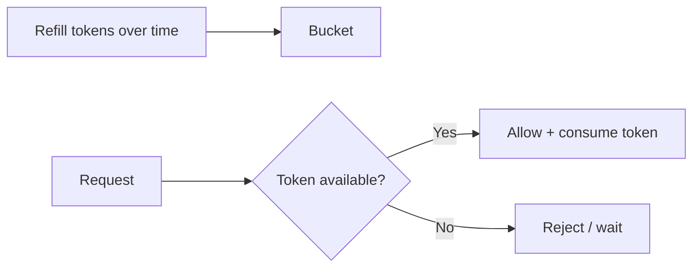
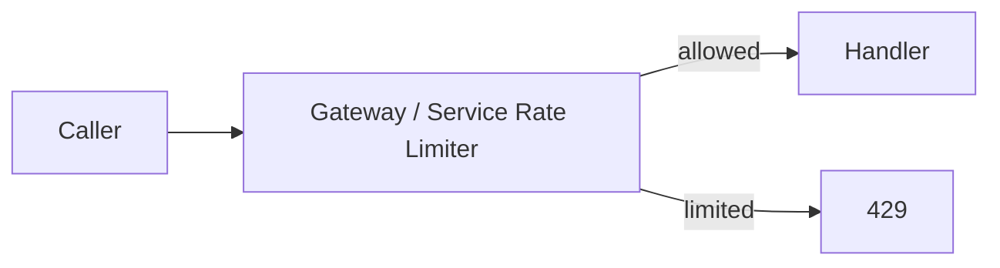
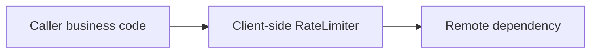
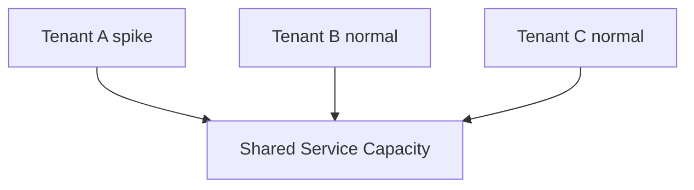
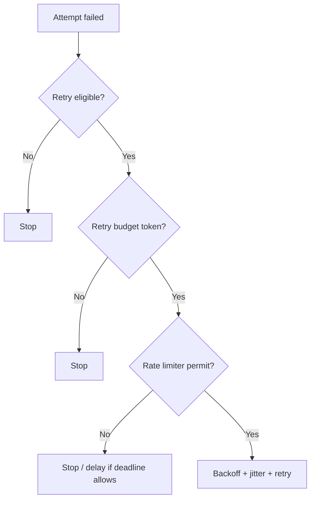
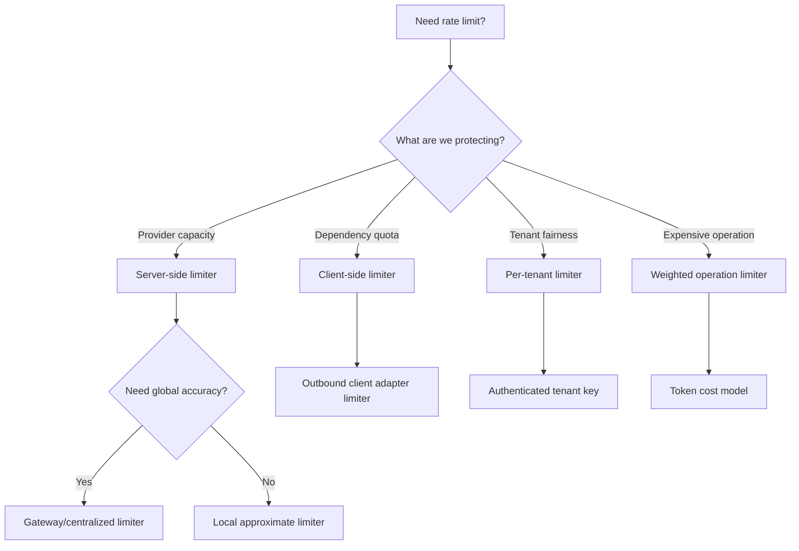

# Part 043 — Rate Limiting and Client-Side Throttling

Rate limiting is admission control over time.

It answers:

> How many requests is this caller, tenant, client, endpoint, or dependency path allowed to make during a time window?

Without rate limiting, traffic can grow until some other part of the system becomes the limiter:

- CPU saturation,
- database connection exhaustion,
- thread pool exhaustion,
- queue explosion,
- broker lag,
- dependency throttling,
- garbage collection pressure,
- network bottleneck,
- external provider quota,
- cascading failure.

That is the worst kind of limit: accidental, late, and uncontrolled.

A production service should prefer explicit limits.

```text
reject early
over fail late
```

---

## 1. Rate Limiting vs Load Shedding

These two are related but not identical.

| Concept | Question | Example |
|---|---|---|
| Rate limiting | Is this caller within allowed quota/rate? | Tenant A may call `searchCases` 100 RPS |
| Client-side throttling | Should this client slow itself before being rejected? | Caller limits outbound dependency calls to 50 RPS |
| Load shedding | Is the system too overloaded to accept more work? | Server drops low-priority traffic at high CPU/queue depth |
| Bulkhead | How many concurrent calls can occupy this resource? | Max 40 concurrent calls to `case-service.createEscalation` |
| Circuit breaker | Is dependency unhealthy enough to stop calling? | Open breaker after 50% failures |
| Retry budget | How many extra retry attempts can be afforded? | Retries max 10% of original traffic |

Rate limiting is usually about **fairness, quota, and predictable usage**.

Load shedding is about **survival under overload**.

They often work together, but they should not be designed as the same mechanism.

---

## 2. Why Rate Limiting Matters in Internal Microservices

Teams often rate-limit public APIs but ignore internal APIs.

That is a mistake.

Internal callers can create more dangerous traffic than external users:

- batch jobs,
- replay jobs,
- retry storms,
- workflow engines,
- message consumers catching up after lag,
- data migration scripts,
- misconfigured cron jobs,
- fan-out services,
- generated clients with aggressive parallelism,
- low-priority analytics jobs.

Internal does not mean safe.

Internal traffic often bypasses edge protections and hits critical dependencies directly.

Rate limits are internal blast-radius controls.

---

## 3. What Can Be Limited?

Rate limit dimensions:

| Dimension | Example |
|---|---|
| Caller service | `workflow-service` max 500 RPS to `case-service` |
| Tenant/account | Tenant A max 100 RPS |
| User | User U max 20 requests/minute |
| API operation | `searchCases` max 200 RPS |
| HTTP method | `POST` commands stricter than `GET` |
| Resource key | one case cannot receive 1000 updates/sec |
| Priority class | batch lower than user-facing |
| Region | regional capacity-specific limits |
| External provider | provider quota 1000 requests/minute |
| Retry traffic | retries limited separately |
| Expensive query shape | complex filters lower quota |
| Payload size | large requests consume more tokens |

A mature limiter often uses multiple dimensions.

Example:

```text
caller-service + operation + tenant + priority
```

But beware cardinality and complexity.

Start with dimensions that map to ownership and capacity.

---

## 4. Rate Limit Is a Contract

If a service rate-limits consumers, it should document:

- who is limited,
- what is limited,
- limit value,
- window,
- burst allowance,
- response status,
- retry-after behavior,
- headers,
- whether retries count,
- whether failed requests count,
- whether idempotent replay counts,
- how to request higher limit,
- whether limits differ by environment/tenant/priority.

Without a contract, rate limiting becomes random production pain.

For HTTP APIs, rate-limit responses usually use:

```http
429 Too Many Requests
```

and often include:

```http
Retry-After: 2
```

Newer RateLimit fields are also defined to communicate quota policy and current limit state.

---

## 5. HTTP Rate Limit Signals

Typical response:

```http
HTTP/1.1 429 Too Many Requests
Content-Type: application/problem+json
Retry-After: 2
RateLimit: limit=100, remaining=0, reset=2
RateLimit-Policy: 100;w=60
```

Problem body:

```json
{
  "type": "https://errors.example.internal/rate-limited",
  "title": "Rate limit exceeded",
  "status": 429,
  "detail": "The caller exceeded the allowed rate for this operation.",
  "extensions": {
    "code": "RATE_LIMITED",
    "retryable": true,
    "retryAfterMillis": 2000,
    "limitScope": "caller-service:workflow-service:operation:searchCases"
  }
}
```

Important:

- `429` is not a server crash.
- `429` is intentional admission control.
- Clients must not retry immediately.
- Server should provide enough signal for cooperative clients to slow down.

---

## 6. `Retry-After`

`Retry-After` can be a delay in seconds or an HTTP date.

Examples:

```http
Retry-After: 5
```

```http
Retry-After: Sun, 05 Jul 2026 10:15:30 GMT
```

Client rule:

```text
respect Retry-After if it fits the caller deadline and retry policy
```

If `Retry-After` is too long for a synchronous request, do not sleep the request thread for a long time.

Return controlled failure or shift to async workflow.

Example:

```text
Retry-After = 30 seconds
user request deadline = 800 ms
```

Do not wait.

Return a retryable/degraded response upstream.

---

## 7. Rate Limit Algorithms

### 7.1 Fixed window

```text
100 requests per minute
window: 10:00:00–10:00:59
```

Simple, but boundary bursts can happen.

A caller can send 100 requests at 10:00:59 and 100 more at 10:01:00.

Pros:

- simple,
- cheap,
- easy to reason.

Cons:

- boundary burst,
- unfair at edges.

### 7.2 Sliding window log

Store timestamps of recent requests.

Precise but expensive at high volume.

Pros:

- accurate,
- fair.

Cons:

- memory/storage cost,
- distributed implementation complexity.

### 7.3 Sliding window counter

Approximate sliding window using buckets.

Pros:

- cheaper than log,
- smoother than fixed window.

Cons:

- approximate,
- more complex than fixed window.

### 7.4 Token bucket

Tokens refill at a steady rate. Requests consume tokens.

Allows bursts up to bucket capacity.



Good default for many service-to-service limits.

### 7.5 Leaky bucket

Requests enter a queue and are processed at a fixed rate.

Good for smoothing but can add queue latency.

For synchronous request/response, avoid deep queues.

---

## 8. Token Bucket Intuition

Config:

```text
refill rate = 100 tokens/second
bucket capacity = 200 tokens
```

Meaning:

- average allowed rate is 100 RPS,
- short bursts up to 200 requests can pass,
- sustained rate above 100 RPS will eventually be throttled.

This is usually better than a hard "100 per second" fixed window because real traffic is bursty.

But burst capacity must be deliberate.

Too much burst can still overload a dependency.

---

## 9. Server-Side Rate Limiting

Server-side rate limiting protects the provider.



Server-side limit should happen early:

- before heavy authentication if safe,
- before request body parsing for large bodies if possible,
- before expensive database access,
- before fan-out,
- before lock acquisition.

But it still needs enough identity to limit fairly.

Common locations:

| Location | Pros | Cons |
|---|---|---|
| API gateway | central, early, cross-service visibility | may lack deep business context |
| service mesh/proxy | platform-level enforcement | limited application semantics |
| application filter/interceptor | rich business context | later in request path |
| domain operation layer | precise operation semantics | after more work already done |
| external rate-limit service | centralized dynamic policy | extra dependency |

Often use layered limits:

```text
gateway coarse limit
+ application fine-grained limit
+ dependency-specific outbound client limit
```

---

## 10. Client-Side Throttling

Client-side throttling protects both the client and the dependency.

Instead of waiting for `429`, the caller limits its own outbound rate.



Use when:

- dependency quota is known,
- external provider has strict limits,
- internal provider publishes capacity contract,
- batch/replay jobs can self-throttle,
- many worker threads could otherwise stampede,
- retry traffic must be bounded.

Client-side throttling is especially important for:

- message consumers,
- workflow workers,
- scheduled jobs,
- data migrations,
- fan-out aggregators.

Do not rely only on server-side rate limiting.

A cooperative client should avoid generating rejected traffic.

---

## 11. Rate Limiting Is Not Only Request Count

Some requests cost more.

Example:

```http
GET /v1/cases?status=OPEN&pageSize=200
```

is not equal to:

```http
GET /v1/cases/CASE-100
```

Weighted rate limits:

| Request | Cost |
|---|---:|
| get by ID | 1 token |
| search page size 50 | 5 tokens |
| search page size 200 | 20 tokens |
| export request | 100 tokens |
| bulk command item | 1 token per item |
| expensive filter | multiplier |

Example:

```text
tenant limit = 1000 tokens/minute
getCase costs 1
searchCases costs pageSize / 10
bulkCreate costs itemCount
```

Weighted limits align better with real capacity.

---

## 12. Per-Tenant Fairness

Multi-tenant systems need fairness.

Without tenant limits, one tenant can consume shared capacity.



Per-tenant limiting:

```text
global capacity = 1000 RPS
tenant default = 100 RPS
premium tenant = 300 RPS
reserved system traffic = 100 RPS
```

But beware:

- too strict per-tenant limits waste idle capacity,
- too loose limits allow noisy neighbor,
- dynamic borrowing is useful but complex.

Start simple:

```text
global limit + per-tenant limit + critical system reserve
```

---

## 13. Priority-Aware Limits

Not all traffic deserves the same treatment.

Priority classes:

| Priority | Example |
|---|---|
| critical | command completing regulatory action |
| user-facing | portal request |
| workflow | business process worker |
| reconciliation | background correction |
| batch | report/data sync |
| optional | recommendation/enrichment |

When capacity is scarce, low-priority traffic should be limited first.

Rate limit config:

```yaml
limits:
  case-service.searchCases:
    user-facing:
      rate: 300/s
      burst: 600
    batch:
      rate: 50/s
      burst: 100
    optional:
      rate: 20/s
      burst: 40
```

Priority only works if callers identify traffic class reliably.

Do not let callers self-declare high priority without trust controls.

---

## 14. Distributed Rate Limiting

A single JVM-local limiter is easy.

But in a horizontally scaled service, local limits multiply.

Example:

```text
10 pods
local limit per pod = 100 RPS
actual global limit = 1000 RPS
```

That may be intended or accidental.

Options:

| Approach | Behavior |
|---|---|
| local per-pod limit | simple, approximate |
| divide global limit by pod count | needs dynamic scaling awareness |
| centralized Redis/service limiter | more accurate, extra dependency |
| gateway-level global limiter | good for ingress |
| adaptive feedback | adjusts by observed load |
| sharded limiter by key | scalable but more complex |

Use local limits when approximate protection is enough.

Use centralized/gateway limits for contractual quotas.

Use application-level limits for business-specific dimensions.

---

## 15. Rate Limiter Failure Mode

If your rate limiter depends on Redis or a central service, what happens when that limiter is unavailable?

Choices:

| Mode | Behavior |
|---|---|
| fail open | allow traffic | availability over protection |
| fail closed | reject traffic | protection over availability |
| degraded local limit | fallback to approximate local limiter | balanced |
| cached decision | temporary stale policy | useful for short outage |

Choose per operation.

For public abuse protection, fail closed may be safer.

For internal critical commands, fail open with local emergency limit may be safer.

For external provider quota protection, fail closed or local conservative limit may be required to avoid provider ban/cost.

---

## 16. Resilience4j RateLimiter Model

Resilience4j `RateLimiter` controls permissions per refresh period.

Conceptual config:

```java
RateLimiterConfig config = RateLimiterConfig.custom()
    .limitForPeriod(100)
    .limitRefreshPeriod(Duration.ofSeconds(1))
    .timeoutDuration(Duration.ofMillis(0))
    .build();

RateLimiter limiter = RateLimiter.of("case-service.searchCases", config);

Supplier<SearchCasesResponse> decorated =
    RateLimiter.decorateSupplier(limiter, () -> callCaseService(query));

SearchCasesResponse response = decorated.get();
```

Meaning:

```text
allow 100 permissions per 1 second period
if no permission is available, do not wait
```

If `timeoutDuration` is greater than zero, caller can wait for permission.

For synchronous user-facing calls, prefer small or zero wait.

Waiting for limiter permission consumes caller latency budget.

---

## 17. Resilience4j Config Example

```yaml
resilience4j:
  ratelimiter:
    instances:
      caseServiceSearchCases:
        limitForPeriod: 100
        limitRefreshPeriod: 1s
        timeoutDuration: 0ms

      externalSanctionsProviderScreen:
        limitForPeriod: 50
        limitRefreshPeriod: 1s
        timeoutDuration: 100ms
```

Notes:

- `limitForPeriod` is the number of permissions per refresh period.
- `limitRefreshPeriod` is the period at which permissions refresh.
- `timeoutDuration` is how long a caller waits for permission.

Do not set long `timeoutDuration` on user-facing paths unless intentional.

---

## 18. Rate Limiter and Retry

Retries must be rate-limited too.

Otherwise a retry storm bypasses your original admission control.

Options:

1. Same limiter for original and retry attempts.
2. Separate smaller retry limiter.
3. Retry budget plus rate limiter.
4. Retry denied when limiter full.

Recommended:

```text
original outbound calls use operation limiter
retry attempts also require retry budget token
```

Flow:



Retries are traffic.

Treat them as traffic.

---

## 19. Rate Limiter and Bulkhead

Rate limiter controls rate over time.

Bulkhead controls concurrency.

You often need both.

Example:

```text
limit: 100 requests/second
bulkhead: max 40 concurrent calls
```

If latency rises to 1 second:

- rate limiter allows 100 requests/sec,
- concurrency would become 100 in-flight,
- bulkhead caps at 40.

If traffic bursts 1000 requests instantly:

- bulkhead caps in-flight,
- rate limiter caps accepted rate.

They solve different overload shapes.

---

## 20. Rate Limiter and Circuit Breaker

When circuit breaker is open, calls should not consume normal remote-call rate permits unless you intentionally count attempted usage.

If rate limiter is before breaker:

```text
RateLimiter -> CircuitBreaker -> Call
```

Open breaker traffic consumes permits.

If breaker is before limiter:

```text
CircuitBreaker -> RateLimiter -> Call
```

Open breaker fails fast before limiter.

Which is right?

For outbound client dependency protection:

```text
circuit breaker before remote rate limiter can avoid wasting permits when calls are not allowed
```

For caller admission fairness:

```text
rate limiter first ensures all attempts are accounted
```

Again, define what the limiter is protecting.

---

## 21. Rate Limiter and Queueing

A rate limiter can either reject or wait.

Waiting creates queueing.

For synchronous APIs:

```text
prefer reject/fast fallback over long in-memory waiting
```

For background workers:

```text
waiting or delayed scheduling may be acceptable
```

But distinguish:

- waiting in memory,
- durable delayed retry,
- message broker backoff,
- workflow sleep,
- scheduled retry.

If the work must eventually happen, do not rely on in-memory rate limiter wait.

Persist it.

---

## 22. Handling `429` in Java Client

Client behavior:

```java
public final class RateLimitAwareErrorMapper {
    public RuntimeException map(int status, HttpHeaders headers, Problem problem) {
        if (status == 429) {
            Duration retryAfter = parseRetryAfter(headers.firstValue("Retry-After"));
            return new RemoteRateLimitedException(
                problem.code(),
                retryAfter,
                problem.detail()
            );
        }

        return mapOther(status, problem);
    }
}
```

Retry classifier:

```java
public boolean isRetryable(Throwable throwable, Deadline deadline) {
    if (throwable instanceof RemoteRateLimitedException ex) {
        return ex.retryAfter()
            .filter(delay -> deadline.canFit(delay.plus(minAttemptDuration)))
            .isPresent();
    }

    return defaultClassifier.isRetryable(throwable);
}
```

The client should respect server intent, but not violate its own deadline.

---

## 23. Server-Side Spring Filter Concept

Application-level limiter:

```java
public final class RateLimitFilter extends OncePerRequestFilter {
    private final RateLimitService rateLimitService;
    private final ProblemResponseWriter problemWriter;

    @Override
    protected void doFilterInternal(
        HttpServletRequest request,
        HttpServletResponse response,
        FilterChain chain
    ) throws ServletException, IOException {
        RateLimitKey key = RateLimitKey.from(request);
        RateLimitDecision decision = rateLimitService.tryAcquire(key);

        if (!decision.allowed()) {
            response.setStatus(429);
            response.setHeader("Retry-After", Long.toString(decision.retryAfter().toSeconds()));
            response.setHeader("RateLimit-Policy", decision.policyHeader());
            response.setHeader("RateLimit", decision.rateLimitHeader());
            problemWriter.writeRateLimited(response, decision);
            return;
        }

        chain.doFilter(request, response);
    }
}
```

Key design is the hard part:

```java
public record RateLimitKey(
    String callerService,
    String tenantId,
    String operation,
    String priority
) {}
```

Do not use raw URL with IDs as key.

Use route template / operation ID.

---

## 24. Rate Limit Key Design

Good key:

```text
caller=workflow-service
tenant=tenant-a
operation=searchCases
priority=batch
```

Bad key:

```text
GET /v1/cases?caseId=CASE-100&userId=U-999
```

Problems with bad key:

- high cardinality,
- sensitive data exposure,
- no stable aggregation,
- poor fairness,
- hard dashboards.

Key should be:

- low cardinality enough for metrics,
- precise enough for fairness,
- aligned with ownership,
- derived from authenticated identity where possible,
- not directly controlled by untrusted caller.

---

## 25. Rate Limit Headers for Successful Responses

A server can also send rate limit fields on successful responses.

Example:

```http
RateLimit: limit=100, remaining=42, reset=10
RateLimit-Policy: 100;w=60
```

This helps cooperative clients slow down before receiving `429`.

But be careful:

- do not expose sensitive capacity details if inappropriate,
- do not make clients depend on exact internal implementation,
- document whether headers are approximate,
- support multiple limits carefully.

For internal APIs, these headers are useful for platform-level client behavior and dashboards.

---

## 26. Rate Limit and Idempotency Replay

Should idempotency replay count against rate limit?

Example:

- first command succeeded,
- response lost,
- client retries same idempotency key,
- server replays original result.

Counting replay fully may punish reliable retry behavior.

Not counting replay at all may allow abuse.

Possible policy:

| Request type | Count? |
|---|---|
| first command attempt | yes |
| duplicate replay same key | discounted or separate counter |
| same key different payload | yes + conflict metric |
| in-progress duplicate | yes or lower cost |
| validation error | usually yes |
| auth failure | yes, possibly security limiter |
| health check | separate limiter |

Document it.

For internal command APIs, track replay separately:

```text
rate_limit.tokens.consumed{kind="first_attempt"}
rate_limit.tokens.consumed{kind="idempotency_replay"}
```

---

## 27. Rate Limit and Security

Rate limiting is not only reliability.

It also supports:

- abuse prevention,
- brute-force protection,
- credential misuse detection,
- tenant isolation,
- scraping control,
- expensive-query protection,
- internal runaway job containment.

But security limiters have different requirements:

- often keyed by user/IP/client credential,
- may fail closed,
- may have lower thresholds,
- may intentionally hide details,
- may feed into alerting and blocking.

Do not mix all security throttling with normal capacity rate limiting.

Separate policies.

---

## 28. Observability

Metrics:

```text
rate_limit.requests.total{operation,caller,tenant,decision}
rate_limit.permits.granted.total{limiter}
rate_limit.permits.denied.total{limiter}
rate_limit.wait.duration{limiter}
rate_limit.tokens.remaining{limiter}
http.server.requests{status="429",operation}
http.client.rate_limited.total{dependency,operation}
```

Useful labels:

- operation ID,
- caller service,
- tenant tier, not necessarily tenant ID,
- priority,
- decision: allowed/denied/waited,
- limit policy name,
- retry-after bucket.

Avoid high cardinality:

- user ID,
- raw tenant ID in high-cardinality metrics unless controlled,
- request ID,
- raw URL,
- idempotency key.

Structured log for denial:

```json
{
  "event": "rate_limit_denied",
  "operation": "searchCases",
  "caller": "reporting-job",
  "priority": "batch",
  "policy": "case-search-batch-default",
  "retryAfterMs": 2000
}
```

---

## 29. Alerting

Useful alerts:

| Alert | Meaning |
|---|---|
| 429 rate high for critical caller | caller under-provisioned or runaway |
| 429 rate high globally | limit too low or traffic spike |
| one tenant denied heavily | noisy tenant or legitimate growth |
| retry-after ignored by caller | client bug |
| client-side limiter saturated | dependency quota pressure |
| external provider limiter near quota | risk of provider throttling |
| rate-limit service unavailable | protection layer degraded |
| limit denied but system underutilized | policy too strict |
| no 429 during overload | limiter not protecting |

Rate limiting alerts should be actionable.

A high `429` rate may be healthy if it prevents overload.

---

## 30. Testing Rate Limits

Minimum tests:

| Scenario | Expected behavior |
|---|---|
| under limit | request allowed |
| over limit | `429` returned |
| `Retry-After` present | client can back off |
| rate-limit headers present | policy visible |
| different caller | separate quota |
| different tenant | separate quota |
| weighted request | consumes correct tokens |
| burst within capacity | allowed |
| burst beyond capacity | limited |
| limiter unavailable | fail-open/fail-closed policy applied |
| retries count against retry budget | no retry storm |
| idempotency replay behavior | counted according to policy |
| metrics emitted | allowed/denied visible |

Concurrency test for local limiter:

```java
@Test
void deniesRequestsAfterLimitForPeriod() {
    RateLimiterConfig config = RateLimiterConfig.custom()
        .limitForPeriod(2)
        .limitRefreshPeriod(Duration.ofSeconds(1))
        .timeoutDuration(Duration.ZERO)
        .build();

    RateLimiter limiter = RateLimiter.of("test", config);

    assertThat(limiter.acquirePermission()).isTrue();
    assertThat(limiter.acquirePermission()).isTrue();
    assertThat(limiter.acquirePermission()).isFalse();
}
```

HTTP test:

```java
@Test
void returns429WithRetryAfterWhenLimitExceeded() {
    for (int i = 0; i < 10; i++) {
        http.get("/v1/cases");
    }

    HttpResponse<String> response = http.get("/v1/cases");

    assertThat(response.statusCode()).isEqualTo(429);
    assertThat(response.headers().firstValue("Retry-After")).isPresent();
}
```

---

## 31. Production Policy Template

```yaml
rateLimits:
  inbound:
    case-service:
      operations:
        searchCases:
          dimensions:
            - callerService
            - tenantTier
            - priority
          policies:
            user-facing:
              algorithm: token-bucket
              rate: 300/s
              burst: 600
              responseStatus: 429
              retryAfter: dynamic
            batch:
              algorithm: token-bucket
              rate: 50/s
              burst: 100
              responseStatus: 429
              retryAfter: dynamic

        createEscalation:
          dimensions:
            - callerService
            - tenantId
          policies:
            default:
              algorithm: token-bucket
              rate: 100/s
              burst: 150
              idempotencyReplayCost: 0.2

  outbound:
    external-sanctions-provider:
      screenParty:
        algorithm: token-bucket
        rate: 40/s
        burst: 80
        timeoutWhenNoPermit: 100ms
        failMode: local-conservative-limit
```

A good policy says:

- what is limited,
- who is limited,
- algorithm,
- rate,
- burst,
- response behavior,
- observability,
- owner.

---

## 32. Common Anti-Patterns

### 32.1 No internal rate limits

A replay job or workflow bug can overwhelm a provider.

### 32.2 One global limit

Critical traffic and batch traffic compete unfairly.

### 32.3 Long wait inside synchronous limiter

The request times out anyway, but resources are held.

### 32.4 Rate limiting by raw URL

High-cardinality keys and poor fairness.

### 32.5 Retrying `429` immediately

Client ignores server backpressure.

### 32.6 Server returns `500` for throttling

Clients treat intentional throttling as server crash.

### 32.7 Limit only at gateway

Application-specific expensive operations bypass precise control.

### 32.8 Limit only in app

Gateway still accepts and forwards traffic that could be rejected earlier.

### 32.9 Distributed local limit accidentally multiplies

10 pods each allow 100 RPS, global becomes 1000 RPS.

### 32.10 No observability for denied traffic

Nobody knows whether limit protects the system or blocks legitimate growth.

---

## 33. Decision Model



Rate limiting is a design choice, not a checkbox.

---

## 34. Design Checklist

Before shipping rate limiting:

- What capacity or quota is protected?
- Is this inbound or outbound?
- What dimensions are used?
- Are keys low-cardinality and trustworthy?
- What algorithm is used?
- What is the average rate?
- What burst is allowed?
- Is the limit local or global?
- What happens when limiter storage is unavailable?
- Is `429` used for throttling?
- Is `Retry-After` provided?
- Are RateLimit fields exposed?
- Do clients honor throttling?
- Are retries counted or separately budgeted?
- Are batch and user-facing traffic separated?
- Are weighted costs needed?
- Is idempotency replay counted?
- Are metrics and alerts configured?
- Is there a process to request limit changes?
- Are tests covering boundary and burst behavior?

---

## 35. The Real Lesson

Rate limiting is not about saying "no" arbitrarily.

It is about keeping communication within known capacity.

A mature Java microservice platform uses rate limiting to create:

```text
fairness
+ quota enforcement
+ dependency protection
+ retry control
+ tenant isolation
+ predictable degradation
```

A request denied early with `429` is often a success.

It means the system refused overload while it could still explain why.

---

## References

- RFC 9110 — HTTP Semantics: https://datatracker.ietf.org/doc/html/rfc9110
- RFC 6585 — Additional HTTP Status Codes, including 429: https://www.rfc-editor.org/rfc/rfc6585
- IETF HTTPAPI RateLimit Fields draft: https://datatracker.ietf.org/doc/draft-ietf-httpapi-ratelimit-headers/
- Resilience4j RateLimiter: https://resilience4j.readme.io/docs/ratelimiter
- Resilience4j Getting Started: https://resilience4j.readme.io/docs/getting-started
- Google SRE Book — Handling Overload: https://sre.google/sre-book/handling-overload/
- Google SRE Book — Production Services Best Practices: https://sre.google/sre-book/service-best-practices/
