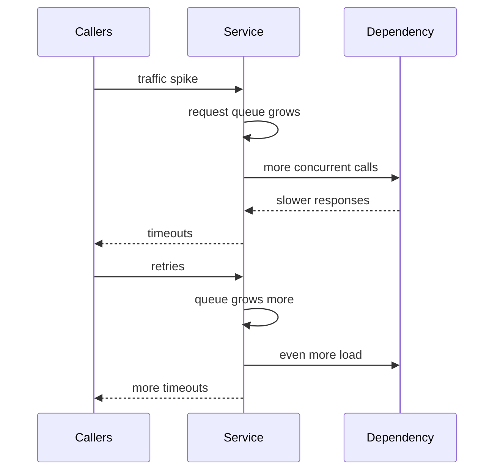
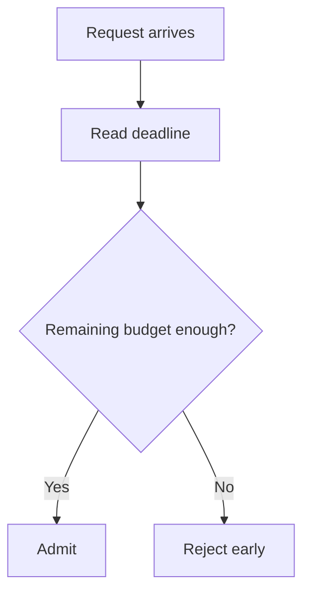
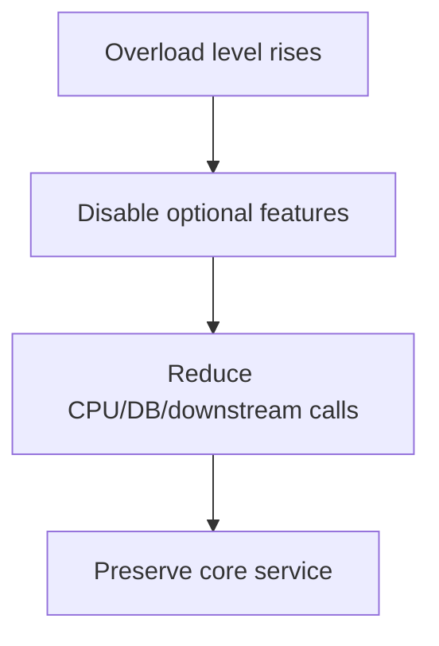
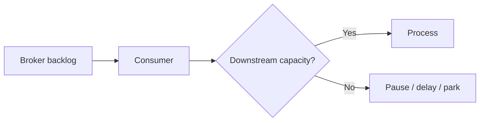
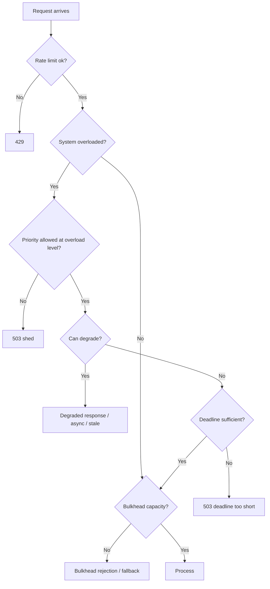

# Part 044 — Load Shedding and Graceful Degradation

Load shedding is the deliberate rejection of work to keep the system alive.

It sounds negative.

It is not.

A system that refuses some requests early can protect the requests it still accepts.

A system that accepts everything during overload often fails everything.

The core rule:

> When demand exceeds capacity, choose what not to do.

If you do not choose, the runtime chooses for you through timeouts, memory pressure, queue explosion, thread exhaustion, database saturation, and cascading failure.

Load shedding is controlled refusal.

---

## 1. Rate Limiting vs Load Shedding

Rate limiting enforces planned rate or quota.

Load shedding reacts to current overload.

| Mechanism | Trigger | Example |
|---|---|---|
| Rate limiting | caller exceeds quota | Caller may do 100 RPS but sends 300 RPS |
| Load shedding | system is overloaded | CPU/queue/dependency saturation too high |
| Bulkhead | resource compartment full | Dependency path has 40 in-flight calls |
| Circuit breaker | dependency unhealthy | 50% failures or slow calls |
| Retry budget | retries too many | retry traffic exceeds 10% budget |

A request can be:

- within rate limit but shed due to overload,
- over rate limit even when system is healthy,
- rejected by bulkhead while global system is fine,
- failed fast by circuit breaker because dependency is unhealthy.

Do not collapse all these into "500 error."

They are different control signals.

---

## 2. Why Load Shedding Exists

Capacity planning reduces overload probability.

It does not eliminate overload.

Overload can come from:

- traffic spike,
- retry storm,
- dependency slowdown,
- database lock contention,
- GC pause,
- deployment warmup,
- cold cache,
- node loss,
- regional failover,
- batch replay,
- message backlog catch-up,
- expensive query,
- thundering herd,
- bot/internal script,
- external provider slowness,
- misconfigured autoscaling,
- noisy tenant.

When overload happens, doing all requested work is impossible.

The service must decide:

```text
Which work should continue?
Which work should degrade?
Which work should be rejected?
Which work should be deferred?
```

That is load shedding.

---

## 3. The Failure Pattern Without Shedding



At this point, the service is not serving traffic.

It is converting traffic into waiting, retrying, and failing.

Shedding breaks the loop:

```text
if overloaded:
  reject low-priority/new work early
  preserve capacity for high-priority/accepted work
```

---

## 4. Load Shedding Is Admission Control

A request should be admitted only if the system has reasonable capacity to complete it.

Admission control asks:

- is the server overloaded?
- is the caller within quota?
- is this priority allowed?
- is queue depth acceptable?
- is dependency capacity available?
- is the caller deadline still feasible?
- is request cost acceptable?
- would accepting this request harm existing work?

A service should prefer:

```http
503 Service Unavailable
Retry-After: 1
```

over accepting work that will time out after consuming resources.

---

## 5. Overload Signals

Load shedding needs signals.

Bad signal:

```text
CPU > 90%
```

CPU alone is insufficient.

Better use multiple signals:

| Signal | Meaning |
|---|---|
| CPU saturation | compute pressure |
| memory pressure | risk of OOM/GC degradation |
| GC pause time | JVM health degradation |
| request queue depth | inbound overload |
| request queue age | accepted work getting stale |
| active request count | concurrency pressure |
| event loop lag | async/reactive saturation |
| thread pool utilization | executor pressure |
| connection pool saturation | downstream pressure |
| bulkhead full rate | dependency path saturated |
| timeout rate | work exceeding budget |
| p99 latency | tail degradation |
| retry rate | amplification |
| error rate | visible failure |
| dependency breaker open | downstream unavailable |
| database pool saturation | persistence bottleneck |
| broker lag | async backlog pressure |
| caller deadline remaining | whether work can still finish |

Do not wait for hard failures.

Shedding should start before collapse.

---

## 6. Queue Age Is Often Better Than Queue Size

Queue size tells how many requests are waiting.

Queue age tells whether they are still useful.

Example:

```text
queue size = 100
oldest queued request age = 2 seconds
caller deadline = 500 ms
```

Those requests are already pointless.

Rejecting new work and dropping stale queued work may be better than processing expired requests.

Important metric:

```text
oldest_request_age
```

or:

```text
queue_wait_time_p95
```

If queued work cannot complete before deadline, shed.

---

## 7. Deadline-Aware Admission

If a request arrives with 50 ms remaining and the operation normally takes 200 ms, accepting it is waste.



Example:

```java
if (deadline.remaining().compareTo(minUsefulProcessingTime) < 0) {
    throw new DeadlineTooShortException();
}
```

Response:

```http
503 Service Unavailable
Content-Type: application/problem+json
```

```json
{
  "type": "https://errors.example.internal/deadline-too-short",
  "title": "Deadline too short",
  "status": 503,
  "extensions": {
    "code": "DEADLINE_TOO_SHORT",
    "retryable": true
  }
}
```

This is not pessimism.

It protects the system from doing useless work.

---

## 8. Priority-Based Shedding

Not all work should be shed equally.

Priority classes:

| Priority | Example | Shedding posture |
|---|---|---|
| critical command | regulatory case action | shed last; fail clearly if impossible |
| user-facing read | portal query | degrade/cache if possible |
| workflow step | lifecycle progression | defer or retry later |
| reconciliation | correction job | pause/reschedule |
| batch/report | analytics/export | shed early |
| optional enrichment | recommendation, decoration | shed first |

A simple priority policy:

```text
normal load:
  accept all within rate/bulkhead

moderate overload:
  shed optional enrichment
  reduce batch concurrency

severe overload:
  shed batch and reconciliation
  serve stale reads
  preserve critical commands

critical overload:
  only health/liveness and critical safety operations
```

This is much better than random failure.

---

## 9. Brownout

Brownout means intentionally disabling non-essential features under load.

Examples:

- skip recommendation panel,
- omit expensive enrichment,
- reduce page size,
- disable fuzzy search,
- stop computing real-time counts,
- return cached risk score,
- delay notification,
- disable export,
- reduce audit-detail expansion while preserving core audit write,
- turn off non-critical background polling.

Brownout is graceful degradation.



Brownout must be designed before the incident.

During an outage is too late to decide which features are optional.

---

## 10. Fail Open vs Fail Closed

For load shedding, the safe behavior depends on operation semantics.

| Operation | Likely behavior |
|---|---|
| optional recommendation | fail open by omitting feature |
| regulatory decision command | fail closed; do not pretend success |
| audit write | fail closed or durable queue; do not drop silently |
| notification | enqueue/defer if possible |
| read-only cacheable view | stale fallback acceptable |
| external irreversible side effect | fail closed or workflow reconciliation |
| health endpoint | lightweight response only |

For regulatory/case systems, be conservative.

Never degrade in a way that creates false business truth.

A degraded response must be clearly marked if consumers rely on completeness/freshness.

---

## 11. Shedding Responses

Use explicit status and error model.

Common responses:

| Status | Use |
|---|---|
| `429 Too Many Requests` | caller quota/rate exceeded |
| `503 Service Unavailable` | system overloaded/unavailable |
| `202 Accepted` | work accepted for async processing |
| `409 Conflict` | operation in progress/conflict, not generic overload |
| `504 Gateway Timeout` | gateway did not receive timely response |

For overload:

```http
503 Service Unavailable
Retry-After: 1
Content-Type: application/problem+json
```

```json
{
  "type": "https://errors.example.internal/overloaded",
  "title": "Service overloaded",
  "status": 503,
  "detail": "The service is temporarily overloaded and rejected the request before execution.",
  "extensions": {
    "code": "OVERLOADED",
    "retryable": true,
    "retryAfterMillis": 1000,
    "shedReason": "queue_age"
  }
}
```

Do not return generic `500`.

Overload rejection is intentional.

---

## 12. Retry Shedding

Retries can make overload worse.

When overloaded, shed retries more aggressively than original traffic.

Why?

Retry traffic is extra load after the system already signaled failure or slowness.

Policy:

```text
if overload moderate:
  allow original high-priority traffic
  limit retries tightly

if overload severe:
  shed most retries
  allow only idempotent critical retries with budget
```

Use a header or context to distinguish attempts:

```http
X-Retry-Attempt: 1
```

But do not blindly trust caller-provided headers for admission.

Owned internal clients can propagate retry metadata reliably.

---

## 13. Request Cost Shedding

Some requests are more expensive.

Example query:

```http
GET /v1/cases?status=OPEN&pageSize=500&includeHistory=true&includeDocuments=true
```

During overload, the service can:

- reject expensive query shape,
- reduce max page size,
- ignore optional expansions,
- require async export,
- return partial response with explicit metadata.

Policy:

```text
normal:
  pageSize max 200
  includeHistory allowed

overload:
  pageSize max 50
  includeHistory disabled
  includeDocuments disabled
```

Response can include:

```json
{
  "items": [],
  "degraded": true,
  "degradationReason": "EXPANSIONS_DISABLED_DUE_TO_OVERLOAD"
}
```

Only do this if contract allows degradation.

Otherwise reject.

---

## 14. Server-Side Admission Filter

Conceptual Java filter:

```java
public final class OverloadSheddingFilter extends OncePerRequestFilter {
    private final OverloadController overloadController;
    private final ProblemResponseWriter problemWriter;

    @Override
    protected void doFilterInternal(
        HttpServletRequest request,
        HttpServletResponse response,
        FilterChain chain
    ) throws ServletException, IOException {
        RequestAdmissionContext context = RequestAdmissionContext.from(request);

        AdmissionDecision decision = overloadController.decide(context);

        if (!decision.allowed()) {
            response.setStatus(decision.statusCode());
            decision.retryAfter().ifPresent(value ->
                response.setHeader("Retry-After", Long.toString(value.toSeconds()))
            );
            problemWriter.writeOverload(response, decision);
            return;
        }

        chain.doFilter(request, response);
    }
}
```

The controller should be fast.

Admission control that performs expensive work defeats its purpose.

---

## 15. Overload Levels

Use explicit overload levels.

```java
public enum OverloadLevel {
    NORMAL,
    ELEVATED,
    DEGRADED,
    SEVERE,
    CRITICAL
}
```

Decision table:

| Level | Behavior |
|---|---|
| `NORMAL` | accept normal traffic |
| `ELEVATED` | reduce optional background work |
| `DEGRADED` | shed optional features and low-priority batch |
| `SEVERE` | shed retries, expensive queries, batch; use stale reads |
| `CRITICAL` | admit only critical operations, fail fast others |

This is easier to reason about than dozens of independent if-statements.

---

## 16. Overload Controller

Conceptual design:

```java
public final class OverloadController {
    private final OverloadSignalProvider signals;
    private final AdmissionPolicy policy;

    public AdmissionDecision decide(RequestAdmissionContext request) {
        OverloadSnapshot snapshot = signals.current();

        OverloadLevel level = classify(snapshot);

        return policy.decide(level, request);
    }

    private OverloadLevel classify(OverloadSnapshot s) {
        if (s.memoryPressureCritical() || s.oldestQueueAgeMillis() > 1000) {
            return OverloadLevel.CRITICAL;
        }
        if (s.cpuUtilization() > 0.90 || s.bulkheadRejectionRate() > 0.20) {
            return OverloadLevel.SEVERE;
        }
        if (s.p99LatencyMillis() > 800 || s.retryRate() > 0.15) {
            return OverloadLevel.DEGRADED;
        }
        if (s.p95LatencyMillis() > 400) {
            return OverloadLevel.ELEVATED;
        }
        return OverloadLevel.NORMAL;
    }
}
```

The classifier should avoid flapping.

Use smoothing, hysteresis, and minimum duration.

---

## 17. Hysteresis

Without hysteresis, overload level can flap:

```text
CPU 89% -> DEGRADED off
CPU 91% -> DEGRADED on
CPU 89% -> off
CPU 91% -> on
```

Use different thresholds to enter and exit.

Example:

```text
enter SEVERE at CPU > 90% for 30s
exit SEVERE only when CPU < 75% for 60s
```

Hysteresis prevents rapid feature toggling and unstable behavior.

---

## 18. Adaptive Concurrency

Instead of static concurrency limits, systems can adjust based on latency and success.

Idea:

```text
if latency low and success high -> allow more concurrency
if latency high or failures rise -> reduce concurrency
```

Adaptive concurrency is useful but complex.

Risks:

- unstable feedback loops,
- noisy measurements,
- unfairness across callers,
- interaction with autoscaling,
- hard-to-debug decisions.

Start with static limits and clear shedding policy.

Introduce adaptive control only when metrics and operational maturity are strong.

---

## 19. Load Shedding in Gateway/Proxy

Gateways and proxies can shed load before application code runs.

Benefits:

- earlier rejection,
- protects app workers,
- central policy,
- consistent edge behavior.

Examples of proxy-level controls:

- max connections,
- max requests,
- circuit breaking,
- overload manager,
- global rate limit,
- local rate limit,
- request timeout,
- header-based priority,
- load shed points.

Envoy has an overload manager with triggers/actions and load shed points that can shed load at specific points in connection or stream lifecycle.

But proxies often lack deep business semantics.

Use gateway/proxy for coarse shedding.

Use application for semantic shedding.

---

## 20. Kubernetes and Load Shedding

Kubernetes can restart or reschedule pods, but it does not automatically make overload safe.

Relevant mechanisms:

- readiness probes,
- liveness probes,
- startup probes,
- HPA autoscaling,
- resource requests/limits,
- PodDisruptionBudgets,
- priority classes,
- ingress/gateway limits.

Common mistake:

```text
service overloaded -> readiness fails -> pod removed -> remaining pods receive more traffic -> overload worsens
```

Readiness should not flap under transient overload unless removing the pod helps.

Sometimes local shedding is better than failing readiness.

Be careful with liveness probes: killing overloaded pods can amplify incidents.

---

## 21. Autoscaling Is Not Instant

Autoscaling can help sustained overload.

It does not solve immediate overload.

Why?

- metrics lag,
- scale decision delay,
- pod scheduling delay,
- image pull/startup time,
- JVM warmup,
- cache warmup,
- connection warmup,
- downstream dependency may not scale.

During the gap, load shedding protects the system.

Think:

```text
load shedding handles now
autoscaling handles later
capacity planning handles before
```

---

## 22. Graceful Degradation Patterns

### 22.1 Stale cache

Use when freshness can be relaxed.

```json
{
  "caseId": "CASE-100",
  "status": "OPEN",
  "freshness": {
    "source": "cache",
    "stale": true,
    "cachedAt": "2026-07-05T10:15:30Z"
  }
}
```

### 22.2 Partial response

Use when some fields are optional.

```json
{
  "caseId": "CASE-100",
  "status": "OPEN",
  "riskSummary": null,
  "degraded": true,
  "omitted": ["riskSummary"]
}
```

### 22.3 Async handoff

Use when work can complete later.

```http
202 Accepted
Location: /v1/operations/OP-123
```

### 22.4 Feature brownout

Disable non-essential operation paths.

### 22.5 Reduced quality

Simpler algorithm, smaller page, less enrichment.

### 22.6 Fail fast

For unsafe critical operations when safe degradation does not exist.

---

## 23. Degradation Must Be Contracted

Do not surprise consumers with partial data if the contract promised complete data.

If degradation is possible, document:

- which fields may be omitted,
- how degradation is signaled,
- whether stale data can be returned,
- maximum staleness,
- whether command can be async,
- retry behavior,
- status code behavior.

OpenAPI extension example:

```yaml
x-degradation-policy:
  staleCacheAllowed: true
  maxStalenessSeconds: 300
  partialResponseAllowed: true
  omittedFieldsSignaled: true
  overloadStatuses:
    - 503
```

Consumers need to know whether degraded response is acceptable.

---

## 24. Dropping Queued Work

If work is queued in memory and its deadline expires, drop it.

Processing expired work wastes capacity.

For request queues:

```text
if current_time > request_deadline - min_processing_time:
  reject/drop before execution
```

For background work:

- if durable and still relevant, reschedule,
- if obsolete, drop with audit,
- if business-critical, escalate/manual remediation.

Never silently drop business-critical commands.

---

## 25. Shedding in Message Consumers

Message consumers can overload downstream services during backlog catch-up.

Controls:

- pause consumption,
- reduce poll size,
- reduce worker concurrency,
- apply outbound rate limit,
- use dependency bulkhead,
- nack/requeue with delay,
- park poison/high-cost messages,
- prioritize fresh/critical messages,
- process by tenant fairness.



Do not let replay convert async backlog into synchronous dependency outage.

---

## 26. Shedding Background Work

Background jobs should be the first to back off unless they are safety-critical.

Examples:

- report generation,
- full reindex,
- data export,
- reconciliation,
- cache warmup,
- enrichment,
- batch notification.

Under overload:

```text
pause low-priority jobs
reduce concurrency
increase backoff
skip optional refresh
protect online traffic
```

This requires a central notion of overload state or shared control plane.

---

## 27. Shedding Health Checks

Health checks should be cheap.

Do not perform heavy dependency checks on every health probe.

Under overload, expensive health checks can worsen overload.

Guidelines:

- liveness should prove process is alive, not dependency graph is perfect,
- readiness should be meaningful but not overly heavy,
- dependency checks should be cached/bounded,
- health endpoints should have strict timeout,
- health traffic should be rate-limited if necessary.

Do not let monitoring become the DDoS.

---

## 28. Observability

Metrics:

```text
load_shedding.decisions.total{operation,priority,decision,reason}
load_shedding.overload_level{service}
load_shedding.rejected.total{reason}
load_shedding.degraded_responses.total{degradation}
request.queue.depth
request.queue.oldest_age
request.deadline.too_short.total
retry.shed.total
brownout.feature.disabled{feature}
```

Useful shed reasons:

- `CPU_PRESSURE`,
- `MEMORY_PRESSURE`,
- `QUEUE_AGE`,
- `QUEUE_DEPTH`,
- `BULKHEAD_FULL`,
- `DEPENDENCY_UNAVAILABLE`,
- `DEADLINE_TOO_SHORT`,
- `LOW_PRIORITY`,
- `RETRY_TRAFFIC`,
- `EXPENSIVE_QUERY`,
- `OVERLOAD_MANAGER`.

Log one structured event per decision class or sampled request, not every high-volume rejection if it creates log storms.

---

## 29. Alerting

Useful alerts:

| Alert | Meaning |
|---|---|
| overload level severe/critical sustained | service under pressure |
| shedding critical traffic | serious business impact |
| shedding optional traffic | degraded mode active |
| queue age increasing | accepted work becoming stale |
| deadline-too-short rising | upstream budget mismatch |
| retry shedding high | retry storm or dependency failure |
| brownout enabled too long | capacity gap or dependency issue |
| no shedding despite saturation | admission control broken |
| shedding flapping | hysteresis thresholds bad |
| stale fallback too frequent | dependency degraded |

Alerting should distinguish:

```text
protective shedding
vs
business-impacting shedding
```

---

## 30. Testing Load Shedding

Minimum tests:

| Scenario | Expected behavior |
|---|---|
| normal load | admitted |
| CPU/queue signal high | low-priority request shed |
| critical request during moderate overload | admitted |
| severe overload | retries shed |
| deadline too short | rejected before work starts |
| expensive query during overload | rejected or degraded |
| optional enrichment overload | omitted |
| stale cache fallback | response marked stale |
| queue age expired | queued request dropped/rejected |
| overload level hysteresis | no flapping |
| metrics emitted | shed reason visible |

Unit test for policy:

```java
@Test
void shedsBatchTrafficDuringSevereOverload() {
    OverloadSnapshot snapshot = OverloadSnapshot.severe();
    RequestAdmissionContext request = RequestAdmissionContext.builder()
        .operation("searchCases")
        .priority("batch")
        .retryAttempt(0)
        .build();

    AdmissionDecision decision = policy.decide(snapshot, request);

    assertThat(decision.allowed()).isFalse();
    assertThat(decision.statusCode()).isEqualTo(503);
    assertThat(decision.reason()).isEqualTo("LOW_PRIORITY_OVERLOAD");
}
```

Deadline test:

```java
@Test
void rejectsWhenDeadlineCannotFitMinimumProcessingTime() {
    RequestAdmissionContext request = RequestAdmissionContext.builder()
        .deadline(Deadline.after(Duration.ofMillis(20)))
        .operation("createEscalation")
        .build();

    AdmissionDecision decision = policy.decide(OverloadSnapshot.normal(), request);

    assertThat(decision.allowed()).isFalse();
    assertThat(decision.reason()).isEqualTo("DEADLINE_TOO_SHORT");
}
```

---

## 31. Load Testing

Load shedding must be validated under realistic overload.

Test scenarios:

- traffic spike beyond capacity,
- dependency latency increases 10x,
- database pool saturation,
- one node lost,
- autoscaling delay,
- retry storm,
- batch replay,
- consumer backlog catch-up,
- large expensive queries,
- critical and low-priority traffic mixed,
- brownout enabled,
- gateway shedding + app shedding interaction.

Questions:

- Does service fail partially or globally?
- Is high-priority traffic preserved?
- Are low-priority requests rejected quickly?
- Are retries shed?
- Does queue age stay bounded?
- Does p99 recover?
- Are dashboards understandable?
- Does autoscaling eventually reduce shedding?
- Does hysteresis prevent flapping?

---

## 32. Production Policy Template

```yaml
loadShedding:
  enabled: true

  overloadLevels:
    elevated:
      enter:
        p95LatencyMs: 400
      exit:
        p95LatencyMs: 250
        stableFor: 60s

    degraded:
      enter:
        p99LatencyMs: 800
        retryRate: 0.15
      exit:
        p99LatencyMs: 500
        stableFor: 60s

    severe:
      enter:
        cpuUtilization: 0.90
        bulkheadRejectionRate: 0.20
        queueOldestAgeMs: 500
      exit:
        cpuUtilization: 0.75
        queueOldestAgeMs: 150
        stableFor: 120s

  policies:
    optional:
      degraded: shed
      severe: shed
      critical: shed

    batch:
      elevated: reduce-concurrency
      degraded: shed
      severe: shed

    user-facing-read:
      degraded: stale-cache-if-available
      severe: reject-expensive-query

    critical-command:
      degraded: admit-if-deadline-sufficient
      severe: admit-if-capacity-reserved
      critical: fail-fast-503

  retryTraffic:
    degraded: limit
    severe: shed-most
    critical: shed-all-except-critical-idempotent

  responses:
    overloadStatus: 503
    includeRetryAfter: true
    includeProblemDetails: true
```

This policy should be part of the service runbook.

---

## 33. Anti-Patterns

### 33.1 Accept everything

The service becomes a queueing system with no bound.

### 33.2 Shed only after total failure

Too late. Resources are already exhausted.

### 33.3 Random shedding

Critical and optional traffic fail equally.

### 33.4 Shed without signaling

Clients see generic 500 and retry incorrectly.

### 33.5 No retry shedding

Retries amplify overload.

### 33.6 Deep in-memory queues

Latency grows until work becomes stale.

### 33.7 Readiness flapping as shedding

Kubernetes removes pods and overloads remaining pods.

### 33.8 Degraded response without metadata

Consumers cannot tell data is stale or partial.

### 33.9 Dropping business commands silently

Correctness violation.

### 33.10 No hysteresis

Brownout and overload states flap.

---

## 34. Decision Model



Admission control should be explicit and layered.

---

## 35. Design Checklist

Before implementing load shedding:

- What overload signals are used?
- Are signals cheap and reliable?
- Are overload levels defined?
- Is hysteresis configured?
- Which traffic priorities exist?
- Which operations are critical?
- Which operations are optional?
- Which work can be deferred?
- Which work can return stale data?
- Which work must fail closed?
- Are retries shed more aggressively?
- Are expensive queries identified?
- Is queue age measured?
- Are caller deadlines respected?
- Are responses explicit with `503`/Problem Details?
- Is `Retry-After` used?
- Does gateway/proxy shedding align with app shedding?
- Does Kubernetes readiness avoid flapping?
- Are metrics/alerts configured?
- Are load tests performed?
- Is there a brownout runbook?
- Is degradation documented in API contract?

---

## 36. The Real Lesson

Load shedding is not failure.

Uncontrolled overload is failure.

A mature Java microservice knows how to say:

```text
not now
not this priority
not this expensive shape
not this retry
not without enough deadline
```

so that it can still say yes to the work that matters most.

That is graceful degradation:

```text
protect core functionality
reject early
degrade explicitly
preserve capacity
avoid cascading failure
```

In production, refusing some work is how you keep the system trustworthy.

---

## References

- Google SRE Book — Handling Overload: https://sre.google/sre-book/handling-overload/
- Google SRE Book — Addressing Cascading Failures: https://sre.google/sre-book/addressing-cascading-failures/
- Google SRE Book — Production Services Best Practices: https://sre.google/sre-book/service-best-practices/
- Envoy Overload Manager: https://www.envoyproxy.io/docs/envoy/latest/configuration/operations/overload_manager/overload_manager
- RFC 9110 — HTTP Semantics: https://datatracker.ietf.org/doc/html/rfc9110
- RFC 9457 — Problem Details for HTTP APIs: https://www.rfc-editor.org/rfc/rfc9457.html
- RFC 6585 — Additional HTTP Status Codes: https://www.rfc-editor.org/rfc/rfc6585
