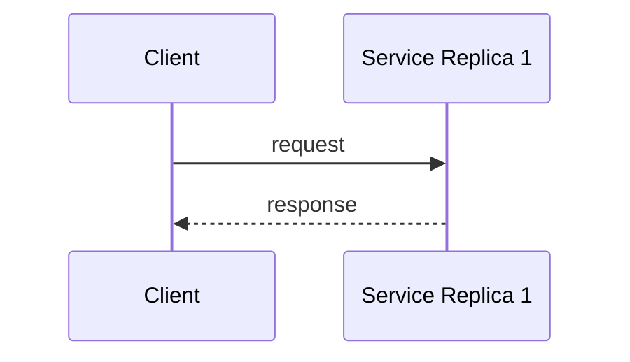
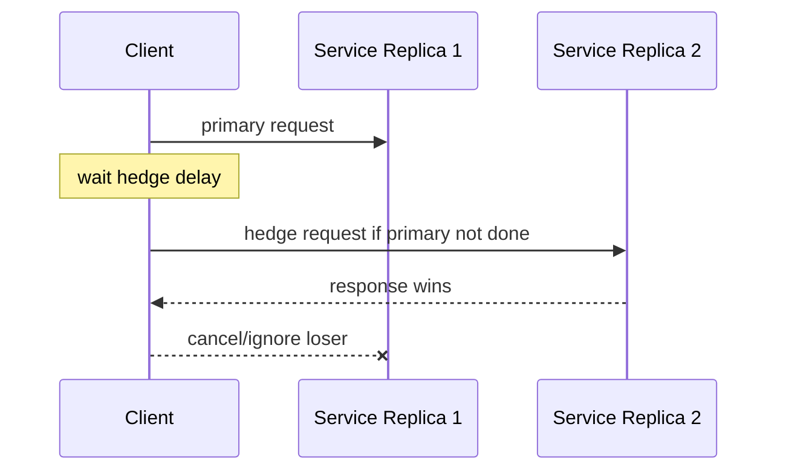
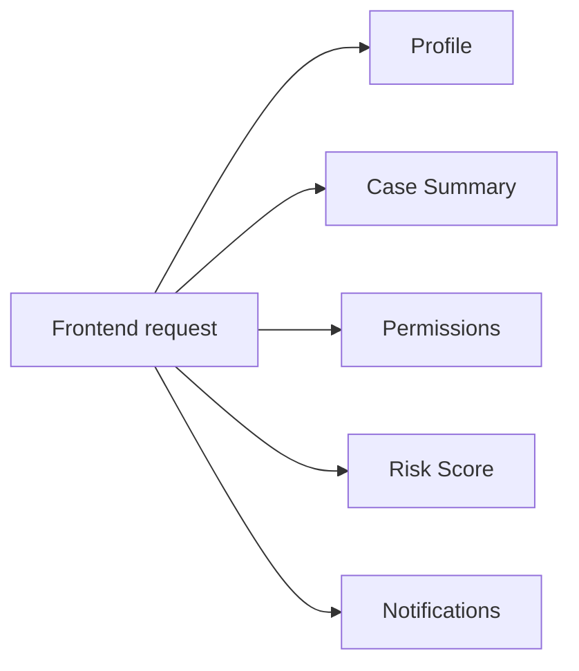
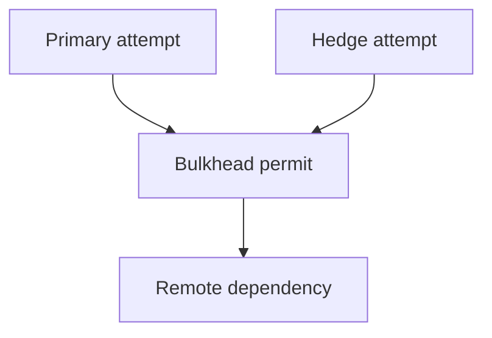
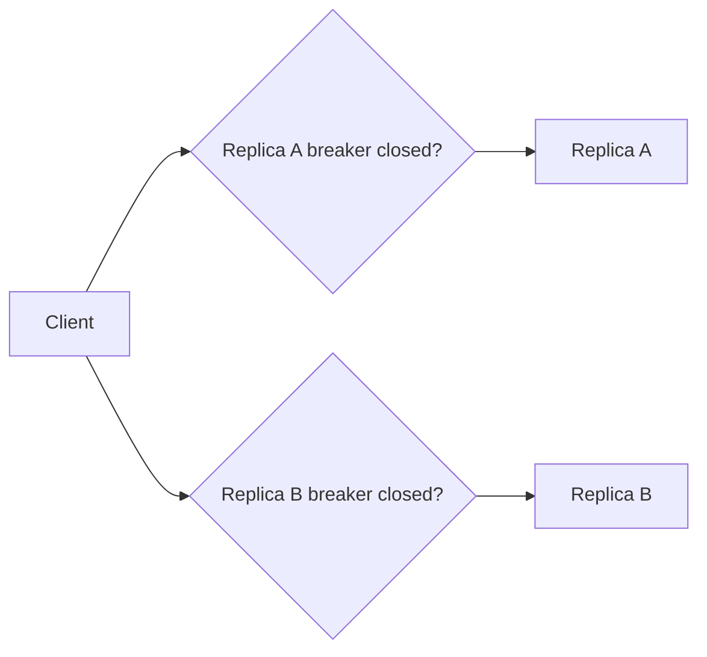
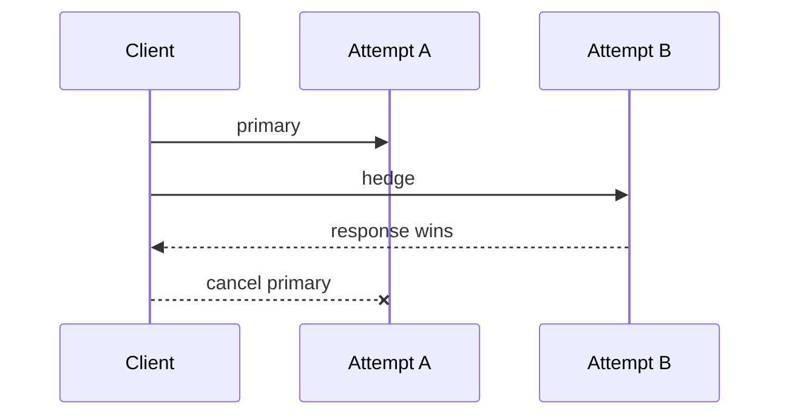
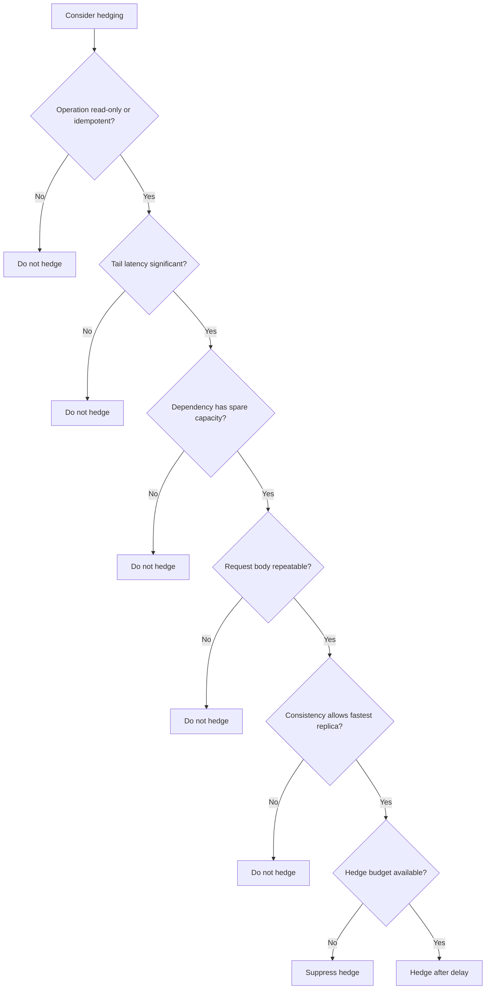

# Part 045 — Hedged Requests: Tail Latency vs Amplified Load

A hedged request is a deliberate duplicate request sent after a delay to reduce tail latency.

The idea is simple:

> If the first attempt is unusually slow, send a second attempt to another equivalent replica and use whichever response returns first.

This can reduce p99 latency.

It can also double load, duplicate side effects, overload dependencies, confuse observability, and create correctness bugs.

Hedging is not retry.

Hedging is speculative parallelism.

Use it only when the operation and infrastructure can tolerate it.

---

## 1. The Core Mental Model

Normal request:



Hedged request:



The client intentionally creates a race.

The fastest acceptable response wins.

The loser is cancelled or ignored.

The main benefit:

```text
reduce user-visible tail latency
```

The main cost:

```text
increase backend work
```

---

## 2. Why Tail Latency Matters

A single service call may have acceptable average latency.

But user-facing requests often fan out.

If one request depends on many subrequests, the slowest subrequest can dominate total latency.

Example:



If each dependency has a 1% chance of being slow, the probability that at least one dependency is slow grows with fan-out.

This is why tail latency matters more in large systems than averages suggest.

The "Tail at Scale" paper by Dean and Barroso describes hedged requests as one technique for reducing tail latency in large-scale online services.

---

## 3. Hedging vs Retry

Hedging and retry both send more than one request.

But their timing and meaning differ.

| Pattern | When second request is sent | Goal |
|---|---|---|
| Retry | after failure/timeout/error | recover failed attempt |
| Hedge | before primary fails, after delay | beat slow tail attempt |
| Parallel duplicate | immediately | minimize latency at high load cost |
| Quorum request | multiple requests required by protocol | correctness/consensus |
| Fallback | call alternate path after failure | degrade or recover |

Retry says:

```text
the first attempt failed
```

Hedging says:

```text
the first attempt is not done yet and may be a tail outlier
```

That difference matters.

Hedging can create duplicate in-flight work even when there is no failure.

---

## 4. When Hedging Works

Hedging works best when:

- operation is read-only or idempotent,
- replicas are equivalent,
- latency has high variance,
- tail latency is important,
- slow requests are caused by per-replica noise,
- dependency has spare capacity,
- hedge delay is chosen carefully,
- losing request can be cancelled or cheaply ignored,
- duplicate work does not corrupt state,
- client has enough budget,
- observability separates primary and hedge attempts.

Example good candidates:

| Operation | Hedge suitability |
|---|---|
| read from replicated cache | high |
| search read replica query | medium to high |
| read-only metadata lookup | medium |
| idempotent object fetch | high |
| non-critical enrichment read | medium |
| expensive distributed query | low unless controlled |
| payment command | no |
| create escalation command | usually no |
| send notification command | no |
| mutate workflow state | no |

Hedging is mostly a read-path technique.

---

## 5. When Hedging Is Dangerous

Avoid hedging when:

- operation has side effects,
- server cannot deduplicate,
- losing request cannot be cancelled,
- dependency is already overloaded,
- downstream cost is high,
- request holds locks,
- request triggers database writes,
- request triggers external provider call,
- result is not deterministic,
- replicas are not equivalent,
- consistency model can return conflicting answers,
- fan-out is already large,
- retry is already active,
- circuit breaker or bulkhead is saturated.

Bad example:

```http
POST /v1/payments
```

Hedging this can create duplicate payments unless the entire path is idempotent and deduplicated.

Even then, hedging commands is usually unnecessary and risky.

---

## 6. Hedge Delay

Never send hedge immediately by default.

Immediate duplicate request doubles load for every call.

Instead:

```text
send hedge only after primary exceeds a threshold
```

Typical hedge delay choices:

| Strategy | Meaning |
|---|---|
| fixed delay | hedge after 50 ms |
| percentile-based | hedge after p95 latency |
| adaptive delay | hedge based on current latency distribution |
| budget-aware | hedge only if remaining deadline can fit |
| load-aware | hedge only when dependency not overloaded |
| priority-aware | hedge only for high-priority requests |

A practical starting point:

```text
hedgeDelay = dependency p95 latency
maxHedges = 1
```

Why p95?

Because most requests complete normally and do not hedge.

Only the slow tail gets a duplicate attempt.

---

## 7. Expected Extra Load

If hedge delay is p95, about 5% of calls hedge under normal latency distribution.

Roughly:

```text
extra request load ≈ hedge rate × original load
```

At 1000 RPS:

| Hedge rate | Extra RPS |
|---:|---:|
| 1% | 10 |
| 5% | 50 |
| 10% | 100 |
| 50% | 500 |
| 100% | 1000 |

A small hedge rate can be acceptable.

A high hedge rate can become self-inflicted overload.

Therefore:

> Hedging must have a hedge budget.

---

## 8. Hedge Budget

A hedge budget limits speculative duplicate traffic.

Example:

```text
hedged_attempts <= 2% of original attempts over rolling 1 minute
```

If budget is exhausted:

```text
do not hedge
```

This prevents the worst scenario:

```text
dependency slows
→ more requests exceed hedge delay
→ more hedges created
→ dependency receives more load
→ latency worsens
→ even more hedges
```

That feedback loop can become a retry-storm equivalent.

Hedge budget is as important as retry budget.

---

## 9. Hedging and Bulkhead

Hedged attempts must consume bulkhead capacity.

If hedges bypass bulkheads, they can overload dependency path.

Better:



But be careful: if primary holds one permit and hedge holds another, one logical call can consume two slots.

Policy options:

| Policy | Behavior |
|---|---|
| shared bulkhead | hedges compete with normal calls |
| separate hedge bulkhead | cap hedge attempts independently |
| hedge budget + shared bulkhead | good default |
| no hedge when bulkhead near full | safer during pressure |

Recommended:

```text
hedge only when bulkhead has spare capacity
```

Hedging under saturation usually worsens the problem.

---

## 10. Hedging and Circuit Breaker

Do not hedge into an open circuit.

If the dependency breaker is open, speculative duplicate calls should not be created.

For multi-replica or multi-zone clients, there may be per-zone/per-endpoint breakers.



A hedge should select only healthy candidates.

If all candidates are unhealthy, fail fast or fallback.

---

## 11. Hedging and Retry

Hedging and retry can multiply attempts.

Example:

```text
max attempts = 2 retries
max hedges = 1 per attempt
```

Worst-case remote attempts:

```text
2 attempts × 2 hedge copies = 4 calls
```

With fan-out, this gets ugly fast.

Recommended:

- avoid combining hedging and retry unless necessary,
- use small retry count,
- use shared attempt budget,
- classify hedged attempt separately,
- do not retry loser cancellation as failure,
- do not hedge retry attempts by default.

Policy:

```text
one logical call may use at most N total remote attempts
```

Example:

```text
maxTotalAttemptsIncludingHedges = 2
```

That means:

- either primary + one hedge,
- or primary + one retry,
- not both.

---

## 12. Hedging and Idempotency

For read operations, hedging is usually semantically safe.

For commands, hedging is dangerous.

If a command must be hedged, which is rare, it requires:

- idempotency key,
- server-side deduplication,
- stable request fingerprint,
- external side-effect dedup,
- response replay,
- loser cancellation awareness,
- downstream idempotent consumers,
- strict observability.

Even then, ask:

> Why are we hedging a command instead of making it asynchronous, improving dependency latency, or fixing tail causes?

Most production systems should not hedge commands.

---

## 13. Hedging and Cancellation

When one attempt wins, the client should cancel the loser.



But cancellation is not guaranteed to stop server work.

For HTTP:

- connection may be closed,
- request may already be executing,
- server may not notice immediately,
- database query may continue,
- side effects may already have happened.

For gRPC:

- cancellation is a first-class concept,
- server can observe cancellation and stop work,
- but committed side effects still cannot be undone.

Cancellation reduces wasted work only if the stack propagates and honors it.

---

## 14. Hedging and Consistency

If replicas can return different versions of data, hedging may return an older but faster result.

Example:

```text
Replica A: updated case status = CLOSED, slower
Replica B: stale case status = OPEN, faster
```

Hedging chooses the faster response.

Is that acceptable?

Depends on the operation.

For eventually consistent reads:

```text
maybe acceptable
```

For decision-making reads:

```text
possibly unsafe
```

For regulatory action eligibility:

```text
usually unsafe unless consistency contract allows it
```

Hedging must respect read consistency requirements.

---

## 15. Hedging and Cache

Hedging can be used between cache and origin in controlled ways.

Example:

- start cache lookup,
- if cache is slow/missed, start origin lookup,
- use first acceptable response,
- cancel loser.

But this is not always wise.

If origin is expensive, hedging cache/origin can increase backend load.

Better common pattern:

```text
cache first with very short budget
then origin
```

or:

```text
origin first, stale cache fallback on failure
```

Hedging is one option, not the default.

---

## 16. Hedging and Fan-Out

Fan-out plus hedging multiplies load.

If one request fans out to 20 shards and each shard can hedge once:

```text
max attempts = 40 shard calls
```

If 100 frontend requests arrive:

```text
4000 shard calls
```

Hedging in fan-out systems must be extremely controlled.

Techniques:

- hedge only the slowest subrequests,
- hedge only after most responses returned,
- cap total hedges per parent request,
- use per-shard budget,
- cancel losers aggressively,
- do not hedge when system load is high.

---

## 17. Basic Java Hedging Skeleton

This is conceptual.

```java
public final class HedgedCallExecutor {
    private final ScheduledExecutorService scheduler;
    private final HedgePolicy policy;

    public <T> CompletableFuture<T> execute(
        Supplier<CompletableFuture<T>> primarySupplier,
        Supplier<CompletableFuture<T>> hedgeSupplier,
        Deadline deadline
    ) {
        CompletableFuture<T> result = new CompletableFuture<>();
        CompletableFuture<T> primary = primarySupplier.get();

        AtomicReference<CompletableFuture<T>> hedgeRef = new AtomicReference<>();

        primary.whenComplete((value, error) -> completeIfFirst(result, value, error));

        ScheduledFuture<?> hedgeTask = scheduler.schedule(() -> {
            if (result.isDone()) {
                return;
            }
            if (!policy.canHedge(deadline)) {
                return;
            }

            CompletableFuture<T> hedge = hedgeSupplier.get();
            hedgeRef.set(hedge);

            hedge.whenComplete((value, error) -> completeIfFirst(result, value, error));
        }, policy.hedgeDelay().toMillis(), TimeUnit.MILLISECONDS);

        result.whenComplete((value, error) -> {
            hedgeTask.cancel(false);
            if (!primary.isDone()) {
                primary.cancel(true);
            }
            CompletableFuture<T> hedge = hedgeRef.get();
            if (hedge != null && !hedge.isDone()) {
                hedge.cancel(true);
            }
        });

        return result.orTimeout(deadline.remainingMillis(), TimeUnit.MILLISECONDS);
    }

    private <T> void completeIfFirst(CompletableFuture<T> result, T value, Throwable error) {
        if (error == null) {
            result.complete(value);
        } else {
            result.completeExceptionally(error);
        }
    }
}
```

This skeleton is incomplete for production.

It still needs:

- failure classification,
- loser cancellation metrics,
- hedge budget,
- deadline-aware scheduling,
- bulkhead integration,
- trace context,
- error aggregation,
- interruption behavior,
- request identity,
- executor management.

---

## 18. Winner Selection Is Not Always First Response

"First response wins" is too simplistic.

A fast error may arrive before a slow success.

Should the fast error win?

Example:

```text
Attempt A returns 503 after 20 ms
Attempt B returns 200 after 80 ms
```

If the client accepts first completion, it fails unnecessarily.

Better policy:

| Event | Behavior |
|---|---|
| first success | complete successfully, cancel losers |
| retryable failure while another attempt pending | wait if deadline allows |
| terminal failure from all attempts | fail |
| mixed failures | choose best classified error |
| deadline exceeded | cancel all attempts |

A hedged executor should prefer success over retryable failure.

But it must still respect deadline.

---

## 19. Candidate Selection

Do not send primary and hedge to the same overloaded replica if avoidable.

Candidate choices:

- different connection,
- different replica,
- different zone,
- different cache node,
- different read replica,
- different shard replica.

But do not violate consistency, locality, or data residency.

Candidate selection must respect:

- tenant placement,
- region,
- routing policy,
- service mesh behavior,
- sticky session requirements,
- cache key ownership,
- authorization context,
- consistency level.

If the load balancer already spreads requests well, the client may not control candidate selection.

In that case, hedging is less precise and more risky.

---

## 20. Adaptive Hedging

Static hedge delay can be wrong as traffic changes.

Adaptive hedging adjusts delay based on current latency and load.

Possible inputs:

- p95/p99 latency,
- current success rate,
- bulkhead saturation,
- circuit breaker state,
- dependency load,
- hedge budget remaining,
- request priority,
- deadline remaining.

Policy:

```text
if dependency healthy and tail high and budget available:
  hedge after p95
else:
  do not hedge
```

Adaptive hedging is powerful but can create feedback loops.

Use simple static hedging first.

Add adaptation only with strong observability.

---

## 21. Hedging Policy Object

```java
public record HedgePolicy(
    boolean enabled,
    Duration hedgeDelay,
    int maxHedges,
    double maxHedgeRatio,
    boolean requireIdempotentOperation,
    boolean disableWhenBulkheadSaturated,
    boolean disableWhenCircuitOpen
) {
    public HedgePolicy {
        if (maxHedges < 0) {
            throw new IllegalArgumentException("maxHedges must be >= 0");
        }
        if (hedgeDelay.isNegative() || hedgeDelay.isZero()) {
            throw new IllegalArgumentException("hedgeDelay must be positive");
        }
    }
}
```

Operation semantics:

```java
public record OperationSemantics(
    String operationName,
    boolean readOnly,
    boolean idempotent,
    boolean strongConsistencyRequired,
    boolean sideEffecting
) {}
```

Decision:

```java
public boolean canHedge(OperationSemantics semantics, RuntimeSignals signals, Deadline deadline) {
    if (!policy.enabled()) return false;
    if (semantics.sideEffecting()) return false;
    if (policy.requireIdempotentOperation() && !semantics.idempotent()) return false;
    if (semantics.strongConsistencyRequired()) return false;
    if (signals.bulkheadSaturated() && policy.disableWhenBulkheadSaturated()) return false;
    if (signals.circuitOpen() && policy.disableWhenCircuitOpen()) return false;
    if (!hedgeBudget.tryAcquire()) return false;
    return deadline.remaining().compareTo(policy.hedgeDelay().plus(minAttemptDuration)) > 0;
}
```

Hedging should be a deliberate decision, not a utility method anyone can call.

---

## 22. HTTP Client Implementation Considerations

### JDK `HttpClient`

`sendAsync` returns `CompletableFuture`.

Hedging can be implemented by starting a second `sendAsync`.

But cancellation behavior depends on the underlying request state.

You still need:

- request timeout,
- deadline,
- connection pool limits,
- separate metrics,
- candidate selection if possible,
- safe request body replay.

Request body matters.

A streaming request body may not be replayable.

Do not hedge non-repeatable request bodies.

### Spring `WebClient`

Reactive composition can race publishers:

```java
Mono<Response> primary = callPrimary();
Mono<Response> hedge = Mono.delay(hedgeDelay).then(callHedge());

Mono<Response> result = Mono.firstWithValue(primary, hedge);
```

But you need:

- error handling,
- cancellation semantics,
- context propagation,
- metrics,
- timeout,
- scheduler control.

### Blocking `RestClient`/Feign

Hedging blocking calls requires extra threads or virtual threads.

Be careful:

- hedging doubles blocked calls,
- thread-pool bulkhead may be needed,
- cancelling blocking calls may not stop underlying socket immediately,
- request thread should not spawn unbounded tasks.

Blocking hedging is easy to implement badly.

---

## 23. Hedging and Request Body Replay

Hedging requires sending the request more than once.

That means the request body must be repeatable.

Safe:

- small JSON body held in memory,
- GET query,
- deterministic protobuf message,
- immutable byte array.

Risky:

- streaming upload,
- input stream consumed once,
- large file upload,
- request body generated with timestamp/random nonce,
- non-deterministic signature,
- one-time token.

If body cannot be replayed, do not hedge.

---

## 24. Observability

Metrics:

```text
hedged_requests.total{dependency,operation,decision}
hedged_attempts.total{dependency,operation}
hedge_wins.total{dependency,operation,winner=primary|hedge}
hedge_losers_cancelled.total{dependency,operation}
hedge_budget_denied.total{dependency,operation}
hedge_suppressed.total{reason}
hedge_extra_load_ratio{dependency,operation}
remote_call.duration{attempt=primary|hedge}
```

Useful suppression reasons:

- `OPERATION_NOT_IDEMPOTENT`,
- `SIDE_EFFECTING`,
- `BUDGET_EXHAUSTED`,
- `DEADLINE_TOO_SHORT`,
- `BULKHEAD_SATURATED`,
- `CIRCUIT_OPEN`,
- `CONSISTENCY_REQUIRED`,
- `BODY_NOT_REPLAYABLE`,
- `LOW_PRIORITY`.

Trace attributes:

```text
hedge.attempt=primary
hedge.attempt=secondary
hedge.delay_ms=75
hedge.winner=true
```

Do not use resource IDs as metric labels.

---

## 25. Alerting

Useful alerts:

| Alert | Meaning |
|---|---|
| hedge rate above policy | extra load rising |
| hedge win rate very low | hedging may be wasting load |
| hedge budget exhausted often | tail latency or delay policy problem |
| hedging during overload | dangerous feedback loop |
| hedges on side-effecting operation | correctness bug |
| loser cancellation not working | wasted backend work |
| p99 unchanged despite hedging | ineffective policy |
| primary latency high and hedge wins high | replica/path tail issue |

Hedging should prove its value.

If it does not reduce tail latency enough to justify extra load, turn it off.

---

## 26. Testing Hedged Requests

Minimum tests:

| Scenario | Expected behavior |
|---|---|
| primary fast | no hedge sent |
| primary slow, hedge fast | hedge wins |
| primary slow, hedge disabled by budget | no hedge |
| primary returns retryable error, hedge succeeds | success |
| primary succeeds, hedge pending | hedge cancelled |
| both fail | best classified failure returned |
| operation side-effecting | hedge suppressed |
| deadline too short | hedge suppressed |
| bulkhead saturated | hedge suppressed |
| request body non-repeatable | hedge suppressed |
| metrics emitted | primary/hedge visible |

Test primary fast:

```java
@Test
void doesNotHedgeWhenPrimaryCompletesBeforeDelay() {
    fakeRemote.completePrimaryAfter(Duration.ofMillis(10));

    Response response = hedgedClient.getCase("CASE-100");

    assertThat(response.status()).isEqualTo("OPEN");
    assertThat(fakeRemote.hedgeAttempts()).isEqualTo(0);
}
```

Test hedge wins:

```java
@Test
void hedgeWinsWhenPrimaryIsTailOutlier() {
    fakeRemote.completePrimaryAfter(Duration.ofMillis(500));
    fakeRemote.completeHedgeAfter(Duration.ofMillis(40));

    Response response = hedgedClient.getCase("CASE-100");

    assertThat(response.status()).isEqualTo("OPEN");
    assertThat(fakeRemote.hedgeAttempts()).isEqualTo(1);
    assertThat(metrics.hedgeWins("hedge")).isEqualTo(1);
}
```

---

## 27. Load Testing Hedging

Hedging must be load-tested.

Scenarios:

- 1% slow replica,
- 5% random tail latency,
- dependency overload,
- one zone degraded,
- p99 improves but CPU doubles,
- cancellation ignored by server,
- fan-out parent request with many subrequests,
- hedging plus retry,
- hedging plus circuit breaker,
- hedging with cache/origin,
- burst traffic.

Questions:

- How much does p99 improve?
- How much does backend RPS increase?
- Does p50/p95 change?
- Does hedge budget cap extra load?
- Does dependency saturation worsen?
- Are losers cancelled?
- Are stale/inconsistent responses possible?
- Does hedging stop during overload?

Do not enable hedging because it looks good in a unit test.

---

## 28. Production Policy Template

```yaml
hedging:
  dependencies:
    case-service:
      operations:
        getCase:
          enabled: true
          allowedFor:
            - read-only
            - idempotent
          hedgeDelayMs: 75
          maxHedgesPerLogicalCall: 1
          maxHedgeRatio: 0.02
          disableWhen:
            circuitOpen: true
            bulkheadUtilizationAbove: 0.70
            retryAttempt: true
            remainingDeadlineBelowMs: 150
          consistency:
            allowEventuallyConsistentReplica: false
          cancellation:
            cancelLoser: true
          observability:
            emitWinner: true
            emitSuppressionReason: true

        searchCases:
          enabled: false
          reason: expensive-query-fanout-risk

        createEscalation:
          enabled: false
          reason: side-effecting-command
```

Policy must be per operation.

Never enable hedging globally.

---

## 29. Common Anti-Patterns

### 29.1 Hedging all requests immediately

Doubles load for every call.

### 29.2 Hedging commands

Duplicates side effects unless deeply controlled.

### 29.3 No hedge budget

Extra load grows exactly when latency worsens.

### 29.4 Hedging under overload

Speculative traffic worsens saturation.

### 29.5 Ignoring loser cancellation

Backend keeps doing useless work.

### 29.6 First completion wins even if it is a fast error

Client fails despite slower success being available.

### 29.7 No consistency analysis

Fast stale replica wins when strong read was required.

### 29.8 Hedging plus retry without total attempt cap

Attempts multiply.

### 29.9 Hedging non-repeatable request body

Second attempt is invalid or corrupt.

### 29.10 No separate metrics

Extra load is invisible.

---

## 30. Decision Model



This decision model should be embedded into client policy.

---

## 31. Design Checklist

Before enabling hedging:

- Which operation is hedged?
- Is it read-only or idempotent?
- Is it side-effecting?
- Is request body repeatable?
- What is the hedge delay?
- Why that delay?
- What is max hedges per logical call?
- What is hedge budget?
- Is retry also enabled?
- What is total attempt cap?
- Does hedging stop under overload?
- Does hedging respect bulkhead capacity?
- Does hedging respect circuit breaker state?
- Does hedging respect deadline?
- Can loser attempt be cancelled?
- Does server honor cancellation?
- Are replicas equivalent?
- Is consistency safe?
- Are metrics split by primary/hedge?
- Is p99 improvement verified by load test?
- Is extra backend load acceptable?
- Is there a kill switch?

---

## 32. The Real Lesson

Hedging is a sharp tool.

It can make a large distributed system feel faster by cutting off tail outliers.

But it pays for that speed with speculative load.

A mature service uses hedging only when:

```text
tail latency matters
+ operation is safe to duplicate
+ dependency has spare capacity
+ hedge delay is high enough
+ budget caps extra load
+ losers are cancelled
+ metrics prove benefit
```

Hedging is not a default resilience pattern.

It is a latency optimization with correctness and capacity consequences.

---

## References

- Jeffrey Dean and Luiz André Barroso — The Tail at Scale: https://research.google/pubs/the-tail-at-scale/
- The Tail at Scale PDF: https://www.barroso.org/publications/TheTailAtScale.pdf
- AWS Builders Library — Timeouts, retries, and backoff with jitter: https://aws.amazon.com/builders-library/timeouts-retries-and-backoff-with-jitter/
- gRPC Cancellation: https://grpc.io/docs/guides/cancellation/
- gRPC Deadlines: https://grpc.io/docs/guides/deadlines/
- Google SRE Book — Handling Overload: https://sre.google/sre-book/handling-overload/
