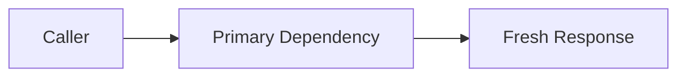
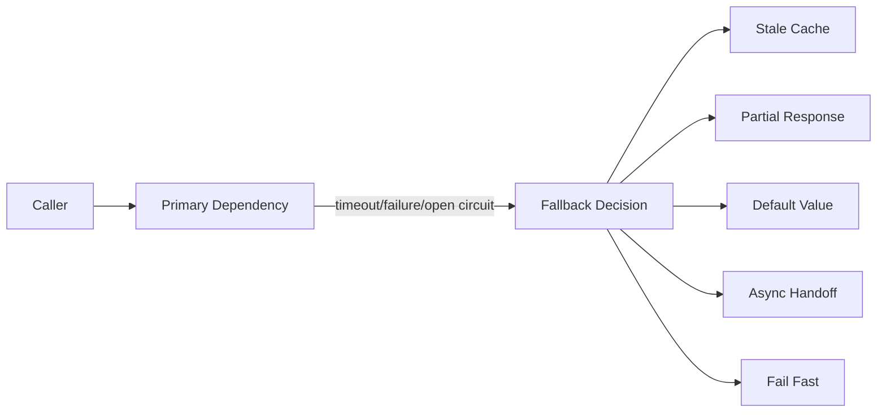
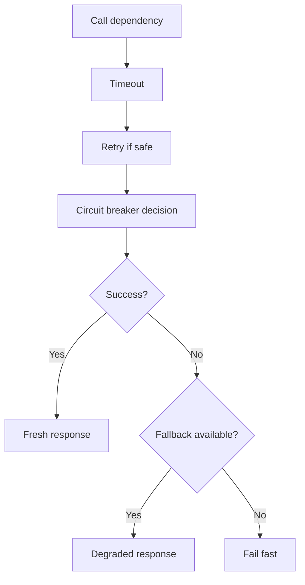
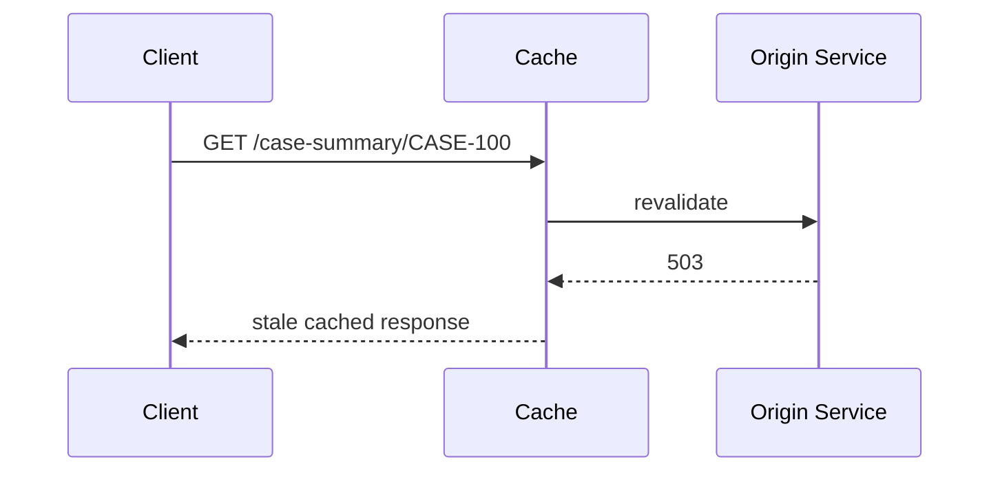
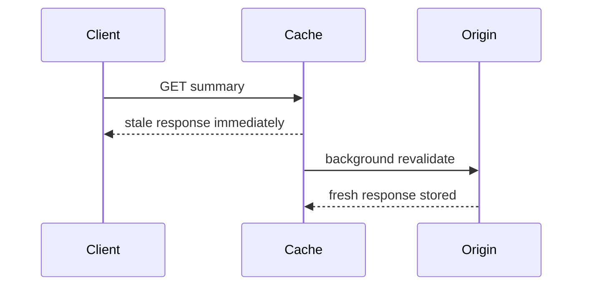
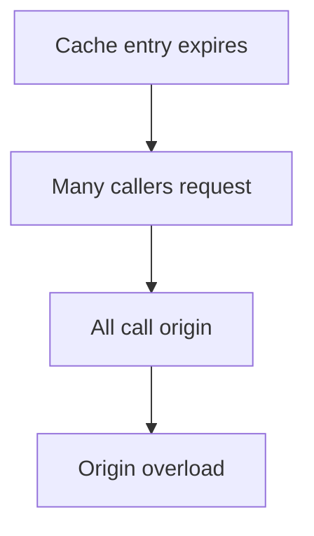
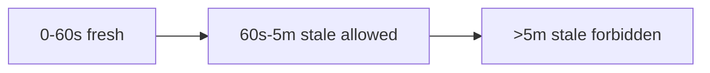
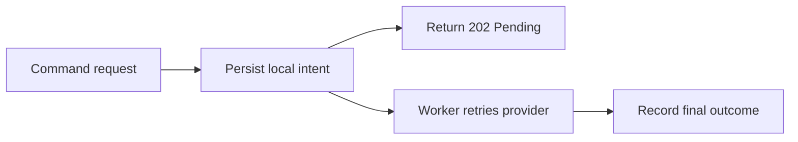
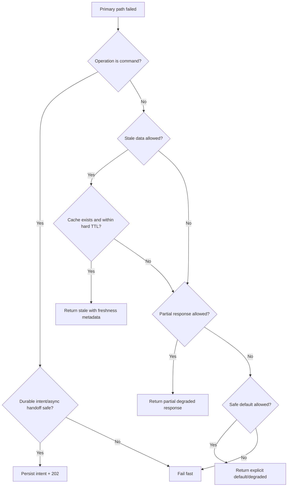

# Part 046 — Fallbacks, Stale Data, and Semantic Degradation

A fallback is an alternate behavior used when the preferred communication path fails, times out, overloads, or is intentionally disabled.

Fallbacks can make a system resilient.

Fallbacks can also lie.

The difference is semantics.

A good fallback preserves a valid business meaning under degraded conditions.

A bad fallback hides failure and corrupts decisions.

The central question is:

> If the primary call fails, what response is still truthful, safe, and useful?

Not every operation has a safe fallback.

---

## 1. The Core Mental Model

Normal path:



Fallback path:



Fallback is not always "return something."

Sometimes the correct fallback is:

```text
fail fast with a clear error
```

For critical commands, failing fast is often safer than pretending success.

---

## 2. Fallback vs Retry vs Circuit Breaker

| Pattern | Question |
|---|---|
| Retry | Should we try the same operation again? |
| Circuit breaker | Should we call this dependency at all? |
| Fallback | What should we do instead if normal path cannot complete? |
| Load shedding | Should we reject work to preserve capacity? |
| Brownout | Which optional features can we disable? |

Fallback usually happens after:

- timeout,
- retry exhaustion,
- circuit breaker open,
- bulkhead full,
- rate limit,
- load shedding,
- dependency error,
- stale cache available,
- feature brownout.

Example composition:



Fallback is the last semantic decision.

---

## 3. Query Fallback vs Command Fallback

Queries and commands are different.

### Query fallback

A query fallback may return:

- stale cache,
- partial response,
- default ranking,
- empty optional section,
- approximate count,
- async report link,
- previously known value.

This can be acceptable if the contract allows staleness or partial data.

### Command fallback

A command fallback is dangerous.

A command changes state.

Bad command fallback:

```text
payment service unavailable -> return success
```

Bad:

```text
audit service unavailable -> drop audit silently
```

Bad:

```text
case escalation dependency unavailable -> mark escalation complete locally
```

Safer command fallback options:

- fail fast,
- enqueue durable command for later,
- return `202 Accepted` with operation status,
- route to alternate provider if equivalent,
- persist local intent and reconcile,
- require manual remediation,
- block until dependency available if workflow allows.

Rule:

> Query fallback can degrade truth. Command fallback must preserve truth.

---

## 4. Fallback Taxonomy

| Fallback type | Example | Risk |
|---|---|---|
| Stale cache | return last known case summary | stale decisions |
| Partial response | omit risk enrichment | incomplete data |
| Default value | default recommendation order | hidden bias/wrong behavior |
| Empty result | no notifications displayed | false absence |
| Alternate provider | secondary sanctions API | semantic mismatch |
| Async handoff | return operation ID | delayed completion |
| Local intent | persist command for later execution | reconciliation needed |
| Brownout | disable expensive feature | user-visible degradation |
| Fail fast | return explicit error | lower availability, higher truth |
| Manual workflow | create task for operator | human cost |

Do not choose fallback by convenience.

Choose it by business safety.

---

## 5. Stale Data

Stale data is old data returned because fresh data is unavailable or too expensive.

Stale is not automatically wrong.

Examples where stale may be acceptable:

- product catalog display,
- non-critical recommendation,
- UI decoration,
- dashboard trend,
- last known profile photo,
- reference metadata,
- read-only case summary with freshness label.

Examples where stale may be unsafe:

- fraud decision eligibility,
- payment balance,
- regulatory deadline,
- legal hold status,
- user permission,
- sanctions screening result,
- workflow state transition guard,
- case closure condition.

Stale data needs a freshness contract.

---

## 6. Freshness Contract

A stale fallback must answer:

- How old can data be?
- Is staleness visible to the caller?
- Is it allowed for this operation?
- Which fields can be stale?
- Is stale data safe for decisions?
- Can caller force fresh read?
- What happens if stale data is too old?
- Is stale response cached again?
- Is stale data tenant/user authorized at replay time?

Example metadata:

```json
{
  "caseId": "CASE-100",
  "status": "OPEN",
  "freshness": {
    "source": "cache",
    "stale": true,
    "cachedAt": "2026-07-05T10:15:30Z",
    "ageMillis": 45000,
    "maxStalenessMillis": 300000
  }
}
```

Do not hide stale data if consumers make decisions from it.

---

## 7. HTTP Stale Controls

HTTP caching has standardized controls.

RFC 9111 defines HTTP caching behavior and cache-control semantics.

RFC 5861 defines extensions such as:

- `stale-while-revalidate`,
- `stale-if-error`.

Example:

```http
Cache-Control: max-age=60, stale-while-revalidate=30, stale-if-error=300
```

Meaning conceptually:

- response is fresh for 60 seconds,
- cache may serve stale while revalidating for 30 seconds,
- cache may serve stale on error for 300 seconds.

For internal service-to-service communication, you may implement similar semantics even outside generic HTTP caches.

But do not apply them blindly to sensitive or decision-critical data.

---

## 8. `stale-if-error`

`stale-if-error` means a cache may return a stale response when the origin returns an error or is unreachable.

Example:



This improves availability.

But it must be bounded by max staleness.

Do not return a 3-day-old "case open" status for a legal decision unless the contract explicitly allows that risk.

---

## 9. `stale-while-revalidate`

`stale-while-revalidate` lets a cache immediately return stale response while refreshing in the background.



Useful for:

- reducing tail latency,
- smoothing origin load,
- improving UX,
- avoiding synchronized cache misses.

Risk:

- consumers may repeatedly see stale data,
- background revalidation can stampede without single-flight,
- stale data may violate correctness.

Use freshness metadata.

---

## 10. Cache Stampede

Fallback caches can create new problems.

If many callers detect stale/miss at once, they all revalidate.



Mitigations:

- single-flight request coalescing,
- stale-while-revalidate,
- jittered TTL,
- background refresh,
- soft TTL + hard TTL,
- per-key lock,
- request collapsing,
- rate-limited refresh.

Fallback cache must be resilient too.

---

## 11. Soft TTL and Hard TTL

Use two freshness limits.

```text
soft TTL: when refresh should start
hard TTL: max age that can be served
```

Example:

```text
soft TTL = 60 seconds
hard TTL = 5 minutes
```

Behavior:

- under 60s: serve fresh,
- 60s–5m: serve stale and refresh,
- over 5m: stale too old; fail or fetch synchronously.



This is better than one TTL.

It separates freshness preference from safety limit.

---

## 12. Partial Response Fallback

Partial response returns available data and marks missing pieces.

Example:

```json
{
  "caseId": "CASE-100",
  "status": "OPEN",
  "riskScore": null,
  "documents": [],
  "degraded": true,
  "omitted": [
    {
      "field": "riskScore",
      "reason": "RISK_SERVICE_UNAVAILABLE"
    },
    {
      "field": "documents",
      "reason": "DOCUMENT_SERVICE_TIMEOUT"
    }
  ]
}
```

Partial response is acceptable only if:

- contract allows partial data,
- omitted fields are explicit,
- consumers are not making unsafe decisions,
- null does not mean "absent" when it really means "unknown",
- monitoring tracks degradation.

Do not use empty list as fallback if "empty" and "unknown" have different meanings.

---

## 13. Default Value Fallback

Default fallback is convenient and dangerous.

Example:

```java
return RiskScore.low();
```

If risk service is down, defaulting to low risk is a business hazard.

Safer:

```java
return RiskScore.unknownDueToDependencyFailure();
```

Default values are acceptable for:

- UI decoration,
- optional ranking,
- non-critical personalization,
- feature flags with safe default,
- display-only metadata.

Default values are dangerous for:

- authorization,
- risk,
- eligibility,
- money,
- legal/compliance state,
- workflow transition guards.

Prefer explicit `UNKNOWN` over fake normal values.

---

## 14. Empty Result Fallback

Returning empty result can lie.

Example:

```json
{
  "alerts": []
}
```

Does this mean:

```text
there are no alerts
```

or:

```text
alert service unavailable
```

Those are not the same.

Better:

```json
{
  "alerts": [],
  "alertsAvailable": false,
  "degraded": true,
  "degradationReason": "ALERT_SERVICE_UNAVAILABLE"
}
```

Or fail the operation if alerts are required for correctness.

---

## 15. Alternate Provider Fallback

Fallback to another provider can work when providers are semantically equivalent.

Example:

```text
primary geocoding provider -> secondary geocoding provider
```

But equivalence is rare.

Check:

- same data source?
- same freshness?
- same precision?
- same legal basis?
- same SLA?
- same auth/privacy constraints?
- same error semantics?
- same idempotency behavior?
- same rate limits?
- same audit requirements?

For sanctions/regulatory providers, "similar" is not enough.

A secondary provider may have different coverage and legal interpretation.

Alternate provider fallback requires explicit business approval.

---

## 16. Async Handoff Fallback

When synchronous completion is unavailable, accept work for later if safe.

```http
202 Accepted
Location: /v1/operations/OP-123
```

Response:

```json
{
  "operationId": "OP-123",
  "status": "PENDING",
  "submittedAt": "2026-07-05T10:15:30Z"
}
```

Use for:

- long-running commands,
- document generation,
- external provider delays,
- batch operations,
- non-immediate workflows.

Requirements:

- durable storage,
- idempotency,
- operation status endpoint,
- retry/reconciliation,
- audit trail,
- cancellation policy if applicable.

Do not return `202` if no durable work was actually accepted.

---

## 17. Local Intent Fallback

For commands, a safe fallback may be to record intent locally.

Example:

```text
document-signing provider unavailable
→ persist SigningRequest intent
→ return PENDING
→ background worker submits later
```



This preserves truth:

```text
request accepted, not completed
```

It does not lie:

```text
signature completed
```

This pattern is often better than synchronous fallback.

---

## 18. Fail-Fast Fallback

Sometimes the best fallback is no fallback.

Example:

- cannot verify authorization,
- cannot check legal hold,
- cannot write audit,
- cannot ensure idempotency,
- cannot determine workflow eligibility,
- cannot persist command intent.

Return a clear failure.

```http
503 Service Unavailable
Retry-After: 1
Content-Type: application/problem+json
```

```json
{
  "type": "https://errors.example.internal/dependency-unavailable",
  "title": "Dependency unavailable",
  "status": 503,
  "detail": "Case eligibility could not be verified.",
  "extensions": {
    "code": "ELIGIBILITY_DEPENDENCY_UNAVAILABLE",
    "retryable": true
  }
}
```

Failing fast is better than making an unsafe decision.

---

## 19. Fallback and Authorization

Do not bypass authorization in fallback.

Dangerous scenario:

1. Fresh read path checks field-level permission.
2. Fallback stale cache returns full object.
3. User sees fields they no longer have access to.

Rules:

- scope cache by tenant and authorization context where necessary,
- re-check current permission before returning stale data,
- cache only safe projection,
- avoid caching sensitive full responses unless designed,
- invalidate on permission changes if required,
- include data classification in fallback policy.

Fallback must preserve security invariants.

---

## 20. Fallback and Audit

Fallback behavior should be auditable when it affects business behavior.

Examples:

- stale data used for decision,
- command deferred,
- alternate provider used,
- manual remediation created,
- audit write fallback activated,
- degraded response served for critical workflow.

Separate:

| Event | Audit need |
|---|---|
| UI recommendation fallback | low |
| risk score unknown fallback | medium/high |
| regulatory command deferred | high |
| audit write deferred | very high |
| authorization fallback | very high |

Technical metrics are not enough for regulated workflows.

---

## 21. Fallback and Observability

Metrics:

```text
fallback.invocations.total{operation,type,reason}
fallback.success.total{operation,type}
fallback.failure.total{operation,type}
stale_response.total{operation,age_bucket}
stale_response.age_ms{operation}
partial_response.total{operation,omitted_field}
async_handoff.total{operation}
default_value_fallback.total{operation,field}
```

Trace attributes:

```text
fallback.type=stale_cache
fallback.reason=dependency_timeout
fallback.stale_age_ms=45000
response.degraded=true
```

Logs:

```json
{
  "event": "fallback_used",
  "operation": "getCaseSummary",
  "fallbackType": "STALE_CACHE",
  "reason": "CASE_SERVICE_TIMEOUT",
  "staleAgeMs": 45000,
  "maxStalenessMs": 300000,
  "degraded": true
}
```

Avoid logging cached sensitive data.

---

## 22. Fallback and Alerting

Alerts:

| Alert | Meaning |
|---|---|
| fallback rate above baseline | dependency degradation hidden by fallback |
| stale age near hard TTL | freshness risk |
| stale fallback for critical operation | business risk |
| default fallback used for decision field | dangerous policy |
| async handoff backlog growing | deferred work not completing |
| fallback failure rate rising | fallback path broken |
| fallback hides high dependency error rate | user impact may appear low |
| fallback used after permission change | security risk |

Fallback can make dashboards look green while users receive degraded data.

Track both:

```text
primary success
fallback success
freshness
degradation
```

---

## 23. Java Fallback Policy Object

```java
public record FallbackPolicy(
    String operation,
    boolean staleCacheAllowed,
    Duration maxStaleness,
    boolean partialResponseAllowed,
    boolean defaultValueAllowed,
    boolean asyncHandoffAllowed,
    boolean failFastRequiredForCommands
) {
    public FallbackPolicy {
        if (staleCacheAllowed && maxStaleness == null) {
            throw new IllegalArgumentException("maxStaleness required when stale cache is allowed");
        }
    }
}
```

Decision:

```java
public FallbackDecision decide(
    OperationSemantics semantics,
    Failure failure,
    Optional<CachedValue<?>> cachedValue
) {
    if (semantics.sideEffectingCommand()) {
        if (policy.asyncHandoffAllowed()) {
            return FallbackDecision.asyncHandoff();
        }
        return FallbackDecision.failFast();
    }

    if (policy.staleCacheAllowed() && cachedValue.isPresent()) {
        CachedValue<?> cached = cachedValue.get();
        if (cached.age().compareTo(policy.maxStaleness()) <= 0) {
            return FallbackDecision.useStaleCache(cached);
        }
    }

    if (policy.partialResponseAllowed()) {
        return FallbackDecision.partialResponse();
    }

    return FallbackDecision.failFast();
}
```

Fallback should be a policy decision, not a random catch block.

---

## 24. Stale Cache Implementation Sketch

```java
public final class StaleCacheFallbackClient implements CaseSummaryClient {
    private final CaseSummaryClient primary;
    private final CaseSummaryCache cache;
    private final FallbackPolicy policy;

    @Override
    public CaseSummaryResult getCaseSummary(CaseId caseId) {
        try {
            CaseSummary summary = primary.getCaseSummary(caseId);
            cache.put(caseId, summary);
            return CaseSummaryResult.fresh(summary);
        } catch (RemoteDependencyException ex) {
            Optional<CachedCaseSummary> cached = cache.get(caseId);

            if (cached.isPresent() && cached.get().age().compareTo(policy.maxStaleness()) <= 0) {
                return CaseSummaryResult.stale(
                    cached.get().summary(),
                    cached.get().cachedAt(),
                    ex.errorCode()
                );
            }

            throw new CaseSummaryUnavailableException("No fresh or acceptable stale data", ex);
        }
    }
}
```

Important:

- only cache safe projection,
- include tenant/authorization scope in key if needed,
- do not cache errors blindly,
- use max staleness,
- emit metrics.

---

## 25. Resilience4j Fallback Style

Resilience4j is decorator-oriented. Its examples show composing decorators such as CircuitBreaker and Retry, and recovering with fallback functions after failure.

Conceptual example:

```java
Supplier<CaseSummaryResult> supplier = () -> primary.getCaseSummary(caseId);

Supplier<CaseSummaryResult> decorated =
    Decorators.ofSupplier(supplier)
        .withCircuitBreaker(circuitBreaker)
        .withRetry(retry)
        .withFallback(
            List.of(RemoteDependencyException.class),
            throwable -> fallback.getCaseSummaryFromCache(caseId, throwable)
        )
        .decorate();

return decorated.get();
```

Be careful:

- fallback must receive enough context,
- fallback should not swallow all exceptions,
- fallback should preserve error classification,
- fallback should emit metrics,
- fallback should not return fake success.

In critical paths, explicit fallback code can be clearer than annotation magic.

---

## 26. Fallback Ordering

Where fallback sits matters.

Option:

```text
Retry -> CircuitBreaker -> Fallback
```

Meaning:

- try primary,
- retry if safe,
- circuit breaker may stop calls,
- fallback after final failure/open breaker.

For command:

```text
Timeout -> No unsafe retry -> Fail fast or durable intent
```

For read:

```text
Timeout -> bounded retry -> stale cache fallback
```

For optional enrichment:

```text
Short timeout -> no retry -> omit enrichment
```

The fallback should align with operation semantics.

---

## 27. Fallback and Cache Invalidation

Stale fallback is only as safe as cache invalidation.

Invalidation strategies:

| Strategy | Pros | Cons |
|---|---|---|
| TTL only | simple | stale until expiry |
| event-driven invalidation | fresh after updates | event loss/delay risk |
| write-through | cache updated on write | coupling |
| read-through | easy lookup | stampede risk |
| refresh-ahead | lower latency | background load |
| versioned cache | detects stale version | more complexity |

For business-critical reads, include version/ETag if possible.

Example:

```json
{
  "caseId": "CASE-100",
  "version": 42,
  "status": "OPEN"
}
```

If caller needs at-least-version 43, stale version 42 is not acceptable.

---

## 28. Fallback and Data Freshness Labels

Use explicit labels.

Possible model:

```java
public enum Freshness {
    FRESH,
    STALE_WITHIN_LIMIT,
    STALE_TOO_OLD,
    UNKNOWN
}
```

Response:

```json
{
  "data": {
    "caseId": "CASE-100"
  },
  "freshness": {
    "state": "STALE_WITHIN_LIMIT",
    "ageMillis": 45000,
    "maxStalenessMillis": 300000
  }
}
```

Do not encode freshness only in logs.

Consumers need it.

---

## 29. Fallback in API Contract

OpenAPI extension:

```yaml
x-fallback-policy:
  staleCacheAllowed: true
  maxStalenessSeconds: 300
  partialResponseAllowed: true
  degradationSignaled: true
  defaultValueFallbackAllowed: false
  commandFallback: fail-fast
```

Schema:

```yaml
Freshness:
  type: object
  required:
    - state
  properties:
    state:
      type: string
      enum:
        - FRESH
        - STALE_WITHIN_LIMIT
        - UNKNOWN
    ageMillis:
      type: integer
      format: int64
    maxStalenessMillis:
      type: integer
      format: int64
```

If fallback changes response semantics, the contract must show it.

---

## 30. Testing Fallbacks

Minimum tests:

| Scenario | Expected behavior |
|---|---|
| primary succeeds | fresh response, cache updated |
| primary times out, acceptable cache exists | stale response marked |
| primary fails, cache too old | fail fast |
| primary fails, no cache | fail fast |
| optional enrichment fails | partial response marked |
| command dependency fails | no fake success |
| command async handoff | durable intent persisted |
| permission changed | stale data not leaked |
| default fallback | only for allowed fields |
| fallback path fails | clear error emitted |
| metrics emitted | fallback type/reason visible |

Test stale fallback:

```java
@Test
void returnsStaleCacheWhenPrimaryTimesOutAndCacheWithinLimit() {
    cache.put(caseId, summary, Instant.now().minusSeconds(30));
    primary.failWith(new RemoteTimeoutException());

    CaseSummaryResult result = client.getCaseSummary(caseId);

    assertThat(result.freshness().state()).isEqualTo(Freshness.STALE_WITHIN_LIMIT);
    assertThat(result.summary().caseId()).isEqualTo(caseId);
}
```

Test stale too old:

```java
@Test
void failsWhenCachedDataExceedsHardTtl() {
    cache.put(caseId, summary, Instant.now().minus(Duration.ofHours(2)));
    primary.failWith(new RemoteDependencyUnavailableException());

    assertThatThrownBy(() -> client.getCaseSummary(caseId))
        .isInstanceOf(CaseSummaryUnavailableException.class);
}
```

Test command safety:

```java
@Test
void doesNotReturnSuccessForCommandWhenDependencyUnavailable() {
    dependency.failWith(new RemoteDependencyUnavailableException());

    assertThatThrownBy(() -> commandClient.createEscalation(command))
        .isInstanceOf(CommandUnavailableException.class);

    assertThat(escalationRepository.findByCommandId(command.id())).isEmpty();
}
```

---

## 31. Load Testing Fallback

Fallbacks must be tested under real failure.

Scenarios:

- dependency 100% down,
- dependency slow but not failing,
- cache hit ratio low,
- cache stampede,
- cache storage slow,
- stale hard TTL reached,
- permission changes,
- fallback enabled for high traffic,
- fallback path dependency fails,
- brownout toggled,
- retry + fallback interaction.

Questions:

- Does fallback reduce user-visible errors?
- Does it hide dependency outage from alerts?
- Does stale age stay bounded?
- Does cache stampede happen?
- Does fallback overload cache?
- Are degraded responses explicit?
- Are commands still correct?
- Can fallback be turned off quickly?

---

## 32. Production Policy Template

```yaml
fallbacks:
  case-service:
    operations:
      getCaseSummary:
        primary:
          timeoutMs: 300
          retry:
            maxAttempts: 2
        fallback:
          type: stale-cache
          maxStalenessSeconds: 300
          softTtlSeconds: 60
          hardTtlSeconds: 300
          signalDegradation: true
          requireCurrentAuthorizationCheck: true
          failIfCacheTooOld: true

      searchCases:
        fallback:
          type: fail-fast
          reason: query-results-must-be-fresh-enough-for-workflow

      getCaseRecommendations:
        fallback:
          type: default-ranking
          signalDegradation: true

      createEscalation:
        fallback:
          type: fail-fast
          allowAsyncHandoff: false
          reason: side-effecting-command-must-not-fake-success

      submitDocumentSignature:
        fallback:
          type: durable-intent
          responseStatus: 202
          statusEndpoint: /v1/operations/{operationId}
          reconciliationRequired: true
```

Fallback policy must be reviewed with product/domain owners, not only platform engineers.

---

## 33. Common Anti-Patterns

### 33.1 Catch all, return default

```java
catch (Exception e) {
    return defaultValue;
}
```

This hides failures and corrupts semantics.

### 33.2 Fake success for command

Never return success for a state change that did not happen.

### 33.3 Empty means unavailable

Empty list is not the same as unknown/unavailable.

### 33.4 Stale data with no timestamp

Consumers cannot judge safety.

### 33.5 Stale data for authorization

Security risk.

### 33.6 Fallback path untested

Fallback fails during the incident.

### 33.7 Fallback hides outage from monitoring

Primary dependency is down but dashboard shows success.

### 33.8 Unlimited stale

Old data lives forever.

### 33.9 Fallback stampede

Cache fallback creates origin or cache overload.

### 33.10 No kill switch

Bad fallback cannot be disabled quickly.

---

## 34. Decision Model



This flow prevents "fallback by accident."

---

## 35. Design Checklist

Before adding fallback:

- What failure does fallback handle?
- Is operation query or command?
- Is stale data allowed?
- What is max staleness?
- Is staleness visible to consumers?
- Is partial response allowed?
- Are omitted fields explicit?
- Is default value semantically safe?
- Can fallback violate authorization?
- Can fallback violate audit requirements?
- Does fallback preserve tenant isolation?
- Does fallback hide dependency outage?
- Are metrics emitted for fallback use?
- Are alerts configured for fallback rate?
- Does cache have soft TTL and hard TTL?
- Is cache stampede controlled?
- Is fallback documented in OpenAPI?
- Are command fallbacks durable and truthful?
- Is there a kill switch?
- Has fallback been load-tested?

---

## 36. The Real Lesson

Fallback is not "return anything instead of failing."

Fallback is a semantic contract under failure.

A good fallback says:

```text
the normal answer is unavailable,
but this alternate answer is still truthful within known limits
```

A bad fallback says:

```text
something went wrong,
but we will pretend everything is normal
```

In production microservices, resilience is not only availability.

It is availability without lying.

---

## References

- RFC 9111 — HTTP Caching: https://www.rfc-editor.org/rfc/rfc9111.html
- RFC 5861 — HTTP Cache-Control Extensions for Stale Content: https://datatracker.ietf.org/doc/html/rfc5861
- RFC 9457 — Problem Details for HTTP APIs: https://www.rfc-editor.org/rfc/rfc9457.html
- Google SRE Book — Addressing Cascading Failures: https://sre.google/sre-book/addressing-cascading-failures/
- Google SRE Book — Handling Overload: https://sre.google/sre-book/handling-overload/
- Resilience4j Getting Started: https://resilience4j.readme.io/docs/getting-started
- Resilience4j CircuitBreaker: https://resilience4j.readme.io/docs/circuitbreaker
