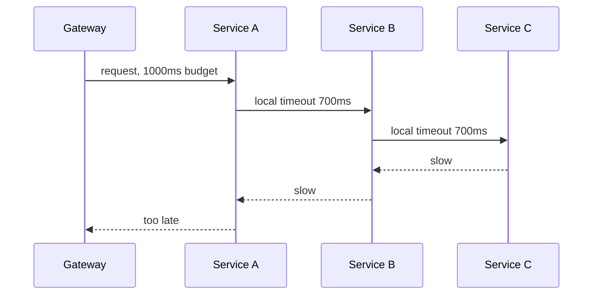
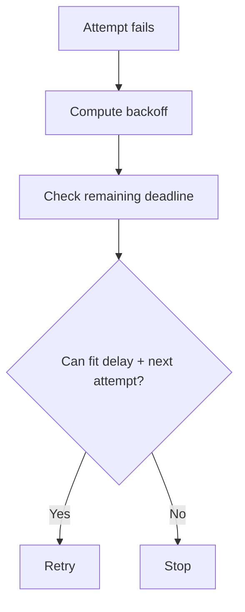
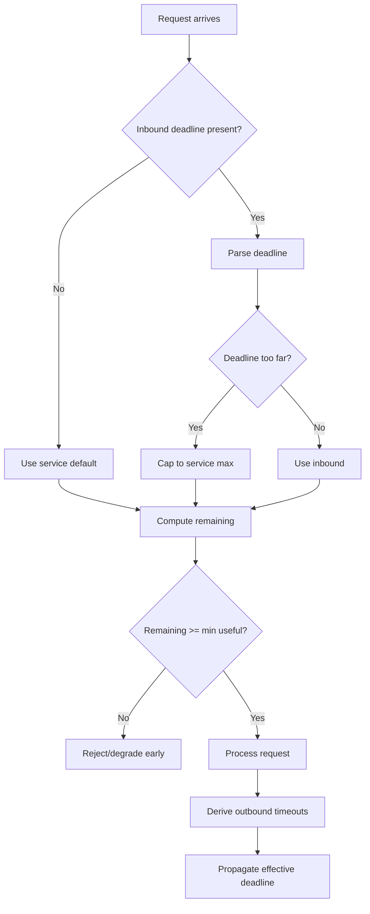

# Part 047 — Deadline Propagation Across Service Calls

A timeout limits one wait.

A deadline limits the whole operation.

That distinction becomes critical in microservices.

If every service invents its own local timeout, a request chain can exceed the original caller budget by seconds. Each service may believe it is behaving reasonably, while the user sees a timeout and the platform keeps doing wasted work.

Deadline propagation fixes the mental model:

> The caller gives an operation a finite time budget. Every downstream hop spends from the same budget.

A mature service does not merely ask:

```text
What is my timeout?
```

It asks:

```text
How much of the original deadline remains, and is this work still worth starting?
```

---

## 1. The Core Problem

Imagine an API gateway gives an external request 1000 ms.



Each local timeout may look reasonable.

Together they violate the end-to-end budget.

Deadline propagation means:

```text
gateway deadline = now + 1000ms
A sees remaining budget
A spends some time
A passes remaining budget to B
B passes remaining budget to C
C stops if budget is gone
```

The same request chain becomes bounded by one shared temporal contract.

---

## 2. Timeout vs Deadline

| Concept | Meaning | Example |
|---|---|---|
| Timeout | Relative duration from now | wait up to 250 ms |
| Deadline | Absolute point in time | finish before 10:15:30.500Z |
| Remaining budget | deadline minus current time | 137 ms left |
| Per-attempt timeout | duration allowed for one remote attempt | 100 ms |
| Operation deadline | maximum time for logical operation | 500 ms |
| Server cancellation | stopping work after deadline/cancel | stop DB query / stop fan-out |

Timeout:

```java
Duration timeout = Duration.ofMillis(250);
```

Deadline:

```java
Instant deadline = Instant.now().plusMillis(500);
```

Remaining budget:

```java
Duration remaining = Duration.between(Instant.now(), deadline);
```

In one process, timeout can be enough.

Across hops, deadline is safer because it preserves the original budget.

---

## 3. Why Relative Timeout Headers Are Risky

A relative timeout header:

```http
X-Timeout-Ms: 500
```

can be distorted by:

- queueing before the service sees the request,
- proxy delay,
- load balancer retries,
- clock of caller not visible to callee,
- service reading header late,
- thread-pool wait,
- request body upload time.

Absolute deadline:

```http
X-Request-Deadline: 2026-07-05T10:15:30.500Z
```

lets each service calculate:

```text
remaining = deadline - now
```

That makes queue time visible.

But absolute deadlines require attention to clock behavior.

Use bounded trust and sensible margins.

---

## 4. gRPC Deadlines

gRPC has first-class deadline support.

A client can set a deadline:

```java
CaseServiceGrpc.CaseServiceBlockingStub stub =
    CaseServiceGrpc.newBlockingStub(channel)
        .withDeadlineAfter(450, TimeUnit.MILLISECONDS);

CaseResponse response = stub.getCase(request);
```

When a deadline is exceeded, gRPC can cancel the call. On the server side, long-running work should observe cancellation and stop work that is no longer useful.

This is a strong model because the deadline is part of RPC semantics, not just an ad-hoc header.

But the business rules still matter:

- a server may already have committed a side effect before cancellation,
- cancellation is not rollback,
- commands still need idempotency and deduplication,
- downstream calls should receive remaining budget.

---

## 5. Deadline Propagation over HTTP

HTTP does not define one universal deadline propagation header.

Many organizations define internal headers.

Example:

```http
X-Request-Deadline: 2026-07-05T10:15:30.500Z
```

Optional related headers:

```http
X-Request-Start: 2026-07-05T10:15:29.500Z
X-Request-Timeout-Ms: 1000
X-Retry-Attempt: 0
```

Recommended minimum:

```http
X-Request-Deadline
```

But enforce rules:

1. inbound deadline is optional at trust boundary,
2. service calculates an effective deadline,
3. service caps unrealistic deadlines,
4. service rejects impossible deadlines,
5. outbound clients propagate effective deadline,
6. all downstream timeouts are derived from remaining budget.

---

## 6. Effective Deadline

A service should not blindly trust inbound deadlines.

A caller can send:

```http
X-Request-Deadline: 2099-01-01T00:00:00Z
```

or a deadline too short to do anything useful.

Calculate an effective deadline:

```text
effective_deadline = min(inbound_deadline, now + service_max_duration)
```

If no inbound deadline exists:

```text
effective_deadline = now + service_default_duration
```

If remaining budget is below minimum useful work:

```text
reject early or degrade
```

Java sketch:

```java
public final class DeadlineResolver {
    private final Clock clock;
    private final Duration defaultDuration;
    private final Duration maxDuration;
    private final Duration minUsefulDuration;

    public Deadline resolve(Optional<Instant> inboundDeadline) {
        Instant now = clock.instant();

        Instant localDefault = now.plus(defaultDuration);
        Instant localMax = now.plus(maxDuration);

        Instant candidate = inboundDeadline.orElse(localDefault);
        Instant effective = candidate.isBefore(localMax) ? candidate : localMax;

        Duration remaining = Duration.between(now, effective);
        if (remaining.compareTo(minUsefulDuration) < 0) {
            throw new DeadlineTooShortException(remaining);
        }

        return new Deadline(effective, clock);
    }
}
```

---

## 7. Deadline Object

Do not pass raw `Instant` and `Duration` everywhere.

Create a first-class type.

```java
public final class Deadline {
    private final Instant expiresAt;
    private final Clock clock;

    public Deadline(Instant expiresAt, Clock clock) {
        this.expiresAt = Objects.requireNonNull(expiresAt);
        this.clock = Objects.requireNonNull(clock);
    }

    public Instant expiresAt() {
        return expiresAt;
    }

    public Duration remaining() {
        Duration remaining = Duration.between(clock.instant(), expiresAt);
        return remaining.isNegative() ? Duration.ZERO : remaining;
    }

    public boolean expired() {
        return !clock.instant().isBefore(expiresAt);
    }

    public boolean canFit(Duration required) {
        return remaining().compareTo(required) >= 0;
    }

    public Duration timeoutWithMargin(Duration desired, Duration margin) {
        Duration available = remaining().minus(margin);
        if (available.isNegative()) {
            return Duration.ZERO;
        }
        return desired.compareTo(available) < 0 ? desired : available;
    }
}
```

This makes the code communicate intent:

```java
Duration attemptTimeout = deadline.timeoutWithMargin(
    operationPolicy.responseTimeout(),
    Duration.ofMillis(25)
);
```

---

## 8. Request Context

Deadline belongs in a request context with other propagation metadata.

```java
public record RequestContext(
    String traceId,
    String correlationId,
    String callerService,
    String tenantId,
    Deadline deadline,
    int retryAttempt,
    Priority priority
) {}
```

The context should be:

- created at ingress,
- available to application code,
- propagated to outbound clients,
- not stored globally in unsafe ways,
- cleared after request,
- propagated across async boundaries deliberately.

Thread locals can work in simple servlet code.

They become risky with async, reactive, virtual threads, and executor hops.

Prefer explicit context passing for critical paths.

---

## 9. Inbound HTTP Filter

Conceptual Spring filter:

```java
public final class RequestContextFilter extends OncePerRequestFilter {
    private final DeadlineResolver deadlineResolver;
    private final RequestContextHolder contextHolder;

    @Override
    protected void doFilterInternal(
        HttpServletRequest request,
        HttpServletResponse response,
        FilterChain chain
    ) throws ServletException, IOException {
        Optional<Instant> inboundDeadline = parseDeadline(
            request.getHeader("X-Request-Deadline")
        );

        RequestContext context = RequestContext.builder()
            .traceId(currentTraceId())
            .correlationId(request.getHeader("X-Correlation-Id"))
            .callerService(resolveCaller(request))
            .tenantId(resolveTenant(request))
            .deadline(deadlineResolver.resolve(inboundDeadline))
            .retryAttempt(parseRetryAttempt(request))
            .priority(resolvePriority(request))
            .build();

        try {
            contextHolder.set(context);
            chain.doFilter(request, response);
        } finally {
            contextHolder.clear();
        }
    }
}
```

This filter should be early enough to prevent wasted work.

If deadline is impossible, reject before parsing large bodies or hitting databases.

---

## 10. Outbound HTTP Propagation

Every owned HTTP client adapter should propagate deadline.

```java
public final class DeadlinePropagatingInterceptor implements ClientHttpRequestInterceptor {
    private final RequestContextProvider contextProvider;

    @Override
    public ClientHttpResponse intercept(
        HttpRequest request,
        byte[] body,
        ClientHttpRequestExecution execution
    ) throws IOException {
        RequestContext context = contextProvider.current();

        request.getHeaders().set(
            "X-Request-Deadline",
            context.deadline().expiresAt().toString()
        );

        request.getHeaders().set(
            "X-Correlation-Id",
            context.correlationId()
        );

        return execution.execute(request, body);
    }
}
```

Outbound timeout should be derived from remaining deadline:

```java
Duration responseTimeout = context.deadline().timeoutWithMargin(
    operationPolicy.responseTimeout(),
    Duration.ofMillis(25)
);
```

Do not set outbound timeout larger than remaining deadline.

---

## 11. WebClient Deadline Propagation

Reactive code needs explicit context propagation.

Conceptual filter:

```java
ExchangeFilterFunction deadlineFilter = (request, next) ->
    Mono.deferContextual(ctx -> {
        RequestContext requestContext = ctx.get(RequestContext.class);

        ClientRequest updated = ClientRequest.from(request)
            .header("X-Request-Deadline", requestContext.deadline().expiresAt().toString())
            .header("X-Correlation-Id", requestContext.correlationId())
            .build();

        Duration timeout = requestContext.deadline()
            .timeoutWithMargin(Duration.ofMillis(300), Duration.ofMillis(25));

        return next.exchange(updated).timeout(timeout);
    });
```

Do not assume thread-local context works automatically in reactive pipelines.

Use Reactor context or explicit parameters.

---

## 12. gRPC Deadline Propagation in Java

For outbound gRPC call:

```java
Duration remaining = requestContext.deadline().remaining();

CaseServiceGrpc.CaseServiceBlockingStub stubWithDeadline =
    stub.withDeadlineAfter(remaining.toMillis(), TimeUnit.MILLISECONDS);

CaseResponse response = stubWithDeadline.getCase(request);
```

But do not pass full remaining budget blindly.

Reserve local margin:

```java
Duration callBudget = requestContext.deadline()
    .timeoutWithMargin(Duration.ofMillis(500), Duration.ofMillis(25));
```

Then:

```java
stub.withDeadlineAfter(callBudget.toMillis(), TimeUnit.MILLISECONDS)
```

Downstream service should receive and continue propagating the deadline.

---

## 13. Deadline and Server Cancellation

A server should stop work when the deadline expires.

Examples:

- stop fan-out calls,
- stop expensive computation,
- cancel database query if possible,
- stop waiting for optional enrichment,
- stop background refresh tied to request,
- stop building response that caller will never receive.

Pseudo-code:

```java
public CaseView getCase(CaseId caseId, RequestContext context) {
    if (context.deadline().expired()) {
        throw new DeadlineExceededException();
    }

    Duration dbTimeout = context.deadline()
        .timeoutWithMargin(Duration.ofMillis(200), Duration.ofMillis(20));

    return repository.findCase(caseId, dbTimeout);
}
```

Important:

> Cancellation is not rollback.

If a command already committed, cancellation only stops later work.

---

## 14. Deadline and Database Timeouts

HTTP deadline must align with database statement timeout.

Bad:

```text
HTTP deadline remaining = 300 ms
DB statement timeout = 10 seconds
```

If client times out, database may still work for 10 seconds.

Better:

```text
DB statement timeout = min(operation DB budget, remaining deadline - margin)
```

Conceptual:

```java
Duration queryTimeout = context.deadline()
    .timeoutWithMargin(Duration.ofMillis(250), Duration.ofMillis(25));

jdbcTemplate.setQueryTimeout((int) Math.ceil(queryTimeout.toMillis() / 1000.0));
```

For PostgreSQL, you can use transaction-local `statement_timeout`.

```sql
SET LOCAL statement_timeout = '250ms';
```

Make sure database timeout is shorter than caller deadline.

---

## 15. Deadline and Retry

Retry must be deadline-aware.



Never do this:

```text
3 attempts × 300ms each
```

without checking original deadline.

Correct:

```java
if (!deadline.canFit(backoff.plus(minAttemptDuration))) {
    return RetryDecision.stop("deadline_exhausted");
}
```

A retry that cannot complete before deadline only adds load.

---

## 16. Deadline and Hedging

Hedged request should only start when:

```text
remaining deadline >= hedge delay + minimum useful attempt duration
```

If only 80 ms remains and hedge delay is 75 ms, the hedge is pointless.

Hedging also needs spare capacity.

Deadline-aware hedging:

```java
if (!deadline.canFit(hedgeDelay.plus(minAttemptDuration))) {
    suppress("DEADLINE_TOO_SHORT");
}
```

Deadline keeps tail-latency optimization from becoming speculative waste.

---

## 17. Deadline and Fallback

Fallback must fit deadline too.

Example:

- primary call times out,
- stale cache fallback takes 5 ms,
- deadline remaining 30 ms.

Good.

But:

- primary call times out,
- alternate provider fallback takes 800 ms,
- deadline remaining 30 ms.

Bad.

Fallback decision:

```java
if (fallback.estimatedCost().compareTo(deadline.remaining()) > 0) {
    failFast("fallback cannot fit deadline");
}
```

Sometimes fallback should be selected earlier.

For optional enrichment, use a very short budget and fallback quickly.

---

## 18. Deadline and Bulkhead Wait

Waiting for a bulkhead permit spends deadline.

Bad:

```text
bulkhead maxWait = 200ms
remote timeout = 400ms
caller remaining = 500ms
```

Total can exceed budget.

Better:

```text
bulkhead maxWait <= remaining - minRemoteAttempt - margin
```

For synchronous user-facing paths, keep bulkhead wait short or zero.

If there is no capacity, fail/degrade fast.

---

## 19. Deadline and Rate Limit Wait

A rate limiter can either reject or wait.

Waiting for permission consumes deadline.

If a caller has 300 ms remaining and limiter waits 500 ms, the work is already stale.

Policy:

```text
user-facing calls: timeoutDuration small or zero
background workflows: durable delay/reschedule
```

Deadline should drive whether to wait, reject, or schedule later.

---

## 20. Deadline Across Async Boundaries

A request may enqueue async work.

Should deadline propagate?

Depends on semantics.

### Request-scoped async work

If async work is part of producing the current response, propagate the same deadline.

Example:

- parallel dependency calls,
- async enrichment,
- database future,
- computation future.

### Durable background work

If work is accepted for later completion, do not use the request deadline as the job deadline blindly.

Example:

```http
202 Accepted
Location: /operations/OP-123
```

The request deadline bounds accepting the job.

The job has its own SLA/deadline.

Separate:

```text
request acceptance deadline
job completion deadline
```

Do not confuse them.

---

## 21. Deadline and Message Consumers

Message processing is not usually tied to a user request deadline.

But it still needs budgets.

A message consumer should define:

- processing deadline per message,
- external dependency call deadline,
- retry/backoff schedule,
- max age of message,
- dead-letter threshold,
- business expiry.

Example:

```yaml
messageProcessing:
  caseEscalationRequested:
    maxProcessingDurationMs: 2000
    dependencyDeadlineMs: 500
    maxMessageAge: 24h
```

If the original HTTP request created the message, you may propagate a business due time, not the short HTTP deadline.

---

## 22. Deadline and Workflow Engines

Workflow engines often retry steps over minutes/hours.

Do not apply HTTP request deadline to the whole workflow.

Instead:

- each activity execution has a timeout,
- each external call inside activity has a deadline,
- workflow has business SLA,
- idempotency protects retries,
- compensation/reconciliation handles unknown outcomes.

Think in layers:

```text
HTTP request deadline
activity execution timeout
external call deadline
workflow business deadline
```

Each one has different meaning.

---

## 23. Deadline and Fan-Out

Fan-out needs budget allocation.

Example:

```text
remaining deadline = 500ms
fan-out to 5 dependencies
```

If calls are parallel:

```text
each may get 300ms
aggregation margin = 50ms
```

If calls are serial:

```text
divide budget by sequence
```

Fan-out controller:

```java
Duration remaining = deadline.remaining();
Duration aggregationMargin = Duration.ofMillis(50);
Duration childBudget = remaining.minus(aggregationMargin);

CompletableFuture<A> a = callA.withTimeout(childBudget);
CompletableFuture<B> b = callB.withTimeout(childBudget);
CompletableFuture<C> c = callC.withTimeout(childBudget);
```

For optional dependencies, allocate smaller budget.

```text
core call: 300ms
optional enrichment: 80ms
```

Do not let optional work consume core deadline.

---

## 24. Deadline and Priority

High-priority traffic may receive larger budget.

But be careful.

If high-priority requests get long deadlines, they may hold resources longer.

Priority should affect:

- admission,
- concurrency reservation,
- fallback choice,
- queue placement,
- timeout budget,
- retry budget.

Example:

```yaml
priorities:
  critical-command:
    maxDeadlineMs: 1000
    shedLast: true
  user-facing-read:
    maxDeadlineMs: 500
  batch:
    maxDeadlineMs: 2000
    shedFirst: true
    concurrencyLimit: low
```

Longer deadline does not mean unlimited deadline.

---

## 25. Clock Skew

Absolute deadlines depend on clocks.

If caller and callee clocks differ, remaining budget may be miscalculated.

Mitigations:

- synchronized clocks via NTP/chrony,
- cap inbound deadline,
- reject absurd past/future deadlines,
- include relative timeout as secondary hint if needed,
- use monotonic time inside process for elapsed measurements,
- add safety margins.

Within a process, use monotonic clock for measuring elapsed time when possible.

Across services, use wall-clock deadline with caps and margins.

---

## 26. Security and Abuse

Deadline headers can be abused.

A caller can request very long processing time.

Rules:

- cap max deadline by caller/service/operation,
- do not trust unauthenticated deadline headers,
- ignore inbound deadline at public edge if inappropriate,
- derive edge deadline from gateway policy,
- allow only shorter deadlines from untrusted callers,
- record caller identity and deadline values in safe metrics.

Example:

```text
public user max deadline = 5s
internal workflow max deadline = 30s
critical sync service max deadline = 1s
```

Deadline is a resource request.

Treat it like one.

---

## 27. Observability

Metrics:

```text
request.deadline.remaining_at_ingress_ms{operation,priority}
request.deadline.too_short.total{operation}
request.deadline.exceeded.total{operation,phase}
outbound.deadline.remaining_ms{dependency,operation}
outbound.timeout.derived_ms{dependency,operation}
deadline.propagated.total{dependency,operation}
deadline.missing.total{caller,operation}
deadline.capped.total{caller,operation}
```

Trace attributes:

```text
deadline.expires_at
deadline.remaining_ms
deadline.capped=true
deadline.too_short=false
```

Logs:

```json
{
  "event": "deadline_too_short",
  "operation": "createEscalation",
  "caller": "workflow-service",
  "remainingMs": 23,
  "minUsefulMs": 100
}
```

Avoid high-cardinality labels such as request ID or resource ID.

---

## 28. Alerting

Useful alerts:

| Alert | Meaning |
|---|---|
| missing deadline from internal caller | propagation gap |
| deadline too short spike | upstream budget issue |
| deadline capped spike | caller sending too-long deadlines |
| deadline exceeded before outbound call | queue/admission problem |
| DB still running after HTTP deadline | cancellation/timeout mismatch |
| retry skipped due to deadline high | timeout budget too small or dependency slow |
| p99 near deadline | little safety margin |
| request queue age exceeds deadlines | load shedding needed |

Deadline observability shows whether time budgets are real or imagined.

---

## 29. Testing Deadline Propagation

Minimum tests:

| Scenario | Expected behavior |
|---|---|
| no inbound deadline | service default applied |
| inbound deadline too long | deadline capped |
| inbound deadline already expired | request rejected |
| inbound deadline too short | request rejected/degraded |
| outbound call | deadline header propagated |
| outbound timeout | derived from remaining budget |
| retry | skipped when deadline insufficient |
| hedge | suppressed when deadline insufficient |
| fallback | selected only if fits remaining budget |
| DB query | statement timeout shorter than deadline |
| async executor | context propagated |
| reactive pipeline | context propagated |
| gRPC call | deadline set on stub |

Example test:

```java
@Test
void capsInboundDeadlineToServiceMaximum() {
    Instant now = Instant.parse("2026-07-05T10:00:00Z");
    Clock clock = Clock.fixed(now, ZoneOffset.UTC);

    DeadlineResolver resolver = new DeadlineResolver(
        clock,
        Duration.ofMillis(500),
        Duration.ofMillis(1000),
        Duration.ofMillis(50)
    );

    Deadline deadline = resolver.resolve(Optional.of(now.plusSeconds(60)));

    assertThat(deadline.expiresAt()).isEqualTo(now.plusMillis(1000));
}
```

Outbound propagation test:

```java
@Test
void propagatesEffectiveDeadlineHeader() {
    client.getCase(caseId, contextWithDeadline("2026-07-05T10:00:00.500Z"));

    verify(getRequestedFor(urlEqualTo("/v1/cases/CASE-100"))
        .withHeader("X-Request-Deadline", equalTo("2026-07-05T10:00:00.500Z")));
}
```

Retry test:

```java
@Test
void doesNotRetryWhenDeadlineCannotFitNextAttempt() {
    Deadline deadline = Deadline.after(Duration.ofMillis(40));

    RetryDecision decision = retryPolicy.afterFailure(
        transientFailure,
        deadline,
        AttemptNumber.second()
    );

    assertThat(decision.shouldRetry()).isFalse();
}
```

---

## 30. Load Testing Deadlines

Test under real overload:

- request queue grows,
- dependency latency increases,
- retry storm starts,
- fan-out path slows,
- downstream cancellation ignored,
- database query continues after HTTP timeout,
- gateway timeout shorter than service timeout,
- service mesh timeout conflicts with app timeout.

Questions:

- Are stale queued requests rejected?
- Do downstream calls stop when deadline expires?
- Is retry load reduced by deadline checks?
- Does p99 stay below caller timeout?
- Are cancelled requests still consuming DB resources?
- Are proxy/gateway/app timeouts aligned?

Deadline propagation must be tested as a system property.

---

## 31. Production Policy Template

```yaml
deadlinePropagation:
  inbound:
    header: X-Request-Deadline
    defaultDeadlineMs: 500
    maxDeadlineMs: 1000
    minUsefulDeadlineMs: 75
    rejectWhenExpired: true
    rejectWhenTooShort: true
    capUntrustedDeadline: true

  outbound:
    propagateHeader: true
    reserveResponseMarginMs: 25
    deriveTimeoutFromRemainingBudget: true
    rejectCallWhenRemainingBelowMs: 50

  operations:
    getCase:
      defaultDeadlineMs: 300
      maxDeadlineMs: 600
      minUsefulMs: 50

    searchCases:
      defaultDeadlineMs: 500
      maxDeadlineMs: 1000
      minUsefulMs: 150

    createEscalation:
      defaultDeadlineMs: 600
      maxDeadlineMs: 1000
      minUsefulMs: 100

  async:
    propagateForRequestScopedTasks: true
    separateDurableJobDeadline: true

  observability:
    recordRemainingBudget: true
    recordDeadlineCapped: true
    recordDeadlineTooShort: true
```

Make this policy explicit.

Do not hide deadline behavior inside random timeout constants.

---

## 32. Common Anti-Patterns

### 32.1 Every service invents a new timeout

The call chain exceeds user budget.

### 32.2 Propagating longer deadlines downstream

A service should not extend the caller's deadline.

### 32.3 Ignoring queue time

Request waits in queue, then receives full timeout anyway.

### 32.4 Retrying after deadline is effectively gone

Retry only adds load.

### 32.5 Long DB timeout under short HTTP deadline

Database keeps working after caller disappears.

### 32.6 ThreadLocal context lost in async code

Outbound calls miss deadline header.

### 32.7 Deadline header trusted blindly

Caller can request excessive resources.

### 32.8 Treating cancellation as rollback

Commands still need idempotency and reconciliation.

### 32.9 One deadline for workflow lifetime

HTTP request deadline is not workflow business SLA.

### 32.10 No metrics for remaining budget

You cannot tune what you cannot see.

---

## 33. Decision Model



This is the invariant to enforce across services.

---

## 34. Design Checklist

Before shipping deadline propagation:

- What is the inbound deadline header?
- What is the service default deadline?
- What is the maximum allowed deadline?
- What is minimum useful deadline?
- Are untrusted deadlines capped?
- Are expired deadlines rejected early?
- Is queue time included?
- Is deadline stored in request context?
- Is context propagated across async boundaries?
- Are outbound timeouts derived from remaining budget?
- Is deadline propagated to HTTP calls?
- Is deadline set on gRPC stubs?
- Are database statement timeouts aligned?
- Are retries deadline-aware?
- Are hedges deadline-aware?
- Are fallbacks deadline-aware?
- Does server observe cancellation?
- Are metrics emitted?
- Are gateway/mesh/app timeouts aligned?
- Are tests covering capped/expired/propagated deadlines?

---

## 35. The Real Lesson

Deadline propagation is how a distributed system respects time as a shared resource.

Without it, each service optimizes locally and fails globally.

With it, every hop can ask:

```text
Is there still enough time to do useful work?
```

That question prevents wasted load, retry storms, stale queues, and misleading local timeouts.

Timeout is local.

Deadline is systemic.

Production-grade communication needs both.

---

## References

- gRPC Deadlines: https://grpc.io/docs/guides/deadlines/
- gRPC Cancellation: https://grpc.io/docs/guides/cancellation/
- gRPC Deadlines blog: https://grpc.io/blog/deadlines/
- RFC 9110 — HTTP Semantics: https://datatracker.ietf.org/doc/html/rfc9110
- AWS Builders Library — Timeouts, retries, and backoff with jitter: https://aws.amazon.com/builders-library/timeouts-retries-and-backoff-with-jitter/
- Google SRE Book — Handling Overload: https://sre.google/sre-book/handling-overload/
