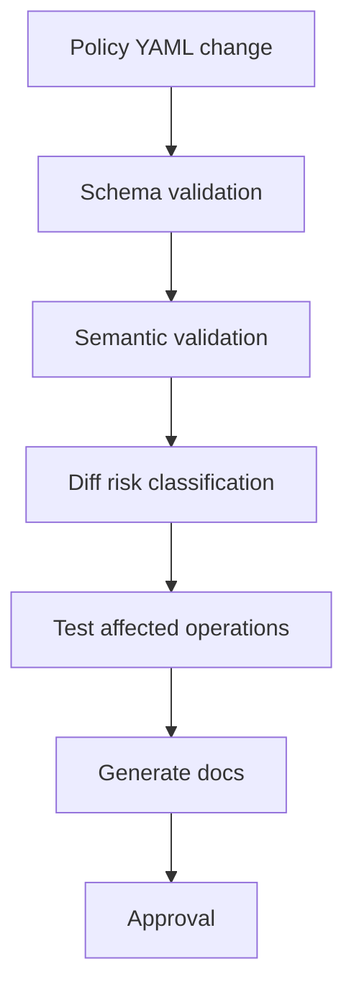

# Part 048 — Production Resilience Policy Template

At this point, we have covered many synchronous-call resilience patterns:

- timeout,
- retry,
- circuit breaker,
- bulkhead,
- rate limiting,
- load shedding,
- hedged requests,
- fallback,
- stale data,
- deadline propagation.

The real production challenge is not knowing these patterns individually.

The challenge is composing them into one coherent policy.

A mature Java service should not have resilience behavior scattered across:

- annotations,
- YAML fragments,
- default HTTP client settings,
- generated client defaults,
- service mesh config,
- retry libraries,
- random helper methods,
- unreviewed catch blocks.

It should have an explicit communication policy.

> A resilience policy is the executable contract for how a service spends time, capacity, retries, and fallback under failure.

---

## 1. Why a Unified Policy Is Necessary

When policies are scattered, teams create contradictions.

Examples:

```text
HTTP client timeout = 2s
gateway timeout = 1s
retry max attempts = 3
deadline remaining = 800ms
DB statement timeout = 10s
bulkhead wait = 500ms
```

This configuration cannot behave well.

Another example:

```text
circuit breaker opens after 50% failures
retry attempts 3x
rate limiter only limits original calls
fallback returns stale data without freshness label
```

Final success rate may look high while the system is overloaded and users receive stale data.

A unified policy forces trade-offs to be visible.

---

## 2. Policy Is Not Just Configuration

Configuration says:

```yaml
timeout: 500ms
```

Policy says:

```text
This operation may spend at most 500 ms end-to-end.
It may retry once only for transient failures.
It must use idempotency key if command retry is enabled.
It fails fast when bulkhead is full.
It may return stale cache for reads up to 5 minutes.
It must not fallback to fake success for commands.
```

Configuration is data.

Policy is meaning.

Production systems need both.

---

## 3. Policy Scope

Define policy at multiple levels:

| Scope | Example |
|---|---|
| Platform default | all outbound calls must have deadline, timeout, metrics |
| Service default | case-service clients use 500 ms max deadline |
| Dependency default | all calls to document-service have max 50 concurrent calls |
| Operation-specific | `createEscalation` requires idempotency and no stale fallback |
| Caller-specific | batch callers lower priority and lower rate |
| Environment-specific | staging lower limits than production |
| Incident override | disable hedging during overload |

Precedence:

```text
platform default
< service default
< dependency default
< operation policy
< safe incident override
```

Do not let request-level override bypass safety caps.

---

## 4. The Policy Object Model

A good policy model separates concerns.

```java
public record CommunicationPolicy(
    String dependency,
    Map<String, OperationPolicy> operations,
    DependencyDefaults defaults
) {}
```

Operation policy:

```java
public record OperationPolicy(
    String operationName,
    OperationSemantics semantics,
    DeadlinePolicy deadline,
    TimeoutPolicy timeout,
    RetryPolicy retry,
    CircuitBreakerPolicy circuitBreaker,
    BulkheadPolicy bulkhead,
    RateLimitPolicy rateLimit,
    HedgingPolicy hedging,
    FallbackPolicy fallback,
    ObservabilityPolicy observability
) {}
```

Semantics:

```java
public record OperationSemantics(
    boolean readOnly,
    boolean sideEffecting,
    boolean idempotentByNature,
    boolean idempotencyKeyRequired,
    boolean strongConsistencyRequired,
    Priority defaultPriority
) {}
```

This makes dangerous combinations detectable at startup.

---

## 5. Policy Validation Is Mandatory

Configuration that violates invariants should fail startup.

Examples:

```text
retry enabled on side-effecting command without idempotency key
hedging enabled on side-effecting command
fallback default success enabled on command
timeout longer than deadline
bulkhead wait longer than operation budget
retry max attempts impossible within deadline
stale fallback enabled without max staleness
metrics disabled for critical dependency
circuit breaker records validation errors as dependency failure
```

Startup validation:

```java
public final class CommunicationPolicyValidator {
    public void validate(OperationPolicy policy) {
        if (policy.semantics().sideEffecting()
            && policy.retry().enabled()
            && !policy.semantics().idempotencyKeyRequired()) {
            throw new InvalidPolicyException(
                policy.operationName() + " retries side-effecting command without idempotency"
            );
        }

        if (policy.semantics().sideEffecting() && policy.hedging().enabled()) {
            throw new InvalidPolicyException(
                policy.operationName() + " enables hedging for side-effecting command"
            );
        }

        if (policy.fallback().staleCacheAllowed()
            && policy.fallback().maxStaleness() == null) {
            throw new InvalidPolicyException(
                policy.operationName() + " stale fallback requires maxStaleness"
            );
        }

        if (policy.timeout().responseTimeout()
            .compareTo(policy.deadline().defaultDeadline()) > 0) {
            throw new InvalidPolicyException(
                policy.operationName() + " response timeout exceeds default deadline"
            );
        }
    }
}
```

Bad resilience config should not reach production.

---

## 6. Full YAML Template

```yaml
communication:
  serviceName: workflow-service
  environment: production

  defaults:
    deadline:
      inboundHeader: X-Request-Deadline
      defaultMs: 500
      maxMs: 1000
      minUsefulMs: 75
      reserveResponseMarginMs: 25

    observability:
      metricsEnabled: true
      tracesEnabled: true
      logsEnabled: true
      recordAttemptMetrics: true
      recordPolicyDecisions: true

  dependencies:
    case-service:
      baseUrl: https://case-service.internal
      apiVersion: v1
      owner: case-platform
      criticality: high

      defaults:
        connectionPool:
          maxConnections: 100
          maxConnectionsPerRoute: 50
          acquisitionTimeoutMs: 25
        timeout:
          connectMs: 75
          responseMs: 400
        circuitBreaker:
          slidingWindowType: COUNT_BASED
          slidingWindowSize: 100
          minimumNumberOfCalls: 50
          failureRateThreshold: 50
          slowCallRateThreshold: 50
          slowCallDurationMs: 500
          waitDurationOpenMs: 20000
          permittedHalfOpenCalls: 5
        bulkhead:
          type: semaphore
          maxConcurrentCalls: 50
          maxWaitMs: 0

      operations:
        getCase:
          method: GET
          route: /v1/cases/{caseId}
          semantics:
            readOnly: true
            sideEffecting: false
            idempotentByNature: true
            strongConsistencyRequired: true
            defaultPriority: user-facing

          deadline:
            defaultMs: 300
            maxMs: 600
            minUsefulMs: 50

          timeout:
            connectMs: 50
            responseMs: 250

          retry:
            enabled: true
            maxAttempts: 2
            baseDelayMs: 30
            maxDelayMs: 120
            jitter: full
            retryableStatuses: [429, 502, 503, 504]
            retryBudgetRatio: 0.10
            deadlineAware: true

          circuitBreaker:
            enabled: true
            recordStatuses: [502, 503, 504]
            ignoreStatuses: [400, 401, 403, 404, 409, 422]

          bulkhead:
            enabled: true
            maxConcurrentCalls: 80
            maxWaitMs: 10

          rateLimit:
            enabled: true
            limitForPeriod: 300
            limitRefreshPeriodMs: 1000
            timeoutMs: 0

          hedging:
            enabled: false
            reason: strong-consistency-required

          fallback:
            type: fail-fast
            staleCacheAllowed: false

          observability:
            operationMetric: case.get_case
            traceSpanName: GET /v1/cases/{caseId}

        createEscalation:
          method: POST
          route: /v1/case-escalations
          semantics:
            readOnly: false
            sideEffecting: true
            idempotentByNature: false
            idempotencyKeyRequired: true
            strongConsistencyRequired: true
            defaultPriority: critical-command

          deadline:
            defaultMs: 600
            maxMs: 1000
            minUsefulMs: 100

          timeout:
            connectMs: 75
            responseMs: 450

          retry:
            enabled: true
            maxAttempts: 2
            requiresIdempotencyKey: true
            sameIdempotencyKeyAcrossAttempts: true
            retryableStatuses: [429, 502, 503]
            nonRetryableStatuses: [400, 401, 403, 404, 409, 422]
            unknownOutcomeHandling: dedup-replay-required
            deadlineAware: true

          circuitBreaker:
            enabled: true
            failureRateThreshold: 40
            slowCallDurationMs: 600
            ignoreStatuses: [400, 401, 403, 404, 409, 422]

          bulkhead:
            enabled: true
            maxConcurrentCalls: 40
            maxWaitMs: 0

          rateLimit:
            enabled: true
            limitForPeriod: 100
            limitRefreshPeriodMs: 1000
            timeoutMs: 0

          hedging:
            enabled: false
            reason: side-effecting-command

          fallback:
            type: fail-fast
            allowAsyncHandoff: false
            fakeSuccessAllowed: false

          observability:
            operationMetric: case.create_escalation
            traceSpanName: POST /v1/case-escalations
            recordIdempotencyPresence: true
```

This looks long because communication policy is real engineering.

Hidden complexity is still complexity.

This just makes it visible.

---

## 7. Recommended Decorator Composition

There is no universal ordering, but a policy must define one.

A practical default for synchronous outbound HTTP calls:

```text
request context / deadline
→ rate limiter
→ bulkhead
→ circuit breaker
→ retry executor
→ per-attempt timeout
→ transport
→ error mapper
→ fallback
```

Visual:


But the policy must specify what each layer observes.

Example decisions:

- retry should not hold bulkhead permit while sleeping,
- bulkhead rejection should not count as dependency circuit breaker failure,
- timeout should count as circuit breaker failure for remote health,
- deadline exhausted before remote call should not count as dependency failure,
- fallback success must be tagged as degraded success.

---

## 8. Attempt Model

A logical call can contain multiple attempts.

```java
public record RemoteCallAttempt(
    int attemptNumber,
    boolean hedgeAttempt,
    Instant startedAt,
    Duration timeout,
    Optional<Integer> statusCode,
    Optional<String> errorCode,
    AttemptOutcome outcome
) {}
```

Logical call result:

```java
public record RemoteCallResult<T>(
    T value,
    boolean degraded,
    int attempts,
    Duration totalDuration,
    Optional<String> fallbackType
) {}
```

Metrics should distinguish:

```text
logical call success
attempt success
success after retry
success via fallback
failure due to circuit open
failure due to bulkhead full
failure due to deadline exceeded
```

A single "success" counter is insufficient.

---

## 9. Failure Taxonomy

Policy depends on failure classification.

```java
public enum FailureClass {
    CALLER_BAD_REQUEST,
    AUTHENTICATION,
    AUTHORIZATION,
    NOT_FOUND,
    DOMAIN_CONFLICT,
    PRECONDITION_FAILED,
    DOMAIN_VALIDATION,
    RATE_LIMITED,
    REMOTE_UNAVAILABLE,
    REMOTE_TIMEOUT,
    CONNECT_TIMEOUT,
    READ_TIMEOUT,
    DEADLINE_EXCEEDED,
    BULKHEAD_FULL,
    CIRCUIT_OPEN,
    LOCAL_RATE_LIMITED,
    UNKNOWN
}
```

Each pattern uses this taxonomy differently.

| Failure class | Retry | Breaker | Fallback |
|---|---:|---:|---|
| caller bad request | no | ignore | no |
| auth/authz | no | usually ignore | no |
| not found | usually no | ignore | maybe domain-specific |
| domain conflict | no | ignore | no |
| rate limited | yes with delay | maybe | maybe |
| remote unavailable | yes bounded | record | maybe |
| remote timeout | yes if safe | record | maybe |
| bulkhead full | no remote retry by default | ignore dependency breaker | fallback/degrade |
| circuit open | no remote call | n/a | fallback/degrade |
| deadline exceeded | no | not dependency failure if before call | fallback if cheap |

This table should be encoded, tested, and reviewed.

---

## 10. Policy-Aware Executor Skeleton

```java
public final class RemoteOperationExecutor {
    private final PolicyRegistry policyRegistry;
    private final Telemetry telemetry;

    public <T> T execute(
        String dependency,
        String operation,
        RequestContext context,
        Supplier<T> transportCall
    ) {
        OperationPolicy policy = policyRegistry.get(dependency, operation);
        policy.validate();

        if (!context.deadline().canFit(policy.deadline().minUseful())) {
            throw new DeadlineTooShortException();
        }

        return telemetry.observeLogicalCall(policy, context, () ->
            executeWithPolicy(policy, context, transportCall)
        );
    }

    private <T> T executeWithPolicy(
        OperationPolicy policy,
        RequestContext context,
        Supplier<T> transportCall
    ) {
        Supplier<T> supplier = () -> executeAttempts(policy, context, transportCall);

        supplier = applyCircuitBreaker(policy, supplier);
        supplier = applyBulkhead(policy, supplier);
        supplier = applyRateLimiter(policy, supplier);

        try {
            return supplier.get();
        } catch (Throwable failure) {
            return applyFallback(policy, context, failure);
        }
    }
}
```

This is simplified.

Production code needs careful composition, cancellation, async support, and metrics.

The important point is architectural:

> resilience belongs in the owned client boundary, not scattered in business code.

---

## 11. Retry Loop with Deadline

```java
private <T> T executeAttempts(
    OperationPolicy policy,
    RequestContext context,
    Supplier<T> call
) {
    Throwable lastFailure = null;

    for (int attempt = 1; attempt <= policy.retry().maxAttempts(); attempt++) {
        Duration attemptTimeout = context.deadline().timeoutWithMargin(
            policy.timeout().responseTimeout(),
            policy.deadline().reserveResponseMargin()
        );

        if (attemptTimeout.isZero()) {
            throw new DeadlineExceededException();
        }

        try {
            return executeOneAttemptWithTimeout(call, attemptTimeout);
        } catch (Throwable failure) {
            lastFailure = failure;

            RetryDecision decision = retryDecider.decide(
                policy,
                context,
                failure,
                attempt
            );

            if (!decision.shouldRetry()) {
                throw failure;
            }

            sleepWithoutHoldingBulkheadPermit(decision.delay());
        }
    }

    throw new RetryExhaustedException(lastFailure);
}
```

Rules:

- do not retry when deadline cannot fit,
- do not retry unsafe commands without idempotency,
- use same idempotency key across attempts,
- use jittered backoff,
- enforce retry budget,
- emit retry decision metrics.

---

## 12. Policy Registry

Policies must be discoverable.

```java
public interface PolicyRegistry {
    OperationPolicy get(String dependency, String operation);
}
```

Implementation:

```java
public final class ValidatingPolicyRegistry implements PolicyRegistry {
    private final Map<OperationKey, OperationPolicy> policies;
    private final CommunicationPolicyValidator validator;

    public ValidatingPolicyRegistry(
        Map<OperationKey, OperationPolicy> policies,
        CommunicationPolicyValidator validator
    ) {
        this.policies = Map.copyOf(policies);
        this.validator = validator;

        this.policies.values().forEach(validator::validate);
    }

    @Override
    public OperationPolicy get(String dependency, String operation) {
        OperationPolicy policy = policies.get(new OperationKey(dependency, operation));
        if (policy == null) {
            throw new MissingCommunicationPolicyException(dependency, operation);
        }
        return policy;
    }
}
```

Missing policy should fail startup or fail fast in development.

Do not silently use dangerous defaults for unknown dependencies.

---

## 13. Safe Defaults

Platform defaults should be safe but not overly broad.

Example safe defaults:

```yaml
platformDefaults:
  allOutboundCalls:
    timeoutRequired: true
    deadlinePropagationRequired: true
    observabilityRequired: true
    connectionPoolRequired: true
    errorMappingRequired: true

  unsafeCommands:
    retryDisabledUnlessIdempotencyKeyRequired: true
    hedgingForbidden: true
    fakeSuccessFallbackForbidden: true

  allOperations:
    maxDeadlineMs: 2000
    maxRetryAttempts: 2
    maxBulkheadWaitMs: 50
    metricsCardinalityGuard: true
```

Defaults should prevent catastrophic mistakes.

Operation policy can be stricter.

Exceptions require review.

---

## 14. Dangerous Combination Rules

Policy validator should reject:

| Combination | Why dangerous |
|---|---|
| retry command without idempotency | duplicate side effects |
| hedge command | duplicate side effects |
| fallback fake success for command | business corruption |
| stale cache without max staleness | unbounded stale truth |
| long rate limiter wait in sync path | hidden queueing |
| bulkhead wait longer than deadline | wasted wait |
| timeout > deadline | impossible budget |
| retry attempts impossible within deadline | retry only adds load |
| breaker counts 400/422 as remote failure | caller bugs open breaker |
| generated client direct use | policy bypass |
| no metrics for critical dependency | invisible failure |
| idempotency replay not observed | duplicate behavior hidden |
| open circuit with no fallback/fail-fast mapping | generic errors |

These are not style rules.

They are production safety rules.

---

## 15. Policy as Code in CI

Add CI checks:



Validate:

- YAML schema,
- required fields,
- dangerous combinations,
- operation existence in OpenAPI,
- Resilience4j instance names,
- metric names,
- owner metadata,
- runbook links,
- change risk.

Policy changes should be reviewed like code.

A bad retry config can take down production as effectively as a bad code deploy.

---

## 16. Policy Diff Classification

Not all policy changes have equal risk.

| Change | Risk |
|---|---|
| reduce timeout | can increase false failures |
| increase timeout | can increase resource hold time |
| enable retry | can amplify load/duplicates |
| increase max attempts | high risk |
| enable hedging | high risk |
| lower circuit threshold | may open too often |
| raise circuit threshold | may react too late |
| increase bulkhead | more downstream load |
| decrease bulkhead | more local rejections |
| enable stale fallback | semantic risk |
| increase max staleness | business correctness risk |
| change fallback from fail-fast to default | high semantic risk |

CI should require explicit approval for high-risk changes.

---

## 17. Rollout Strategy

Resilience policy changes need rollout discipline.

Recommended:

1. deploy policy in shadow/metrics-only mode if possible,
2. canary one service instance,
3. canary one caller or tenant,
4. observe attempts, timeouts, rejections, fallback rate,
5. expand gradually,
6. keep rollback config ready,
7. document incident impact.

Examples:

- new circuit breaker threshold: start metrics-only,
- hedging: enable for 1% traffic,
- retry: enable for one operation and low max attempts,
- fallback stale cache: enable for non-critical consumers first,
- load shedding: test under load before production enforcement.

Do not flip large resilience behavior globally.

---

## 18. Kill Switches

Some patterns need runtime kill switches.

High-risk kill switches:

```yaml
runtimeOverrides:
  hedging.enabled: false
  retry.enabled: false
  fallback.staleCache.enabled: false
  loadShedding.forceLevel: DEGRADED
  circuitBreaker.forceOpen:
    - external-provider.submitDocument
  circuitBreaker.disable:
    - noncritical-recommendation.getSuggestions
```

Kill switches must be:

- access controlled,
- audited,
- visible in dashboards,
- time-bounded,
- documented in incident notes.

A kill switch without observability is just another hidden failure mode.

---

## 19. Observability Contract

Every resilience policy must define telemetry.

Minimum logical-call metrics:

```text
remote.logical.calls.total{dependency,operation,outcome}
remote.logical.duration{dependency,operation,outcome}
remote.attempts.total{dependency,operation,attempt_kind,outcome}
remote.timeouts.total{dependency,operation,type}
remote.retries.total{dependency,operation,decision}
remote.circuit.state{dependency,operation}
remote.bulkhead.rejections.total{dependency,operation}
remote.rate_limit.denied.total{dependency,operation}
remote.fallback.used.total{dependency,operation,type}
remote.deadline.remaining_ms{dependency,operation}
```

Outcomes:

- `success_fresh`,
- `success_after_retry`,
- `success_stale_fallback`,
- `success_partial`,
- `failed_remote`,
- `failed_timeout`,
- `failed_deadline`,
- `failed_circuit_open`,
- `failed_bulkhead_full`,
- `failed_rate_limited`,
- `failed_validation`,
- `failed_policy_rejected`.

Avoid high-cardinality labels.

Use operation names and route templates.

---

## 20. Dashboard Template

For each dependency operation, show:

1. RPS,
2. success/failure/degraded rate,
3. p50/p95/p99 latency,
4. timeout rate by type,
5. retry attempts and success-after-retry,
6. circuit breaker state and not-permitted calls,
7. bulkhead active/rejected,
8. rate limit granted/denied,
9. fallback usage and stale age,
10. deadline remaining at call start,
11. top callers,
12. recent deploy/config changes.

Dashboard should answer:

```text
Is the dependency healthy?
Is the caller protected?
Are users seeing fresh success, degraded success, or failure?
Is resilience policy helping or hurting?
```

---

## 21. Alert Template

Alert categories:

| Alert | Meaning |
|---|---|
| critical dependency error rate high | user/business impact |
| circuit open sustained | dependency unavailable or threshold too low |
| bulkhead full sustained | capacity saturation |
| timeout p99 rising | tail degradation |
| retry rate above budget | retry storm risk |
| fallback rate above baseline | degraded mode active |
| stale age near hard TTL | freshness risk |
| deadline too short spike | upstream budget mismatch |
| hedging extra load high | speculative load risk |
| rate limit denies critical caller | quota/capacity mismatch |
| policy validation failure | unsafe config |

Alerts should include:

- dependency,
- operation,
- caller,
- current policy version,
- recent config changes,
- runbook link.

---

## 22. Runbook Template

```md
# Runbook: case-service.createEscalation communication failure

## Symptoms
- timeout rate above 5%
- circuit breaker open
- bulkhead rejection > 10%
- fallback not allowed
- upstream workflows failing

## First checks
1. Check dependency health dashboard.
2. Check recent deploys for caller and provider.
3. Check policy version and recent overrides.
4. Check timeout vs deadline remaining.
5. Check retry volume and retry budget.
6. Check idempotency-key presence.
7. Check outbox/reconciliation backlog.

## Safe mitigations
- reduce retry attempts if retry storm
- force circuit open if dependency is collapsing
- shed batch traffic
- increase bulkhead only if provider has capacity
- route to async durable intent only if approved
- do not enable fake success fallback

## Unsafe mitigations
- disabling idempotency requirement
- retrying commands with new keys
- increasing timeout above gateway deadline
- returning success without provider confirmation
```

Runbooks are part of the policy.

Do not make operators infer semantics during incidents.

---

## 23. OpenAPI Linkage

Operation policy should link to OpenAPI operation IDs.

Example:

```yaml
operations:
  createEscalation:
    openapiOperationId: createCaseEscalation
    method: POST
    route: /v1/case-escalations
```

CI should verify:

- operation exists in OpenAPI,
- method/route match,
- idempotency header required if policy says required,
- documented error statuses match retry/error policy,
- fallback/degradation documented if exposed to consumers.

Contract and runtime policy must not drift.

---

## 24. Generated Client Wrapper Linkage

Generated clients must not bypass policy.

Architecture:


Policy executor should be outside generated code.

Generated code should not decide:

- retry,
- timeout,
- fallback,
- idempotency,
- exception taxonomy,
- metric names,
- deadline propagation.

The owned adapter decides.

---

## 25. Service Mesh and Gateway Alignment

Application policy is not the only policy.

Also check:

- gateway timeout,
- ingress timeout,
- service mesh retries,
- service mesh circuit breakers,
- proxy connection pool limits,
- local rate limits,
- global rate limits,
- load balancer outlier detection,
- Kubernetes readiness behavior.

Misalignment example:

```text
app retry maxAttempts=2
mesh retry maxAttempts=3
gateway retry maxAttempts=2
```

Worst-case:

```text
2 × 3 × 2 = 12 attempts
```

Avoid hidden amplification.

Document which layer owns each behavior.

---

## 26. Ownership Matrix

| Policy area | Owner |
|---|---|
| operation semantics | service/domain owner |
| timeout/deadline | caller owner + platform |
| retry eligibility | caller owner + provider contract |
| idempotency | provider owner |
| circuit breaker threshold | caller owner + platform |
| bulkhead limit | caller owner |
| rate limit quota | provider owner/platform |
| fallback semantics | domain/product owner |
| stale data max age | domain/product owner |
| observability | platform + service owner |
| mesh/gateway config | platform |
| runbook | service owner |

Resilience policy crosses teams.

Make ownership explicit.

---

## 27. Environment Differences

Production and staging differ.

But staging should still validate policy shape.

Example:

```yaml
environments:
  production:
    case-service.getCase.bulkhead.maxConcurrentCalls: 80
  staging:
    case-service.getCase.bulkhead.maxConcurrentCalls: 10
```

Do not disable all resilience in staging.

You need to catch:

- missing deadlines,
- invalid fallback,
- bad retry classifier,
- missing metrics,
- OpenAPI mismatch,
- generated client bypass.

Use smaller numbers, not absent policy.

---

## 28. Testing Strategy

Policy testing layers:

| Test | Purpose |
|---|---|
| schema validation | YAML shape |
| semantic validation | dangerous combinations |
| unit tests | classifiers/deciders |
| stub tests | HTTP behavior |
| integration tests | actual client adapter |
| failure injection | timeout/retry/breaker/fallback |
| load tests | capacity and overload |
| canary | production safety |
| chaos game day | operational readiness |

Example semantic test:

```java
@Test
void rejectsRetryForSideEffectingCommandWithoutIdempotency() {
    OperationPolicy policy = policyBuilder()
        .sideEffecting(true)
        .idempotencyKeyRequired(false)
        .retryEnabled(true)
        .build();

    assertThatThrownBy(() -> validator.validate(policy))
        .isInstanceOf(InvalidPolicyException.class);
}
```

Example HTTP behavior test:

```java
@Test
void createEscalationRetriesWithSameIdempotencyKey() {
    stub.transientFailureThenSuccess();

    client.createEscalation(command);

    stub.verifyPostCount(2);
    stub.verifySameHeaderAcrossAttempts("Idempotency-Key");
}
```

---

## 29. Failure Injection Matrix

Test each pattern deliberately.

| Failure | Expected policy behavior |
|---|---|
| connect timeout | retry if safe, breaker records |
| read timeout on command | retry only with idempotency |
| 400 | no retry, breaker ignores |
| 409 domain conflict | no retry, breaker ignores |
| 429 | respect retry-after if deadline fits |
| 503 | retry bounded, breaker records |
| bulkhead full | fail/degrade, breaker ignores |
| circuit open | no remote call, fallback/fail-fast |
| deadline too short | reject before work |
| stale cache exists | stale response if allowed |
| stale cache too old | fail fast |
| dependency slow p99 | slow-call breaker/load shedding |
| retry budget exhausted | no retry |
| hedge budget exhausted | no hedge |

If this table is not tested, the policy is mostly aspirational.

---

## 30. Policy Versioning

Policy should have a version.

```yaml
communication:
  policyVersion: 2026-07-05.1
```

Emit version in metrics/logs:

```text
communication.policy.version=2026-07-05.1
```

Why?

During incident:

```text
Did behavior change because code changed or policy changed?
```

Policy version makes that answer observable.

---

## 31. Policy Documentation Generation

Because policy is structured, generate docs.

Generated doc per dependency:

```md
# Dependency: case-service

Owner: case-platform
Criticality: high

## Operation: getCase
- Deadline: 300 ms default, 600 ms max
- Retry: enabled, max 2 attempts
- Circuit breaker: enabled
- Bulkhead: 80 concurrent
- Fallback: fail-fast
- Hedging: disabled due to strong consistency
- Error retryability: 429/502/503/504
- Dashboard: ...
- Runbook: ...
```

This keeps docs aligned with runtime.

Do not maintain policy docs manually if you can generate them.

---

## 32. Example Review Questions

When reviewing a new operation:

- Is it query or command?
- Is it side-effecting?
- Can it be retried safely?
- Does provider support idempotency?
- What is the caller deadline?
- What is dependency p99?
- What is max useful timeout?
- What happens on unknown outcome?
- Is stale fallback safe?
- Is partial response safe?
- Is circuit breaker threshold appropriate?
- What is bulkhead limit based on?
- Does rate limit exist?
- Can this operation be hedged?
- What metrics show degradation?
- What is the runbook?

These questions are more valuable than asking "did you add @Retry?"

---

## 33. Pattern Selection Cheat Sheet

| Situation | Prefer |
|---|---|
| transient network failure | bounded retry with jitter |
| dependency sustained failure | circuit breaker |
| dependency slow tail | timeout, maybe hedging for safe reads |
| dependency consumes too many resources | bulkhead |
| caller exceeds quota | rate limit |
| system overloaded | load shedding |
| query can tolerate old data | stale cache fallback |
| optional enrichment fails | partial response/omit |
| command cannot complete now | fail fast or durable intent |
| unknown command outcome | idempotency + dedup replay |
| fan-out high | concurrency cap + deadline |
| gateway/app timeout mismatch | deadline propagation |
| hidden generated client behavior | owned wrapper |

Use this as a design starting point.

Not as a substitute for thinking.

---

## 34. The Final Phase 5 Template

For every synchronous dependency operation, create this record:

```yaml
operation:
  identity:
    dependency:
    operation:
    method:
    route:
    owner:
    criticality:

  semantics:
    readOnly:
    sideEffecting:
    idempotencyKeyRequired:
    consistency:
    priority:

  deadline:
    defaultMs:
    maxMs:
    minUsefulMs:
    propagate:

  timeout:
    connectMs:
    poolAcquireMs:
    responseMs:
    totalAttemptMs:

  retry:
    enabled:
    maxAttempts:
    retryableFailures:
    nonRetryableFailures:
    backoff:
    jitter:
    budget:
    idempotencyRequired:

  circuitBreaker:
    enabled:
    window:
    minimumCalls:
    failureRate:
    slowCallRate:
    halfOpen:

  bulkhead:
    enabled:
    type:
    maxConcurrent:
    maxWait:
    queueCapacity:

  rateLimit:
    enabled:
    dimensions:
    rate:
    burst:
    wait:

  hedging:
    enabled:
    delay:
    budget:
    suppressionRules:

  fallback:
    type:
    maxStaleness:
    partialAllowed:
    fakeSuccessAllowed:
    asyncHandoff:

  observability:
    metrics:
    traces:
    logs:
    dashboard:
    alerts:
    runbook:
```

This is the reusable policy artifact.

---

## 35. Anti-Patterns

### 35.1 Annotation soup

`@Retry`, `@CircuitBreaker`, `@TimeLimiter`, and `@RateLimiter` scattered with no semantic policy.

### 35.2 Policy invisible to business owners

Fallback/staleness decisions are business decisions.

### 35.3 Mesh retries plus app retries

Hidden attempt multiplication.

### 35.4 Timeout constants copied everywhere

No deadline propagation.

### 35.5 All 5xx retryable

Crude and dangerous.

### 35.6 Circuit breaker counts caller bugs

Bad clients open provider breaker.

### 35.7 Bulkhead without fallback

Rejections become generic 500.

### 35.8 Fallback success counted as normal success

Degradation invisible.

### 35.9 No policy validation

Dangerous combinations reach production.

### 35.10 No runbook

Operators cannot safely change behavior during incidents.

---

## 36. Phase 5 Summary

The resilience patterns are not independent tricks.

They form one control system:

```text
deadline decides whether work is still useful
timeout bounds each wait
retry handles transient failure
circuit breaker stops repeated failure
bulkhead isolates resource use
rate limit controls demand
load shedding preserves survival
hedging fights tail latency carefully
fallback preserves semantic usefulness
observability proves what happened
```

A top-tier Java microservice team does not ask:

```text
Which library annotation should I add?
```

It asks:

```text
What is the communication policy for this operation under success, slowness, overload, partial failure, and unknown outcome?
```

That is the level of thinking required for production-grade synchronous microservice communication.

Part 049 starts the gRPC phase.

---

## References

- Resilience4j Getting Started: https://resilience4j.readme.io/docs/getting-started
- Resilience4j CircuitBreaker: https://resilience4j.readme.io/docs/circuitbreaker
- Resilience4j Retry: https://resilience4j.readme.io/docs/retry
- Resilience4j Bulkhead: https://resilience4j.readme.io/docs/bulkhead
- Resilience4j RateLimiter: https://resilience4j.readme.io/docs/ratelimiter
- Resilience4j TimeLimiter: https://resilience4j.readme.io/docs/timeout
- AWS Builders Library — Timeouts, retries, and backoff with jitter: https://aws.amazon.com/builders-library/timeouts-retries-and-backoff-with-jitter/
- Google SRE Book — Handling Overload: https://sre.google/sre-book/handling-overload/
- Google SRE Book — Addressing Cascading Failures: https://sre.google/sre-book/addressing-cascading-failures/
- gRPC Deadlines: https://grpc.io/docs/guides/deadlines/
