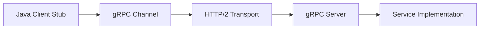

# Part 049 — gRPC Communication Mental Model

gRPC is a high-performance RPC framework that uses **Protocol Buffers** as its primary interface definition language and commonly runs over **HTTP/2**.

For Java microservices, gRPC is attractive when you need:

- strongly typed internal service contracts,
- efficient binary serialization,
- generated clients and servers,
- low-latency RPC,
- streaming,
- deadline and cancellation support,
- metadata/interceptors,
- well-defined status model.

But gRPC is not just "faster REST."

It changes the communication style from resource-oriented HTTP APIs into operation-oriented RPC contracts.

The core question is not:

```text
Is gRPC faster?
```

The better question is:

```text
Does this boundary benefit from strongly typed RPC semantics enough to justify the operational and compatibility discipline?
```

---

## 1. gRPC Mental Model



A `.proto` file defines:

- package,
- service,
- RPC methods,
- request messages,
- response messages,
- enums,
- field numbers,
- streaming shape.

The build generates Java stubs and message classes.

The application implements service methods and clients call strongly typed methods.

---

## 2. When gRPC Fits

Use gRPC for:

| Situation | Why |
|---|---|
| internal service-to-service RPC | generated clients and strict contracts |
| high request volume | efficient binary encoding |
| low latency requirements | less JSON overhead |
| streaming required | first-class streaming model |
| polyglot internal platform | shared `.proto` contract |
| strongly typed APIs | compile-time client/server integration |

Avoid gRPC when:

- public browser/native web clients need simple HTTP/JSON,
- API needs high human debuggability with curl,
- gateway/proxy support is not ready,
- team lacks contract evolution discipline,
- operation is better as async event/workflow,
- consumers cannot handle generated client lifecycle.

---

## 3. gRPC vs HTTP/JSON

| Concern | HTTP/JSON | gRPC |
|---|---|---|
| public API compatibility | strong | weaker |
| browser support | natural | needs grpc-web/proxy |
| debugging | curl-friendly | needs grpcurl/tools |
| payload efficiency | moderate | strong |
| typed contracts | OpenAPI possible | native through proto |
| streaming | possible but varied | first-class |
| status model | HTTP status | gRPC status |
| schema evolution | discipline needed | field-number discipline needed |
| gateway support | broad | must verify HTTP/2/gRPC support |

Choose based on boundary, not trend.

---

## 4. Unary RPC

Unary RPC is request-response.

```proto
service CaseQueryService {
  rpc GetCase(GetCaseRequest) returns (GetCaseResponse);
}
```

Use unary RPC for:

- query by ID,
- command that returns immediate result,
- internal validation,
- enrichment,
- low-latency computation.

Still apply:

- deadline,
- cancellation,
- retry policy,
- idempotency for commands,
- status mapping,
- observability.

---

## 5. Streaming RPC

gRPC supports:

- server streaming,
- client streaming,
- bidirectional streaming.

Examples:

```proto
rpc WatchCaseUpdates(WatchCaseUpdatesRequest) returns (stream CaseUpdate);
rpc UploadDocuments(stream DocumentChunk) returns (UploadSummary);
rpc Chat(stream ChatMessage) returns (stream ChatMessage);
```

Streaming requires special care:

- flow control,
- backpressure,
- cancellation,
- max stream lifetime,
- reconnection,
- partial failure,
- ordering,
- memory use,
- gateway/mesh support.

Do not use streaming just to look advanced.

Use it when the communication shape is genuinely streaming.

---

## 6. Deadline First

Every gRPC call should have a deadline.

Bad:

```java
stub.getCase(request);
```

Better:

```java
stub.withDeadlineAfter(300, TimeUnit.MILLISECONDS)
    .getCase(request);
```

A deadline tells the server and intermediaries when the caller no longer cares.

Without deadlines, calls can hang and consume resources.

Deadline is not optional in production.

---

## 7. Cancellation

If the client deadline expires or cancels, the server should stop unnecessary work.

Server implementation should:

- check cancellation context,
- propagate cancellation to downstream calls,
- avoid long DB work after cancellation,
- stop streaming,
- release resources.

Timeout without cancellation is incomplete.

---

## 8. Status Model

gRPC status codes represent RPC outcome.

Common mappings:

| Situation | Status |
|---|---|
| invalid request | INVALID_ARGUMENT |
| unauthenticated | UNAUTHENTICATED |
| forbidden | PERMISSION_DENIED |
| missing entity | NOT_FOUND |
| version conflict | ABORTED or FAILED_PRECONDITION |
| deadline exceeded | DEADLINE_EXCEEDED |
| dependency unavailable | UNAVAILABLE |
| internal bug | INTERNAL |

Do not map everything to `UNKNOWN`.

Status code is part of contract.

---

## 9. Metadata

gRPC metadata is key-value information sent with calls.

Use metadata for:

- correlation ID,
- trace context,
- auth token,
- tenant context if trusted,
- client ID,
- request ID.

Do not put large payloads or secrets casually in metadata.

Metadata is contract and security surface.

---

## 10. Interceptors

Interceptors are similar to filters.

Use them for:

- logging,
- metrics,
- tracing,
- auth,
- metadata propagation,
- deadline validation,
- error mapping,
- request validation,
- rate limiting.

Avoid putting domain business logic in interceptors.

Interceptors are cross-cutting infrastructure.

---

## 11. Channel Mental Model

A gRPC channel manages connections to a target.

Important:

- channels are expensive and should be reused,
- stubs are cheap,
- target resolution matters,
- load balancing policy matters,
- HTTP/2 connections are long-lived,
- keepalive needs tuning,
- shutdown gracefully.

Do not create a new channel per request.

---

## 12. Load Balancing

gRPC load balancing is different from simple HTTP/1.1.

HTTP/2 multiplexing may concentrate many calls over few connections.

Understand:

- DNS target resolution,
- `pick_first`,
- `round_robin`,
- service mesh/xDS,
- headless services,
- backend distribution.

Monitor backend request distribution.

---

## 13. Security

gRPC security may include:

- TLS,
- mTLS,
- call credentials,
- JWT/OAuth metadata,
- service mesh identity,
- authorization interceptors.

Transport authentication is not domain authorization.

Server still needs to check whether caller/user can perform the operation.

---

## 14. Observability

Required signals:

```text
grpc.client.calls{method,status}
grpc.client.duration{method,status}
grpc.server.calls{method,status}
grpc.server.duration{method,status}
grpc.deadline_exceeded.total{method}
grpc.cancelled.total{method}
grpc.metadata_missing.total{key}
```

Trace:

- method name,
- deadline,
- status,
- peer identity,
- correlation ID.

Avoid logging full protobuf payloads if sensitive.

---

## 15. Production Checklist

Before using gRPC:

- `.proto` versioned,
- generated code integrated,
- deadlines required,
- status mapping documented,
- metadata contract documented,
- client channel reused,
- load balancing tested,
- TLS/mTLS configured,
- interceptors for tracing/metrics,
- cancellation propagated,
- gateway/mesh supports gRPC,
- contract compatibility tests,
- streaming tested if used,
- runbook exists.

---

## 16. The Real Lesson

gRPC is excellent for internal strongly typed RPC.

But production gRPC requires discipline:

```text
proto compatibility
+ deadlines
+ cancellation
+ status mapping
+ metadata governance
+ channel management
+ load balancing
+ security
+ observability
```

If you use gRPC as "faster JSON" without these, you get fast ambiguity.

---

## References

- gRPC Java Documentation: https://grpc.io/docs/languages/java/
- gRPC Core Concepts: https://grpc.io/docs/what-is-grpc/core-concepts/
- Protocol Buffers Language Guide: https://protobuf.dev/programming-guides/proto3/
- gRPC Status Codes: https://grpc.github.io/grpc/core/md_doc_statuscodes.html
