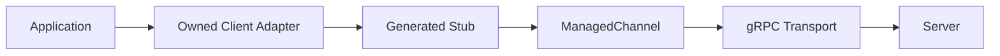

# Part 052 — Java gRPC Client Implementation

A gRPC client is not just a generated stub.

The generated stub is only the typed transport handle.

A production Java gRPC client must own:

- channel lifecycle,
- deadline policy,
- metadata propagation,
- authentication,
- error mapping,
- retry and hedging decisions,
- circuit breaker/bulkhead/rate limit composition,
- load balancing,
- TLS,
- observability,
- graceful shutdown,
- testing.

The same principle from HTTP clients still applies:

> Generated code is the mechanical layer. The owned client adapter is the semantic boundary.

---

## 1. The Generated Client Mental Model

For a service:

```proto
service CaseService {
  rpc GetCase(GetCaseRequest) returns (GetCaseResponse);
  rpc CreateEscalation(CreateEscalationRequest) returns (CreateEscalationResponse);
}
```

gRPC Java generates client stubs.

Common stub types:

| Stub | Style | Use |
|---|---|---|
| `CaseServiceStub` | asynchronous callback | streaming, async flows |
| `CaseServiceBlockingStub` | blocking | simple synchronous service code |
| `CaseServiceFutureStub` | ListenableFuture style | future-based integration |

A stub wraps a `Channel`.

The channel represents the connection abstraction to the server.



Do not inject generated stubs directly into business services.

Wrap them.

---

## 2. Minimal Client

```java
ManagedChannel channel = ManagedChannelBuilder
    .forAddress("case-service.internal", 9090)
    .usePlaintext()
    .build();

CaseServiceGrpc.CaseServiceBlockingStub stub =
    CaseServiceGrpc.newBlockingStub(channel);

GetCaseResponse response = stub.getCase(
    GetCaseRequest.newBuilder()
        .setCaseId("CASE-100")
        .build()
);

channel.shutdown();
```

This works for a demo.

It is not enough for production.

Production needs:

- TLS/mTLS,
- deadline on every call,
- channel reuse,
- graceful shutdown,
- metadata,
- interceptors,
- error mapping,
- resilience policy,
- metrics and traces,
- name resolution/load balancing,
- config validation.

---

## 3. Channel Lifecycle

A `ManagedChannel` is expensive enough that it should usually be reused.

Do not create a new channel per request.

Bad:

```java
public GetCaseResponse getCase(String caseId) {
    ManagedChannel channel = ManagedChannelBuilder.forAddress(host, port).build();
    try {
        return CaseServiceGrpc.newBlockingStub(channel).getCase(request(caseId));
    } finally {
        channel.shutdownNow();
    }
}
```

Good:

```java
public final class CaseGrpcClient implements AutoCloseable {
    private final ManagedChannel channel;
    private final CaseServiceGrpc.CaseServiceBlockingStub blockingStub;

    public CaseGrpcClient(ManagedChannel channel) {
        this.channel = channel;
        this.blockingStub = CaseServiceGrpc.newBlockingStub(channel);
    }

    public CaseView getCase(CaseId caseId) {
        GetCaseResponse response = blockingStub.getCase(
            GetCaseRequest.newBuilder()
                .setCaseId(caseId.value())
                .build()
        );
        return mapper.toDomain(response);
    }

    @Override
    public void close() throws InterruptedException {
        channel.shutdown();
        if (!channel.awaitTermination(10, TimeUnit.SECONDS)) {
            channel.shutdownNow();
        }
    }
}
```

Channel lifecycle belongs to infrastructure configuration.

---

## 4. ManagedChannelBuilder

Conceptual production channel:

```java
ManagedChannel channel = ManagedChannelBuilder
    .forTarget("dns:///case-service.internal:9090")
    .defaultLoadBalancingPolicy("round_robin")
    .keepAliveTime(30, TimeUnit.SECONDS)
    .keepAliveTimeout(5, TimeUnit.SECONDS)
    .idleTimeout(5, TimeUnit.MINUTES)
    .maxInboundMessageSize(4 * 1024 * 1024)
    .build();
```

Actual options depend on the channel builder implementation, such as Netty.

Important decisions:

- target string,
- name resolver,
- load balancing policy,
- TLS,
- keepalive,
- idle timeout,
- message size,
- executor,
- interceptors,
- retry/service config if used.

Do not treat channel builder defaults as policy.

---

## 5. Owned Client Port

Business code should depend on a domain-shaped port.

```java
public interface CaseClient {
    CaseSnapshot getCase(CaseId caseId);

    EscalationId createEscalation(CreateEscalationCommand command);
}
```

gRPC adapter:

```java
public final class GrpcCaseClient implements CaseClient {
    private final CaseServiceGrpc.CaseServiceBlockingStub stub;
    private final CaseGrpcClientMapper mapper;
    private final GrpcErrorMapper errorMapper;
    private final RequestContextProvider contextProvider;

    @Override
    public CaseSnapshot getCase(CaseId caseId) {
        RequestContext context = contextProvider.current();

        try {
            GetCaseResponse response = stub
                .withDeadlineAfter(context.deadline().remainingMillis(), TimeUnit.MILLISECONDS)
                .getCase(mapper.toGetCaseRequest(caseId));

            return mapper.toCaseSnapshot(response);
        } catch (StatusRuntimeException ex) {
            throw errorMapper.toDomainException(ex);
        }
    }

    @Override
    public EscalationId createEscalation(CreateEscalationCommand command) {
        // similar, but includes idempotency metadata or field depending contract
        throw new UnsupportedOperationException("example");
    }
}
```

The application layer never sees `StatusRuntimeException` or generated Protobuf classes.

---

## 6. Deadlines on Every Call

Every client call must have a deadline.

```java
CaseServiceGrpc.CaseServiceBlockingStub deadlineStub =
    stub.withDeadlineAfter(300, TimeUnit.MILLISECONDS);

GetCaseResponse response = deadlineStub.getCase(request);
```

Better: derive from request context.

```java
Duration callBudget = requestContext.deadline()
    .timeoutWithMargin(Duration.ofMillis(300), Duration.ofMillis(25));

GetCaseResponse response = stub
    .withDeadlineAfter(callBudget.toMillis(), TimeUnit.MILLISECONDS)
    .getCase(request);
```

Rules:

- never call without deadline,
- never set deadline beyond caller remaining budget,
- reserve response margin,
- make retry/hedging deadline-aware,
- do not use one global huge deadline.

---

## 7. Metadata Propagation

Use metadata for cross-cutting context.

Client interceptor:

```java
public final class GrpcClientMetadataInterceptor implements ClientInterceptor {
    private static final Metadata.Key<String> CORRELATION_ID =
        Metadata.Key.of("x-correlation-id", Metadata.ASCII_STRING_MARSHALLER);

    private final RequestContextProvider contextProvider;

    @Override
    public <ReqT, RespT> ClientCall<ReqT, RespT> interceptCall(
        MethodDescriptor<ReqT, RespT> method,
        CallOptions callOptions,
        Channel next
    ) {
        return new ForwardingClientCall.SimpleForwardingClientCall<>(
            next.newCall(method, callOptions)
        ) {
            @Override
            public void start(Listener<RespT> responseListener, Metadata headers) {
                RequestContext context = contextProvider.current();
                headers.put(CORRELATION_ID, context.correlationId());
                super.start(responseListener, headers);
            }
        };
    }
}
```

Attach interceptor:

```java
Channel intercepted = ClientInterceptors.intercept(
    channel,
    new GrpcClientMetadataInterceptor(contextProvider)
);

CaseServiceGrpc.CaseServiceBlockingStub stub =
    CaseServiceGrpc.newBlockingStub(intercepted);
```

Metadata should be safe, small, and stable.

---

## 8. Authentication

Options:

- TLS/mTLS at transport layer,
- bearer token in metadata,
- call credentials,
- service mesh identity,
- custom credentials.

Simple metadata token pattern:

```java
Metadata.Key<String> AUTHORIZATION =
    Metadata.Key.of("authorization", Metadata.ASCII_STRING_MARSHALLER);

headers.put(AUTHORIZATION, "Bearer " + tokenProvider.currentToken());
```

Do not log tokens.

For production, centralize credential injection in an interceptor or `CallCredentials`.

Do not let each call site manually attach auth metadata.

---

## 9. Stub Immutability

gRPC stubs are generally immutable-style.

Calling:

```java
stub.withDeadlineAfter(300, TimeUnit.MILLISECONDS)
```

returns a new stub with modified call options.

It does not mutate the original.

This is good:

```java
CaseServiceBlockingStub requestStub = baseStub
    .withDeadlineAfter(300, TimeUnit.MILLISECONDS);

requestStub.getCase(request);
```

Avoid storing per-request stub state globally.

Base stubs can be reused.

Per-call options should be derived per call.

---

## 10. Error Mapping

Generated stubs throw `StatusRuntimeException` for failed RPCs.

Map them.

```java
public final class GrpcClientErrorMapper {
    public RuntimeException toDomainException(StatusRuntimeException ex) {
        Status.Code code = ex.getStatus().getCode();

        return switch (code) {
            case NOT_FOUND ->
                new RemoteCaseNotFoundException(ex.getStatus().getDescription(), ex);
            case INVALID_ARGUMENT ->
                new RemoteInvalidRequestException(ex.getStatus().getDescription(), ex);
            case FAILED_PRECONDITION ->
                new RemoteDomainValidationException(ex.getStatus().getDescription(), ex);
            case RESOURCE_EXHAUSTED ->
                new RemoteRateLimitedException(ex.getStatus().getDescription(), ex);
            case DEADLINE_EXCEEDED ->
                new RemoteTimeoutException("gRPC deadline exceeded", ex);
            case UNAVAILABLE ->
                new RemoteDependencyUnavailableException("case-service unavailable", ex);
            default ->
                new RemoteCommunicationException("gRPC call failed: " + code, ex);
        };
    }
}
```

Business code should not switch on gRPC status codes directly.

The client adapter translates transport failure into domain-level dependency failure.

---

## 11. Rich Error Details on Client

If server sends `google.rpc.Status` details, parse them.

Conceptual:

```java
try {
    return stub.getCase(request);
} catch (StatusRuntimeException ex) {
    com.google.rpc.Status status = StatusProto.fromThrowable(ex);

    if (status != null) {
        return handleRichStatus(status, ex);
    }

    throw errorMapper.toDomainException(ex);
}
```

Use rich details for:

- validation fields,
- retry info,
- quota failure,
- error reason/domain,
- resource info.

But do not depend on unstable detail messages.

They are part of the provider contract.

---

## 12. Blocking vs Async Stub

### Blocking stub

Good for:

- simple synchronous service code,
- virtual-thread style,
- straightforward error handling,
- unary calls.

Risk:

- blocks current thread,
- must use deadlines,
- needs bulkhead if high concurrency.

### Async stub

Good for:

- streaming,
- concurrent fan-out,
- event-driven code,
- cancellation-aware flows.

Risk:

- callback complexity,
- context propagation,
- harder testing,
- backpressure details.

### Future stub

Good for:

- bridging to future-based code,
- fan-out with futures.

Choose by execution model.

Do not choose async purely because it sounds scalable.

---

## 13. Blocking Client with Virtual Threads

Java virtual threads make blocking clients more attractive.

But remember:

```text
virtual threads reduce platform-thread blocking cost
they do not remove dependency capacity limits
```

Still use:

- deadlines,
- bulkheads,
- rate limits,
- circuit breakers,
- connection/channel limits,
- retry budgets.

Virtual threads make code simpler.

They do not make remote services infinite.

---

## 14. Client-Side Interceptors

Use client interceptors for cross-cutting behavior:

- metadata injection,
- tracing,
- metrics,
- auth,
- deadline enforcement,
- logging safe fields,
- correlation ID,
- tenant/caller propagation.

Do not put domain-specific request mapping in interceptors.

Interceptors should be generic and predictable.

The official gRPC guide describes interceptors as suited for generic behavior that applies to many RPC methods.

---

## 15. Observability Interceptor

```java
public final class GrpcClientMetricsInterceptor implements ClientInterceptor {
    private final MeterRegistry meterRegistry;

    @Override
    public <ReqT, RespT> ClientCall<ReqT, RespT> interceptCall(
        MethodDescriptor<ReqT, RespT> method,
        CallOptions callOptions,
        Channel next
    ) {
        long startNanos = System.nanoTime();

        ClientCall<ReqT, RespT> delegate = next.newCall(method, callOptions);

        return new ForwardingClientCall.SimpleForwardingClientCall<>(delegate) {
            @Override
            public void start(Listener<RespT> responseListener, Metadata headers) {
                Listener<RespT> observingListener =
                    new ForwardingClientCallListener.SimpleForwardingClientCallListener<>(responseListener) {
                        @Override
                        public void onClose(Status status, Metadata trailers) {
                            long durationNanos = System.nanoTime() - startNanos;
                            record(method.getFullMethodName(), status.getCode(), durationNanos);
                            super.onClose(status, trailers);
                        }
                    };

                super.start(observingListener, headers);
            }
        };
    }

    private void record(String method, Status.Code code, long durationNanos) {
        Timer.builder("grpc.client.duration")
            .tag("method", method)
            .tag("status", code.name())
            .register(meterRegistry)
            .record(durationNanos, TimeUnit.NANOSECONDS);
    }
}
```

Track:

- method,
- dependency,
- status code,
- deadline exceeded,
- retry attempt,
- circuit breaker state,
- fallback use,
- message size if available.

Avoid high-cardinality labels.

---

## 16. Resilience Composition

Wrap gRPC calls in the same policy model as HTTP.

```text
deadline
→ rate limiter
→ bulkhead
→ circuit breaker
→ retry
→ gRPC call with per-attempt deadline
→ error mapper
→ fallback
```

Example:

```java
public CaseSnapshot getCase(CaseId caseId) {
    return operationExecutor.execute(
        "case-service",
        "GetCase",
        contextProvider.current(),
        () -> {
            GetCaseResponse response = stubWithDeadline()
                .getCase(mapper.toRequest(caseId));
            return mapper.toDomain(response);
        }
    );
}
```

Do not rely entirely on gRPC built-in retry unless it aligns with your application semantics.

Application-level retry knows:

- idempotency,
- command/query semantics,
- fallback,
- retry budget,
- domain error mapping.

---

## 17. Built-In gRPC Retry Caution

gRPC supports retry configuration in service config for some scenarios.

This can be useful for transparent transient transport failures.

But be careful:

- retries may be hidden from application code,
- command idempotency may not be known,
- retry budget may not align with platform policy,
- observability may be incomplete,
- service mesh may also retry,
- deadlines still apply.

For critical business operations, prefer explicit retry at owned client adapter unless platform policy fully governs built-in retry.

---

## 18. Load Balancing and Name Resolution

A channel target can use name resolution.

Example:

```java
ManagedChannelBuilder.forTarget("dns:///case-service.internal:9090")
```

Load balancing policy can be configured, for example round-robin, depending on environment and gRPC Java setup.

Consider:

- Kubernetes DNS,
- service mesh,
- xDS,
- client-side load balancing,
- server-side load balancing,
- health checks,
- outlier detection,
- connection reuse,
- channel warmup.

Do not assume one channel means one server.

Do not assume DNS load balancing gives perfect distribution.

Test under rolling deployments and node failures.

---

## 19. Keepalive

Keepalive can detect broken connections and keep connections warm.

But aggressive keepalive can overload servers and networks.

Configure based on:

- proxy/load balancer idle timeout,
- server keepalive policy,
- connection churn,
- mobile/network constraints,
- service mesh behavior,
- cloud load balancer behavior.

Bad:

```text
every client pings every second
```

Good:

```text
keepalive aligned with infrastructure idle timeout and server policy
```

Coordinate client and server settings.

---

## 20. TLS and mTLS

For internal microservices, prefer encrypted/authenticated transport unless your platform provides equivalent guarantees.

Options:

- direct TLS,
- mTLS,
- service mesh mTLS,
- application token plus TLS,
- SPIFFE/SPIRE identities.

Client config depends on stack.

Conceptual Netty TLS:

```java
ManagedChannel channel = NettyChannelBuilder.forAddress(host, port)
    .sslContext(GrpcSslContexts.forClient()
        .trustManager(trustCertCollectionFile)
        .keyManager(clientCertChainFile, clientPrivateKeyFile)
        .build())
    .build();
```

Do not use plaintext in production unless the network/security architecture explicitly allows it.

---

## 21. Message Size and Compression

Client should align with server message limits.

```java
ManagedChannel channel = ManagedChannelBuilder.forTarget(target)
    .maxInboundMessageSize(4 * 1024 * 1024)
    .build();
```

For large responses, consider:

- pagination,
- server streaming,
- object storage,
- compression,
- alternate API design.

Compression can reduce bandwidth but increase CPU.

Measure before enabling globally.

---

## 22. Streaming Client

Server streaming client:

```java
Iterator<CaseEvent> events = blockingStub.listCaseEvents(request);

while (events.hasNext()) {
    CaseEvent event = events.next();
    handle(event);
}
```

Risks:

- `hasNext()` may block,
- deadline still needed,
- cancellation needed,
- message handler must be bounded,
- stream can be long-lived,
- backpressure semantics matter.

Async streaming:

```java
StreamObserver<CaseEvent> observer = new StreamObserver<>() {
    @Override
    public void onNext(CaseEvent value) {
        handle(value);
    }

    @Override
    public void onError(Throwable t) {
        handleError(t);
    }

    @Override
    public void onCompleted() {
        complete();
    }
};

asyncStub.listCaseEvents(request, observer);
```

For streaming, design:

- lifetime,
- idle timeout,
- max messages,
- reconnection,
- deduplication,
- flow control,
- offset/resume token if needed.

---

## 23. Client Cancellation

If caller no longer needs a result, cancel the gRPC call.

For async calls:

```java
ClientCallStreamObserver<Request> requestObserver =
    (ClientCallStreamObserver<Request>) asyncStub.someStreamingCall(responseObserver);

requestObserver.cancel("caller cancelled", null);
```

For futures:

```java
ListenableFuture<Response> future = futureStub.getCase(request);
future.cancel(true);
```

Cancellation saves resources only if propagated and honored.

For commands, cancellation does not mean the command did not commit.

Still use idempotency and status/reconciliation.

---

## 24. Idempotency in gRPC

Idempotency can be modeled as:

- request field,
- metadata field,
- operation-specific command ID,
- domain business key.

Example request field:

```proto
message CreateEscalationRequest {
  string case_id = 1;
  string target_queue = 2;
  string reason_code = 3;
  string idempotency_key = 4;
}
```

Metadata alternative:

```text
idempotency-key: abc-123
```

For gRPC, request field is often more explicit and schema-visible.

Metadata can work for cross-cutting idempotency frameworks.

Rules:

- generate key once per logical command,
- reuse same key on retry,
- server deduplicates,
- response replay is stable,
- key scope includes operation/version/caller.

---

## 25. Testing gRPC Clients

Test layers:

| Test | Purpose |
|---|---|
| mapper test | domain ↔ protobuf |
| error mapper test | status ↔ domain exception |
| in-process server test | real stub and service |
| metadata interceptor test | headers attached |
| deadline test | deadline applied |
| retry test | transient failure behavior |
| idempotency test | same key across attempts |
| circuit/bulkhead test | policy enforcement |
| streaming test | cancellation/resume |
| TLS test | cert config in integration env |

In-process server is ideal for fast tests.

```java
String serverName = InProcessServerBuilder.generateName();

Server server = InProcessServerBuilder.forName(serverName)
    .directExecutor()
    .addService(fakeCaseService)
    .build()
    .start();

ManagedChannel channel = InProcessChannelBuilder.forName(serverName)
    .directExecutor()
    .build();

GrpcCaseClient client = new GrpcCaseClient(channel, mapper, errorMapper, contextProvider);
```

---

## 26. Metadata Test

```java
@Test
void sendsCorrelationIdMetadata() {
    fakeServer.captureMetadata();

    contextProvider.set(RequestContext.builder()
        .correlationId("corr-123")
        .deadline(Deadline.after(Duration.ofMillis(500)))
        .build());

    client.getCase(new CaseId("CASE-100"));

    assertThat(fakeServer.lastMetadata("x-correlation-id")).isEqualTo("corr-123");
}
```

Test metadata at interceptor boundary.

Do not rely on manual inspection.

---

## 27. Deadline Test

```java
@Test
void mapsDeadlineExceededToRemoteTimeout() {
    fakeServer.delay(Duration.ofSeconds(5));

    contextProvider.set(RequestContext.withDeadline(Duration.ofMillis(10)));

    assertThatThrownBy(() -> client.getCase(new CaseId("CASE-100")))
        .isInstanceOf(RemoteTimeoutException.class);
}
```

Also test that deadline is not larger than remaining inbound context.

---

## 28. Retry and Idempotency Test

```java
@Test
void retriesCommandWithSameIdempotencyKey() {
    fakeServer.failFirstWith(Status.UNAVAILABLE).thenSucceed();

    CreateEscalationCommand command = new CreateEscalationCommand(
        new CaseId("CASE-100"),
        "FRAUD_REVIEW",
        "SUSPICIOUS_ACTIVITY",
        new IdempotencyKey("cmd-123")
    );

    client.createEscalation(command);

    assertThat(fakeServer.receivedIdempotencyKeys())
        .containsExactly("cmd-123", "cmd-123");
}
```

This test prevents a dangerous bug: generating a new key per retry.

---

## 29. Production Client Checklist

Before shipping a gRPC client:

- channel reused, not per request,
- graceful shutdown implemented,
- generated stub wrapped behind owned port,
- generated messages not leaked into domain,
- deadline applied to every call,
- metadata propagation implemented,
- auth credentials centralized,
- error mapping implemented,
- rich errors parsed if contract uses them,
- retry policy explicit and idempotency-aware,
- circuit breaker/bulkhead/rate limit composed,
- load balancing policy understood,
- TLS/mTLS configured,
- keepalive aligned with infrastructure,
- message size limits configured,
- observability interceptor installed,
- streaming lifetime/cancellation designed,
- in-process tests exist,
- failure injection tests cover deadlines and status mapping.

---

## 30. Common Anti-Patterns

### 30.1 New channel per call

Connection churn and latency overhead.

### 30.2 No deadline

Calls can hang or outlive caller budget.

### 30.3 Business code uses generated stubs directly

Transport coupling leaks everywhere.

### 30.4 StatusRuntimeException leaks upward

Business logic becomes gRPC-aware.

### 30.5 Built-in retry without semantic review

Unsafe retries on commands.

### 30.6 Plaintext by accident

Security posture depends on invisible network assumptions.

### 30.7 No metadata propagation

Tracing, tenancy, and correlation break.

### 30.8 Streaming without cancellation

Long-lived resource leak.

### 30.9 Logging full proto messages

Sensitive data exposure.

### 30.10 No graceful channel shutdown

Calls are abruptly cancelled during process stop.

---

## 31. The Real Lesson

A Java gRPC client should be treated like any production dependency adapter.

The generated stub gives you a typed way to call a method.

The owned adapter gives you:

```text
deadline
metadata
security
error semantics
resilience
observability
domain mapping
lifecycle
```

That adapter is the real client.

Everything else is generated plumbing.

---

## References

- gRPC Java Basics Tutorial: https://grpc.io/docs/languages/java/basics/
- gRPC Java Generated-Code Reference: https://grpc.io/docs/languages/java/generated-code/
- gRPC Core Concepts: https://grpc.io/docs/what-is-grpc/core-concepts/
- gRPC Metadata Guide: https://grpc.io/docs/guides/metadata/
- gRPC Interceptors Guide: https://grpc.io/docs/guides/interceptors/
- gRPC Deadlines Guide: https://grpc.io/docs/guides/deadlines/
- gRPC Authentication Guide: https://grpc.io/docs/guides/auth/
- gRPC Performance Best Practices: https://grpc.io/docs/guides/performance/
- gRPC Java ManagedChannelBuilder Javadoc: https://grpc.github.io/grpc-java/javadoc/io/grpc/ManagedChannelBuilder.html
- gRPC Java ClientInterceptor Javadoc: https://grpc.github.io/grpc-java/javadoc/io/grpc/ClientInterceptor.html
