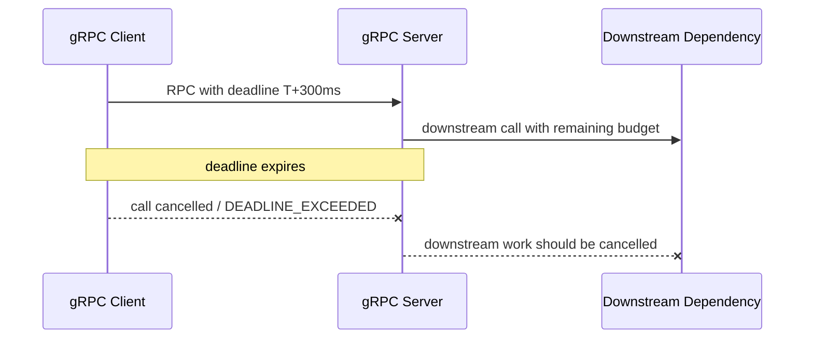
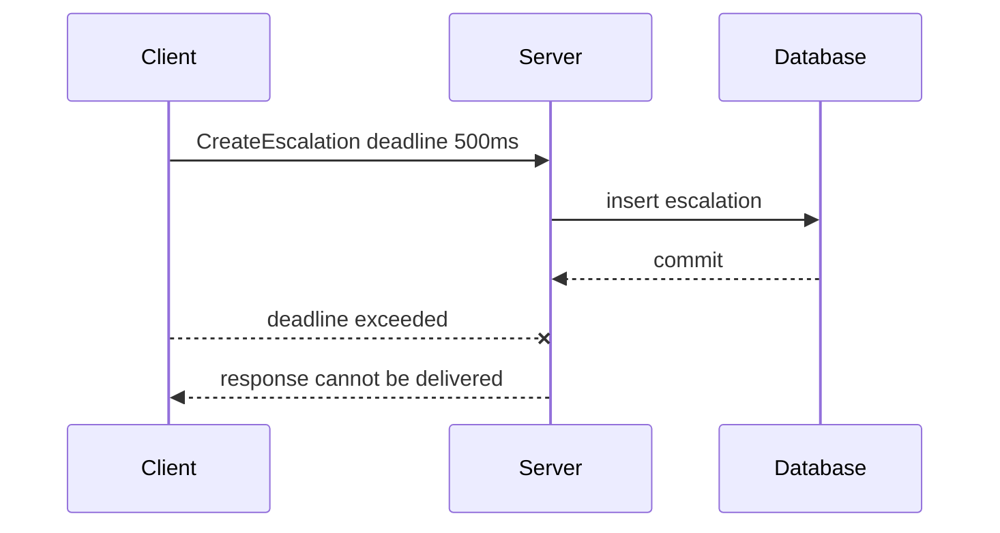

# Part 053 — gRPC Deadlines, Cancellation, and Budget Propagation

gRPC gives you something HTTP APIs often implement manually: first-class deadlines and cancellation.

That is powerful.

It is also easy to misuse.

A gRPC deadline is not just a timeout setting on a stub. It is the time boundary of an RPC. Once the deadline is exceeded, the call should be cancelled and downstream work should stop if it is no longer useful.

The production rule is:

> Every gRPC call must have a deadline, every server must respect cancellation, and every downstream call must spend from the remaining budget.

Without that, gRPC becomes just another way to create slow, stuck, resource-consuming distributed calls.

---

## 1. Deadline Mental Model

A deadline answers:

```text
When is this RPC no longer useful?
```

Client-side:

```java
CaseServiceGrpc.CaseServiceBlockingStub stubWithDeadline =
    baseStub.withDeadlineAfter(300, TimeUnit.MILLISECONDS);

GetCaseResponse response = stubWithDeadline.getCase(request);
```

Server-side:

```java
io.grpc.Deadline deadline = Context.current().getDeadline();
```

If the deadline expires, the RPC is cancelled. The client receives `DEADLINE_EXCEEDED` when the call fails because the deadline was exceeded.

The server should stop work when it observes cancellation.



Deadline is a budget, not decoration.

---

## 2. Deadline vs Timeout in gRPC

A timeout is usually local and relative.

A deadline is conceptually a point at which the RPC must stop being useful.

In gRPC Java, you commonly set it with:

```java
stub.withDeadlineAfter(300, TimeUnit.MILLISECONDS)
```

This is expressed as a relative duration by the caller, but gRPC carries deadline semantics across the RPC.

Practical distinction:

| Concept | Scope | Example |
|---|---|---|
| Per-call deadline | one RPC | `GetCase` must finish in 300 ms |
| Operation deadline | whole use case | `CreateEscalation` must finish in 700 ms |
| Attempt timeout | one try in retry loop | first attempt gets 250 ms |
| Server cancellation | stop work after caller no longer waits | stop database query/fan-out |
| Business SLA | workflow/user expectation | case escalation visible within 2 minutes |

Do not confuse them.

A workflow business SLA may be minutes or hours.

A synchronous gRPC call deadline may be milliseconds.

---

## 3. Why Every gRPC Call Needs a Deadline

No deadline means the call may wait far longer than the caller can usefully tolerate.

Failure modes:

- caller thread or virtual thread waits too long,
- async future stays pending,
- server keeps processing abandoned work,
- downstream resources stay occupied,
- retries start at other layers,
- message consumers fall behind,
- circuit breaker reacts late,
- bulkheads fill,
- p99 latency becomes unbounded.

A service should treat a missing deadline as a policy violation unless it is a deliberately long-lived stream with explicit lifetime controls.

Bad:

```java
stub.getCase(request);
```

Better:

```java
stub.withDeadlineAfter(300, TimeUnit.MILLISECONDS)
    .getCase(request);
```

Best:

```java
Duration callBudget = requestContext.deadline()
    .timeoutWithMargin(Duration.ofMillis(300), Duration.ofMillis(25));

stub.withDeadlineAfter(callBudget.toMillis(), TimeUnit.MILLISECONDS)
    .getCase(request);
```

---

## 4. Deadline Should Come from Context

Do not hard-code timeout values at call sites.

Create a request context:

```java
public record GrpcRequestContext(
    String correlationId,
    String callerService,
    String tenantId,
    Deadline applicationDeadline,
    Priority priority
) {}
```

Then derive per-call gRPC deadline:

```java
public CaseSnapshot getCase(CaseId caseId) {
    GrpcRequestContext ctx = contextProvider.current();

    Duration budget = ctx.applicationDeadline()
        .timeoutWithMargin(Duration.ofMillis(300), Duration.ofMillis(25));

    GetCaseResponse response = baseStub
        .withDeadlineAfter(budget.toMillis(), TimeUnit.MILLISECONDS)
        .getCase(mapper.toRequest(caseId));

    return mapper.toDomain(response);
}
```

This keeps all remote calls within the inbound operation budget.

---

## 5. Server Deadline Resolution

On the server:

```java
io.grpc.Deadline grpcDeadline = Context.current().getDeadline();
```

It may be `null` if the client did not set one.

Production server policy:

| Inbound deadline | Server behavior |
|---|---|
| present and reasonable | use it |
| missing | apply service default |
| too far in future | cap it |
| already expired | fail fast |
| too short for useful work | fail fast or degrade |

Example resolver:

```java
public final class GrpcDeadlineResolver {
    private final Clock clock;
    private final Duration defaultDuration;
    private final Duration maxDuration;
    private final Duration minUsefulDuration;

    public ApplicationDeadline resolve() {
        io.grpc.Deadline grpcDeadline = Context.current().getDeadline();

        Duration remaining = grpcDeadline == null
            ? defaultDuration
            : Duration.ofNanos(Math.max(0, grpcDeadline.timeRemaining(TimeUnit.NANOSECONDS)));

        if (remaining.compareTo(maxDuration) > 0) {
            remaining = maxDuration;
        }

        if (remaining.compareTo(minUsefulDuration) < 0) {
            throw Status.DEADLINE_EXCEEDED
                .withDescription("Deadline too short for useful processing")
                .asRuntimeException();
        }

        return ApplicationDeadline.after(remaining, clock);
    }
}
```

This prevents callers from creating unbounded server work.

---

## 6. Deadline Propagation to Downstream gRPC

A gRPC server calling another gRPC service should propagate remaining budget.

```java
public CaseDetails getCaseDetails(CaseId id) {
    ApplicationDeadline deadline = requestContext.current().deadline();

    Duration downstreamBudget = deadline.timeoutWithMargin(
        Duration.ofMillis(250),
        Duration.ofMillis(25)
    );

    DependencyResponse response = dependencyStub
        .withDeadlineAfter(downstreamBudget.toMillis(), TimeUnit.MILLISECONDS)
        .getSomething(request);
}
```

Do not do this:

```java
dependencyStub.withDeadlineAfter(1, TimeUnit.SECONDS)
```

if the current request only has 150 ms left.

Downstream deadlines must shrink, never expand.

---

## 7. Deadline Propagation to HTTP and Database

gRPC services often call HTTP services or databases.

The gRPC deadline should still govern those calls.

For HTTP:

```java
Duration httpBudget = deadline.timeoutWithMargin(
    Duration.ofMillis(300),
    Duration.ofMillis(20)
);

httpClient.call(request, httpBudget);
```

For database:

```sql
SET LOCAL statement_timeout = '200ms';
```

or Java concept:

```java
Duration queryBudget = deadline.timeoutWithMargin(
    Duration.ofMillis(200),
    Duration.ofMillis(20)
);

repository.findCase(caseId, queryBudget);
```

Do not let a database query run for 10 seconds after a gRPC call has been cancelled at 300 ms.

---

## 8. Cancellation Mental Model

Cancellation means:

```text
the caller is no longer interested in the result
```

Cancellation can happen because:

- client explicitly cancels,
- deadline expires,
- network connection closes,
- I/O error occurs,
- upstream caller is cancelled,
- stream is aborted.

gRPC cancellation guide says the server should stop ongoing computation when an RPC is cancelled.

But cancellation does not mean:

```text
the server did nothing
```

For commands, the server may already have committed state.

That is why commands still need idempotency, deduplication, and reconciliation.

---

## 9. Server-Side Cancellation Check

For long-running unary work:

```java
@Override
public void generateReport(
    GenerateReportRequest request,
    StreamObserver<GenerateReportResponse> responseObserver
) {
    Context context = Context.current();

    try {
        ReportBuilder builder = new ReportBuilder();

        for (ReportChunk chunk : reportSource.readChunks(request.getReportId())) {
            if (context.isCancelled()) {
                cleanupPartialWork();
                return;
            }

            builder.add(chunk);
        }

        responseObserver.onNext(mapper.toResponse(builder.build()));
        responseObserver.onCompleted();
    } catch (RuntimeException ex) {
        responseObserver.onError(errorMapper.toStatusRuntimeException(ex));
    }
}
```

Check cancellation:

- inside loops,
- before expensive downstream calls,
- before blocking waits,
- between fan-out stages,
- before writing large responses.

Do not check it only once at the beginning.

---

## 10. Cancellation Listener

You can add a cancellation listener to gRPC context.

```java
Context context = Context.current();

context.addListener(cancelledContext -> {
    logger.info("RPC cancelled");
    cancellationToken.cancel();
}, directExecutor());
```

Use this to signal:

- background tasks,
- database query cancellation if supported,
- fan-out futures,
- streaming producers,
- resource cleanup.

Be careful with executor choice.

Cancellation callbacks should be fast and safe.

---

## 11. Future Cancellation

Suppose a gRPC service starts async work:

```java
CompletableFuture<CaseView> future = service.getCaseAsync(caseId);
```

If the RPC is cancelled, cancel the future.

```java
Context context = Context.current();

context.addListener(cancelled -> future.cancel(true), directExecutor());

future.whenComplete((value, error) -> {
    if (context.isCancelled()) {
        return;
    }

    if (error != null) {
        responseObserver.onError(errorMapper.toStatusRuntimeException(error));
    } else {
        responseObserver.onNext(mapper.toResponse(value));
        responseObserver.onCompleted();
    }
});
```

However:

> `future.cancel(true)` does not guarantee remote work or database work stops.

Cancellation must be supported by the underlying operation.

---

## 12. Cancellation and Commands

Command scenario:



Client sees failure.

Server committed success.

This is unknown outcome from client perspective.

Correct design:

- client retries with same idempotency key,
- server deduplicates,
- server replays or returns stable outcome,
- outbox emits event once,
- audit writes once.

Incorrect design:

- client retries with new command ID,
- server creates duplicate escalation.

Cancellation is a transport signal, not a transaction guarantee.

---

## 13. Client Explicit Cancellation

For async/future stubs:

```java
ListenableFuture<GetCaseResponse> future =
    futureStub.withDeadlineAfter(300, TimeUnit.MILLISECONDS)
        .getCase(request);

if (userNavigatedAway()) {
    future.cancel(true);
}
```

For streaming, use the request observer/call handle where applicable.

Client cancellation should be used when:

- user request is gone,
- parent operation timed out,
- first hedged response won,
- fan-out result no longer needed,
- service is shutting down,
- stream should close.

Cancellation is resource hygiene.

---

## 14. Streaming Cancellation

Streaming makes cancellation more important.

Server-streaming:

```java
Iterator<CaseEvent> events = stub
    .withDeadlineAfter(10, TimeUnit.SECONDS)
    .listCaseEvents(request);

while (events.hasNext()) {
    CaseEvent event = events.next();
    handle(event);

    if (shouldStop()) {
        // with blocking iterator, cancellation is less direct;
        // prefer async call patterns when explicit cancellation is needed.
        break;
    }
}
```

Async streaming gives better cancellation hooks.

Server should handle:

- client stops reading,
- client cancels,
- deadline expires,
- network disconnects,
- backpressure/flow control stalls.

Do not design unbounded streams without cancellation and lifetime policy.

---

## 15. Deadline for Long-Lived Streams

A normal unary deadline may be 300 ms.

A stream may live for minutes.

That does not mean streams should have no bounds.

Streaming budget model:

| Control | Meaning |
|---|---|
| connection deadline | maximum stream lifetime |
| idle timeout | maximum time with no messages |
| per-message processing timeout | handler budget |
| heartbeat interval | detect broken clients |
| max messages | bound stream work |
| cancellation policy | stop stream when caller gone |

For long-lived streams, use:

```text
max stream duration
+ idle timeout
+ cancellation
+ backpressure
```

instead of tiny unary deadlines.

---

## 16. Deadline and Retry

gRPC retry, whether application-level or service-config-based, must respect deadline.

If a call has 300 ms deadline:

```text
attempt 1: 200 ms
backoff: 100 ms
attempt 2: impossible
```

Do not start a retry that cannot complete.

Application-level retry decision:

```java
if (!deadline.canFit(backoff.plus(minAttemptDuration))) {
    return RetryDecision.stop("deadline exhausted");
}
```

For commands:

- retry only if idempotency is present,
- same idempotency key across attempts,
- server dedup required.

---

## 17. Deadline and Hedging

gRPC supports request hedging through service config in some ecosystems, but application semantics still matter.

Hedging should be disabled when:

- operation is side-effecting,
- request is not idempotent,
- deadline too short,
- bulkhead saturated,
- circuit open,
- dependency overloaded,
- consistency cannot tolerate fastest replica.

If application-level hedging is used:

```text
hedge only within remaining deadline
cap total attempts including hedges
cancel losing attempt
record primary vs hedge metrics
```

Hedging without deadline awareness is speculative overload.

---

## 18. Deadline and Server Executors

If server executor queues work, deadline can expire before user code starts.

A good server checks deadline at handler entry.

```java
if (Context.current().getDeadline() != null
    && Context.current().getDeadline().isExpired()) {
    responseObserver.onError(Status.DEADLINE_EXCEEDED
        .withDescription("Deadline exceeded before handler execution")
        .asRuntimeException());
    return;
}
```

Queue time counts.

Do not give a request a full fresh budget after it waited in an executor.

---

## 19. ThreadLocal vs gRPC Context

gRPC Java uses `io.grpc.Context` to propagate cancellation, deadline, and values.

ThreadLocal can fail when execution hops threads.

Use gRPC `Context` for RPC-scoped values.

Example key:

```java
public final class GrpcContextKeys {
    public static final Context.Key<RequestContext> REQUEST_CONTEXT =
        Context.key("request-context");
}
```

Set in server interceptor:

```java
Context context = Context.current()
    .withValue(GrpcContextKeys.REQUEST_CONTEXT, requestContext);

return Contexts.interceptCall(context, call, headers, next);
```

Read later:

```java
RequestContext ctx = GrpcContextKeys.REQUEST_CONTEXT.get();
```

For non-gRPC async libraries, you may need explicit context propagation wrappers.

---

## 20. Context Propagation Across Executors

If you submit work to an executor, capture gRPC context.

```java
Context grpcContext = Context.current();

executor.submit(grpcContext.wrap(() -> {
    RequestContext ctx = GrpcContextKeys.REQUEST_CONTEXT.get();
    doWork(ctx);
}));
```

Without wrapping, the new thread may not have the expected context.

This can break:

- cancellation,
- deadlines,
- trace context,
- tenant context,
- caller identity,
- logging correlation.

Context propagation must be intentional.

---

## 21. Deadline Error Mapping

Common statuses:

| Condition | Status |
|---|---|
| client deadline exceeded | `DEADLINE_EXCEEDED` |
| client explicitly cancelled | `CANCELLED` |
| server rejects impossible deadline | `DEADLINE_EXCEEDED` or `INVALID_ARGUMENT` depending policy |
| server overloaded before work | `RESOURCE_EXHAUSTED` or `UNAVAILABLE` |
| dependency timeout | often `UNAVAILABLE` or `DEADLINE_EXCEEDED` depending whether current RPC deadline expired |

Be precise.

If the current RPC deadline expired, `DEADLINE_EXCEEDED` is appropriate.

If a downstream dependency timed out while current RPC still has budget, `UNAVAILABLE` with retry info may be better.

---

## 22. Observability

Metrics:

```text
grpc.client.deadline_ms{dependency,method}
grpc.server.deadline_remaining_ms{method}
grpc.server.cancelled.total{method,reason}
grpc.server.deadline_exceeded.total{method}
grpc.client.deadline_exceeded.total{dependency,method}
grpc.context.missing_deadline.total{method}
grpc.deadline.capped.total{method}
grpc.work.cancelled.total{method,phase}
```

Trace attributes:

```text
rpc.grpc.deadline_ms=300
rpc.grpc.deadline_remaining_ms=217
rpc.cancelled=true
rpc.cancel.reason=deadline_exceeded
```

Structured log:

```json
{
  "event": "grpc_deadline_exceeded",
  "method": "example.case.v1.CaseService/GetCase",
  "caller": "workflow-service",
  "remainingAtStartMs": 45,
  "phase": "before_downstream_call"
}
```

Avoid logging payloads.

---

## 23. Alerting

Useful alerts:

| Alert | Meaning |
|---|---|
| missing deadlines from callers | client policy gap |
| deadline exceeded spike | dependency slowness or too-tight budget |
| cancellation ignored | wasted server work |
| deadline too short spike | upstream misconfiguration |
| server cancelled work high | clients timing out or disconnecting |
| DB query outlives RPC | timeout alignment bug |
| retries skipped due deadline | budget too tight or dependency slow |
| stream cancellation spike | client disconnects or network issue |

Deadline and cancellation metrics should be part of every gRPC dashboard.

---

## 24. Testing Deadlines

Test with in-process gRPC server.

```java
@Test
void clientReceivesDeadlineExceeded() {
    CaseServiceImplBase slowService = new CaseServiceImplBase() {
        @Override
        public void getCase(GetCaseRequest request, StreamObserver<GetCaseResponse> observer) {
            sleep(Duration.ofSeconds(1));
            observer.onNext(GetCaseResponse.newBuilder().build());
            observer.onCompleted();
        }
    };

    StatusRuntimeException ex = assertThrows(
        StatusRuntimeException.class,
        () -> stub.withDeadlineAfter(10, TimeUnit.MILLISECONDS).getCase(request)
    );

    assertThat(ex.getStatus().getCode()).isEqualTo(Status.Code.DEADLINE_EXCEEDED);
}
```

Also test:

- missing deadline default,
- too-long deadline capped,
- too-short deadline rejected,
- downstream deadline propagated,
- DB timeout derived,
- retry skipped when deadline insufficient.

---

## 25. Testing Cancellation

Server cancellation test concept:

```java
@Test
void serverStopsWorkWhenClientCancels() {
    AtomicBoolean cancelledObserved = new AtomicBoolean(false);

    // service loops until Context.current().isCancelled()
    // client starts call and cancels future
    // assert cancellation observed
}
```

Cancellation tests are often more complex than deadline tests.

Still write them for:

- long-running unary operations,
- streaming operations,
- expensive fan-out,
- background tasks tied to request lifecycle.

---

## 26. Load Testing

Deadline/cancellation load tests:

- many clients timeout early,
- server executor queue builds,
- database slow query,
- downstream gRPC service stalls,
- streaming clients disconnect,
- hedged requests cancel losers,
- retry storm with short deadlines,
- Kubernetes shutdown during in-flight calls.

Questions:

- does server stop abandoned work?
- do database queries continue after cancellation?
- are loser hedged calls cancelled?
- does queue age exceed deadlines?
- do metrics show cancellation reasons?
- does deadline propagation reduce wasted load?

---

## 27. Production Policy Template

```yaml
grpc:
  deadlines:
    required: true
    defaultMs: 500
    maxMs: 1000
    minUsefulMs: 75
    reserveResponseMarginMs: 25
    rejectMissingAtBoundary: false
    applyDefaultWhenMissing: true
    capExcessiveDeadline: true

  cancellation:
    observeInLongRunningHandlers: true
    cancelDownstreamCalls: true
    cancelExecutorTasks: true
    cancelDatabaseQueriesWhenSupported: true
    commandsStillRequireIdempotency: true

  propagation:
    downstreamGrpc: true
    downstreamHttp: true
    databaseTimeout: true
    executorContextWrapRequired: true

  streaming:
    maxStreamDurationMs: 300000
    idleTimeoutMs: 30000
    cancellationRequired: true
```

Policy should be enforced in client adapters, server interceptors, and tests.

---

## 28. Anti-Patterns

### 28.1 No deadline on stubs

Calls can outlive useful budget.

### 28.2 Deadline set larger than inbound remaining budget

Service extends caller budget incorrectly.

### 28.3 Server ignores cancellation

Cancelled calls keep consuming resources.

### 28.4 Treating cancellation as rollback

Commands may have committed.

### 28.5 New deadline per downstream call

Call chain exceeds original budget.

### 28.6 Long database timeout

Database keeps working after RPC deadline.

### 28.7 ThreadLocal context lost

Deadlines and identity disappear across executors.

### 28.8 Retrying after deadline exhaustion

Only adds load.

### 28.9 Unbounded streams

Long-lived streams with no lifetime or idle policy.

### 28.10 No deadline observability

You cannot tune budget behavior.

---

## 29. Design Checklist

Before shipping gRPC deadline/cancellation behavior:

- Does every client call set a deadline?
- Is deadline derived from request context?
- Are missing deadlines handled by policy?
- Are too-long deadlines capped?
- Are too-short deadlines rejected?
- Does server check cancellation in long work?
- Are downstream gRPC calls given remaining budget?
- Are HTTP/database calls aligned to deadline?
- Does retry respect deadline?
- Does hedging respect deadline?
- Are commands idempotent under timeout/cancellation?
- Is gRPC Context propagated across executors?
- Are streaming calls bounded?
- Are cancellation metrics emitted?
- Are deadline tests included?
- Are load tests covering cancelled work?
- Is runbook clear about `DEADLINE_EXCEEDED` vs `CANCELLED`?

---

## 30. The Real Lesson

gRPC makes deadlines and cancellation first-class.

That does not automatically make your service deadline-aware.

You still must design:

```text
where deadline comes from
how it is capped
how it is propagated
what happens when it expires
how cancellation stops work
how commands handle unknown outcomes
how metrics prove it
```

A production gRPC system treats time as a shared budget across the call graph.

That is how it avoids doing useless work after the caller has already left.

---

## References

- gRPC Deadlines Guide: https://grpc.io/docs/guides/deadlines/
- gRPC Cancellation Guide: https://grpc.io/docs/guides/cancellation/
- gRPC Deadlines Blog: https://grpc.io/blog/deadlines/
- gRPC Java Context Javadoc: https://grpc.github.io/grpc-java/javadoc/io/grpc/Context.html
- gRPC Java Contexts Javadoc: https://grpc.github.io/grpc-java/javadoc/io/grpc/Contexts.html
- gRPC Java Basics Tutorial: https://grpc.io/docs/languages/java/basics/
