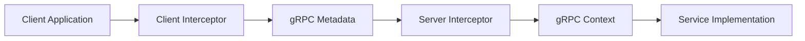
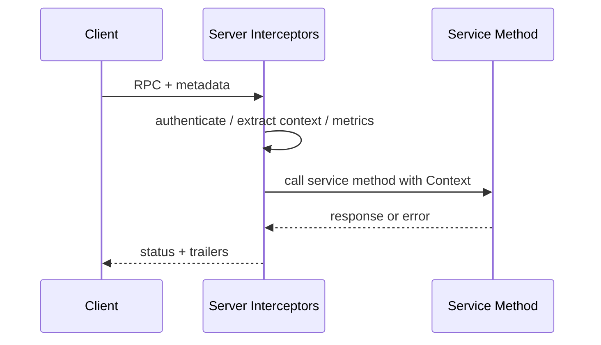
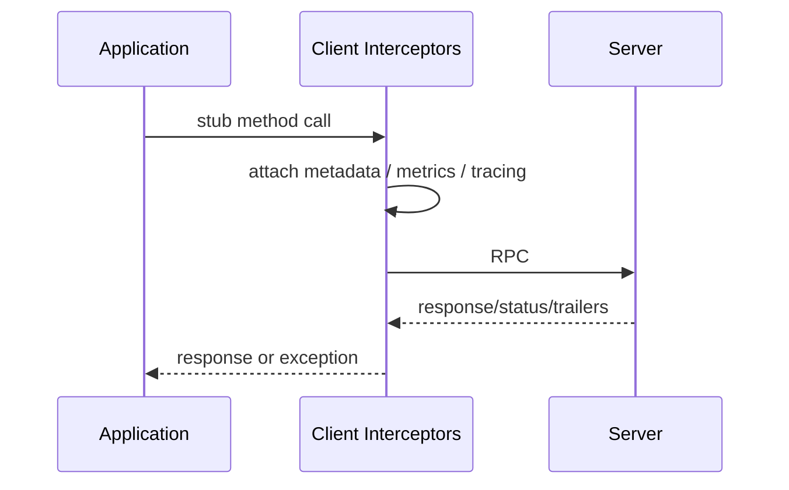

# Part 054 — gRPC Metadata, Interceptors, and Context Propagation

gRPC gives you typed Protobuf messages for business data.

It also gives you metadata for call-associated information.

That distinction matters.

Business payload belongs in the request/response message.

Cross-cutting call context belongs in metadata and gRPC `Context`.

Examples:

- authentication token,
- caller service,
- tenant,
- correlation ID,
- trace context,
- idempotency key,
- request priority,
- feature routing hint,
- quota key,
- client version,
- deadline/cancellation context.

In Java, interceptors are the main mechanism to read, write, validate, and propagate this context around RPC calls.

Used well, interceptors keep cross-cutting communication policy consistent.

Used badly, interceptors become invisible magic that hides security, retry, auth, and observability behavior.

---

## 1. Metadata Mental Model

The gRPC metadata guide describes metadata as a side channel that lets clients and servers provide information associated with an RPC.

Metadata is not the Protobuf request body.

It is key-value data sent with the RPC.



Common metadata:

```text
authorization: Bearer ...
x-correlation-id: corr-123
x-tenant-id: tenant-a
x-caller-service: workflow-service
idempotency-key: cmd-123
traceparent: 00-...
```

Metadata should be small, stable, and governed.

---

## 2. Metadata vs Protobuf Fields

Use Protobuf fields for operation-specific business data.

Use metadata for cross-cutting call data.

| Data | Better location | Why |
|---|---|---|
| `case_id` | request message | domain input |
| `target_queue` | request message | command data |
| `reason_code` | request message | business semantics |
| `authorization` | metadata | cross-cutting security |
| `traceparent` | metadata | observability propagation |
| `x-correlation-id` | metadata | support/debug context |
| `tenant_id` | depends | business field if part of domain; metadata if platform context |
| `idempotency_key` | depends | field if operation-specific contract; metadata if platform-wide command policy |
| `client_version` | metadata | integration/compatibility context |

Do not move core business inputs into metadata just to avoid changing `.proto`.

Metadata is less visible in generated method signatures.

That can hide contract changes.

---

## 3. Metadata Key Rules

Normal metadata keys are ASCII strings.

Binary metadata keys end with `-bin`.

Java examples:

```java
Metadata.Key<String> CORRELATION_ID =
    Metadata.Key.of("x-correlation-id", Metadata.ASCII_STRING_MARSHALLER);

Metadata.Key<byte[]> BINARY_TOKEN =
    Metadata.Key.of("custom-token-bin", Metadata.BINARY_BYTE_MARSHALLER);
```

Guidelines:

- use lowercase keys,
- keep names stable,
- avoid large values,
- avoid sensitive values unless necessary,
- avoid raw business payload,
- document ownership and semantics,
- do not log values blindly.

Metadata limits may apply, and larger metadata increases overhead.

---

## 4. Interceptor Mental Model

The gRPC interceptor guide describes interceptors as components added to a channel or server, called for every RPC on that channel/server.

There are two broad categories:

| Side | Java type |
|---|---|
| Client | `ClientInterceptor` |
| Server | `ServerInterceptor` |

Use client interceptors to:

- attach auth metadata,
- attach correlation/tenant/caller metadata,
- start tracing/metrics,
- attach idempotency key if metadata-based,
- enforce deadline policy,
- log safe call metadata.

Use server interceptors to:

- authenticate,
- extract caller/tenant/correlation,
- validate metadata,
- create request context,
- enforce rate/load policy,
- start tracing/metrics,
- normalize errors,
- attach response trailers.

---

## 5. Server Interceptor Flow



Server interceptor skeleton:

```java
public final class RequestContextServerInterceptor implements ServerInterceptor {
    @Override
    public <ReqT, RespT> ServerCall.Listener<ReqT> interceptCall(
        ServerCall<ReqT, RespT> call,
        Metadata headers,
        ServerCallHandler<ReqT, RespT> next
    ) {
        RequestContext requestContext = buildContext(call, headers);

        Context grpcContext = Context.current()
            .withValue(ContextKeys.REQUEST_CONTEXT, requestContext);

        return Contexts.interceptCall(grpcContext, call, headers, next);
    }
}
```

Use `Contexts.interceptCall` to make the augmented context current for call events.

---

## 6. Client Interceptor Flow



Client interceptor skeleton:

```java
public final class MetadataClientInterceptor implements ClientInterceptor {
    private final RequestContextProvider contextProvider;

    @Override
    public <ReqT, RespT> ClientCall<ReqT, RespT> interceptCall(
        MethodDescriptor<ReqT, RespT> method,
        CallOptions callOptions,
        Channel next
    ) {
        ClientCall<ReqT, RespT> delegate = next.newCall(method, callOptions);

        return new ForwardingClientCall.SimpleForwardingClientCall<>(delegate) {
            @Override
            public void start(Listener<RespT> responseListener, Metadata headers) {
                RequestContext context = contextProvider.current();
                headers.put(MetadataKeys.CORRELATION_ID, context.correlationId());
                headers.put(MetadataKeys.CALLER_SERVICE, context.callerService());
                super.start(responseListener, headers);
            }
        };
    }
}
```

Attach it once when constructing the channel/stub.

---

## 7. Context Object

Define a stable internal context.

```java
public record RequestContext(
    String correlationId,
    String traceId,
    String callerService,
    String tenantId,
    String clientVersion,
    Deadline deadline,
    Priority priority,
    Optional<IdempotencyKey> idempotencyKey
) {}
```

Context should be:

- built at ingress,
- validated,
- available to application/use-case layer,
- propagated to outbound clients,
- visible to observability,
- protected from unsafe caller spoofing.

Do not let every interceptor invent its own context model.

---

## 8. Context Keys

```java
public final class ContextKeys {
    private ContextKeys() {}

    public static final Context.Key<RequestContext> REQUEST_CONTEXT =
        Context.key("request-context");

    public static final Context.Key<AuthenticatedPrincipal> PRINCIPAL =
        Context.key("principal");
}
```

Read context:

```java
RequestContext context = ContextKeys.REQUEST_CONTEXT.get();

if (context == null) {
    throw new IllegalStateException("RequestContext missing");
}
```

Missing context in server code is a serious platform bug.

Fail clearly in development and test.

---

## 9. Metadata Key Registry

Centralize metadata keys.

```java
public final class MetadataKeys {
    private MetadataKeys() {}

    public static final Metadata.Key<String> AUTHORIZATION =
        Metadata.Key.of("authorization", Metadata.ASCII_STRING_MARSHALLER);

    public static final Metadata.Key<String> CORRELATION_ID =
        Metadata.Key.of("x-correlation-id", Metadata.ASCII_STRING_MARSHALLER);

    public static final Metadata.Key<String> CALLER_SERVICE =
        Metadata.Key.of("x-caller-service", Metadata.ASCII_STRING_MARSHALLER);

    public static final Metadata.Key<String> TENANT_ID =
        Metadata.Key.of("x-tenant-id", Metadata.ASCII_STRING_MARSHALLER);

    public static final Metadata.Key<String> IDEMPOTENCY_KEY =
        Metadata.Key.of("idempotency-key", Metadata.ASCII_STRING_MARSHALLER);
}
```

Avoid string literals scattered across code.

Metadata is contract surface area.

---

## 10. Authentication Interceptor

```java
public final class AuthenticationServerInterceptor implements ServerInterceptor {
    private final TokenVerifier tokenVerifier;

    @Override
    public <ReqT, RespT> ServerCall.Listener<ReqT> interceptCall(
        ServerCall<ReqT, RespT> call,
        Metadata headers,
        ServerCallHandler<ReqT, RespT> next
    ) {
        String authorization = headers.get(MetadataKeys.AUTHORIZATION);

        AuthenticatedPrincipal principal = tokenVerifier.verify(authorization)
            .orElseThrow(() -> Status.UNAUTHENTICATED
                .withDescription("Missing or invalid credentials")
                .asRuntimeException());

        Context context = Context.current()
            .withValue(ContextKeys.PRINCIPAL, principal);

        return Contexts.interceptCall(context, call, headers, next);
    }
}
```

Security rules:

- never trust caller-service metadata without authenticated identity,
- derive caller identity from token/certificate when possible,
- do not log tokens,
- enforce authorization in service/use-case layer too,
- validate tenant access against authenticated principal.

---

## 11. Caller Identity

Bad:

```text
x-caller-service: payment-service
```

trusted without verification.

A buggy or malicious caller can spoof it.

Better:

- authenticate with mTLS/token,
- derive service identity from certificate/token claim,
- compare metadata caller hint with authenticated principal,
- use metadata only as hint for logs if untrusted.

```java
String callerFromToken = principal.serviceName();
String callerHint = headers.get(MetadataKeys.CALLER_SERVICE);

if (callerHint != null && !callerHint.equals(callerFromToken)) {
    throw Status.PERMISSION_DENIED
        .withDescription("Caller metadata does not match authenticated identity")
        .asRuntimeException();
}
```

Identity must come from security boundary, not arbitrary metadata.

---

## 12. Tenant Context

Tenant may be:

- in token claims,
- in request message,
- in metadata,
- inferred from resource ID,
- selected by route.

Choose carefully.

If tenant is security-critical, do not trust metadata alone.

Patterns:

| Pattern | Use |
|---|---|
| tenant in auth token | strong platform tenant context |
| tenant in request field | operation is explicitly tenant-scoped |
| tenant inferred from resource | lookup/authorization required |
| tenant in metadata | acceptable only from trusted internal caller or gateway |

Server must verify that caller is allowed to act on tenant.

Context propagation should not bypass authorization.

---

## 13. Correlation ID vs Trace ID

Do not confuse them.

| ID | Purpose |
|---|---|
| trace ID | distributed tracing system identity |
| correlation ID | business/support debugging identifier |
| request ID | one request at one boundary |
| idempotency key | logical command deduplication identity |

A correlation ID can be propagated in metadata.

Trace context is often handled by OpenTelemetry instrumentation.

Idempotency key is not a trace ID.

Do not log idempotency keys in plaintext if they are sensitive.

---

## 14. Trace Context Metadata

Tracing instrumentation may propagate trace context automatically.

If you manually propagate, use standard trace context when possible.

Example metadata names:

```text
traceparent
tracestate
baggage
```

Be careful with baggage:

- can grow large,
- can leak sensitive data,
- propagates widely,
- should be allowlisted.

Context policy:

```yaml
baggage:
  allowedKeys:
    - tenant.tier
    - caller.service
  forbiddenKeys:
    - authorization
    - cookie
    - email
    - personal_data
```

Never put secrets in baggage.

---

## 15. Idempotency Key in Metadata

For platform-wide command idempotency, metadata can work:

```text
idempotency-key: cmd-123
```

Client interceptor can attach it from request context.

Server interceptor can extract and validate it.

But there is a trade-off.

Pros:

- cross-cutting,
- no repeated fields in every command,
- easy to enforce in interceptor.

Cons:

- less visible in `.proto`,
- generated method signatures do not show it,
- tooling may miss it,
- command-specific fingerprint still needs request body.

For critical commands, consider including idempotency key in the request message or documenting metadata requirement in service contract.

---

## 16. Priority and Load Shedding Metadata

Priority can be propagated:

```text
x-request-priority: user-facing
```

But priority can be abused.

Rules:

- accept priority only from trusted callers,
- derive priority at gateway or workflow engine when possible,
- cap priority per caller identity,
- log priority decisions,
- use priority for admission control and shedding.

Do not let every internal client label itself `critical`.

---

## 17. Response Metadata and Trailers

gRPC has initial metadata and trailing metadata.

Use trailers for:

- request charge/quota result,
- deprecation warning,
- server timing,
- retry hint,
- rich error details,
- diagnostic IDs.

Example server call wrapper:

```java
ServerCall<ReqT, RespT> wrapped =
    new ForwardingServerCall.SimpleForwardingServerCall<>(call) {
        @Override
        public void close(Status status, Metadata trailers) {
            trailers.put(MetadataKeys.SERVER_REGION, region);
            super.close(status, trailers);
        }
    };
```

Do not rely on trailers for business data consumers must always process.

Some proxies/tools may make them less visible.

Business result belongs in response message.

---

## 18. Error Metadata

For errors, prefer structured rich error details when needed.

Trailers can carry gRPC status details.

Use for:

- `RetryInfo`,
- `ErrorInfo`,
- `BadRequest`,
- `ResourceInfo`,
- quota details.

Do not invent dozens of ad-hoc error metadata keys if `google.rpc.Status` details would be clearer.

Keep error contract stable.

---

## 19. Interceptor Ordering

Order matters.

A typical server order:

```text
low-level observability start
→ authentication
→ metadata validation
→ request context creation
→ rate/load admission
→ authorization context
→ exception/status normalization
→ service method
```

A typical client order:

```text
request context
→ deadline/call options
→ auth metadata
→ trace/metrics
→ safe logging
→ generated call
```

But exact order depends on implementation.

Important rules:

- auth before trusting identity metadata,
- context before application method,
- metrics should observe final status,
- error normalization should catch application exceptions,
- logging must not log raw sensitive metadata.

Document ordering.

---

## 20. Exception Handling in Interceptors

If an interceptor throws `StatusRuntimeException`, gRPC will convert it to an RPC error.

But a safer pattern for server methods is to include an exception-to-status interceptor or explicit service method mapping.

Be careful:

- do not convert all exceptions to `UNKNOWN`,
- do not leak exception messages,
- do not swallow cancellation,
- preserve `StatusException`/`StatusRuntimeException` when already intentional.

Example:

```java
try {
    return next.startCall(call, headers);
} catch (StatusRuntimeException ex) {
    throw ex;
} catch (RuntimeException ex) {
    throw Status.INTERNAL
        .withDescription("Internal server error")
        .asRuntimeException();
}
```

Some failures happen asynchronously after listener creation, so method-level error mapping is still important.

---

## 21. Streaming Interceptors

Streaming interceptors must handle multiple message events.

Server listener wrapper:

```java
return new ForwardingServerCallListener.SimpleForwardingServerCallListener<>(listener) {
    @Override
    public void onMessage(ReqT message) {
        // message-level validation/metrics if appropriate
        super.onMessage(message);
    }

    @Override
    public void onCancel() {
        // cancellation metric/cleanup
        super.onCancel();
    }

    @Override
    public void onComplete() {
        super.onComplete();
    }
};
```

For streaming:

- per-RPC metadata arrives once,
- messages arrive many times,
- context must remain valid across stream lifecycle,
- cancellation and flow control matter,
- per-message metrics may be high volume.

Do not log every streamed message in production.

---

## 22. Metadata Size and Performance

Metadata is not free.

Large metadata can:

- increase network overhead,
- hit header size limits,
- increase memory allocations,
- slow intermediaries,
- leak sensitive data,
- create high-cardinality logs.

Guidelines:

- keep metadata small,
- do not put JSON blobs in metadata,
- do not put lists of permissions in metadata unless bounded,
- do not propagate all inbound metadata blindly,
- strip untrusted or unnecessary keys at boundary.

Create an allowlist.

---

## 23. Metadata Propagation Allowlist

Bad:

```java
for (String key : inboundMetadata.keys()) {
    outboundMetadata.put(key, inboundMetadata.get(key));
}
```

This propagates secrets, cookies, internal headers, and garbage.

Better:

```java
public final class MetadataPropagationPolicy {
    private final Set<Metadata.Key<String>> allowedKeys = Set.of(
        MetadataKeys.CORRELATION_ID,
        MetadataKeys.CALLER_SERVICE,
        MetadataKeys.TENANT_ID
    );

    public void propagate(Metadata inbound, Metadata outbound) {
        for (Metadata.Key<String> key : allowedKeys) {
            String value = inbound.get(key);
            if (value != null) {
                outbound.put(key, value);
            }
        }
    }
}
```

Propagation must be explicit.

---

## 24. Observability

Metrics:

```text
grpc.server.calls.total{method,status,caller}
grpc.client.calls.total{method,status,dependency}
grpc.metadata.missing.total{key,method}
grpc.metadata.invalid.total{key,method}
grpc.context.missing.total{method}
grpc.auth.failures.total{method,reason}
grpc.interceptors.duration{interceptor,method}
```

Trace attributes:

```text
rpc.system=grpc
rpc.service=example.case.v1.CaseService
rpc.method=GetCase
caller.service=workflow-service
tenant.tier=enterprise
```

Avoid:

- tenant ID as high-cardinality metric label unless controlled,
- user ID,
- case ID,
- idempotency key,
- authorization token,
- raw metadata maps.

---

## 25. Logging

Safe log:

```json
{
  "event": "grpc_call_completed",
  "method": "example.case.v1.CaseService/GetCase",
  "status": "OK",
  "callerService": "workflow-service",
  "correlationId": "corr-123",
  "durationMs": 24
}
```

Unsafe log:

```json
{
  "metadata": {
    "authorization": "Bearer secret",
    "idempotency-key": "cmd-123",
    "x-user-email": "..."
  }
}
```

Logging policy:

- log key operational fields,
- redact secrets,
- sample high-volume logs,
- never dump metadata wholesale,
- never dump generated request messages by default.

---

## 26. Testing Server Interceptors

Test that metadata becomes context.

```java
@Test
void extractsCorrelationIdIntoContext() {
    Metadata headers = new Metadata();
    headers.put(MetadataKeys.CORRELATION_ID, "corr-123");

    // call in-process server with metadata
    // service method reads ContextKeys.REQUEST_CONTEXT
    // assert correlation ID available
}
```

In gRPC Java tests, use `MetadataUtils.newAttachHeadersInterceptor` for client-side test metadata.

Conceptual:

```java
Metadata headers = new Metadata();
headers.put(MetadataKeys.CORRELATION_ID, "corr-123");

CaseServiceBlockingStub stubWithHeaders = MetadataUtils.attachHeaders(stub, headers);

stubWithHeaders.getCase(request);
```

Then assert server behavior.

---

## 27. Testing Client Interceptors

Use an in-process fake server that captures metadata.

```java
public final class CapturingService extends CaseServiceImplBase {
    private final AtomicReference<String> lastCorrelationId = new AtomicReference<>();

    @Override
    public void getCase(GetCaseRequest request, StreamObserver<GetCaseResponse> observer) {
        RequestContext ctx = ContextKeys.REQUEST_CONTEXT.get();
        lastCorrelationId.set(ctx.correlationId());

        observer.onNext(GetCaseResponse.newBuilder()
            .setCaseId(request.getCaseId())
            .setStatus("OPEN")
            .build());
        observer.onCompleted();
    }
}
```

Test:

```java
@Test
void clientInterceptorSendsCorrelationId() {
    contextProvider.set(RequestContext.withCorrelationId("corr-123"));

    client.getCase(new CaseId("CASE-100"));

    assertThat(capturingService.lastCorrelationId()).isEqualTo("corr-123");
}
```

---

## 28. Testing Auth Metadata

Test cases:

| Scenario | Expected |
|---|---|
| no auth metadata | `UNAUTHENTICATED` |
| invalid token | `UNAUTHENTICATED` |
| valid token wrong tenant | `PERMISSION_DENIED` |
| caller hint mismatch | `PERMISSION_DENIED` |
| valid token | service method invoked |
| token not logged | logs redacted |

Do not test only happy path.

Security metadata bugs are production-critical.

---

## 29. Testing Context Across Executors

If service method submits work to executor:

```java
Context context = Context.current();
executor.submit(context.wrap(() -> doWork()));
```

Test that context survives executor hop.

```java
@Test
void propagatesGrpcContextAcrossExecutor() {
    // service method submits wrapped task
    // task reads ContextKeys.REQUEST_CONTEXT
    // assert value exists
}
```

Without this, deadline/cancellation/identity may disappear.

---

## 30. Production Metadata Policy Template

```yaml
grpcMetadata:
  inbound:
    required:
      - authorization
      - x-correlation-id
    optional:
      - x-tenant-id
      - x-caller-service
      - idempotency-key
      - x-request-priority

  propagation:
    allowlist:
      - x-correlation-id
      - traceparent
      - tracestate
      - baggage
      - x-tenant-id
      - x-caller-service
    denylist:
      - authorization
      - cookie
      - set-cookie
      - x-user-email
      - idempotency-key

  security:
    callerIdentitySource: authenticated-principal
    rejectCallerHintMismatch: true
    tenantMustBeAuthorized: true

  logging:
    logCorrelationId: true
    logCallerService: true
    logTenantTierOnly: true
    redact:
      - authorization
      - idempotency-key
      - "*-bin"

  limits:
    maxMetadataBytes: 8192
```

This policy belongs with API communication policy.

---

## 31. Interceptor Stack Template

Server:

```java
ServerServiceDefinition service = ServerInterceptors.intercept(
    caseGrpcService,
    new ObservabilityServerInterceptor(),
    new AuthenticationServerInterceptor(),
    new MetadataValidationServerInterceptor(),
    new RequestContextServerInterceptor(),
    new RateLimitServerInterceptor(),
    new ErrorMappingServerInterceptor()
);
```

Client:

```java
Channel intercepted = ClientInterceptors.intercept(
    channel,
    new DeadlineClientInterceptor(contextProvider),
    new AuthenticationClientInterceptor(tokenProvider),
    new MetadataPropagationClientInterceptor(contextProvider),
    new ObservabilityClientInterceptor(meterRegistry),
    new SafeLoggingClientInterceptor()
);
```

Document actual order.

Test actual order.

---

## 32. Common Anti-Patterns

### 32.1 Business inputs hidden in metadata

Contract becomes invisible.

### 32.2 Trusting caller-service header

Identity spoofing.

### 32.3 Propagating all metadata

Secrets and garbage spread across services.

### 32.4 Logging metadata wholesale

Credential and PII leak.

### 32.5 ThreadLocal-only context

Context disappears across async boundaries.

### 32.6 No metadata validation

Malformed/oversized context reaches business code.

### 32.7 Idempotency key as trace ID

Semantic confusion.

### 32.8 Interceptor order undocumented

Security and observability behavior becomes accidental.

### 32.9 Trailers used for required business result

Consumers may miss them.

### 32.10 Per-message streaming logs

Log volume explosion.

---

## 33. Design Checklist

Before shipping metadata/interceptor propagation:

- Which metadata keys are accepted?
- Which keys are required?
- Which keys are propagated?
- Which keys are explicitly blocked?
- Is caller identity derived from auth, not hint?
- Is tenant authorized?
- Is correlation ID generated if missing?
- Is trace context handled by instrumentation?
- Is baggage allowlisted?
- Is idempotency key visible in contract?
- Are metadata values size-limited?
- Are secrets redacted from logs?
- Is gRPC Context used for request context?
- Is context propagated across executors?
- Are client interceptors installed once?
- Are server interceptors ordered and tested?
- Are streaming interceptors safe?
- Are metrics low-cardinality?
- Are metadata tests included?

---

## 34. The Real Lesson

gRPC metadata and interceptors are the nervous system of service-to-service communication.

They carry the context that makes an RPC operationally meaningful:

```text
who is calling
for which tenant
under which deadline
with which trace
with which priority
with which idempotency identity
```

But because metadata sits outside the generated business message, it must be governed.

A production gRPC platform uses interceptors to make cross-cutting behavior consistent, visible, secure, and testable.

Not magical.

Not accidental.

Intentional.

---

## References

- gRPC Metadata Guide: https://grpc.io/docs/guides/metadata/
- gRPC Interceptors Guide: https://grpc.io/docs/guides/interceptors/
- gRPC Authentication Guide: https://grpc.io/docs/guides/auth/
- gRPC Java ServerInterceptor Javadoc: https://grpc.github.io/grpc-java/javadoc/io/grpc/ServerInterceptor.html
- gRPC Java ClientInterceptor Javadoc: https://grpc.github.io/grpc-java/javadoc/io/grpc/ClientInterceptor.html
- gRPC Java Context Javadoc: https://grpc.github.io/grpc-java/javadoc/io/grpc/Context.html
- gRPC Java Contexts Javadoc: https://grpc.github.io/grpc-java/javadoc/io/grpc/Contexts.html
