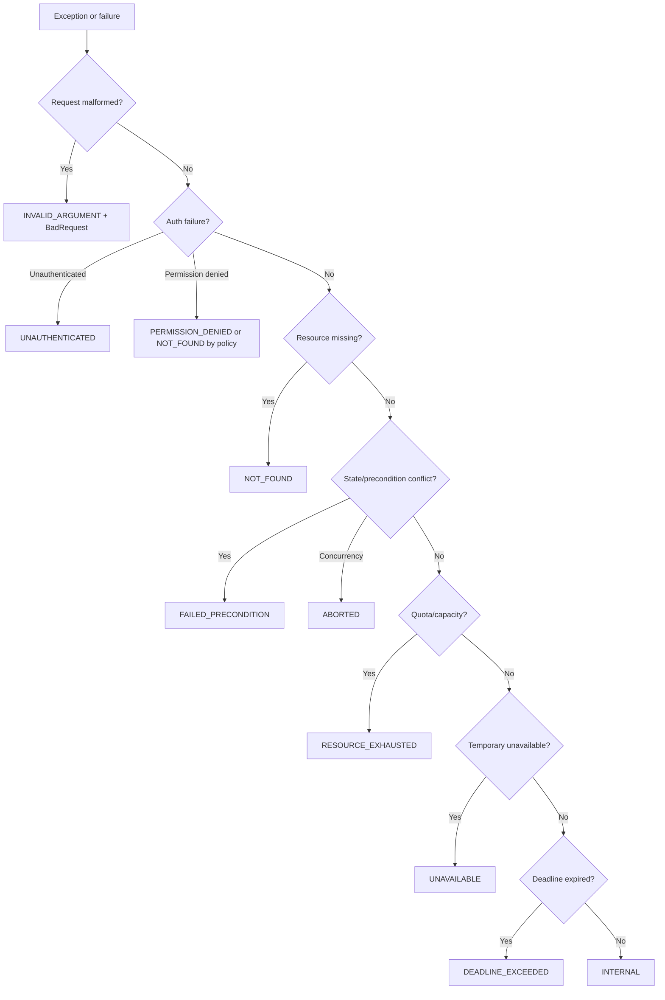

# Part 055 — gRPC Error Handling and Status Model

In HTTP, teams often spend years arguing about status codes.

In gRPC, the status model is more constrained, but not automatically easier.

Every gRPC call ends with a status. The status tells the client whether the RPC succeeded or failed, and if it failed, roughly why.

That sounds simple.

Production error handling is not simple.

A production gRPC service must answer:

- Which domain failure maps to which canonical gRPC status?
- Which failures are retryable?
- Which failures count against circuit breaker?
- Which failures are caller bugs?
- Which failures are dependency health signals?
- What error details are safe to expose?
- How do clients map `StatusRuntimeException` into domain exceptions?
- How do we test that status semantics do not drift?

The goal is not to memorize status codes.

The goal is to make failure actionable.

---

## 1. The Core gRPC Status Model

A gRPC status contains:

```text
code + optional description + optional trailers/details
```

Common Java client exception:

```java
StatusRuntimeException
```

Example:

```java
try {
    GetCaseResponse response = stub.getCase(request);
} catch (StatusRuntimeException ex) {
    Status.Code code = ex.getStatus().getCode();
}
```

At the protocol/API level, a call that fails with a domain error is not a successful response containing an error body.

It is an RPC that ends with a non-`OK` status.

This gives gRPC a clear separation:

```text
successful response message -> business result
non-OK status -> RPC/application failure
```

But deciding which failures should be represented as status codes requires design.

---

## 2. Status Code Is Part of the Contract

A status code is not an implementation detail.

For a consumer, it determines:

- whether to retry,
- whether to show validation errors,
- whether to re-authenticate,
- whether to re-read state,
- whether to switch fallback,
- whether to open circuit breaker,
- whether to mark workflow step terminal or retryable,
- whether to escalate to human remediation.

Therefore, status mapping must be stable.

If version 1 maps a domain conflict to `FAILED_PRECONDITION`, and version 2 changes it to `UNAVAILABLE`, clients may start retrying a terminal business failure.

That is a breaking semantic change.

---

## 3. Canonical Status Code Cheat Sheet

| Code | Meaning in service-to-service design |
|---|---|
| `OK` | Successful RPC |
| `CANCELLED` | Operation cancelled, usually by caller |
| `UNKNOWN` | Unknown error; avoid for expected domain cases |
| `INVALID_ARGUMENT` | Request is malformed or violates basic input validation |
| `DEADLINE_EXCEEDED` | Deadline expired before completion |
| `NOT_FOUND` | Requested resource does not exist or is not visible |
| `ALREADY_EXISTS` | Resource/command already exists |
| `PERMISSION_DENIED` | Authenticated caller lacks permission |
| `RESOURCE_EXHAUSTED` | Quota/rate/resource limit exceeded |
| `FAILED_PRECONDITION` | System/domain state does not allow operation |
| `ABORTED` | Concurrency conflict or transaction aborted; retry at higher level may help |
| `OUT_OF_RANGE` | Request is outside valid range |
| `UNIMPLEMENTED` | Method not implemented/supported |
| `INTERNAL` | Server invariant bug/unexpected internal failure |
| `UNAVAILABLE` | Service/dependency temporarily unavailable |
| `DATA_LOSS` | Unrecoverable data loss/corruption |
| `UNAUTHENTICATED` | Missing/invalid authentication |

The dangerous ones:

- `UNKNOWN`,
- `INTERNAL`,
- `UNAVAILABLE`,
- `FAILED_PRECONDITION`,
- `ABORTED`,
- `RESOURCE_EXHAUSTED`.

They are often overused or confused.

---

## 4. Domain-to-Status Mapping

A practical mapping table for internal microservices:

| Domain condition | Recommended status |
|---|---|
| blank required field | `INVALID_ARGUMENT` |
| invalid ID format | `INVALID_ARGUMENT` |
| enum unspecified when required | `INVALID_ARGUMENT` |
| authentication token missing | `UNAUTHENTICATED` |
| token valid but permission missing | `PERMISSION_DENIED` |
| resource not found | `NOT_FOUND` |
| resource exists but hidden by authorization | often `NOT_FOUND` or `PERMISSION_DENIED` by policy |
| duplicate create by natural key | `ALREADY_EXISTS` |
| idempotency replay success | `OK` with original response |
| same idempotency key, different payload | `ABORTED` or `FAILED_PRECONDITION` |
| command already in progress | `ABORTED` or `RESOURCE_EXHAUSTED`, depending retry policy |
| optimistic lock conflict | `ABORTED` |
| precondition/version mismatch | `FAILED_PRECONDITION` |
| domain rule forbids transition | `FAILED_PRECONDITION` |
| rate limit exceeded | `RESOURCE_EXHAUSTED` |
| bulkhead full / local capacity exhausted | `RESOURCE_EXHAUSTED` or `UNAVAILABLE` |
| dependency temporarily down | `UNAVAILABLE` |
| current RPC deadline expired | `DEADLINE_EXCEEDED` |
| caller cancelled | `CANCELLED` |
| server bug | `INTERNAL` |
| method removed/not supported | `UNIMPLEMENTED` |
| data corruption | `DATA_LOSS` |

The exact mapping must be documented per service.

Do not let every developer invent mappings independently.

---

## 5. `INVALID_ARGUMENT` vs `FAILED_PRECONDITION`

These are commonly confused.

Use `INVALID_ARGUMENT` when the request itself is invalid regardless of current system state.

Examples:

```text
case_id is blank
page_size is negative
unknown required enum value
malformed idempotency key
```

Use `FAILED_PRECONDITION` when the request shape is valid, but the current state does not allow it.

Examples:

```text
case is already closed
workflow step is not active
account is frozen
case version does not satisfy required condition
```

Mental model:

```text
INVALID_ARGUMENT = bad request value
FAILED_PRECONDITION = valid request, invalid current state
```

This distinction helps clients know whether reformatting input is needed or re-reading state is needed.

---

## 6. `ABORTED` vs `FAILED_PRECONDITION`

Use `ABORTED` when the operation was aborted due to a concurrency conflict or transaction conflict where retrying the entire higher-level operation may succeed after re-reading/re-evaluating.

Examples:

- optimistic concurrency conflict,
- transaction serialization failure,
- lock conflict,
- concurrent command in progress,
- compare-and-set conflict.

Use `FAILED_PRECONDITION` when the operation is not valid until state changes in a specific way.

Example:

```text
cannot close case because mandatory review is missing
```

A retry of the same command without changing state will not help.

---

## 7. `UNAVAILABLE` vs `INTERNAL`

Use `UNAVAILABLE` for temporary unavailability.

Examples:

- dependency down,
- service overloaded,
- connection failure,
- maintenance,
- transient infrastructure problem.

Use `INTERNAL` for unexpected invariant violations or bugs.

Examples:

- impossible domain state detected,
- null where impossible,
- serialization bug,
- code path invariant broken.

Do not map every exception to `INTERNAL`.

Do not map every dependency failure to `INTERNAL`.

Clients use this distinction.

`UNAVAILABLE` is often retryable.

`INTERNAL` may indicate a bug and may or may not be retryable.

---

## 8. `RESOURCE_EXHAUSTED`

Use `RESOURCE_EXHAUSTED` for quota and resource exhaustion.

Examples:

- rate limit exceeded,
- per-tenant quota exceeded,
- server concurrency limit exceeded,
- batch size quota exceeded,
- stream message limit exceeded,
- storage quota exceeded.

It can be retryable if exhaustion is temporary.

But it can also be terminal until quota resets or limit is increased.

Use rich details or error reason to clarify.

Example reason:

```text
RATE_LIMIT_EXCEEDED
TENANT_QUOTA_EXCEEDED
BULKHEAD_FULL
MAX_STREAMS_EXCEEDED
```

---

## 9. `NOT_FOUND` and Authorization

When a caller is not authorized to see a resource, should the service return:

```text
NOT_FOUND
```

or:

```text
PERMISSION_DENIED
```

It depends on information disclosure policy.

If revealing resource existence is safe:

```text
PERMISSION_DENIED
```

If revealing existence is sensitive:

```text
NOT_FOUND
```

But be consistent.

Document the policy.

Example:

```text
CaseService returns NOT_FOUND when the caller cannot access a case, even if the case exists, to avoid cross-tenant resource enumeration.
```

That is a security contract.

---

## 10. `CANCELLED` vs `DEADLINE_EXCEEDED`

`CANCELLED` means the operation was cancelled, typically by the caller.

`DEADLINE_EXCEEDED` means the deadline expired.

Both can result in the server stopping work.

Client behavior differs:

| Status | Client interpretation |
|---|---|
| `CANCELLED` | caller/system cancelled; usually do not retry blindly |
| `DEADLINE_EXCEEDED` | operation exceeded budget; maybe retry with idempotency or larger workflow budget |
| `UNAVAILABLE` | service temporarily unavailable; retry may help |
| `RESOURCE_EXHAUSTED` | back off or respect quota |

Do not collapse cancellation into generic `UNKNOWN`.

---

## 11. Rich Error Model

Canonical status code alone is often not enough.

For machine-readable details, use the richer error model based on `google.rpc.Status` and detail messages such as:

- `google.rpc.BadRequest`,
- `google.rpc.ErrorInfo`,
- `google.rpc.RetryInfo`,
- `google.rpc.ResourceInfo`,
- `google.rpc.QuotaFailure`,
- `google.rpc.PreconditionFailure`.

Example validation error:

```java
BadRequest badRequest = BadRequest.newBuilder()
    .addFieldViolations(BadRequest.FieldViolation.newBuilder()
        .setField("case_id")
        .setDescription("must not be blank")
        .build())
    .build();

com.google.rpc.Status richStatus = com.google.rpc.Status.newBuilder()
    .setCode(Code.INVALID_ARGUMENT.getNumber())
    .setMessage("Invalid request")
    .addDetails(Any.pack(badRequest))
    .build();

throw StatusProto.toStatusRuntimeException(richStatus);
```

Client:

```java
com.google.rpc.Status status = StatusProto.fromThrowable(ex);
```

Rich details are a contract.

Version them carefully.

---

## 12. ErrorInfo

`ErrorInfo` is useful for stable machine-readable reasons.

Example:

```java
ErrorInfo errorInfo = ErrorInfo.newBuilder()
    .setReason("CASE_ALREADY_CLOSED")
    .setDomain("case-service")
    .putMetadata("caseState", "CLOSED")
    .build();
```

Use reason codes for:

- workflow decisions,
- retry/fallback classification,
- support tooling,
- client-specific handling.

Guidelines:

- reason should be stable,
- reason should be uppercase snake case,
- domain should identify owning service/domain,
- metadata should avoid sensitive values,
- do not put localized human messages in reason.

---

## 13. RetryInfo

For retryable failures, send retry hints.

Example:

```java
RetryInfo retryInfo = RetryInfo.newBuilder()
    .setRetryDelay(Duration.newBuilder()
        .setSeconds(2)
        .build())
    .build();
```

Attach to `RESOURCE_EXHAUSTED` or `UNAVAILABLE`.

Client policy:

```text
delay = max(local backoff, server retry hint)
only retry if deadline and retry budget allow
```

Do not use retry details as a command to retry.

The client must still evaluate idempotency and budget.

---

## 14. BadRequest for Validation

Field-level validation example:

```java
BadRequest badRequest = BadRequest.newBuilder()
    .addFieldViolations(BadRequest.FieldViolation.newBuilder()
        .setField("target_queue")
        .setDescription("must be one of FRAUD_REVIEW, LEGAL_REVIEW")
        .build())
    .addFieldViolations(BadRequest.FieldViolation.newBuilder()
        .setField("reason_code")
        .setDescription("must not be blank")
        .build())
    .build();
```

Map to:

```text
INVALID_ARGUMENT
```

Do not encode validation errors as `OK` response with `success=false`.

Use the status model.

---

## 15. PreconditionFailure

For business state preconditions:

```java
PreconditionFailure failure = PreconditionFailure.newBuilder()
    .addViolations(PreconditionFailure.Violation.newBuilder()
        .setType("CASE_STATE")
        .setSubject("cases/CASE-100")
        .setDescription("Case must be OPEN to create escalation")
        .build())
    .build();
```

Map to:

```text
FAILED_PRECONDITION
```

This gives clients structured information without inventing ad-hoc schemas.

---

## 16. QuotaFailure

For rate/quota errors:

```java
QuotaFailure quotaFailure = QuotaFailure.newBuilder()
    .addViolations(QuotaFailure.Violation.newBuilder()
        .setSubject("caller/workflow-service")
        .setDescription("Exceeded createEscalation rate limit")
        .build())
    .build();
```

Map to:

```text
RESOURCE_EXHAUSTED
```

Pair with `RetryInfo` when retry-after is meaningful.

---

## 17. Server Error Mapper

Centralize mapping.

```java
public final class GrpcServerErrorMapper {
    public StatusRuntimeException map(Throwable error) {
        if (error instanceof InvalidRequestException ex) {
            return invalidArgument(ex);
        }
        if (error instanceof CaseNotFoundException ex) {
            return notFound(ex);
        }
        if (error instanceof PermissionDeniedException ex) {
            return Status.PERMISSION_DENIED
                .withDescription("Permission denied")
                .asRuntimeException();
        }
        if (error instanceof DomainPreconditionException ex) {
            return failedPrecondition(ex);
        }
        if (error instanceof OptimisticConcurrencyException ex) {
            return aborted(ex);
        }
        if (error instanceof RateLimitedException ex) {
            return resourceExhausted(ex);
        }
        if (error instanceof DependencyUnavailableException ex) {
            return Status.UNAVAILABLE
                .withDescription("Dependency unavailable")
                .asRuntimeException();
        }
        if (error instanceof DeadlineExceededException ex) {
            return Status.DEADLINE_EXCEEDED
                .withDescription("Deadline exceeded")
                .asRuntimeException();
        }

        return Status.INTERNAL
            .withDescription("Internal server error")
            .asRuntimeException();
    }
}
```

No service method should handcraft random statuses.

Use a shared mapper per service boundary.

---

## 18. Client Error Mapper

Client adapters should map gRPC statuses into owned exceptions.

```java
public final class GrpcClientErrorMapper {
    public RuntimeException map(StatusRuntimeException ex) {
        Status.Code code = ex.getStatus().getCode();
        Optional<RichError> richError = parseRichError(ex);

        return switch (code) {
            case INVALID_ARGUMENT ->
                new ProviderContractRejectedException(richError, ex);
            case NOT_FOUND ->
                new RemoteResourceNotFoundException(richError, ex);
            case ALREADY_EXISTS ->
                new RemoteAlreadyExistsException(richError, ex);
            case FAILED_PRECONDITION ->
                new RemotePreconditionFailedException(richError, ex);
            case ABORTED ->
                new RemoteConcurrencyConflictException(richError, ex);
            case RESOURCE_EXHAUSTED ->
                new RemoteRateLimitedOrExhaustedException(richError, ex);
            case DEADLINE_EXCEEDED ->
                new RemoteDeadlineExceededException(richError, ex);
            case UNAVAILABLE ->
                new RemoteUnavailableException(richError, ex);
            case UNAUTHENTICATED ->
                new RemoteUnauthenticatedException(richError, ex);
            case PERMISSION_DENIED ->
                new RemotePermissionDeniedException(richError, ex);
            default ->
                new RemoteGrpcException(code.name(), richError, ex);
        };
    }
}
```

Business code should not import gRPC exceptions.

The adapter owns transport semantics.

---

## 19. Retry Classification

Status code alone is not enough.

| Code | Default retry posture |
|---|---|
| `INVALID_ARGUMENT` | no |
| `UNAUTHENTICATED` | usually no |
| `PERMISSION_DENIED` | no |
| `NOT_FOUND` | no, unless eventual consistency policy says yes |
| `FAILED_PRECONDITION` | no automatic retry |
| `ABORTED` | maybe after re-read/re-evaluate |
| `RESOURCE_EXHAUSTED` | yes with backoff if temporary |
| `UNAVAILABLE` | yes if operation safe |
| `DEADLINE_EXCEEDED` | maybe for reads; commands need idempotency |
| `INTERNAL` | maybe only if known transient |
| `UNKNOWN` | cautious; usually no automatic retry unless classified |

For commands:

```text
retry only with idempotency and dedup contract
```

For reads:

```text
retry transient statuses within deadline and retry budget
```

---

## 20. Circuit Breaker Classification

Breaker should record dependency health failures, not caller mistakes.

Record:

- `UNAVAILABLE`,
- `DEADLINE_EXCEEDED`,
- transport errors,
- maybe `RESOURCE_EXHAUSTED` if it represents provider overload,
- `INTERNAL` if provider bug/failure.

Ignore:

- `INVALID_ARGUMENT`,
- `UNAUTHENTICATED`,
- `PERMISSION_DENIED`,
- `NOT_FOUND`,
- `FAILED_PRECONDITION`,
- domain `ALREADY_EXISTS`,
- caller-side validation failures.

If caller sends bad requests and receives `INVALID_ARGUMENT`, opening a provider breaker would hide a caller bug.

---

## 21. Unknown Outcome and Status

For command calls, some statuses mean the client does not know whether the server committed.

Examples:

- `DEADLINE_EXCEEDED`,
- connection closed after request sent,
- `UNAVAILABLE` from intermediary,
- `UNKNOWN` transport failure.

Client must treat them as unknown outcome unless the server contract says otherwise.

Correct:

```text
retry with same idempotency key
or query operation status
or reconcile
```

Incorrect:

```text
assume command failed and create a new command
```

Status code informs recovery, but idempotency makes recovery safe.

---

## 22. Avoid Error-in-Response Anti-Pattern

Bad:

```proto
message CreateEscalationResponse {
  bool success = 1;
  string error_code = 2;
  string error_message = 3;
  string escalation_id = 4;
}
```

This turns every call into `OK` even when it failed.

Problems:

- retry libraries cannot classify,
- metrics show success,
- circuit breaker sees success,
- clients forget to check `success`,
- errors are inconsistent,
- status model is wasted.

Better:

```proto
message CreateEscalationResponse {
  string escalation_id = 1;
}
```

and use gRPC status for failures.

Exception:

- domain-level successful result with multiple valid outcomes, such as a decision object, can be in response.
- transport/application failure should be status.

---

## 23. Error Description Policy

Status description is human-readable and not guaranteed as stable API.

Do not make clients parse it.

Bad client:

```java
if (ex.getStatus().getDescription().contains("closed")) {
    // ...
}
```

Good client:

```java
RichError error = parseRichError(ex);
if (error.reason().equals("CASE_ALREADY_CLOSED")) {
    // ...
}
```

Description should be:

- safe,
- concise,
- not sensitive,
- useful for logs/support,
- not the only machine-readable signal.

---

## 24. Security of Error Details

Errors can leak sensitive data.

Avoid exposing:

- full resource IDs across tenants,
- PII,
- internal table names,
- stack traces,
- SQL queries,
- tokens,
- authorization logic details,
- existence of hidden resources when policy forbids it.

Example:

```text
PERMISSION_DENIED: user alice@example.com cannot access tenant secret-bank
```

Unsafe.

Better:

```text
PERMISSION_DENIED: permission denied
```

Detailed diagnostics can go to secure internal logs with access control.

---

## 25. Observability

Metrics:

```text
grpc.server.calls.total{method,status}
grpc.client.calls.total{dependency,method,status}
grpc.errors.total{method,status,error_reason}
grpc.rich_error.missing.total{method,status}
grpc.retryable.failures.total{dependency,method,status}
grpc.circuit.recorded.failures.total{dependency,method,status}
```

Useful low-cardinality labels:

- method full name,
- status code,
- stable error reason,
- dependency,
- caller service,
- retryable boolean.

Avoid:

- resource ID,
- user ID,
- full description,
- validation field value,
- stack trace as label.

Logs:

```json
{
  "event": "grpc_error",
  "method": "example.case.v1.CaseService/CreateEscalation",
  "status": "FAILED_PRECONDITION",
  "reason": "CASE_ALREADY_CLOSED",
  "retryable": false,
  "callerService": "workflow-service"
}
```

---

## 26. Alerting

Useful alerts:

| Alert | Meaning |
|---|---|
| `UNAVAILABLE` spike | dependency/platform issue |
| `DEADLINE_EXCEEDED` spike | latency/budget issue |
| `RESOURCE_EXHAUSTED` spike | quota/capacity issue |
| `INTERNAL` spike | provider bug |
| `UNKNOWN` spike | unmapped/transport issue |
| `INVALID_ARGUMENT` spike from one caller | caller regression |
| rich error missing for validation | contract quality issue |
| retryable failures high | retry storm risk |
| command unknown outcome high | reconciliation/idempotency pressure |

Separate caller-caused errors from provider-caused errors.

One dashboard line called "gRPC errors" is too crude.

---

## 27. Testing Server Error Mapping

Test each domain exception.

```java
@Test
void mapsInvalidRequestToInvalidArgumentWithBadRequestDetails() {
    when(useCase.execute(any()))
        .thenThrow(new InvalidRequestException("case_id", "must not be blank"));

    StatusRuntimeException ex = assertThrows(
        StatusRuntimeException.class,
        () -> stub.getCase(GetCaseRequest.newBuilder().build())
    );

    assertThat(ex.getStatus().getCode()).isEqualTo(Status.Code.INVALID_ARGUMENT);

    com.google.rpc.Status rich = StatusProto.fromThrowable(ex);
    assertThat(rich).isNotNull();
}
```

Do not rely only on manual inspection.

Status mapping is contract behavior.

---

## 28. Testing Client Error Mapping

```java
@Test
void mapsUnavailableToRemoteUnavailableException() {
    fakeService.failWith(Status.UNAVAILABLE.withDescription("maintenance"));

    assertThatThrownBy(() -> client.getCase(new CaseId("CASE-100")))
        .isInstanceOf(RemoteUnavailableException.class);
}
```

Test:

- status code,
- rich error reason,
- retryability,
- circuit breaker classification,
- fallback path,
- logs/metrics.

---

## 29. Compatibility Tests for Error Semantics

Error semantics can break clients even when Protobuf schema does not change.

Compatibility test example:

```text
Given v1 contract:
  closed case escalation returns FAILED_PRECONDITION with reason CASE_ALREADY_CLOSED

Provider v2 must not change it to:
  UNAVAILABLE
  INTERNAL
  OK with error payload
```

Create fixture tests for important errors.

```yaml
errorFixtures:
  createEscalation.caseAlreadyClosed:
    request: fixtures/create-escalation-closed-case.json
    expectedStatus: FAILED_PRECONDITION
    expectedReason: CASE_ALREADY_CLOSED
    retryable: false
```

Error behavior is part of contract testing.

---

## 30. Production Error Policy Template

```yaml
grpcErrors:
  service: case-service

  default:
    unknownExceptionStatus: INTERNAL
    exposeStackTrace: false
    richErrorsRequiredFor:
      - INVALID_ARGUMENT
      - FAILED_PRECONDITION
      - RESOURCE_EXHAUSTED
      - ABORTED

  mappings:
    InvalidRequestException:
      status: INVALID_ARGUMENT
      detail: google.rpc.BadRequest
      retryable: false
      recordCircuitFailure: false

    CaseNotFoundException:
      status: NOT_FOUND
      reason: CASE_NOT_FOUND
      retryable: false
      recordCircuitFailure: false

    CaseAlreadyClosedException:
      status: FAILED_PRECONDITION
      reason: CASE_ALREADY_CLOSED
      retryable: false
      recordCircuitFailure: false

    OptimisticLockException:
      status: ABORTED
      reason: CONCURRENT_MODIFICATION
      retryable: conditional
      recordCircuitFailure: false

    RateLimitedException:
      status: RESOURCE_EXHAUSTED
      detail:
        - google.rpc.QuotaFailure
        - google.rpc.RetryInfo
      retryable: true
      recordCircuitFailure: maybe

    DependencyUnavailableException:
      status: UNAVAILABLE
      reason: DEPENDENCY_UNAVAILABLE
      retryable: true
      recordCircuitFailure: true

    DeadlineExceededException:
      status: DEADLINE_EXCEEDED
      retryable: operation-dependent
      recordCircuitFailure: true
```

Make this policy reviewable and tested.

---

## 31. Common Anti-Patterns

### 31.1 Everything is `UNKNOWN`

Clients cannot act.

### 31.2 Everything is `INTERNAL`

Caller bugs and domain conflicts look like provider bugs.

### 31.3 Errors inside successful response

Breaks metrics, retry, circuit breaker, and client discipline.

### 31.4 Parsing status description

Descriptions are not stable machine contract.

### 31.5 Leaking stack traces

Security and privacy risk.

### 31.6 Validation errors without field details

Poor developer experience and weak contract.

### 31.7 Retryable domain failure

Clients retry something that cannot succeed.

### 31.8 Terminal failure mapped to `UNAVAILABLE`

Retry storm risk.

### 31.9 Error mapping scattered across service methods

Inconsistent contract.

### 31.10 Error behavior not compatibility-tested

Schema passes but clients break.

---

## 32. Decision Model



This is the baseline. Domain-specific policy refines it.

---

## 33. Design Checklist

Before shipping gRPC error handling:

- Is every domain exception mapped?
- Are unknown exceptions mapped safely?
- Are validation errors `INVALID_ARGUMENT`?
- Are domain state failures `FAILED_PRECONDITION`?
- Are concurrency conflicts `ABORTED`?
- Are quotas `RESOURCE_EXHAUSTED`?
- Are dependency outages `UNAVAILABLE`?
- Are deadlines `DEADLINE_EXCEEDED`?
- Are auth failures separated?
- Are rich error details used for machine handling?
- Are error reasons stable?
- Are sensitive details redacted?
- Does client map statuses to owned exceptions?
- Does retry classifier use status + operation semantics?
- Does circuit breaker ignore caller errors?
- Are error fixtures compatibility-tested?
- Are metrics/alerts split by status and reason?

---

## 34. The Real Lesson

gRPC status codes are not just transport results.

They are the failure language between services.

If that language is vague, clients guess.

If clients guess, they retry wrong, fallback wrong, alert wrong, and corrupt workflows.

A mature Java gRPC service makes errors:

```text
specific
stable
machine-readable
safe
observable
tested
```

That is what lets failure become a controlled state instead of an integration mystery.

---

## References

- gRPC Status Codes Guide: https://grpc.io/docs/guides/status-codes/
- gRPC Error Handling Guide: https://grpc.io/docs/guides/error/
- gRPC Java Status Javadoc: https://grpc.github.io/grpc-java/javadoc/io/grpc/Status.html
- gRPC Java StatusRuntimeException Javadoc: https://grpc.github.io/grpc-java/javadoc/io/grpc/StatusRuntimeException.html
- Google APIs Error Model: https://cloud.google.com/apis/design/errors
- Google RPC Error Details: https://cloud.google.com/service-infrastructure/docs/service-control/reference/rpc/google.rpc
- gRPC Java StatusProto Javadoc: https://grpc.github.io/grpc-java/javadoc/io/grpc/protobuf/StatusProto.html
