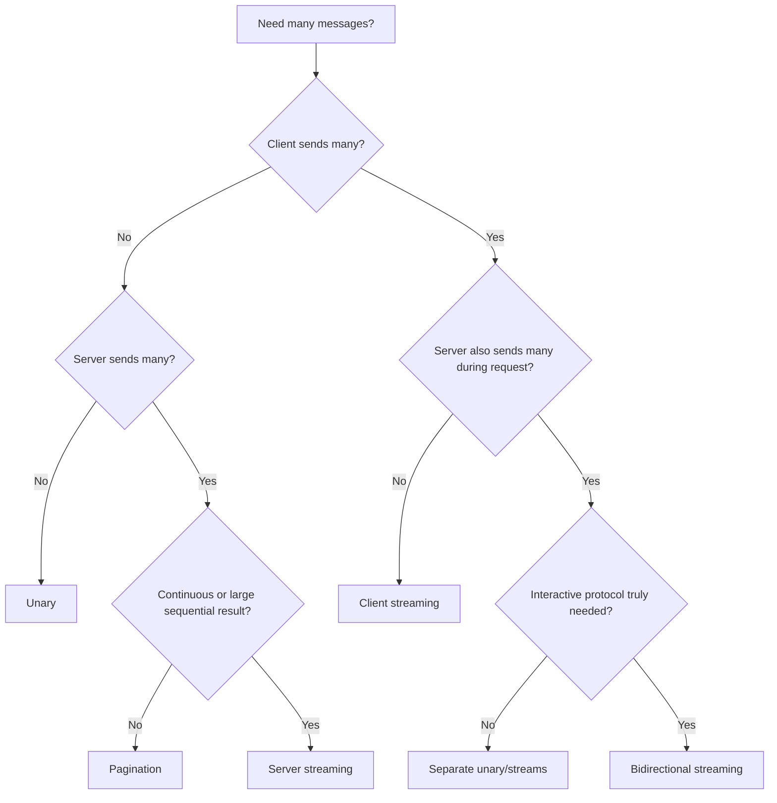

# Part 056 — gRPC Streaming Patterns in Java

gRPC supports more than request-response.

It supports four RPC shapes:

- unary,
- server streaming,
- client streaming,
- bidirectional streaming.

Unary is easiest to reason about.

Streaming is powerful and dangerous.

Streaming can reduce latency, avoid polling, support large result sets, and enable realtime coordination. It can also create long-lived resource leaks, hard-to-debug cancellation, broken flow control, memory pressure, backpressure bugs, and ordering assumptions that do not hold.

The production rule:

> Use streaming when stream semantics are part of the domain, not because it looks advanced.

---

## 1. The Four gRPC Method Types

In `.proto`:

```proto
service CaseEventService {
  rpc GetCase(GetCaseRequest) returns (GetCaseResponse);

  rpc ListCaseEvents(ListCaseEventsRequest) returns (stream CaseEvent);

  rpc UploadCaseEvents(stream UploadCaseEventRequest) returns (UploadCaseEventsResponse);

  rpc WatchCaseEvents(stream WatchCaseEventsRequest) returns (stream CaseEvent);
}
```

| Type | Request | Response | Use case |
|---|---|---|---|
| Unary | one | one | normal request-response |
| Server streaming | one | many | list/watch events, large result stream |
| Client streaming | many | one | upload/aggregate many messages |
| Bidirectional streaming | many | many | interactive protocol, realtime exchange |

gRPC Java generated code uses `StreamObserver` heavily for these shapes.

---

## 2. StreamObserver Mental Model

`StreamObserver<T>` has three methods:

```java
public interface StreamObserver<V> {
    void onNext(V value);
    void onError(Throwable t);
    void onCompleted();
}
```

Lifecycle rules:

```text
zero or more onNext
then exactly one terminal event:
  onCompleted
  or onError
```

After terminal event:

```text
no more onNext
no more onError
no more onCompleted
```

Violating this lifecycle causes subtle bugs.

Always design stream state machine explicitly.

---

## 3. Server Streaming

Proto:

```proto
rpc ListCaseEvents(ListCaseEventsRequest) returns (stream CaseEvent);
```

Generated server method:

```java
@Override
public void listCaseEvents(
    ListCaseEventsRequest request,
    StreamObserver<CaseEvent> responseObserver
) {
    // send zero or more responseObserver.onNext(...)
    // then responseObserver.onCompleted()
}
```

Basic implementation:

```java
@Override
public void listCaseEvents(
    ListCaseEventsRequest request,
    StreamObserver<CaseEvent> responseObserver
) {
    try {
        CaseId caseId = mapper.toCaseId(request.getCaseId());

        for (CaseEventView event : useCase.listEvents(caseId)) {
            if (Context.current().isCancelled()) {
                return;
            }

            responseObserver.onNext(mapper.toProto(event));
        }

        responseObserver.onCompleted();
    } catch (RuntimeException ex) {
        responseObserver.onError(errorMapper.toStatusRuntimeException(ex));
    }
}
```

Good for:

- list of results too large for one response,
- event history,
- server push updates,
- progress updates,
- chunked export.

But streaming is not a replacement for pagination in every case.

---

## 4. Client Consuming Server Stream

Blocking style:

```java
Iterator<CaseEvent> events = blockingStub
    .withDeadlineAfter(5, TimeUnit.SECONDS)
    .listCaseEvents(request);

while (events.hasNext()) {
    CaseEvent event = events.next();
    handle(event);
}
```

Risks:

- `hasNext()` can block,
- deadline still matters,
- handler must be fast or bounded,
- cancellation is less explicit,
- large streams can hold resources for long time.

Async style:

```java
asyncStub.listCaseEvents(request, new StreamObserver<CaseEvent>() {
    @Override
    public void onNext(CaseEvent value) {
        handle(value);
    }

    @Override
    public void onError(Throwable t) {
        handleError(t);
    }

    @Override
    public void onCompleted() {
        complete();
    }
});
```

Async style gives better lifecycle hooks but requires more discipline.

---

## 5. Client Streaming

Proto:

```proto
rpc UploadCaseEvents(stream UploadCaseEventRequest) returns (UploadCaseEventsResponse);
```

Generated server method returns a request observer:

```java
@Override
public StreamObserver<UploadCaseEventRequest> uploadCaseEvents(
    StreamObserver<UploadCaseEventsResponse> responseObserver
) {
    return new StreamObserver<>() {
        @Override
        public void onNext(UploadCaseEventRequest value) {
            // receive one message
        }

        @Override
        public void onError(Throwable t) {
            // client aborted or error
        }

        @Override
        public void onCompleted() {
            // client finished sending
            responseObserver.onNext(response);
            responseObserver.onCompleted();
        }
    };
}
```

Use for:

- uploading many records,
- aggregating client-side events,
- chunking large logical input,
- sending telemetry batches.

Risks:

- server must cap count/bytes/time,
- partial upload failure semantics,
- idempotency across stream,
- backpressure,
- memory accumulation,
- client cancellation.

Do not buffer unbounded client stream in memory.

---

## 6. Bidirectional Streaming

Proto:

```proto
rpc WatchCaseEvents(stream WatchCaseEventsRequest) returns (stream CaseEvent);
```

Generated server method:

```java
@Override
public StreamObserver<WatchCaseEventsRequest> watchCaseEvents(
    StreamObserver<CaseEvent> responseObserver
) {
    return new StreamObserver<>() {
        @Override
        public void onNext(WatchCaseEventsRequest request) {
            // receive client message and maybe send response
        }

        @Override
        public void onError(Throwable t) {
            cleanup();
        }

        @Override
        public void onCompleted() {
            responseObserver.onCompleted();
        }
    };
}
```

Bidirectional streaming is the hardest shape.

Use it when:

- both sides send messages independently,
- protocol is interactive,
- long-lived watch/control channel is needed,
- client can update subscription dynamically,
- server pushes events over same stream.

Avoid it when unary or server-streaming is enough.

---

## 7. Streaming Is a Protocol, Not Just Many Messages

A stream needs a protocol.

Define:

- first message expectations,
- authentication/authorization scope,
- subscription changes,
- acknowledgement behavior,
- heartbeats,
- ordering guarantees,
- retry/resume behavior,
- cancellation behavior,
- error statuses,
- max stream lifetime,
- idle timeout,
- max messages,
- schema evolution.

Example watch protocol:

```proto
message WatchCaseEventsRequest {
  oneof request {
    Subscribe subscribe = 1;
    Acknowledge acknowledge = 2;
    Heartbeat heartbeat = 3;
  }
}

message Subscribe {
  string case_id = 1;
  string resume_token = 2;
}

message Acknowledge {
  string event_id = 1;
}

message Heartbeat {
  int64 client_time_unix_ms = 1;
}
```

If you do not define the protocol, clients will invent one.

---

## 8. Ordering Guarantees

Streaming often creates ordering assumptions.

Questions:

- Are messages ordered by creation time?
- Are messages ordered by commit sequence?
- Are messages ordered per key or globally?
- Can duplicates happen?
- Can gaps happen?
- Can messages be replayed?
- Can clients resume from a token?
- Can server reorder after retry/reconnect?

Example contract:

```text
Events are ordered by monotonically increasing case_event_sequence per case_id.
Ordering is guaranteed only within a single case_id.
Clients must tolerate duplicate events after reconnect.
resume_token is opaque and represents the last delivered event.
```

This is much better than saying:

```text
the stream returns events
```

---

## 9. At-Least-Once vs Exactly-Once Stream Delivery

Network streams fail.

Clients reconnect.

Servers restart.

Messages may be duplicated.

Exactly-once delivery across distributed streaming is expensive and rarely what gRPC itself gives you.

Design client behavior as:

```text
at-least-once delivery + idempotent consumer
```

Use:

- event ID,
- sequence number,
- resume token,
- deduplication,
- idempotent handler,
- checkpoint/ack if needed.

Example event:

```proto
message CaseEvent {
  string event_id = 1;
  string case_id = 2;
  int64 sequence = 3;
  google.protobuf.Timestamp occurred_at = 4;
  oneof payload {
    CaseCreated case_created = 10;
    CaseEscalated case_escalated = 11;
  }
}
```

Event identity is not optional in production streams.

---

## 10. Resume Tokens

For long-lived streams, reconnect is normal.

A resume token allows continuation.

```proto
message ListCaseEventsRequest {
  string case_id = 1;
  string resume_token = 2;
  int32 page_size = 3;
}
```

Response event:

```proto
message CaseEvent {
  string event_id = 1;
  string resume_token = 2;
}
```

Rules:

- token is opaque,
- token has expiry,
- token is scoped by caller/tenant/query,
- token should not contain sensitive data in plaintext,
- client must not construct it,
- server may reject invalid/expired token with `FAILED_PRECONDITION` or `INVALID_ARGUMENT`.

Resume semantics are part of stream contract.

---

## 11. Backpressure and Flow Control

The gRPC flow control guide explains that flow control prevents a receiver from being overwhelmed by a fast sender and applies to streaming RPCs, not unary RPCs.

In Java, the basic `StreamObserver` API hides much of the flow-control complexity.

For advanced control, use `ClientCallStreamObserver` or `ServerCallStreamObserver`.

Conceptual server-side readiness:

```java
ServerCallStreamObserver<CaseEvent> serverObserver =
    (ServerCallStreamObserver<CaseEvent>) responseObserver;

serverObserver.setOnCancelHandler(this::cleanup);

if (serverObserver.isReady()) {
    serverObserver.onNext(event);
}
```

But manual flow control is subtle.

Do not implement it casually.

---

## 12. Manual Flow Control

Manual flow control can be useful when:

- producer is faster than consumer,
- messages are large,
- stream can be long-lived,
- memory must be tightly controlled,
- client processing speed varies.

Client-side request control concept:

```java
ClientResponseObserver<Request, Response> observer =
    new ClientResponseObserver<>() {
        private ClientCallStreamObserver<Request> requestStream;

        @Override
        public void beforeStart(ClientCallStreamObserver<Request> requestStream) {
            this.requestStream = requestStream;
            requestStream.disableAutoInboundFlowControl();
        }

        @Override
        public void onNext(Response value) {
            handle(value);
            requestStream.request(1);
        }

        @Override
        public void onError(Throwable t) {
            handleError(t);
        }

        @Override
        public void onCompleted() {
            complete();
        }
    };
```

This is advanced.

Prefer default flow control until you have a measured need.

---

## 13. Thread Safety

`StreamObserver` implementations are not a license to call `onNext` concurrently from many threads.

If multiple threads produce messages, serialize access.

Bad:

```java
parallelStream.forEach(event -> responseObserver.onNext(event));
```

Better:

- single writer thread,
- queue + writer loop,
- synchronize carefully,
- use ordered executor,
- design stream producer as sequential.

gRPC stream writes should be treated as a stateful output channel.

Concurrent writes can corrupt lifecycle assumptions.

---

## 14. Memory Safety

Streaming can still run out of memory.

Anti-pattern:

```java
List<CaseEvent> allEvents = repository.loadAllEvents(caseId);
for (CaseEvent event : allEvents) {
    responseObserver.onNext(event);
}
```

Better:

- cursor/iterator from database,
- bounded page fetch,
- release resources promptly,
- do not hold large transaction open,
- respect cancellation,
- stream from object storage if appropriate,
- cap maximum messages.

But be careful with database cursors.

A long stream holding a DB transaction can hurt the database.

Often better:

```text
fetch page
send page messages
fetch next page
```

with cancellation checks.

---

## 15. Deadlines and Stream Lifetime

Unary deadline:

```text
300 ms
```

Stream deadline:

```text
maybe 30 seconds, 5 minutes, or explicit subscription lifetime
```

Streaming policy should define:

- max stream lifetime,
- idle timeout,
- heartbeat interval,
- max messages,
- reconnect behavior,
- resume token support.

Example:

```yaml
streaming:
  watchCaseEvents:
    maxStreamDuration: 5m
    idleTimeout: 30s
    heartbeatInterval: 10s
    maxMessagesPerStream: 10000
    resumeTokenRequiredAfterReconnect: true
```

Do not leave streams unbounded.

---

## 16. Cancellation

Streaming cancellation is common.

Client disconnects.

Deadline expires.

User navigates away.

Network breaks.

Server shutting down.

Server must cleanup:

```java
ServerCallStreamObserver<CaseEvent> observer =
    (ServerCallStreamObserver<CaseEvent>) responseObserver;

observer.setOnCancelHandler(() -> {
    subscription.close();
    metrics.incrementCancelled();
});
```

Also check:

```java
if (Context.current().isCancelled()) {
    cleanup();
    return;
}
```

Cancellation is normal stream lifecycle.

It should not always be logged as an error.

---

## 17. Error Semantics in Streams

If a stream fails halfway through, the client may have processed some messages.

Example:

```text
server sends events 1..50
then stream ends with UNAVAILABLE
```

Client must know whether to:

- keep processed messages,
- reconnect from event 50,
- discard partial result,
- retry whole stream,
- mark stream failed.

Define partial progress semantics.

For event streams:

```text
messages already delivered are valid
client should resume from last acknowledged event
```

For aggregate upload:

```text
server response only emitted after all messages processed
partial upload may be discarded unless idempotency/session token says otherwise
```

Streaming error semantics must be explicit.

---

## 18. Client Streaming Upload Semantics

For client streaming, decide:

- are messages processed as they arrive?
- are they buffered until completion?
- can partial upload commit?
- is there an upload session ID?
- can client retry from offset?
- what happens if client disconnects?
- is `onCompleted` required to commit?
- are duplicates possible?

Safe pattern:

```text
client sends upload_id
server validates each chunk
server stages chunks
onCompleted commits if all valid
if stream fails, staged chunks expire
retry uses same upload_id and chunk sequence
```

Proto:

```proto
message UploadCaseAttachmentChunk {
  string upload_id = 1;
  int64 chunk_index = 2;
  bytes data = 3;
  bool final_chunk = 4;
}
```

Do not design client streaming upload without idempotency/chunk identity.

---

## 19. Server Streaming vs Pagination

When should you use server streaming instead of pagination?

Use server streaming when:

- client wants continuous sequence,
- server can produce incrementally,
- low latency first item matters,
- stream processing is natural,
- result set is large but bounded,
- connection can remain open safely.

Use pagination when:

- client/UI navigates pages,
- result can be cached,
- request-response semantics are simpler,
- consumers need random access,
- operation crosses gateways that do not handle streaming well,
- client language/runtime is not stream-friendly.

Streaming is not automatically better.

Pagination is often more operable.

---

## 20. Streaming and Gateways

If traffic crosses:

- API gateway,
- service mesh,
- load balancer,
- corporate proxy,
- browser boundary,
- mobile network,

streaming behavior may change.

Check:

- idle timeout,
- max stream duration,
- HTTP/2 support,
- flow control,
- buffering,
- retries,
- observability,
- connection draining,
- deploy behavior.

A stream that works in local tests may fail behind infrastructure with a 60-second idle timeout.

Operational topology matters.

---

## 21. Keepalive and Heartbeats

Long streams need liveness signals.

Options:

- HTTP/2 keepalive,
- application heartbeat message,
- periodic server ping event,
- client heartbeat request.

Application heartbeat is useful when consumers need protocol-level liveness.

Example:

```proto
message CaseEvent {
  oneof event {
    Heartbeat heartbeat = 1;
    CaseUpdated case_updated = 2;
  }
}

message Heartbeat {
  google.protobuf.Timestamp server_time = 1;
}
```

Do not use heartbeats so frequently that they become load.

Use them to prevent idle timeouts and detect broken streams.

---

## 22. Streaming Observability

Metrics:

```text
grpc.streams.open{method}
grpc.streams.started.total{method}
grpc.streams.completed.total{method,status}
grpc.streams.cancelled.total{method,reason}
grpc.streams.duration{method,status}
grpc.stream.messages.sent.total{method}
grpc.stream.messages.received.total{method}
grpc.stream.message.size{method,direction}
grpc.stream.backpressure.wait{method}
grpc.stream.resume.total{method}
grpc.stream.errors.total{method,status}
```

Important dimensions:

- method,
- direction,
- status,
- caller service,
- stream type.

Avoid:

- stream ID,
- resource ID,
- user ID,
- event ID as metric labels.

Logs should be sampled for high-volume streams.

---

## 23. Streaming Alerts

Useful alerts:

| Alert | Meaning |
|---|---|
| open streams near limit | capacity pressure |
| stream cancellations spike | client/network/deploy issue |
| stream duration too long | leak or missing lifetime |
| message rate drops | producer/consumer issue |
| message size spikes | schema/use-case change |
| backpressure wait high | slow consumers |
| resume failures high | token/state bug |
| stream errors `UNAVAILABLE` high | infrastructure/provider issue |
| heartbeat timeout high | broken connection path |

Streaming requires different dashboards from unary calls.

---

## 24. Server Streaming Test

In-process test:

```java
@Test
void streamsCaseEventsInOrder() {
    ListCaseEventsRequest request = ListCaseEventsRequest.newBuilder()
        .setCaseId("CASE-100")
        .build();

    Iterator<CaseEvent> iterator = blockingStub.listCaseEvents(request);

    List<String> eventIds = new ArrayList<>();
    while (iterator.hasNext()) {
        eventIds.add(iterator.next().getEventId());
    }

    assertThat(eventIds).containsExactly("evt-1", "evt-2", "evt-3");
}
```

Test order if order is contract.

Do not assume order without test.

---

## 25. Cancellation Test

```java
@Test
void serverCleansUpWhenClientCancelsStream() {
    AtomicBoolean cleanupCalled = new AtomicBoolean(false);

    // fake service sets OnCancelHandler -> cleanupCalled.set(true)
    // client starts async stream then cancels

    assertThat(cleanupCalled).isTrue();
}
```

Cancellation tests are essential for long-lived streams.

Leaks often only appear under disconnects and deploys.

---

## 26. Client Streaming Test

```java
@Test
void uploadsChunksAndReturnsSummary() {
    CountDownLatch completed = new CountDownLatch(1);
    AtomicReference<UploadCaseEventsResponse> responseRef = new AtomicReference<>();

    StreamObserver<UploadCaseEventsResponse> responseObserver = new StreamObserver<>() {
        @Override
        public void onNext(UploadCaseEventsResponse value) {
            responseRef.set(value);
        }

        @Override
        public void onError(Throwable t) {
            fail(t);
        }

        @Override
        public void onCompleted() {
            completed.countDown();
        }
    };

    StreamObserver<UploadCaseEventRequest> requestObserver =
        asyncStub.uploadCaseEvents(responseObserver);

    requestObserver.onNext(chunk(1));
    requestObserver.onNext(chunk(2));
    requestObserver.onCompleted();

    assertThat(completed.await(1, TimeUnit.SECONDS)).isTrue();
    assertThat(responseRef.get().getAcceptedCount()).isEqualTo(2);
}
```

Also test failure before `onCompleted`.

---

## 27. Bidirectional Stream Test

For bidi streams, test protocol state machine.

Scenarios:

- subscribe first,
- send heartbeat,
- receive event,
- acknowledge event,
- reconnect with resume token,
- send invalid message order,
- server returns appropriate status,
- cancellation cleanup.

Bidi streams are protocols.

Testing only "connect and receive one message" is not enough.

---

## 28. Load Testing Streams

Streaming load tests:

- thousands of open idle streams,
- high message rate,
- slow consumers,
- client disconnect storm,
- server rolling deploy,
- network interruption,
- large messages,
- resume after server restart,
- backpressure,
- downstream database/cursor pressure.

Questions:

- memory per stream?
- CPU per message?
- max safe open streams?
- cleanup after cancellation?
- message latency under load?
- can deployment drain streams?
- do clients reconnect safely?
- do duplicates happen?

Streaming capacity is not unary capacity.

Measure it separately.

---

## 29. Production Streaming Policy Template

```yaml
grpcStreaming:
  listCaseEvents:
    type: server-streaming
    maxStreamDurationMs: 30000
    maxMessagesPerStream: 1000
    maxMessageBytes: 1048576
    ordering: per-case-sequence
    cancellationRequired: true
    resumeToken: optional
    deadlineRequired: true
    fallback: fail-fast

  uploadCaseEvents:
    type: client-streaming
    maxStreamDurationMs: 60000
    maxMessagesPerStream: 10000
    maxInboundBytes: 10485760
    uploadIdRequired: true
    chunkSequenceRequired: true
    commitOnCompletedOnly: true
    partialCommitAllowed: false

  watchCaseEvents:
    type: bidirectional-streaming
    maxStreamDurationMs: 300000
    idleTimeoutMs: 30000
    heartbeatIntervalMs: 10000
    resumeTokenRequired: true
    duplicateDeliveryPossible: true
    clientMustDeduplicate: true
```

Every stream should have explicit limits.

---

## 30. Common Anti-Patterns

### 30.1 Streaming because it is cool

Unary or pagination would be simpler and safer.

### 30.2 Unbounded stream lifetime

Resource leak.

### 30.3 No cancellation cleanup

Disconnected clients keep server work alive.

### 30.4 No max message count/size

Memory and abuse risk.

### 30.5 Concurrent `onNext` from many threads

Stream lifecycle corruption.

### 30.6 No resume semantics

Reconnect loses or duplicates data unpredictably.

### 30.7 Empty stream means success?

Could mean no data or failure hidden by bad design.

### 30.8 Holding DB transaction for whole stream

Database pressure and lock risk.

### 30.9 No flow-control awareness

Fast producer overwhelms slow consumer.

### 30.10 No streaming-specific metrics

Unary dashboard misses stream leaks.

---

## 31. Decision Model



Choose the simplest RPC shape that matches the domain.

---

## 32. Design Checklist

Before shipping a streaming RPC:

- Why is streaming needed?
- What stream type is used?
- What is max stream duration?
- What is idle timeout?
- What is max message count?
- What is max message size?
- What ordering is guaranteed?
- Are duplicates possible?
- Is resume supported?
- Is resume token opaque and scoped?
- What happens on mid-stream failure?
- Does client deduplicate?
- Does server observe cancellation?
- Is flow control/backpressure understood?
- Are writes serialized?
- Are database resources bounded?
- Are heartbeats needed?
- Are gateway/load balancer timeouts compatible?
- Are streaming metrics/alerts configured?
- Are cancellation/reconnect/load tests included?

---

## 33. The Real Lesson

Streaming is not "unary but more advanced."

Streaming is a long-lived communication protocol.

It requires lifecycle thinking:

```text
start
messages
ordering
flow control
cancellation
error
resume
completion
cleanup
```

Use gRPC streaming when that protocol is worth the operational cost.

When it is not, use unary or pagination.

Top-tier engineers do not choose streaming for elegance.

They choose it when the domain needs a stream and the system is ready to operate one.

---

## References

- gRPC Core Concepts: https://grpc.io/docs/what-is-grpc/core-concepts/
- gRPC Java Generated-Code Reference: https://grpc.io/docs/languages/java/generated-code/
- gRPC Java StreamObserver Javadoc: https://grpc.github.io/grpc-java/javadoc/io/grpc/stub/StreamObserver.html
- gRPC Flow Control Guide: https://grpc.io/docs/guides/flow-control/
- gRPC Cancellation Guide: https://grpc.io/docs/guides/cancellation/
- gRPC Deadlines Guide: https://grpc.io/docs/guides/deadlines/
- gRPC Performance Best Practices: https://grpc.io/docs/guides/performance/
