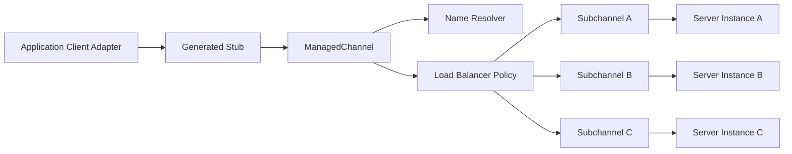
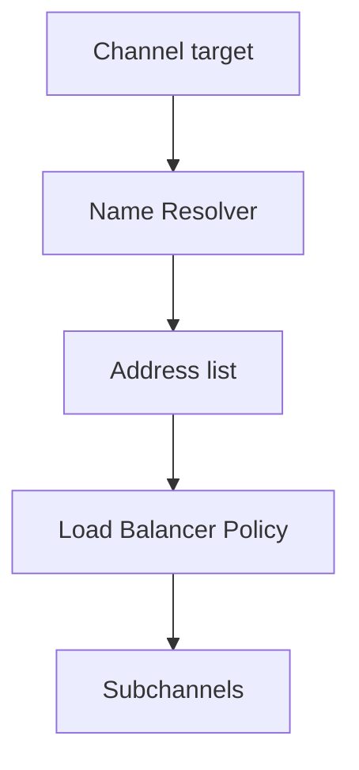
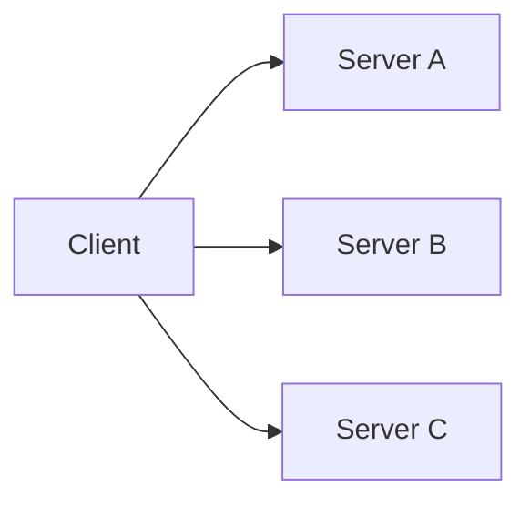
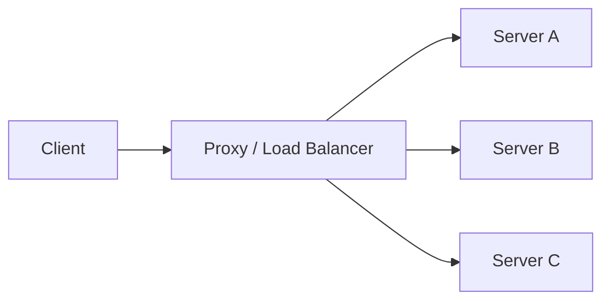
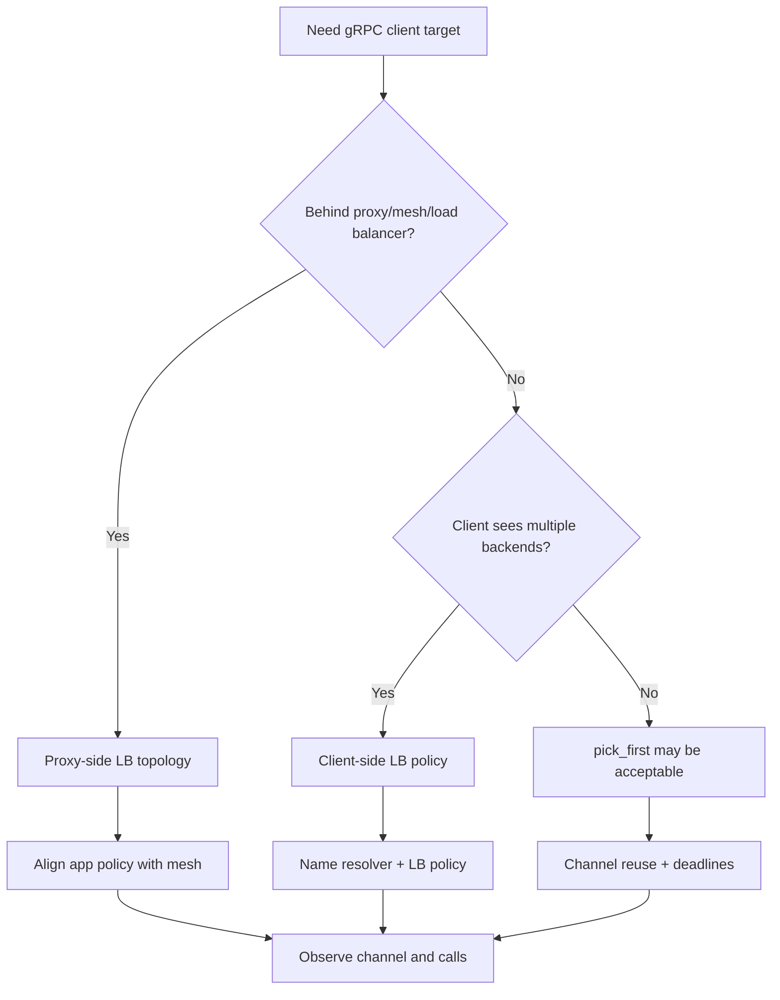

# Part 057 — gRPC Load Balancing, Name Resolution, and Channel Management

A gRPC client does not just call a URL.

A gRPC client uses a channel.

A channel is a stateful abstraction that manages:

- name resolution,
- connections,
- subchannels,
- load balancing,
- connectivity state,
- HTTP/2 transport,
- TLS,
- keepalive,
- retries/hedging if configured,
- deadlines,
- shutdown.

If you treat a gRPC channel like a disposable HTTP request object, you will create latency, connection churn, uneven load, retry amplification, and deployment instability.

The production mindset is:

> A gRPC channel is infrastructure state. Own it, reuse it, observe it, and shut it down deliberately.

---

## 1. The Core Architecture



The stub is a typed API facade.

The channel is the transport manager.

The name resolver turns a target name into addresses.

The load balancer chooses which subchannel/address handles each RPC.

The connection layer maintains HTTP/2 connections.

A production gRPC client must understand all of these layers enough to avoid accidental behavior.

---

## 2. Channel Is Not Request

Bad:

```java
public GetCaseResponse getCase(GetCaseRequest request) {
    ManagedChannel channel = ManagedChannelBuilder
        .forAddress("case-service.internal", 9090)
        .usePlaintext()
        .build();

    try {
        return CaseServiceGrpc.newBlockingStub(channel).getCase(request);
    } finally {
        channel.shutdownNow();
    }
}
```

This creates:

- DNS resolution per call,
- connection setup per call,
- TLS handshake per call if TLS enabled,
- poor HTTP/2 reuse,
- high latency,
- load balancer confusion,
- resource churn.

Good:

```java
public final class CaseGrpcClient implements AutoCloseable {
    private final ManagedChannel channel;
    private final CaseServiceGrpc.CaseServiceBlockingStub stub;

    public CaseGrpcClient(ManagedChannel channel) {
        this.channel = channel;
        this.stub = CaseServiceGrpc.newBlockingStub(channel);
    }

    public GetCaseResponse getCase(GetCaseRequest request, Duration deadline) {
        return stub.withDeadlineAfter(deadline.toMillis(), TimeUnit.MILLISECONDS)
            .getCase(request);
    }

    @Override
    public void close() throws InterruptedException {
        channel.shutdown();
        if (!channel.awaitTermination(10, TimeUnit.SECONDS)) {
            channel.shutdownNow();
        }
    }
}
```

Create channel at application startup.

Reuse it.

Close it at application shutdown.

---

## 3. Channel Target

A target string identifies where the channel should connect.

Examples:

```java
ManagedChannelBuilder.forAddress("case-service.internal", 9090)
```

or:

```java
ManagedChannelBuilder.forTarget("dns:///case-service.internal:9090")
```

The target may include a scheme that determines name resolution.

Conceptual examples:

| Target | Meaning |
|---|---|
| `dns:///case-service.internal:9090` | DNS name resolver |
| `xds:///case-service` | xDS/service-mesh/control-plane style target where supported |
| `static:///host1,host2` | custom/static resolver if implemented |
| `localhost:9090` | local direct target |

Be explicit.

If your platform uses DNS, understand DNS caching and refresh behavior.

If your platform uses xDS/service mesh, understand who owns endpoint discovery and policy.

---

## 4. Name Resolution

Name resolution answers:

> Which backend addresses does this logical service name currently represent?

The gRPC custom name resolution guide describes standard name resolution and custom name resolver implementations.

A resolver may return:

- one address,
- many addresses,
- attributes,
- service config,
- load-balancing config.



In dynamic platforms, address lists change:

- pods start,
- pods terminate,
- endpoints become unhealthy,
- zone failover happens,
- service discovery updates,
- DNS records refresh.

A gRPC client must handle endpoint churn.

---

## 5. Load Balancing Policy

A gRPC load balancing policy receives backend addresses from the resolver and chooses connections for RPCs.

The gRPC custom load balancing guide describes a load balancing policy as receiving a list of server IP addresses from the name resolver, maintaining subchannels, and picking a connection when an RPC is sent.

Common policies:

| Policy | Behavior |
|---|---|
| `pick_first` | connect to one address and use it until failure |
| `round_robin` | distribute RPCs across ready subchannels |
| custom policy | platform-specific selection, locality, health, weights |

`pick_first` can be fine when an external load balancer sits behind one address.

`round_robin` is often useful when the client sees multiple backend addresses directly.

But policy must match deployment topology.

Do not blindly copy `round_robin`.

Do not blindly accept `pick_first`.

---

## 6. Client-Side vs Proxy-Side Load Balancing

### Client-side load balancing

Client sees multiple backend addresses and chooses.



Pros:

- avoids central proxy bottleneck,
- direct visibility to backends,
- can use gRPC-aware policy,
- can integrate with xDS.

Cons:

- more complex clients,
- name resolution must be correct,
- each client maintains connections,
- policy rollout across many clients.

### Proxy-side load balancing

Client connects to one proxy/load balancer.



Pros:

- centralized policy,
- simpler clients,
- easier traffic management,
- easier cross-language consistency.

Cons:

- proxy can bottleneck,
- connection stickiness can affect balancing,
- extra hop,
- less client visibility.

Choose deliberately.

---

## 7. HTTP/2 Connection Multiplexing

gRPC uses HTTP/2.

HTTP/2 can multiplex multiple streams over a connection.

This changes load balancing behavior.

If a client opens one HTTP/2 connection to one backend and sends many RPCs on it, all those RPCs may go to one backend even if DNS contains many addresses.

That is why `pick_first` can cause uneven load when the client directly resolves multiple backends.

For direct-to-pod style communication, `round_robin` can distribute calls across multiple subchannels.

For proxy/load-balancer style communication, the proxy may manage balancing.

Understand where the balancing actually happens.

---

## 8. Kubernetes Considerations

In Kubernetes, you may connect to:

- ClusterIP service,
- headless service,
- service mesh sidecar,
- gateway,
- direct pod DNS,
- xDS-aware control plane.

Different topology, different client behavior.

### ClusterIP Service

Client sees one stable virtual IP/name.

Kubernetes service/load balancer handles routing.

`pick_first` may be acceptable because the client connects to one virtual endpoint, but HTTP/2 connection stickiness can still interact with kube-proxy/load balancer behavior.

### Headless Service

Client may resolve multiple pod IPs.

Client-side load balancing becomes more relevant.

### Service Mesh

Client may connect to localhost sidecar.

Mesh handles discovery, mTLS, retries, load balancing, circuit breaking.

Application-level gRPC policy must align with mesh policy.

Hidden mesh retry plus application retry can multiply attempts.

---

## 9. Service Config

gRPC service config lets service owners provide client behavior configuration for a target, including method-specific behavior such as load balancing and retry in supported stacks.

This can centralize behavior.

But there is risk:

- behavior may be hidden from application code,
- retry semantics may lack business context,
- method config may drift from application policy,
- service config may be ignored by some clients,
- rollout can affect many clients.

Use service config for platform-level behavior only when governance is strong.

For business-sensitive operations, keep semantic retry/idempotency/fallback in owned client adapter.

---

## 10. ManagedChannel Connectivity States

A channel has connectivity states.

Conceptually:

| State | Meaning |
|---|---|
| `IDLE` | no active connection |
| `CONNECTING` | attempting to establish connection |
| `READY` | ready to send RPCs |
| `TRANSIENT_FAILURE` | temporary failure; will retry connecting |
| `SHUTDOWN` | channel closed |

Observe state for diagnostics.

Do not write business logic that constantly polls channel state to decide whether to call.

Use deadline, status handling, circuit breaker, and health signals.

But during incidents, channel state helps identify:

- DNS issue,
- TLS issue,
- server unavailable,
- network partition,
- shutdown misuse.

---

## 11. Channel Warmup

Cold channels can add latency:

- DNS resolution,
- TCP connection,
- TLS handshake,
- HTTP/2 preface,
- authentication,
- load balancer/subchannel readiness.

For critical clients, warmup can reduce first-call latency.

Options:

- create channel at startup,
- make lightweight health/check call,
- wait for channel readiness if appropriate,
- avoid blocking readiness on too many dependencies,
- use lazy warmup for non-critical dependencies.

Be careful:

> If every service warms every dependency at the same time during deployment, you can create startup storms.

Warmup must be bounded.

---

## 12. Keepalive

gRPC keepalive uses HTTP/2 PING frames to keep connections alive even when no data is being transferred.

Keepalive can help:

- detect dead connections,
- keep connections through NAT/load balancer idle timeouts,
- reduce cold reconnection latency,
- detect broken networks.

But aggressive keepalive can harm servers and networks.

Bad:

```text
keepalive ping every 1 second from thousands of clients
```

Good:

```text
keepalive interval aligned with infrastructure idle timeouts and server policy
```

Client/server keepalive policy must be coordinated.

The official keepalive guide warns that keepalive interval must be configured carefully.

---

## 13. Keepalive Configuration Sketch

Conceptual client config:

```java
ManagedChannel channel = ManagedChannelBuilder
    .forTarget("dns:///case-service.internal:9090")
    .keepAliveTime(30, TimeUnit.SECONDS)
    .keepAliveTimeout(5, TimeUnit.SECONDS)
    .keepAliveWithoutCalls(false)
    .build();
```

Interpretation:

- send keepalive pings only after interval,
- wait timeout for ping response,
- avoid pings when no calls unless explicitly required.

Do not enable `keepAliveWithoutCalls(true)` casually.

It can create background traffic across the whole fleet.

Coordinate with server's minimum permitted keepalive time.

---

## 14. Idle Timeout

Idle timeout lets channel release resources when unused.

```java
ManagedChannel channel = ManagedChannelBuilder
    .forTarget(target)
    .idleTimeout(5, TimeUnit.MINUTES)
    .build();
```

Useful for:

- many optional dependencies,
- low-traffic clients,
- reducing open connections,
- avoiding stale connections.

Risk:

- first call after idle pays reconnect cost.

Set based on traffic pattern.

High-volume critical clients may stay warm.

Low-volume optional clients can idle.

---

## 15. Max Inbound Message Size

Channel should align with server message size.

```java
ManagedChannel channel = ManagedChannelBuilder
    .forTarget(target)
    .maxInboundMessageSize(4 * 1024 * 1024)
    .build();
```

If server sends larger response, client may fail.

Do not solve by setting huge limits globally.

Instead:

- design pagination/streaming,
- split large payloads,
- use object storage for large blobs,
- compress carefully,
- set operation-specific limits.

Message size is part of communication contract.

---

## 16. Channel Per Dependency, Not Per Method

Usually:

```text
one channel per target/dependency/security identity
```

Not:

```text
one channel per call
one channel per method
one channel per request
```

But multiple channels can make sense when:

- different credentials,
- different priority class,
- different locality,
- different load-balancing policy,
- separate bulkhead/isolation,
- separate high-volume streaming path,
- separate external provider target.

Avoid accidental channel explosion.

Many channels mean many connections and more resource overhead.

---

## 17. Stub Lifecycle

Stubs are cheap wrappers over channels.

Base stub can be reused.

Per-call options create derived stub:

```java
CaseServiceBlockingStub callStub = baseStub
    .withDeadlineAfter(300, TimeUnit.MILLISECONDS)
    .withCallCredentials(credentials);
```

Do not mutate global state.

Do not store request-specific stub as singleton.

Stubs are generated convenience objects; channel is the main lifecycle object.

---

## 18. Channel Shutdown

On application shutdown:

```java
channel.shutdown();

if (!channel.awaitTermination(10, TimeUnit.SECONDS)) {
    channel.shutdownNow();
}
```

Rules:

- stop accepting new work first,
- allow in-flight RPCs to finish within grace period,
- cancel after grace period,
- integrate with Kubernetes termination,
- emit shutdown metrics/logs.

Do not call `shutdownNow()` immediately on normal deploy unless you intentionally cancel in-flight calls.

---

## 19. Rolling Deployments

gRPC channels can hold long-lived HTTP/2 connections.

During server rolling deployment:

- old pods receive termination signal,
- readiness should go false,
- load balancer stops new traffic,
- existing connections may drain,
- clients should reconnect to new pods,
- streams may be cancelled or ended,
- client retry/reconnect policy matters.

If clients hold one connection forever to an old backend, draining behavior matters.

Test rolling deploys with real gRPC clients and streaming calls.

---

## 20. Health Checking and Load Balancing

gRPC health checking can be used by load balancers and clients where supported.

Health state can help avoid routing to unavailable backends.

But health is not business correctness.

A backend may be technically serving but overloaded.

Use health with:

- circuit breaker,
- load shedding,
- outlier detection,
- readiness,
- metrics.

Do not make health checks expensive.

Do not call every dependency in every health check.

---

## 21. Outlier Detection

Some platforms support detecting bad endpoints and avoiding them.

Examples:

- server returns many failures,
- connection errors,
- high latency,
- unhealthy health state.

Outlier detection can be in:

- service mesh,
- client-side policy,
- load balancer,
- gateway.

Coordinate with circuit breaker.

If both client and mesh eject endpoints aggressively, traffic may concentrate unexpectedly.

---

## 22. Retry, Hedging, and Load Balancing

Retry and hedging interact with load balancing.

Retry should ideally choose a different healthy backend when the failure may be backend-specific.

Hedging should send the hedge to an equivalent but distinct backend if possible.

But:

- retrying commands needs idempotency,
- hedging reads needs consistency analysis,
- retries/hedges increase load,
- load balancer choice may not be visible to application.

If service mesh controls retry/hedging, application may not know attempts happened.

This affects idempotency, metrics, and incident analysis.

---

## 23. Name Resolution and DNS TTL

DNS-based service discovery has operational behavior:

- resolver caches records,
- JVM/network stack may cache DNS,
- gRPC resolver refreshes on policy/events,
- Kubernetes endpoint changes may not instantly reach all clients,
- DNS TTL may be ignored by some layers,
- frequent DNS refresh has overhead.

Do not assume DNS updates are immediate.

Test:

- pod removal,
- pod addition,
- DNS record change,
- zone failover,
- stale endpoint handling.

---

## 24. Java DNS and Resolver Pitfalls

Java applications can be affected by JVM DNS cache settings and OS resolver behavior.

Potential issues:

- stale addresses after pod restart,
- excessive DNS queries,
- slow resolver causing connection delay,
- different behavior in container images,
- split-horizon DNS,
- negative caching.

Mitigations:

- prefer platform-supported resolver patterns,
- use explicit gRPC target schemes,
- understand JVM DNS cache TTL,
- monitor name resolution failures,
- avoid creating channels per call,
- test endpoint churn.

---

## 25. Service Mesh Alignment

If using service mesh:

Application gRPC channel may target:

```text
localhost sidecar
```

or cluster service name while traffic is intercepted.

Mesh may handle:

- mTLS,
- retries,
- load balancing,
- circuit breaking,
- outlier detection,
- timeouts,
- observability.

Application still owns:

- domain error mapping,
- idempotency,
- deadline,
- fallback semantics,
- generated client boundary,
- application metrics.

Avoid duplicate policies:

```text
app retry 2x
mesh retry 3x
```

Potential attempts:

```text
6 total
```

Document which layer owns which behavior.

---

## 26. Observability

Metrics:

```text
grpc.channel.state{dependency,target}
grpc.client.calls.total{dependency,method,status}
grpc.client.duration{dependency,method,status}
grpc.client.connection.failures.total{dependency,reason}
grpc.client.name_resolution.failures.total{dependency}
grpc.client.lb.pick.failures.total{dependency}
grpc.client.keepalive.failures.total{dependency}
grpc.client.inflight{dependency,method}
grpc.client.retries.total{dependency,method}
```

Useful event logs:

```json
{
  "event": "grpc_channel_state_change",
  "dependency": "case-service",
  "target": "dns:///case-service.internal:9090",
  "from": "CONNECTING",
  "to": "READY"
}
```

Do not log backend IP as high-cardinality metric label unless controlled.

It can be useful in debug logs.

---

## 27. Connectivity State Monitoring

Conceptual:

```java
ConnectivityState state = channel.getState(false);

channel.notifyWhenStateChanged(state, () -> {
    ConnectivityState newState = channel.getState(false);
    logStateChange(state, newState);
});
```

Use for diagnostics.

Do not make request path depend on manually polling state.

If the channel is not ready, the call should fail with deadline/status behavior and be handled by policy.

---

## 28. Alerting

Useful alerts:

| Alert | Meaning |
|---|---|
| channel stuck in `TRANSIENT_FAILURE` | connectivity/DNS/TLS/server issue |
| name resolution failures spike | service discovery/DNS problem |
| calls fail with `UNAVAILABLE` after deploy | load balancing/draining issue |
| keepalive failures spike | network/proxy/idle timeout mismatch |
| high p99 only on first calls | cold channel/warmup issue |
| one backend receives most traffic | load-balancing policy/topology issue |
| retry attempts spike after endpoint churn | retry and LB interaction |
| streams cancelled during deploy | draining/termination issue |

Channel and resolver metrics are essential for gRPC operations.

---

## 29. Testing Channel Behavior

Test cases:

| Scenario | Expected |
|---|---|
| channel reused | no new channel per call |
| channel shutdown | graceful close |
| target invalid | `UNAVAILABLE`/connection failure mapped |
| DNS change | client eventually reaches new backend |
| one backend down | load balancing avoids/fails over |
| rolling restart | calls recover |
| deadline during connect | call fails within deadline |
| TLS failure | auth/connect error classified |
| keepalive mismatch | detected in staging |
| stream during shutdown | cancellation/drain behavior clear |

Some tests are integration or environment tests, not unit tests.

Still automate the important ones.

---

## 30. In-Process vs Real-Network Tests

In-process tests are excellent for:

- client adapter behavior,
- error mapping,
- metadata,
- deadlines,
- service method logic.

They do not test:

- DNS,
- TLS,
- load balancing,
- HTTP/2 connection behavior,
- keepalive,
- deployment draining,
- network partitions.

Use both.

```text
in-process tests for correctness
real-network tests for transport behavior
```

---

## 31. Load Testing

gRPC load testing should include:

- many concurrent unary calls,
- long-lived streams,
- rolling deploys,
- backend instance removal,
- DNS refresh,
- one slow backend,
- one failing backend,
- idle timeout,
- keepalive policy,
- large messages,
- channel warmup,
- mesh/proxy path.

Questions:

- is traffic balanced?
- does p99 spike during deploy?
- do clients reconnect?
- are old pods drained?
- does keepalive create excessive background traffic?
- do retries amplify endpoint failures?
- do streams recover or resume?

---

## 32. Production Policy Template

```yaml
grpcClient:
  dependencies:
    case-service:
      target: dns:///case-service.internal:9090
      channel:
        lifecycle: singleton-per-dependency
        shutdownGraceMs: 10000
        idleTimeoutMs: 300000
        maxInboundMessageBytes: 4194304

      loadBalancing:
        policy: round_robin
        topology: direct-to-service-endpoints
        healthChecking: enabled

      nameResolution:
        scheme: dns
        endpointChurnTestRequired: true

      keepalive:
        enabled: true
        timeMs: 30000
        timeoutMs: 5000
        withoutCalls: false
        mustMatchServerPolicy: true

      serviceMesh:
        enabled: false
        meshOwnsRetries: false

      observability:
        channelStateMetrics: true
        nameResolutionMetrics: true
        lbPickFailureMetrics: true
```

Every dependency target should have an explicit channel policy.

---

## 33. Common Anti-Patterns

### 33.1 Channel per call

Connection churn and latency.

### 33.2 No clear load-balancing topology

Traffic distribution is accidental.

### 33.3 `pick_first` with direct multi-endpoint discovery

One backend may receive too much traffic.

### 33.4 Aggressive keepalive

Fleet-wide ping storm.

### 33.5 Ignoring service mesh retries

Hidden attempt multiplication.

### 33.6 No shutdown handling

In-flight RPCs fail during deploy.

### 33.7 No endpoint churn tests

Rolling deploy failures appear only in production.

### 33.8 Huge global message limits

Memory risk.

### 33.9 Channel state not observable

Connectivity incidents are opaque.

### 33.10 Treating DNS as instant truth

Stale endpoints and negative caching surprise you.

---

## 34. Decision Model



The right gRPC channel policy depends on deployment topology.

---

## 35. Design Checklist

Before shipping gRPC channel/load-balancing config:

- Is channel reused?
- What is the target string?
- What name resolver is used?
- Does client see one or many backend addresses?
- Which load-balancing policy is used?
- Why that policy?
- Is service mesh/proxy involved?
- Which layer owns retries?
- Which layer owns mTLS?
- Are keepalive settings coordinated with server/proxy?
- Is idle timeout appropriate?
- Are message size limits explicit?
- Is graceful shutdown implemented?
- Are rolling deploys tested?
- Are DNS/endpoint changes tested?
- Are channel states observable?
- Are name resolution failures observable?
- Are streaming calls handled during drain?
- Is there a runbook for `UNAVAILABLE` spikes?

---

## 36. The Real Lesson

gRPC channel behavior is part of your communication architecture.

It decides:

```text
where calls go
how connections live
how endpoints change
how traffic balances
how failures recover
how deployments drain
```

A generated stub does not solve this.

A top-tier Java engineer treats gRPC channels as production infrastructure, not incidental plumbing.

If you own the channel policy, you own a large part of gRPC reliability.

---

## References

- gRPC Custom Name Resolution: https://grpc.io/docs/guides/custom-name-resolution/
- gRPC Custom Load Balancing Policies: https://grpc.io/docs/guides/custom-load-balancing/
- gRPC Service Config: https://grpc.io/docs/guides/service-config/
- gRPC Keepalive Guide: https://grpc.io/docs/guides/keepalive/
- gRPC Load Balancing Blog: https://grpc.io/blog/grpc-load-balancing/
- gRPC Java ManagedChannelBuilder Javadoc: https://grpc.github.io/grpc-java/javadoc/io/grpc/ManagedChannelBuilder.html
- gRPC Performance Best Practices: https://grpc.io/docs/guides/performance/
