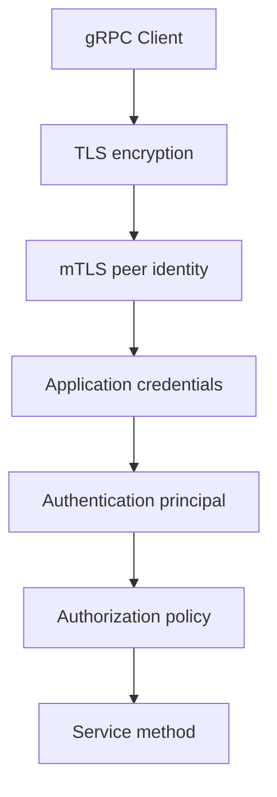
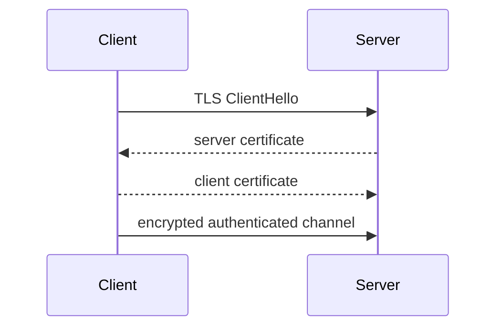
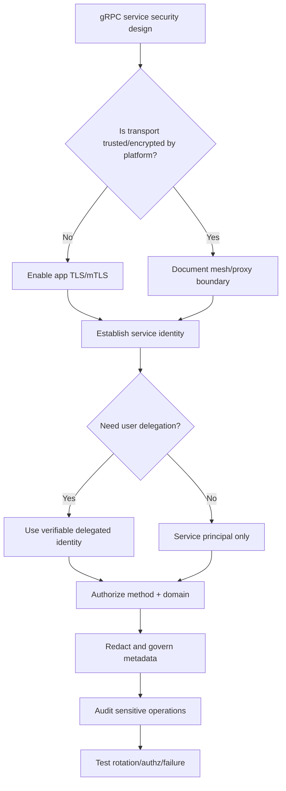

# Part 058 — gRPC Security: TLS, mTLS, Credentials, and Service Identity

gRPC security is not one thing.

It is a stack:

```text
transport encryption
+ peer identity
+ caller authentication
+ authorization
+ metadata hygiene
+ certificate/token lifecycle
+ observability
```

TLS protects the channel.

mTLS authenticates both sides at transport level.

Application credentials authenticate the caller at RPC level.

Authorization decides whether the authenticated caller can perform the operation.

A secure gRPC microservice must design all of these layers deliberately.

The production rule:

> Encryption without identity is incomplete. Identity without authorization is incomplete. Authorization without observability is fragile.

---

## 1. The Security Layers



Layer responsibilities:

| Layer | Responsibility |
|---|---|
| TLS | encrypt traffic, authenticate server |
| mTLS | authenticate client and server at transport |
| Call credentials | attach per-RPC credentials/token |
| Metadata auth | carry bearer token/API credential |
| Auth interceptor | verify credentials and create principal |
| Authorization | enforce method/domain permissions |
| Audit | record security-relevant decisions |

Do not confuse encryption with authorization.

---

## 2. gRPC Authentication Model

The gRPC authentication guide describes built-in auth mechanisms and support for plugging in custom authentication systems.

gRPC supports:

- SSL/TLS,
- token-based authentication,
- Google token-based auth for Google services,
- custom credential plugins,
- per-channel credentials,
- per-call credentials.

In Java, modern APIs include concepts such as:

- `ChannelCredentials`,
- `ServerCredentials`,
- `CallCredentials`.

But many codebases still use Netty TLS builders and interceptors.

The architecture matters more than the exact API surface.

---

## 3. Insecure Channel Is a Policy Decision

Demo code often uses:

```java
ManagedChannelBuilder.forAddress(host, port)
    .usePlaintext()
    .build();
```

This disables TLS.

It may be acceptable only when:

- local development,
- test environment,
- traffic is strictly inside trusted encrypted mesh,
- sidecar/proxy terminates mTLS locally,
- documented platform security boundary covers it.

It should not appear accidentally in production.

Use config validation:

```java
if (environment.isProduction() && grpcSecurity.usePlaintext()) {
    throw new InvalidSecurityConfigurationException(
        "Plaintext gRPC is not allowed in production"
    );
}
```

Security defaults should fail closed.

---

## 4. Server-Side TLS

Conceptual server TLS:

```java
Server server = NettyServerBuilder.forPort(9090)
    .sslContext(GrpcSslContexts.forServer(certChainFile, privateKeyFile).build())
    .addService(caseGrpcService)
    .build();
```

Or builder-specific APIs may provide transport security helpers.

Server TLS gives clients confidence they are connecting to the expected server, assuming:

- client trusts the issuing CA,
- hostname/SAN validation is correct,
- private key is protected,
- certificate is not expired,
- rotation is managed.

TLS without correct trust and validation can create false confidence.

---

## 5. Client-Side TLS

Conceptual client TLS:

```java
ManagedChannel channel = NettyChannelBuilder.forAddress(host, port)
    .sslContext(GrpcSslContexts.forClient()
        .trustManager(trustCertCollectionFile)
        .build())
    .build();
```

Client verifies server certificate.

Production decisions:

- public CA vs private CA,
- trust bundle distribution,
- certificate rotation,
- hostname validation,
- environment-specific roots,
- revocation strategy,
- sidecar termination.

Do not disable certificate verification to "make it work."

That defeats the point.

---

## 6. Mutual TLS

mTLS means both sides present certificates.

Server authenticates client certificate.

Client authenticates server certificate.



Use mTLS for service-to-service identity when:

- internal services need strong workload identity,
- zero-trust/internal threat model matters,
- service mesh is not providing equivalent identity,
- regulatory/security requirements demand peer authentication,
- you want certificate-bound service identity.

mTLS proves peer identity at transport level.

It does not decide whether the peer is authorized for a method.

---

## 7. Server mTLS Sketch

Conceptual Netty server requiring client cert:

```java
SslContext sslContext = GrpcSslContexts.configure(
        SslContextBuilder.forServer(certChainFile, privateKeyFile)
            .trustManager(clientCaCertFile)
            .clientAuth(ClientAuth.REQUIRE)
    )
    .build();

Server server = NettyServerBuilder.forPort(9090)
    .sslContext(sslContext)
    .addService(caseGrpcService)
    .build();
```

This says:

- server presents its certificate,
- server trusts client CA,
- client certificate is required.

Production details:

- verify SAN/service identity,
- map certificate identity to service principal,
- rotate certificates,
- handle expiration,
- audit failed handshakes,
- align with service mesh if present.

---

## 8. Client mTLS Sketch

Conceptual client with certificate:

```java
SslContext sslContext = GrpcSslContexts.forClient()
    .trustManager(serverCaCertFile)
    .keyManager(clientCertChainFile, clientPrivateKeyFile)
    .build();

ManagedChannel channel = NettyChannelBuilder.forAddress(host, port)
    .sslContext(sslContext)
    .build();
```

Client presents its certificate.

Server validates it.

This creates transport-level service identity.

But application still needs:

- authorization,
- tenant scoping,
- operation permissions,
- audit,
- maybe user delegation token.

mTLS answers "which workload is this?"

It does not answer every "may this workload do this action?" question.

---

## 9. ChannelCredentials and ServerCredentials

gRPC Java has credential abstractions intended to configure secure channels and servers.

Conceptual:

```java
ChannelCredentials channelCredentials = TlsChannelCredentials.create();

ManagedChannel channel = Grpc.newChannelBuilder(target, channelCredentials)
    .build();
```

Server side concept:

```java
ServerCredentials serverCredentials =
    TlsServerCredentials.create(certChainFile, privateKeyFile);

Server server = Grpc.newServerBuilderForPort(port, serverCredentials)
    .addService(service)
    .build();
```

Actual choice depends on gRPC Java version, transport, and platform.

Prefer modern credential APIs when they fit.

Use Netty SSL context when lower-level control is required.

The security architecture should remain the same.

---

## 10. CallCredentials

Transport credentials secure the channel.

Call credentials attach per-RPC credentials.

Examples:

- bearer token,
- OAuth2 access token,
- JWT,
- API key,
- signed request credential,
- workload token,
- user delegation token.

Conceptual custom `CallCredentials`:

```java
public final class BearerTokenCallCredentials extends CallCredentials {
    private final TokenProvider tokenProvider;

    @Override
    public void applyRequestMetadata(
        RequestInfo requestInfo,
        Executor appExecutor,
        MetadataApplier applier
    ) {
        appExecutor.execute(() -> {
            try {
                Metadata metadata = new Metadata();
                metadata.put(
                    MetadataKeys.AUTHORIZATION,
                    "Bearer " + tokenProvider.currentToken()
                );
                applier.apply(metadata);
            } catch (Throwable t) {
                applier.fail(Status.UNAUTHENTICATED
                    .withDescription("Unable to obtain token")
                    .withCause(t));
            }
        });
    }

    @Override
    public void thisUsesUnstableApi() {
        // required by API
    }
}
```

Attach per call/stub:

```java
CaseServiceBlockingStub secureStub =
    baseStub.withCallCredentials(new BearerTokenCallCredentials(tokenProvider));
```

Keep token acquisition bounded and cached.

Do not block indefinitely inside credential generation.

---

## 11. Metadata Authorization Header

A simpler approach uses client interceptor:

```java
headers.put(MetadataKeys.AUTHORIZATION, "Bearer " + token);
```

This is common and understandable.

But centralize it.

Bad:

```java
stub.withInterceptors(...); // no consistent auth
```

or manual per-call token code scattered everywhere.

Good:

```java
Channel securedChannel = ClientInterceptors.intercept(
    channel,
    new AuthenticationClientInterceptor(tokenProvider)
);
```

Security should be infrastructure policy, not call-site habit.

---

## 12. Server Authentication Interceptor

Server verifies credentials.

```java
public final class AuthenticationServerInterceptor implements ServerInterceptor {
    private final TokenVerifier tokenVerifier;

    @Override
    public <ReqT, RespT> ServerCall.Listener<ReqT> interceptCall(
        ServerCall<ReqT, RespT> call,
        Metadata headers,
        ServerCallHandler<ReqT, RespT> next
    ) {
        String authorization = headers.get(MetadataKeys.AUTHORIZATION);

        AuthenticatedPrincipal principal = tokenVerifier.verify(authorization)
            .orElseThrow(() -> Status.UNAUTHENTICATED
                .withDescription("Missing or invalid credentials")
                .asRuntimeException());

        Context context = Context.current()
            .withValue(SecurityContextKeys.PRINCIPAL, principal);

        return Contexts.interceptCall(context, call, headers, next);
    }
}
```

Rules:

- `UNAUTHENTICATED` for missing/invalid identity,
- `PERMISSION_DENIED` for valid identity lacking permission,
- never log token,
- expose only safe failure descriptions.

---

## 13. Authorization

Authentication answers:

```text
Who is calling?
```

Authorization answers:

```text
May this caller perform this action on this resource?
```

Method-level authorization:

```java
public final class AuthorizationInterceptor implements ServerInterceptor {
    private final MethodAuthorizationPolicy policy;

    @Override
    public <ReqT, RespT> ServerCall.Listener<ReqT> interceptCall(
        ServerCall<ReqT, RespT> call,
        Metadata headers,
        ServerCallHandler<ReqT, RespT> next
    ) {
        AuthenticatedPrincipal principal = SecurityContextKeys.PRINCIPAL.get();
        String method = call.getMethodDescriptor().getFullMethodName();

        if (!policy.isAllowed(principal, method)) {
            throw Status.PERMISSION_DENIED
                .withDescription("Permission denied")
                .asRuntimeException();
        }

        return next.startCall(call, headers);
    }
}
```

Domain-level authorization must often happen inside use case:

```java
authorizationService.assertCanEscalate(principal, caseId);
```

Do both when necessary.

---

## 14. Service Identity

Service-to-service calls need workload identity.

Identity sources:

- mTLS certificate SAN/SPIFFE ID,
- JWT service claim,
- service mesh identity,
- Kubernetes service account token,
- cloud workload identity,
- signed internal token.

Example identity:

```text
spiffe://example.com/ns/case/sa/workflow-service
```

Map identity to principal:

```java
public record ServicePrincipal(
    String serviceName,
    String namespace,
    String trustDomain,
    Set<String> roles
) {}
```

Use identity for:

- authorization,
- audit,
- rate limits,
- priority policy,
- caller-specific config,
- incident debugging.

Do not trust `x-caller-service` header as identity unless verified against authenticated identity.

---

## 15. User Delegation

Some service calls act on behalf of an end user.

Do not confuse:

- service identity,
- user identity,
- tenant identity,
- delegation authority.

Example:

```text
workflow-service calls case-service
on behalf of user U
```

The callee needs to know:

- caller service is workflow-service,
- user identity is U,
- workflow-service is allowed to act for U,
- tenant scope is valid,
- operation permissions are satisfied.

Delegation token should be explicit and verifiable.

Do not blindly forward user tokens through every service unless architecture permits it.

Token forwarding can leak privileges and create confused deputy problems.

---

## 16. Confused Deputy Risk

A confused deputy occurs when a service with authority is tricked into using that authority for an unauthorized caller.

Example:

1. Low-privilege caller invokes workflow-service.
2. workflow-service calls case-service using powerful service token.
3. case-service trusts workflow-service token.
4. Operation succeeds even though original user lacked permission.

Mitigation:

- carry user/delegation context,
- enforce authorization at callee,
- scope service tokens,
- use audience-restricted tokens,
- use least privilege,
- audit caller and subject,
- validate tenant/resource access.

Service identity alone is not enough for user-sensitive operations.

---

## 17. Token Audience and Scope

Tokens should be audience-scoped.

Example token claims:

```json
{
  "iss": "internal-idp",
  "sub": "workflow-service",
  "aud": "case-service",
  "scope": "case:read case:escalate",
  "exp": 1783240000
}
```

Server checks:

- issuer trusted,
- signature valid,
- token not expired,
- audience matches service,
- subject allowed,
- scope/permission sufficient,
- tenant/resource authorization passes.

Do not accept tokens minted for another audience.

Audience mistakes are common and dangerous.

---

## 18. Certificate Rotation

Certificates expire.

Tokens expire.

Secrets rotate.

Production security must handle rotation without outage.

Certificate rotation requirements:

- overlap old and new trust roots,
- reload certs without full restart if possible,
- monitor expiration,
- alert before expiry,
- test rotation in staging,
- avoid embedding certs in images,
- use secret manager/cert manager,
- support rollback.

Failure modes:

- client trusts old CA only,
- server presents new cert too early,
- clock skew makes cert invalid,
- sidecar rotates but app channel does not reconnect,
- long-lived channels keep old credentials unexpectedly.

Test rotation.

---

## 19. Token Refresh

Call credentials/token provider must handle:

- token expiry,
- refresh before expiry,
- refresh failure,
- concurrency,
- caching,
- bounded latency,
- backoff,
- secure storage.

Bad:

```text
every RPC fetches token from identity provider
```

This creates latency and IDP load.

Better:

```text
cache token, refresh before expiry, reuse safely
```

But ensure:

- no expired token used,
- refresh failure is visible,
- token not logged,
- token scopes correct.

---

## 20. Service Mesh Security

If a service mesh provides mTLS:

- app may use plaintext to localhost sidecar,
- sidecar handles encryption and peer identity,
- mesh enforces policies,
- certificates rotate in sidecar.

This can be good.

But application must still handle:

- application-level authorization,
- user delegation,
- method permissions,
- idempotency,
- domain audit,
- metadata hygiene,
- error mapping.

Mesh mTLS is not a replacement for application authorization.

Also ensure application config does not accidentally bypass sidecar and send plaintext across network.

---

## 21. TLS Termination Topologies

Common options:

| Topology | Description |
|---|---|
| app-to-app TLS | Java app handles TLS directly |
| sidecar mTLS | local app plaintext to sidecar; sidecar mTLS to sidecar |
| gateway TLS termination | gateway terminates; backend may be plaintext or re-encrypted |
| end-to-end TLS through proxy | proxy passes through encrypted stream |
| double TLS | app TLS inside mesh TLS |

Each has trade-offs:

- operational complexity,
- identity visibility,
- certificate ownership,
- latency,
- debugging,
- policy enforcement.

Document topology.

Do not let security depend on assumptions nobody can describe.

---

## 22. Metadata Hygiene

Security-sensitive metadata:

- `authorization`,
- tokens,
- cookies,
- API keys,
- idempotency keys,
- user identifiers,
- tenant identifiers,
- internal routing hints.

Policy:

- allowlist propagation,
- denylist sensitive keys,
- redact logs,
- bound size,
- validate format,
- strip untrusted metadata at boundary.

Bad:

```java
propagateAllInboundMetadata();
```

Good:

```java
propagateOnly(List.of("traceparent", "tracestate", "x-correlation-id"));
```

Metadata leaks are common in microservices.

---

## 23. Security Error Mapping

Use:

| Condition | Status |
|---|---|
| missing token | `UNAUTHENTICATED` |
| invalid token | `UNAUTHENTICATED` |
| expired token | `UNAUTHENTICATED` |
| token valid, insufficient permission | `PERMISSION_DENIED` |
| valid service, wrong tenant/resource | `PERMISSION_DENIED` or `NOT_FOUND` by policy |
| mTLS handshake failure | connection failure before RPC status |
| malformed auth metadata | `UNAUTHENTICATED` or `INVALID_ARGUMENT` depending policy |

Do not reveal excessive detail.

Bad:

```text
Token expired at 2026-07-05T10:00Z for user alice@example.com
```

Better:

```text
Invalid or expired credentials
```

Detailed cause can go to secure logs.

---

## 24. Audit Logging

Security-relevant RPCs should produce audit records.

Audit fields:

- timestamp,
- authenticated service identity,
- delegated user identity if any,
- tenant,
- method,
- resource,
- decision,
- reason,
- policy version,
- trace/correlation ID,
- source workload/namespace,
- mTLS identity if available.

Audit is not the same as debug log.

Audit must be:

- durable,
- tamper-resistant enough for requirements,
- access controlled,
- queryable,
- privacy-aware.

Do not audit full payload unless required and approved.

---

## 25. Observability

Security metrics:

```text
grpc.auth.success.total{method,principal_type}
grpc.auth.failure.total{method,reason}
grpc.authorization.denied.total{method,reason}
grpc.tls.handshake.failures.total{reason}
grpc.client.credentials.refresh.failures.total{dependency}
grpc.token.expiring_soon.total{issuer}
grpc.certificate.days_until_expiry{service}
grpc.security.metadata.rejected.total{key,reason}
```

Trace attributes:

```text
security.authenticated=true
security.principal.type=service
security.authorization.decision=allow
```

Avoid sensitive labels:

- user email,
- token ID,
- raw certificate subject if high-cardinality,
- tenant ID unless controlled.

---

## 26. Alerting

Useful alerts:

| Alert | Meaning |
|---|---|
| auth failures spike | token/cert/client config issue or attack |
| permission denied spike | caller regression or policy change |
| certificate expiry soon | rotation required |
| token refresh failures | IDP/connectivity issue |
| TLS handshake failures | trust/cert/SNI mismatch |
| plaintext in production | policy violation |
| metadata denylist hit | propagation bug |
| caller identity mismatch | spoofing/misconfiguration |
| audit write failure | compliance risk |

Security alerts should include runbook links.

---

## 27. Testing TLS/mTLS

Test layers:

| Test | Purpose |
|---|---|
| plaintext rejected in prod config | fail-safe config |
| client trusts server cert | TLS works |
| wrong CA rejected | trust boundary |
| expired cert rejected | validation |
| mTLS client cert required | server enforces client auth |
| unauthorized client cert rejected | service identity |
| cert rotation test | no outage |
| token missing | `UNAUTHENTICATED` |
| token invalid | `UNAUTHENTICATED` |
| valid token wrong permission | `PERMISSION_DENIED` |
| metadata redaction | no secret logs |

Some tests require integration environment with real TLS.

Do not rely only on mocks for security.

---

## 28. In-Process Test Limitation

In-process gRPC tests are excellent for:

- auth interceptor logic,
- metadata parsing,
- authorization decisions,
- error mapping.

They do not test:

- TLS handshake,
- certificate trust,
- mTLS peer certificates,
- hostname validation,
- ALPN,
- proxy/security topology.

Use real-network integration tests for TLS/mTLS.

---

## 29. Authorization Test

```java
@Test
void deniesEscalationWithoutPermission() {
    Metadata headers = new Metadata();
    headers.put(MetadataKeys.AUTHORIZATION, tokenWithout("case:escalate"));

    CaseServiceBlockingStub securedStub = MetadataUtils.attachHeaders(stub, headers);

    StatusRuntimeException ex = assertThrows(
        StatusRuntimeException.class,
        () -> securedStub.createEscalation(request)
    );

    assertThat(ex.getStatus().getCode()).isEqualTo(Status.Code.PERMISSION_DENIED);
}
```

Test permission denial as contract.

---

## 30. Metadata Redaction Test

```java
@Test
void doesNotLogAuthorizationHeader() {
    Metadata headers = new Metadata();
    headers.put(MetadataKeys.AUTHORIZATION, "Bearer secret-token");

    securedStub.getCase(request);

    assertThat(testLogAppender.events())
        .noneMatch(event -> event.message().contains("secret-token"));
}
```

Security tests should include logs.

Many leaks happen in observability code, not business logic.

---

## 31. Production Security Policy Template

```yaml
grpcSecurity:
  production:
    plaintextAllowed: false

  transport:
    mode: mtls
    trustBundle: internal-ca
    requireClientCertificate: true
    certificateRotation:
      alertBeforeExpiryDays: 14
      hotReload: true
      stagingRotationTestRequired: true

  authentication:
    acceptedCredentials:
      - mtls-service-identity
      - bearer-jwt
    token:
      issuer: internal-idp
      audience: case-service
      requiredScopes:
        getCase:
          - case:read
        createEscalation:
          - case:escalate

  authorization:
    methodLevelRequired: true
    domainLevelRequired: true
    tenantIsolationRequired: true
    hiddenResourcePolicy: return_not_found

  metadata:
    propagateAllowlist:
      - traceparent
      - tracestate
      - x-correlation-id
    redact:
      - authorization
      - idempotency-key
      - "*-bin"

  audit:
    enabled: true
    methods:
      - CreateEscalation
      - CloseCase
      - UpdateLegalHold
```

Security policy should be versioned and reviewed.

---

## 32. Common Anti-Patterns

### 32.1 Plaintext accidentally in production

Demo config becomes real config.

### 32.2 TLS but no authorization

Encrypted unauthorized access is still unauthorized.

### 32.3 Trusting caller metadata

Spoofed identity.

### 32.4 Forwarding user token everywhere

Confused deputy and privilege leakage.

### 32.5 Disabling certificate verification

Security theater.

### 32.6 Tokens fetched per RPC

Latency and identity provider overload.

### 32.7 No rotation test

Certificate expiry becomes outage.

### 32.8 Logging authorization metadata

Credential leak.

### 32.9 Mesh mTLS treated as full security

Application permissions still required.

### 32.10 No audit for sensitive commands

Security decisions are not reconstructable.

---

## 33. Decision Model



Security design starts with threat model and topology.

---

## 34. Design Checklist

Before shipping gRPC security:

- Is plaintext forbidden in production?
- Is TLS or mesh mTLS clearly documented?
- Is server certificate verified?
- Is client certificate required where needed?
- Is service identity derived from cert/token, not metadata?
- Are tokens audience-scoped?
- Are scopes/permissions checked?
- Is tenant isolation enforced?
- Is user delegation explicit?
- Are confused deputy risks addressed?
- Are credentials centrally injected?
- Are secrets redacted from logs?
- Is metadata propagation allowlisted?
- Is certificate rotation tested?
- Are token refresh failures handled?
- Are auth failures mapped correctly?
- Are security metrics and alerts configured?
- Are sensitive operations audited?
- Are integration tests using real TLS/mTLS?

---

## 35. The Real Lesson

gRPC security is not solved by flipping one TLS setting.

A secure Java gRPC service needs layered trust:

```text
encrypted transport
authenticated peer
verified caller
authorized action
scoped tenant/resource
safe metadata
auditable decision
rotatable credentials
```

Transport security gets you a protected pipe.

Application security decides whether the caller should be allowed to use it.

Top-tier engineers design both.

---

## References

- gRPC Authentication Guide: https://grpc.io/docs/guides/auth/
- gRPC Java TLS Example: https://github.com/grpc/grpc-java/tree/master/examples/example-tls
- gRPC Java Authentication Example: https://github.com/grpc/grpc-java/tree/master/examples/example-jwt-auth
- gRPC Java ChannelCredentials Javadoc: https://grpc.github.io/grpc-java/javadoc/io/grpc/ChannelCredentials.html
- gRPC Java ServerCredentials Javadoc: https://grpc.github.io/grpc-java/javadoc/io/grpc/ServerCredentials.html
- gRPC Java CallCredentials Javadoc: https://grpc.github.io/grpc-java/javadoc/io/grpc/CallCredentials.html
- RFC 8446 — TLS 1.3: https://www.rfc-editor.org/rfc/rfc8446.html
- SPIFFE ID standard: https://github.com/spiffe/spiffe/blob/main/standards/SPIFFE-ID.md
