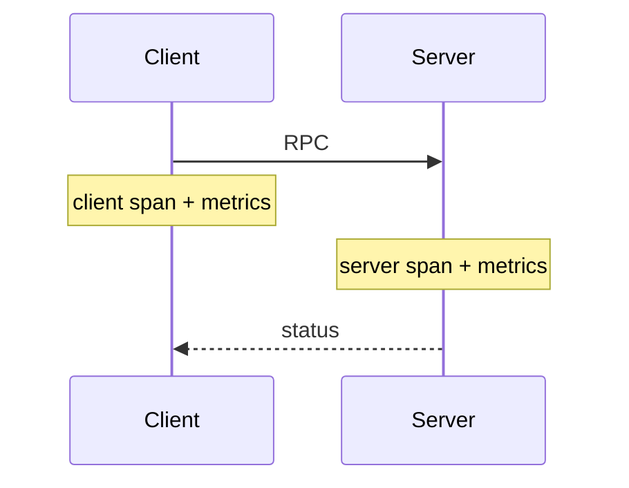
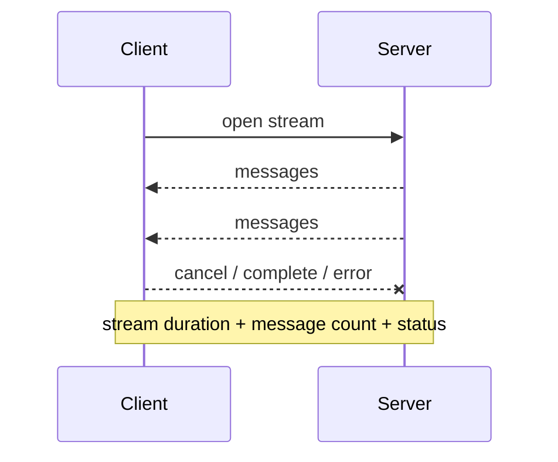
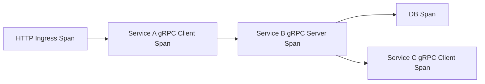
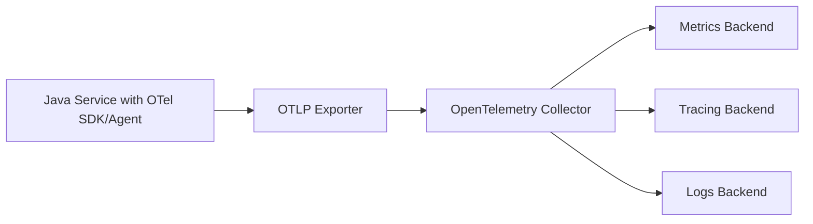

# Part 059 — gRPC Observability: Metrics, Traces, Logs, and SLOs

gRPC communication is fast, typed, and efficient.

That does not make it observable by default.

A production gRPC system must answer questions like:

- Which RPC method is slow?
- Which dependency is returning `UNAVAILABLE`?
- Are failures caller-caused or provider-caused?
- How many calls are failing due to `DEADLINE_EXCEEDED`?
- Are retries hiding dependency instability?
- Are streams leaking?
- Which caller is sending invalid requests?
- Are deadlines missing?
- Are authentication failures rising?
- Are fallback responses being counted as success?
- Is traffic balanced across backends?
- Are metadata and payload logs safe?

Observability is the difference between "gRPC is failing" and "workflow-service is sending invalid `CreateEscalation` requests after release 2026.07.05.1, causing `INVALID_ARGUMENT` spike and no provider degradation."

A top-tier engineer designs gRPC observability as part of the contract.

---

## 1. The Core Observability Model

Every gRPC RPC should produce at least:

```text
metric + trace span + structured log when needed
```

For a unary call:



For streaming:



The observability unit is not only "request."

It is:

- logical RPC,
- attempt,
- stream,
- message,
- dependency operation,
- final status,
- degraded outcome,
- retry/fallback decision.

---

## 2. gRPC Status Is a Primary Metric Dimension

Every RPC ends with a gRPC status.

Status code should be a first-class metric label.

Examples:

```text
grpc.server.calls.total{method="example.case.v1.CaseService/GetCase",status="OK"}
grpc.server.calls.total{method="example.case.v1.CaseService/GetCase",status="NOT_FOUND"}
grpc.client.calls.total{dependency="case-service",method="GetCase",status="UNAVAILABLE"}
```

Do not collapse all non-OK statuses into "error."

`INVALID_ARGUMENT` and `UNAVAILABLE` mean very different things.

Useful classification:

| Status group | Meaning |
|---|---|
| caller-caused | `INVALID_ARGUMENT`, `UNAUTHENTICATED`, `PERMISSION_DENIED`, maybe `NOT_FOUND` |
| domain-state | `FAILED_PRECONDITION`, `ABORTED`, `ALREADY_EXISTS` |
| capacity | `RESOURCE_EXHAUSTED` |
| latency/budget | `DEADLINE_EXCEEDED`, `CANCELLED` |
| provider/system | `UNAVAILABLE`, `INTERNAL`, `UNKNOWN`, `DATA_LOSS` |

Dashboards should show these separately.

---

## 3. OpenTelemetry Direction

OpenTelemetry is the modern default for vendor-neutral telemetry.

gRPC previously had OpenCensus-based observability support, but official gRPC observability guidance now points to OpenTelemetry metrics.

For Java services, OpenTelemetry can be used through:

- Java agent auto-instrumentation,
- manual instrumentation with OpenTelemetry API/SDK,
- gRPC interceptors,
- metrics exporters,
- OTLP exporter,
- collector pipeline.

The operational goal is not "use OTel."

The operational goal is:

```text
consistent traces, metrics, and logs across every gRPC boundary
```

OpenTelemetry is the standard way to get there in many Java platforms.

---

## 4. Auto-Instrumentation vs Manual Instrumentation

### Auto-instrumentation

Pros:

- quick baseline,
- less code,
- captures common libraries,
- useful for inbound/outbound RPC spans,
- consistent propagation.

Cons:

- may not know domain operation semantics,
- may not expose idempotency/fallback decisions,
- may not classify business errors as desired,
- can miss custom context,
- can create unexpected cardinality if not configured.

### Manual instrumentation

Pros:

- precise semantic labels,
- domain-specific metrics,
- explicit fallback/retry telemetry,
- better for SLOs,
- better security filtering.

Cons:

- more code,
- needs discipline,
- risk of inconsistency,
- needs tests.

Best practice:

```text
auto-instrumentation for baseline
+ manual metrics/spans for domain-critical decisions
```

Do not rely on only one.

---

## 5. Metric Naming Model

Use consistent names.

Server metrics:

```text
grpc.server.calls.total
grpc.server.duration
grpc.server.active_calls
grpc.server.deadline_exceeded.total
grpc.server.cancelled.total
grpc.server.message.received.total
grpc.server.message.sent.total
```

Client metrics:

```text
grpc.client.calls.total
grpc.client.duration
grpc.client.active_calls
grpc.client.deadline_exceeded.total
grpc.client.retries.total
grpc.client.fallback.total
grpc.client.channel.state
grpc.client.name_resolution.failures.total
```

Streaming metrics:

```text
grpc.streams.open
grpc.streams.duration
grpc.stream.messages.sent.total
grpc.stream.messages.received.total
grpc.stream.cancelled.total
grpc.stream.resume.total
```

Use operation names and method names consistently.

Avoid raw target URLs and IDs.

---

## 6. Label Discipline

Good low-cardinality labels:

| Label | Example |
|---|---|
| `rpc.system` | `grpc` |
| `rpc.service` | `example.case.v1.CaseService` |
| `rpc.method` | `GetCase` |
| `grpc.status_code` | `OK`, `UNAVAILABLE` |
| `dependency` | `case-service` |
| `caller_service` | `workflow-service` |
| `api_version` | `v1` |
| `operation` | `createEscalation` |
| `priority` | `critical-command` |
| `attempt_kind` | `initial`, `retry`, `hedge` |

Dangerous high-cardinality labels:

- case ID,
- user ID,
- tenant ID at raw level,
- request ID,
- trace ID,
- idempotency key,
- raw status description,
- exception message,
- full target host/IP,
- payload values.

Metrics cardinality can take down your observability backend.

A top-tier engineer treats metric labels as production resources.

---

## 7. Client Interceptor Metrics

Client interceptor sketch:

```java
public final class GrpcClientMetricsInterceptor implements ClientInterceptor {
    private final MeterRegistry meterRegistry;
    private final String dependency;

    @Override
    public <ReqT, RespT> ClientCall<ReqT, RespT> interceptCall(
        MethodDescriptor<ReqT, RespT> method,
        CallOptions callOptions,
        Channel next
    ) {
        long start = System.nanoTime();

        ClientCall<ReqT, RespT> delegate = next.newCall(method, callOptions);

        return new ForwardingClientCall.SimpleForwardingClientCall<>(delegate) {
            @Override
            public void start(Listener<RespT> responseListener, Metadata headers) {
                Listener<RespT> observing =
                    new ForwardingClientCallListener.SimpleForwardingClientCallListener<>(responseListener) {
                        @Override
                        public void onClose(Status status, Metadata trailers) {
                            long duration = System.nanoTime() - start;
                            record(method, status.getCode(), duration);
                            super.onClose(status, trailers);
                        }
                    };

                super.start(observing, headers);
            }
        };
    }

    private void record(MethodDescriptor<?, ?> method, Status.Code code, long durationNanos) {
        Timer.builder("grpc.client.duration")
            .tag("dependency", dependency)
            .tag("method", method.getFullMethodName())
            .tag("status", code.name())
            .register(meterRegistry)
            .record(durationNanos, TimeUnit.NANOSECONDS);

        Counter.builder("grpc.client.calls.total")
            .tag("dependency", dependency)
            .tag("method", method.getFullMethodName())
            .tag("status", code.name())
            .register(meterRegistry)
            .increment();
    }
}
```

This is a baseline.

Production also needs logical operation telemetry outside low-level interceptor.

---

## 8. Server Interceptor Metrics

Server interceptor sketch:

```java
public final class GrpcServerMetricsInterceptor implements ServerInterceptor {
    private final MeterRegistry meterRegistry;

    @Override
    public <ReqT, RespT> ServerCall.Listener<ReqT> interceptCall(
        ServerCall<ReqT, RespT> call,
        Metadata headers,
        ServerCallHandler<ReqT, RespT> next
    ) {
        long start = System.nanoTime();
        String method = call.getMethodDescriptor().getFullMethodName();

        ServerCall<ReqT, RespT> observingCall =
            new ForwardingServerCall.SimpleForwardingServerCall<>(call) {
                @Override
                public void close(Status status, Metadata trailers) {
                    long duration = System.nanoTime() - start;
                    record(method, status.getCode(), duration);
                    super.close(status, trailers);
                }
            };

        return next.startCall(observingCall, headers);
    }

    private void record(String method, Status.Code code, long durationNanos) {
        Timer.builder("grpc.server.duration")
            .tag("method", method)
            .tag("status", code.name())
            .register(meterRegistry)
            .record(durationNanos, TimeUnit.NANOSECONDS);
    }
}
```

Server metrics must distinguish:

- `OK`,
- validation failure,
- auth failure,
- permission denial,
- deadline exceeded,
- cancellation,
- internal failure.

---

## 9. Logical Operation Metrics

Transport metrics are not enough.

Example:

```text
grpc.client.calls.total{method="CreateEscalation",status="OK"}
```

This does not tell you whether the call:

- succeeded first try,
- succeeded after retry,
- replayed idempotency response,
- used fallback,
- was degraded,
- consumed stale cache,
- was part of a workflow retry.

Add logical metrics at owned client adapter:

```text
remote.operation.calls.total{dependency,operation,outcome}
remote.operation.attempts.total{dependency,operation,attempt_kind,status}
remote.operation.fallback.total{dependency,operation,fallback_type}
remote.operation.retry.total{dependency,operation,decision}
remote.operation.deadline.remaining_ms{dependency,operation}
```

Logical outcomes:

```text
success_fresh
success_after_retry
success_idempotency_replay
success_degraded
failed_validation
failed_timeout
failed_unavailable
failed_circuit_open
failed_bulkhead_full
failed_deadline
```

This is what dashboards and SLOs should use.

---

## 10. Tracing Model

A gRPC client call should create a client span.

A gRPC server should create a server span.

Trace propagation ties them together.



Span attributes should include:

- RPC system,
- service,
- method,
- status,
- peer/service target,
- deadline/timeout if safe,
- retry attempt if manual span,
- fallback/degraded flag if logical span,
- error reason.

Do not attach large payloads.

Do not attach sensitive metadata.

---

## 11. Trace Context Propagation

OpenTelemetry instrumentation typically propagates trace context.

Manual metadata propagation may use:

```text
traceparent
tracestate
baggage
```

Rules:

- do not put secrets in baggage,
- allowlist baggage keys,
- avoid high-cardinality baggage,
- avoid duplicating trace ID as correlation ID unless deliberately designed,
- keep trace context separate from idempotency key.

Trace context tells you where the request went.

Idempotency key tells you which logical command is being deduplicated.

They are not interchangeable.

---

## 12. Span Naming

Use stable span names.

Good:

```text
grpc.client example.case.v1.CaseService/GetCase
grpc.server example.case.v1.CaseService/GetCase
```

or platform convention:

```text
CaseService/GetCase
```

Bad:

```text
GetCase CASE-100
```

Never include resource IDs in span name.

Resource IDs can be attributes only if sampled, redacted, and safe; usually avoid them.

---

## 13. Logs Are Not Traces

Logs should explain notable events, not every successful RPC.

Good log events:

- auth failure,
- unexpected status mapping,
- circuit breaker state transition,
- deadline too short,
- fallback used for critical operation,
- stream cancelled unexpectedly,
- metadata validation failure,
- rich error parse failure,
- client policy rejection.

High-volume successful RPCs should usually be metrics/traces, not logs.

Structured log example:

```json
{
  "event": "grpc_client_call_failed",
  "dependency": "case-service",
  "method": "example.case.v1.CaseService/CreateEscalation",
  "status": "UNAVAILABLE",
  "operation": "createEscalation",
  "retryable": true,
  "attempt": 1,
  "deadlineRemainingMs": 182,
  "correlationId": "corr-123"
}
```

No payload.

No tokens.

No idempotency key plaintext.

---

## 14. Safe Payload Logging

Default rule:

```text
do not log full protobuf messages
```

Generated `toString()` may include sensitive fields.

If payload logging is needed for debugging:

- sample,
- redact,
- require explicit allowlist,
- limit environments,
- limit fields,
- hash identifiers,
- expire logs,
- audit access.

Example redaction policy:

```yaml
grpcLogging:
  payloadLogging: disabled
  allowedFields:
    - case_id_hash
    - status
  forbiddenFields:
    - authorization
    - national_id
    - email
    - phone
    - access_token
```

Payload logs are data exposure risk.

---

## 15. Deadline Observability

Deadline metrics are critical.

```text
grpc.server.deadline.remaining_at_start_ms{method}
grpc.client.deadline.configured_ms{dependency,method}
grpc.client.deadline.exceeded.total{dependency,method}
grpc.server.deadline.exceeded.total{method}
grpc.deadline.missing.total{caller,method}
grpc.deadline.capped.total{caller,method}
```

Dashboard questions:

- Which callers omit deadlines?
- Which methods start with low remaining budget?
- Are deadlines too short after queues?
- Are downstream timeouts aligned?
- Are retries skipped because deadline is gone?

Deadline telemetry prevents timeout tuning from becoming guesswork.

---

## 16. Cancellation Observability

Cancellation can be normal or problematic.

Metrics:

```text
grpc.server.cancelled.total{method,phase}
grpc.client.cancelled.total{dependency,method,reason}
grpc.stream.cancelled.total{method,reason}
grpc.work.cancelled.total{method,work_type}
```

Cancellation reasons:

- client cancelled,
- deadline exceeded,
- parent request cancelled,
- hedged loser,
- stream idle timeout,
- server shutdown,
- network disconnect.

A spike in cancellations can indicate:

- upstream timeout,
- client disconnects,
- deploy draining issue,
- stream lifecycle bug,
- network instability.

---

## 17. Streaming Observability

Unary metrics are not enough.

For streams track:

```text
grpc.streams.open{method}
grpc.streams.started.total{method}
grpc.streams.completed.total{method,status}
grpc.stream.duration{method,status}
grpc.stream.messages.sent.total{method}
grpc.stream.messages.received.total{method}
grpc.stream.message.bytes{method,direction}
grpc.stream.backpressure.wait_ms{method}
grpc.stream.resume.total{method}
grpc.stream.heartbeat.missed.total{method}
```

Streaming dashboard should show:

- open streams,
- stream duration distribution,
- message rate,
- cancellation rate,
- error status,
- backpressure,
- memory footprint,
- reconnect/resume behavior.

A service can have healthy unary RPCs and broken streams.

---

## 18. Channel Observability

For clients:

```text
grpc.channel.state{dependency,target}
grpc.channel.transitions.total{dependency,from,to}
grpc.name_resolution.failures.total{dependency}
grpc.lb.pick.failures.total{dependency}
grpc.connection.failures.total{dependency}
grpc.keepalive.failures.total{dependency}
```

These help diagnose:

- DNS failures,
- TLS failures,
- target misconfiguration,
- endpoint churn,
- rolling deployment issues,
- service mesh problems,
- keepalive mismatch.

A spike in `UNAVAILABLE` without channel metrics is difficult to debug.

---

## 19. Security Observability

Security metrics:

```text
grpc.auth.failures.total{method,reason}
grpc.authorization.denied.total{method,reason}
grpc.tls.handshake.failures.total{reason}
grpc.token.refresh.failures.total{dependency}
grpc.certificate.expiry.days{service}
grpc.metadata.rejected.total{key,reason}
```

Use low-cardinality labels.

Do not label with raw user ID or token subject at high volume unless your observability backend and privacy model allow it.

Security observability must be useful without leaking secrets.

---

## 20. Retry/Fallback Observability

If retry/fallback is implemented above gRPC transport, expose it explicitly.

```text
grpc.logical.retry.attempts.total{dependency,operation,reason}
grpc.logical.retry.exhausted.total{dependency,operation}
grpc.logical.fallback.used.total{dependency,operation,type}
grpc.logical.success_after_retry.total{dependency,operation}
grpc.logical.success_degraded.total{dependency,operation}
```

A system can have high final success rate while:

- retrying 30% of calls,
- serving stale data,
- hiding dependency outage,
- increasing p99 latency,
- exhausting budgets.

Final success is not enough.

---

## 21. SLO Design

Define SLOs at the logical operation level.

Example availability SLO:

```text
99.9% of GetCase logical calls return fresh OK or documented NOT_FOUND within 300 ms.
```

But clarify:

- Does stale fallback count?
- Does `NOT_FOUND` count as success?
- Does `INVALID_ARGUMENT` count against provider?
- Are caller-caused failures excluded?
- Are retries counted by final outcome or attempts?
- Are `DEADLINE_EXCEEDED` counted as failures?
- Are streaming sessions measured differently?

Example SLO classification:

| Outcome | Counts as success? |
|---|---:|
| `OK` fresh | yes |
| `NOT_FOUND` for valid not-found | yes for lookup semantics |
| `INVALID_ARGUMENT` | excluded from provider availability; tracked as caller error |
| `UNAVAILABLE` | no |
| `DEADLINE_EXCEEDED` | no |
| stale fallback | separate degraded success |
| partial response | separate degraded success |
| `PERMISSION_DENIED` | excluded or separate security metric |

SLO semantics must be explicit.

---

## 22. Dashboard Template

For each gRPC dependency operation:

1. RPS by method and caller,
2. success/non-OK by status,
3. p50/p95/p99 latency,
4. deadline remaining at start,
5. deadline exceeded rate,
6. retry attempts and success-after-retry,
7. fallback/degraded rate,
8. circuit breaker/bulkhead/rate limit state if used,
9. channel state and `UNAVAILABLE`,
10. stream open count and cancellations if streaming,
11. auth/authorization failures,
12. recent deploy/config/policy version.

A dashboard should answer:

```text
Is it caller input, provider health, network/channel, deadline budget, or policy behavior?
```

not merely:

```text
gRPC errors are up
```

---

## 23. Alerting

Useful alerts:

| Alert | Meaning |
|---|---|
| `UNAVAILABLE` spike | provider/network/channel issue |
| `DEADLINE_EXCEEDED` spike | latency/budget issue |
| `INVALID_ARGUMENT` spike from one caller | caller regression |
| `INTERNAL` spike | provider bug |
| `UNKNOWN` spike | unmapped error/transport issue |
| missing deadline spike | client policy regression |
| retry rate high | hidden instability |
| fallback rate high | degraded mode active |
| stream open count rising without completion | stream leak |
| cancellation spike during deploy | drain issue |
| auth failures spike | security/config issue |
| name resolution failures | DNS/service discovery issue |

Alerts should include:

- dependency,
- method,
- caller,
- status,
- policy version,
- dashboard link,
- runbook link.

---

## 24. Runbook Snippets

### `DEADLINE_EXCEEDED` spike

Check:

1. p99 server latency,
2. deadline remaining at server start,
3. queue age,
4. downstream dependency latency,
5. retry volume,
6. recent timeout/deadline config changes,
7. CPU/GC/database saturation.

Do not immediately increase deadline.

Longer deadlines can increase resource pressure.

### `UNAVAILABLE` spike

Check:

1. channel state,
2. name resolution failures,
3. TLS/auth handshake failures,
4. server readiness,
5. rolling deploy,
6. service mesh/proxy errors,
7. circuit breaker state,
8. provider logs.

### `INVALID_ARGUMENT` spike

Check:

1. caller version,
2. schema/contract change,
3. validation error reason,
4. generated client version,
5. new enum/field behavior,
6. canary release.

Caller-caused errors should route to caller owner.

---

## 25. Testing Observability

Observability must be tested.

Minimum tests:

| Test | Expected |
|---|---|
| successful unary call | `OK` metric emitted |
| domain validation error | `INVALID_ARGUMENT` metric emitted |
| dependency unavailable | `UNAVAILABLE` logical metric emitted |
| deadline exceeded | deadline metric emitted |
| fallback used | degraded/fallback metric emitted |
| retry success | retry attempt metric emitted |
| stream cancelled | stream cancellation metric emitted |
| metadata invalid | metadata rejection metric emitted |
| token missing | auth failure metric emitted |
| no payload in logs | sensitive data not logged |

Do not rely on manual dashboard inspection.

---

## 26. Test Meter Example

```java
@Test
void recordsGrpcStatusMetric() {
    SimpleMeterRegistry registry = new SimpleMeterRegistry();

    GrpcClientMetricsInterceptor interceptor =
        new GrpcClientMetricsInterceptor(registry, "case-service");

    // call fake server through intercepted channel

    Timer timer = registry.find("grpc.client.duration")
        .tag("dependency", "case-service")
        .tag("status", "OK")
        .timer();

    assertThat(timer).isNotNull();
    assertThat(timer.count()).isEqualTo(1);
}
```

For OTel, you may use in-memory exporters/readers in tests.

The principle is the same:

```text
prove telemetry is emitted and labeled correctly
```

---

## 27. Log Redaction Test

```java
@Test
void doesNotLogAuthorizationOrPayloadSecrets() {
    Metadata headers = new Metadata();
    headers.put(MetadataKeys.AUTHORIZATION, "Bearer secret-token");

    client.callWithSensitiveRequest(headers, sensitiveRequest());

    assertThat(testLogs)
        .noneMatch(log -> log.contains("secret-token"))
        .noneMatch(log -> log.contains("national_id"))
        .noneMatch(log -> log.contains("access_token"));
}
```

Observability code often becomes the privacy leak.

Test it.

---

## 28. OpenTelemetry Collector Pipeline

A common architecture:



Collector benefits:

- central config,
- batching,
- retry,
- filtering,
- redaction processors,
- tail sampling,
- routing to multiple backends,
- vendor-neutral pipeline.

Production telemetry should not be an ad-hoc direct exporter from every service to every vendor.

---

## 29. Sampling

Trace every request is often too expensive at scale.

Sampling options:

- head sampling,
- tail sampling,
- error-biased sampling,
- latency-biased sampling,
- route/method-specific sampling,
- priority-based sampling.

Important:

- always keep enough error traces,
- sample slow gRPC calls,
- sample streaming lifecycle events,
- keep security/audit logs separate from trace sampling,
- do not sample away all rare critical failures.

Metrics should generally be complete aggregates.

Traces can be sampled.

Audit cannot be randomly sampled if compliance requires completeness.

---

## 30. Production Observability Policy Template

```yaml
grpcObservability:
  metrics:
    enabled: true
    provider: opentelemetry
    requiredLabels:
      - rpc.system
      - rpc.service
      - rpc.method
      - grpc.status_code
      - dependency
      - caller_service
    forbiddenLabels:
      - request_id
      - trace_id
      - user_id
      - idempotency_key
      - raw_resource_id

  tracing:
    enabled: true
    propagation:
      traceContext: true
      baggageAllowlist:
        - caller.service
        - tenant.tier
    sampling:
      defaultRatio: 0.05
      alwaysSampleErrors: true
      alwaysSampleSlowCalls: true

  logging:
    structured: true
    payloadLogging: disabled
    redact:
      - authorization
      - idempotency-key
      - "*-bin"
      - email
      - national_id

  streaming:
    recordOpenStreams: true
    recordMessageCounts: true
    recordCancellations: true

  dashboards:
    required: true
    perDependencyOperation: true

  alerts:
    statusCodeSpikes: true
    deadlineExceeded: true
    unavailable: true
    streamLeaks: true
```

This policy should be enforced by platform libraries and reviewed in service readiness.

---

## 31. Common Anti-Patterns

### 31.1 Metrics only by final success

Retries, fallback, stale data, and degraded success become invisible.

### 31.2 One generic `grpc_error` metric

No status-code semantics.

### 31.3 High-cardinality labels

Observability backend instability.

### 31.4 Logging full protobuf messages

Sensitive data leak.

### 31.5 No deadline metrics

Timeout tuning becomes guessing.

### 31.6 No streaming metrics

Long-lived leaks go unseen.

### 31.7 No channel metrics

`UNAVAILABLE` incidents are opaque.

### 31.8 Traces without business operation labels

Transport spans exist but cannot answer domain questions.

### 31.9 No tests for telemetry

Instrumentation silently breaks.

### 31.10 Fallback counted as normal success

Availability looks green while correctness degrades.

---

## 32. Design Checklist

Before shipping gRPC observability:

- Are client and server metrics emitted?
- Is status code a label?
- Are method names stable and low-cardinality?
- Are logical operation outcomes emitted?
- Are retries/fallbacks/degraded responses visible?
- Are deadlines and cancellations visible?
- Are streaming lifecycle metrics present?
- Are channel/name-resolution metrics present?
- Are auth/security failures visible?
- Are trace context and baggage governed?
- Are logs structured and redacted?
- Are payload logs disabled by default?
- Are dashboards required per dependency operation?
- Are alerts status-specific?
- Are telemetry tests included?
- Are SLO classifications documented?
- Is observability policy versioned?

---

## 33. The Real Lesson

gRPC gives you a clear RPC model.

Observability gives you operational truth.

Without observability, gRPC failures collapse into vague symptoms:

```text
timeout
unavailable
stream broken
client failed
```

With good observability, you can separate:

```text
caller bug
provider outage
deadline budget issue
channel/DNS issue
auth regression
stream leak
retry storm
degraded fallback
```

That is the difference between debugging and guessing.

A top-tier Java microservice does not merely expose gRPC.

It exposes gRPC behavior that can be measured, explained, and improved.

---

## References

- gRPC OpenTelemetry Metrics: https://grpc.io/docs/guides/opentelemetry-metrics/
- OpenTelemetry Java Documentation: https://opentelemetry.io/docs/languages/java/
- OpenTelemetry Java Agent: https://opentelemetry.io/docs/zero-code/java/agent/
- OpenTelemetry Protocol: https://opentelemetry.io/docs/specs/otlp/
- gRPC Status Codes: https://grpc.io/docs/guides/status-codes/
- gRPC Interceptors: https://grpc.io/docs/guides/interceptors/
- gRPC Metadata: https://grpc.io/docs/guides/metadata/
