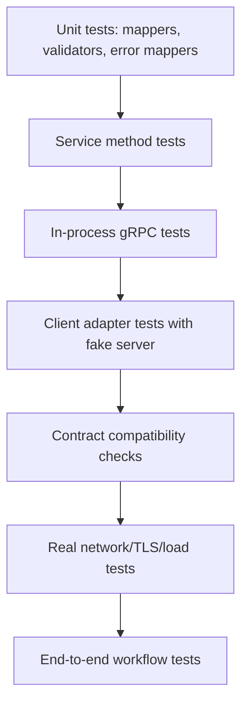
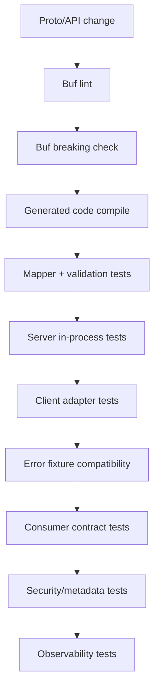
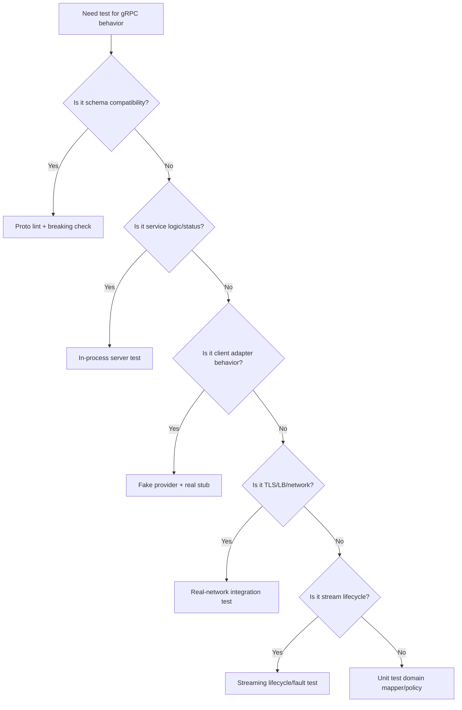

# Part 060 — gRPC Testing, Contract Verification, and Compatibility Gates

A gRPC service can compile and still break production consumers.

Why?

Because generated code only proves that both sides understand a schema.

It does not prove:

- field semantics,
- error status semantics,
- idempotency behavior,
- deadline propagation,
- metadata requirements,
- streaming lifecycle,
- retryability,
- authorization,
- backward compatibility,
- operational policy.

Testing gRPC in production-grade Java systems requires more than unit tests.

It requires a layered strategy:

```text
mapper tests
+ service tests
+ in-process RPC tests
+ fake provider tests
+ metadata/deadline/error tests
+ streaming tests
+ compatibility gates
+ failure injection
+ real-network integration tests
```

The goal is to make contract drift impossible to miss.

---

## 1. Testing Pyramid for gRPC



Each layer answers a different question.

| Test layer | Main question |
|---|---|
| Mapper unit test | Does Protobuf map correctly to domain? |
| Validation test | Are invalid messages rejected? |
| Error mapper test | Are domain failures mapped to status? |
| In-process gRPC test | Does generated stub/server interaction work? |
| Fake provider test | Does client adapter handle statuses/deadlines/metadata? |
| Compatibility gate | Is schema backward-compatible? |
| Streaming test | Does lifecycle/cancellation/order work? |
| Real network test | Do TLS/LB/channel/proxy behaviors work? |
| E2E test | Does the business workflow work across services? |

Do not use one test type for everything.

---

## 2. In-Process gRPC Testing

gRPC Java provides in-process server/channel classes.

These let you test actual gRPC stubs and service implementations without opening real network ports.

In-process tests are fast and deterministic.

```java
String serverName = InProcessServerBuilder.generateName();

Server server = InProcessServerBuilder.forName(serverName)
    .directExecutor()
    .addService(caseGrpcService)
    .build()
    .start();

ManagedChannel channel = InProcessChannelBuilder.forName(serverName)
    .directExecutor()
    .build();

CaseServiceGrpc.CaseServiceBlockingStub stub =
    CaseServiceGrpc.newBlockingStub(channel);
```

Use in-process tests for:

- service methods,
- interceptors,
- metadata,
- error mapping,
- deadline behavior,
- client adapter logic,
- streaming lifecycle.

But remember:

> In-process tests do not test real network, TLS, name resolution, load balancing, keepalive, or proxy behavior.

---

## 3. Unit Tests for Mappers

Generated Protobuf classes should not leak into domain.

Test mappers.

```java
@Test
void mapsCreateEscalationRequestToCommand() {
    CreateEscalationRequest request = CreateEscalationRequest.newBuilder()
        .setCaseId("CASE-100")
        .setTargetQueue("FRAUD_REVIEW")
        .setReasonCode("SUSPICIOUS_ACTIVITY")
        .setIdempotencyKey("cmd-123")
        .build();

    CreateEscalationCommand command = mapper.toCommand(request);

    assertThat(command.caseId().value()).isEqualTo("CASE-100");
    assertThat(command.targetQueue().value()).isEqualTo("FRAUD_REVIEW");
    assertThat(command.idempotencyKey().value()).isEqualTo("cmd-123");
}
```

Test edge cases:

- blank strings,
- unspecified enum,
- missing optional fields,
- unknown enum values,
- repeated field limits,
- map field limits,
- invalid timestamp,
- invalid decimal/money representation.

---

## 4. Validation Tests

Protobuf type safety is not semantic validation.

Test invalid payloads.

```java
@Test
void rejectsBlankCaseId() {
    GetCaseRequest request = GetCaseRequest.newBuilder()
        .setCaseId("")
        .build();

    StatusRuntimeException ex = assertThrows(
        StatusRuntimeException.class,
        () -> stub.getCase(request)
    );

    assertThat(ex.getStatus().getCode())
        .isEqualTo(Status.Code.INVALID_ARGUMENT);
}
```

Also verify rich error details:

```java
com.google.rpc.Status rich = StatusProto.fromThrowable(ex);

assertThat(rich.getCode()).isEqualTo(Code.INVALID_ARGUMENT.getNumber());
```

Validation behavior is part of contract.

---

## 5. Error Mapping Tests

Every domain exception should have a stable gRPC status.

```java
@Test
void mapsCaseAlreadyClosedToFailedPrecondition() {
    when(useCase.createEscalation(any()))
        .thenThrow(new CaseAlreadyClosedException("CASE-100"));

    StatusRuntimeException ex = assertThrows(
        StatusRuntimeException.class,
        () -> stub.createEscalation(validCreateEscalationRequest())
    );

    assertThat(ex.getStatus().getCode())
        .isEqualTo(Status.Code.FAILED_PRECONDITION);

    com.google.rpc.Status rich = StatusProto.fromThrowable(ex);
    assertThat(extractReason(rich)).isEqualTo("CASE_ALREADY_CLOSED");
}
```

Test status code and reason.

Do not test only message text.

Descriptions are not stable machine contracts.

---

## 6. Client Adapter Tests

The owned client adapter must map generated responses/statuses into domain behavior.

Fake server:

```java
public final class FakeCaseService extends CaseServiceGrpc.CaseServiceImplBase {
    private volatile Status failureStatus;
    private final List<Metadata> receivedMetadata = new CopyOnWriteArrayList<>();

    @Override
    public void getCase(GetCaseRequest request, StreamObserver<GetCaseResponse> observer) {
        if (failureStatus != null) {
            observer.onError(failureStatus.asRuntimeException());
            return;
        }

        observer.onNext(GetCaseResponse.newBuilder()
            .setCaseId(request.getCaseId())
            .setStatus("OPEN")
            .build());
        observer.onCompleted();
    }

    public void failWith(Status status) {
        this.failureStatus = status;
    }
}
```

Client test:

```java
@Test
void mapsUnavailableToRemoteUnavailable() {
    fakeService.failWith(Status.UNAVAILABLE.withDescription("maintenance"));

    assertThatThrownBy(() -> client.getCase(new CaseId("CASE-100")))
        .isInstanceOf(RemoteUnavailableException.class);
}
```

Business code should see owned exceptions, not `StatusRuntimeException`.

---

## 7. Metadata Tests

Test outbound metadata.

```java
@Test
void sendsCorrelationIdAndCallerService() {
    contextProvider.set(RequestContext.builder()
        .correlationId("corr-123")
        .callerService("workflow-service")
        .deadline(Deadline.after(Duration.ofMillis(500)))
        .build());

    client.getCase(new CaseId("CASE-100"));

    Metadata metadata = fakeService.lastMetadata();

    assertThat(metadata.get(MetadataKeys.CORRELATION_ID)).isEqualTo("corr-123");
    assertThat(metadata.get(MetadataKeys.CALLER_SERVICE)).isEqualTo("workflow-service");
}
```

Test inbound metadata extraction:

```java
@Test
void serverRejectsMissingAuthorization() {
    StatusRuntimeException ex = assertThrows(
        StatusRuntimeException.class,
        () -> unauthenticatedStub.getCase(request)
    );

    assertThat(ex.getStatus().getCode()).isEqualTo(Status.Code.UNAUTHENTICATED);
}
```

Metadata is contract surface.

Test it.

---

## 8. Deadline Tests

Client deadline test:

```java
@Test
void appliesDeadlineFromRequestContext() {
    fakeService.delay(Duration.ofSeconds(5));
    contextProvider.set(RequestContext.withDeadline(Duration.ofMillis(20)));

    assertThatThrownBy(() -> client.getCase(new CaseId("CASE-100")))
        .isInstanceOf(RemoteDeadlineExceededException.class);
}
```

Server deadline rejection:

```java
@Test
void rejectsAlreadyExpiredDeadline() {
    StatusRuntimeException ex = assertThrows(
        StatusRuntimeException.class,
        () -> stub.withDeadlineAfter(1, TimeUnit.NANOSECONDS)
            .getCase(request)
    );

    assertThat(ex.getStatus().getCode())
        .isEqualTo(Status.Code.DEADLINE_EXCEEDED);
}
```

Also test:

- missing deadline default,
- too-long deadline capped,
- downstream deadline propagation,
- retry skipped when deadline is insufficient.

---

## 9. Idempotency Tests

For command clients:

```java
@Test
void retriesCommandWithSameIdempotencyKey() {
    fakeService.failFirstWith(Status.UNAVAILABLE).thenSucceed();

    CreateEscalationCommand command = commandWithIdempotency("cmd-123");

    client.createEscalation(command);

    assertThat(fakeService.receivedIdempotencyKeys())
        .containsExactly("cmd-123", "cmd-123");
}
```

Server dedup test:

```java
@Test
void sameIdempotencyKeyReplaysOriginalResponse() {
    CreateEscalationRequest request = validRequest("cmd-123");

    CreateEscalationResponse first = stub.createEscalation(request);
    CreateEscalationResponse second = stub.createEscalation(request);

    assertThat(second.getEscalationId()).isEqualTo(first.getEscalationId());
}
```

Test mismatch:

```java
@Test
void sameIdempotencyKeyDifferentPayloadFails() {
    stub.createEscalation(validRequest("cmd-123", "FRAUD_REVIEW"));

    StatusRuntimeException ex = assertThrows(
        StatusRuntimeException.class,
        () -> stub.createEscalation(validRequest("cmd-123", "LEGAL_REVIEW"))
    );

    assertThat(ex.getStatus().getCode()).isIn(
        Status.Code.ABORTED,
        Status.Code.FAILED_PRECONDITION
    );
}
```

Idempotency is correctness, not convenience.

---

## 10. Retry Tests

Test retry policy at client adapter.

| Scenario | Expected |
|---|---|
| `UNAVAILABLE` then `OK` | retry and succeed |
| `INVALID_ARGUMENT` | no retry |
| `PERMISSION_DENIED` | no retry |
| `DEADLINE_EXCEEDED` on read | retry only if budget allows |
| command without idempotency | no retry |
| command with idempotency | retry same key |
| retry budget exhausted | no retry |
| server `RetryInfo` too long | no sync wait beyond deadline |

Example:

```java
@Test
void doesNotRetryInvalidArgument() {
    fakeService.alwaysFail(Status.INVALID_ARGUMENT);

    assertThatThrownBy(() -> client.getCase(new CaseId("")))
        .isInstanceOf(RemoteInvalidRequestException.class);

    assertThat(fakeService.callCount()).isEqualTo(1);
}
```

---

## 11. Circuit/Bulkhead/Rate Limit Tests

If gRPC client adapter uses resilience policy, test it.

Circuit breaker:

```java
@Test
void opensCircuitAfterUnavailableFailures() {
    fakeService.alwaysFail(Status.UNAVAILABLE);

    for (int i = 0; i < 10; i++) {
        catchThrowable(() -> client.getCase(caseId));
    }

    assertThat(circuitBreaker.getState()).isEqualTo(CircuitBreaker.State.OPEN);
}
```

Bulkhead:

```java
@Test
void rejectsWhenBulkheadFull() {
    fakeService.blockUntilReleased();

    // start max concurrent calls
    // next call should fail with RemoteBulkheadFullException
}
```

Rate limiter:

```java
@Test
void deniesWhenClientSideRateLimitExceeded() {
    // configure small limiter
    // call more than limit
    // assert RemoteRateLimitedException or policy rejection
}
```

Resilience behavior is part of client contract.

---

## 12. Streaming Tests

Server streaming order:

```java
@Test
void streamsEventsInSequenceOrder() {
    Iterator<CaseEvent> events = stub.listCaseEvents(request);

    List<Long> sequences = new ArrayList<>();
    while (events.hasNext()) {
        sequences.add(events.next().getSequence());
    }

    assertThat(sequences).containsExactly(1L, 2L, 3L);
}
```

Cancellation:

```java
@Test
void serverCleansUpWhenClientCancelsStream() {
    AtomicBoolean cleanupCalled = new AtomicBoolean(false);

    // service sets onCancel handler
    // client starts stream and cancels
    // assert cleanup
}
```

Client streaming:

```java
@Test
void commitsOnlyAfterClientCompletesUpload() {
    StreamObserver<UploadResponse> responseObserver = testResponseObserver();

    StreamObserver<UploadChunk> requestObserver =
        asyncStub.uploadAttachment(responseObserver);

    requestObserver.onNext(chunk(1));
    requestObserver.onNext(chunk(2));

    assertThat(repository.hasCommitted(uploadId)).isFalse();

    requestObserver.onCompleted();

    assertThat(repository.hasCommitted(uploadId)).isTrue();
}
```

Streaming tests must cover lifecycle, not only happy path.

---

## 13. Contract Fixture Tests

Create fixtures for important requests and responses.

Example structure:

```text
src/test/resources/grpc-fixtures/
  case-service/
    get-case/
      request.valid.textproto
      response.open.textproto
      error.not-found.yaml
    create-escalation/
      request.valid.textproto
      response.created.textproto
      error.case-closed.yaml
```

Use text format for readability where practical.

Fixture example:

```text
case_id: "CASE-100"
```

Expected error fixture:

```yaml
status: FAILED_PRECONDITION
reason: CASE_ALREADY_CLOSED
retryable: false
```

Fixture tests catch semantic drift.

---

## 14. Golden Tests

Golden tests compare current output to approved expected output.

Useful for:

- Protobuf JSON mapping,
- rich error details,
- generated documentation,
- compatibility examples,
- serialized response examples.

Be careful:

- golden tests can be brittle,
- update intentionally,
- review diffs,
- do not include timestamps/random IDs unless normalized.

Golden tests are good for contracts, not internal implementation noise.

---

## 15. Protobuf Compatibility Gates

Protobuf schema compatibility matters.

Breaking changes include:

- reusing field numbers,
- changing field type incompatibly,
- deleting fields without reserving numbers/names,
- changing semantic meaning,
- changing package/service/method names,
- changing enum behavior unsafely,
- changing oneof membership carelessly,
- changing streaming/unary shape.

Use schema lint and breaking-change checks in CI.

Buf is commonly used for Protobuf linting and breaking-change detection.

Policy:

```text
No `.proto` change merges unless lint and breaking checks pass.
```

But schema checks are not enough.

Semantic compatibility also needs fixtures and contract tests.

---

## 16. Reserved Fields Test

When removing a field:

```proto
message Case {
  reserved 4;
  reserved "old_field_name";

  string case_id = 1;
  string status = 2;
}
```

CI should enforce:

- removed field numbers are reserved,
- removed field names are reserved,
- field numbers are never reused,
- enum values are not repurposed.

This prevents wire-level corruption.

---

## 17. Enum Compatibility Tests

Proto enum evolution is tricky.

Test unknown enum handling.

If server adds:

```proto
CASE_STATUS_SUSPENDED = 4;
```

Old client should not crash or map it to `OPEN`.

Client mapper should handle unknown/unsupported values explicitly.

```java
@Test
void mapsUnknownCaseStatusToUnknownDomainValue() {
    GetCaseResponse response = GetCaseResponse.newBuilder()
        .setCaseId("CASE-100")
        .setStatusValue(999)
        .build();

    CaseSnapshot snapshot = mapper.toDomain(response);

    assertThat(snapshot.status()).isEqualTo(CaseStatus.UNKNOWN);
}
```

Enum additions are common source of client breakage.

---

## 18. Oneof Compatibility Tests

`oneof` changes can be semantically breaking.

Test:

- unknown oneof case,
- missing oneof,
- new payload type,
- mutually exclusive fields,
- default behavior.

```java
@Test
void rejectsMissingCommandPayload() {
    CommandEnvelope envelope = CommandEnvelope.newBuilder().build();

    assertThatThrownBy(() -> mapper.toCommand(envelope))
        .isInstanceOf(InvalidRequestException.class);
}
```

Do not treat missing oneof as a valid default unless contract says so.

---

## 19. Unknown Fields

Proto3 preserves unknown fields in messages in modern implementations, but application logic usually ignores them.

Test behavior that matters:

- server accepts additive unknown fields,
- client ignores unknown response fields,
- proxy/transcoder does not strip required unknowns for your use case,
- domain mapper does not fail on additive fields.

Do not depend on unknown fields for business logic.

They are compatibility mechanism, not feature transport.

---

## 20. Consumer-Driven Contract Testing

For internal gRPC APIs, consumers can publish expected interactions.

Provider verifies them.

Contract should include:

- request message,
- required metadata,
- expected response or status,
- rich error reason,
- retryability,
- idempotency behavior,
- deadline behavior if important.

Example:

```yaml
consumer: workflow-service
provider: case-service
interaction: create escalation for open case
request:
  metadata:
    idempotency-key: required
  message: fixtures/create-escalation-open-case.textproto
response:
  status: OK
  message: fixtures/create-escalation-created.textproto
```

Contract tests are especially useful when many teams consume one gRPC service.

---

## 21. Provider Compatibility Matrix

Provider should maintain compatibility matrix:

| Consumer | Client version | Proto version | Critical methods | Last verified |
|---|---|---|---|---|
| workflow-service | 2.8.1 | case v1 | CreateEscalation | 2026-07-05 |
| dashboard-service | 1.4.0 | case v1 | GetCase, ListEvents | 2026-07-05 |
| reporting-job | 3.1.0 | case v1 | SearchCases | 2026-07-05 |

Breaking changes should require verifying impacted consumers.

Do not rely only on "schema compiles."

---

## 22. Real-Network Integration Tests

In-process tests do not cover transport behavior.

Use real-network tests for:

- TLS,
- mTLS,
- hostname verification,
- service mesh path,
- DNS/name resolution,
- load balancing,
- keepalive,
- large message limits,
- proxy timeout,
- streaming through gateway,
- rolling deployment.

Example test environment:

```text
test client pod -> service mesh -> provider pod
```

Run scenarios:

- wrong certificate rejected,
- expired certificate rejected,
- backend pod killed,
- rolling restart,
- stream idle timeout,
- DNS endpoint change.

---

## 23. Performance and Load Tests

gRPC performance tests should cover:

- unary throughput,
- p99 latency,
- stream count,
- message rate,
- large payloads,
- flow control,
- compression,
- channel warmup,
- keepalive,
- TLS overhead,
- virtual-thread blocking clients,
- async clients,
- retry under failure,
- server executor saturation.

Questions:

- what is max safe concurrency?
- where is bottleneck?
- what is memory per stream?
- does p99 degrade before failures?
- do deadlines stop wasted work?
- do cancellations release resources?

Performance is not only benchmark score.

It is capacity envelope.

---

## 24. Fault Injection Tests

Inject:

- `UNAVAILABLE`,
- `DEADLINE_EXCEEDED`,
- `RESOURCE_EXHAUSTED`,
- slow response,
- cancelled stream,
- malformed request,
- auth failure,
- connection reset,
- server restart,
- large response,
- unknown enum,
- duplicate command,
- idempotency mismatch.

Expected behavior should be explicit.

```yaml
fault:
  status: UNAVAILABLE
expected:
  retry: true
  maxAttempts: 2
  finalException: RemoteUnavailableException
  circuitBreakerRecordsFailure: true
```

Fault injection tests verify policy.

---

## 25. Testing Observability

Test that telemetry is emitted.

```java
@Test
void emitsMetricForUnavailableStatus() {
    fakeService.failWith(Status.UNAVAILABLE);

    catchThrowable(() -> client.getCase(caseId));

    assertThat(metrics.counter(
        "grpc.client.calls.total",
        "dependency", "case-service",
        "status", "UNAVAILABLE"
    ).count()).isEqualTo(1.0);
}
```

Test logs are redacted.

Test fallback/degraded metrics.

Test streaming cancellation metrics.

Observability is part of production behavior.

---

## 26. Test Data Strategy

Avoid random fixtures that make failures hard to reproduce.

Use stable test identifiers:

```text
CASE-100
CASE-CLOSED-100
cmd-123
tenant-a
workflow-service
```

Normalize:

- timestamps,
- generated IDs,
- ordering,
- retry delays,
- trace IDs.

For randomized/property tests, capture seed.

Contract tests should be deterministic.

---

## 27. CI Gate Template



For high-risk changes, add:

- real-network integration,
- load test,
- canary.

Do not merge `.proto` changes with only generated code compilation.

---

## 28. Review Checklist for Proto Changes

Before approving `.proto` change:

- Is it additive?
- Are field numbers unique?
- Are removed fields reserved?
- Are enum zero values correct?
- Are enum additions safe for old clients?
- Are required semantic fields documented?
- Is `oneof` change compatible?
- Are streaming semantics changed?
- Are status/error semantics changed?
- Are metadata requirements changed?
- Are idempotency requirements changed?
- Are fixtures updated?
- Are consumers notified?
- Is generated client version bumped?

Schema review is API review.

---

## 29. Testing Matrix Template

```yaml
grpcTesting:
  required:
    mapperTests: true
    validationTests: true
    errorMappingTests: true
    inProcessServerTests: true
    clientAdapterTests: true
    metadataTests: true
    deadlineTests: true
    idempotencyTests: true
    retryPolicyTests: true
    streamingLifecycleTests: true
    observabilityTests: true

  compatibility:
    protoLint: true
    protoBreakingCheck: true
    errorFixtureCompatibility: true
    consumerContracts: true

  integration:
    realNetworkTls: true
    mtls: true
    serviceMeshPath: true
    rollingDeploy: true
    streamingThroughProxy: true

  performance:
    unaryLoad: true
    streamingLoad: true
    failureInjection: true
```

Make this policy visible.

---

## 30. Common Anti-Patterns

### 30.1 Only testing generated code compiles

Compile success is not contract success.

### 30.2 Mocking the stub everywhere

You never test real gRPC status/metadata/deadline behavior.

### 30.3 No error contract tests

Status semantics drift silently.

### 30.4 No metadata tests

Auth/correlation/idempotency breaks.

### 30.5 No streaming cancellation tests

Leaks appear in production.

### 30.6 No Protobuf breaking checks

Field reuse corrupts wire compatibility.

### 30.7 No unknown enum tests

Old clients crash or misinterpret new values.

### 30.8 No real-network tests

TLS/LB/mesh bugs escape.

### 30.9 No observability tests

Dashboards break during incidents.

### 30.10 E2E-only strategy

Slow, flaky tests hide precise failure cause.

---

## 31. Decision Model



Pick the cheapest test that proves the behavior.

---

## 32. Design Checklist

Before declaring a gRPC API production-ready:

- Are mapper tests complete?
- Are invalid requests tested?
- Are all domain errors mapped and tested?
- Are rich error details tested?
- Are client exceptions mapped?
- Are metadata requirements tested?
- Are deadlines tested?
- Are cancellations tested?
- Are idempotency/replay tests included?
- Are retry and circuit classification tested?
- Are streaming lifecycle tests included?
- Are Protobuf breaking checks in CI?
- Are removed fields reserved?
- Are enum compatibility tests included?
- Are contract fixtures versioned?
- Are consumer contracts verified?
- Are real-network TLS/LB tests run?
- Are observability tests present?
- Is CI gate blocking unsafe changes?

---

## 33. The Real Lesson

gRPC gives strong types.

Strong types reduce integration mistakes.

They do not eliminate contract risk.

Production gRPC testing must prove:

```text
schema compatibility
+ semantic compatibility
+ status compatibility
+ metadata compatibility
+ deadline behavior
+ streaming lifecycle
+ resilience policy
+ observability
+ transport security
```

Generated stubs make calls easy.

Testing makes calls trustworthy.

---

## References

- gRPC Java Basics Tutorial: https://grpc.io/docs/languages/java/basics/
- gRPC Java Generated-Code Reference: https://grpc.io/docs/languages/java/generated-code/
- gRPC Java InProcessServerBuilder Javadoc: https://grpc.github.io/grpc-java/javadoc/io/grpc/inprocess/InProcessServerBuilder.html
- gRPC Java InProcessChannelBuilder Javadoc: https://grpc.github.io/grpc-java/javadoc/io/grpc/inprocess/InProcessChannelBuilder.html
- gRPC Java Testing Javadoc: https://grpc.github.io/grpc-java/javadoc/io/grpc/testing/package-summary.html
- Protocol Buffers Proto3 Guide: https://protobuf.dev/programming-guides/proto3/
- Proto Best Practices: https://protobuf.dev/best-practices/dos-donts/
- Buf Breaking Change Detection: https://buf.build/docs/breaking/
- gRPC Status Codes: https://grpc.io/docs/guides/status-codes/
