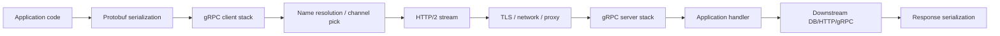
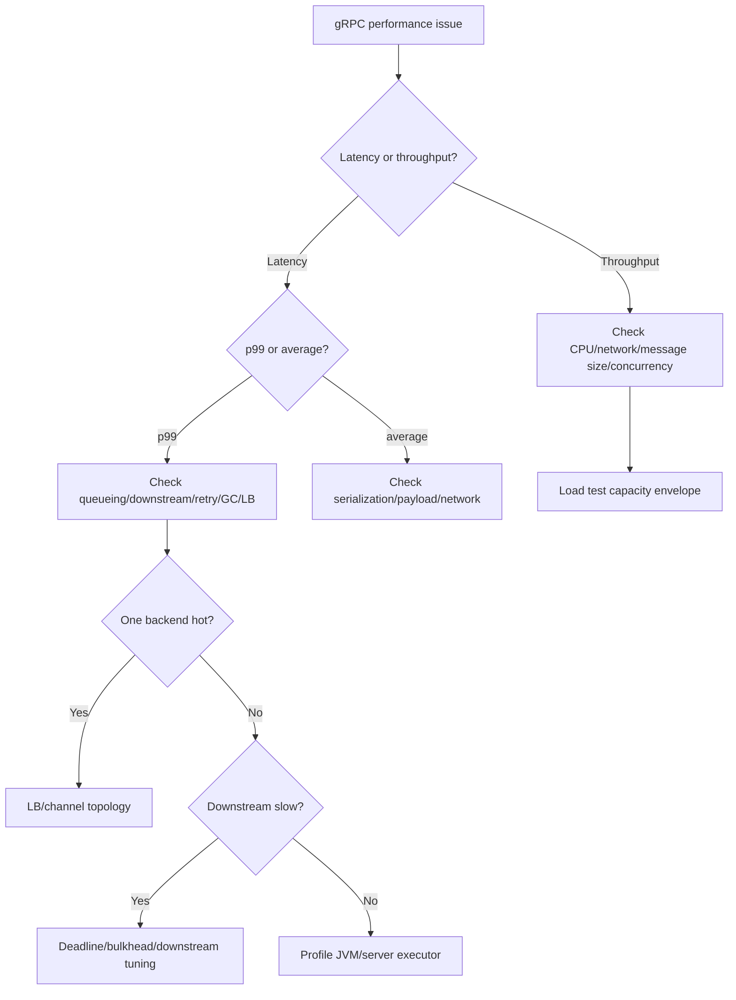

# Part 061 — gRPC Performance and Resource Tuning in Java

gRPC is often described as fast.

That is true in the right design.

It is also incomplete.

gRPC can be slower than expected when teams:

- create channels per request,
- use blocking clients without concurrency limits,
- stream without flow-control awareness,
- send oversized messages,
- enable compression blindly,
- ignore deadlines,
- rely on one HTTP/2 connection with poor balancing,
- run heavy work on the wrong executor,
- hide retry and hedging amplification,
- benchmark only happy-path unary calls,
- forget TLS, mesh, proxy, and deployment behavior.

Performance is not a property of the library alone.

Performance is a property of the whole communication path.

> gRPC performance tuning is the engineering of latency, throughput, concurrency, memory, CPU, network, and correctness under real workload.

---

## 1. Performance Mental Model

A gRPC call spends time in many places:



Optimizing only one layer often disappoints.

For each RPC, ask:

- How many bytes are sent?
- How many messages?
- How many connections?
- How many concurrent streams?
- How much CPU is serialization using?
- How much time is spent waiting for dependency?
- How much time is spent queued?
- How much time is spent blocked?
- How much work continues after deadline/cancellation?
- How much extra traffic comes from retry/hedging?

A top-tier engineer does not say "gRPC is fast."

They measure where time and resources are spent.

---

## 2. Latency vs Throughput vs Capacity

Performance has several dimensions.

| Dimension | Question |
|---|---|
| Latency | How long does one call take? |
| Tail latency | How bad are p95/p99/p999 calls? |
| Throughput | How many calls/messages per second? |
| Concurrency | How many in-flight calls/streams? |
| CPU efficiency | How much CPU per call/message? |
| Memory efficiency | How much allocation and retained state? |
| Network efficiency | How many bytes and connections? |
| Recovery behavior | What happens during failure/deploy? |
| Fairness | Does one caller/stream starve others? |

Optimizing one can harm another.

Example:

```text
compression reduces network bytes
but increases CPU
and may increase p99 under CPU pressure
```

Example:

```text
more concurrent streams increase throughput
but can increase queueing and tail latency
```

Performance tuning is trade-off management.

---

## 3. Channel Reuse Is Foundational

The simplest gRPC performance mistake is creating a channel per call.

Bad:

```java
ManagedChannel channel = ManagedChannelBuilder.forAddress(host, port).build();
try {
    return CaseServiceGrpc.newBlockingStub(channel).getCase(request);
} finally {
    channel.shutdownNow();
}
```

This loses:

- connection reuse,
- HTTP/2 multiplexing,
- TLS session reuse,
- load-balancer state,
- channel warmup,
- connection pooling behavior.

Good:

```java
public final class GrpcClientFactory implements AutoCloseable {
    private final ManagedChannel caseServiceChannel;
    private final CaseServiceGrpc.CaseServiceBlockingStub caseServiceStub;

    public GrpcClientFactory(GrpcClientConfig config) {
        this.caseServiceChannel = ManagedChannelBuilder
            .forTarget(config.caseServiceTarget())
            .defaultLoadBalancingPolicy(config.loadBalancingPolicy())
            .build();

        this.caseServiceStub =
            CaseServiceGrpc.newBlockingStub(caseServiceChannel);
    }

    public CaseServiceGrpc.CaseServiceBlockingStub caseServiceStub() {
        return caseServiceStub;
    }

    @Override
    public void close() throws InterruptedException {
        caseServiceChannel.shutdown();
        if (!caseServiceChannel.awaitTermination(10, TimeUnit.SECONDS)) {
            caseServiceChannel.shutdownNow();
        }
    }
}
```

Create channels per dependency/target/security identity.

Reuse them.

Shut them down deliberately.

---

## 4. HTTP/2 Multiplexing and Concurrent Streams

gRPC uses HTTP/2.

HTTP/2 multiplexes many streams over a connection.

This is efficient, but it can create subtle performance behavior.

If one channel uses one connection to one backend:

```text
many RPCs → one backend connection
```

If that backend becomes slow, many calls can suffer.

If a server has a limit on concurrent streams, excessive concurrent RPCs may queue.

Performance best practices often discuss using multiple channels or channel pools when a single connection's concurrent stream limit or distribution behavior becomes a bottleneck.

But do not create channel pools blindly.

First measure:

- active streams per connection,
- p99 latency,
- backend distribution,
- `UNAVAILABLE`/queueing,
- CPU/network saturation,
- channel state,
- stream limits.

Use more channels only when they solve a measured problem.

---

## 5. Load Balancing and Performance

`pick_first` may send traffic to one backend when the client directly resolves multiple addresses.

`round_robin` can distribute RPCs across multiple backend subchannels.

But if a service mesh or proxy handles balancing, application-level `round_robin` may be irrelevant or even confusing.

Performance question:

```text
Where is load balancing actually happening?
```

Topology examples:

| Topology | Performance implication |
|---|---|
| client → single proxy | proxy balances; client channel may see one endpoint |
| client → headless service pods | client policy matters |
| client → mesh sidecar | mesh owns many transport behaviors |
| client → DNS service VIP | HTTP/2 connection stickiness may matter |
| client → xDS | control plane may provide LB policy |

Incorrect topology assumptions lead to uneven backend load and misleading benchmarks.

---

## 6. Deadlines Improve Performance

Deadlines are not only reliability features.

They protect performance.

Without deadlines:

- abandoned calls continue,
- server work outlives callers,
- database queries run too long,
- streams stay open,
- queues fill,
- retries start elsewhere,
- p99 worsens.

Deadline-aware services drop useless work.

```java
Duration budget = requestContext.deadline()
    .timeoutWithMargin(Duration.ofMillis(250), Duration.ofMillis(25));

GetCaseResponse response = stub
    .withDeadlineAfter(budget.toMillis(), TimeUnit.MILLISECONDS)
    .getCase(request);
```

Performance tuning without deadlines is incomplete.

The system may be "fast" until failure, then spend all resources doing work nobody can use.

---

## 7. Blocking vs Async vs Virtual Threads

### Blocking stubs

Pros:

- simple code,
- clear control flow,
- easy domain mapping,
- works well with Java virtual threads.

Cons:

- blocks current thread,
- needs concurrency limits,
- can exhaust platform threads if not using virtual threads or proper pools.

### Async stubs

Pros:

- non-blocking callback model,
- good for streaming,
- useful for fan-out,
- can avoid blocking request threads.

Cons:

- callback complexity,
- context propagation complexity,
- easier to create unbounded concurrency,
- harder debugging.

### Virtual threads

Pros:

- simple blocking style at high concurrency,
- less platform-thread exhaustion,
- good for service code clarity.

Cons:

- downstream capacity still finite,
- socket/connection pools still finite,
- memory still finite,
- CPU still finite,
- bulkheads still required.

Virtual threads reduce blocking cost.

They do not remove the need for admission control.

---

## 8. Executor Strategy

Server-side handler work should not block event-loop threads.

If using Netty transport, be aware of:

- event-loop threads,
- application executor,
- blocking database calls,
- CPU-heavy serialization/mapping,
- virtual thread executor,
- bounded worker pools.

Conceptual server:

```java
ExecutorService applicationExecutor = Executors.newVirtualThreadPerTaskExecutor();

Server server = NettyServerBuilder.forPort(port)
    .executor(applicationExecutor)
    .addService(caseService)
    .build();
```

But do not blindly set virtual thread executor everywhere.

Evaluate:

- request volume,
- blocking behavior,
- downstream capacity,
- CPU usage,
- memory per task,
- thread-local/context propagation,
- instrumentation compatibility.

Executor strategy is part of capacity planning.

---

## 9. Bulkheads Still Matter

Even with async or virtual threads, limit concurrency per dependency/operation.

Example:

```text
case-service.getCase max concurrent = 80
document-service.render max concurrent = 10
external-provider.submit max concurrent = 5
```

Without bulkheads, a fast caller can create too much work.

Bulkhead protects:

- remote service,
- caller memory,
- database pool,
- CPU,
- channel/stream capacity,
- tail latency.

Virtual threads make it easier to create thousands of blocked operations.

Bulkheads make that safe.

---

## 10. Message Size

Protobuf is efficient, but large messages are still expensive.

Costs:

- serialization CPU,
- allocation,
- network bytes,
- compression CPU,
- GC pressure,
- HTTP/2 flow-control pressure,
- latency,
- memory spikes.

Design rule:

```text
do not use gRPC unary messages as unbounded data containers
```

Set explicit max message sizes.

```java
ManagedChannel channel = ManagedChannelBuilder.forTarget(target)
    .maxInboundMessageSize(4 * 1024 * 1024)
    .build();

Server server = NettyServerBuilder.forPort(port)
    .maxInboundMessageSize(4 * 1024 * 1024)
    .addService(service)
    .build();
```

For large data:

- paginate,
- stream,
- use object storage,
- send references,
- chunk explicitly,
- compress selectively.

---

## 11. Repeated Fields and Memory

A repeated field can be dangerous.

```proto
message SearchCasesResponse {
  repeated CaseSummary items = 1;
}
```

If unbounded, one response can allocate huge memory.

Policy:

```proto
message SearchCasesRequest {
  int32 page_size = 1;
  string page_token = 2;
}
```

Validate:

```java
if (request.getPageSize() > maxPageSize) {
    throw invalidArgument("page_size too large");
}
```

A strongly typed schema does not protect against unbounded collections.

Bounds are part of performance contract.

---

## 12. Streaming for Large Results

Server streaming can reduce memory by sending results incrementally.

But streaming is not automatically cheaper.

Streaming costs:

- long-lived connection state,
- per-stream memory,
- flow-control complexity,
- cancellation handling,
- operational complexity,
- gateway/proxy timeouts,
- harder client behavior.

Use streaming when:

- low latency to first item matters,
- result is sequential,
- client processes incrementally,
- stream lifetime is bounded,
- cancellation is handled,
- flow control is understood.

Use pagination when:

- UI navigation is page-based,
- caching matters,
- simpler failure behavior is preferred,
- client cannot handle streams reliably.

---

## 13. Flow Control and Backpressure

gRPC flow control prevents fast senders from overwhelming receivers at the transport layer.

But application code can still buffer too much.

Bad:

```java
List<Event> all = repository.loadAll();
for (Event event : all) {
    observer.onNext(mapper.toProto(event));
}
```

Better:

```java
try (EventCursor cursor = repository.openCursor(query)) {
    while (cursor.hasNext()) {
        if (Context.current().isCancelled()) {
            return;
        }

        Event event = cursor.next();
        responseObserver.onNext(mapper.toProto(event));
    }
    responseObserver.onCompleted();
}
```

Advanced manual flow control can help, but it is subtle.

Do not use it casually.

Start with bounded streams and cancellation.

---

## 14. Compression

Compression can improve performance when network is bottleneck.

It can hurt performance when CPU is bottleneck.

Good candidates:

- large text-like payloads,
- repeated structured data,
- cross-region calls,
- bandwidth-constrained paths.

Bad candidates:

- tiny messages,
- already compressed data,
- CPU-saturated services,
- low-latency critical calls where compression overhead dominates.

Measure:

- bytes saved,
- CPU cost,
- p95/p99 latency,
- GC allocation,
- server throughput.

Compression policy should be per operation, not global enthusiasm.

---

## 15. Protobuf Serialization Costs

Protobuf is efficient, but not free.

Costs increase with:

- large nested messages,
- repeated fields,
- maps,
- strings/bytes copying,
- conversion to/from domain objects,
- JSON transcoding,
- unknown fields,
- excessive wrapper types,
- large `Any` payloads.

Optimization principles:

- avoid over-nesting,
- avoid huge messages,
- use stable scalar types,
- minimize unnecessary conversions,
- avoid converting Protobuf → JSON → Protobuf,
- do not overuse `Any`,
- keep domain mapping simple,
- profile before micro-optimizing.

Most performance wins come from API shape and resource limits, not hand-optimizing generated classes.

---

## 16. Avoid Chatty RPCs

gRPC makes RPC calls feel like local method calls.

They are not local.

Bad:

```text
GetCase
GetCaseOwner
GetCaseDocuments
GetCasePermissions
GetCaseRisk
GetCaseNotes
```

called serially.

Better:

- aggregate intentionally,
- batch where appropriate,
- use server streaming for sequential data,
- use query-specific read model,
- use parallel fan-out with deadline,
- avoid per-item RPC loops.

Chatty RPC design creates latency and load even with fast transport.

A fast protocol cannot fix a bad call graph.

---

## 17. Batching vs Streaming

Batching combines many operations into one request.

Streaming sends many messages over one RPC.

| Pattern | Good for | Risk |
|---|---|---|
| batch unary | bounded set of independent items | huge request/response |
| server streaming | large sequential output | stream lifecycle complexity |
| client streaming | upload many chunks/items | partial commit semantics |
| bidi streaming | interactive protocol | hardest to operate |

Choose based on semantics.

Do not batch side-effecting commands without idempotency per item.

Do not stream without bounds and resume/cancellation semantics.

---

## 18. Tail Latency

gRPC can reduce overhead, but tail latency still comes from:

- GC,
- server queueing,
- slow backend,
- lock contention,
- flow-control stalls,
- network jitter,
- TLS handshakes,
- cold channels,
- DNS resolution,
- unbalanced load,
- retries,
- overloaded consumers.

Measure p95/p99/p999, not only average.

For every high p99 method, answer:

- is it queueing?
- is it serialization?
- is it downstream?
- is it one backend?
- is it large payload?
- is it retry?
- is it stream backpressure?
- is it GC?

Tail latency is often a system symptom, not a transport symptom.

---

## 19. Retry and Hedging Performance

Retries and hedges increase load.

A performance test that excludes failures may miss real capacity.

Test with:

- 1% `UNAVAILABLE`,
- 5% slow calls,
- one backend overloaded,
- retry enabled,
- hedging enabled,
- deadline pressure.

Measure:

```text
original RPS
attempt RPS
retry RPS
hedge RPS
backend CPU
p99
error rate
```

A policy that improves success rate under small failure can collapse under large failure.

Retry and hedging are performance-affecting features.

---

## 20. TLS and mTLS Overhead

TLS/mTLS add:

- handshake cost,
- certificate validation,
- encryption/decryption CPU,
- operational complexity.

But long-lived HTTP/2 connections amortize handshake cost.

Do not disable TLS for performance without threat-model approval.

Instead:

- reuse channels,
- avoid channel per call,
- use connection warmup,
- tune keepalive,
- use hardware/JVM crypto optimizations,
- measure CPU cost,
- coordinate with mesh/proxy.

Security is not a benchmark toggle.

---

## 21. Service Mesh and Proxy Overhead

Mesh/proxy can add:

- extra hop,
- mTLS,
- retries,
- load balancing,
- telemetry,
- buffering,
- timeout behavior,
- connection pools.

This can be worth it for operational control.

But performance tests must include the real topology.

Do not benchmark:

```text
client directly to server in local process
```

and assume the same result in:

```text
client → sidecar → sidecar → server
```

Use representative infrastructure.

---

## 22. JVM and GC Considerations

gRPC performance in Java depends on JVM behavior.

Observe:

- allocation rate,
- GC pause time,
- heap usage,
- direct memory,
- thread count,
- event-loop saturation,
- virtual thread count,
- buffer allocation,
- CPU profiles.

Large messages and high message rates can create allocation pressure.

Use profilers:

- async-profiler,
- Java Flight Recorder,
- heap dump when needed,
- allocation profiling,
- thread dumps,
- GC logs.

Do not tune gRPC in isolation from JVM.

---

## 23. Direct Memory and Netty

Netty may use direct buffers.

Monitor:

- direct memory usage,
- buffer leaks,
- native memory,
- container memory limits,
- `MaxDirectMemorySize` if relevant.

If container memory kills process but heap looks fine, native/direct memory may be involved.

Operational dashboards should include:

- heap,
- non-heap,
- direct memory if available,
- process RSS,
- container memory.

---

## 24. Load Testing Methodology

A useful gRPC load test includes:

- realistic request mix,
- realistic payload sizes,
- realistic deadlines,
- real TLS/mesh topology,
- client channel reuse,
- concurrency ramp,
- steady-state period,
- failure injection,
- streaming scenarios if used,
- rolling deploy scenario,
- observability validation.

Avoid misleading benchmark:

```text
one unary method, tiny payload, localhost, no TLS, no deadlines, no mesh, no downstream
```

That test is not useless, but it measures only a narrow slice.

---

## 25. Capacity Envelope

For each operation, define capacity envelope:

```yaml
operation: GetCase
target:
  rps: 1000
  p95Ms: 50
  p99Ms: 120
  errorRate: 0.1%
  deadlineMs: 300

resources:
  cpuCores: 4
  heapMb: 1024
  maxConcurrentCalls: 300
  maxMessageBytes: 1048576

failure:
  with1PercentUnavailable:
    retryAttemptsRatioMax: 0.03
    p99MsMax: 180
```

Capacity envelope says:

```text
what the service can safely do
```

not merely:

```text
what it did once in a benchmark
```

---

## 26. Performance Regression Tests

Add performance regression tests for critical gRPC APIs.

Track:

- latency distribution,
- throughput,
- CPU per call,
- allocation per call,
- message size,
- stream memory,
- retry amplification,
- GC pauses.

Performance tests should fail on meaningful regression, not tiny noise.

Example gate:

```text
p99 latency must not regress > 15%
allocation per GetCase call must not regress > 20%
max RSS under stream load must stay < 1.5GB
```

Use controlled environments.

---

## 27. Profiling Workflow

When p99 is bad:

1. Confirm which method/status.
2. Split client vs server latency.
3. Check deadline remaining at server start.
4. Check channel/connectivity state.
5. Check payload size.
6. Check server queue/executor saturation.
7. Check downstream dependency latency.
8. Check GC and CPU profiles.
9. Check retry/hedge rate.
10. Check backend distribution.

Do not start by changing random thread counts.

Performance tuning is diagnosis first, tuning second.

---

## 28. Server Performance Checklist

- Are deadlines enforced?
- Is cancellation observed?
- Is request validation early?
- Are large messages bounded?
- Is streaming bounded?
- Is blocking work on appropriate executor?
- Are database calls bounded by deadline?
- Are expensive methods bulkheaded?
- Are auth checks efficient and cached safely?
- Are interceptors lightweight?
- Is payload logging disabled?
- Are metrics low-cardinality?
- Is graceful shutdown tested?
- Are server resources sized from load tests?

---

## 29. Client Performance Checklist

- Is channel reused?
- Is target/load-balancing topology correct?
- Are deadlines set on every call?
- Are retries bounded and budgeted?
- Are hedges rare and budgeted?
- Are stubs wrapped by owned adapter?
- Is metadata propagation lightweight?
- Are tokens cached and refreshed efficiently?
- Are large responses paginated/streamed?
- Are bulkheads limiting concurrency?
- Is compression measured?
- Is channel state observable?
- Is shutdown graceful?

---

## 30. Production Performance Policy Template

```yaml
grpcPerformance:
  dependencies:
    case-service:
      channel:
        reuse: true
        lifecycle: singleton-per-target
        loadBalancingPolicy: round_robin
        idleTimeoutMs: 300000
        keepalive:
          enabled: true
          timeMs: 30000
          timeoutMs: 5000
          withoutCalls: false

      messages:
        maxInboundBytes: 4194304
        maxOutboundBytes: 4194304
        compression:
          default: disabled
          enabledFor:
            - ListCaseEvents

      concurrency:
        clientBulkhead:
          getCase: 300
          createEscalation: 80
        serverMaxConcurrentCalls:
          getCase: 500
          createEscalation: 150

      deadlines:
        required: true
        defaultMs:
          getCase: 300
          createEscalation: 600

      streaming:
        maxOpenStreams: 10000
        maxStreamDurationMs: 300000
        maxMessageBytes: 1048576

      regressionTesting:
        p99RegressionThreshold: 0.15
        allocationRegressionThreshold: 0.20
```

Policy turns performance from folklore into reviewable engineering.

---

## 31. Common Anti-Patterns

### 31.1 Benchmarking without real topology

Local direct benchmarks hide mesh/proxy/TLS behavior.

### 31.2 Channel per request

Destroys connection reuse.

### 31.3 No deadlines

Wasted work after caller leaves.

### 31.4 Unlimited message size

Memory and GC pressure.

### 31.5 Streaming without limits

Resource leaks.

### 31.6 Compression everywhere

CPU pressure and worse p99.

### 31.7 Async everywhere

Complexity without measured benefit.

### 31.8 Virtual threads without bulkheads

Unbounded remote concurrency.

### 31.9 Retry/hedge ignored in load test

Attempt RPS surprises production.

### 31.10 Average latency obsession

p99 kills user experience.

---

## 32. Decision Model



Do not tune before classifying the bottleneck.

---

## 33. The Real Lesson

gRPC performance is not automatic.

It comes from correct architecture:

```text
reused channels
+ right load balancing
+ bounded messages
+ bounded streams
+ deadlines
+ cancellation
+ concurrency limits
+ measured compression
+ realistic load tests
+ JVM profiling
```

The best gRPC performance work often looks like reliability work.

Because in distributed systems, performance and resilience are the same conversation under different traffic conditions.

---

## References

- gRPC Performance Best Practices: https://grpc.io/docs/guides/performance/
- gRPC Keepalive Guide: https://grpc.io/docs/guides/keepalive/
- gRPC Flow Control Guide: https://grpc.io/docs/guides/flow-control/
- gRPC Custom Load Balancing Policies: https://grpc.io/docs/guides/custom-load-balancing/
- gRPC Custom Name Resolution: https://grpc.io/docs/guides/custom-name-resolution/
- gRPC Java ManagedChannelBuilder Javadoc: https://grpc.github.io/grpc-java/javadoc/io/grpc/ManagedChannelBuilder.html
- Protocol Buffers Best Practices: https://protobuf.dev/best-practices/dos-donts/
