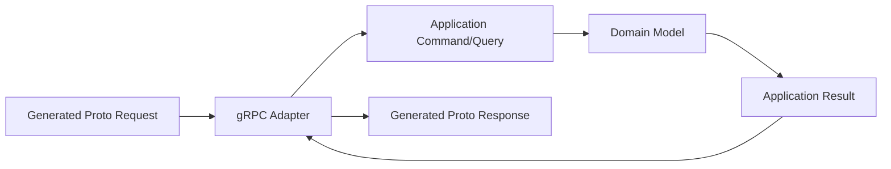
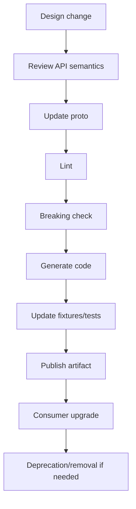
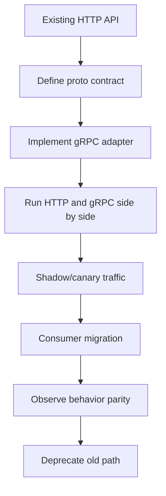
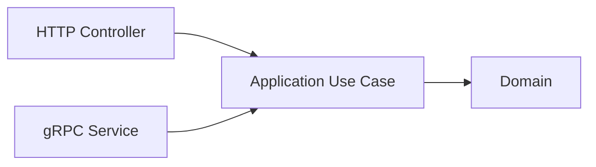

# Part 062 — gRPC Production Readiness Blueprint

This part closes the gRPC phase.

By now we have covered:

- gRPC mental model,
- Protocol Buffers contract design,
- Java server implementation,
- Java client implementation,
- deadlines and cancellation,
- metadata and interceptors,
- error handling,
- streaming,
- load balancing,
- security,
- observability,
- testing,
- performance.

This part turns those topics into an adoption and readiness blueprint.

The key idea:

> gRPC is not just a transport choice. It is an API governance, runtime, testing, security, and operations choice.

A team should not adopt gRPC because "it is faster."

A team should adopt gRPC when its strengths match the system's communication needs and when the platform can operate it safely.

---

## 1. When gRPC Is a Good Fit

gRPC is often a strong fit for:

- internal service-to-service APIs,
- strongly typed contracts,
- polyglot services with shared IDL,
- low-latency RPC,
- high-throughput unary calls,
- streaming protocols,
- deadline-aware call graphs,
- generated clients/servers,
- platform-governed APIs,
- backend-to-backend communication,
- systems where HTTP/2 is supported end-to-end.

Good example:

```text
workflow-service -> case-service CreateEscalation
dashboard-service -> case-service GetCase
case-event-service -> clients WatchCaseEvents stream
```

gRPC shines when both sides can share a Protobuf contract and treat it as real API governance.

---

## 2. When gRPC Is Not a Good Fit

gRPC may be a poor fit for:

- browser-first public APIs without gRPC-Web strategy,
- simple public REST APIs with human-friendly debugging needs,
- partners that cannot use Protobuf/gRPC tooling,
- systems dominated by cacheable resource reads via HTTP semantics,
- teams without schema governance,
- platforms with poor HTTP/2 support,
- environments where proxies break streaming,
- operations requiring broad curl/debuggability as primary support workflow,
- APIs where loose JSON evolution is more important than strict IDL,
- teams that cannot operate generated client compatibility.

Bad reason to adopt:

```text
REST feels old.
```

Bad reason:

```text
gRPC is always faster.
```

Good reason:

```text
We need strongly typed internal RPC with deadlines, generated stubs, streaming, and schema governance across Java/Go/Kotlin services.
```

---

## 3. gRPC vs HTTP/JSON Decision Model

| Factor | Prefer gRPC | Prefer HTTP/JSON |
|---|---|---|
| Internal service-to-service | often yes | also possible |
| Public partner API | maybe | often yes |
| Browser clients | gRPC-Web needed | yes |
| Strong IDL | yes | OpenAPI possible |
| Streaming | strong | SSE/WebSocket/HTTP streaming alternatives |
| Human debugging | weaker | stronger |
| Caching via HTTP semantics | weaker | stronger |
| Polyglot generated clients | strong | OpenAPI also possible |
| Strict schema evolution | strong | possible with discipline |
| Platform maturity needed | high | moderate |
| Payload efficiency | strong | weaker but acceptable often |
| Deadline/cancellation model | strong | manual/custom |

The decision is contextual.

Do not make it ideological.

---

## 4. gRPC and Domain Boundaries

Generated Protobuf types are transport contract types.

They should not become domain entities.

Architecture:



Do not do this:

```text
domain model uses generated proto messages directly
```

Why?

- transport evolution leaks into domain,
- tests become generated-code dependent,
- domain invariants are bypassed,
- one API field change touches business logic,
- multiple transports become hard.

Use mappers.

Use owned ports.

Generated code is boundary plumbing.

---

## 5. API Governance

A production gRPC platform needs governance for:

- `.proto` location,
- package naming,
- service naming,
- versioning,
- field numbering,
- reserved fields,
- enum rules,
- validation rules,
- error model,
- metadata policy,
- deadline policy,
- idempotency policy,
- streaming policy,
- generated artifact versioning,
- compatibility checks,
- review ownership.

Without governance, gRPC becomes "typed chaos."

A `.proto` file is an API artifact, not just a code-generation input.

---

## 6. Repository Layout

Example:

```text
case-service/
  proto/
    example/case/v1/case_service.proto
    example/case/v1/case_events.proto
  src/main/java/
    com/example/case/grpc/
    com/example/case/application/
    com/example/case/domain/
  src/test/resources/grpc-fixtures/
  buf.yaml
  buf.gen.yaml
  buf.lock
```

Or separate API repository:

```text
case-api/
  proto/example/case/v1/
  buf.yaml
  buf.gen.yaml
  generated/java/
```

Trade-off:

| Approach | Pros | Cons |
|---|---|---|
| proto with provider repo | easy provider evolution | consumers need artifact release |
| shared API repo | central governance | coordination overhead |
| monorepo | easy atomic changes | not always possible |
| generated artifact package | simple consumer dependency | versioning discipline required |

Choose and document.

---

## 7. Schema Lifecycle

Every `.proto` change should go through lifecycle:



Do not skip compatibility checks.

Do not reuse field numbers.

Do not delete fields without reservation.

Do not change status/error semantics without migration plan.

---

## 8. Versioning Strategy

Prefer additive evolution within a major version.

Package version example:

```proto
package example.case.v1;
```

Java options:

```proto
option java_package = "com.example.caseapi.v1";
option java_multiple_files = true;
```

Use new package/service version for major breaking changes:

```proto
package example.case.v2;
```

But do not create v2 casually.

First ask:

- can we add a field?
- can we add a method?
- can we add a new message variant?
- can we deprecate gradually?
- can provider support both?
- can consumers migrate?

Breaking changes are operational projects.

---

## 9. Compatibility Rules

Safe-ish changes:

- add new field with new number,
- add new message type,
- add new service method,
- add enum value if clients handle unknowns,
- add optional field with safe default,
- add rich error detail if status remains stable.

Dangerous/breaking changes:

- reuse field number,
- change field type incompatibly,
- rename package/service/method without compatibility,
- remove field without reservation,
- change semantics of field,
- change unary to streaming or streaming to unary,
- change error status for existing scenario,
- change idempotency requirement silently,
- change metadata requirement silently,
- change authorization semantics without migration.

Compatibility includes behavior, not only wire format.

---

## 10. Error Governance

Every gRPC service should publish an error model.

Example:

```yaml
errors:
  INVALID_ARGUMENT:
    details:
      - google.rpc.BadRequest
    retryable: false

  FAILED_PRECONDITION:
    reasons:
      - CASE_ALREADY_CLOSED
      - CASE_NOT_READY_FOR_ESCALATION
    retryable: false

  ABORTED:
    reasons:
      - CONCURRENT_MODIFICATION
      - IDEMPOTENCY_KEY_IN_PROGRESS
    retryable: conditional

  RESOURCE_EXHAUSTED:
    reasons:
      - RATE_LIMIT_EXCEEDED
      - BULKHEAD_FULL
    retryable: true-with-backoff

  UNAVAILABLE:
    reasons:
      - DEPENDENCY_UNAVAILABLE
      - MAINTENANCE
    retryable: true-if-idempotent
```

Clients should not guess retryability from raw status alone.

Operation semantics matter.

---

## 11. Metadata Governance

Define allowed metadata.

Example:

```yaml
metadata:
  inbound:
    required:
      - authorization
      - x-correlation-id
    optional:
      - x-tenant-id
      - x-caller-service
      - idempotency-key
      - x-request-priority

  propagation:
    allowlist:
      - traceparent
      - tracestate
      - x-correlation-id
      - x-tenant-id
    denylist:
      - authorization
      - cookie
      - set-cookie
      - "*-bin"

  logging:
    redact:
      - authorization
      - idempotency-key
      - "*-bin"
```

Metadata is API surface area.

Govern it like request fields.

---

## 12. Deadline and Timeout Standard

Platform rule:

```text
Every unary gRPC call must have a deadline.
```

Service default:

```yaml
deadlines:
  defaultMs: 500
  maxMs: 1000
  minUsefulMs: 75
  reserveResponseMarginMs: 25
```

Operation override:

```yaml
operations:
  GetCase:
    defaultDeadlineMs: 300
  CreateEscalation:
    defaultDeadlineMs: 600
```

Server rule:

- apply default if missing,
- cap excessive deadline,
- reject impossible deadline,
- propagate remaining budget,
- align downstream timeouts,
- observe cancellation.

Deadline is part of readiness.

---

## 13. Resilience Standard

For each gRPC dependency operation:

```yaml
resilience:
  retry:
    enabled: true
    maxAttempts: 2
    requiresIdempotencyForCommands: true
    retryableStatus:
      - UNAVAILABLE
      - RESOURCE_EXHAUSTED
      - DEADLINE_EXCEEDED

  circuitBreaker:
    enabled: true
    recordStatus:
      - UNAVAILABLE
      - DEADLINE_EXCEEDED
      - INTERNAL
    ignoreStatus:
      - INVALID_ARGUMENT
      - UNAUTHENTICATED
      - PERMISSION_DENIED
      - NOT_FOUND
      - FAILED_PRECONDITION

  bulkhead:
    enabled: true
    maxConcurrentCalls: 80

  fallback:
    fakeSuccessForCommands: forbidden
```

Avoid hidden mesh + app retry multiplication.

Document which layer owns resilience.

---

## 14. Security Standard

Minimum internal production gRPC security:

- transport encrypted or mesh mTLS documented,
- service identity verified,
- application authentication for sensitive calls,
- method/domain authorization,
- tenant isolation,
- token/cert rotation,
- metadata redaction,
- audit for sensitive commands,
- tests for auth failure and permission denial.

Policy:

```yaml
security:
  plaintextProductionAllowed: false
  serviceIdentityRequired: true
  tenantIsolationRequired: true
  userDelegationExplicit: true
  auditSensitiveMethods: true
```

Security is not complete because TLS is on.

---

## 15. Observability Standard

Every gRPC method must expose:

- calls by status,
- latency histogram,
- deadline exceeded,
- cancellation,
- client/server spans,
- structured logs for notable failures,
- logical retry/fallback metrics,
- stream metrics if streaming,
- channel metrics for clients,
- auth failure metrics,
- dashboard and alerts.

SLO classification must be explicit.

Example:

```yaml
slo:
  GetCase:
    success:
      - OK
      - NOT_FOUND
    excludedCallerErrors:
      - INVALID_ARGUMENT
      - UNAUTHENTICATED
      - PERMISSION_DENIED
    failure:
      - UNAVAILABLE
      - DEADLINE_EXCEEDED
      - INTERNAL
    degraded:
      - STALE_CACHE_FALLBACK
```

---

## 16. Testing Standard

Required gates:

- Protobuf lint,
- breaking-change detection,
- generated code compile,
- mapper tests,
- validation tests,
- error mapping tests,
- in-process gRPC tests,
- metadata tests,
- deadline tests,
- idempotency tests for commands,
- streaming lifecycle tests,
- client adapter tests,
- observability tests,
- real-network TLS/LB tests for platform changes.

A `.proto` change that passes compile but fails semantic fixtures should not merge.

---

## 17. Performance Standard

Every critical gRPC method should have a capacity envelope.

Example:

```yaml
capacity:
  GetCase:
    targetRps: 1000
    p95Ms: 50
    p99Ms: 120
    deadlineMs: 300
    maxInboundBytes: 1048576
    maxConcurrentCalls: 300

  WatchCaseEvents:
    maxOpenStreams: 10000
    maxStreamDurationMs: 300000
    maxMessagesPerSecond: 50000
```

Performance readiness includes:

- realistic topology,
- TLS/mesh included,
- deadlines enabled,
- retry/hedging included,
- load test results stored,
- p99 tracked,
- memory and CPU profiled.

---

## 18. Streaming Readiness

Before approving a streaming RPC:

- why streaming instead of unary/pagination?
- max stream duration?
- idle timeout?
- heartbeat?
- max message size?
- max messages?
- ordering guarantee?
- duplicate semantics?
- resume token?
- cancellation cleanup?
- flow-control strategy?
- gateway/proxy compatibility?
- stream metrics?
- load test?

Streaming is a protocol.

Approve it like one.

---

## 19. Migration from HTTP to gRPC

Migration should be gradual.



Do not rewrite all consumers at once.

Compare:

- response semantics,
- error mapping,
- idempotency,
- deadlines,
- authorization,
- latency,
- observability,
- load,
- fallback behavior.

The hardest part is usually semantic parity, not serialization.

---

## 20. Dual-Stack API

During migration, service may expose both:

```text
HTTP/JSON
gRPC/Protobuf
```

Shared application use case:



Do not duplicate business logic.

Each transport has its own adapter, mapper, error model, and observability.

Business behavior should be shared.

Transport semantics can differ but must be documented.

---

## 21. gRPC Gateway / Transcoding

Some platforms expose gRPC services through HTTP/JSON transcoding.

This can help public/external clients.

But be careful:

- HTTP status mapping,
- JSON/proto field naming,
- enum representation,
- streaming support,
- error details,
- deadlines,
- metadata,
- caching,
- browser compatibility,
- OpenAPI docs,
- gateway timeouts.

Do not assume transcoding gives a perfect REST API.

It gives an HTTP facade over RPC unless carefully designed.

---

## 22. Organizational Ownership

gRPC readiness spans teams.

| Area | Owner |
|---|---|
| Protobuf schema | service/API owner |
| generated artifacts | provider/platform |
| compatibility gate | platform + service owner |
| client adapter | consumer owner |
| server implementation | provider owner |
| security identity | platform/security |
| authz semantics | domain owner |
| observability | platform + service owner |
| load balancing/channel | platform |
| error model | provider + consumers |
| migration plan | provider + consumers |
| runbook | service owner |

Without ownership, gRPC governance decays.

---

## 23. Production Readiness Review

Before launching a gRPC API, hold a readiness review.

Questions:

1. What problem requires gRPC?
2. Who are consumers?
3. What are critical methods?
4. Is `.proto` linted and compatibility-checked?
5. Are deadlines mandatory?
6. Are errors mapped and tested?
7. Are clients generated and versioned?
8. Are generated types isolated from domain?
9. Is auth/mTLS configured?
10. Are metadata keys governed?
11. Are retries/idempotency safe?
12. Are streams bounded?
13. Are dashboards/alerts ready?
14. Are load tests done?
15. Is rollback possible?
16. Is migration plan documented?

A readiness review prevents "we exposed a port" from being confused with production readiness.

---

## 24. Rollout Strategy

Roll out gRPC gradually:

1. deploy server with gRPC disabled or internal-only,
2. enable health/reflection policy where safe,
3. deploy one non-critical consumer,
4. shadow traffic if possible,
5. compare HTTP vs gRPC behavior,
6. canary traffic,
7. monitor status/latency/deadlines/errors,
8. expand consumers,
9. freeze old API changes,
10. deprecate old path after migration.

For streaming, add:

- limited consumers,
- stream count cap,
- max duration,
- forced reconnect test,
- deploy drain test.

Rollout must include operations, not only code.

---

## 25. Rollback Strategy

Rollback options:

- disable gRPC listener,
- route consumers back to HTTP,
- pin generated client version,
- disable retry/hedging,
- force circuit open,
- reduce stream limits,
- disable new method,
- revert `.proto` additive field usage,
- keep old server behavior.

Do not remove old compatibility before all consumers are migrated.

Generated clients create deployment coupling.

Plan rollback before launch.

---

## 26. Runbook Template

```md
# Runbook: gRPC case-service

## Critical methods
- GetCase
- CreateEscalation
- WatchCaseEvents

## Dashboards
- gRPC server methods
- gRPC client dependencies
- channel/name resolution
- auth failures
- streaming lifecycle

## Common incidents

### UNAVAILABLE spike
Check channel state, name resolution, TLS, server readiness, mesh, deploy.

### DEADLINE_EXCEEDED spike
Check p99 latency, deadline remaining, downstream latency, retries, queues.

### INVALID_ARGUMENT spike
Identify caller version and validation reason.

### Stream leaks
Check open streams, cancellations, idle timeout, deploy drain.

## Safe mitigations
- disable hedging
- reduce retry attempts
- shed low-priority traffic
- force circuit open for collapsing dependency
- temporarily reduce stream limits

## Unsafe mitigations
- disabling auth
- increasing deadlines above gateway timeout
- enabling retry for commands without idempotency
- increasing message size globally
```

Runbook is part of readiness.

---

## 27. gRPC Platform Library

To scale gRPC quality across teams, provide a platform library.

Library should include:

- server builder defaults,
- client channel factory,
- metadata keys,
- auth interceptors,
- request context,
- deadline resolver,
- error mapper framework,
- metrics/tracing interceptors,
- policy validation,
- test utilities,
- fixture helpers,
- safe logging/redaction,
- generated client wrapper conventions.

But avoid a platform library that hides everything.

It should make good behavior easy and visible.

---

## 28. The "Top 1%" gRPC Checklist

A top-tier gRPC Java service has:

- clear reason for gRPC,
- governed `.proto`,
- stable versioning,
- compatibility gates,
- generated code isolated,
- deadline on every call,
- cancellation-aware server,
- status/error model,
- rich errors for machine handling,
- metadata allowlist,
- authenticated service identity,
- domain authorization,
- channel/load-balancing policy,
- resilience policy,
- streaming limits,
- observability/SLOs,
- real tests,
- load tests,
- runbooks,
- rollback plan.

The difference is not knowing more annotations.

The difference is treating gRPC as an operated distributed contract.

---

## 29. Phase 6 Summary

gRPC gives Java microservices:

```text
typed contracts
+ generated stubs
+ efficient binary serialization
+ HTTP/2 transport
+ streaming
+ deadlines
+ metadata
+ rich status model
```

But production requires:

```text
schema governance
+ domain mapping
+ compatibility
+ deadline propagation
+ cancellation
+ security
+ load balancing
+ observability
+ testing
+ performance tuning
+ rollout discipline
```

The transport is powerful.

The engineering system around it determines whether it is safe.

Part 063 begins Phase 7: event, message, and stream communication.

There we move from synchronous RPC into asynchronous communication models, where the central questions become ordering, delivery semantics, consumer idempotency, replay, backpressure, event contracts, and stream processing.

---

## 30. Final Readiness Checklist

Before marking Phase 6 implementation complete:

- Is the gRPC API contract reviewed?
- Is the `.proto` versioned?
- Are Protobuf breaking checks enabled?
- Are generated artifacts published/versioned?
- Are Java package options correct?
- Are server adapters thin?
- Are client adapters owned?
- Are deadlines required?
- Is cancellation tested?
- Are errors mapped to canonical statuses?
- Are rich details used where needed?
- Are metadata keys governed?
- Is auth/mTLS configured?
- Is authorization enforced?
- Is channel policy explicit?
- Are streaming methods bounded?
- Are observability dashboards ready?
- Are SLOs defined?
- Are load tests complete?
- Are real-network tests complete?
- Are runbooks ready?
- Is rollback planned?

If the answer is no, the service may still work.

It is not yet production-ready.

---

## References

- gRPC Core Concepts: https://grpc.io/docs/what-is-grpc/core-concepts/
- gRPC Java Basics Tutorial: https://grpc.io/docs/languages/java/basics/
- gRPC Performance Best Practices: https://grpc.io/docs/guides/performance/
- gRPC Deadlines Guide: https://grpc.io/docs/guides/deadlines/
- gRPC Metadata Guide: https://grpc.io/docs/guides/metadata/
- gRPC Error Handling Guide: https://grpc.io/docs/guides/error/
- gRPC Authentication Guide: https://grpc.io/docs/guides/auth/
- gRPC OpenTelemetry Metrics: https://grpc.io/docs/guides/opentelemetry-metrics/
- Protocol Buffers Language Guide: https://protobuf.dev/programming-guides/proto3/
- Protocol Buffers Best Practices: https://protobuf.dev/best-practices/dos-donts/
- Buf Breaking Change Detection: https://buf.build/docs/breaking/
