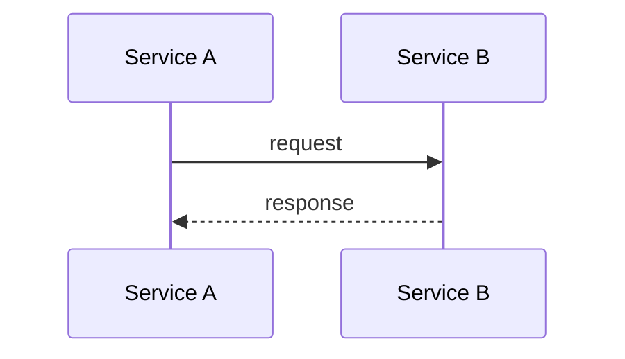
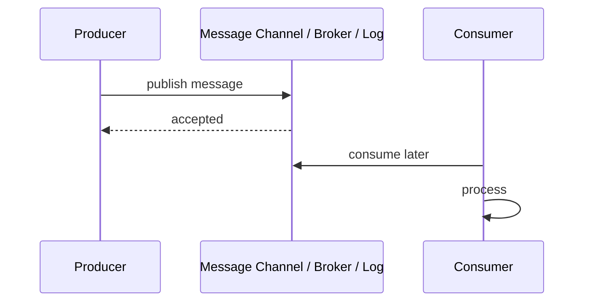
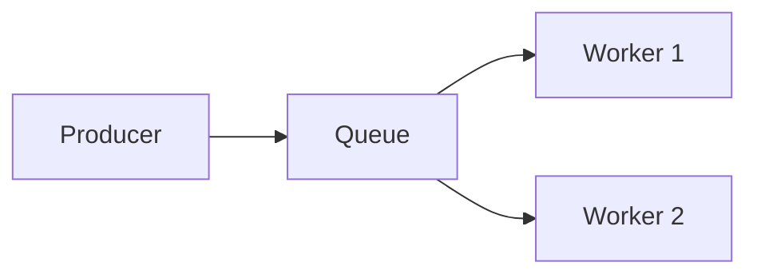
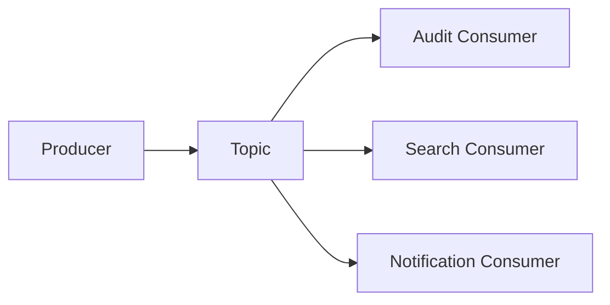
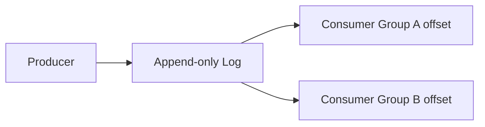
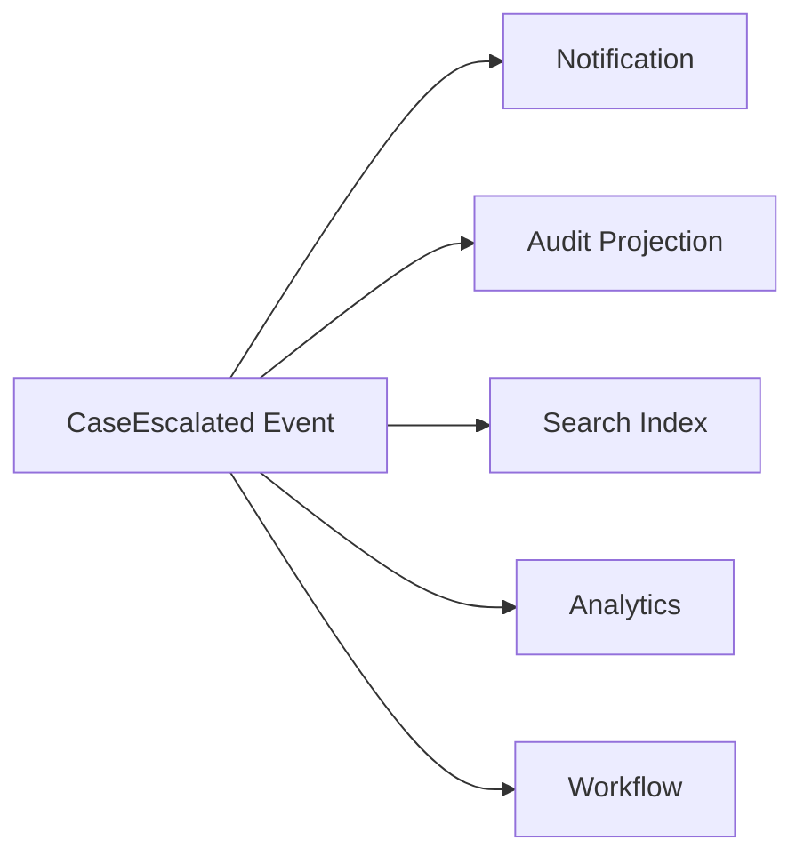
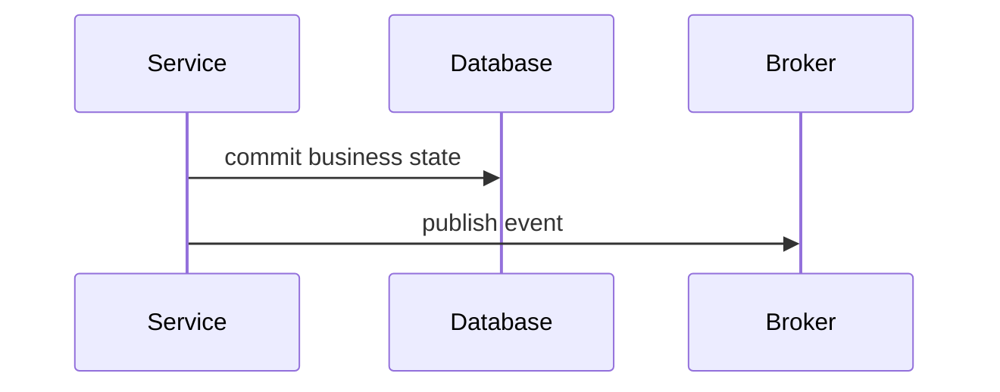
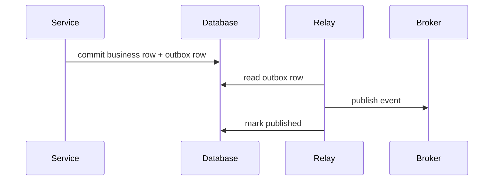

# Part 063 — Event, Message, and Stream Communication Mental Model

Synchronous communication asks:

```text
Can you answer me now?
```

Asynchronous communication asks:

```text
Can I record or send something meaningful so the system can continue later?
```

That shift changes everything.

With HTTP/gRPC, the caller waits for a response. With messaging/event/stream communication, the producer and consumer do not need to be alive, fast, or available at the same time.

This creates powerful decoupling.

It also creates new failure modes:

- duplicate messages,
- out-of-order events,
- replay,
- poison messages,
- consumer lag,
- schema drift,
- partial workflows,
- eventual consistency,
- unclear ownership,
- hidden coupling through topics,
- "exactly once" misunderstanding,
- audit and reconciliation gaps.

A top-tier engineer does not treat events as "async REST."

Events are a different communication model.

---

## 1. The Core Mental Model

Synchronous call:



Asynchronous message:



The producer does not directly execute consumer code.

The producer records a fact, request, or data document into a communication medium.

The consumer observes it later.

This changes the reliability question from:

```text
Did the downstream service respond?
```

to:

```text
Was the message durably recorded, and will consumers eventually process it correctly?
```

---

## 2. Why Async Communication Exists

Async messaging is useful when you need:

- temporal decoupling,
- load leveling,
- durable handoff,
- fan-out to multiple consumers,
- event replay,
- eventual consistency,
- cross-service workflow,
- audit trail,
- integration with slow/fragile systems,
- background processing,
- stream processing,
- independent scaling of producers and consumers,
- isolation from downstream latency.

Example:

```text
case-service creates CaseEscalated event
notification-service sends email/SMS
audit-service stores audit projection
search-service updates index
analytics-service updates metrics
```

The producer does not wait for all consumers.

That is the point.

---

## 3. Async Is Not Automatically More Reliable

Async communication can improve availability of the producer path.

But the whole business process may still fail later.

Example:

```text
CreateEscalation command succeeds
CaseEscalated event published
notification consumer fails for 3 hours
user never receives notification
```

The synchronous user path is available.

The business outcome is delayed or incomplete.

Therefore async systems need:

- durability,
- retry,
- dead-letter handling,
- monitoring,
- lag alerts,
- reconciliation,
- idempotent consumers,
- schema governance,
- replay strategy,
- operational ownership.

Async does not remove failure.

It moves failure to a different time and place.

---

## 4. Messaging Vocabulary

Enterprise Integration Patterns gives useful vocabulary:

| Term | Meaning |
|---|---|
| Message | A packet of data sent through a channel |
| Message Channel | Medium through which producer and consumer communicate |
| Message Endpoint | Application endpoint that sends/receives messages |
| Publish-Subscribe Channel | One published message is delivered to multiple subscribers |
| Event-Driven Consumer | Consumer invoked when message arrives |
| Document Message | Message transferring data structure |
| Command Message | Message asking receiver to perform action |
| Event Message | Message notifying that something happened |

This vocabulary matters because teams often overload the word "event."

Not every message is an event.

---

## 5. Message vs Event vs Command vs Document

### Message

Generic envelope of data moving through a channel.

```text
message = headers + key + payload + metadata
```

### Event

A fact that already happened.

```text
CaseEscalated
PaymentCaptured
DocumentUploaded
AccountClosed
```

Event naming should usually be past tense.

### Command

A request for something to happen.

```text
CreateEscalation
SendNotification
ReserveInventory
GenerateReport
```

Command naming is imperative.

### Document Message

A data transfer message.

```text
CaseSnapshot
CustomerProfileChangedDocument
SearchIndexDocument
```

Document message says:

```text
here is data
```

not necessarily:

```text
do this
```

Confusing these leads to bad coupling.

---

## 6. Event as Fact

An event should represent something that happened in the producer's domain.

Good:

```text
CaseEscalated
CaseClosed
EscalationAssigned
DocumentVerified
```

Bad:

```text
SendEmailNow
UpdateSearchIndex
CallNotificationService
```

Those are commands or implementation instructions.

An event should not know too much about what consumers will do.

Event:

```json
{
  "eventType": "CaseEscalated",
  "caseId": "CASE-100",
  "escalationId": "ESC-900",
  "occurredAt": "2026-07-05T10:15:30Z"
}
```

Consumer decides:

- send notification,
- update projection,
- trigger workflow,
- audit,
- ignore.

That is decoupling.

---

## 7. Command Message as Async Request

A command message asks a consumer to do work.

Example:

```json
{
  "commandType": "SendEscalationNotification",
  "notificationId": "NOTIF-100",
  "caseId": "CASE-100",
  "recipientUserId": "U-200"
}
```

Command messages need:

- target ownership,
- idempotency key,
- retry semantics,
- timeout/expiry,
- result/status model,
- dead-letter policy,
- authorization,
- deduplication.

Unlike events, commands imply responsibility.

If you send a command, some component owns completing or failing it.

---

## 8. Event Notification vs Event-Carried State Transfer

Two major event styles:

### Event notification

Small event says something happened.

```json
{
  "type": "CaseEscalated",
  "caseId": "CASE-100",
  "escalationId": "ESC-900"
}
```

Consumer may call back to producer for details.

Pros:

- small messages,
- producer exposes less data,
- consumers get fresh data if they call back.

Cons:

- consumer depends on producer availability,
- fan-out callback storms,
- extra latency,
- consistency race.

### Event-carried state transfer

Event carries enough state for consumers.

```json
{
  "type": "CaseEscalated",
  "caseId": "CASE-100",
  "escalation": {
    "id": "ESC-900",
    "targetQueue": "FRAUD_REVIEW",
    "reasonCode": "SUSPICIOUS_ACTIVITY"
  }
}
```

Pros:

- consumers can process independently,
- fewer callbacks,
- better replay,
- projection updates easier.

Cons:

- larger messages,
- schema evolution matters,
- data privacy risk,
- event becomes consumer contract.

Choose intentionally.

---

## 9. Queue vs Topic vs Log

Different messaging systems use different abstractions.

### Queue

A message is consumed by one worker from a competing consumer group.



Good for work distribution.

### Topic / Publish-subscribe

Multiple subscribers receive the event.



Good for event fan-out.

### Log / Stream

Messages are appended to ordered partitions and consumers track offsets.



Good for replay, stream processing, event history, projections.

Apache Kafka is commonly described as a distributed event streaming platform built around durable logs, topics, partitions, producers, consumers, and offsets.

---

## 10. Broker vs Log Mental Model

A traditional broker often emphasizes:

```text
deliver message to consumer
remove after acknowledgement
```

A log emphasizes:

```text
append record
retain for time/size/compaction
consumers track read position
```

This difference is huge.

With a log:

- consumers can replay,
- new consumers can start from old data,
- multiple consumer groups read independently,
- offsets are consumer state,
- retention policy matters,
- event history can build projections.

With a broker queue:

- message is often gone after successful consumption,
- replay may be harder,
- competing consumers distribute work.

Modern platforms can blur these lines, but the mental model still matters.

---

## 11. Producer

The producer creates messages.

Producer responsibilities:

- choose topic/channel,
- choose message key,
- set schema/version,
- set headers/metadata,
- serialize payload,
- publish durably,
- handle publish failure,
- avoid duplicate unsafe events,
- connect event publication to state commit,
- observe publish latency/errors.

The hardest producer problem:

```text
How do I update my database and publish the corresponding event atomically enough?
```

This leads to the transactional outbox pattern.

---

## 12. Consumer

The consumer processes messages.

Consumer responsibilities:

- subscribe to correct topic/channel,
- deserialize payload,
- validate schema/version,
- handle duplicates,
- preserve ordering where required,
- commit offset/ack at correct time,
- retry transient failure,
- isolate poison messages,
- emit metrics,
- avoid blocking partitions/queues forever,
- support replay,
- maintain projections idempotently.

The hardest consumer problem:

```text
How do I process a message correctly if it may be delivered more than once?
```

This leads to idempotent consumer design.

---

## 13. Message Key

A message key is often used for:

- partitioning,
- ordering,
- compaction,
- routing,
- grouping,
- deduplication hints.

Example:

```text
key = caseId
```

This can ensure all events for one case go to the same partition in Kafka-like systems, preserving order for that key.

But key choice affects:

- load distribution,
- hot partitions,
- ordering guarantees,
- consumer parallelism,
- compaction semantics.

Bad key:

```text
tenantId
```

if one tenant has huge traffic and creates hot partition.

Good key depends on access pattern and ordering requirement.

---

## 14. Partition

A partition is an ordered sequence of records within a topic/log.

Ordering is usually guaranteed within a partition, not across all partitions.

Example:

```text
CaseEvents topic
partition by caseId
```

Then:

```text
events for CASE-100 are ordered
events across CASE-100 and CASE-200 are not globally ordered
```

This is usually what you want.

Global ordering destroys scalability.

Per-aggregate ordering is often sufficient.

---

## 15. Offset

In log-based systems, a consumer tracks its position.

```text
topic = case-events
partition = 3
offset = 90210
```

Offset tells:

```text
I have processed up to here
```

Offset commit timing matters:

| Commit timing | Risk |
|---|---|
| before processing | message loss on crash |
| after processing | duplicate processing on crash |
| after side effects | duplicate side effects unless idempotent |
| in same transaction as side effect | stronger but platform-dependent |

Most practical systems accept at-least-once processing and make consumers idempotent.

---

## 16. Delivery Semantics Preview

Common terms:

| Semantics | Meaning |
|---|---|
| at-most-once | may lose, no duplicate |
| at-least-once | no loss if system works, duplicates possible |
| exactly-once | each effect appears once in a defined scope |
| effectively-once | duplicates may occur, but idempotency/dedup makes final effect once |
| ordered | relative order preserved within defined scope |
| replayable | consumer can process historical messages again |

Most production event systems should assume:

```text
at-least-once delivery + idempotent consumer
```

Even when a broker offers stronger guarantees, your database writes, HTTP calls, email sends, and external side effects still need correctness design.

---

## 17. Eventual Consistency

Async communication creates eventual consistency.

Example:

```text
case-service writes CaseEscalated at T0
search-service projection updates at T0 + 2s
dashboard reads search index at T0 + 1s
dashboard does not yet see escalation
```

This is not necessarily a bug.

It is the consistency model.

You must design:

- read-your-writes expectations,
- user messaging,
- projection lag metrics,
- reconciliation,
- fallback reads,
- workflow guards,
- stale data labels,
- command result semantics.

Do not promise strong consistency from an async projection unless you implement it.

---

## 18. Temporal Decoupling

Temporal decoupling means producer and consumer do not need to be available at same time.

Benefits:

- producer can continue if consumer down,
- consumer can process backlog later,
- traffic bursts can be smoothed,
- maintenance windows become easier.

Cost:

- backlog can grow,
- failure is delayed,
- users may not know work is incomplete,
- old messages may become stale,
- consumers must handle replay and duplicates.

Temporal decoupling is powerful only with operational visibility.

---

## 19. Fan-Out

One event can feed many consumers.



Good:

- producer does not know all consumers,
- new consumers can be added,
- consumers scale independently.

Risk:

- event schema becomes shared contract,
- producer changes can break many consumers,
- hidden critical consumers appear,
- "nobody owns topic compatibility",
- replay can overload many consumers.

Topic governance is mandatory.

---

## 20. Hidden Coupling Through Topics

Events decouple runtime availability.

They do not eliminate semantic coupling.

If consumers depend on:

- event field names,
- meaning of status,
- ordering,
- event timing,
- event completeness,
- retention period,
- keying strategy,
- error behavior,

they are coupled to the producer contract.

This coupling must be visible.

A topic is an API.

Treat it with the same seriousness as HTTP/gRPC contracts.

---

## 21. Event Schema

Events need schema.

Options:

- JSON Schema,
- Avro,
- Protobuf,
- CloudEvents envelope with data schema,
- custom JSON with governance,
- schema registry.

Schema should define:

- event type,
- version,
- ID,
- source,
- subject/resource,
- timestamp,
- data payload,
- correlation/causation IDs,
- tenant/security scope if needed,
- compatibility rules.

Do not ship "random JSON events" for critical systems.

---

## 22. CloudEvents

CloudEvents is a specification for describing event data in common formats to provide interoperability across services, platforms, and systems.

It defines common metadata such as:

- `id`,
- `source`,
- `type`,
- `specversion`,
- `time`,
- `subject`,
- `datacontenttype`,
- `dataschema`,
- `data`.

Example:

```json
{
  "specversion": "1.0",
  "id": "evt-123",
  "source": "/services/case-service",
  "type": "com.example.case.CaseEscalated.v1",
  "subject": "cases/CASE-100",
  "time": "2026-07-05T10:15:30Z",
  "datacontenttype": "application/json",
  "data": {
    "caseId": "CASE-100",
    "escalationId": "ESC-900"
  }
}
```

CloudEvents does not solve domain design.

It standardizes event envelope metadata.

That is still valuable.

---

## 23. Correlation and Causation

Events should support tracing business flow.

Useful IDs:

| ID | Meaning |
|---|---|
| event ID | identity of this event |
| correlation ID | groups related operations |
| causation ID | event/command that caused this event |
| trace ID | distributed tracing technical ID |
| aggregate ID | domain entity key |
| idempotency key | command dedup key |

Example:

```json
{
  "eventId": "evt-200",
  "correlationId": "corr-100",
  "causationId": "cmd-123",
  "caseId": "CASE-100"
}
```

This helps debug workflows and replay.

Do not use trace ID as the only business correlation ID.

Traces may be sampled.

Business event history should not depend on trace sampling.

---

## 24. Outbox Pattern Preview

If service writes database state and publishes event separately:



Failure between DB commit and broker publish causes missing event.

Transactional outbox fixes this by writing the event to the database in the same transaction as business state.



We will go deeper later, but the mental model belongs here:

```text
state change and event record must be coupled
```

---

## 25. Idempotent Consumer Preview

If messages can be delivered more than once, consumer must be idempotent.

Examples:

- store processed event IDs,
- use natural unique constraints,
- upsert projections,
- compare event sequence,
- ignore older version,
- make side effects deduplicated,
- use external provider idempotency keys.

Bad consumer:

```java
sendEmail(event);
```

on every delivery.

Good consumer:

```java
if (processedEventRepository.claim(event.id())) {
    sendEmailWithNotificationId(event.id());
    processedEventRepository.markCompleted(event.id());
}
```

Consumer correctness is the heart of async reliability.

---

## 26. Replay

Replay means processing old messages again.

Useful for:

- rebuilding projections,
- adding new consumers,
- recovering from bugs,
- backfilling data,
- auditing,
- recomputing analytics.

Risk:

- duplicate side effects,
- emails resent,
- external API called again,
- old event schema no longer understood,
- huge load spike,
- ordering assumptions fail,
- replayed events trigger workflows incorrectly.

Every consumer should define:

```text
Is this consumer replay-safe?
```

Projection consumers can often be replay-safe.

Side-effect consumers require special care.

---

## 27. Poison Messages

A poison message is a message that repeatedly fails processing.

Causes:

- invalid schema,
- unknown enum,
- missing field,
- domain state mismatch,
- consumer bug,
- external dependency always fails for that message,
- corrupted payload.

If one poison message blocks a partition forever, consumer lag grows.

Strategies:

- bounded retry,
- dead-letter topic/queue,
- parking lot,
- manual remediation,
- skip with audit,
- schema validation at producer,
- consumer compatibility tests.

Do not retry poison messages forever.

---

## 28. Consumer Lag

Consumer lag measures how far behind a consumer is.

In log systems:

```text
lag = latest offset - consumer committed offset
```

Lag means:

- projection stale,
- workflow delayed,
- backlog growing,
- consumer cannot keep up,
- poison message blocking,
- dependency slow,
- consumer under-provisioned.

Lag is not just technical metric.

It is business freshness.

Example:

```text
search index lag = 2 minutes
```

means users may not see new case updates for 2 minutes.

Expose lag as product/runtime freshness where needed.

---

## 29. When Not to Use Async

Do not use messaging when:

- caller needs immediate authoritative answer,
- transaction must be strongly consistent across boundary,
- operation is simple and low-latency sync call is clearer,
- consumers cannot handle duplicates,
- no team owns retry/DLQ/lag,
- business cannot tolerate eventual consistency,
- ordering requirements are global and strict,
- observability is absent,
- message schema governance is absent.

Async can hide complexity.

Do not choose it to avoid designing a synchronous API.

Choose it because temporal decoupling and durable event flow are actually needed.

---

## 30. Java Architecture Boundary

Java producer package shape:

```text
com.example.case.events
  CaseEventPublisher.java
  CaseEventMapper.java
  CaseEventEnvelope.java
  OutboxRepository.java
```

Consumer package:

```text
com.example.notification.consumer
  CaseEscalatedConsumer.java
  CaseEscalatedHandler.java
  ProcessedMessageRepository.java
  DeadLetterPublisher.java
```

Application layer should not depend directly on Kafka/JMS/Rabbit APIs.

Use ports:

```java
public interface DomainEventPublisher {
    void publish(DomainEvent event);
}
```

Consumer handler:

```java
public interface MessageHandler<T> {
    void handle(T message, MessageContext context);
}
```

Keep broker-specific code at infrastructure boundary.

---

## 31. Message Context

Define context:

```java
public record MessageContext(
    String messageId,
    String topic,
    int partition,
    long offset,
    String key,
    Instant receivedAt,
    Map<String, String> headers,
    int deliveryAttempt
) {}
```

Use context for:

- idempotency,
- tracing,
- logging,
- metrics,
- retry,
- DLQ,
- ordering,
- debugging.

Do not pass raw broker record everywhere.

Map it to an owned abstraction.

---

## 32. Observability

Minimum async communication metrics:

```text
messages.produced.total{topic,event_type,status}
messages.consumed.total{topic,consumer_group,status}
message.processing.duration{topic,consumer_group,event_type}
consumer.lag{topic,partition,consumer_group}
message.retry.total{topic,event_type,reason}
message.dlq.total{topic,event_type,reason}
message.deserialization.failures.total{topic}
message.idempotency.duplicates.total{topic,event_type}
outbox.pending.count{service}
outbox.publish.failures.total{service}
```

Key logs:

- publish failure,
- schema validation failure,
- poison message parked,
- DLQ publish,
- replay started/stopped,
- outbox relay failure,
- consumer stuck on partition,
- sequence gap.

No payload logs by default.

---

## 33. Design Checklist

Before introducing async communication:

- Is this an event, command, or document message?
- Who owns the topic/channel?
- Who owns schema compatibility?
- Is message durable?
- What is keying strategy?
- What ordering is required?
- What delivery semantics are assumed?
- Can consumers handle duplicates?
- Is producer using outbox or equivalent?
- Is event schema versioned?
- Is correlation/causation captured?
- Is replay supported?
- Are side effects replay-safe?
- What is retry policy?
- What is DLQ/parking policy?
- What is consumer lag SLO?
- Are poison messages handled?
- Are metrics/alerts defined?
- Is data privacy reviewed?
- Is there a runbook?

---

## 34. The Real Lesson

Asynchronous communication is not "fire and forget."

It is:

```text
record
deliver
process
retry
deduplicate
observe
replay
reconcile
```

Events create temporal decoupling.

But they also create semantic contracts.

A topic is an API.

A message is a contract.

A consumer is a state machine.

A producer is responsible for durable facts.

That is the mental model you need before writing any Kafka listener, JMS consumer, or event publisher.

---

## References

- Enterprise Integration Patterns — Message Channel: https://www.enterpriseintegrationpatterns.com/patterns/messaging/MessageChannel.html
- Enterprise Integration Patterns — Message Endpoint: https://www.enterpriseintegrationpatterns.com/patterns/messaging/MessageEndpoint.html
- Enterprise Integration Patterns — Publish-Subscribe Channel: https://www.enterpriseintegrationpatterns.com/patterns/messaging/PublishSubscribeChannel.html
- Enterprise Integration Patterns — Document Message: https://www.enterpriseintegrationpatterns.com/patterns/messaging/DocumentMessage.html
- Enterprise Integration Patterns — Event-Driven Consumer: https://www.enterpriseintegrationpatterns.com/patterns/messaging/EventDrivenConsumer.html
- CloudEvents Specification: https://github.com/cloudevents/spec
- CloudEvents project site: https://cloudevents.io/
- Apache Kafka Documentation: https://kafka.apache.org/documentation/
