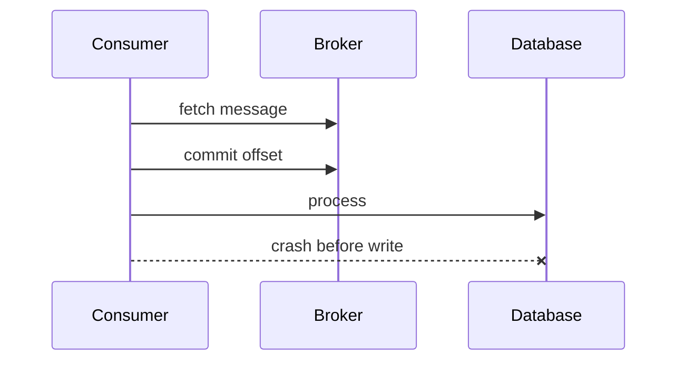
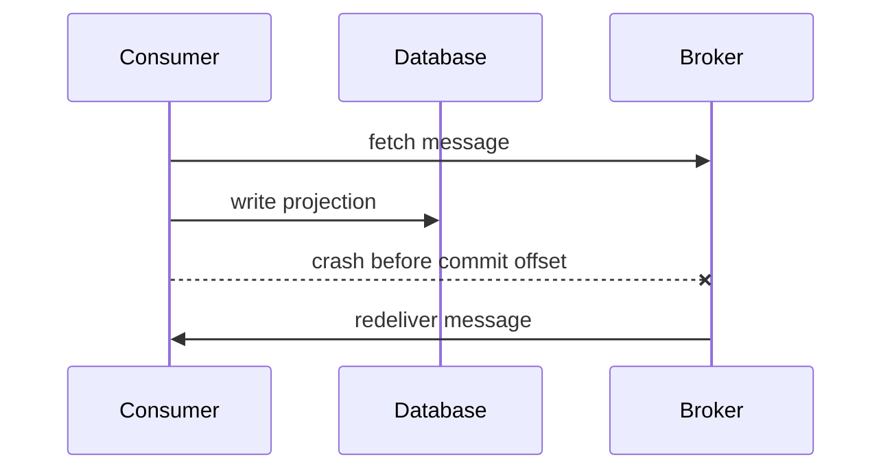
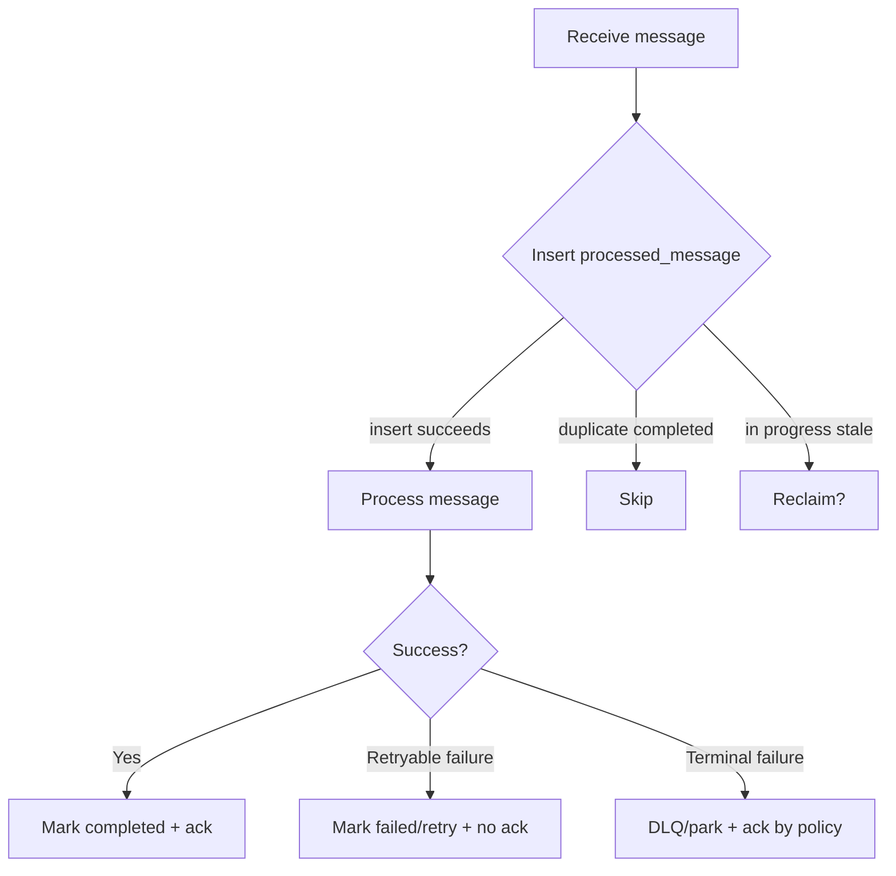
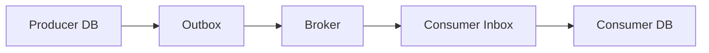
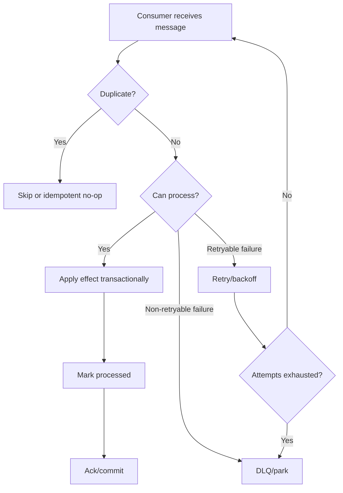

# Part 064 — Message Delivery Semantics and Consumer Correctness

Message delivery semantics are often misunderstood.

People say:

```text
Kafka gives exactly once.
```

or:

```text
Our queue is reliable.
```

or:

```text
The consumer will only get one copy.
```

These statements are usually incomplete.

Delivery semantics are not only a broker feature.

They are the combined behavior of:

- producer,
- broker,
- storage,
- consumer,
- offset/ack commit,
- retry,
- database transaction,
- external side effects,
- idempotency,
- replay,
- failure recovery.

A top-tier engineer asks:

> Exactly once what, where, and under which failure boundary?

That question prevents many production bugs.

---

## 1. The Basic Semantics

Common delivery guarantees:

| Semantics | Meaning |
|---|---|
| At-most-once | Message may be lost, but not redelivered |
| At-least-once | Message should not be lost, but may be redelivered |
| Exactly-once | Message/effect is observed once in a defined scope |
| Effectively-once | Duplicates may occur, but idempotency/dedup makes final effect once |

Apache Kafka's design documentation describes the classic delivery semantics as at-most-once, at-least-once, and exactly-once.

The practical default for most microservice consumers:

```text
assume at-least-once delivery
design idempotent consumers
```

Even if your broker supports stronger guarantees, your database writes and external side effects still need correctness.

---

## 2. At-Most-Once

At-most-once means:

```text
message may be lost
message is not redelivered
```

Typical pattern:

```text
commit offset/ack before processing
process message
```

Failure:



Result:

```text
message lost from consumer perspective
```

Use at-most-once only when loss is acceptable.

Examples:

- low-value telemetry,
- approximate metrics,
- non-critical cache refresh,
- sampled analytics,
- optional notifications where loss is acceptable.

Do not use at-most-once for financial, workflow, audit, compliance, or state transition messages.

---

## 3. At-Least-Once

At-least-once means:

```text
message is not considered done until after processing
message may be delivered again after failure
```

Typical pattern:

```text
process message
commit offset/ack after successful processing
```

Failure:



Result:

```text
database write may happen twice unless idempotent
```

At-least-once is common and practical.

But it requires duplicate-safe consumers.

---

## 4. Exactly-Once: Scope Matters

Exactly-once is not magic.

It must define scope.

Examples:

| Claim | Scope question |
|---|---|
| broker exactly once | producer-to-broker? broker-to-consumer? |
| stream processing exactly once | within Kafka topics and transactional state store? |
| database exactly once | database transaction and unique keys? |
| email exactly once | external email provider idempotency? |
| workflow exactly once | command dedup plus durable state? |

A broker may guarantee that records produced by a transactional producer are committed once to topics.

That does not automatically mean:

```text
the consumer's database update and external HTTP call happen exactly once
```

If your consumer sends an email and crashes before committing offset, broker may redeliver. Email may be sent twice unless email sending is idempotent.

Therefore, design final effects, not only broker guarantees.

---

## 5. Effectively-Once

Effectively-once is the practical goal.

It means:

```text
delivery may duplicate,
processing may retry,
but final business effect is applied once
```

Techniques:

- processed message table,
- unique constraints,
- idempotency keys,
- upserts,
- compare-and-set version,
- event sequence checks,
- external provider idempotency,
- transactional write + offset where supported,
- outbox/inbox patterns.

Example:

```sql
CREATE TABLE processed_message (
    consumer_name text NOT NULL,
    message_id text NOT NULL,
    processed_at timestamptz NOT NULL,
    PRIMARY KEY (consumer_name, message_id)
);
```

Consumer:

```java
if (!processedMessages.tryClaim("notification-consumer", event.id())) {
    return;
}

sendNotification(event);

processedMessages.markCompleted("notification-consumer", event.id());
```

But be careful: if `sendNotification` succeeds and `markCompleted` fails, duplicate can still happen unless notification is also idempotent.

---

## 6. Acknowledgement and Offset Commit

The critical question:

```text
When do you tell the broker the message is done?
```

Options:

| Commit/ack timing | Risk |
|---|---|
| before processing | loss |
| after processing | duplicate processing |
| after DB transaction | duplicate if crash before commit offset |
| in same transaction as output records | stronger for broker-to-broker pipelines |
| after external side effect | duplicate external side effect if crash before ack |

There is no free lunch.

Choose based on business risk.

Most systems choose:

```text
process idempotently
then commit/ack
```

---

## 7. Consumer Offset Is Consumer State

In Kafka-like systems, offset is not just broker internal state.

It represents consumer progress.

If consumer commits offset 100:

```text
consumer says it no longer needs records <= 100
```

If processing of record 100 did not actually succeed, data is lost.

Offset commit must reflect durable processing progress.

For batch processing:

```java
for (Record record : records) {
    process(record);
}
commitOffsetsAfterAllProcessed();
```

But if record 7 fails in a batch, what about records 8-10?

You need policy:

- stop batch and retry from 7,
- process independently and commit per record where supported,
- send failed record to DLQ and continue,
- use partition-aware ordered processing.

Ordering requirements drive commit strategy.

---

## 8. Ordering and Delivery

Ordering and delivery semantics interact.

If events for one aggregate must be ordered:

```text
CaseCreated -> CaseEscalated -> CaseClosed
```

then consumer cannot freely skip `CaseEscalated` and process `CaseClosed`.

Options:

- block partition until issue resolved,
- park poison message and preserve per-key order separately,
- use sequence numbers and gap detection,
- route to per-key retry topic,
- design projection to tolerate out-of-order events.

Ordering requirement should be explicit.

"Kafka preserves order" usually means:

```text
within a partition
```

not globally.

---

## 9. Duplicates

Duplicates can come from:

- producer retry after uncertain publish outcome,
- broker redelivery,
- consumer crash after side effect before ack,
- manual replay,
- DLQ reprocessing,
- outbox relay retry,
- network timeout,
- partition rebalance,
- transactional ambiguity,
- human backfill.

Consumer must assume duplicate unless proven otherwise.

Duplicate-safe strategies:

| Effect | Strategy |
|---|---|
| projection update | upsert by aggregate ID/version |
| email send | notification ID/idempotency key |
| external API call | provider idempotency key |
| audit row | unique event ID |
| workflow transition | compare current state/version |
| search index | deterministic document ID |
| cache update | overwrite by key/version |

---

## 10. Idempotent Consumer Pattern

Basic pattern:

```java
public final class IdempotentMessageHandler<T> {
    private final ProcessedMessageRepository processed;
    private final MessageHandler<T> delegate;
    private final String consumerName;

    public void handle(MessageEnvelope<T> envelope) {
        boolean claimed = processed.tryClaim(consumerName, envelope.messageId());

        if (!claimed) {
            metrics.duplicate(envelope);
            return;
        }

        try {
            delegate.handle(envelope.payload(), envelope.context());
            processed.markCompleted(consumerName, envelope.messageId());
        } catch (RuntimeException ex) {
            processed.markFailed(consumerName, envelope.messageId(), ex);
            throw ex;
        }
    }
}
```

This works when:

- `tryClaim` is atomic,
- message ID is stable,
- duplicate after completion can be ignored,
- failed message can be retried according to policy.

But it does not automatically make external side effects safe.

---

## 11. Processed Message Table States

Use states, not just "exists."

```sql
CREATE TABLE processed_message (
    consumer_name text NOT NULL,
    message_id text NOT NULL,
    status text NOT NULL,
    first_seen_at timestamptz NOT NULL,
    updated_at timestamptz NOT NULL,
    error_code text,
    PRIMARY KEY (consumer_name, message_id)
);
```

States:

| State | Meaning |
|---|---|
| `IN_PROGRESS` | consumer claimed message |
| `COMPLETED` | processing completed |
| `FAILED_RETRYABLE` | failed but retry allowed |
| `FAILED_TERMINAL` | failed permanently |
| `PARKED` | moved to manual/remediation path |

This helps handle crash recovery and stuck `IN_PROGRESS`.

---

## 12. Claim Algorithm



Need carefully define stale `IN_PROGRESS`.

If a consumer crashes after claim, another delivery may find `IN_PROGRESS`.

Policy:

- wait/retry later,
- reclaim after timeout,
- inspect processing status,
- mark abandoned,
- use lock expiry.

Do not let `IN_PROGRESS` block forever.

---

## 13. Transaction Boundary

Best case:

```text
process message and record processed_message in same database transaction
```

Example projection update:

```java
transactionTemplate.executeWithoutResult(tx -> {
    if (!processed.tryInsert(consumer, event.id())) {
        return;
    }

    projectionRepository.upsert(event.caseId(), event.version(), event.payload());
    processed.markCompleted(consumer, event.id());
});
```

Then commit offset after DB transaction succeeds.

Crash after DB commit but before offset commit:

```text
message redelivered
processed table says completed
consumer skips
```

This gives effectively-once effect for database projection.

---

## 14. External Side Effects

External side effects are harder.

Example:

```java
sendEmail(event);
markProcessed(event.id());
ack();
```

Crash after `sendEmail` before `markProcessed`:

```text
redelivery -> email may send again
```

Solutions:

1. use external provider idempotency key,
2. store notification intent in DB and send via outbox,
3. use unique notification ID,
4. make provider call deduplicated,
5. accept duplicate if business allows,
6. require manual reconciliation.

For critical side effects, prefer outbox-style durable intent.

---

## 15. Retry Semantics

Message retry must distinguish:

- transient failure,
- deterministic poison message,
- dependency outage,
- rate limit,
- business precondition,
- schema incompatibility,
- authorization failure.

Bad:

```text
retry forever
```

Bad:

```text
DLQ immediately on first transient DB timeout
```

Better:

```text
bounded retry with backoff
then DLQ/parking for terminal or exhausted messages
```

Retry policy:

```yaml
retry:
  maxAttempts: 5
  initialDelayMs: 1000
  maxDelayMs: 60000
  jitter: true
  retryable:
    - DATABASE_TIMEOUT
    - DEPENDENCY_UNAVAILABLE
    - RATE_LIMITED
  nonRetryable:
    - SCHEMA_INVALID
    - AUTHORIZATION_FAILED
    - UNKNOWN_EVENT_TYPE
```

---

## 16. Retry Topics vs Blocking Partition

If processing a message fails, you can:

### Block and retry in place

Pros:

- preserves ordering,
- simple.

Cons:

- one poison message blocks partition,
- lag grows.

### Move to retry topic with delay

Pros:

- main flow continues,
- backoff easier,
- poison isolated.

Cons:

- ordering may be broken,
- complexity,
- duplicates/reordering.

### DLQ/parking lot

Pros:

- prevents infinite blocking,
- manual remediation.

Cons:

- message not processed automatically,
- business process may be incomplete.

Ordering requirements decide.

---

## 17. Dead-Letter Queue / Topic

DLQ stores messages that could not be processed.

DLQ message should include:

- original topic/channel,
- original partition/offset if available,
- original key,
- original headers,
- payload or payload reference,
- consumer name,
- failure reason,
- exception class,
- attempt count,
- first failure time,
- last failure time,
- schema version,
- correlation ID.

DLQ is not a trash can.

It is an operational workflow.

A DLQ with no owner, alert, or replay tool is message loss with extra steps.

---

## 18. Parking Lot

A parking lot is similar to DLQ but often implies manual or controlled remediation.

Use parking lot for:

- business exceptions needing human review,
- unknown schema requiring deployment,
- poison messages,
- data correction,
- dependency-specific repeated failure,
- compliance-sensitive messages.

Required operations:

- inspect,
- classify,
- fix payload or state,
- replay,
- skip with audit,
- delete with approval.

Parking lot must have runbook.

---

## 19. Poison Message Detection

Poison message signs:

- same message fails repeatedly,
- same error reason,
- non-retryable validation error,
- deserialization failure,
- unknown event type,
- unsupported enum,
- invariant violation,
- consumer version incompatible.

Detection metric:

```text
message.failures.total{message_id_hash,event_type,reason}
```

But avoid raw message ID high-cardinality in metrics.

Use logs/traces for exact IDs.

Policy:

```text
after N attempts or non-retryable error -> DLQ/park
```

Do not block entire consumer indefinitely.

---

## 20. Deserialization Failures

If consumer cannot deserialize message, application handler may never run.

You still need handling.

Common causes:

- incompatible schema,
- wrong serializer,
- corrupt payload,
- missing schema ID,
- unsupported version,
- invalid JSON/Avro/Protobuf.

Policy:

- route to deserialization DLQ if supported,
- log safe metadata,
- alert producer and topic owner,
- do not commit offset silently without record,
- do not retry forever if deterministic.

Schema compatibility gates prevent many of these failures.

But runtime handling is still needed.

---

## 21. Ordering and Idempotency

If events have version:

```json
{
  "caseId": "CASE-100",
  "version": 42,
  "eventType": "CaseEscalated"
}
```

Consumer can apply:

```java
if (event.version() <= projection.currentVersion(caseId)) {
    return; // duplicate or old event
}

if (event.version() != projection.currentVersion(caseId) + 1) {
    throw new SequenceGapException();
}

projection.apply(event);
```

This protects against:

- duplicates,
- old events,
- out-of-order events,
- gaps.

But it may block on missing event.

Need gap policy:

- retry later,
- fetch missing state,
- rebuild projection,
- park key,
- alert.

---

## 22. Rebalance and Duplicate Processing

Consumer group rebalancing can cause duplicates.

Scenario:

1. Consumer A reads message.
2. Consumer A processes but has not committed offset.
3. Rebalance assigns partition to Consumer B.
4. Consumer B reads same message.
5. Duplicate processing happens.

This is normal in at-least-once systems.

Design for it.

Do not assume "one consumer instance" means no duplicate.

---

## 23. Batch Processing

Batch consumption improves throughput.

But it complicates error handling.

Example batch:

```text
records 1,2,3,4,5
record 3 fails
```

Options:

- fail whole batch and retry all,
- process records independently and commit safe offsets,
- send record 3 to DLQ and continue,
- stop at record 3 to preserve ordering.

If order matters within partition, you cannot simply skip record 3 and commit record 5 without policy.

Batching should not hide per-record correctness.

---

## 24. Consumer Transactions

Some platforms support transactions.

Kafka has producer idempotence and transactions that can support exactly-once semantics in Kafka-to-Kafka pipelines when used correctly.

But if the consumer writes to an external database or sends HTTP calls, the transaction boundary may not include those systems.

Therefore:

```text
broker transaction != global distributed transaction
```

Use transactions where they fit.

Still design idempotent external side effects.

---

## 25. Outbox and Inbox

Outbox protects producer side:

```text
business state + outgoing message recorded atomically
```

Inbox protects consumer side:

```text
incoming message processing recorded idempotently
```

Together:



This is a robust pattern for many Java microservices.

Outbox prevents missing events.

Inbox prevents duplicate effects.

---

## 26. Delivery Semantics Matrix

| Producer | Broker | Consumer | Final effect |
|---|---|---|---|
| non-idempotent | at-least-once | non-idempotent | duplicates possible |
| idempotent producer | at-least-once | non-idempotent | consumer duplicates possible |
| outbox producer | durable publish | idempotent consumer | effectively-once DB effect |
| transactional Kafka pipeline | EOS configured | Kafka output only | exactly-once within Kafka scope |
| outbox + external email no idempotency | durable event | non-idempotent side effect | duplicate email possible |
| outbox + notification ID | durable event | provider idempotency | effectively-once notification |

Always specify final effect scope.

---

## 27. Java Consumer Skeleton

```java
public final class CaseEscalatedConsumer {
    private final ProcessedMessageRepository processedMessages;
    private final CaseEscalatedHandler handler;
    private final DeadLetterPublisher deadLetterPublisher;

    public void onMessage(MessageEnvelope<CaseEscalatedEvent> envelope) {
        try {
            boolean claimed = processedMessages.tryClaim(
                "case-escalated-consumer",
                envelope.messageId()
            );

            if (!claimed) {
                metrics.duplicate(envelope);
                return;
            }

            handler.handle(envelope.payload(), envelope.context());

            processedMessages.markCompleted(
                "case-escalated-consumer",
                envelope.messageId()
            );

            envelope.ack();
        } catch (NonRetryableMessageException ex) {
            deadLetterPublisher.publish(envelope, ex);
            envelope.ack();
        } catch (RetryableMessageException ex) {
            envelope.nackWithBackoff(ex);
        }
    }
}
```

Broker-specific implementation differs.

Correctness shape remains similar.

---

## 28. Message Envelope

```java
public record MessageEnvelope<T>(
    String messageId,
    String key,
    T payload,
    MessageContext context,
    Acknowledgement acknowledgement
) {
    public void ack() {
        acknowledgement.ack();
    }

    public void nackWithBackoff(Throwable cause) {
        acknowledgement.nack(cause);
    }
}
```

Keep application handler focused on business processing.

Keep broker ack mechanics in infrastructure adapter.

---

## 29. Observability

Metrics:

```text
consumer.messages.received.total{topic,consumer_group,event_type}
consumer.messages.processed.total{topic,consumer_group,event_type,outcome}
consumer.processing.duration{topic,consumer_group,event_type}
consumer.duplicates.total{topic,consumer_group,event_type}
consumer.retries.total{topic,consumer_group,event_type,reason}
consumer.dlq.total{topic,consumer_group,event_type,reason}
consumer.lag{topic,consumer_group,partition}
consumer.offset.commits.total{topic,consumer_group,status}
consumer.deserialization.failures.total{topic,reason}
consumer.poison.detected.total{topic,event_type}
```

Important outcomes:

- success,
- duplicate_skipped,
- retryable_failure,
- terminal_failure,
- dlq,
- parked,
- deserialization_failure,
- schema_incompatible.

---

## 30. Alerts

Useful alerts:

| Alert | Meaning |
|---|---|
| consumer lag rising | consumer cannot keep up |
| DLQ rate > 0 for critical topic | messages not processed |
| poison message detected | partition may block |
| duplicate rate spike | producer/retry/rebalance issue |
| deserialization failure | schema compatibility issue |
| processing p99 high | dependency/DB slowness |
| retry exhausted | business process stuck |
| outbox pending growing | producer relay failing |
| offset commit failures | progress not durable |
| partition idle unexpectedly | producer stopped or routing issue |

Message systems fail silently without lag/DLQ alerts.

---

## 31. Testing Delivery Semantics

Minimum tests:

| Scenario | Expected |
|---|---|
| message processed successfully | ack/commit after side effect |
| crash before ack | redelivery handled idempotently |
| duplicate message | skipped or idempotently applied |
| retryable dependency failure | retry/backoff |
| non-retryable validation failure | DLQ/park |
| deserialization failure | error topic/DLQ |
| poison message | bounded retry then DLQ |
| out-of-order event | gap/old event policy applied |
| batch partial failure | correct commit behavior |
| replay | no duplicate side effects |

Test duplicate explicitly.

Do not rely on broker behavior in unit tests.

---

## 32. Duplicate Test

```java
@Test
void skipsAlreadyProcessedEvent() {
    CaseEscalatedEvent event = event("evt-123", "CASE-100");

    consumer.onMessage(envelope(event));
    consumer.onMessage(envelope(event));

    assertThat(notificationRepository.sentCountForEvent("evt-123")).isEqualTo(1);
}
```

If this test is hard to write, the consumer design is probably too coupled to broker mechanics.

---

## 33. Crash Window Test

Simulate:

```text
business effect succeeds
ack fails/crash before ack
message redelivered
```

```java
@Test
void redeliveryAfterCommitDoesNotDuplicateProjection() {
    MessageEnvelope<CaseEscalatedEvent> envelope = envelope("evt-123");

    consumer.processBusinessEffectButDoNotAck(envelope);

    consumer.onMessage(envelope("evt-123"));

    assertThat(projection.version("CASE-100")).isEqualTo(1);
}
```

This is the core at-least-once correctness test.

---

## 34. Production Policy Template

```yaml
deliverySemantics:
  topics:
    case-events:
      defaultGuarantee: at-least-once
      key: caseId
      ordering: per-key
      retention: 7d
      replayAllowed: true

      consumers:
        search-indexer:
          idempotency:
            strategy: aggregate-version-upsert
            duplicateHandling: skip
          offsetCommit:
            timing: after-db-transaction
          retry:
            maxAttempts: 5
            backoff: exponential-jitter
          dlq:
            enabled: true
            topic: case-events.search-indexer.dlq
            owner: search-team
          poison:
            maxAttemptsBeforePark: 5
          lagSlo:
            maxLagSeconds: 60

        notification-sender:
          idempotency:
            strategy: notification-id
            externalProviderIdempotency: true
          replay:
            allowed: false-for-side-effect
          dlq:
            enabled: true
            manualReviewRequired: true
```

Policy must be per consumer, not only per topic.

Different consumers have different side effects.

---

## 35. Common Anti-Patterns

### 35.1 Assuming no duplicates

Duplicates are normal.

### 35.2 Committing before processing critical messages

Message loss.

### 35.3 Retrying poison forever

Partition blocked, lag grows.

### 35.4 DLQ with no owner

Operational black hole.

### 35.5 Global ordering requirement

Scalability killer.

### 35.6 Side effects without idempotency

Duplicate emails/payments/API calls.

### 35.7 Ignoring deserialization failures

Consumer never reaches handler.

### 35.8 Treating exactly-once as broker checkbox

Final business effect still duplicates.

### 35.9 No lag alert

Stale projections discovered by users.

### 35.10 Replay unsafe consumers

Backfill triggers real side effects.

---

## 36. Decision Model



The broker delivers messages.

Your consumer delivers correctness.

---

## 37. Design Checklist

Before shipping a consumer:

- What delivery semantics are assumed?
- Can message be duplicated?
- What is message ID?
- Is consumer idempotent?
- What side effects happen?
- Are external side effects deduplicated?
- When is offset/ack committed?
- What happens if crash occurs before ack?
- What happens if crash occurs after side effect?
- Is ordering required?
- What is partition key?
- What happens on poison message?
- Is retry bounded?
- Is DLQ owned?
- Is replay safe?
- Are schema/deserialization failures handled?
- Is lag monitored?
- Are duplicate tests written?
- Is crash-window behavior tested?
- Is runbook ready?

---

## 38. The Real Lesson

Messaging reliability is not the broker's job alone.

The broker can store and redeliver messages.

It cannot know whether your email was sent twice, your projection applied twice, your payment duplicated, or your workflow transitioned incorrectly.

Delivery semantics become business correctness only when consumer design is correct.

That usually means:

```text
at-least-once delivery
+ idempotent consumer
+ correct offset/ack timing
+ bounded retry
+ DLQ/parking
+ replay policy
+ lag observability
```

That is the production baseline.

---

## References

- Apache Kafka Design — Message Delivery Semantics: https://kafka.apache.org/0100/design/design/#semantics
- Apache Kafka Documentation: https://kafka.apache.org/documentation/
- Confluent Kafka Design — Delivery Semantics: https://docs.confluent.io/kafka/design/delivery-semantics.html
- Enterprise Integration Patterns — Idempotent Receiver: https://www.enterpriseintegrationpatterns.com/patterns/messaging/IdempotentReceiver.html
- Enterprise Integration Patterns — Dead Letter Channel: https://www.enterpriseintegrationpatterns.com/patterns/messaging/DeadLetterChannel.html
- Enterprise Integration Patterns — Message Channel: https://www.enterpriseintegrationpatterns.com/patterns/messaging/MessageChannel.html
