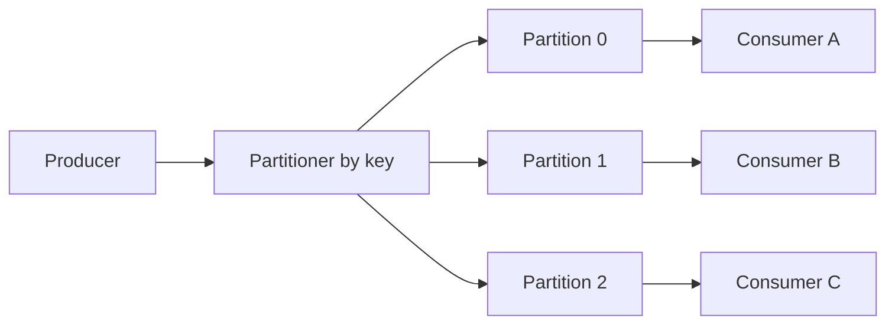
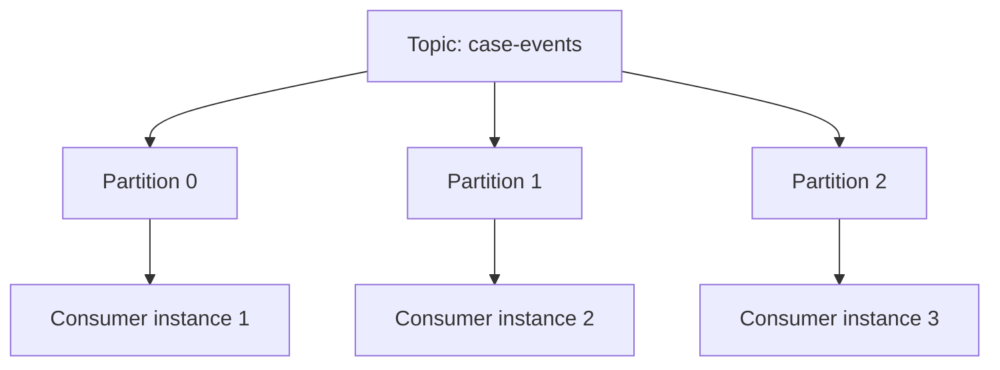
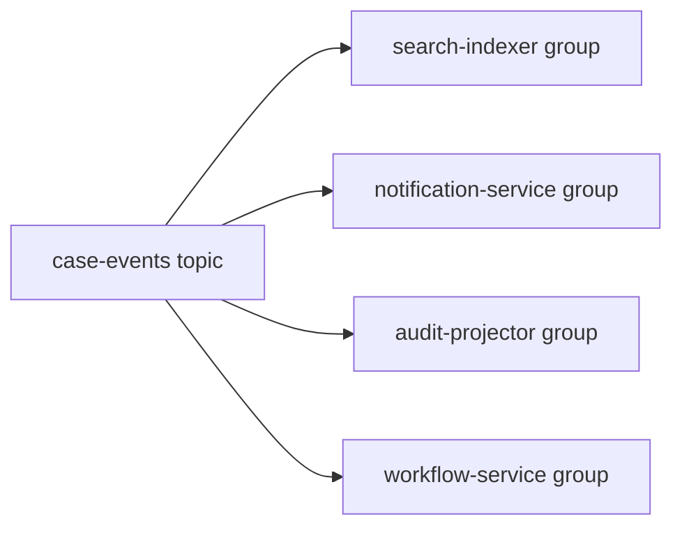
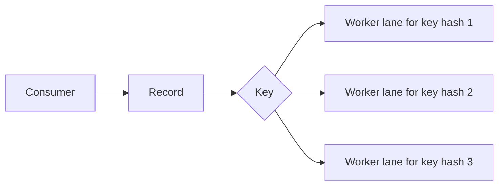
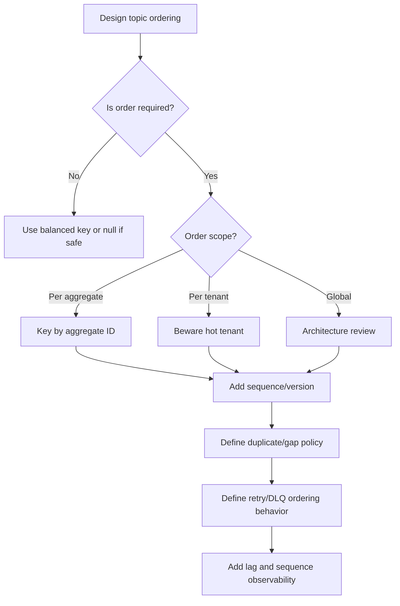

# Part 065 — Ordering, Partitioning, Keys, and Consumer Groups

Ordering is one of the most expensive promises in distributed systems.

Many teams say:

```text
events must be ordered
```

but they do not specify:

- ordered by what?
- ordered for whom?
- ordered within which key?
- ordered across which partitions?
- ordered across retries?
- ordered across replay?
- ordered across regions?
- ordered across topics?
- ordered after schema evolution?
- ordered after poison-message handling?

Without a precise ordering contract, consumers guess.

When consumers guess, projections become wrong, workflows transition incorrectly, replay breaks, and incident debugging becomes painful.

The production rule:

> Do not promise global ordering unless you are willing to pay for global serialization. Prefer per-aggregate ordering with explicit keys.

---

## 1. The Core Mental Model

In log-based messaging systems such as Kafka, a topic is split into partitions.



Within a single partition, records have an order.

Across partitions, there is no single global order.

Therefore, ordering is usually:

```text
per partition
```

and if keying is stable:

```text
per key
```

Example:

```text
key = caseId
```

Then all events for one case go to the same partition, and consumers process that case's events in partition order.

That is scalable because different cases can be processed in parallel.

---

## 2. Ordering Must Be Scoped

Bad requirement:

```text
case events must be ordered
```

Better:

```text
For a given caseId, case lifecycle events must be consumed in the same order they were committed by case-service.
No ordering is guaranteed across different caseIds.
```

Even better:

```text
Events for the same caseId are produced to the same topic partition using caseId as key.
Each event includes aggregateVersion.
Consumers must ignore duplicates and reject or park gaps.
```

Ordering contract should define:

- key scope,
- producer ordering source,
- event sequence/version,
- partitioning strategy,
- consumer behavior on duplicate,
- consumer behavior on old event,
- consumer behavior on gap,
- replay behavior.

---

## 3. Why Global Ordering Is Expensive

Global ordering means all messages must pass through one ordered sequence.

This limits:

- producer parallelism,
- broker parallelism,
- consumer parallelism,
- regional scalability,
- failover flexibility,
- throughput,
- availability.

Global order can be justified for rare use cases:

- append-only ledger with strict sequence,
- single aggregate stream,
- audit sequence in one jurisdiction,
- command queue for one resource.

But most microservices do not need global order.

They need per-entity order.

Example:

```text
Order events for ORDER-100 must be ordered.
ORDER-100 and ORDER-200 do not need global relative order.
```

Per-aggregate ordering is the common design sweet spot.

---

## 4. Message Key as Ordering Boundary

The message key determines partitioning in many log systems.

Example:

```java
ProducerRecord<String, CaseEvent> record =
    new ProducerRecord<>(
        "case-events",
        event.caseId(),
        event
    );
```

If partitioner maps key consistently:

```text
same key -> same partition
```

Then:

```text
all events for one case are ordered in one partition
```

But if key changes, ordering changes.

Bad:

```text
CaseCreated key = caseId
CaseEscalated key = escalationId
CaseClosed key = caseId
```

Now events for same case may land in different partitions.

Choose one key per event family based on ordering requirement.

---

## 5. Key Choice Trade-Offs

Key affects:

- ordering,
- parallelism,
- hot partitions,
- replay,
- compaction,
- locality,
- consumer scaling.

Common keys:

| Key | Good for | Risk |
|---|---|---|
| aggregate ID | per-entity ordering | hot aggregate |
| tenant ID | tenant ordering | hot tenant, poor parallelism |
| command ID | dedup/correlation | no aggregate ordering |
| user ID | per-user order | hot users |
| random UUID | even distribution | no useful ordering |
| composite key | balanced semantics | more complex governance |

Example composite key:

```text
tenantId + ":" + caseId
```

But if `caseId` is already globally unique, tenant may be redundant.

Avoid keys that encode sensitive data directly if logs/metrics expose keys.

---

## 6. Hot Partitions

A hot partition receives disproportionate traffic.

Causes:

- one tenant has most traffic,
- one aggregate has huge event volume,
- key has low cardinality,
- many messages have null key,
- bad partitioner,
- batch job targets one key,
- command replay concentrates load.

Symptoms:

- consumer lag on one partition,
- broker disk/network imbalance,
- one consumer instance overloaded,
- p99 processing high for one key,
- partition-specific error spikes.

Example bad key:

```text
key = eventType
```

If most events are `CaseUpdated`, one partition gets most traffic.

Key must distribute load while preserving required order.

---

## 7. Null Keys

In Kafka-like systems, null keys are often distributed without per-entity ordering.

This can be acceptable for:

- metrics,
- logs,
- independent telemetry,
- unordered analytics.

It is dangerous for:

- aggregate lifecycle events,
- workflow commands,
- projection updates requiring order,
- compaction topics,
- dedup by key.

If ordering matters, key must not be null.

Validation:

```java
if (event.key() == null || event.key().isBlank()) {
    throw new InvalidEventKeyException("case event key must be caseId");
}
```

Enforce key at producer boundary.

---

## 8. Partition Count

Partition count affects:

- max consumer parallelism,
- broker resource usage,
- rebalancing cost,
- file handles,
- memory overhead,
- ordering distribution,
- future scalability.

If a topic has 12 partitions, a consumer group can process with at most 12 active consumers for that topic.

Extra consumers are idle for that topic.

```text
partitions = 12
consumer instances = 20
active consumers <= 12
```

Too few partitions limit scaling.

Too many partitions increase overhead and operational cost.

Choose based on expected throughput, retention, consumer parallelism, broker capacity, and future growth.

---

## 9. Partition Count Cannot Be Changed Casually

In Kafka, increasing partitions can change key-to-partition mapping for future records depending on partitioning strategy.

That can break ordering if consumers assume all records for a key always lived in one partition over history.

Common mitigation:

- choose enough partitions up front,
- use custom stable partitioning if needed,
- avoid changing partition count for topics requiring strict long-term per-key order,
- understand the platform-specific partitioner behavior,
- plan migration to new topic if needed.

Partition count is part of topic contract.

Do not treat it as a purely operational knob.

---

## 10. Consumer Group Mental Model

A consumer group is a set of consumers cooperating to process a topic.



Within one consumer group:

```text
one partition is assigned to one consumer at a time
```

Across different consumer groups:

```text
each group has independent offsets and gets its own copy of the stream
```

Example groups:

- `search-indexer`,
- `notification-service`,
- `audit-projector`,
- `analytics-pipeline`.

Each group consumes independently.

---

## 11. Fan-Out with Consumer Groups

A topic can feed many consumer groups.



Each group has its own progress.

Search can be caught up while notification is lagging.

This is powerful.

It also means topic compatibility must serve all consumers.

Producer cannot say:

```text
my service works
```

if important consumer groups are broken by event schema or ordering changes.

Topic ownership includes consumer impact.

---

## 12. Consumer Parallelism

Consumer parallelism is bounded by partitions.

If you need more processing throughput, options:

1. increase partitions,
2. optimize handler,
3. batch processing,
4. reduce per-message dependency calls,
5. split topic by domain/load,
6. use internal worker pool carefully,
7. partition by finer key,
8. separate hot keys,
9. scale downstream dependencies.

Do not simply add more consumer instances if partitions are already saturated by assignment limit.

Example:

```text
topic partitions = 8
consumer instances = 16
only 8 active for that topic
```

The other 8 are not helping.

---

## 13. Internal Parallelism Inside Consumer

A consumer may use worker threads.

Risk:

- breaks partition ordering,
- commits offsets before work completes,
- creates duplicates or loss,
- overwhelms downstream dependencies.

Bad:

```java
records.forEach(record -> executor.submit(() -> process(record)));
commitOffsets();
```

This commits before async processing finishes.

Safer options:

- process sequentially per partition,
- use per-key ordered executor,
- track futures before commit,
- commit only completed contiguous offsets,
- use batch transaction,
- pause partition when worker queue full.

Parallelism inside a consumer is advanced.

Get correctness first.

---

## 14. Rebalancing

Rebalancing happens when consumer group membership or partition assignment changes.

Causes:

- consumer instance starts,
- consumer instance stops,
- heartbeat missed,
- deployment,
- network pause,
- long GC pause,
- scaling event,
- topic partition changes.

During rebalance:

- partitions are revoked and assigned,
- processing may pause,
- uncommitted messages may redeliver,
- duplicates can occur,
- lag can spike.

Consumers must handle revocation carefully:

- stop accepting new work for revoked partition,
- finish or cancel in-flight work,
- commit safe offsets,
- release partition-specific resources,
- avoid processing after losing ownership.

Rebalance is normal, not exceptional.

---

## 15. Offset Commit and Rebalance

If a partition is revoked while messages are in-flight, committing wrong offset can cause loss or duplicates.

Safe behavior:

```text
only commit offsets for records whose processing effect is durably complete
```

If using async worker pool, track per-partition completed offsets.

Do not commit "latest fetched offset" blindly.

Rebalance callbacks should flush or stop per-partition work safely.

---

## 16. Consumer Lag by Partition

Average lag hides hot partitions.

Example:

```text
partitions:
0 lag 0
1 lag 0
2 lag 100000
3 lag 0

average lag = 25000
```

But operational issue is partition 2.

Monitor lag per partition and per key if possible through sampled logs.

Metrics:

```text
consumer.lag{topic,partition,consumer_group}
consumer.max_lag{topic,consumer_group}
consumer.lag_seconds{topic,consumer_group}
```

Lag should be translated into freshness:

```text
search projection is 3 minutes behind
```

not only:

```text
offset lag = 100000
```

---

## 17. Ordering and Retry

Retries can break order.

If record 10 fails and record 11 succeeds, projection may apply out of order.

Options:

### Preserve order

Stop partition at record 10 until it succeeds, DLQs, or parks.

Pros:

- order preserved.

Cons:

- one bad record blocks following records.

### Retry topic

Move record 10 to delayed retry topic and continue with 11.

Pros:

- throughput continues.

Cons:

- per-key ordering may break.

### Per-key parking

Park key `CASE-100`, continue other keys in same partition if framework supports it.

Pros:

- preserves per-key order while reducing partition blockage.

Cons:

- complex.

Choose based on ordering contract.

---

## 18. DLQ and Ordering

Sending a message to DLQ and continuing means:

```text
later messages may be processed without this message
```

If the missing message is required for state correctness, this is dangerous.

Example:

```text
CaseCreated failed and DLQ'd
CaseEscalated processed
projection has escalation for missing case
```

DLQ policy must know whether order can be broken.

For strict lifecycle projections:

- DLQ may require parking the key,
- replay after fix,
- rebuild projection,
- stop partition until resolved.

DLQ is not always safe continuation.

---

## 19. Sequence Numbers

Event version or sequence number helps consumers detect order problems.

Example:

```json
{
  "caseId": "CASE-100",
  "aggregateVersion": 42,
  "eventType": "CaseEscalated"
}
```

Consumer logic:

```java
long current = projection.currentVersion(event.caseId());

if (event.version() <= current) {
    return; // duplicate or old
}

if (event.version() != current + 1) {
    throw new SequenceGapException(event.caseId(), current, event.version());
}

projection.apply(event);
```

This makes ordering violations visible.

Without sequence, consumer may silently corrupt state.

---

## 20. Per-Key Ordering With Parallel Workers

If you need parallelism but per-key order, use per-key serialization.

Concept:



Records for same key go to same lane.

Different keys can process in parallel.

But offset commit becomes harder because partition offset order may not match worker completion order.

You must commit only contiguous completed offsets.

This pattern is powerful but complex.

Use it only when sequential partition processing is insufficient.

---

## 21. Topic Design and Event Families

Do all events go to one topic?

Option 1:

```text
case-events
```

contains many event types.

Pros:

- one stream for case domain,
- preserves per-case ordering across event types,
- easy replay for case projections.

Cons:

- consumers filter many event types,
- schema evolution complexity,
- high traffic event affects all consumers.

Option 2:

```text
case-escalated
case-closed
case-assigned
```

Pros:

- simple consumer subscription,
- isolated traffic,
- separate retention/ownership.

Cons:

- ordering across event types harder,
- topic sprawl,
- consumer needing full lifecycle reads many topics.

Use one topic per aggregate event family when ordering across event types matters.

Use separate topics when lifecycle order is not needed and traffic/ownership differs.

---

## 22. Compacted Topics

Some log systems support compaction by key.

Compacted topic keeps latest value per key eventually.

Good for:

- latest state snapshots,
- reference data,
- cache warmup,
- materialized state distribution.

Not good for:

- full event history,
- audit trail,
- workflow event sequence.

Example:

```text
case-snapshots compacted by caseId
```

Event topic:

```text
case-events retained for 7 days
```

Snapshot topic:

```text
case-snapshots compacted
```

Do not confuse event log with state table.

They serve different purposes.

---

## 23. Multi-Region Ordering

Multi-region event systems complicate ordering.

Questions:

- where is the aggregate owner region?
- can two regions produce events for same key?
- how are clocks used?
- is sequence assigned centrally?
- what happens during failover?
- are duplicate events possible after disaster recovery?
- are consumers region-local or global?

Do not use wall-clock timestamp as ordering source for critical workflows.

Use explicit sequence/version from authoritative writer.

If active-active writes exist, ordering becomes a domain conflict resolution problem.

---

## 24. Clock Time Is Not Order

Event timestamp:

```text
occurredAt = 2026-07-05T10:15:30Z
```

is useful.

But it is not a reliable ordering mechanism across services.

Problems:

- clock skew,
- delayed publish,
- retry,
- outbox relay lag,
- network delay,
- batch backfill,
- replay,
- producer time vs commit time.

Use timestamps for observability and business time.

Use sequence/version/offset for processing order.

---

## 25. Java Producer Key Policy

Producer should make key explicit.

```java
public interface EventKeyStrategy<T> {
    String keyFor(T event);
}
```

Example:

```java
public final class CaseEventKeyStrategy implements EventKeyStrategy<CaseEvent> {
    @Override
    public String keyFor(CaseEvent event) {
        return event.caseId().value();
    }
}
```

Publisher validates:

```java
String key = keyStrategy.keyFor(event);

if (key == null || key.isBlank()) {
    throw new InvalidMessageKeyException("Case event key is required");
}

messageBroker.publish("case-events", key, event);
```

No implicit null keys for ordered event families.

---

## 26. Java Consumer Partition Context

Expose partition context to infrastructure code.

```java
public record PartitionContext(
    String topic,
    int partition,
    long offset,
    String key,
    String consumerGroup
) {}
```

Use it in logs:

```json
{
  "event": "message_processing_failed",
  "topic": "case-events",
  "partition": 3,
  "offset": 90210,
  "keyHash": "6d4f...",
  "consumerGroup": "search-indexer",
  "reason": "SEQUENCE_GAP"
}
```

Hash key if sensitive.

Exact topic/partition/offset is critical for replay and remediation.

---

## 27. Observability

Metrics:

```text
producer.records.total{topic,event_type,status}
producer.null_key.total{topic,event_type}
producer.key_distribution{topic,partition}
consumer.records.total{topic,consumer_group,event_type,status}
consumer.lag{topic,partition,consumer_group}
consumer.partition.assigned{topic,consumer_group,partition}
consumer.rebalances.total{topic,consumer_group}
consumer.sequence.gaps.total{topic,event_type}
consumer.out_of_order.total{topic,event_type}
consumer.hot_partition.detected.total{topic,partition}
```

Logs:

- partition assignment/revocation,
- sequence gap,
- duplicate old event,
- hot key detected,
- DLQ due ordering failure,
- partition lag threshold exceeded.

Do not log raw keys if they contain sensitive data.

---

## 28. Alerting

Useful alerts:

| Alert | Meaning |
|---|---|
| one partition lagging | hot partition or poison message |
| rebalances frequent | unstable consumer group |
| null key on ordered topic | producer bug |
| sequence gap detected | missing/out-of-order event |
| out-of-order events rising | key/producer/retry issue |
| consumer count > partition count | wasted scale |
| partition count near scale limit | capacity planning |
| DLQ for ordered topic | projection correctness risk |
| hot key detected | domain/load skew |

Ordering alerts should be treated as correctness alerts, not only throughput alerts.

---

## 29. Testing Key and Ordering

Producer test:

```java
@Test
void caseEventsUseCaseIdAsKey() {
    CaseEscalatedEvent event = new CaseEscalatedEvent(
        new CaseId("CASE-100"),
        new EscalationId("ESC-900")
    );

    PublishedMessage message = publisher.publish(event);

    assertThat(message.topic()).isEqualTo("case-events");
    assertThat(message.key()).isEqualTo("CASE-100");
}
```

Consumer sequence test:

```java
@Test
void rejectsSequenceGap() {
    projection.setCurrentVersion("CASE-100", 40);

    CaseEvent event = eventWithVersion("CASE-100", 42);

    assertThatThrownBy(() -> consumer.handle(event))
        .isInstanceOf(SequenceGapException.class);
}
```

Duplicate/old event test:

```java
@Test
void ignoresOldEventVersion() {
    projection.setCurrentVersion("CASE-100", 42);

    CaseEvent event = eventWithVersion("CASE-100", 41);

    consumer.handle(event);

    assertThat(projection.currentVersion("CASE-100")).isEqualTo(42);
}
```

Ordering behavior should not be implicit.

---

## 30. Rebalance Testing

Test:

- partition revoked while processing,
- offset commit after processing,
- duplicate after rebalance,
- consumer shutdown,
- long processing exceeding poll interval,
- worker queue drain.

Conceptual:

```java
@Test
void doesNotCommitOffsetForUnfinishedRecordOnPartitionRevocation() {
    consumer.startProcessing(recordAtOffset(10));
    consumer.onPartitionsRevoked(List.of(partition0));

    assertThat(offsetCommitter.committedOffset(partition0))
        .isLessThanOrEqualTo(9);
}
```

Rebalance bugs cause loss or duplicates.

Test them.

---

## 31. Production Policy Template

```yaml
topics:
  case-events:
    owner: case-platform
    purpose: case aggregate lifecycle events
    key:
      field: caseId
      required: true
      orderingScope: per-case
      nullKeyAllowed: false
    partitions:
      count: 48
      changeRequiresArchitectureReview: true
    ordering:
      guaranteedWithinKey: true
      globalOrdering: false
      sequenceField: aggregateVersion
      gapPolicy: park-key-and-alert
      duplicatePolicy: ignore-if-version-already-applied
    consumers:
      search-indexer:
        groupId: search-indexer
        maxInstances: 48
        orderingRequired: true
        retryPolicy: preserve-partition-order
      notification-service:
        groupId: notification-service
        orderingRequired: false
        retryPolicy: delayed-retry-topic
    observability:
      lagPerPartition: true
      sequenceGapAlert: true
      nullKeyAlert: true
```

This policy makes topic behavior explicit.

---

## 32. Common Anti-Patterns

### 32.1 "Kafka preserves order" without scope

Order is partition-scoped.

### 32.2 Key changes across event types

Per-aggregate order breaks.

### 32.3 Null key on ordered topic

No useful ordering guarantee.

### 32.4 Global ordering requirement by default

Scalability collapses.

### 32.5 Increasing partitions casually

Key-to-partition behavior may change.

### 32.6 Async worker pool commits offsets too early

Message loss or out-of-order effects.

### 32.7 DLQ breaks required sequence

Projection silently corrupts.

### 32.8 Average lag only

Hot partition hidden.

### 32.9 Tenant ID as key for all events

Hot tenant causes hot partition.

### 32.10 No sequence/version field

Consumer cannot detect missing/out-of-order events.

---

## 33. Decision Model



Ordering is a contract, not a broker checkbox.

---

## 34. Design Checklist

Before publishing ordered events:

- What is the ordering scope?
- What is the message key?
- Is null key forbidden?
- Is key stable across event types?
- Is partition count chosen intentionally?
- Can partition count be changed safely?
- Is sequence/version included?
- What happens on duplicate?
- What happens on old event?
- What happens on sequence gap?
- Does retry preserve order?
- Can DLQ break order?
- Is consumer parallelism bounded by partitions?
- Are rebalances handled safely?
- Is lag monitored per partition?
- Are hot keys detectable?
- Are key/order tests written?
- Is topic policy documented?

---

## 35. The Real Lesson

Ordering is not free.

Partitioning is not a detail.

Consumer groups are not magic scaling.

The producer's key choice, topic partitioning, consumer assignment, retry behavior, DLQ policy, and sequence validation together determine correctness.

A production-grade event system says:

```text
ordered by this key
within this scope
with this sequence
with this duplicate behavior
with this gap behavior
with this retry behavior
```

Anything less is hope.

---

## References

- Apache Kafka Documentation: https://kafka.apache.org/documentation/
- Confluent Kafka Consumer Design: https://docs.confluent.io/kafka/design/consumer-design.html
- Apache Kafka Design — Message Delivery Semantics: https://kafka.apache.org/0100/design/design/#semantics
- Enterprise Integration Patterns — Message Channel: https://www.enterpriseintegrationpatterns.com/patterns/messaging/MessageChannel.html
