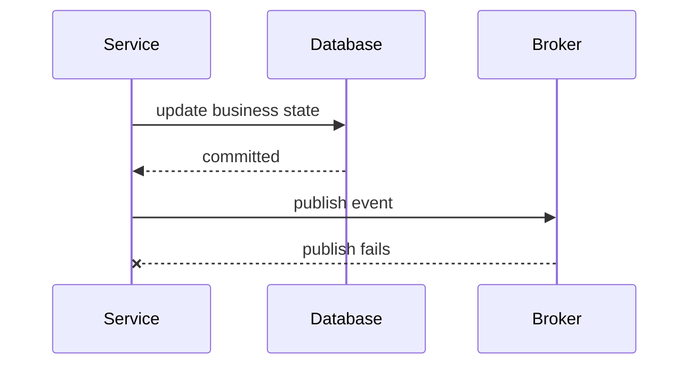
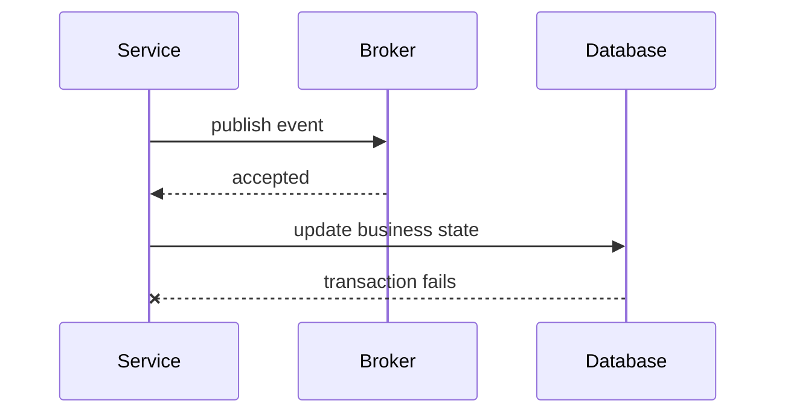
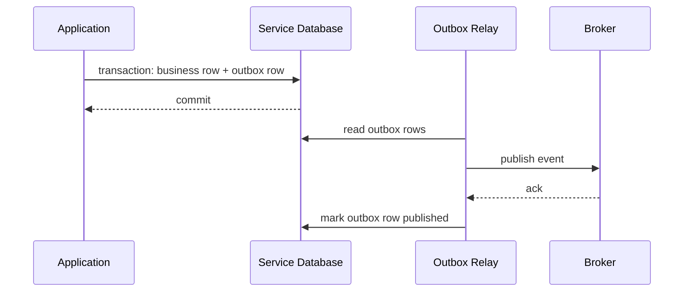
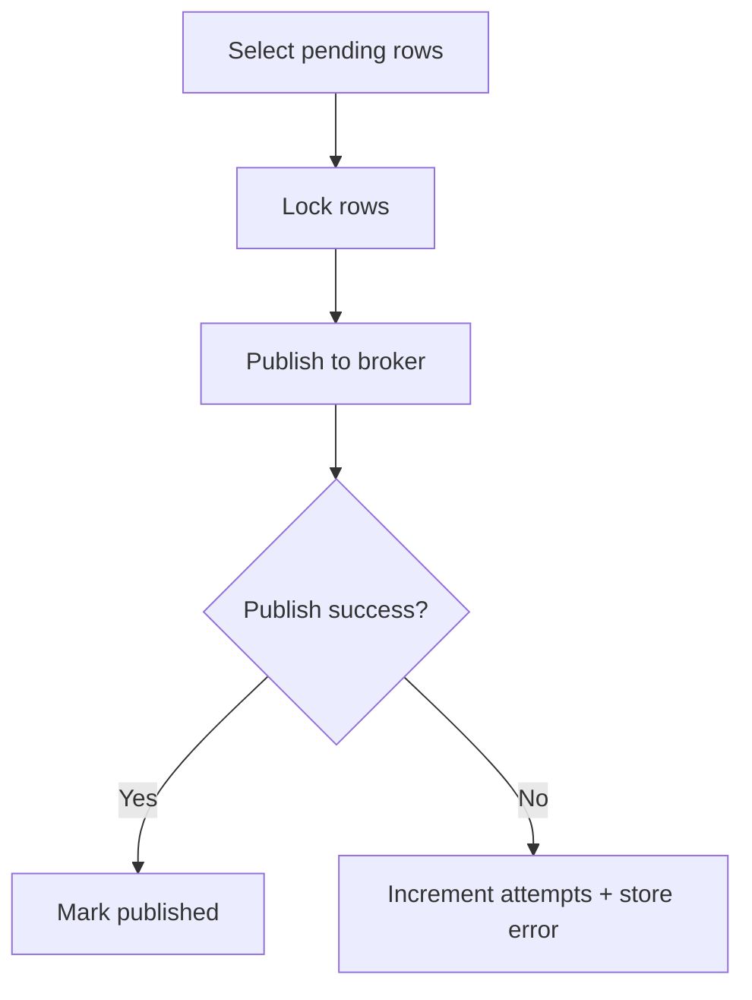
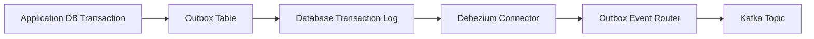
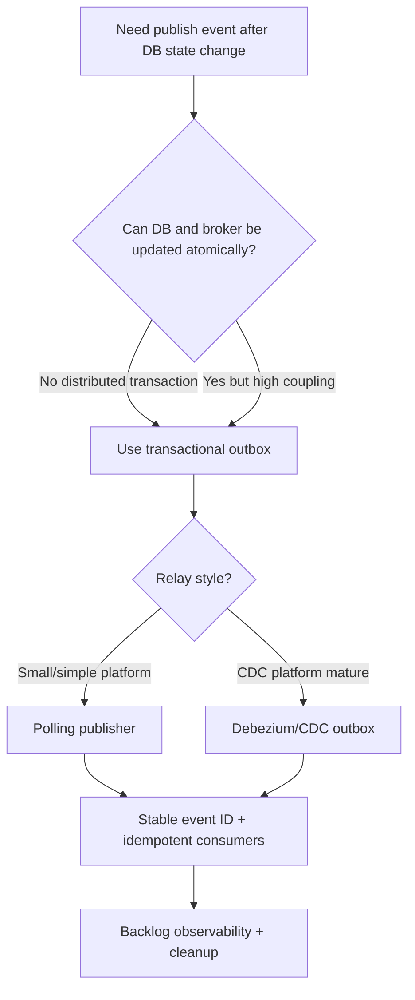

# Part 066 — Transactional Outbox Pattern for Reliable Event Publishing

The transactional outbox pattern solves one of the most important problems in event-driven microservices:

> How can a service update its database and publish an event without losing the event or publishing an event for a state change that did not commit?

This is the dual-write problem.

Bad design:

```java
database.save(case);
kafka.send(event);
```

If the database save succeeds and Kafka publish fails, state changed but event is missing.

If Kafka publish succeeds and database commit fails, event says something happened that did not happen.

The transactional outbox pattern changes the design:

```text
write business state + outbox row in one database transaction
publish outbox row later through a relay
```

This pattern is foundational for reliable event-driven Java microservices.

---

## 1. The Dual-Write Problem

Naive sequence:



Result:

```text
database says CaseEscalated
broker has no CaseEscalated event
consumers never update
```

Reverse order is also bad:



Result:

```text
consumers see CaseEscalated
database did not commit escalation
```

This inconsistency is not theoretical.

It happens during crashes, timeouts, broker failures, database failures, deploys, and network partitions.

---

## 2. Why Distributed Transaction Is Usually Not the Answer

One theoretical solution is distributed transaction / two-phase commit across database and broker.

In many microservice systems, this is avoided because:

- broker may not participate,
- operational complexity is high,
- availability suffers,
- coupling increases,
- cloud services may not support it,
- cross-service transactions are undesirable,
- failure recovery is complex.

Transactional outbox avoids distributed transactions by using the service's own database transaction as source of truth.

It does not make event publishing instantaneous.

It makes event publishing reliable and recoverable.

---

## 3. Outbox Mental Model



The important invariant:

```text
if business transaction commits, an outbox record exists
```

The relay can fail and retry.

The event may publish later.

But the service has a durable record of what needs publishing.

---

## 4. What Goes Into the Outbox

An outbox row should contain enough information to publish the event.

Example table:

```sql
CREATE TABLE outbox_message (
    id uuid PRIMARY KEY,
    aggregate_type text NOT NULL,
    aggregate_id text NOT NULL,
    aggregate_version bigint,
    event_type text NOT NULL,
    event_version int NOT NULL,
    topic text NOT NULL,
    message_key text NOT NULL,
    payload jsonb NOT NULL,
    headers jsonb NOT NULL DEFAULT '{}'::jsonb,
    status text NOT NULL,
    created_at timestamptz NOT NULL,
    published_at timestamptz,
    attempts int NOT NULL DEFAULT 0,
    last_error text
);

CREATE INDEX idx_outbox_message_pending
    ON outbox_message (status, created_at)
    WHERE status = 'PENDING';

CREATE INDEX idx_outbox_message_aggregate
    ON outbox_message (aggregate_type, aggregate_id, aggregate_version);
```

Fields:

| Field | Purpose |
|---|---|
| `id` | event/message identity |
| `aggregate_type` | domain aggregate |
| `aggregate_id` | ordering key |
| `aggregate_version` | ordering/dedup |
| `event_type` | consumer dispatch |
| `event_version` | schema compatibility |
| `topic` | destination |
| `message_key` | partitioning key |
| `payload` | event data |
| `headers` | metadata |
| `status` | relay state |
| `attempts` | retry tracking |
| `last_error` | operations/debugging |

---

## 5. Business Transaction with Outbox

Java/Spring example:

```java
@Service
public final class CreateEscalationUseCase {
    private final CaseRepository caseRepository;
    private final OutboxRepository outboxRepository;
    private final Clock clock;

    @Transactional
    public CreateEscalationResult execute(CreateEscalationCommand command) {
        CaseAggregate caseAggregate = caseRepository.getForUpdate(command.caseId());

        EscalationCreated domainEvent =
            caseAggregate.createEscalation(command.targetQueue(), command.reasonCode());

        caseRepository.save(caseAggregate);

        OutboxMessage outboxMessage = OutboxMessage.fromDomainEvent(
            UUID.randomUUID(),
            "Case",
            caseAggregate.id().value(),
            caseAggregate.version(),
            "com.example.case.EscalationCreated.v1",
            "case-events",
            caseAggregate.id().value(),
            domainEvent,
            clock.instant()
        );

        outboxRepository.insert(outboxMessage);

        return new CreateEscalationResult(domainEvent.escalationId());
    }
}
```

One transaction commits:

- updated case state,
- outbox row.

If transaction rolls back, both roll back.

This is the core guarantee.

---

## 6. Domain Events and Outbox

Domain model can record events:

```java
public final class CaseAggregate {
    private final List<DomainEvent> domainEvents = new ArrayList<>();

    public EscalationCreated createEscalation(TargetQueue queue, ReasonCode reason) {
        // validate and mutate state
        EscalationCreated event = new EscalationCreated(
            this.id,
            new EscalationId(UUID.randomUUID().toString()),
            queue,
            reason,
            this.version + 1
        );

        this.domainEvents.add(event);
        return event;
    }

    public List<DomainEvent> pullDomainEvents() {
        List<DomainEvent> events = List.copyOf(domainEvents);
        domainEvents.clear();
        return events;
    }
}
```

Application service persists aggregate and outbox messages in same transaction.

Do not publish domain events directly from entity methods.

Entity should not know broker.

---

## 7. Outbox Relay Options

There are two common relay approaches:

1. Polling publisher.
2. Change data capture (CDC).

### Polling publisher

Application job queries pending outbox rows and publishes.

Pros:

- simple,
- no CDC infrastructure,
- easy to understand,
- works with any database.

Cons:

- polling delay,
- DB load,
- locking complexity,
- duplicate publish risk,
- ordering concerns.

### CDC relay

A CDC tool reads database transaction log and publishes outbox rows.

Debezium's outbox event router is a common example.

Pros:

- low-latency,
- database log based,
- less polling,
- captures committed changes,
- strong integration with Kafka.

Cons:

- more infrastructure,
- connector operations,
- schema/routing config,
- CDC lag,
- operational expertise required.

Choose based on platform maturity.

---

## 8. Polling Publisher

Example algorithm:



SQL concept:

```sql
SELECT *
FROM outbox_message
WHERE status = 'PENDING'
ORDER BY created_at
LIMIT 100
FOR UPDATE SKIP LOCKED;
```

`SKIP LOCKED` allows multiple relay workers to process rows without picking the same locked rows.

Then publish each row.

After broker ack:

```sql
UPDATE outbox_message
SET status = 'PUBLISHED',
    published_at = now(),
    attempts = attempts + 1
WHERE id = ?;
```

---

## 9. Polling Publisher Crash Window

Crash scenarios:

### Crash before publish

Row remains `PENDING`.

Relay retries later.

Safe.

### Crash after publish but before mark published

Broker has event.

Row still `PENDING`.

Relay publishes duplicate later.

Therefore consumers must be idempotent.

Transactional outbox prevents missing events.

It does not guarantee no duplicate publish.

That is why event ID and consumer idempotency are mandatory.

---

## 10. Relay State Machine

Outbox row states:

| State | Meaning |
|---|---|
| `PENDING` | ready to publish |
| `IN_PROGRESS` | claimed by relay |
| `PUBLISHED` | broker acknowledged |
| `FAILED_RETRYABLE` | failed but will retry |
| `FAILED_TERMINAL` | invalid/unpublishable |
| `PARKED` | requires manual intervention |

Simple polling can skip `IN_PROGRESS` by using DB row locks.

For long publish attempts, explicit claim state may help.

But explicit `IN_PROGRESS` needs recovery if relay crashes.

Use `locked_until` or stale claim timeout.

---

## 11. Ordering with Outbox

If events for one aggregate must be published in order, outbox must preserve that order.

Use:

- aggregate ID as message key,
- aggregate version,
- outbox ordering by aggregate version,
- unique constraint on aggregate/version,
- relay policy that avoids publishing version 43 before 42 for same aggregate.

Example:

```sql
ALTER TABLE outbox_message
ADD CONSTRAINT uq_outbox_aggregate_version
UNIQUE (aggregate_type, aggregate_id, aggregate_version);
```

If relay publishes rows concurrently, per-aggregate order can break unless partition key and broker order preserve it.

For Kafka, events with same key are appended to same partition in producer send order per producer/session. But multiple relay workers publishing same aggregate concurrently can still create ordering risk.

Mitigation:

- one relay ordering lane per key,
- select rows ordered by aggregate/version,
- avoid concurrent publish for same aggregate,
- partition relay work by aggregate hash,
- use one producer per ordered lane if necessary,
- include sequence so consumers detect gaps.

---

## 12. Message Key from Outbox

Outbox row should store message key explicitly.

```java
String messageKey = event.aggregateId();
```

Do not let relay infer keys differently over time.

Bad:

```text
relay v1 key = caseId
relay v2 key = escalationId
```

This breaks ordering.

Store the key created by the application when the event is recorded.

Key is part of event contract.

---

## 13. Event ID

Outbox `id` should be the event/message ID.

It must be stable across relay retries.

Bad:

```java
UUID.randomUUID()
```

inside relay publish attempt.

Good:

```text
outbox.id is event ID
same ID used every publish retry
```

Consumers use event ID for deduplication.

CloudEvents `id` can be set to outbox ID.

---

## 14. Outbox Headers

Headers should include:

- event ID,
- event type,
- event version,
- correlation ID,
- causation ID,
- producer service,
- occurred time,
- aggregate ID,
- aggregate type,
- schema ID if applicable,
- trace context if appropriate.

Example:

```json
{
  "event_id": "31f67d62-6f2f-4c65-bc56-2fcab4b9fdb7",
  "event_type": "com.example.case.EscalationCreated.v1",
  "producer": "case-service",
  "correlation_id": "corr-123",
  "causation_id": "cmd-123"
}
```

Do not include secrets.

---

## 15. JSON vs Avro vs Protobuf Payload

Outbox payload can be stored as:

- JSON/JSONB,
- Avro bytes,
- Protobuf bytes,
- schema ID + payload,
- CloudEvents envelope,
- normalized columns + payload.

JSONB is easy to inspect.

Binary formats are efficient and schema-registry friendly.

Choice depends on:

- broker serialization standard,
- schema governance,
- debugging needs,
- CDC tooling,
- payload size,
- compatibility checks.

Do not store Java serialized objects.

Outbox is integration data, not Java object persistence.

---

## 16. CDC with Debezium Outbox Event Router

Debezium's outbox event router is designed to route outbox table changes into event messages.

The application writes to an outbox table.

Debezium captures committed outbox inserts from the database transaction log.

The event router transforms/reroutes the outbox row into broker messages according to configuration.

Conceptual:



This is a strong pattern when the platform already operates Debezium/Kafka Connect.

But it introduces connector operations as part of service reliability.

---

## 17. CDC Operational Concerns

CDC outbox requires monitoring:

- connector running,
- connector lag,
- database replication slot/log retention,
- schema changes,
- outbox table growth,
- transform configuration,
- broker publish errors,
- connector restarts,
- duplicate emission after restart,
- ordering by transaction log,
- topic routing.

Failure modes:

- connector down -> outbox backlog grows,
- database log retention exceeded -> connector recovery risk,
- schema changed -> connector transform fails,
- broker unavailable -> connector retries/backpressure,
- poison outbox row -> connector stuck or DLQ.

CDC reduces application polling logic.

It does not remove operations.

---

## 18. Polling vs CDC Decision

| Factor | Polling publisher | CDC outbox |
|---|---|---|
| Infrastructure complexity | lower | higher |
| Latency | polling interval | near-log-latency |
| DB load | query polling | log reading |
| Operational maturity needed | moderate | high |
| Ordering from DB commit log | harder | stronger |
| Local service ownership | high | shared platform |
| Debuggability | simple SQL | connector tooling |
| Throughput | enough for many systems | strong at scale |
| Failure mode | app relay backlog | connector lag/backlog |

Start with polling if platform is small.

Use CDC if you need lower latency, high throughput, and have operational maturity.

---

## 19. Outbox Cleanup

Outbox table cannot grow forever.

Cleanup policy:

```text
delete/archive PUBLISHED rows older than retention period
keep FAILED/PARKED rows until resolved
```

Example:

```sql
DELETE FROM outbox_message
WHERE status = 'PUBLISHED'
  AND published_at < now() - interval '7 days'
LIMIT 10000;
```

Consider:

- audit requirements,
- replay needs,
- operational debugging,
- table bloat,
- index bloat,
- partitioning by time,
- archiving to cheaper storage.

Do not delete pending rows accidentally.

---

## 20. Outbox Table Partitioning

High-volume outbox may need database partitioning.

Options:

- partition by created_at,
- partition by status,
- partition by aggregate type,
- separate outbox table per service/schema.

Time partitioning often helps cleanup.

But relay queries need efficient pending-row access.

Index:

```sql
CREATE INDEX idx_outbox_pending_created_at
ON outbox_message (created_at)
WHERE status = 'PENDING';
```

Monitor query plans.

Outbox reliability can become database performance issue.

---

## 21. Backpressure

If broker is down, outbox grows.

This is good because events are not lost.

But unlimited growth is dangerous.

Backpressure policy:

- alert on pending count,
- alert on oldest pending age,
- pause low-priority commands if outbox backlog too high,
- shed optional event-producing work,
- scale relay,
- fix broker/connector,
- protect database disk.

Metrics:

```text
outbox.pending.count
outbox.oldest_pending_age_seconds
outbox.publish.rate
outbox.publish.failures.total
outbox.relay.lag.seconds
```

Outbox backlog is a first-class production signal.

---

## 22. Publish Confirmation

Relay should consider message published only after broker acknowledges according to configured durability.

For Kafka:

- configure producer acknowledgements appropriately,
- handle send callback/future,
- retry send failure according to policy,
- avoid marking row published before broker ack.

Conceptual:

```java
producer.send(record).whenComplete((metadata, error) -> {
    if (error == null) {
        outboxRepository.markPublished(message.id(), metadata);
    } else {
        outboxRepository.markFailedRetryable(message.id(), error);
    }
});
```

Be careful with async callback and database transaction boundaries.

---

## 23. Relay Idempotency

Relay may publish duplicate messages.

Consumer must deduplicate.

But relay can also reduce duplicates by:

- stable event ID,
- not generating new IDs,
- marking rows only after ack,
- using idempotent producer where available,
- avoiding multiple relays claiming same row,
- using locks or claim tokens,
- preserving producer ordering.

Do not rely on relay idempotency alone.

End-to-end correctness needs consumer idempotency.

---

## 24. Producer Transaction and Domain Events

Do not publish from `@TransactionalEventListener` after commit unless you understand failure mode.

If after-commit listener publishes to broker and publish fails:

```text
business committed, event missing
```

That is dual-write.

A safer pattern is:

```text
inside transaction: write outbox row
after commit: optional wake relay
```

The durable guarantee is the outbox row, not the after-commit callback.

---

## 25. Multi-Event Transaction

One business transaction may produce multiple events.

Example:

```text
CaseEscalated
EscalationAssigned
NotificationRequested
```

Questions:

- are all events needed?
- should some be internal domain events only?
- what order should they publish?
- do they share same aggregate version?
- are consumers expected to see all?
- should one event carry enough state instead?

Outbox supports multiple rows per transaction.

But event design should avoid event spam.

Publish facts consumers need, not every internal method call.

---

## 26. Outbox and Sagas

Sagas often rely on events/commands.

Outbox ensures a local state transition emits the saga event/command.

Example:

```text
PaymentReserved -> outbox event -> OrderService continues saga
```

If local transaction commits but event is missing, saga stalls.

Outbox prevents missing saga messages.

But saga still needs:

- idempotent steps,
- compensation,
- timeout,
- retry,
- dead-letter handling,
- state machine persistence.

Outbox is necessary but not sufficient.

---

## 27. Outbox and Event Sourcing

Transactional outbox is not the same as event sourcing.

| Pattern | Source of truth |
|---|---|
| Transactional outbox | normal business tables + outbox table |
| Event sourcing | event log is source of truth |

Outbox event is integration message.

Event-sourcing event is state change record used to rebuild aggregate.

They can overlap, but do not confuse them.

You can use outbox without event sourcing.

Most CRUD/state-table microservices can still use outbox.

---

## 28. Testing Outbox

Minimum tests:

| Scenario | Expected |
|---|---|
| business transaction commits | outbox row exists |
| business transaction rolls back | no outbox row |
| publish succeeds | row marked published |
| publish fails | row remains pending/retryable |
| relay crashes after publish before mark | duplicate publish possible; same event ID |
| multiple relay workers | no double claim of same row |
| outbox key | message key is aggregate ID |
| event payload | schema/version correct |
| cleanup | only published old rows deleted |
| backlog alert | metric emitted |

Transaction rollback test:

```java
@Test
void rollbackRemovesOutboxRow() {
    assertThatThrownBy(() -> useCase.execute(commandThatFailsAfterOutboxInsert()))
        .isInstanceOf(DomainException.class);

    assertThat(outboxRepository.findAll()).isEmpty();
}
```

---

## 29. Relay Duplicate Test

```java
@Test
void relayPublishesSameEventIdWhenRetried() {
    OutboxMessage message = outboxRepository.insert(pendingMessage("evt-123"));

    broker.publishSucceedsButRelayCrashesBeforeMarkPublished();

    relay.runOnce();

    relay.runOnce();

    assertThat(broker.publishedEventIds())
        .containsExactly("evt-123", "evt-123");
}
```

This test proves duplicates use same ID.

Then consumer dedup can work.

---

## 30. Ordering Test

```java
@Test
void outboxRowsForSameAggregateHaveIncreasingVersions() {
    useCase.createEscalation(command1);
    useCase.closeCase(command2);

    List<OutboxMessage> rows =
        outboxRepository.findByAggregateId("CASE-100");

    assertThat(rows)
        .extracting(OutboxMessage::aggregateVersion)
        .containsExactly(1L, 2L);
}
```

Relay ordering should also be tested if strict order matters.

---

## 31. Observability

Metrics:

```text
outbox.rows.created.total{service,event_type}
outbox.pending.count{service}
outbox.oldest_pending_age.seconds{service}
outbox.publish.attempts.total{service,event_type,status}
outbox.publish.duration{service,event_type}
outbox.publish.failures.total{service,reason}
outbox.rows.published.total{service,event_type}
outbox.rows.parked.total{service,reason}
outbox.cleanup.deleted.total{service}
outbox.relay.instances{service}
```

Logs:

- publish failed,
- row parked,
- relay started/stopped,
- connector lag high,
- duplicate publish suspected,
- cleanup failure,
- schema serialization failure.

Do not log full payload by default.

---

## 32. Alerts

Useful alerts:

| Alert | Meaning |
|---|---|
| pending count high | broker/relay issue |
| oldest pending age high | events delayed |
| publish failures high | broker/schema/network issue |
| relay not running | no events publishing |
| CDC connector lag high | delayed events |
| outbox table disk growth | cleanup/backlog issue |
| parked rows > 0 | manual intervention |
| serialization failure | event schema bug |
| no outbox rows while business writes high | event creation bug |

Outbox delay is business delay.

Alert on age, not only count.

---

## 33. Production Policy Template

```yaml
outbox:
  service: case-service
  table: outbox_message

  transaction:
    writeBusinessStateAndOutboxTogether: true
    publishInsideTransaction: false

  schema:
    eventIdField: id
    aggregateIdField: aggregate_id
    aggregateVersionField: aggregate_version
    topicField: topic
    keyField: message_key
    payloadFormat: json
    eventVersionRequired: true

  relay:
    mode: polling
    pollIntervalMs: 500
    batchSize: 100
    lockMode: skip_locked
    markPublishedAfterBrokerAck: true
    duplicatePublishPossible: true

  ordering:
    key: aggregate_id
    preservePerAggregateOrder: true
    sequenceField: aggregate_version

  retry:
    maxAttempts: 20
    backoff: exponential-jitter
    parkAfterAttempts: 20

  cleanup:
    publishedRetentionDays: 7
    deleteBatchSize: 10000

  observability:
    pendingCountAlert: 10000
    oldestPendingAgeSecondsAlert: 60
    parkedRowsAlert: 1
```

Review this like production infrastructure.

---

## 34. Common Anti-Patterns

### 34.1 Database write then broker publish

Dual-write bug.

### 34.2 Broker publish then database write

Event can lie.

### 34.3 Outbox row outside transaction

Still dual-write.

### 34.4 Mark published before broker ack

Event can be lost.

### 34.5 New event ID on relay retry

Consumer cannot deduplicate.

### 34.6 No cleanup

Outbox table grows forever.

### 34.7 No backlog alert

Events silently delayed.

### 34.8 Multiple relays publish same row without stable ID

Duplicate side effects harder to control.

### 34.9 Key inferred by relay

Ordering contract changes accidentally.

### 34.10 Assuming outbox means no duplicates

Outbox prevents missing events, not duplicate delivery.

---

## 35. Decision Model



Outbox is not optional when event correctness matters.

---

## 36. Design Checklist

Before shipping outbox:

- Is outbox row written in same transaction as business state?
- Is publish outside business transaction?
- Is event ID stable?
- Is message key stored explicitly?
- Is aggregate version stored?
- Is topic stored or deterministically mapped?
- Is payload schema/versioned?
- Does relay mark published only after broker ack?
- Can relay duplicate publish safely?
- Are consumers idempotent?
- Is ordering preserved where required?
- Are pending rows monitored?
- Is oldest pending age alerted?
- Is cleanup implemented?
- Are parked rows handled?
- Is relay/CDC runbook ready?
- Are transaction rollback tests written?
- Are duplicate publish tests written?
- Is connector/polling failure tested?

---

## 37. The Real Lesson

Transactional outbox is the producer-side reliability backbone of event-driven microservices.

It changes the guarantee from:

```text
I hope the event publishes after database commit
```

to:

```text
if the database commit happened, there is a durable record of the event to publish
```

That is a huge improvement.

But outbox does not remove every problem.

You still need:

```text
relay reliability
+ duplicate-safe consumers
+ ordering policy
+ schema governance
+ backlog observability
+ cleanup
```

Outbox prevents missing events.

Idempotent consumers handle duplicate events.

Together, they make asynchronous communication trustworthy.

---

## References

- Microservices.io — Transactional Outbox Pattern: https://microservices.io/patterns/data/transactional-outbox.html
- Debezium Documentation — Outbox Event Router: https://debezium.io/documentation/reference/stable/transformations/outbox-event-router.html
- Debezium Documentation: https://debezium.io/documentation/reference/stable/
- Apache Kafka Documentation: https://kafka.apache.org/documentation/
- Enterprise Integration Patterns — Message Channel: https://www.enterpriseintegrationpatterns.com/patterns/messaging/MessageChannel.html
