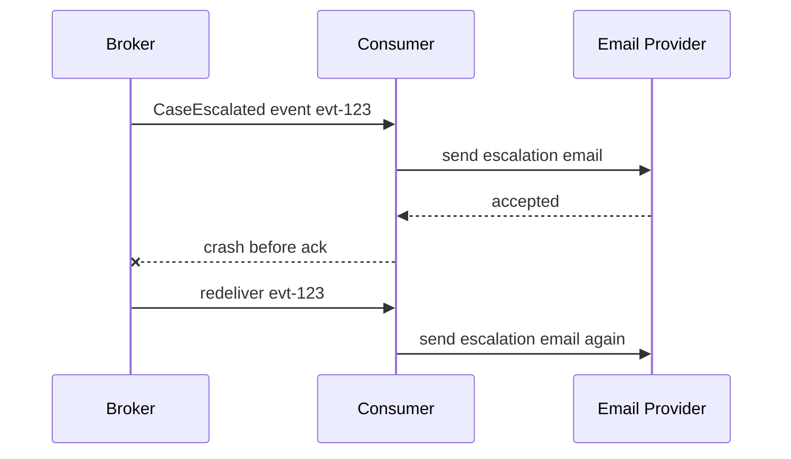
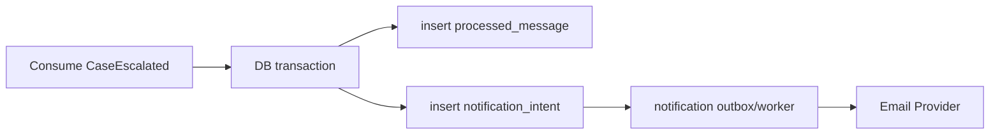
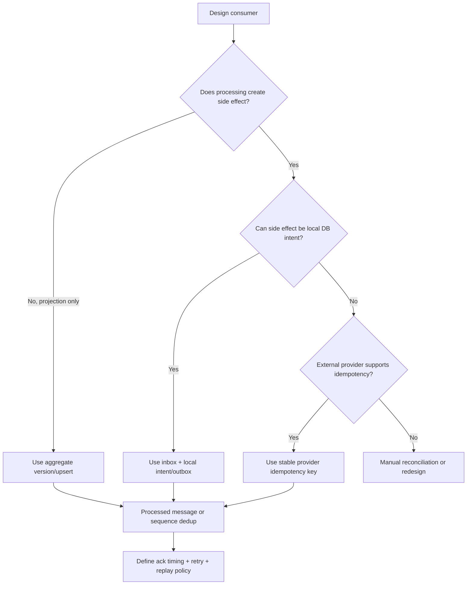

# Part 067 — Idempotent Consumer and Inbox Pattern

In asynchronous systems, duplicate messages are not rare edge cases.

They are normal.

A message can be delivered more than once because:

- producer retried after uncertain publish outcome,
- broker redelivered after consumer crash,
- consumer processed but failed before ack,
- partition rebalance happened,
- outbox relay published duplicate,
- retry topic reintroduced message,
- DLQ replay happened,
- manual backfill replayed old data,
- network timeout hid success,
- consumer offset was reset.

The correct production assumption is:

```text
the same logical message may be received more than once
```

The correct consumer design is:

```text
processing the same message repeatedly must not create repeated business effects
```

This is the idempotent consumer pattern.

---

## 1. The Core Problem

Imagine a notification consumer.



The broker did the right thing.

It redelivered a message that was not acknowledged.

The consumer did the wrong thing.

It repeated a side effect.

Idempotent consumer design prevents this.

---

## 2. Idempotent Consumer Definition

An idempotent consumer is a message receiver that can safely receive the same message multiple times.

The final observable effect after processing:

```text
message once
```

and:

```text
message many times
```

should be the same.

Example idempotent projection:

```sql
INSERT INTO case_projection(case_id, status, version)
VALUES (?, ?, ?)
ON CONFLICT (case_id)
DO UPDATE SET
  status = excluded.status,
  version = excluded.version
WHERE case_projection.version < excluded.version;
```

If the same event is applied again, projection does not change.

Example non-idempotent side effect:

```java
emailProvider.send(email);
```

If called twice, two emails may be sent.

That needs deduplication or provider idempotency.

---

## 3. Idempotency Is About Effects, Not Code Paths

A handler can execute twice.

The final business effect must not duplicate.

This is not enough:

```java
if (messageAlreadySeen) {
    return;
}
```

if the "already seen" marker is written after the side effect.

The real question:

```text
What happens if the process crashes at every point?
```

Crash windows matter.

Good idempotency design examines:

- before claim,
- after claim,
- after DB write,
- after external call,
- before ack,
- after ack,
- during retry,
- during replay.

---

## 4. Idempotency Strategies

Common strategies:

| Strategy | Good for |
|---|---|
| processed-message table | general duplicate detection |
| unique business key | create-once effects |
| aggregate version check | ordered domain events |
| upsert projection | read model updates |
| compare-and-set state transition | workflow guards |
| external idempotency key | HTTP/payment/email provider calls |
| deterministic output ID | notifications, search documents |
| inbox table | durable message receipt and processing state |
| event sequence gap detection | strict ordered projections |

A robust consumer often combines several.

Example:

```text
processed-message table + projection version + provider idempotency key
```

---

## 5. Processed Message Table

Basic table:

```sql
CREATE TABLE processed_message (
    consumer_name text NOT NULL,
    message_id text NOT NULL,
    processed_at timestamptz NOT NULL,
    PRIMARY KEY (consumer_name, message_id)
);
```

Consumer:

```java
@Transactional
public void handle(MessageEnvelope<CaseEscalatedEvent> envelope) {
    boolean inserted = processedMessageRepository.insertIfAbsent(
        "notification-consumer",
        envelope.messageId()
    );

    if (!inserted) {
        metrics.duplicateSkipped(envelope);
        return;
    }

    notificationRepository.createNotification(
        Notification.from(envelope.payload(), envelope.messageId())
    );
}
```

If duplicate arrives, insert fails and consumer skips.

This works when the database effect and processed marker are in the same transaction.

---

## 6. Why State Table Is Better Than In-Memory Dedup

In-memory dedup:

```java
Set<String> processed = ConcurrentHashMap.newKeySet();
```

fails when:

- consumer restarts,
- multiple instances exist,
- rebalance moves partition,
- replay occurs later,
- DLQ replay happens,
- deployment clears memory,
- memory evicts too early.

In-memory dedup can be a cache optimization.

It cannot be the correctness source.

Use durable storage for correctness.

---

## 7. Inbox Pattern

The inbox pattern records incoming messages before or during processing.

It is the consumer-side counterpart to outbox.


Inbox row can store:

- message ID,
- topic,
- partition,
- offset,
- key,
- payload,
- headers,
- received time,
- status,
- attempts,
- last error,
- processing lock,
- processed time.

Inbox is useful when:

- processing must be resumable,
- messages need audit,
- retry should be database-driven,
- external broker ack should be decoupled,
- consumer wants durable local queue,
- message processing has multiple steps,
- manual remediation is needed.

---

## 8. Inbox Table Design

```sql
CREATE TABLE inbox_message (
    consumer_name text NOT NULL,
    message_id text NOT NULL,
    topic text NOT NULL,
    partition_id int,
    offset_value bigint,
    message_key text,
    event_type text NOT NULL,
    event_version int NOT NULL,
    payload jsonb NOT NULL,
    headers jsonb NOT NULL DEFAULT '{}'::jsonb,
    status text NOT NULL,
    received_at timestamptz NOT NULL,
    locked_until timestamptz,
    attempts int NOT NULL DEFAULT 0,
    last_error text,
    processed_at timestamptz,
    PRIMARY KEY (consumer_name, message_id)
);

CREATE INDEX idx_inbox_pending
ON inbox_message (consumer_name, status, received_at)
WHERE status IN ('RECEIVED', 'FAILED_RETRYABLE');
```

States:

| State | Meaning |
|---|---|
| `RECEIVED` | stored, not processed |
| `IN_PROGRESS` | claimed for processing |
| `COMPLETED` | effect applied |
| `FAILED_RETRYABLE` | will retry |
| `FAILED_TERMINAL` | will not retry automatically |
| `PARKED` | manual remediation |
| `SKIPPED_DUPLICATE` | duplicate record observed |

This gives you durable processing state.

---

## 9. Processed Table vs Inbox

| Pattern | Best when |
|---|---|
| Processed message table | simple idempotent processing |
| Inbox table | complex/retryable/multi-step processing |
| Business unique key only | effect naturally unique |
| Aggregate version check | ordered projection |
| External provider idempotency | external side effect |

Processed-message table stores minimal dedup state.

Inbox stores the message and processing lifecycle.

A simple projection may only need processed table.

A critical workflow consumer may deserve inbox.

---

## 10. Transaction Boundary

The strongest simple pattern:

```text
dedup marker + business effect in same database transaction
```

Example:

```java
@Transactional
public void handle(MessageEnvelope<CaseEscalatedEvent> envelope) {
    if (!processed.tryInsert(consumerName, envelope.messageId())) {
        return;
    }

    projection.apply(envelope.payload());

    processed.markCompleted(consumerName, envelope.messageId());
}
```

Then ack broker after transaction commits.

Crash scenarios:

| Crash point | Result |
|---|---|
| before transaction | message redelivered, processed later |
| after insert before commit | rollback, redelivered |
| after commit before ack | redelivered, duplicate skipped |
| after ack | done |

This gives effectively-once database effect.

---

## 11. External Side Effect Problem

External side effect cannot usually be in the same DB transaction.

Example:

```java
@Transactional
public void handle(Event event) {
    processed.insert(event.id());
    emailProvider.send(event); // external
}
```

If DB commits but email fails:

```text
message marked processed but email not sent
```

If email succeeds but DB rolls back:

```text
message redelivered and email may send again
```

Solutions:

1. write notification intent to DB, send via outbox,
2. use provider idempotency key,
3. make notification ID deterministic,
4. store send result and retry safely,
5. accept duplicate/loss only if business allows.

For critical side effects, avoid direct external calls in message transaction.

---

## 12. Side Effect via Local Intent

Safer design:



Consumer handles event by recording durable intent.

A separate sender processes intent idempotently.

Benefits:

- consumer transaction is local,
- broker ack after durable intent,
- email retry independent,
- provider idempotency can be used,
- audit trail exists.

This pattern composes inbox and outbox.

---

## 13. Idempotency by Business Key

Sometimes business state naturally deduplicates.

Example:

```sql
CREATE TABLE notification (
    notification_id text PRIMARY KEY,
    case_id text NOT NULL,
    recipient_id text NOT NULL,
    template text NOT NULL
);
```

Use deterministic ID:

```text
notification_id = "case-escalated:" + event.eventId + ":" + recipientId
```

Duplicate event attempts insert same notification ID.

Database unique constraint prevents duplicates.

This can be simpler than separate processed table.

But be careful:

- business key must be stable,
- duplicate detection scope must be correct,
- changing key format can break dedup,
- old messages must still use same key logic.

---

## 14. Idempotency by Aggregate Version

For projections:

```java
public void apply(CaseEvent event) {
    CaseProjection projection = repository.get(event.caseId());

    if (event.version() <= projection.version()) {
        return;
    }

    if (event.version() != projection.version() + 1) {
        throw new SequenceGapException(event.caseId(), projection.version(), event.version());
    }

    projection.apply(event);
    repository.save(projection);
}
```

This handles:

- duplicate event,
- old event,
- sequence gap.

It gives stronger correctness than message ID alone for ordered projections.

Use both message ID and aggregate version when needed.

---

## 15. Dedup Window

How long do you keep processed IDs?

Forever?

Maybe not.

Dedup retention depends on:

- broker retention,
- replay window,
- DLQ replay window,
- legal/audit requirements,
- storage cost,
- message ID uniqueness,
- side effect risk.

If events can be replayed from 30 days ago, but processed IDs are kept 7 days, duplicates from replay may not be detected.

Policy:

```text
processed ID retention >= maximum replay/redelivery window for duplicate-sensitive effects
```

For permanent financial/audit effects, dedup records may need long retention.

---

## 16. Message ID Quality

Idempotency depends on stable message ID.

Bad IDs:

- random ID generated by consumer,
- offset only without topic/partition,
- timestamp,
- non-unique domain field,
- retry attempt ID,
- event ID regenerated on relay retry.

Good ID:

- producer event ID,
- outbox ID,
- CloudEvents `id` with `source`,
- command ID,
- deterministic business idempotency key.

If using CloudEvents:

```text
dedup identity = source + id
```

not `id` alone if IDs are only unique per source.

---

## 17. Consumer Name Scope

Dedup key usually includes consumer name.

```sql
PRIMARY KEY (consumer_name, message_id)
```

Why?

Different consumers may process same event independently.

```text
search-indexer and notification-service both process evt-123
```

If dedup table is shared and key is only message ID, one consumer may suppress another incorrectly.

Dedup scope must match effect scope.

---

## 18. Multi-Step Processing

For complex workflows, one message may trigger multiple steps.

Example:

1. validate event,
2. create local projection,
3. create notification intent,
4. call enrichment service,
5. emit derived event.

If this cannot be atomic, model steps.

Inbox state:

```text
RECEIVED
VALIDATED
PROJECTION_UPDATED
NOTIFICATION_INTENT_CREATED
DERIVED_EVENT_WRITTEN
COMPLETED
```

But avoid overcomplication.

Often better:

- keep consumer handler small,
- write local durable intent,
- continue workflow through separate outbox/event.

Long message handlers are fragile.

---

## 19. Idempotency and Replay

Replay changes the meaning of duplicate handling.

Projection consumer:

```text
replay should rebuild state
```

Notification consumer:

```text
replay should not resend emails
```

Therefore each consumer needs replay policy:

| Consumer | Replay behavior |
|---|---|
| search projection | allowed, rebuild index |
| analytics | allowed with checkpoint reset |
| audit copy | maybe append-only; careful |
| notification sender | not allowed to trigger real sends |
| workflow command producer | dangerous |
| cache warmer | allowed |

Replay-safe code often separates:

```text
projection mode
side-effect mode
```

or uses a replay flag and policy.

Do not replay side-effect consumers casually.

---

## 20. Idempotency and DLQ Replay

When DLQ messages are replayed:

- same message ID should be preserved,
- original headers should be preserved,
- attempt metadata can be updated,
- consumer dedup should behave correctly,
- fixed messages should not create duplicates,
- replay tool should be audited.

Bad DLQ replay:

```text
new message ID
new key
lost headers
lost causation ID
```

This defeats dedup and traceability.

DLQ replay tooling is part of idempotency design.

---

## 21. Idempotency and Ordering

If duplicate arrives after newer version:

```text
event v42 processed
event v41 duplicate arrives
```

Consumer should ignore old event.

If event v44 arrives before v43:

```text
gap
```

Consumer should not apply blindly.

Combine idempotency and ordering:

```java
if (event.version() <= currentVersion) {
    return; // duplicate or old
}

if (event.version() > currentVersion + 1) {
    parkKey(event.caseId(), event);
    return;
}

apply(event);
```

Message ID dedup alone cannot detect sequence gaps.

---

## 22. Inbox Claiming

Inbox processor can claim rows.

```sql
UPDATE inbox_message
SET status = 'IN_PROGRESS',
    locked_until = now() + interval '30 seconds',
    attempts = attempts + 1
WHERE consumer_name = ?
  AND message_id = ?
  AND status IN ('RECEIVED', 'FAILED_RETRYABLE')
RETURNING *;
```

Or batch claim:

```sql
SELECT *
FROM inbox_message
WHERE consumer_name = ?
  AND status IN ('RECEIVED', 'FAILED_RETRYABLE')
  AND (locked_until IS NULL OR locked_until < now())
ORDER BY received_at
LIMIT 100
FOR UPDATE SKIP LOCKED;
```

Claiming prevents multiple workers processing same inbox row concurrently.

Use lock expiry for crash recovery.

---

## 23. Inbox Failure Handling

On retryable failure:

```sql
UPDATE inbox_message
SET status = 'FAILED_RETRYABLE',
    last_error = ?,
    locked_until = now() + interval '1 minute'
WHERE consumer_name = ?
  AND message_id = ?;
```

On terminal failure:

```sql
UPDATE inbox_message
SET status = 'FAILED_TERMINAL',
    last_error = ?
WHERE consumer_name = ?
  AND message_id = ?;
```

On success:

```sql
UPDATE inbox_message
SET status = 'COMPLETED',
    processed_at = now(),
    locked_until = NULL
WHERE consumer_name = ?
  AND message_id = ?;
```

Failure states make operations visible.

No one should need to grep logs to find stuck messages.

---

## 24. Consumer Ack With Inbox

Two possible designs:

### Ack after storing inbox row

```text
broker -> inbox persisted -> ack broker -> local inbox processor handles later
```

Pros:

- decouples broker from processing,
- quick broker ack,
- local retry controlled by DB.

Cons:

- local DB becomes queue,
- if inbox processor down, backlog hidden from broker lag,
- need inbox backlog metrics.

### Ack after processing complete

```text
broker -> process and commit local effect -> ack broker
```

Pros:

- broker lag reflects processing lag,
- simpler for many consumers.

Cons:

- long processing holds broker delivery,
- retry tied to broker behavior.

Both are valid.

Choose explicitly.

---

## 25. Inbox as Local Queue

If you ack after inbox insert, the inbox becomes local durable queue.

Then monitor:

```text
inbox.pending.count
inbox.oldest_pending_age
inbox.failed_retryable.count
inbox.parked.count
```

Broker lag may be low while inbox backlog is high.

That is not success.

It only means messages moved from broker to local DB.

Dashboard must show both.

---

## 26. Java Idempotent Consumer Skeleton

```java
public final class IdempotentConsumer<T> {
    private final String consumerName;
    private final ProcessedMessageRepository processedMessages;
    private final MessageHandler<T> handler;
    private final TransactionTemplate transactionTemplate;

    public void onMessage(MessageEnvelope<T> envelope) {
        transactionTemplate.executeWithoutResult(tx -> {
            boolean firstTime = processedMessages.tryInsert(
                consumerName,
                envelope.messageId(),
                Instant.now()
            );

            if (!firstTime) {
                throw new DuplicateMessageException(envelope.messageId());
            }

            handler.handle(envelope.payload(), envelope.context());

            processedMessages.markCompleted(consumerName, envelope.messageId());
        });

        envelope.ack();
    }
}
```

Need handle duplicate outside transaction:

```java
try {
    consumer.onMessage(envelope);
} catch (DuplicateMessageException duplicate) {
    envelope.ack();
}
```

Duplicate should usually be acknowledged, not retried forever.

---

## 27. Java Inbox Processor Skeleton

```java
public final class InboxProcessor {
    private final InboxRepository inboxRepository;
    private final HandlerRegistry handlerRegistry;
    private final TransactionTemplate transactionTemplate;

    public void runBatch() {
        List<InboxMessage> messages = inboxRepository.claimBatch("case-consumer", 100);

        for (InboxMessage message : messages) {
            processOne(message);
        }
    }

    private void processOne(InboxMessage message) {
        try {
            transactionTemplate.executeWithoutResult(tx -> {
                MessageHandler<Object> handler =
                    handlerRegistry.handlerFor(message.eventType(), message.eventVersion());

                Object payload = deserialize(message);
                handler.handle(payload, message.context());

                inboxRepository.markCompleted(message.id());
            });
        } catch (RetryableMessageException ex) {
            inboxRepository.markRetryableFailure(message.id(), ex);
        } catch (NonRetryableMessageException ex) {
            inboxRepository.markTerminalFailure(message.id(), ex);
        }
    }
}
```

This is useful for complex consumers.

Keep handler idempotent anyway.

---

## 28. Observability

Metrics:

```text
consumer.duplicates.total{consumer,event_type}
consumer.idempotency.claim.total{consumer,status}
consumer.processed_message.rows{consumer,status}
inbox.messages.received.total{consumer,event_type}
inbox.pending.count{consumer}
inbox.oldest_pending_age.seconds{consumer}
inbox.processing.duration{consumer,event_type}
inbox.failures.total{consumer,event_type,reason}
inbox.parked.total{consumer,event_type,reason}
consumer.replay.skipped_side_effects.total{consumer,event_type}
```

Logs:

- duplicate skipped,
- stale in-progress reclaimed,
- message parked,
- replay mode side effect suppressed,
- dedup retention cleanup,
- idempotency key collision,
- external idempotency failure.

No full payload logs by default.

---

## 29. Alerting

Useful alerts:

| Alert | Meaning |
|---|---|
| duplicate spike | producer/retry/rebalance issue |
| inbox pending age high | local processing stuck |
| stale in-progress high | consumer crashes or long processing |
| parked messages > 0 | manual remediation |
| side-effect duplicate detected | idempotency failure |
| processed table cleanup failing | storage growth |
| replay to side-effect consumer | dangerous operation |
| unknown event type terminal failures | schema/consumer compatibility issue |

Idempotency alerts are correctness alerts.

Treat them seriously.

---

## 30. Testing Idempotency

Minimum tests:

| Scenario | Expected |
|---|---|
| first delivery | effect applied |
| duplicate after success | no second effect |
| crash after DB commit before ack | redelivery skipped |
| crash before DB commit | redelivery processes |
| external side effect success before marker failure | provider idempotency prevents duplicate |
| old version event | ignored |
| future version event | gap detected |
| DLQ replay same ID | no duplicate effect |
| replay mode | side effects suppressed where required |
| dedup retention expired | behavior understood |

Test duplicate explicitly.

---

## 31. Duplicate Test

```java
@Test
void duplicateEventDoesNotCreateSecondNotificationIntent() {
    CaseEscalatedEvent event = event("evt-123", "CASE-100");

    consumer.onMessage(envelope(event));
    consumer.onMessage(envelope(event));

    assertThat(notificationIntentRepository.countByEventId("evt-123"))
        .isEqualTo(1);
}
```

This should be in every side-effecting consumer test suite.

---

## 32. Crash Window Test

```java
@Test
void redeliveryAfterCommitBeforeAckDoesNotDuplicateEffect() {
    CaseEscalatedEvent event = event("evt-123", "CASE-100");

    consumer.processSuccessfullyButSimulateAckFailure(envelope(event));

    consumer.onMessage(envelope(event));

    assertThat(caseProjectionRepository.version("CASE-100"))
        .isEqualTo(event.version());
}
```

This test models real at-least-once behavior.

---

## 33. Inbox Reclaim Test

```java
@Test
void reclaimsStaleInProgressMessage() {
    inbox.insert(message("evt-123", "IN_PROGRESS", lockedUntilPast()));

    processor.runBatch();

    assertThat(inbox.status("evt-123")).isEqualTo("COMPLETED");
}
```

Without stale-claim recovery, crash can leave messages stuck forever.

---

## 34. Production Policy Template

```yaml
idempotentConsumer:
  consumers:
    search-indexer:
      strategy:
        type: aggregate-version-upsert
        messageIdRequired: true
        sequenceRequired: true
      dedup:
        table: processed_message
        retentionDays: 30
      ack:
        timing: after-db-transaction
      replay:
        allowed: true
        sideEffects: none
      alerts:
        duplicateSpike: true
        sequenceGap: true

    notification-sender:
      strategy:
        type: inbox-plus-notification-intent
        externalProviderIdempotency: true
        deterministicNotificationId: true
      inbox:
        enabled: true
        ackAfterInboxInsert: true
        retry:
          maxAttempts: 10
          backoff: exponential-jitter
        parkingLot: true
      replay:
        allowed: false-for-real-send
      alerts:
        pendingAgeSeconds: 60
        parkedMessages: 1
```

Policy must be per consumer because effects differ.

---

## 35. Common Anti-Patterns

### 35.1 Assuming broker prevents duplicates

At-least-once means duplicates are possible.

### 35.2 In-memory dedup as correctness

Fails on restart/rebalance.

### 35.3 Mark processed after external side effect without provider idempotency

Duplicate side effects possible.

### 35.4 Dedup key not scoped by consumer

One consumer suppresses another.

### 35.5 Dedup retention shorter than replay window

Old duplicates apply again.

### 35.6 Generating message ID in consumer

Duplicates get different IDs.

### 35.7 Replay side-effect consumer

Emails/payments/actions repeat.

### 35.8 Ack after inbox insert but no inbox backlog metric

Lag moves from broker to DB invisibly.

### 35.9 Treating duplicate as error retry

Duplicate loops forever.

### 35.10 No crash-window tests

The exact failure idempotency should handle remains untested.

---

## 36. Decision Model



Idempotency is designed from effect type.

---

## 37. Design Checklist

Before shipping a consumer:

- What is the message ID?
- Is message ID stable across retries/replay?
- Is dedup scoped by consumer?
- Is duplicate delivery tested?
- What is the business effect?
- Is effect naturally idempotent?
- Is processed marker written transactionally with effect?
- Are external side effects deduplicated?
- Is provider idempotency key stable?
- Is replay allowed?
- Is DLQ replay preserving message ID?
- How long are processed IDs retained?
- Is retention >= replay window?
- Are old/future aggregate versions handled?
- Are inbox states monitored?
- Is stale in-progress recovered?
- Is duplicate treated as ackable?
- Are crash windows tested?

---

## 38. The Real Lesson

The broker can redeliver.

The consumer must be correct.

Idempotent consumer design turns at-least-once delivery from a source of bugs into a safe reliability model.

The production baseline is:

```text
stable message identity
+ durable dedup
+ transactional local effect
+ external side-effect idempotency
+ replay policy
+ crash-window tests
+ observability
```

If you cannot explain why duplicate delivery is safe, the consumer is not production-ready.

---

## References

- Microservices.io — Idempotent Consumer Pattern: https://microservices.io/patterns/communication-style/idempotent-consumer.html
- Microservices.io — Handling duplicate messages using the Idempotent Consumer pattern: https://microservices.io/post/microservices/patterns/2020/10/16/idempotent-consumer.html
- Enterprise Integration Patterns — Idempotent Receiver: https://www.enterpriseintegrationpatterns.com/patterns/messaging/IdempotentReceiver.html
- Enterprise Integration Patterns — Dead Letter Channel: https://www.enterpriseintegrationpatterns.com/patterns/messaging/DeadLetterChannel.html
- Apache Kafka Design — Message Delivery Semantics: https://kafka.apache.org/0100/design/design/#semantics
