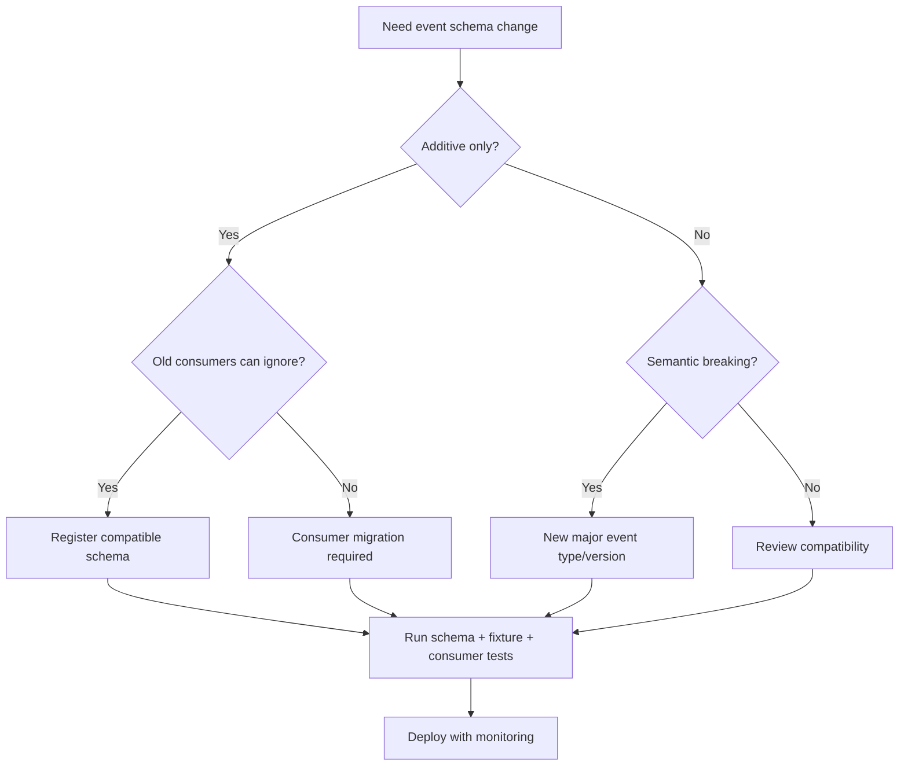

# Part 068 — Event Schema, Versioning, and Compatibility

An event topic is an API.

It may not look like an API because consumers subscribe indirectly.

But it is an API.

Consumers depend on:

- event type,
- fields,
- field meanings,
- keying strategy,
- ordering,
- metadata,
- version,
- timestamp semantics,
- error/replay behavior,
- retention,
- privacy guarantees.

If producers change event schema carelessly, consumers break.

If consumers interpret fields differently, workflows corrupt.

If event versions are not governed, replay becomes impossible.

The production rule:

> Event schemas must evolve with explicit compatibility guarantees, not accidental JSON shape changes.

---

## 1. Event Contract Mental Model

An event contract has two layers:

```text
envelope metadata + data payload
```

Envelope answers:

- what event is this?
- who produced it?
- when did it occur?
- what resource/subject does it concern?
- what schema describes data?
- what is its unique ID?
- what correlation/causation context exists?

Payload answers:

- what domain fact happened?
- what data is included?
- what version/sequence applies?
- what fields can consumers use?

Example:

```json
{
  "specversion": "1.0",
  "id": "evt-123",
  "source": "/services/case-service",
  "type": "com.example.case.CaseEscalated.v1",
  "subject": "cases/CASE-100",
  "time": "2026-07-05T10:15:30Z",
  "datacontenttype": "application/json",
  "dataschema": "https://schemas.example.com/case-escalated-v1.json",
  "data": {
    "caseId": "CASE-100",
    "escalationId": "ESC-900",
    "targetQueue": "FRAUD_REVIEW",
    "aggregateVersion": 42
  }
}
```

This is a contract, not just a log line.

---

## 2. CloudEvents as Envelope Standard

CloudEvents defines a common format for event metadata.

Core attributes include:

- `id`,
- `source`,
- `specversion`,
- `type`,
- `time`,
- `subject`,
- `datacontenttype`,
- `dataschema`.

CloudEvents does not define your domain payload.

It standardizes the envelope.

Benefits:

- consistent metadata,
- tooling interoperability,
- routing support,
- clear event identity,
- easier cross-platform integration,
- standard HTTP/Kafka bindings.

Use CloudEvents when your platform benefits from standard event metadata.

Even if you do not use CloudEvents, adopt a consistent envelope.

---

## 3. Event Type Naming

Good event type names are:

- domain-oriented,
- past tense,
- versioned,
- stable,
- globally meaningful.

Examples:

```text
com.example.case.CaseCreated.v1
com.example.case.CaseEscalated.v1
com.example.case.CaseClosed.v1
```

Avoid:

```text
UpdateSearchIndex
SendEmail
CaseEvent
DataChanged
Notification
```

Those names are vague or implementation-oriented.

Event type should describe the fact.

Consumers should not need topic name alone to infer meaning.

---

## 4. Event Versioning Strategies

Common strategies:

### Version in event type

```text
com.example.case.CaseEscalated.v1
com.example.case.CaseEscalated.v2
```

Clear and routeable.

### Version in payload field

```json
{
  "eventVersion": 1
}
```

Useful inside data.

### Version in schema registry

```text
subject = case-events-value
schema version = 17
```

Good for broker/schema tooling.

### Version in topic

```text
case-events-v1
case-events-v2
```

Heavyweight, but sometimes useful for major migrations.

Recommended:

```text
schema registry version for technical schema
+ event type major version for semantic breaking changes
+ payload field if useful for consumers/debugging
```

Do not create a new topic for every small additive change.

---

## 5. Compatibility Types

Schema compatibility defines how producers and consumers can evolve independently.

Common terms:

| Compatibility | Meaning |
|---|---|
| Backward | new readers can read old data |
| Forward | old readers can read new data |
| Full | both backward and forward |
| Transitive | compatibility checked against all previous versions, not only latest |

Confluent Schema Registry explains schema evolution as safely changing schemas over time while maintaining producer-consumer compatibility, with compatibility types that define which schema changes are allowed.

Choose compatibility based on your deployment reality.

If old consumers may read new events, you need forward compatibility.

If new consumers replay old events, you need backward compatibility.

If both happen, you need full compatibility.

---

## 6. Deployment Reality Drives Compatibility

Event systems are asynchronous.

Old and new producers/consumers can coexist.

Scenarios:

| Scenario | Need |
|---|---|
| new consumer replays old topic | backward compatibility |
| old consumer reads new producer events | forward compatibility |
| multiple consumer versions run for weeks | full compatibility |
| replay from long retention | transitive compatibility |
| DLQ replay months later | long-term schema support |
| new field used by only new consumers | additive change with safe default |
| semantic change to existing field | new event version |

Schema compatibility is not abstract.

It follows deployment and replay needs.

---

## 7. Additive Changes

Usually safe:

- add optional field,
- add field with default,
- add nullable field,
- add new enum value if consumers handle unknown,
- add metadata header that consumers ignore.

Example:

```json
{
  "caseId": "CASE-100",
  "escalationId": "ESC-900",
  "targetQueue": "FRAUD_REVIEW",
  "priority": "HIGH"
}
```

If old consumers ignore `priority`, forward compatibility holds.

But additive is not always semantically safe.

If producer expects all consumers to honor `priority`, then adding it is a behavior change.

Compatibility includes semantics, not only schema parse.

---

## 8. Breaking Changes

Usually breaking:

- remove required field,
- rename field,
- change field type,
- change field meaning,
- change enum meaning,
- change timestamp semantics,
- change identifier format,
- change event key,
- change ordering guarantee,
- change event from notification to state transfer,
- change event type without migration,
- change version/sequence semantics,
- change privacy/data classification.

Example:

```text
status field used to mean case status
now means escalation status
```

Schema may still parse.

Consumers are broken.

Semantic compatibility is harder than technical compatibility.

---

## 9. Field Meaning Is Contract

This is dangerous:

```json
{
  "status": "CLOSED"
}
```

What status?

- case status?
- escalation status?
- workflow status?
- external provider status?

Better:

```json
{
  "caseStatus": "CLOSED",
  "escalationStatus": "ASSIGNED"
}
```

Field names should carry domain meaning.

Ambiguous fields become breaking changes later.

---

## 10. Event Time Semantics

Events may have several times:

| Time | Meaning |
|---|---|
| occurredAt | when domain fact happened |
| committedAt | when producer committed state |
| publishedAt | when event was published |
| receivedAt | when consumer received event |
| processedAt | when consumer processed event |

Do not call every timestamp `time`.

CloudEvents `time` commonly represents the event occurrence time.

If you need commit/publish times, add explicit fields or headers.

Consumers must not use publish time as domain time unless contract says so.

---

## 11. Event ID Semantics

Event ID must be stable and unique within defined scope.

If using CloudEvents:

```text
source + id
```

uniquely identifies the event.

Rules:

- do not regenerate ID on retry,
- do not regenerate ID on outbox relay retry,
- preserve ID through DLQ/replay,
- include ID in dedup strategy,
- make ID visible in logs/traces.

Event ID is not offset.

Offset changes by topic/partition and is broker-specific.

Event ID is domain/integration identity.

---

## 12. Correlation and Causation Schema

Include:

```json
{
  "correlationId": "corr-123",
  "causationId": "cmd-456"
}
```

or metadata headers.

Use:

- correlation ID for business process grouping,
- causation ID for "what caused this event",
- trace ID for distributed tracing,
- idempotency key for command dedup.

Do not collapse all of them into one random ID.

They answer different questions.

---

## 13. Event Key as Contract

Schema is not only payload.

The message key matters.

If topic contract says:

```text
key = caseId
```

changing key to:

```text
key = escalationId
```

can break ordering and partitioning.

Document key in event contract:

```yaml
topic: case-events
key:
  field: caseId
  purpose:
    - per-case ordering
    - partitioning
```

Test it.

Key changes require architecture review.

---

## 14. Schema Format Choices

Common choices:

| Format | Strength |
|---|---|
| JSON + JSON Schema | human-readable, web-friendly |
| Avro | strong schema evolution, compact, schema registry ecosystem |
| Protobuf | compact, strongly typed, good generated code |
| CloudEvents + data schema | standard envelope with chosen payload schema |
| Plain JSON without schema | easy at first, dangerous later |

No format saves you from bad semantics.

Pick based on:

- language ecosystem,
- schema registry support,
- compatibility needs,
- human debugging,
- payload size,
- event volume,
- generated code preference,
- existing platform standards.

---

## 15. JSON Schema Event

Example:

```json
{
  "$id": "https://schemas.example.com/case-escalated-v1.json",
  "type": "object",
  "required": ["caseId", "escalationId", "aggregateVersion"],
  "properties": {
    "caseId": { "type": "string", "minLength": 1 },
    "escalationId": { "type": "string", "minLength": 1 },
    "targetQueue": { "type": "string" },
    "aggregateVersion": { "type": "integer", "minimum": 1 }
  },
  "additionalProperties": true
}
```

For forward compatibility, consumers should ignore unknown fields if policy allows.

But producers should not emit random undocumented fields.

---

## 16. Avro Event

Avro is widely used with Kafka schema registry.

Example concept:

```json
{
  "type": "record",
  "name": "CaseEscalated",
  "namespace": "com.example.case.v1",
  "fields": [
    { "name": "caseId", "type": "string" },
    { "name": "escalationId", "type": "string" },
    { "name": "targetQueue", "type": "string" },
    { "name": "aggregateVersion", "type": "long" },
    { "name": "priority", "type": ["null", "string"], "default": null }
  ]
}
```

Avro evolution often relies on defaults and optional fields.

Be disciplined with required fields.

---

## 17. Protobuf Event

Example:

```proto
syntax = "proto3";

package example.case.events.v1;

option java_package = "com.example.case.events.v1";
option java_multiple_files = true;

message CaseEscalated {
  string case_id = 1;
  string escalation_id = 2;
  string target_queue = 3;
  int64 aggregate_version = 4;

  reserved 5;
  reserved "old_field";
}
```

Protobuf rules:

- never reuse field numbers,
- reserve removed field numbers/names,
- use explicit enum zero value,
- handle unknown enum values,
- avoid changing field type,
- avoid changing semantics.

Protobuf gives efficient binary events.

But schema governance is still required.

---

## 18. Enum Evolution

Enums are dangerous in event contracts.

Example:

```proto
enum CaseStatus {
  CASE_STATUS_UNSPECIFIED = 0;
  CASE_STATUS_OPEN = 1;
  CASE_STATUS_ESCALATED = 2;
  CASE_STATUS_CLOSED = 3;
}
```

Adding:

```proto
CASE_STATUS_SUSPENDED = 4;
```

may break old consumers if they assume all statuses are known.

Consumer rule:

```java
switch (status) {
    case OPEN -> ...
    case ESCALATED -> ...
    case CLOSED -> ...
    case UNRECOGNIZED, CASE_STATUS_UNSPECIFIED -> handleUnknown(status);
}
```

Do not map unknown to a normal business value.

Unknown enum is a compatibility reality.

---

## 19. Required vs Optional

Event data often tempts teams to mark everything required.

But required fields make evolution harder.

Guidelines:

- identity fields should be required,
- ordering/version fields should be required if contract depends on them,
- optional enrichment should be optional,
- new fields should usually be optional first,
- consumers should handle absence,
- producers should document when field becomes reliably populated.

Example:

```text
riskScore added as optional
after all producers populate it and consumers adapt,
new event version may make it required if necessary
```

Do not fake required fields with empty strings.

---

## 20. Null vs Missing vs Empty

These are different:

| Value | Meaning |
|---|---|
| missing | producer did not include field / old schema |
| null | explicitly unknown/not applicable depending schema |
| empty string | actual empty value or bad modeling |
| empty list | known empty collection |
| absent list | unknown/not provided |

Define semantics.

Bad:

```json
"alerts": []
```

when alerts service failed.

Better:

```json
"alertsAvailable": false
```

or omit alerts and include degradation metadata if event carries degraded state.

Events should avoid ambiguous absence.

---

## 21. Event Deprecation

Do not remove fields immediately.

Lifecycle:

1. add replacement field,
2. emit both old and new,
3. update consumers,
4. monitor old field usage,
5. mark old field deprecated,
6. after retention/replay window, stop populating,
7. reserve field if removed from schema.

For events with long retention, old schema may need to be understood for a long time.

Deprecation must account for replay.

---

## 22. Event Type Version Migration

For breaking semantic change:

```text
CaseEscalated.v1 -> CaseEscalated.v2
```

Migration options:

### Dual publish

Producer publishes both v1 and v2 temporarily.

Pros:

- consumers migrate independently.

Cons:

- double traffic,
- duplicates/confusion,
- consistency risk if not atomic.

### New topic

```text
case-events-v2
```

Pros:

- clean separation.

Cons:

- topic migration, replay complexity.

### Upcaster

Consumer or platform converts old events to new model.

Pros:

- consumers handle one model.

Cons:

- transformation complexity.

Choose based on compatibility and consumer count.

---

## 23. Upcasting

Upcasting converts older event versions into current internal model.

Example:

```java
public interface EventUpcaster {
    boolean supports(String eventType, int version);

    NormalizedEvent upcast(RawEvent event);
}
```

Use for:

- replaying old events,
- simplifying consumer logic,
- migrating schemas.

Risks:

- hidden semantic assumptions,
- lossy transformation,
- version explosion,
- untested old data.

Upcasters must be tested with historical fixtures.

---

## 24. Consumer Tolerance

Consumers should be tolerant of additive changes.

Rules:

- ignore unknown fields,
- handle missing optional fields,
- handle unknown enum values,
- do not parse undocumented fields,
- do not rely on field order,
- do not assume every event type is relevant,
- fail clearly on unsupported major version.

Consumer should be strict about invariants it needs:

- missing `caseId` is invalid,
- missing aggregate version if ordering required is invalid,
- unsupported major version should not be guessed.

Tolerant reading does not mean accepting nonsense.

---

## 25. Producer Discipline

Producers must not:

- emit undocumented fields,
- change meaning of fields,
- emit null for required fields,
- change keying strategy casually,
- change event type name casually,
- drop fields still used by consumers,
- publish invalid schema,
- publish events outside transaction/outbox,
- include sensitive data without review.

Producer tests should validate event contract before publish.

---

## 26. Schema Registry

A schema registry stores schemas and enforces compatibility.

Typical capabilities:

- register schema,
- assign schema ID/version,
- check compatibility,
- serialize with schema ID,
- allow consumers to fetch schema,
- enforce subject-level compatibility,
- track evolution.

Schema registry does not know all business semantics.

It can prevent many technical breaking changes.

It cannot know that `status` changed meaning unless you encode/review it.

Use schema registry plus semantic review.

---

## 27. Subject Naming

Schema registry subject naming affects compatibility scope.

Common strategies:

- topic-name strategy,
- record-name strategy,
- topic-record-name strategy.

Trade-offs:

| Strategy | Effect |
|---|---|
| topic-value | one compatibility line per topic value |
| record-name | same record evolves across topics |
| topic-record-name | record compatibility scoped to topic |

Choose based on event family design.

If one topic has many unrelated event types, subject strategy matters greatly.

Document it.

---

## 28. Topic With Multiple Event Types

One topic may contain multiple event types.

Pros:

- preserves ordering across event family,
- fewer topics,
- easier aggregate replay.

Cons:

- schema subject complexity,
- consumers filter,
- high traffic event impacts all consumers,
- compatibility governance harder.

If using multiple event types in one topic:

- include event type in envelope,
- include schema ID or data schema,
- use compatible subject strategy,
- document keying and ordering,
- consumers must ignore irrelevant types safely.

---

## 29. Privacy and Data Minimization

Event schemas can leak data widely.

Because events fan out and persist, privacy mistakes are costly.

Rules:

- include only data consumers need,
- classify fields,
- avoid PII in broad topics,
- encrypt or tokenize sensitive fields if required,
- define retention,
- define access control,
- audit consumers,
- avoid putting secrets in headers,
- consider separate restricted topics for sensitive events.

Event-carried state transfer must be reviewed for data exposure.

---

## 30. Contract Documentation

Every event should have documentation:

```yaml
eventType: com.example.case.CaseEscalated.v1
owner: case-platform
topic: case-events
key: caseId
ordering: per-case
description: Emitted after a case escalation is durably created.
payloadSchema: case-escalated-v1
requiredFields:
  - caseId
  - escalationId
  - aggregateVersion
compatibility: full-transitive
retention: 7d
replaySafe: true
privacy: internal-confidential
consumers:
  - notification-service
  - search-indexer
  - audit-projector
```

This is API documentation.

Generate it from schema/policy where possible.

---

## 31. Compatibility Testing

Technical tests:

- schema registry compatibility,
- JSON Schema validation,
- Avro compatibility,
- Protobuf breaking checks,
- sample fixture deserialization,
- unknown field handling,
- enum unknown handling.

Semantic tests:

- event type unchanged,
- key unchanged,
- required fields still populated,
- timestamp semantics unchanged,
- error/replay behavior unchanged,
- consumer fixtures pass.

Example fixture:

```yaml
event: CaseEscalated.v1
inputState:
  caseId: CASE-100
expected:
  topic: case-events
  key: CASE-100
  type: com.example.case.CaseEscalated.v1
  data:
    escalationId: present
    aggregateVersion: 42
```

---

## 32. Consumer Contract Tests

Consumer can publish expectations.

Example:

```yaml
consumer: notification-service
eventType: com.example.case.CaseEscalated.v1
requiresFields:
  - caseId
  - escalationId
  - targetQueue
ignoresUnknownFields: true
unknownEnumPolicy: park
requiresOrderingKey: caseId
```

Provider checks before changing event.

This makes hidden topic coupling visible.

---

## 33. Replay Compatibility

Replay tests must include old event versions.

Store historical fixtures.

```text
fixtures/events/case-escalated/v1/2026-01-01.json
fixtures/events/case-escalated/v1/2026-04-01.json
fixtures/events/case-escalated/v2/2026-07-05.json
```

Consumer test:

```java
@Test
void canReplayHistoricalCaseEscalatedV1Events() {
    RawEvent raw = fixture("case-escalated/v1/2026-01-01.json");

    consumer.handle(raw);

    assertThat(projection.exists("CASE-100")).isTrue();
}
```

If retention is long, old schema support must be real.

---

## 34. Event Schema Governance Policy

```yaml
eventSchemaGovernance:
  defaultCompatibility: full-transitive

  envelope:
    standard: CloudEvents
    required:
      - id
      - source
      - type
      - specversion
      - time
      - datacontenttype
      - dataschema

  versioning:
    majorVersionInEventType: true
    schemaRegistryRequired: true
    breakingChangeRequiresNewMajor: true

  fieldRules:
    requiredIdentityFields:
      - aggregateId
      - eventId
    newFieldsMustBeOptional: true
    unknownFieldsIgnoredByConsumers: true
    unknownEnumMustNotMapToNormalValue: true

  key:
    documented: true
    changeRequiresArchitectureReview: true

  privacy:
    dataClassificationRequired: true
    piiRequiresSecurityReview: true

  testing:
    schemaCompatibilityCheck: true
    historicalFixtures: true
    consumerContracts: true
```

Governance turns schema evolution into a controlled process.

---

## 35. Common Anti-Patterns

### 35.1 Random JSON events

No contract, no compatibility.

### 35.2 Field rename instead of additive migration

Old consumers break.

### 35.3 Changing field meaning

Schema passes, business breaks.

### 35.4 No event ID

Dedup/replay impossible.

### 35.5 No versioning strategy

Every change becomes risky.

### 35.6 Unknown enum mapped to default

Old consumers behave incorrectly.

### 35.7 Topic key not documented

Ordering breaks silently.

### 35.8 Privacy ignored

Events leak sensitive data broadly.

### 35.9 Schema registry treated as semantic review

Registry checks syntax, not business meaning.

### 35.10 No historical fixtures

Replay breaks after schema changes.

---

## 36. Decision Model



Every event schema change should move through a decision path like this.

---

## 37. Design Checklist

Before publishing or changing an event:

- Is event type domain-oriented and past tense?
- Is owner documented?
- Is topic documented?
- Is key documented?
- Is ordering scope documented?
- Is event ID stable?
- Is source stable?
- Is schema registered?
- Is compatibility mode chosen?
- Are required fields truly required?
- Are new fields optional/defaulted?
- Are enums safe for unknown values?
- Are timestamps clearly named?
- Are correlation/causation IDs included?
- Is data classification reviewed?
- Are old versions replayable?
- Are historical fixtures tested?
- Are consumers known?
- Are consumer contracts checked?
- Is this a semantic breaking change?
- Is migration plan needed?

---

## 38. The Real Lesson

Event schema is not serialization detail.

It is the long-lived language of asynchronous systems.

Once an event is published, it can be:

```text
consumed by unknown services
stored for retention
replayed months later
used in audit
fed into analytics
driving workflows
```

That means event contracts must be more stable than many synchronous APIs.

A production-grade event platform combines:

```text
standard envelope
+ governed payload schema
+ compatibility checks
+ semantic review
+ privacy review
+ historical fixtures
+ consumer contracts
```

That is how event-driven systems evolve without breaking.

---

## References

- CloudEvents Specification: https://github.com/cloudevents/spec
- CloudEvents Project Site: https://cloudevents.io/
- Confluent Schema Registry — Schema Evolution and Compatibility: https://docs.confluent.io/platform/current/schema-registry/fundamentals/schema-evolution.html
- Confluent Schema Registry Overview: https://docs.confluent.io/platform/current/schema-registry/index.html
- Protobuf Proto3 Guide: https://protobuf.dev/programming-guides/proto3/
- Protobuf Best Practices: https://protobuf.dev/best-practices/dos-donts/
- JSON Schema: https://json-schema.org/
