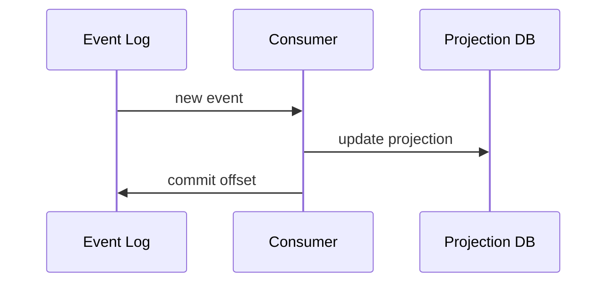
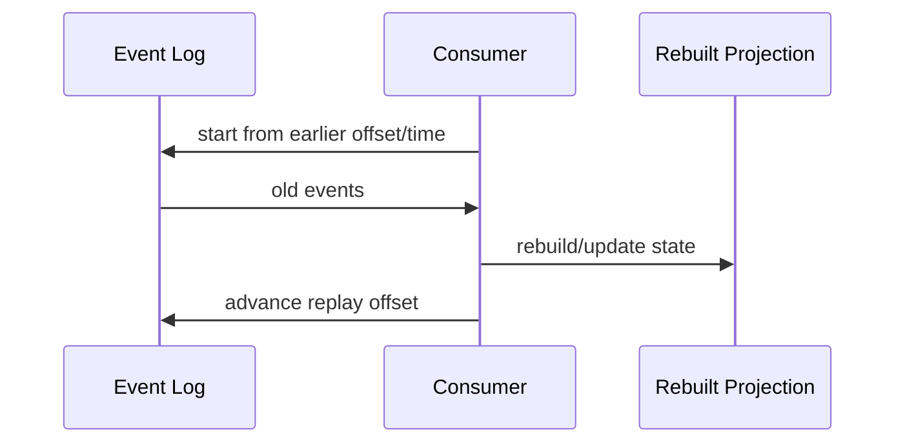
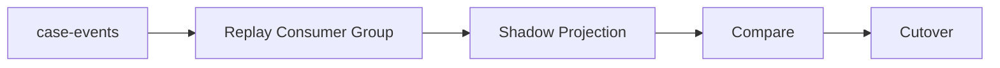
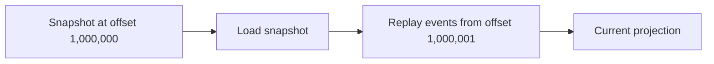
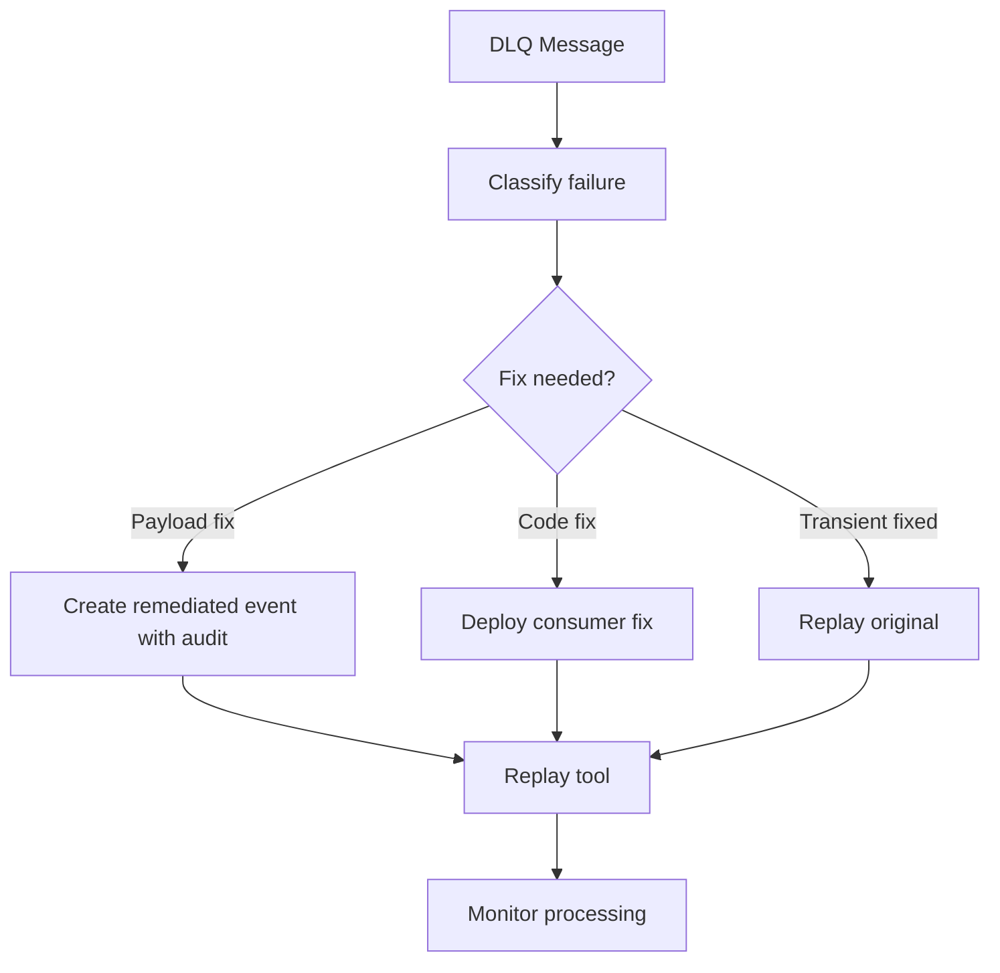
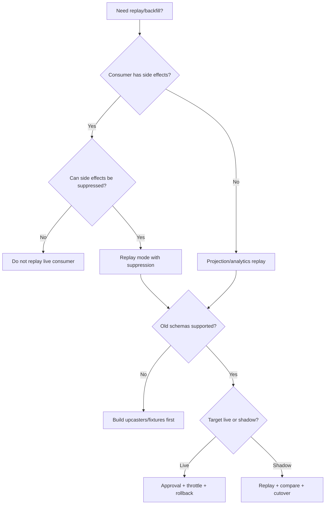

# Part 069 — Event Replay, Backfill, and Reprocessing

One of the most powerful promises of event-driven systems is replay.

If events are retained, a consumer can process old messages again.

This enables:

- rebuilding projections,
- onboarding new consumers,
- fixing historical bugs,
- reprocessing after schema migration,
- backfilling analytics,
- recovering from data corruption,
- auditing behavior,
- validating new logic against old data.

But replay is dangerous.

If consumers are not replay-safe, replay can:

- resend emails,
- call external providers again,
- duplicate payments,
- recreate workflow commands,
- overwrite corrected data,
- trigger old business processes,
- overload dependencies,
- violate privacy retention rules,
- break on old schema versions,
- flood downstream topics.

Replay is not just "reset offset."

Replay is an operational procedure with correctness, safety, and governance requirements.

---

## 1. Replay Mental Model

Normal consumption:



Replay:



Replay changes time.

The consumer sees historical messages as if they are new inputs.

Your code must know whether it is processing:

```text
live traffic
```

or:

```text
historical replay/backfill
```

because side effects and observability may differ.

---

## 2. Replay Is Not Always Safe

Replay-safe consumer:

```text
search index projector
analytics aggregate builder
cache warmer
read model rebuilder
audit verifier
```

Replay-dangerous consumer:

```text
email sender
payment submitter
external API caller
workflow command emitter
notification pusher
ticket creator
```

Why?

Projection replay usually rewrites deterministic local state.

Side-effect replay can repeat real-world actions.

Production rule:

> Every consumer must declare whether replay is allowed, forbidden, or allowed only in special mode.

Example policy:

```yaml
consumers:
  search-indexer:
    replaySafe: true
  notification-sender:
    replaySafe: false
  workflow-command-emitter:
    replaySafe: restricted
```

Do not reset offsets until you know this.

---

## 3. Replay vs Backfill vs Reprocessing

These terms are related but not identical.

| Term | Meaning |
|---|---|
| Replay | Read historical messages again from broker/log |
| Backfill | Populate missing or new data over historical range |
| Reprocessing | Process data again with new/fixed logic |
| DLQ replay | Re-submit failed messages from dead-letter storage |
| Projection rebuild | Recreate read model from event history |
| Migration replay | Use old events to build new schema/model |
| Shadow replay | Process old events into separate output for validation |

Example:

```text
Replay case-events from 2026-01-01 to rebuild search index.
```

Example:

```text
Backfill riskScore into case_projection for all existing cases.
```

Example:

```text
Reprocess CaseEscalated events after fixing targetQueue mapping bug.
```

Precise language prevents operational mistakes.

---

## 4. Why Replay Exists

Replay is useful for:

### 4.1 Rebuild projection

```text
delete search projection
replay case-events
rebuild search index
```

### 4.2 Add new consumer

```text
analytics-service starts from earliest retained offset
```

### 4.3 Fix bug

```text
old consumer incorrectly mapped CLOSED status
deploy fix
reprocess affected events
```

### 4.4 Data migration

```text
new read model table introduced
backfill from event history
```

### 4.5 Audit verification

```text
compare event-derived state to current database state
```

### 4.6 Disaster recovery

```text
restore projection database
replay retained events after backup point
```

Replay is one reason event logs are powerful.

But only if event contracts and consumers support it.

---

## 5. Replay Requires Retention

You can only replay what you still have.

Retention policy matters.

```text
topic retention = 7 days
bug discovered after 30 days
events gone
```

Then you need another source:

- database snapshot,
- object storage archive,
- audit table,
- compacted topic,
- backup,
- data warehouse,
- producer-side outbox archive.

Retention is a business recovery decision.

Ask:

- how far back may we need to replay?
- what is the recovery point objective?
- what is regulatory retention?
- what is storage cost?
- do old schemas remain readable?
- can side effects be suppressed?

Topic retention is part of the replay contract.

---

## 6. Replay and Schema Evolution

Replay consumes old events.

Consumer code must handle old schemas.

If event schema evolved from v1 to v2:

```text
old topic contains both v1 and v2
```

Replay consumer must either:

- support both,
- upcast v1 to v2,
- route old version to legacy handler,
- reject and park unsupported versions,
- use historical fixture tests.

Bad replay failure:

```text
consumer only supports latest schema
old retained events fail deserialization
```

Replay compatibility must be tested before production replay.

---

## 7. Replay Modes

A consumer can support multiple modes.

```java
public enum ProcessingMode {
    LIVE,
    REPLAY,
    BACKFILL,
    DRY_RUN,
    SHADOW
}
```

Mode affects behavior:

| Behavior | Live | Replay |
|---|---:|---:|
| update projection | yes | yes |
| send email | yes | no |
| emit derived event | yes | maybe no |
| call external API | yes | usually no |
| write audit | yes | maybe tagged |
| metrics | normal | replay-tagged |
| alerts | normal | replay-aware |
| rate limits | normal | throttled |

Pass mode explicitly.

Do not infer replay mode from random environment variables hidden in code.

---

## 8. Side-Effect Suppression

Replay-safe consumer should suppress real side effects.

Example:

```java
public final class NotificationEventHandler {
    private final NotificationIntentRepository intents;

    public void handle(CaseEscalatedEvent event, MessageContext context) {
        if (context.processingMode() == ProcessingMode.REPLAY) {
            metrics.sideEffectSuppressed(event.type());
            return;
        }

        intents.createIfAbsent(NotificationIntent.from(event));
    }
}
```

Better for critical side effects:

- separate projection consumers from side-effect consumers,
- never replay side-effect topics into live sender,
- use shadow output topic,
- require explicit override approval.

The safest replay is one that cannot trigger real-world actions.

---

## 9. Replay and Idempotency

Replay may deliver events already processed before.

Idempotency must decide:

- skip existing state,
- rebuild from scratch,
- overwrite deterministically,
- compare versions,
- write to separate target,
- record replay audit.

Projection rebuild strategies:

### In-place idempotent update

```text
upsert by aggregate ID and version
```

### Wipe and rebuild

```text
create new projection table/index
replay into it
swap alias when complete
```

### Shadow rebuild

```text
build projection_v2
compare with projection_v1
cut over
```

For critical read models, shadow rebuild is often safer.

---

## 10. Offset Reset

Offset reset means telling a consumer group to start reading from another position.

Positions can be:

- earliest,
- latest,
- timestamp,
- specific partition offset,
- committed offset from backup,
- offset from another group.

Offset reset is powerful and dangerous.

Checklist before reset:

- consumer replay-safe?
- side effects disabled?
- topic retention covers range?
- old schemas supported?
- downstream capacity available?
- lag alerts adjusted?
- duplicate handling verified?
- output target safe?
- rollback plan exists?

Never reset production consumer offsets casually.

---

## 11. Separate Replay Consumer Group

Instead of resetting live consumer group, use a separate group.

```text
live group: search-indexer
replay group: search-indexer-replay-20260705
```

Benefits:

- live processing continues,
- replay progress isolated,
- lower risk,
- easier throttling,
- can write to shadow target.

Example:

```yaml
replay:
  consumerGroup: search-indexer-replay-20260705
  sourceTopic: case-events
  targetIndex: case-search-v2-shadow
```

Use separate consumer groups for backfills whenever possible.

---

## 12. Shadow Replay

Shadow replay processes old events into a separate target.



Benefits:

- no impact on live projection,
- compare old vs new logic,
- safe validation,
- rollback easy,
- supports blue/green read model migration.

This is the preferred pattern for critical projection rebuilds.

---

## 13. Cutover Strategy

For projection rebuild:

1. create new projection target,
2. replay historical events,
3. catch up near live offset,
4. dual-write or continue consuming live stream,
5. compare counts/checksums/samples,
6. switch read path,
7. monitor,
8. keep old projection for rollback,
9. decommission later.

Example:

```text
case-search-v1 -> case-search-v2
```

Do not drop old projection before proving new one.

---

## 14. Backfill From Database vs Event Log

Sometimes event log is insufficient.

Use database backfill when:

- events are not retained,
- event schema lacks required field,
- event history incomplete,
- projection needs current snapshot,
- old events were incorrect,
- data correction must use current truth.

Use event replay when:

- event log is complete,
- temporal history matters,
- projection derives from event sequence,
- new consumer needs historical facts.

Sometimes combine:

```text
database snapshot + events after snapshot point
```

This is common in disaster recovery.

---

## 15. Snapshot + Replay

For large histories, replaying from the beginning may be too slow.

Use snapshot:



Snapshot must record:

- source topic,
- partition offsets,
- schema versions,
- snapshot timestamp,
- projection version,
- producer/application version.

If snapshot offset is inaccurate, replay may miss or duplicate events.

Idempotency still matters.

---

## 16. Backfill Jobs

Backfill job should be treated as production workload.

It needs:

- owner,
- scope,
- start/end range,
- throttle,
- checkpointing,
- dry run,
- progress metrics,
- error handling,
- rollback,
- audit,
- capacity plan,
- data validation.

Bad:

```text
developer runs one-off script from laptop
```

Good:

```text
controlled batch job with checkpoints, metrics, approval, and runbook
```

Backfill can be more dangerous than live traffic because it may touch millions of records.

---

## 17. Replay Throttling

Replay can overload:

- broker,
- database,
- search index,
- external APIs,
- downstream topics,
- observability backend.

Throttle by:

- max records per second,
- max partitions,
- max consumer instances,
- sleep between batches,
- database write rate,
- output topic rate,
- time window,
- priority class.

Example policy:

```yaml
replay:
  maxRecordsPerSecond: 500
  maxConcurrentPartitions: 6
  pauseWhenLiveLagAbove: 10000
  allowedWindow: "00:00-05:00"
```

Replay should not starve live production traffic.

---

## 18. Replay and Consumer Lag Alerts

Replay intentionally creates lag.

If replay group starts at earliest, lag may be huge.

Do not page on expected replay lag.

But do monitor:

- replay progress,
- replay throughput,
- estimated completion,
- error rate,
- oldest event processed,
- output lag,
- live consumer lag impact.

Use separate alert thresholds for replay groups.

Live lag alerts remain active.

---

## 19. DLQ Replay

DLQ replay means taking failed messages and trying again.

Rules:

- preserve original message ID,
- preserve original key,
- preserve original event type/version,
- preserve correlation/causation,
- record replay attempt metadata,
- avoid changing payload unless remediation approved,
- audit who replayed and why,
- send to original topic or targeted retry input by policy.

Bad DLQ replay:

```text
copy payload to new topic with new IDs and missing headers
```

This breaks dedup, ordering, tracing, and audit.

---

## 20. DLQ Replay Workflow



DLQ replay should be a tool with guardrails, not manual copy/paste.

---

## 21. Reprocessing With New Logic

When fixing consumer logic:

1. identify affected event range,
2. identify affected keys/entities,
3. deploy fixed consumer in shadow mode,
4. replay affected events,
5. compare output,
6. apply correction,
7. audit changes.

Avoid replaying entire topic if affected range is small.

Use filters carefully:

- event type,
- timestamp,
- aggregate IDs,
- partition offsets,
- schema version,
- correlation ID.

Filtering must not break ordering if sequence matters.

---

## 22. Filtering Replay

Filtering can be dangerous.

Example:

```text
Replay only CaseEscalated events
```

But projection also requires:

```text
CaseCreated before CaseEscalated
```

If you filter out `CaseCreated`, projection may fail.

Safe filtering depends on consumer logic.

For aggregate projections, replay full aggregate event sequence or use snapshot.

For independent analytics, event-type filtering may be safe.

---

## 23. Replay and Privacy

Old events may contain data that current policy no longer allows.

Replay can reintroduce:

- deleted personal data,
- stale consent,
- old sensitive fields,
- data beyond retention,
- restricted records into new systems.

Before replay:

- check data classification,
- check retention policy,
- check right-to-erasure handling,
- check access control,
- check target system approval.

Event retention and replay are privacy-sensitive.

---

## 24. Replay and GDPR/Deletion

If events contain personal data and subject deletion occurred, replay from old events can rehydrate deleted data.

Mitigations:

- avoid PII in events,
- tokenize/encrypt sensitive fields,
- use tombstone/delete events,
- apply deletion filter during replay,
- maintain deletion ledger,
- design projections to honor erasure events,
- limit retention of sensitive topics.

Replay must respect current privacy state.

This is a business/legal requirement, not only technical.

---

## 25. Replay Output Safety

Replay can produce output.

Possible outputs:

- projection database,
- derived topic,
- notification intent,
- audit record,
- external API call.

Classify output:

| Output | Replay safe? |
|---|---|
| shadow projection | yes |
| live projection upsert | maybe |
| derived event topic | maybe |
| email/SMS | usually no |
| payment/external command | no |
| audit append | depends |
| metrics | yes, but tag replay |

Default: replay should not emit irreversible external side effects.

---

## 26. Replay Context

Message context should include replay mode.

```java
public record MessageContext(
    String topic,
    int partition,
    long offset,
    String key,
    String messageId,
    ProcessingMode mode,
    String replayJobId
) {}
```

Consumer can branch explicitly:

```java
if (context.mode() == ProcessingMode.REPLAY) {
    handler.handleReplay(event, context);
} else {
    handler.handleLive(event, context);
}
```

Avoid hidden global flags.

Make replay context explicit and testable.

---

## 27. Replay Job Metadata

Record replay job:

```sql
CREATE TABLE replay_job (
    id text PRIMARY KEY,
    source_topic text NOT NULL,
    consumer_group text NOT NULL,
    target text NOT NULL,
    mode text NOT NULL,
    requested_by text NOT NULL,
    reason text NOT NULL,
    started_at timestamptz,
    completed_at timestamptz,
    status text NOT NULL,
    config jsonb NOT NULL
);
```

Record:

- who,
- why,
- what source,
- what range,
- what target,
- what mode,
- approval,
- result,
- errors.

Replay is operationally significant.

Audit it.

---

## 28. Observability

Metrics:

```text
replay.jobs.started.total{consumer,mode}
replay.jobs.completed.total{consumer,status}
replay.records.processed.total{consumer,event_type,status}
replay.processing.duration{consumer,event_type}
replay.throughput.records_per_second{consumer}
replay.errors.total{consumer,event_type,reason}
replay.side_effects.suppressed.total{consumer,event_type}
replay.output.records.total{target,status}
replay.lag.remaining{job_id}
backfill.records.scanned.total{job}
backfill.records.updated.total{job}
```

Be careful with `job_id` as metric label.

It may be high-cardinality.

Use it in logs; metrics can use job type/mode/status.

Logs:

- replay started,
- replay paused/resumed,
- replay completed,
- replay failed,
- side effect suppressed,
- old schema upcasted,
- record parked,
- cutover executed.

---

## 29. Alerting

Useful alerts:

| Alert | Meaning |
|---|---|
| replay error rate high | bad code/schema/data |
| replay throughput drops | capacity/dependency issue |
| replay impacts live lag | throttle needed |
| replay emits side effect | safety violation |
| replay unsupported schema | compatibility gap |
| backfill checkpoint stale | job stuck |
| DLQ replay failures | remediation incomplete |
| replay target mismatch | cutover risk |
| replay job running outside window | governance violation |

Replay alerts should go to job owner, not random on-call only.

---

## 30. Testing Replay

Minimum tests:

| Scenario | Expected |
|---|---|
| replay projection | deterministic output |
| duplicate replay | no duplicate effect |
| side-effect consumer replay | side effect suppressed |
| old schema replay | upcaster works |
| unknown schema | parked or fails clearly |
| DLQ replay preserves ID | dedup works |
| backfill resume after crash | continues from checkpoint |
| filtered replay | does not violate ordering |
| replay privacy deletion | deleted subject not rehydrated |
| shadow replay compare | differences reported |

Replay tests should use historical fixtures.

---

## 31. Historical Fixture Test

```java
@Test
void replaysHistoricalCaseEscalatedV1Event() {
    RawEvent raw = fixture("case-escalated-v1-2026-01-01.json");

    MessageContext replayContext = MessageContext.replay("replay-20260705");

    consumer.handle(raw, replayContext);

    assertThat(projection.exists("CASE-100")).isTrue();
}
```

If you cannot replay historical fixtures in test, production replay is risky.

---

## 32. Side-Effect Suppression Test

```java
@Test
void replayDoesNotCreateNotificationIntent() {
    CaseEscalatedEvent event = event("evt-123");

    consumer.handle(event, MessageContext.replay("replay-1"));

    assertThat(notificationIntentRepository.count()).isZero();
    assertThat(metrics.sideEffectsSuppressed()).isEqualTo(1);
}
```

Do not rely on human memory to disable side effects.

Test it.

---

## 33. Backfill Checkpoint Test

```java
@Test
void backfillResumesFromLastCheckpoint() {
    backfill.runUntilCheckpoint(1000);
    backfill.simulateCrash();

    backfill.run();

    assertThat(backfill.processedRange()).startsAfter(1000);
}
```

Long backfills must be resumable.

Restarting from zero may be too expensive or unsafe.

---

## 34. Production Replay Policy Template

```yaml
replayPolicy:
  consumers:
    search-indexer:
      replayAllowed: true
      mode: projection-rebuild
      sideEffectsAllowed: false
      historicalSchemaSupport: required
      maxRecordsPerSecond: 1000
      defaultTarget: shadow-index
      cutoverRequiresApproval: true

    notification-sender:
      replayAllowed: false
      sideEffectsAllowed: false
      dlqReplay:
        allowed: true
        preserveMessageId: true
        manualApprovalRequired: true

    analytics-aggregator:
      replayAllowed: true
      mode: backfill
      maxRecordsPerSecond: 5000
      outputTag: replay

  governance:
    replayJobRecordRequired: true
    approvalRequiredForLiveTarget: true
    privacyReviewRequiredForSensitiveTopics: true
    liveLagProtection: true
```

Replay capability must be designed before an incident.

---

## 35. Common Anti-Patterns

### 35.1 Resetting production offsets casually

Can duplicate side effects or destroy progress.

### 35.2 Replaying side-effect consumers

Emails, payments, commands repeat.

### 35.3 No historical schema support

Old events fail during replay.

### 35.4 No replay throttling

Replay overloads live systems.

### 35.5 DLQ replay with new message IDs

Dedup breaks.

### 35.6 Filtering events without ordering analysis

Projection corrupts.

### 35.7 No replay audit

Nobody knows who reprocessed what.

### 35.8 Backfill script from laptop

No checkpoint, metrics, approval, rollback.

### 35.9 Replay rehydrates deleted data

Privacy violation.

### 35.10 No shadow target

Critical projection rebuild risks live reads.

---

## 36. Decision Model



Replay is a controlled production operation.

---

## 37. Design Checklist

Before running replay/backfill:

- Why is replay needed?
- Which topic/range/offsets?
- Which consumer group?
- Is consumer replay-safe?
- Are side effects suppressed?
- Are old schemas supported?
- Are historical fixtures tested?
- Is target live or shadow?
- Is output idempotent?
- Is replay throttled?
- Is live lag protected?
- Is privacy reviewed?
- Are deleted subjects handled?
- Is DLQ replay preserving IDs?
- Is there approval?
- Is there rollback?
- Are metrics/alerts ready?
- Is replay job audited?
- Is completion validated?

---

## 38. The Real Lesson

Replay is one of the biggest advantages of event-driven architecture.

It is also one of the biggest risks.

The difference is design.

A replay-ready system has:

```text
retained events
+ stable schemas
+ replay-safe consumers
+ side-effect suppression
+ idempotency
+ throttling
+ shadow targets
+ audit
+ observability
+ runbooks
```

Without those, replay is not a feature.

It is a dangerous manual operation.

Top-tier engineers design replay before they need it.

---

## References

- Apache Kafka Documentation: https://kafka.apache.org/documentation/
- Confluent Kafka Consumer Offset Reset: https://docs.confluent.io/platform/current/clients/consumer.html
- Enterprise Integration Patterns — Idempotent Receiver: https://www.enterpriseintegrationpatterns.com/patterns/messaging/IdempotentReceiver.html
- CloudEvents Specification: https://github.com/cloudevents/spec
- Confluent Schema Registry — Schema Evolution and Compatibility: https://docs.confluent.io/platform/current/schema-registry/fundamentals/schema-evolution.html
