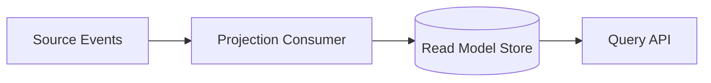
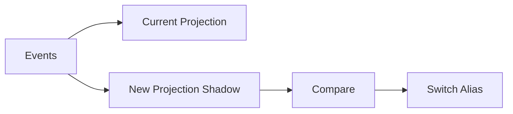

# Part 070 — Projections, Materialized Views, and Read Models

A projection is derived state.

It is built from source data or events to optimize reads.

In microservices, projections are common because the service that owns truth is not always the best service for every query.

Example:

```text
case-service owns case aggregate
search-indexer builds searchable case view
analytics-service builds reporting view
notification-service builds notification preference snapshot
```

A projection improves autonomy and performance.

It also introduces eventual consistency.

The production question is not:

```text
Can we build a read model?
```

The real question is:

```text
Can we keep the read model correct, fresh, rebuildable, observable, and honest to users?
```

---

## 1. Projection Mental Model



The source of truth publishes events.

A consumer updates a read-optimized store.

Clients query the read model.

This decouples reads from the write model, but the read model is no longer immediately consistent by default.

---

## 2. When to Use Projection

Use projection when:

- query needs data from multiple services,
- read shape differs from write model,
- search/filter/sort needs specialized index,
- read load should not hit source service,
- UI needs denormalized view,
- analytics/reporting need event-derived tables,
- cross-service joins would be too chatty,
- source service should remain autonomous.

Avoid projection when:

- strong consistency is required,
- data is small and local,
- query can be served by source service simply,
- team cannot operate lag/rebuild,
- stale data would be dangerous and no mitigation exists.

Projection is an architectural trade-off.

---

## 3. Materialized View

A materialized view is precomputed data.

Example:

```sql
CREATE TABLE case_search_projection (
    case_id text PRIMARY KEY,
    status text NOT NULL,
    customer_name text,
    assigned_queue text,
    risk_level text,
    aggregate_version bigint NOT NULL,
    updated_at timestamptz NOT NULL
);
```

It may live in:

- PostgreSQL,
- OpenSearch,
- Redis,
- Cassandra,
- MongoDB,
- ClickHouse,
- data warehouse,
- in-memory cache.

Choose store based on query shape and operational requirements.

---

## 4. Projection Correctness

Correctness rules:

- process each event idempotently,
- apply events in valid order per entity,
- ignore duplicates,
- handle old events,
- detect sequence gaps,
- handle schema versions,
- handle deletes/tombstones,
- expose freshness,
- support rebuild.

Projection bugs are subtle because they may not throw errors.

They silently return wrong data.

---

## 5. Idempotency

Every projection consumer must handle duplicate events.

Typical table:

```sql
CREATE TABLE processed_message (
    consumer_name text NOT NULL,
    event_id text NOT NULL,
    processed_at timestamptz NOT NULL,
    PRIMARY KEY (consumer_name, event_id)
);
```

Handler pattern:

```text
if event_id processed -> skip
else apply projection and mark processed in same transaction
```

For idempotent upsert by aggregate version, you may use:

```text
apply event only if event.aggregateVersion > projection.version
```

But still consider event ID tracking for auditing and duplicate metrics.

---

## 6. Ordering and Versioning

Include aggregate version in events.

```json
{
  "caseId": "CASE-100",
  "aggregateVersion": 42,
  "eventType": "CaseEscalated.v1"
}
```

Projection rule:

```text
if event.version == currentVersion + 1 -> apply
if event.version <= currentVersion -> duplicate/old, ignore
if event.version > currentVersion + 1 -> gap, retry/park
```

This prevents out-of-order corruption.

Ordering scope must match Kafka key.

If key is `caseId`, per-case ordering is possible within one partition.

---

## 7. Freshness

Projection freshness:

```text
now - occurredAt of latest applied source event
```

or:

```text
now - occurredAt of oldest unprocessed event
```

Expose metrics:

```text
projection.freshness.seconds{projection=case-search}
projection.lag.events{projection=case-search}
projection.last_applied_version{case_id}
```

API may include:

```json
{
  "data": [...],
  "projection": {
    "updatedAt": "2026-07-05T10:15:30Z",
    "freshnessSeconds": 12
  }
}
```

For critical decisions, stale data must be visible.

---

## 8. Read-Your-Writes

Problem:

```text
user updates case
immediately searches
search projection has not caught up
```

Options:

- query source service for immediate view,
- return operation status until projection catches up,
- include version token and wait until projection version >= token,
- show stale marker,
- use source-of-truth API for critical confirmation,
- accept eventual consistency if UX permits.

Do not pretend search is immediately consistent if it is not.

---

## 9. Rebuild

Projections must be rebuildable when:

- schema changes,
- bug corrupts projection,
- new field added,
- search index mapping changes,
- event replay needed,
- data migration occurs.

Rebuild strategies:

| Strategy | Notes |
|---|---|
| truncate and replay | simple but downtime/staleness |
| shadow rebuild | build new projection alongside old |
| incremental backfill | lower risk |
| dual-write projection | temporary migration |
| snapshot + replay | faster recovery |

Critical projections should support shadow rebuild.

---

## 10. Shadow Rebuild



Useful for search indexes.

Process:

1. create new index/table,
2. replay events into new projection,
3. compare counts/checksums,
4. shadow query if needed,
5. switch read alias,
6. keep old for rollback,
7. delete old after confidence.

Shadow rebuild enables safe migration.

---

## 11. Projection Store Choice

Choose based on query.

| Store | Good for |
|---|---|
| PostgreSQL | relational read models, moderate search |
| OpenSearch | full-text search/filter |
| Redis | cache/low-latency lookups |
| Cassandra | high-write denormalized views |
| ClickHouse | analytics/OLAP |
| MongoDB | document-shaped views |

Do not choose a specialized store without operational ownership.

Search clusters and caches have failure modes.

---

## 12. API Semantics

A projection-backed API must document:

- consistency model,
- freshness SLO,
- sorting stability,
- pagination stability,
- stale response behavior,
- rebuild behavior,
- source of truth,
- error behavior when projection unavailable.

Example:

```text
Search results are eventually consistent. 99% of updates are visible within 30 seconds. For immediate case state, call GET /cases/{caseId}.
```

Honest API semantics reduce confusion.

---

## 13. Delete and Tombstone

Handle deletion.

Options:

- hard delete projection row,
- soft delete with status,
- tombstone event,
- retention-based removal,
- privacy anonymization.

Example event:

```json
{
  "eventType": "CaseDeleted.v1",
  "caseId": "CASE-100",
  "aggregateVersion": 50
}
```

Projection must remove or mask data consistently.

Privacy deletion often affects projections.

---

## 14. Security and Privacy

Projection can combine data from multiple services.

This may increase sensitivity.

Rules:

- classify projection data,
- minimize fields,
- enforce access control,
- redact logs,
- secure rebuild/replay,
- restrict data exports,
- handle deletion/anonymization,
- avoid indexing secrets,
- audit admin access.

A projection is not less sensitive because it is derived.

It may be more sensitive.

---

## 15. Observability

Dashboard:

- input event rate,
- processed event rate,
- lag seconds,
- freshness p99,
- duplicate skipped,
- sequence gaps,
- DLQ count,
- projection write latency,
- target store errors,
- rebuild progress,
- stale API response count.

Alert on:

- freshness SLO breach,
- DLQ > 0 for critical projection,
- sequence gap,
- rebuild stalled,
- target store write failures.

---

## 16. Testing

Test:

- valid event updates projection,
- duplicate event skipped,
- old version ignored,
- gap detected,
- delete/tombstone handled,
- unknown field tolerated,
- old schema fixture processed,
- replay mode works,
- rebuild produces expected state,
- stale marker returned by API.

Projection tests should use real fixtures.

---

## 17. Common Anti-Patterns

### 17.1 Projection treated as source of truth

Leads to conflicting updates.

### 17.2 No freshness metric

Staleness invisible.

### 17.3 No rebuild path

Bug becomes permanent.

### 17.4 Duplicate events corrupt projection

At-least-once ignored.

### 17.5 No aggregate version

Out-of-order events corrupt state.

### 17.6 Projection leaks PII

Derived data not governed.

### 17.7 Search used for critical immediate state

User sees stale data.

---

## 18. Design Checklist

Before shipping projection:

- What is source of truth?
- What events feed projection?
- What store is used?
- What query shape is optimized?
- Is idempotency implemented?
- Is aggregate version used?
- Is sequence gap handled?
- Is freshness measured?
- Is freshness exposed if needed?
- Is rebuild supported?
- Is replay tested?
- Is privacy reviewed?
- Is API consistency documented?
- Is DLQ owned?
- Is dashboard ready?

---

## 19. The Real Lesson

A projection is a promise:

```text
I can serve this query faster or more autonomously, but I accept responsibility for freshness, rebuild, and correctness.
```

Production-grade projections require:

```text
idempotency
+ ordering/version checks
+ freshness SLO
+ rebuild strategy
+ privacy governance
+ operational dashboards
```

Projection design is not only data modeling.

It is communication design.

---

## References

- Enterprise Integration Patterns — Message Channel: https://www.enterpriseintegrationpatterns.com/patterns/messaging/MessageChannel.html
- Microservices.io — CQRS Pattern: https://microservices.io/patterns/data/cqrs.html
- Apache Kafka Documentation: https://kafka.apache.org/documentation/
- Spring Kafka Reference: https://docs.spring.io/spring-kafka/reference/
