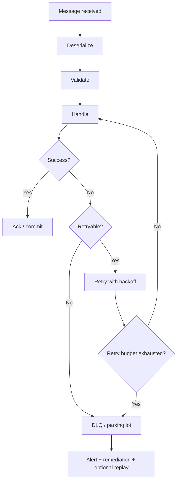
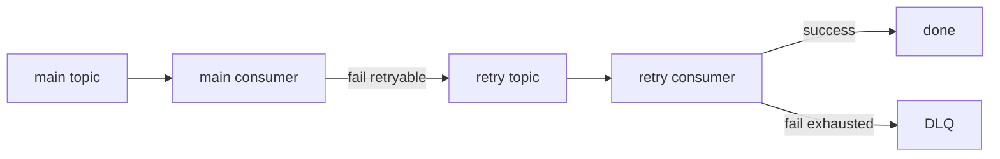
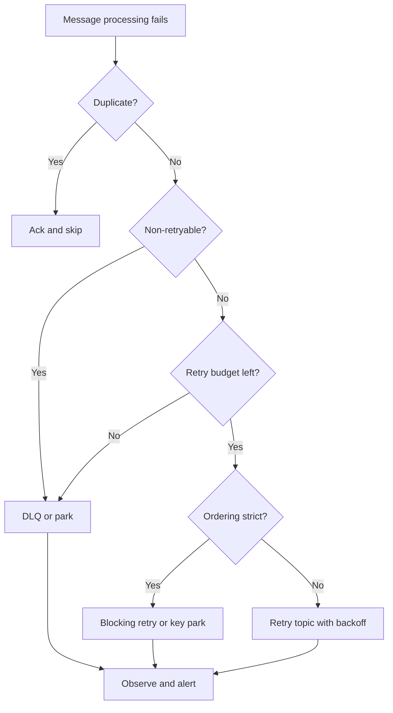

# Part 071 — Retry, Dead-Letter, and Poison Message Handling

A message consumer will fail.

Not maybe.

It will fail.

It can fail because:

- database is down,
- downstream HTTP/gRPC service is unavailable,
- schema is invalid,
- event type is unsupported,
- authorization fails,
- data violates domain invariant,
- message is duplicated,
- handler has a bug,
- external provider rate-limits,
- partition is rebalanced,
- deserialization fails,
- poison message blocks progress.

The question is not:

```text
How do we avoid all consumer failures?
```

The question is:

```text
How do we classify failure and move the message through a controlled recovery path?
```

Retry and DLQ design turns random consumer failure into an observable state machine.

---

## 1. Failure Handling Mental Model



Every failure path must answer:

- retry or not?
- retry now or later?
- preserve order or continue?
- commit source offset or not?
- where is failure recorded?
- who is alerted?
- how is it replayed?
- how do we avoid duplicate effects?

---

## 2. Failure Taxonomy

Classify failures before designing retry.

| Failure | Retry? | Example |
|---|---:|---|
| transient dependency failure | yes | database timeout |
| broker/network temporary issue | yes | connection reset |
| downstream rate limit | yes with backoff | HTTP 429 |
| downstream unavailable | yes with backoff | gRPC `UNAVAILABLE` |
| optimistic conflict | maybe | aggregate version conflict |
| schema invalid | no automatic retry | missing required field |
| unsupported event version | no until deployment | `CaseEscalated.v9` |
| authorization failure | usually no | consumer lacks permission |
| deterministic domain invalid | no | case ID format impossible |
| poison message | no after budget | same record fails repeatedly |
| consumer bug | no until fix; park/DLQ | `NullPointerException` for specific event |
| duplicate message | no retry; ack/skip | already processed |

A retry policy without classification creates retry storms and stuck partitions.

---

## 3. Retry Is Not One Thing

Retry styles:

| Style | Meaning |
|---|---|
| immediate retry | retry in same processing loop |
| blocking retry | consumer waits before retrying same record |
| non-blocking retry | move failed record to retry topic/queue |
| delayed retry | retry after delay |
| exponential backoff | increasing delay |
| retry topic chain | retry-1m, retry-5m, retry-30m |
| parking lot | manual remediation state |
| DLQ | terminal failure channel |
| replay | reprocess after fix |

Each style has trade-offs.

There is no universal best retry.

---

## 4. Blocking Retry

Blocking retry keeps message in the current consumer flow.

```text
record fails
consumer waits
consumer tries again
partition does not advance
```

Pros:

- preserves partition order,
- simple,
- no extra topics,
- useful for short transient failures.

Cons:

- one bad message blocks partition,
- consumer lag grows,
- long sleeps waste consumer capacity,
- poison message stalls everything behind it.

Use blocking retry for:

- short transient failures,
- strict per-partition order,
- low retry delay,
- bounded attempts.

Do not block for minutes on high-throughput partitions unless order truly requires it.

---

## 5. Non-Blocking Retry

Non-blocking retry moves failed message elsewhere and commits the original offset.



Pros:

- main consumer continues,
- delayed retry easier,
- poison isolated,
- better throughput.

Cons:

- ordering may break,
- extra topics,
- more operational complexity,
- replay/DLQ tooling needed,
- duplicates possible.

Use non-blocking retry when throughput and availability matter more than strict partition order.

Spring Kafka's non-blocking retry support is built around extra retry/DLT topics and corresponding listeners.

---

## 6. Retry Topic Chain

Example:

```text
case-events
case-events.retry.1m
case-events.retry.5m
case-events.retry.30m
case-events.dlt
```

Flow:

```text
main -> retry.1m -> retry.5m -> retry.30m -> DLT
```

Headers should track:

- original topic,
- original partition,
- original offset,
- original key,
- original timestamp,
- failure reason,
- exception class,
- attempt count,
- first failure time,
- last failure time,
- consumer group,
- correlation ID.

Retry messages must preserve original identity and key unless policy says otherwise.

---

## 7. Retry and Ordering

Retry can break ordering.

Example:

```text
partition records:
10 CaseEscalated
11 CaseClosed
```

If record 10 fails and is moved to retry topic, record 11 may process first.

This may be okay for independent side effects.

It is dangerous for ordered projections.

Policy options:

| Requirement | Better retry style |
|---|---|
| strict per-key order | blocking retry or key-level parking |
| independent side effects | non-blocking retry |
| high throughput | retry topics |
| projection correctness | sequence check + park on gap |
| notification send | retry topic usually okay |
| payment command | command idempotency + workflow status |

Retry design depends on domain ordering, not only framework capability.

---

## 8. Poison Message

A poison message repeatedly fails because retry will not fix it.

Examples:

- invalid schema,
- unsupported enum,
- impossible domain state,
- payload violates invariant,
- consumer bug for specific shape,
- external reference missing permanently,
- malformed JSON,
- corrupted binary payload.

Poison detection:

```text
same message fails same way N times
```

or:

```text
failure classified non-retryable
```

Poison handling:

- DLQ,
- parking lot,
- alert,
- remediation tool,
- replay after fix,
- skip with audit if allowed.

Do not retry poison forever.

---

## 9. Dead-Letter Queue / Topic

A DLQ/DLT stores messages that cannot be processed successfully through normal retry.

DLQ is not a garbage bin.

It is an operational queue.

DLQ message must preserve:

- original payload,
- original key,
- original message ID,
- original topic/partition/offset,
- original headers,
- failure metadata,
- consumer name/group,
- attempt count,
- stack/classification,
- timestamp,
- schema/version.

DLQ must have:

- owner,
- alert,
- dashboard,
- replay/remediation process,
- retention policy,
- access control.

A DLQ with no owner is silent data loss.

---

## 10. Parking Lot vs DLQ

DLQ often means terminal technical failure channel.

Parking lot often means controlled manual remediation.

| Channel | Use |
|---|---|
| retry topic | transient failure |
| DLQ/DLT | exhausted or non-retryable failure |
| parking lot | manual review/correction |
| quarantine | suspicious/security-sensitive payload |
| skipped audit | intentionally skipped message |

Example:

```text
CaseEscalated event references missing customer.
```

Maybe not DLQ immediately.

Maybe park until customer data is restored.

The name matters less than the process.

---

## 11. Retry Budget

Retry must be bounded.

Budget dimensions:

- max attempts,
- max total time,
- max delay,
- max messages in retry topics,
- max retry RPS,
- max attempts per event type,
- max attempts per key,
- max attempts per consumer group.

Example:

```yaml
retry:
  maxAttempts: 5
  maxElapsedTime: 1h
  initialDelay: 1s
  maxDelay: 5m
  jitter: true
```

Unbounded retry can create:

- infinite loops,
- delayed poison,
- broker storage growth,
- downstream overload,
- hidden stuck workflows.

---

## 12. Backoff and Jitter

Backoff avoids hammering failing dependencies.

Jitter avoids synchronized retry waves.

Bad:

```text
all failed messages retry exactly 60 seconds later
```

Good:

```text
retry after 45-75 seconds
```

Use:

- exponential backoff,
- max delay cap,
- jitter,
- rate limit,
- retry budget.

If downstream is rate-limiting, respect retry-after hints if available.

---

## 13. Commit/Ack Timing in Retry

If retry is blocking:

```text
do not ack/commit until success or terminal action
```

If moving to retry topic:

```text
publish to retry topic durably
then commit original offset
```

Crash window:

```text
consumer publishes retry message
crashes before committing original offset
```

Result:

```text
original message may be redelivered and retry copy exists
```

Therefore message identity/idempotency matters.

If moving to DLQ:

```text
publish to DLQ durably
then commit original offset
```

Never commit original offset before the retry/DLQ handoff is durable, unless message loss is acceptable.

---

## 14. Retry Handoff Atomicity

Moving from main topic to retry topic is another dual-write-like problem:

```text
publish retry record + commit source offset
```

These may not be atomic unless using broker transactions correctly.

Failure cases:

- retry published but offset not committed -> duplicate retry,
- offset committed but retry publish failed -> message lost,
- both fail -> redelivery,
- both succeed -> intended.

Mitigations:

- idempotent consumer,
- stable message ID,
- broker transactions where available,
- retry producer reliability,
- commit only after publish ack,
- monitor retry handoff failures.

Do not assume retry topic handoff is magically atomic.

---

## 15. Retry Classification Code

Java-style classifier:

```java
public enum FailureAction {
    RETRY,
    DEAD_LETTER,
    PARK,
    ACK_DUPLICATE,
    FAIL_FAST
}
```

Classifier:

```java
public final class MessageFailureClassifier {
    public FailureAction classify(Throwable error, MessageContext context) {
        if (error instanceof DuplicateMessageException) {
            return FailureAction.ACK_DUPLICATE;
        }

        if (error instanceof DeserializationException) {
            return FailureAction.DEAD_LETTER;
        }

        if (error instanceof UnsupportedEventVersionException) {
            return FailureAction.PARK;
        }

        if (error instanceof DependencyUnavailableException) {
            return FailureAction.RETRY;
        }

        if (error instanceof RateLimitedException) {
            return FailureAction.RETRY;
        }

        if (error instanceof DomainInvariantViolationException) {
            return FailureAction.DEAD_LETTER;
        }

        return FailureAction.RETRY;
    }
}
```

Classifier should be tested like business logic.

---

## 16. Spring Kafka Blocking Error Handling

Spring Kafka commonly uses listener container error handlers for blocking retries and dead-letter publishing.

Conceptual shape:

```java
@Bean
DefaultErrorHandler errorHandler(KafkaTemplate<Object, Object> template) {
    DeadLetterPublishingRecoverer recoverer =
        new DeadLetterPublishingRecoverer(template);

    ExponentialBackOffWithMaxRetries backOff =
        new ExponentialBackOffWithMaxRetries(3);

    backOff.setInitialInterval(1000L);
    backOff.setMultiplier(2.0);
    backOff.setMaxInterval(10000L);

    DefaultErrorHandler handler =
        new DefaultErrorHandler(recoverer, backOff);

    handler.addNotRetryableExceptions(
        DeserializationException.class,
        UnsupportedEventVersionException.class
    );

    return handler;
}
```

This is framework-level shape.

Your actual policy still needs domain classification.

Do not let framework defaults define business retry semantics.

---

## 17. Spring Kafka Non-Blocking Retry

Spring Kafka provides non-blocking retry/DLT functionality via retry topics.

Conceptual:

```java
@RetryableTopic(
    attempts = "4",
    backoff = @Backoff(delay = 1000, multiplier = 2.0),
    dltTopicSuffix = ".dlt"
)
@KafkaListener(topics = "case-events")
public void onCaseEvent(CaseEvent event) {
    handler.handle(event);
}

@DltHandler
public void onDlt(CaseEvent event) {
    deadLetterHandler.handle(event);
}
```

Useful for:

- delayed retry,
- avoiding blocking main topic,
- common retry/DLT topology.

But still decide:

- which exceptions retry,
- ordering impact,
- message identity preservation,
- DLT ownership,
- replay process,
- observability.

---

## 18. Deserialization Failures

Deserialization failure can happen before listener method receives message.

Problems:

- application handler cannot classify,
- payload may not deserialize,
- offset may be stuck,
- poison data blocks partition.

Policy:

- configure error deserializer or framework error handling,
- route raw record to DLQ if possible,
- include raw bytes or safe reference,
- include schema ID/version,
- alert producer/topic owner,
- do not retry deterministic corrupt payload forever.

Deserialization failures are schema contract incidents.

---

## 19. Non-Retryable Exceptions

Examples:

```java
handler.addNotRetryableExceptions(
    InvalidEventSchemaException.class,
    UnsupportedEventVersionException.class,
    AuthorizationDeniedException.class,
    UnknownEventTypeException.class
);
```

But be careful.

`UnsupportedEventVersionException` might be park, not DLQ, if deploying a new consumer version will fix it.

`AuthorizationDeniedException` might be config bug, not message bug.

Classification should include operational action.

---

## 20. Retryable Exceptions

Examples:

```java
handler.addRetryableExceptions(
    DatabaseTimeoutException.class,
    DependencyUnavailableException.class,
    RateLimitedException.class,
    OptimisticLockingFailureException.class
);
```

But retryability also depends on side effects.

If handler already called an external service and then failed, retry may duplicate side effect unless idempotency exists.

Classifier should know handler phase when possible.

Example context:

```java
enum ProcessingPhase {
    DESERIALIZE,
    VALIDATE,
    LOCAL_DB_WRITE,
    EXTERNAL_CALL,
    ACK_COMMIT
}
```

---

## 21. DLQ Topic Naming

Good DLQ names are predictable.

Examples:

```text
case-events.notification-service.dlt
case-events.search-indexer.dlt
case-events.dlt.notification-service
```

Include consumer group or consumer name.

Why?

Different consumers can fail for different reasons.

One shared DLQ for all consumers is hard to operate.

DLQ ownership should be clear from name.

---

## 22. DLQ Payload

DLQ record should preserve original record.

Headers:

```text
x-original-topic
x-original-partition
x-original-offset
x-original-key
x-original-timestamp
x-consumer-group
x-failure-reason
x-exception-class
x-exception-message-safe
x-attempt-count
x-first-failure-at
x-last-failure-at
x-correlation-id
```

Payload options:

- original payload unchanged,
- wrapper containing original payload + metadata,
- pointer to quarantined payload.

Preserving original payload makes replay easier.

But sensitive data and corrupt bytes may require controlled storage.

---

## 23. DLQ Replay Safety

DLQ replay should:

- preserve message ID,
- preserve key,
- preserve correlation/causation,
- track replay attempt,
- avoid sending to wrong consumer,
- require approval for side effects,
- be rate-limited,
- be observable.

Bad:

```text
copy DLQ payload manually to main topic with new key and new ID
```

This breaks dedup and ordering.

Use replay tooling.

---

## 24. Retry and Idempotency

Retry without idempotency is dangerous.

For each retried message, ask:

- did local DB write commit?
- did external API call succeed?
- did notification send?
- did derived event publish?
- did inbox mark completed?
- did offset commit fail?

If any effect may have happened, retry must be idempotent.

At-least-once delivery + retry means duplicate handling is mandatory.

---

## 25. Retry and Consumer Lag

Retry affects lag.

Blocking retry:

```text
main partition lag grows
```

Non-blocking retry:

```text
main lag may stay low
retry topic lag grows
```

Therefore monitor both.

Metrics:

```text
consumer.lag{topic,group}
retry.topic.lag{topic,group}
retry.messages.total{topic,group,reason}
dlt.messages.total{topic,group,reason}
oldest.retry.age.seconds{topic,group}
oldest.dlt.age.seconds{topic,group}
```

Low main lag does not mean healthy if retry/DLQ backlog is high.

---

## 26. Retry Storm

A retry storm happens when many messages fail and retry together.

Causes:

- dependency outage,
- bad deployment,
- schema break,
- rate limit,
- external provider failure,
- fixed retry delay with no jitter,
- replay plus retry.

Mitigations:

- jitter,
- circuit breaker,
- pause consumer,
- rate limit retries,
- backoff,
- bulkhead,
- move to parking lot,
- stop retrying deterministic failures,
- shed low-priority processing.

Retry should not attack a sick dependency.

---

## 27. Pause and Resume

Consumers should support operational pause.

Reasons:

- downstream outage,
- schema incident,
- DLQ spike,
- manual remediation,
- deployment issue,
- privacy incident.

Pause levels:

- pause whole consumer group,
- pause topic,
- pause partition,
- pause specific key if framework supports,
- pause retry replay.

Pause should be visible and alerting should understand it.

A silent paused consumer is an outage.

---

## 28. Observability

Metrics:

```text
consumer.failures.total{topic,group,event_type,reason}
consumer.retry.scheduled.total{topic,group,reason}
consumer.retry.attempts.total{topic,group,attempt}
consumer.retry.exhausted.total{topic,group,reason}
consumer.dlt.published.total{topic,group,reason}
consumer.dlt.publish.failures.total{topic,group}
consumer.poison.detected.total{topic,group,event_type}
consumer.blocking_retry.duration{topic,group}
consumer.paused{topic,group}
retry.topic.lag{topic,group}
dlt.oldest_age.seconds{topic,group}
```

Logs:

- message classified non-retryable,
- retry scheduled,
- retry exhausted,
- DLQ publish success/failure,
- poison detected,
- partition paused/resumed,
- replay started.

Do not log full payload by default.

---

## 29. Alerting

Useful alerts:

| Alert | Meaning |
|---|---|
| DLQ message count > 0 for critical topic | processing loss/needs action |
| retry rate high | dependency instability or bad deployment |
| oldest retry age high | messages stuck |
| poison detected | deterministic failure |
| deserialization failure | schema contract break |
| DLQ publish failure | failure path broken |
| retry storm | dependency or systemic failure |
| partition blocked by retry | lag/freshness risk |
| consumer paused too long | operational intervention needed |

DLQ alerts must route to an owning team.

---

## 30. Testing Retry/DLQ

Minimum tests:

| Scenario | Expected |
|---|---|
| transient DB failure then success | retry succeeds |
| non-retryable schema error | DLQ/park |
| retry attempts exhausted | DLQ |
| duplicate message | ack/skip, no retry |
| DLQ publish failure | source offset not lost |
| retry topic preserves key | ordering/dedup preserved |
| deserialization failure | raw record routed/handled |
| poison message | bounded retry then DLQ |
| retry storm | backoff/jitter/rate limit |
| replay from DLQ | same message ID |

Failure handling must be tested like normal business logic.

---

## 31. Test: Non-Retryable Goes to DLQ

```java
@Test
void invalidSchemaGoesToDlqWithoutRetry() {
    MessageEnvelope<CaseEvent> envelope = invalidSchemaEnvelope();

    consumer.onMessage(envelope);

    assertThat(retryPublisher.published()).isEmpty();
    assertThat(dlqPublisher.published()).hasSize(1);
    assertThat(envelope.wasAcked()).isTrue();
}
```

---

## 32. Test: Retry Exhaustion

```java
@Test
void retryableFailureEventuallyGoesToDlq() {
    handler.alwaysFails(new DependencyUnavailableException("db down"));

    consumer.onMessage(envelope("evt-123", attempt(1)));
    retryConsumer.onMessage(envelope("evt-123", attempt(2)));
    retryConsumer.onMessage(envelope("evt-123", attempt(3)));

    assertThat(dlqPublisher.eventIds()).contains("evt-123");
}
```

---

## 33. Test: Retry Preserves Identity

```java
@Test
void retryPreservesMessageIdAndKey() {
    MessageEnvelope<CaseEvent> envelope =
        envelope("evt-123", "CASE-100");

    consumer.onMessageWithRetryableFailure(envelope);

    PublishedMessage retry = retryPublisher.single();

    assertThat(retry.messageId()).isEqualTo("evt-123");
    assertThat(retry.key()).isEqualTo("CASE-100");
}
```

This protects idempotency and ordering.

---

## 34. Production Policy Template

```yaml
messageFailureHandling:
  consumers:
    notification-service:
      retry:
        strategy: non-blocking-retry-topics
        maxAttempts: 5
        backoff: exponential-jitter
        initialDelayMs: 1000
        maxDelayMs: 300000
        retryableReasons:
          - DEPENDENCY_UNAVAILABLE
          - RATE_LIMITED
          - DATABASE_TIMEOUT
        nonRetryableReasons:
          - INVALID_SCHEMA
          - UNSUPPORTED_EVENT_VERSION
          - AUTHORIZATION_DENIED
      dlt:
        enabled: true
        topic: case-events.notification-service.dlt
        preserveOriginalKey: true
        preserveMessageId: true
        owner: notification-team
        alertOnFirstMessage: true
      ordering:
        strictPerKey: false
      replay:
        manualApprovalRequired: true

    search-indexer:
      retry:
        strategy: blocking-then-park-key
        maxAttempts: 3
      ordering:
        strictPerKey: true
        sequenceGapPolicy: park-key
      dlt:
        enabled: true
        alertOnFirstMessage: true
```

Retry policy must be consumer-specific.

---

## 35. Common Anti-Patterns

### 35.1 Retry everything forever

Poison messages block or flood the system.

### 35.2 DLQ without owner

Silent data loss.

### 35.3 Commit before retry/DLQ handoff is durable

Message loss.

### 35.4 Non-blocking retry on ordered projection without sequence checks

Out-of-order corruption.

### 35.5 New message ID on retry

Dedup breaks.

### 35.6 Logging full failed payload

Privacy/security risk.

### 35.7 Treating duplicate as retryable error

Infinite duplicate loop.

### 35.8 No deserialization failure strategy

Consumer never reaches handler.

### 35.9 Retry storm without circuit/rate limit

Dependency collapse.

### 35.10 No DLQ replay tooling

Recovery becomes manual and unsafe.

---

## 36. Decision Model



Failure handling is a state machine.

Design it explicitly.

---

## 37. Design Checklist

Before shipping consumer retry/DLQ:

- Which failures are retryable?
- Which failures are terminal?
- Which failures should park?
- Is retry bounded?
- Is backoff jittered?
- Does retry preserve message ID?
- Does retry preserve key?
- Does DLQ preserve original metadata?
- Is source offset committed only after durable retry/DLQ handoff?
- Does retry style preserve required ordering?
- Are poison messages detected?
- Are deserialization failures handled?
- Is DLQ owned?
- Is DLQ alerted?
- Is DLQ replay tool available?
- Is retry storm mitigated?
- Are duplicate messages acked/skipped?
- Are tests covering retry exhaustion?
- Are metrics showing retry and DLQ backlog?

---

## 38. The Real Lesson

Consumer failure handling is not an afterthought.

It is the operational heart of event-driven systems.

A mature Java messaging system has:

```text
failure classification
+ bounded retry
+ backoff and jitter
+ ordering-aware retry strategy
+ DLQ/parking lot
+ idempotent consumers
+ safe replay
+ observability
+ ownership
```

If a message cannot be processed, the system should not panic, loop forever, or silently lose it.

It should move the message into the next correct state.

That is production-grade messaging.

---

## References

- Spring Kafka Reference — Non-Blocking Retries: https://docs.spring.io/spring-kafka/reference/retrytopic.html
- Apache Kafka Documentation: https://kafka.apache.org/documentation/
- Enterprise Integration Patterns — Dead Letter Channel: https://www.enterpriseintegrationpatterns.com/patterns/messaging/DeadLetterChannel.html
- Enterprise Integration Patterns — Idempotent Receiver: https://www.enterpriseintegrationpatterns.com/patterns/messaging/IdempotentReceiver.html
- Confluent — Kafka Dead Letter Queue: https://www.confluent.io/learn/kafka-dead-letter-queue/
