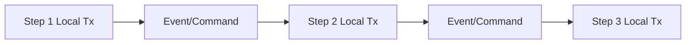
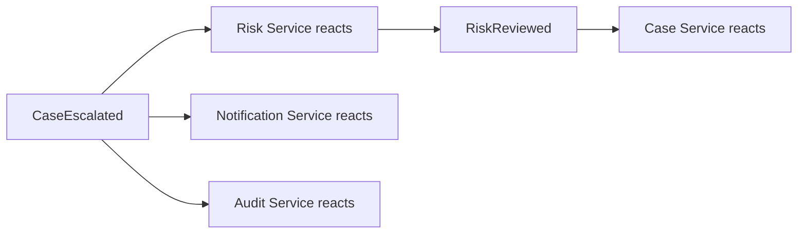
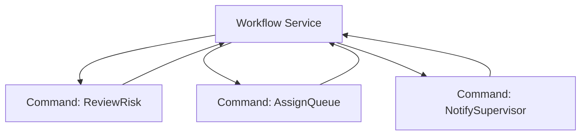
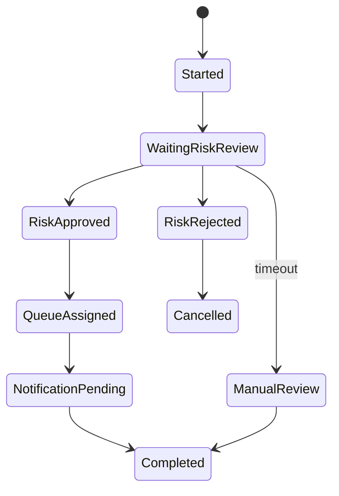

# Part 072 — Saga, Choreography, Orchestration, and Process Manager

A saga coordinates a business transaction that spans multiple services without using a distributed database transaction.

Example:

```text
Create case escalation
-> reserve investigation queue
-> request risk review
-> notify supervisor
-> create audit trail
```

Each step is local to one service.

The whole workflow is distributed.

The core question:

```text
How do we coordinate progress, failure, timeout, retry, compensation, and visibility across service boundaries?
```

There are two main styles:

- choreography,
- orchestration/process manager.

---

## 1. Saga Mental Model



Each step commits locally.

If a later step fails, saga may:

- retry,
- wait,
- compensate,
- mark failed,
- request manual intervention,
- continue with degraded state.

Saga does not provide ACID across services.

It provides managed eventual consistency.

---

## 2. Choreography

In choreography, services react to events without a central coordinator.



Benefits:

- loose coupling,
- natural event-driven flow,
- no central workflow service,
- easy fan-out.

Costs:

- workflow state is implicit,
- hard to answer "where is it now?",
- failure handling spread across services,
- timeout logic scattered,
- compensation harder,
- many hidden dependencies.

Use choreography for simple reactive flows.

---

## 3. Orchestration

In orchestration, a process manager/workflow service coordinates steps.



Benefits:

- explicit workflow state,
- centralized timeout handling,
- easier monitoring,
- clearer compensation,
- easier manual intervention,
- easier audit of workflow progress.

Costs:

- central coordinator coupling,
- more infrastructure,
- process manager complexity,
- command/reply contracts needed.

Use orchestration when workflow has multiple steps, timeouts, or business-visible state.

---

## 4. Process Manager

A process manager persists workflow state and sends commands.

State example:

```yaml
workflowId: wf-123
caseId: CASE-100
state: WAITING_FOR_RISK_REVIEW
startedAt: 2026-07-05T10:00:00Z
deadline: 2026-07-05T11:00:00Z
steps:
  - name: reserve-queue
    status: completed
  - name: risk-review
    status: pending
```

A process manager is not just a message router.

It owns the workflow state machine.

---

## 5. Command and Event Split

Use commands for requests:

```text
ReviewCaseRiskCommand
AssignCaseQueueCommand
SendSupervisorNotificationCommand
```

Use events for facts:

```text
RiskReviewed
CaseQueueAssigned
SupervisorNotificationSent
```

Commands have intended receiver.

Events are facts that may have many consumers.

Do not confuse them.

---

## 6. Local Transactions

Each participant should update local state and publish outcome reliably.

Use outbox:

```text
participant local DB update + outbox event in same transaction
```

Then publish event to broker.

This avoids missing workflow progress events.

Saga correctness depends on reliable local transaction boundaries.

---

## 7. Idempotency

Every command handler must be idempotent.

Why?

- process manager may retry command,
- broker may redeliver,
- response may be lost,
- timeout may occur after success.

Command should include stable command ID.

```json
{
  "commandId": "cmd-123",
  "workflowId": "wf-123",
  "caseId": "CASE-100"
}
```

Participant stores processed command ID.

Duplicate command returns same result or no-ops safely.

---

## 8. Timeouts

Distributed workflows need timeouts.

Examples:

- risk review must complete within 30 minutes,
- payment authorization expires after 15 minutes,
- human approval expires after 2 days.

Timeout is a workflow event:

```text
RiskReviewTimedOut
```

Timeout handler may:

- retry,
- escalate,
- compensate,
- mark manual intervention,
- fail workflow.

Do not rely on request timeout for business timeout.

---

## 9. Compensation

Compensation is a business action that semantically reverses or mitigates prior step.

Example:

```text
reserve inventory -> release inventory
capture payment -> refund payment
assign queue -> unassign queue
```

Compensation is not rollback.

It is another business operation that can also fail.

Design compensation explicitly:

- command ID,
- idempotency,
- retries,
- audit,
- manual fallback.

Not every action is compensatable.

Identify irreversible steps.

---

## 10. Irreversible Steps

Examples:

- sending email,
- external payment capture,
- notifying regulator,
- deleting data,
- shipping physical goods.

For irreversible steps:

- move as late as possible,
- ensure prerequisites are complete,
- use idempotency,
- make action auditable,
- design manual correction,
- avoid unsafe retry.

Saga design should highlight irreversible steps.

---

## 11. Workflow State Machine

Example:



State machine should define:

- allowed transitions,
- commands per state,
- events per state,
- timeout behavior,
- compensation behavior,
- terminal states.

This makes workflow testable.

---

## 12. Choreography Smell

Choreography becomes risky when:

- more than 3-4 participants,
- timeout matters,
- compensation required,
- manual intervention required,
- business asks "where is it now?",
- dependencies are hidden,
- event chain is hard to trace,
- failures require multiple teams.

At that point, introduce a process manager.

---

## 13. Orchestrator Smell

Orchestrator becomes risky when:

- it contains domain logic of all participants,
- it becomes central bottleneck,
- participants become dumb CRUD,
- workflow config is impossible to test,
- every change requires orchestrator deployment,
- it hides service ownership.

A process manager coordinates.

It should not own every domain decision.

---

## 14. Observability

Saga dashboard:

- workflows started,
- workflows completed,
- workflows failed,
- workflows timed out,
- current state counts,
- step duration,
- retry count,
- compensation count,
- manual intervention count,
- stuck workflow age.

Trace/correlation:

```text
workflowId
commandId
eventId
correlationId
causationId
```

Workflow without observability is operationally dangerous.

---

## 15. Testing

Test:

- happy path,
- duplicate command,
- duplicate event,
- timeout,
- participant failure,
- compensation,
- irreversible step retry,
- out-of-order event,
- manual intervention,
- workflow recovery after process manager restart.

State-machine tests are valuable.

Example:

```java
@Test
void riskReviewTimeoutMovesWorkflowToManualReview() {
    workflow.start(caseEscalated);
    clock.advance(Duration.ofMinutes(31));

    workflow.onTimeout();

    assertThat(workflow.state()).isEqualTo(MANUAL_REVIEW);
}
```

---

## 16. Operations

Runbooks:

- workflow stuck,
- participant down,
- timeout spike,
- compensation failure,
- duplicate command,
- DLQ message,
- manual intervention backlog,
- process manager deployment rollback.

Operators need tools to:

- inspect workflow state,
- retry step,
- skip step with approval,
- compensate,
- mark manual resolution,
- replay event safely.

---

## 17. Common Anti-Patterns

### 17.1 Workflow state only in logs

Cannot operate.

### 17.2 No command idempotency

Retries duplicate work.

### 17.3 Compensation assumed easy

Business reality ignored.

### 17.4 Choreography with hidden critical workflow

No one can answer progress.

### 17.5 Orchestrator owns all domain logic

Distributed monolith coordinator.

### 17.6 No timeout model

Workflows hang forever.

### 17.7 Irreversible step too early

Hard recovery.

### 17.8 No manual intervention path

Operations stuck.

---

## 18. Design Checklist

Before shipping saga:

- Is choreography or orchestration chosen intentionally?
- Is workflow state visible?
- Are commands and events separated?
- Are command IDs stable?
- Are participants idempotent?
- Are local transactions reliable?
- Is outbox used?
- Are timeouts modeled?
- Is compensation defined?
- Are irreversible steps identified?
- Is manual intervention supported?
- Are dashboards/runbooks ready?
- Are state-machine tests written?

---

## 19. The Real Lesson

Saga is not "eventual consistency magic."

It is explicit distributed workflow design.

Production saga requires:

```text
local transactions
+ reliable events
+ idempotent commands
+ workflow state
+ timeout
+ compensation
+ observability
+ operations tooling
```

If the business needs to know where a process is, model the process.

Do not hide it in event chains.

---

## References

- Microservices.io — Saga Pattern: https://microservices.io/patterns/data/saga.html
- Enterprise Integration Patterns — Process Manager: https://www.enterpriseintegrationpatterns.com/patterns/messaging/ProcessManager.html
- Enterprise Integration Patterns — Routing Slip: https://www.enterpriseintegrationpatterns.com/patterns/messaging/RoutingTable.html
- Spring Kafka Reference: https://docs.spring.io/spring-kafka/reference/
