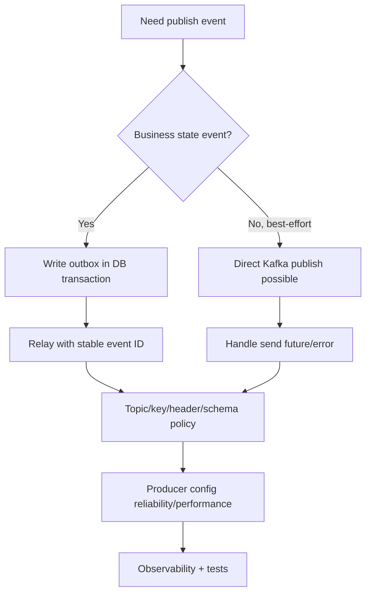

# Part 073 — Kafka Producer Implementation in Java and Spring Kafka

A Kafka producer is not just this:

```java
kafkaTemplate.send("case-events", event);
```

That line hides many production decisions:

- which topic?
- which key?
- which schema?
- which headers?
- which serializer?
- what happens if send fails?
- is the producer idempotent?
- what acknowledgement level is required?
- what retry behavior is enabled?
- are records batched?
- how is ordering preserved?
- how does this integrate with the database transaction?
- how is publish latency observed?
- how do we prevent missing events?
- how do consumers deduplicate duplicate publishes?
- how do we test the produced record?

A top-tier engineer treats producer code as a reliability boundary.

The producer is the first half of the event contract.

---

## 1. Producer Responsibility

Producer responsibilities:

```text
domain event -> event contract -> serialized broker record
```

A production producer owns:

- event type,
- topic,
- message key,
- payload schema,
- headers,
- event ID,
- correlation/causation,
- serialization,
- publish durability,
- error handling,
- metrics,
- logs,
- contract tests,
- outbox integration.

The producer should not be random code scattered across use cases.

Use a dedicated publisher boundary.

```java
public interface CaseEventPublisher {
    void publish(CaseDomainEvent event);
}
```

Infrastructure implementation:

```java
public final class KafkaCaseEventPublisher implements CaseEventPublisher {
    private final KafkaTemplate<String, CaseEventEnvelope> kafkaTemplate;
    private final CaseEventMapper mapper;
    private final CaseEventTopicPolicy topicPolicy;

    @Override
    public void publish(CaseDomainEvent event) {
        CaseEventEnvelope envelope = mapper.toEnvelope(event);
        ProducerRecord<String, CaseEventEnvelope> record =
            topicPolicy.toProducerRecord(envelope);

        kafkaTemplate.send(record);
    }
}
```

Business code should not manually build `ProducerRecord` everywhere.

---

## 2. Producer Boundary Architecture


Keep responsibilities separate:

| Component | Responsibility |
|---|---|
| Domain event | fact from domain model |
| Publisher port | application boundary |
| Mapper | domain event → event contract |
| Topic policy | topic/key/header selection |
| Serializer | contract → bytes |
| Kafka producer | broker publishing |
| Outbox relay | reliable publication after DB commit |

This separation makes testing and governance possible.

---

## 3. Do Not Publish Inside Domain Model

Bad:

```java
public final class CaseAggregate {
    private final KafkaTemplate<String, Object> kafkaTemplate;

    public void escalate(...) {
        // mutate state
        kafkaTemplate.send("case-events", event);
    }
}
```

Problems:

- domain depends on infrastructure,
- hard to test,
- dual-write risk,
- transaction boundary unclear,
- topic policy hidden,
- event mapping scattered.

Better:

```java
public final class CaseAggregate {
    private final List<DomainEvent> events = new ArrayList<>();

    public void escalate(...) {
        // mutate state
        events.add(new CaseEscalated(...));
    }

    public List<DomainEvent> pullEvents() {
        List<DomainEvent> copy = List.copyOf(events);
        events.clear();
        return copy;
    }
}
```

Application service persists state and records outbox/event messages.

---

## 4. Direct Publish vs Outbox Publish

Direct publish:

```java
kafkaTemplate.send(record);
```

Outbox publish:

```text
write outbox row in DB transaction
relay publishes later
```

Direct publish may be acceptable for:

- telemetry,
- non-critical analytics,
- cache invalidation where loss is tolerable,
- best-effort notifications,
- test/demo systems.

Outbox publish is preferred when:

- event reflects committed business state,
- consumers rely on event for correctness,
- missing event is unacceptable,
- saga/workflow depends on event,
- audit/projection/search must be reliable.

Production rule:

```text
If event represents durable business state, use outbox or equivalent.
```

---

## 5. KafkaTemplate Basics

Spring Kafka `KafkaTemplate` is the common producer abstraction.

Example:

```java
@Service
public final class KafkaCaseEventPublisher {
    private final KafkaTemplate<String, CaseEventEnvelope> kafkaTemplate;

    public CompletableFuture<SendResult<String, CaseEventEnvelope>> publish(
        CaseEventEnvelope envelope
    ) {
        ProducerRecord<String, CaseEventEnvelope> record =
            new ProducerRecord<>(
                "case-events",
                envelope.subjectId(),
                envelope
            );

        record.headers().add("event_type", envelope.type().getBytes(StandardCharsets.UTF_8));
        record.headers().add("event_id", envelope.id().getBytes(StandardCharsets.UTF_8));

        return kafkaTemplate.send(record);
    }
}
```

Do not ignore the returned future for critical direct publishes.

For outbox relay, the relay must wait for broker acknowledgement before marking row published.

---

## 6. Producer Record Anatomy

A Kafka record has:

- topic,
- partition optional,
- timestamp optional,
- key,
- value,
- headers.

```java
ProducerRecord<String, CaseEventEnvelope> record =
    new ProducerRecord<>(
        "case-events",
        null,
        envelope.occurredAt().toEpochMilli(),
        envelope.caseId(),
        envelope,
        headers
    );
```

Important:

| Field | Contract implication |
|---|---|
| topic | event family / routing |
| key | partitioning and ordering |
| value | payload |
| headers | metadata |
| timestamp | event or producer timestamp depending policy |
| partition | rarely set manually; can override partitioner |

Prefer explicit key.

Avoid manually setting partition unless you have a strong reason.

---

## 7. Key Strategy

Key should be produced by policy.

```java
public interface KafkaKeyStrategy<T> {
    String keyFor(T event);
}
```

Example:

```java
public final class CaseEventKeyStrategy implements KafkaKeyStrategy<CaseEventEnvelope> {
    @Override
    public String keyFor(CaseEventEnvelope event) {
        return event.subjectId(); // caseId
    }
}
```

Validate:

```java
String key = keyStrategy.keyFor(envelope);

if (key == null || key.isBlank()) {
    throw new InvalidKafkaRecordException("case-events requires non-empty caseId key");
}
```

Producer key mistakes break ordering.

Make them fail fast.

---

## 8. Header Strategy

Headers should be consistent.

Example:

```java
public final class EventHeaders {
    public static final String EVENT_ID = "event_id";
    public static final String EVENT_TYPE = "event_type";
    public static final String EVENT_VERSION = "event_version";
    public static final String CORRELATION_ID = "correlation_id";
    public static final String CAUSATION_ID = "causation_id";
    public static final String PRODUCER = "producer";
    public static final String SCHEMA_ID = "schema_id";
}
```

Add headers:

```java
private Headers headersFor(CaseEventEnvelope envelope) {
    RecordHeaders headers = new RecordHeaders();

    put(headers, EventHeaders.EVENT_ID, envelope.id());
    put(headers, EventHeaders.EVENT_TYPE, envelope.type());
    put(headers, EventHeaders.EVENT_VERSION, Integer.toString(envelope.version()));
    put(headers, EventHeaders.CORRELATION_ID, envelope.correlationId());
    put(headers, EventHeaders.CAUSATION_ID, envelope.causationId());
    put(headers, EventHeaders.PRODUCER, "case-service");

    return headers;
}

private static void put(Headers headers, String key, String value) {
    if (value != null) {
        headers.add(key, value.getBytes(StandardCharsets.UTF_8));
    }
}
```

Do not put secrets in headers.

Headers are often visible to many tools.

---

## 9. Event Envelope

Example Java record:

```java
public record CaseEventEnvelope(
    String id,
    String source,
    String type,
    int version,
    String subjectId,
    Instant occurredAt,
    String correlationId,
    String causationId,
    long aggregateVersion,
    Object data
) {}
```

This is similar in spirit to CloudEvents.

You can use CloudEvents libraries or your own standardized envelope.

The important thing is consistency.

Every event should have:

- stable event ID,
- source,
- type,
- version/schema,
- subject/resource,
- occurrence time,
- correlation/causation,
- payload.

---

## 10. Serialization Choices

Common producer serialization choices:

| Format | Producer implication |
|---|---|
| JSON | easy to inspect, larger, needs schema discipline |
| JSON Schema | validation and compatibility |
| Avro | schema registry friendly, compact |
| Protobuf | compact, generated code |
| CloudEvents JSON | standardized envelope |
| CloudEvents binary mode | metadata in headers, data as payload |

Do not serialize Java objects with Java native serialization.

Kafka records are integration contracts.

Use explicit, language-neutral formats.

---

## 11. Producer Config: Reliability Baseline

Key Kafka producer configurations:

```properties
acks=all
enable.idempotence=true
retries=2147483647
delivery.timeout.ms=120000
request.timeout.ms=30000
max.in.flight.requests.per.connection=5
```

Meaning:

| Config | Meaning |
|---|---|
| `acks=all` | wait for all in-sync replicas according to broker settings |
| `enable.idempotence=true` | producer retries do not create duplicates within idempotent producer scope |
| `retries` | allow retry of transient send failures |
| `delivery.timeout.ms` | upper bound for record delivery |
| `request.timeout.ms` | broker request timeout |
| `max.in.flight.requests.per.connection` | affects ordering with retries/idempotence |

Exact values depend on Kafka version and platform defaults.

But the principle is stable:

```text
critical events need strong broker acknowledgement and idempotent producer behavior
```

Do not use defaults blindly for business-critical publishing.

---

## 12. Idempotent Producer

Kafka idempotent producer prevents duplicate records caused by producer retries within its guarantee scope.

It uses producer IDs and sequence numbers.

Benefits:

- safer retries,
- reduced duplicate publish from transient broker errors,
- better ordering behavior with configured in-flight requests.

Limits:

- does not solve database + broker dual-write,
- does not deduplicate application-generated duplicate events,
- does not make consumers idempotent,
- does not prevent duplicate outbox relay publish after crash before mark-published,
- does not make external side effects exactly once.

Use idempotent producer.

Still use outbox and idempotent consumers where required.

---

## 13. Acknowledgement Level

`acks` controls broker acknowledgement.

Common values:

| `acks` | Meaning |
|---|---|
| `0` | producer does not wait |
| `1` | leader acknowledges |
| `all` / `-1` | all in-sync replicas acknowledge according to broker config |

For critical events:

```text
acks=all
```

But `acks=all` alone is not enough.

Broker topic replication and `min.insync.replicas` matter.

Producer reliability is producer + broker topic configuration.

A producer cannot compensate for a badly configured topic.

---

## 14. Delivery Timeout

`delivery.timeout.ms` bounds how long producer will try to deliver a record.

If exceeded, send fails.

This matters for outbox relay:

```text
relay should not mark row published if delivery timeout occurs
```

For direct publish:

```text
application must decide whether failure means command fails or event is best-effort
```

If a business transaction already committed and direct publish fails, you have missing event risk.

That is why outbox exists.

---

## 15. Batching and Linger

Producer performance config:

```properties
batch.size=32768
linger.ms=5
compression.type=zstd
```

Trade-off:

| Config | Effect |
|---|---|
| `batch.size` | max batch bytes per partition |
| `linger.ms` | wait briefly to batch more records |
| `compression.type` | reduce bytes, increase CPU |
| `buffer.memory` | producer memory buffer |

Higher batching improves throughput.

It may add latency.

For user-facing command events, small linger may be fine.

For analytics high-throughput events, larger batching may be good.

Measure.

Do not copy performance configs from unrelated workloads.

---

## 16. Compression

Compression can reduce broker/network cost.

Options depend on platform:

```properties
compression.type=none
compression.type=gzip
compression.type=snappy
compression.type=lz4
compression.type=zstd
```

Choose based on:

- payload size,
- CPU budget,
- broker support,
- consumer support,
- latency sensitivity,
- network cost.

For small events, compression may not help.

For large JSON events, it often helps.

Benchmark with real payloads.

---

## 17. Producer Buffering and Backpressure

If broker is slow/unavailable, producer buffers records.

Eventually `send()` can block or fail depending config and buffer exhaustion.

Watch:

```text
buffer.memory
max.block.ms
delivery.timeout.ms
record-error-rate
record-retry-rate
buffer-available-bytes
```

Application policy:

- fail fast for direct critical publish?
- rely on outbox backlog for durable events?
- shed optional telemetry?
- throttle producers?
- alert on outbox pending age?

Backpressure must be explicit.

---

## 18. Outbox Relay Producer

Outbox relay publish must:

1. read pending outbox rows,
2. map row to `ProducerRecord`,
3. send to Kafka,
4. wait for broker ack,
5. mark row published,
6. retry failure without changing event ID.

Example:

```java
public final class OutboxKafkaRelay {
    private final OutboxRepository outboxRepository;
    private final KafkaTemplate<String, byte[]> kafkaTemplate;

    public void publishBatch() {
        List<OutboxMessage> batch = outboxRepository.claimPending(100);

        for (OutboxMessage message : batch) {
            publishOne(message);
        }
    }

    private void publishOne(OutboxMessage message) {
        ProducerRecord<String, byte[]> record = toRecord(message);

        try {
            kafkaTemplate.send(record).get(30, TimeUnit.SECONDS);
            outboxRepository.markPublished(message.id());
        } catch (Exception ex) {
            outboxRepository.markPublishFailed(message.id(), ex);
        }
    }
}
```

This is simple but blocks per record.

You can optimize with async sends and controlled concurrency.

Correctness first, optimization second.

---

## 19. Async Relay With Controlled Concurrency

```java
public void publishBatchAsync() {
    List<OutboxMessage> batch = outboxRepository.claimPending(100);

    List<CompletableFuture<Void>> futures = batch.stream()
        .map(message -> kafkaTemplate.send(toRecord(message))
            .thenAccept(result -> outboxRepository.markPublished(message.id()))
            .exceptionally(error -> {
                outboxRepository.markPublishFailed(message.id(), error);
                return null;
            }))
        .toList();

    CompletableFuture.allOf(futures.toArray(new CompletableFuture[0])).join();
}
```

Risks:

- too many concurrent sends,
- ordering per aggregate,
- DB update storm,
- partial failures,
- shutdown in middle.

Use bounded concurrency.

Preserve ordering where required.

---

## 20. Producer Transactions

Kafka supports producer transactions for atomic writes to multiple Kafka partitions/topics and offset commits in stream-processing patterns.

This can be useful for Kafka-to-Kafka pipelines.

But producer transactions do not solve:

```text
database write + Kafka publish
```

unless your architecture includes a carefully designed transaction integration.

For typical Java microservice with PostgreSQL + Kafka:

```text
use database transaction + outbox
```

rather than trying to make DB and Kafka one distributed transaction.

Kafka transactions are powerful, but scope matters.

---

## 21. Topic Policy Object

Create explicit topic policy.

```java
public record TopicPolicy(
    String topic,
    boolean keyRequired,
    String keyField,
    String compatibilityMode,
    int eventMajorVersion
) {}
```

Mapper:

```java
public ProducerRecord<String, CaseEventEnvelope> toRecord(CaseEventEnvelope envelope) {
    String key = envelope.subjectId();

    if (key == null || key.isBlank()) {
        throw new InvalidMessageKeyException("case-events key is required");
    }

    return new ProducerRecord<>(
        "case-events",
        key,
        envelope
    );
}
```

Topic policy should be testable.

---

## 22. Producer Interceptors

Kafka producer interceptors can observe or mutate records before send and after acknowledgement.

Use carefully.

Good uses:

- add standard headers,
- metrics,
- tracing,
- policy validation,
- redaction checks.

Avoid:

- hidden business logic,
- changing event type,
- changing key,
- adding required fields invisibly,
- expensive blocking operations.

Interceptors are cross-cutting.

Contracts should still be visible in code and tests.

---

## 23. Tracing

Producer should propagate trace/correlation context.

Headers:

```text
traceparent
tracestate
correlation_id
causation_id
```

OpenTelemetry instrumentation may handle trace headers.

Application should ensure business correlation/causation IDs exist.

Do not rely on trace ID alone for business process correlation because traces may be sampled.

---

## 24. Observability

Producer metrics:

```text
producer.records.sent.total{topic,event_type,status}
producer.send.duration{topic,event_type}
producer.send.failures.total{topic,event_type,reason}
producer.record.size.bytes{topic,event_type}
producer.serialization.failures.total{topic,event_type}
producer.null_key.total{topic,event_type}
producer.retry.total{topic,event_type}
producer.buffer.exhausted.total{producer}
outbox.rows.created.total{event_type}
outbox.pending.count
outbox.oldest_pending_age.seconds
outbox.publish.failures.total{reason}
```

Logs:

- publish failure,
- invalid key,
- serialization failure,
- outbox relay failure,
- schema registry failure,
- topic missing/authorization failure,
- event contract validation failure.

Do not log full payload by default.

---

## 25. Alerts

Useful producer alerts:

| Alert | Meaning |
|---|---|
| send failure spike | broker/network/auth/schema issue |
| serialization failure > 0 | producer contract bug |
| null key on keyed topic | ordering bug |
| outbox pending age high | event publication delayed |
| outbox pending count high | broker/relay issue |
| producer buffer exhaustion | broker slow/down or producer overload |
| unauthorized topic error | ACL/config issue |
| record too large | schema/payload bug |
| schema registry failures | producer cannot serialize/register |

Producer alerts should route to event owner.

---

## 26. Testing Producer Contract

Test produced record.

```java
@Test
void publishesCaseEscalatedWithCorrectTopicKeyAndHeaders() {
    CaseEscalated event = new CaseEscalated(
        new EventId("evt-123"),
        new CaseId("CASE-100"),
        new EscalationId("ESC-900"),
        42L
    );

    ProducerRecord<String, CaseEventEnvelope> record =
        topicPolicy.toRecord(mapper.toEnvelope(event));

    assertThat(record.topic()).isEqualTo("case-events");
    assertThat(record.key()).isEqualTo("CASE-100");
    assertThat(header(record, "event_id")).isEqualTo("evt-123");
    assertThat(header(record, "event_type")).isEqualTo("com.example.case.CaseEscalated.v1");
}
```

This catches many integration bugs before broker tests.

---

## 27. Testing Serialization

Use real serializer.

```java
@Test
void serializedEventCanBeDeserializedByConsumerSchema() {
    CaseEventEnvelope envelope = fixtureEnvelope();

    byte[] bytes = serializer.serialize("case-events", envelope);

    CaseEventEnvelope decoded = deserializer.deserialize("case-events", bytes);

    assertThat(decoded.id()).isEqualTo(envelope.id());
}
```

For schema registry, use test registry/mock registry where appropriate.

Serialization is part of contract.

---

## 28. Embedded Kafka / Testcontainers

Use integration tests for:

- actual Kafka producer config,
- topic creation,
- serializer/deserializer,
- headers,
- key,
- send failures,
- retry behavior,
- record too large,
- transaction/idempotence where needed.

Testcontainers with Kafka is common for realistic integration tests.

Embedded broker can be useful for fast Spring tests.

Do not test all logic only with mocks.

---

## 29. Outbox Transaction Test

```java
@Test
void businessCommitCreatesOutboxRow() {
    useCase.createEscalation(command);

    List<OutboxMessage> rows = outboxRepository.findPending();

    assertThat(rows).hasSize(1);
    assertThat(rows.get(0).aggregateId()).isEqualTo("CASE-100");
    assertThat(rows.get(0).messageKey()).isEqualTo("CASE-100");
}
```

Rollback test:

```java
@Test
void rollbackDoesNotCreateOutboxRow() {
    assertThatThrownBy(() -> useCase.createEscalation(invalidCommand))
        .isInstanceOf(DomainException.class);

    assertThat(outboxRepository.findAll()).isEmpty();
}
```

This proves the main outbox invariant.

---

## 30. Producer Failure Test

```java
@Test
void relayDoesNotMarkPublishedWhenKafkaSendFails() {
    OutboxMessage message = outboxRepository.insert(pendingMessage("evt-123"));

    kafkaBroker.failSends();

    relay.publishBatch();

    OutboxMessage updated = outboxRepository.get(message.id());

    assertThat(updated.status()).isEqualTo(OutboxStatus.FAILED_RETRYABLE);
    assertThat(updated.publishedAt()).isNull();
}
```

Never mark published before broker ack.

---

## 31. Production Producer Configuration Template

```yaml
kafkaProducer:
  service: case-service

  defaults:
    acks: all
    enableIdempotence: true
    retries: 2147483647
    deliveryTimeoutMs: 120000
    requestTimeoutMs: 30000
    maxInFlightRequestsPerConnection: 5
    lingerMs: 5
    batchSizeBytes: 32768
    compressionType: zstd

  topics:
    case-events:
      owner: case-platform
      key:
        field: caseId
        required: true
      schema:
        format: json-schema
        compatibility: full-transitive
      publishing:
        mode: outbox
        directPublishAllowed: false
      observability:
        nullKeyAlert: true
        serializationFailureAlert: true
        outboxPendingAgeSecondsAlert: 60
```

Configuration should be reviewed like code.

---

## 32. Common Anti-Patterns

### 32.1 `kafkaTemplate.send()` everywhere

No governance, no key consistency, no testing.

### 32.2 Direct publish after DB commit

Dual-write missing-event risk.

### 32.3 Null key for ordered event

Ordering breaks.

### 32.4 New event ID on relay retry

Consumer dedup breaks.

### 32.5 Ignoring send future for critical direct publish

Failures disappear.

### 32.6 Marking outbox row published before broker ack

Message loss.

### 32.7 Logging full event payload

Privacy/security risk.

### 32.8 Producer config copied blindly

Wrong latency/reliability trade-offs.

### 32.9 Schema registry error treated as transient forever

Poison producer loop.

### 32.10 No producer contract tests

Topic/key/header drift reaches production.

---

## 33. Decision Model



Producer design starts with event criticality.

---

## 34. Design Checklist

Before shipping a Kafka producer:

- Is publish direct or outbox?
- If business event, is outbox used?
- Is topic policy explicit?
- Is key required and tested?
- Is event ID stable?
- Are headers standardized?
- Is schema registered/validated?
- Is serializer tested?
- Is producer idempotence enabled?
- Is `acks` appropriate?
- Are retries bounded by delivery timeout?
- Is batching/linger measured?
- Is compression measured?
- Are send failures observed?
- Does relay mark published only after ack?
- Are duplicate publishes safe?
- Are producer metrics/alerts configured?
- Are contract tests written?
- Is payload logging safe?

---

## 35. The Real Lesson

Kafka producer code is not plumbing.

It is where your domain facts become durable integration contracts.

A production-grade producer guarantees:

```text
correct event
+ correct topic
+ correct key
+ correct schema
+ correct headers
+ durable publish path
+ stable identity
+ observable failure
```

If the producer is sloppy, every consumer pays.

Get producer design right first.

---

## References

- Apache Kafka Producer Configs: https://kafka.apache.org/41/configuration/producer-configs/
- Apache Kafka Documentation: https://kafka.apache.org/documentation/
- Spring Kafka Reference — Sending Messages: https://docs.spring.io/spring-kafka/reference/kafka/sending-messages.html
- Spring Kafka Reference — KafkaTemplate: https://docs.spring.io/spring-kafka/reference/kafka/sending-messages.html#kafkatemplate
- Microservices.io — Transactional Outbox Pattern: https://microservices.io/patterns/data/transactional-outbox.html
- CloudEvents Specification: https://github.com/cloudevents/spec
