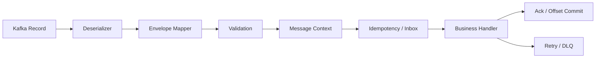
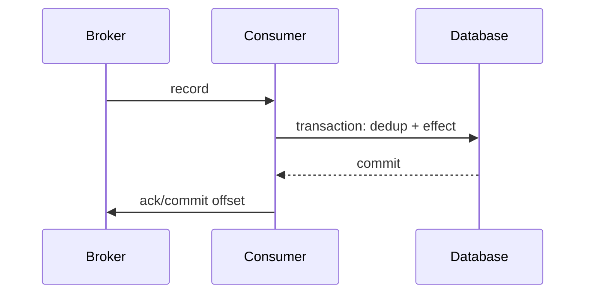
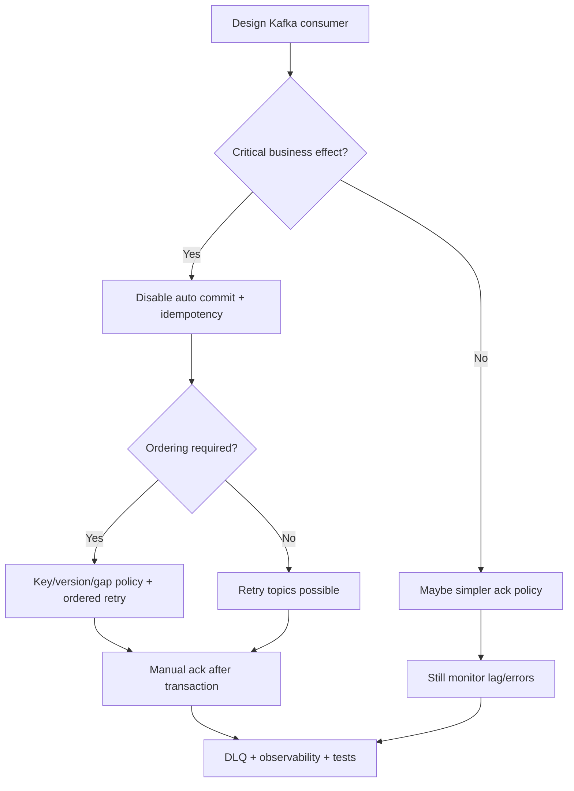

# Part 074 — Kafka Consumer Implementation in Java and Spring Kafka

A Kafka consumer is not just this:

```java
@KafkaListener(topics = "case-events")
public void onMessage(CaseEvent event) {
    handler.handle(event);
}
```

That annotation hides many production questions:

- which consumer group?
- what is offset commit strategy?
- is auto-commit disabled?
- is processing idempotent?
- what happens on deserialization failure?
- what happens on retryable exception?
- what happens on poison message?
- how is ordering preserved?
- how does concurrency affect partition ownership?
- does the listener ack before or after the database transaction?
- how are duplicate messages handled?
- how are rebalances handled?
- how is lag monitored?
- how is graceful shutdown performed?

A consumer is not only message handling code.

It is a correctness boundary.

---

## 1. Consumer Responsibility

Consumer responsibilities:

```text
broker record -> validated message -> idempotent business effect -> safe offset/ack
```

A production consumer owns:

- topic subscription,
- consumer group identity,
- deserialization,
- schema/version validation,
- header extraction,
- context creation,
- idempotency,
- business handling,
- retry/DLQ classification,
- offset/ack timing,
- ordering,
- lag monitoring,
- graceful shutdown,
- replay behavior.

Do not bury all of this inside one listener method.

---

## 2. Consumer Architecture



Suggested Java package:

```text
com.example.case.consumer
  CaseEventsKafkaListener.java
  CaseEventDispatcher.java
  CaseEventMapper.java
  CaseEventValidator.java
  CaseEventHandlers.java
  ProcessedMessageRepository.java
  ConsumerFailureClassifier.java
```

Keep broker mechanics separate from business handler.

---

## 3. Spring Kafka Listener Basics

Example:

```java
@Component
public final class CaseEventsKafkaListener {
    private final CaseEventConsumerService consumerService;

    @KafkaListener(
        topics = "case-events",
        groupId = "search-indexer",
        containerFactory = "caseEventsListenerContainerFactory"
    )
    public void onMessage(
        ConsumerRecord<String, byte[]> record,
        Acknowledgment acknowledgment
    ) {
        consumerService.consume(record);
        acknowledgment.acknowledge();
    }
}
```

Manual acknowledgment requires appropriate container ack mode.

Do not include `Acknowledgment` parameter unless the listener container is configured for manual ack.

---

## 4. Consumer Group

Consumer group identity is part of contract.

```yaml
consumer:
  groupId: search-indexer
  topic: case-events
```

Rules:

- one logical consumer application = one stable group ID,
- do not randomize group ID in production,
- replay/backfill should use separate group ID,
- changing group ID can reprocess history,
- group ID must be owned and documented.

Bad:

```text
groupId = service-name-${random.uuid}
```

This creates new consumer group every start and may replay unexpectedly.

---

## 5. Auto Commit vs Manual Commit

Kafka consumer has `enable.auto.commit`.

If enabled, offsets are committed automatically at intervals.

This is dangerous for many business consumers because commit may happen before processing effect is durably complete.

Production default for critical consumers:

```properties
enable.auto.commit=false
```

Then framework/container controls commit after listener success or manual ack.

Spring Kafka containers support ack modes when auto commit is false.

Use manual ack when you need explicit control:

```java
acknowledgment.acknowledge();
```

after the local transaction/effect is safe.

---

## 6. Ack Timing

Ack means:

```text
I do not need this record redelivered from this offset
```

Ack too early:

```text
message loss if processing later fails
```

Ack too late:

```text
duplicate delivery if processing succeeded but ack failed
```

Correct baseline:

```text
process idempotently
commit local transaction
ack
```

Crash after commit before ack:

```text
redelivery occurs
idempotency skips duplicate
```

This is safe.

---

## 7. Listener Transaction Boundary

Example:

```java
@Component
public final class CaseEventConsumerService {
    private final TransactionTemplate transactionTemplate;
    private final ProcessedMessageRepository processedMessages;
    private final CaseProjectionHandler handler;

    public void consume(ConsumerRecord<String, byte[]> record) {
        EventEnvelope envelope = deserialize(record);

        transactionTemplate.executeWithoutResult(tx -> {
            boolean first = processedMessages.tryInsert(
                "search-indexer",
                envelope.id()
            );

            if (!first) {
                return;
            }

            handler.handle(envelope);
            processedMessages.markCompleted("search-indexer", envelope.id());
        });
    }
}
```

Listener:

```java
public void onMessage(ConsumerRecord<String, byte[]> record, Acknowledgment ack) {
    consumerService.consume(record);
    ack.acknowledge();
}
```

If process fails, ack is not called and error handler decides retry/DLQ.

---

## 8. Message Context

Build a context from record metadata.

```java
public record KafkaMessageContext(
    String topic,
    int partition,
    long offset,
    String key,
    Instant recordTimestamp,
    String consumerGroup,
    Map<String, String> headers,
    int deliveryAttempt
) {}
```

Create:

```java
KafkaMessageContext context = new KafkaMessageContext(
    record.topic(),
    record.partition(),
    record.offset(),
    record.key(),
    Instant.ofEpochMilli(record.timestamp()),
    "search-indexer",
    extractHeaders(record.headers()),
    deliveryAttempt(record.headers())
);
```

Context is used for:

- logs,
- metrics,
- idempotency,
- DLQ,
- replay,
- debugging,
- ordering.

Do not pass raw `ConsumerRecord` deep into domain logic.

---

## 9. Deserialization Boundary

Deserializer converts bytes into event envelope.

Potential failures:

- invalid bytes,
- schema registry unavailable,
- incompatible schema,
- unknown event type,
- unsupported version,
- invalid JSON.

Handle deserialization separately from business handling.

```java
public EventEnvelope deserialize(ConsumerRecord<String, byte[]> record) {
    try {
        return serializer.deserialize(record.value(), record.headers());
    } catch (Exception ex) {
        throw new EventDeserializationException(record.topic(), record.partition(), record.offset(), ex);
    }
}
```

Framework-level deserialization exceptions may occur before listener gets the record.

Configure error handling for those too.

---

## 10. Validation

After deserialization, validate contract.

```java
public void validate(EventEnvelope envelope) {
    requireNonBlank(envelope.id(), "event id");
    requireNonBlank(envelope.type(), "event type");
    requireNonBlank(envelope.source(), "source");
    requireNonBlank(envelope.subject(), "subject");

    if (!supportedTypes.contains(envelope.type())) {
        throw new UnsupportedEventTypeException(envelope.type());
    }
}
```

Validation failures are usually non-retryable unless deployment/schema support is expected soon.

Classify them.

---

## 11. Dispatcher

One topic can contain many event types.

Use dispatcher.

```java
public final class CaseEventDispatcher {
    private final Map<String, EventHandler<?>> handlers;

    public void dispatch(EventEnvelope envelope, KafkaMessageContext context) {
        EventHandler handler = handlers.get(envelope.type());

        if (handler == null) {
            throw new UnsupportedEventTypeException(envelope.type());
        }

        handler.handle(envelope.data(), context);
    }
}
```

Handlers should be small and tested with fixtures.

---

## 12. Idempotency

Consumer must be duplicate-safe.

For projection:

```java
if (event.aggregateVersion() <= current.version()) {
    return;
}
```

For side effects:

```java
if (!processedMessages.tryInsert(consumerName, event.id())) {
    return;
}
```

For external provider:

```java
emailProvider.send(request, idempotencyKey(event.id()));
```

Choose strategy based on effect.

Do not assume Kafka or Spring prevents duplicates.

---

## 13. Offset and Idempotency Together

Safe at-least-once pattern:



If crash after DB commit before ack:

```text
record redelivered
dedup prevents duplicate effect
ack succeeds later
```

This is the standard reliable consumer pattern.

---

## 14. Listener Container Factory

Spring Kafka container factory example:

```java
@Bean
ConcurrentKafkaListenerContainerFactory<String, byte[]> caseEventsListenerContainerFactory(
    ConsumerFactory<String, byte[]> consumerFactory,
    DefaultErrorHandler errorHandler
) {
    ConcurrentKafkaListenerContainerFactory<String, byte[]> factory =
        new ConcurrentKafkaListenerContainerFactory<>();

    factory.setConsumerFactory(consumerFactory);
    factory.setConcurrency(6);
    factory.setCommonErrorHandler(errorHandler);

    factory.getContainerProperties().setAckMode(ContainerProperties.AckMode.MANUAL);

    return factory;
}
```

Concurrency must be aligned with topic partitions and handler capacity.

Manual ack must be used intentionally.

---

## 15. Consumer Config Baseline

Important consumer configs:

```properties
enable.auto.commit=false
auto.offset.reset=earliest
max.poll.records=100
max.poll.interval.ms=300000
session.timeout.ms=45000
heartbeat.interval.ms=15000
fetch.min.bytes=1
fetch.max.wait.ms=500
isolation.level=read_committed
```

Meaning:

| Config | Meaning |
|---|---|
| `enable.auto.commit` | whether offsets auto commit |
| `auto.offset.reset` | where to start when no offset |
| `max.poll.records` | records per poll |
| `max.poll.interval.ms` | max time between polls before considered failed |
| `session.timeout.ms` | consumer liveness timeout |
| `heartbeat.interval.ms` | heartbeat frequency |
| `isolation.level` | read committed transactional records if needed |

Exact values depend on workload.

But critical consumers usually disable auto commit.

---

## 16. `auto.offset.reset`

`auto.offset.reset` applies when there is no committed offset.

Values commonly include:

- earliest,
- latest,
- none.

Production implication:

| Value | Risk |
|---|---|
| earliest | new group may process old history |
| latest | new group may skip old messages |
| none | fail if no offset |

For normal live consumers, choose deliberately.

For replay/backfill groups, use explicit offset/time control rather than accidental reset.

Changing group ID plus `earliest` can trigger huge replay.

---

## 17. `max.poll.records`

`max.poll.records` controls max records returned per poll.

Large batch:

- better throughput,
- more memory,
- longer processing,
- higher risk of exceeding `max.poll.interval.ms`,
- harder per-record error handling.

Small batch:

- lower latency,
- easier error handling,
- more polling overhead.

Tune based on handler cost and ack strategy.

Do not process 500 records with slow DB calls and default poll interval without measuring.

---

## 18. `max.poll.interval.ms`

If listener processing takes too long between polls, broker may consider consumer failed and rebalance.

This can cause duplicate processing.

Mitigations:

- reduce `max.poll.records`,
- increase `max.poll.interval.ms`,
- optimize handler,
- pause partitions,
- move long work to durable async workflow,
- avoid huge blocking retries,
- use batch processing carefully.

Long processing in consumer thread is a rebalancing risk.

---

## 19. Concurrency

Spring Kafka container concurrency creates multiple consumer threads.

```java
factory.setConcurrency(6);
```

Effective concurrency is bounded by partitions.

If topic has 3 partitions and concurrency 6:

```text
only 3 consumers actively assigned
```

Concurrency also increases downstream load.

Do not set high concurrency without:

- DB pool capacity,
- external dependency limits,
- idempotency,
- partition count,
- CPU/memory analysis,
- ordering requirements.

---

## 20. Batch Listener

Batch listener:

```java
@KafkaListener(topics = "case-events", containerFactory = "batchFactory")
public void onBatch(
    List<ConsumerRecord<String, byte[]>> records,
    Acknowledgment ack
) {
    consumerService.consumeBatch(records);
    ack.acknowledge();
}
```

Pros:

- throughput,
- fewer transactions if batched,
- efficient DB writes.

Cons:

- partial failure complexity,
- offset commit complexity,
- ordering/skip policy,
- memory,
- retry/DLQ harder.

Use batch when throughput requires it and failure semantics are designed.

---

## 21. Partial Batch Failure

Batch:

```text
records 10,11,12,13
record 12 fails
```

Options:

- fail whole batch and retry all,
- process independently and commit only contiguous success,
- send 12 to DLQ and commit through 13 if ordering safe,
- stop at 12 to preserve order.

No universal answer.

Batching must not hide correctness.

If per-key ordering matters, partial success must be treated carefully.

---

## 22. Error Handler

A common Spring Kafka error handler routes failures to retry/DLT.

Conceptual:

```java
@Bean
DefaultErrorHandler errorHandler(KafkaTemplate<Object, Object> template) {
    DeadLetterPublishingRecoverer recoverer =
        new DeadLetterPublishingRecoverer(template);

    ExponentialBackOffWithMaxRetries backOff =
        new ExponentialBackOffWithMaxRetries(3);

    DefaultErrorHandler handler =
        new DefaultErrorHandler(recoverer, backOff);

    handler.addNotRetryableExceptions(
        EventDeserializationException.class,
        UnsupportedEventTypeException.class,
        InvalidEventSchemaException.class
    );

    return handler;
}
```

Framework error handler should reflect your failure classifier.

Do not use default exception handling without understanding offset behavior.

---

## 23. Non-Blocking Retry Consumer

With retry topics:

```java
@RetryableTopic(
    attempts = "5",
    backoff = @Backoff(delay = 1000, multiplier = 2.0),
    dltTopicSuffix = ".dlt"
)
@KafkaListener(topics = "case-events", groupId = "notification-service")
public void onCaseEvent(ConsumerRecord<String, byte[]> record) {
    consumerService.consume(record);
}

@DltHandler
public void onDlt(ConsumerRecord<String, byte[]> record) {
    deadLetterService.handle(record);
}
```

Good for side-effecting or independent consumers where ordering is less strict.

Dangerous for strict ordered projections unless sequence/gap policy exists.

---

## 24. Rebalance Handling

Rebalance can revoke partitions while processing.

Consumer must avoid committing offsets for unfinished work.

Spring Kafka manages many details, but application behavior still matters.

For advanced cases, use rebalance listeners or container events.

Important rules:

- keep processing time within poll interval,
- commit only completed work,
- stop gracefully on shutdown,
- avoid async processing without offset tracking,
- monitor rebalances.

Frequent rebalances indicate instability.

---

## 25. Pause and Resume

Spring Kafka containers can pause/resume.

Use cases:

- downstream outage,
- retry storm,
- manual remediation,
- backpressure,
- deployment drain.

Pause should be visible.

```java
registry.getListenerContainer("caseEventsListener")
    .pause();
```

Operational pause must have:

- reason,
- owner,
- alert suppression/adjustment,
- resume plan,
- maximum pause duration.

Silent pause is outage.

---

## 26. Graceful Shutdown

Shutdown sequence:

1. stop accepting new records,
2. finish in-flight processing within grace period,
3. commit/ack completed work,
4. do not ack incomplete work,
5. release resources,
6. allow redelivery after restart.

Kubernetes termination must allow enough time.

Avoid abrupt kill during large batch or long handler.

Consumer should be safe under crash anyway, but graceful shutdown reduces duplicates and lag.

---

## 27. Consumer Thread Safety

Listener method may be called concurrently if concurrency > 1.

Do not use unsafe mutable shared state.

Bad:

```java
private final List<Event> buffer = new ArrayList<>();
```

without synchronization.

Use:

- thread-safe collaborators,
- stateless handlers,
- database transactions,
- per-partition state carefully guarded,
- local variables,
- immutable events.

Consumer concurrency bugs are subtle.

---

## 28. Backpressure

If handler cannot keep up:

- lag grows,
- retries increase,
- memory grows,
- poll interval exceeded,
- downstream overload.

Backpressure options:

- reduce concurrency,
- pause partitions,
- lower `max.poll.records`,
- bulkhead downstream calls,
- throttle replay,
- shed optional processing,
- scale partitions/consumers,
- optimize handler,
- move slow step to async workflow.

Do not blindly increase concurrency.

That can overload DB and worsen lag.

---

## 29. Observability

Consumer metrics:

```text
consumer.records.received.total{topic,group,event_type}
consumer.records.processed.total{topic,group,event_type,outcome}
consumer.processing.duration{topic,group,event_type}
consumer.lag{topic,group,partition}
consumer.duplicates.total{topic,group,event_type}
consumer.acks.total{topic,group,status}
consumer.offset.commits.total{topic,group,status}
consumer.rebalances.total{topic,group}
consumer.deserialization.failures.total{topic,group}
consumer.retry.total{topic,group,reason}
consumer.dlt.total{topic,group,reason}
consumer.paused{topic,group}
```

Logs:

- partition assignment/revocation,
- deserialization failure,
- duplicate skipped,
- sequence gap,
- retry scheduled,
- DLQ publish,
- pause/resume,
- shutdown drain.

No payload logs by default.

---

## 30. Alerting

Useful alerts:

| Alert | Meaning |
|---|---|
| lag high | consumer cannot keep up |
| oldest lag age high | stale projection/workflow |
| deserialization failures | schema break |
| DLQ > 0 | terminal processing failure |
| duplicate spike | producer/retry/rebalance issue |
| rebalances frequent | instability/poll interval issue |
| processing p99 high | handler/downstream slow |
| paused too long | manual intervention needed |
| offset commit failures | progress not durable |
| no messages consumed but producer active | subscription/config issue |

Alert by consumer group and topic.

---

## 31. Testing Consumer

Minimum tests:

| Scenario | Expected |
|---|---|
| valid record | processed and acked |
| duplicate record | skipped and acked |
| invalid schema | DLQ/non-retry |
| retryable dependency failure | retry/no ack |
| terminal failure | DLQ then ack |
| sequence gap | park/no unsafe apply |
| old event | ignore and ack |
| deserialization failure | routed to DLQ/error handler |
| batch partial failure | correct commit behavior |
| rebalance/shutdown | unfinished not committed |

Consumer correctness tests should verify ack behavior.

---

## 32. Unit Test With Fake Acknowledgment

```java
final class TestAcknowledgment implements Acknowledgment {
    private boolean acknowledged;

    @Override
    public void acknowledge() {
        this.acknowledged = true;
    }

    boolean acknowledged() {
        return acknowledged;
    }
}
```

Test:

```java
@Test
void acknowledgesAfterSuccessfulProcessing() {
    TestAcknowledgment ack = new TestAcknowledgment();

    listener.onMessage(validRecord(), ack);

    assertThat(ack.acknowledged()).isTrue();
}
```

Test failure:

```java
@Test
void doesNotAcknowledgeWhenProcessingFails() {
    handler.failWith(new DependencyUnavailableException());

    TestAcknowledgment ack = new TestAcknowledgment();

    assertThatThrownBy(() -> listener.onMessage(validRecord(), ack))
        .isInstanceOf(DependencyUnavailableException.class);

    assertThat(ack.acknowledged()).isFalse();
}
```

---

## 33. Integration Test With Kafka

Use Testcontainers or embedded Kafka.

Test:

- real serialization,
- listener container,
- group ID,
- ack/commit,
- retry/DLT,
- concurrency,
- headers,
- key,
- lag behavior.

Example intent:

```java
@Test
void consumesRecordAndUpdatesProjection() {
    kafkaTemplate.send("case-events", "CASE-100", caseEscalatedBytes());

    await().untilAsserted(() -> {
        CaseReadModel projection = repository.get("CASE-100");
        assertThat(projection.status()).isEqualTo("ESCALATED");
    });
}
```

Integration tests catch config mistakes mocks miss.

---

## 34. Rebalance and Long Processing Test

For high-risk consumers, test long processing.

Scenarios:

- handler exceeds `max.poll.interval.ms`,
- consumer shuts down while processing,
- partition revoked,
- duplicate redelivery occurs,
- idempotency prevents duplicate effect.

These may be environment/integration tests.

They are worth it for critical consumers.

---

## 35. Production Consumer Configuration Template

```yaml
kafkaConsumer:
  consumers:
    search-indexer:
      topic: case-events
      groupId: search-indexer
      autoCommit: false
      ackMode: manual
      concurrency: 6
      maxPollRecords: 100
      maxPollIntervalMs: 300000
      autoOffsetReset: earliest

      idempotency:
        strategy: aggregate-version-upsert
        processedMessageTable: true

      ordering:
        key: caseId
        sequenceField: aggregateVersion
        gapPolicy: park-key-and-alert

      errorHandling:
        retryStrategy: blocking
        maxAttempts: 3
        dltTopic: case-events.search-indexer.dlt

      observability:
        lagAlertSeconds: 30
        dltAlert: true
        rebalanceAlert: true
```

Consumer config should be reviewed with topic/producer policy.

---

## 36. Common Anti-Patterns

### 36.1 Auto commit for critical processing

Offsets can commit before durable effect.

### 36.2 Business logic directly in listener method

Hard to test and govern.

### 36.3 No idempotency

Duplicate delivery creates duplicate effects.

### 36.4 Random group IDs

Unexpected replay or skipped data.

### 36.5 High concurrency without partition/downstream analysis

Overload and rebalances.

### 36.6 Async worker pool with early ack

Message loss.

### 36.7 No deserialization failure handling

Consumer stuck before handler.

### 36.8 Batch listener without partial failure policy

Incorrect offset commits.

### 36.9 Payload logs

Sensitive data leak.

### 36.10 No lag alert

Users find stale projections first.

---

## 37. Decision Model



Consumer implementation starts with correctness requirements.

---

## 38. Design Checklist

Before shipping a Kafka consumer:

- Is group ID stable and documented?
- Is auto commit disabled for critical processing?
- Is ack mode intentional?
- Does ack happen after durable effect?
- Is consumer idempotent?
- Is message ID stable?
- Is ordering required?
- Is key/sequence validated?
- Are duplicates tested?
- Are deserialization failures handled?
- Are retryable vs non-retryable failures classified?
- Is DLQ owned and alerted?
- Is concurrency aligned with partitions and downstream capacity?
- Is `max.poll.records` tuned?
- Is `max.poll.interval.ms` safe?
- Is graceful shutdown tested?
- Is lag monitored?
- Are payload logs disabled?
- Are integration tests using real Kafka?

---

## 39. The Real Lesson

Kafka consumer code is where delivery semantics become business correctness.

The broker can deliver and redeliver.

Spring Kafka can call your listener and handle errors.

But only your design decides whether:

```text
offset is committed safely
duplicates are harmless
ordering is preserved
failures are recoverable
lag is visible
side effects are correct
```

A production consumer is not an annotation.

It is a controlled state machine around message processing.

---

## References

- Apache Kafka Consumer Configs: https://kafka.apache.org/11/configuration/consumer-configs/
- Apache Kafka Documentation: https://kafka.apache.org/documentation/
- Spring Kafka Reference — Message Listener Containers: https://docs.spring.io/spring-kafka/reference/kafka/receiving-messages/message-listener-container.html
- Spring Kafka API — KafkaListener: https://docs.spring.io/spring-kafka/api/org/springframework/kafka/annotation/KafkaListener.html
- Spring Kafka Reference — Handling Exceptions: https://docs.spring.io/spring-kafka/reference/kafka/annotation-error-handling.html
- Spring Kafka Reference — Non-Blocking Retries: https://docs.spring.io/spring-kafka/reference/retrytopic.html
- Enterprise Integration Patterns — Idempotent Receiver: https://www.enterpriseintegrationpatterns.com/patterns/messaging/IdempotentReceiver.html
