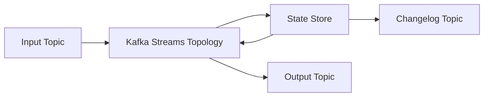
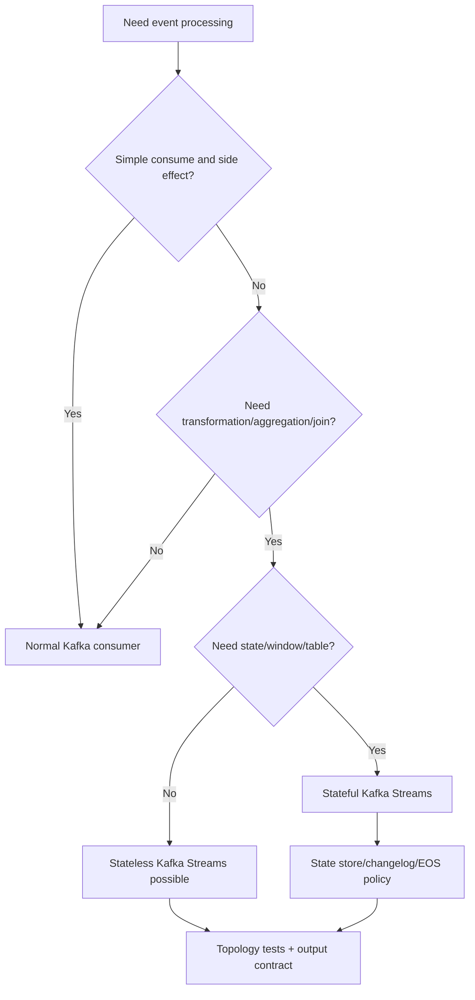

# Part 075 — Kafka Streams and Stateful Stream Processing in Java

A Kafka consumer reads messages.

A Kafka Streams application continuously transforms streams.

That difference matters.

A normal consumer often looks like:

```text
read event -> update database -> commit offset
```

A stream processing application often looks like:

```text
read stream -> filter/map/join/aggregate/window -> write new stream/table
```

Kafka Streams lets Java applications build stream processors directly on Kafka topics.

It supports:

- stateless transformations,
- stateful aggregations,
- joins,
- windowing,
- local state stores,
- changelog topics,
- repartition topics,
- stream-table duality,
- interactive queries,
- processing guarantees.

This is powerful.

It also introduces new operational complexity:

- state store restoration,
- changelog retention,
- repartition topics,
- event-time vs processing-time,
- late events,
- out-of-order records,
- exactly-once scope,
- state migration,
- topology compatibility,
- rebalance recovery,
- memory/disk sizing,
- backpressure,
- stateful testing.

A top-tier engineer treats Kafka Streams as a distributed stateful application, not just a functional pipeline.

---

## 1. Stream Processing Mental Model



A topology defines the processing graph.

Records flow through nodes.

Some nodes are stateless.

Some nodes maintain local state.

Local state is backed by changelog topics so it can be restored if the instance crashes or moves.

The application is both:

```text
consumer
+ processor
+ producer
+ stateful runtime
```

That combination is why stream processing needs special discipline.

---

## 2. Kafka Streams Core Concepts

Important concepts:

| Concept | Meaning |
|---|---|
| Topology | Processing graph |
| Source processor | Reads from topic |
| Processor node | Applies operation |
| Sink processor | Writes to topic |
| `KStream` | Record stream, each event is independent |
| `KTable` | Changelog table, latest value by key |
| GlobalKTable | Fully replicated table on each instance |
| State store | Local durable/queryable state |
| Changelog topic | Kafka topic backing state store |
| Repartition topic | Internal topic used when key changes |
| Task | Unit of parallelism tied to input partitions |
| Processing guarantee | at-least-once or exactly-once mode |

Do not use these terms loosely.

They define runtime behavior.

---

## 3. KStream vs KTable

### KStream

A `KStream` is a stream of records.

Example:

```text
CaseEscalated(evt-1)
CaseEscalated(evt-2)
CaseClosed(evt-3)
```

Each record is an event.

Use `KStream` for:

- event streams,
- transformations,
- filtering,
- routing,
- enrichment,
- event-to-event pipelines.

### KTable

A `KTable` represents latest value by key.

Example:

```text
customerId -> latest customer profile
caseId -> latest case snapshot
```

Use `KTable` for:

- reference data,
- latest state,
- joins,
- aggregations,
- materialized views.

Mental model:

```text
KStream = facts over time
KTable = current state after applying facts
```

This distinction is central.

---

## 4. Stream-Table Duality

An update stream can build a table.

A table's changes can be represented as a stream.

Example:

```text
CustomerUpdated events -> customer_profile KTable
```

Then:

```text
CaseEscalated stream join customer_profile table
```

This lets stream processors enrich events with current reference state.

But be careful:

- table state may be stale relative to stream event,
- join semantics depend on timing,
- out-of-order updates can affect result,
- missing table row needs policy,
- historical replay may produce different enrichment if table is current-state only.

Stream-table joins are useful but not magical.

---

## 5. Stateless Topology Example

```java
StreamsBuilder builder = new StreamsBuilder();

KStream<String, CaseEvent> caseEvents =
    builder.stream("case-events");

KStream<String, CaseEscalated> escalated =
    caseEvents
        .filter((key, event) -> event.type().equals("CaseEscalated"))
        .mapValues(event -> mapper.toCaseEscalated(event));

escalated.to("case-escalated-events");

KafkaStreams streams = new KafkaStreams(builder.build(), properties);
streams.start();
```

This is stateless.

If app crashes, it resumes from committed offsets.

There is no local state to restore.

Stateless processing is operationally simpler.

Prefer stateless when state is not needed.

---

## 6. Stateful Aggregation Example

```java
StreamsBuilder builder = new StreamsBuilder();

KStream<String, CaseEscalated> escalations =
    builder.stream("case-escalated-events");

KTable<String, Long> countByQueue =
    escalations
        .groupBy((caseId, event) -> event.targetQueue())
        .count(Materialized.as("case-escalations-by-queue"));

countByQueue
    .toStream()
    .to("case-escalation-counts");
```

This creates:

- local state store named `case-escalations-by-queue`,
- changelog topic for that store,
- possibly repartition topic because grouping key changed.

Stateful operations create internal topics.

Internal topics are part of production operations.

Monitor them.

---

## 7. Topology Is a Contract

Topology determines:

- input topics,
- output topics,
- internal topics,
- repartition behavior,
- state store names,
- changelog names,
- keying,
- serialization,
- processing guarantees,
- restoration behavior.

Changing topology can be breaking.

Examples:

- rename state store,
- change key type,
- change aggregation semantics,
- change output topic,
- change repartition key,
- change serde,
- change window size,
- change retention.

Treat topology changes like data migrations.

Not just code changes.

---

## 8. Key Discipline

Kafka Streams depends heavily on keys.

Operations such as:

- grouping,
- joins,
- aggregations,
- tables,
- repartitioning,

are key-sensitive.

If key is wrong, results are wrong.

Example:

```java
caseEvents
    .selectKey((oldKey, event) -> event.caseId())
    .groupByKey()
    .count();
```

`selectKey` changes key.

This may trigger repartition before grouped operation.

Repartition topics appear because records must be redistributed by new key.

This affects:

- latency,
- storage,
- cost,
- ordering,
- operational complexity.

Key changes should be intentional and tested.

---

## 9. Repartition Topics

Kafka Streams creates repartition topics when data must be shuffled by a new key.

Example:

```java
stream.groupBy((key, value) -> value.targetQueue())
```

If current key is `caseId`, grouping by `targetQueue` requires repartition.

Internal repartition topic:

```text
application-id-some-node-repartition
```

Repartition topics can become bottlenecks.

Watch:

- size,
- throughput,
- partitions,
- retention,
- serialization,
- lag,
- ACLs,
- topic creation policy.

A hidden repartition topic is still production infrastructure.

---

## 10. State Stores

State stores hold local state for stateful operations.

Examples:

- counts,
- windows,
- tables,
- dedup stores,
- join state,
- session data.

State store may be backed by:

- RocksDB,
- in-memory store,
- custom store.

Local state enables fast processing.

Changelog topic enables restore.

If instance dies, another instance restores state from changelog.

State store design affects:

- disk usage,
- restore time,
- memory,
- startup,
- rebalance recovery,
- changelog traffic,
- backup behavior.

---

## 11. Changelog Topics

A changelog topic records state store updates.

If local state is lost, Kafka Streams restores from changelog.

This means:

```text
state store durability depends on changelog topic retention/config
```

Do not delete internal changelog topics casually.

Do not use topic cleanup policies without understanding restore needs.

Monitor restore time.

Large state stores can take a long time to restore after deployment or failure.

---

## 12. State Store Naming

Name state stores intentionally.

Bad:

```java
.count()
```

without materialized name, causing generated internal names.

Better:

```java
.count(Materialized.as("case-escalations-by-queue-store"));
```

Stable names help:

- topic management,
- monitoring,
- debugging,
- topology evolution,
- interactive queries,
- state migration.

But changing store name later creates a new store/changelog.

Plan names.

---

## 13. Processing Guarantees

Kafka Streams supports at-least-once and exactly-once processing guarantees.

At-least-once is default in many versions/configurations.

Exactly-once processing in Kafka Streams applies within Kafka Streams/Kafka boundaries.

It helps ensure consumed records, state store updates, and produced records are committed atomically in the stream processing topology.

But scope matters:

```text
Kafka topic -> Kafka Streams state/output topics
```

It does not automatically include:

- external database,
- external HTTP call,
- email provider,
- payment gateway,
- arbitrary side effects.

If your stream processor calls external services, exactly-once Kafka processing does not make those effects exactly once.

---

## 14. Exactly-Once Configuration

Conceptual:

```properties
processing.guarantee=exactly_once_v2
```

or version-specific equivalent.

Exactly-once has trade-offs:

- more coordination,
- transactions,
- potentially lower throughput,
- operational requirements,
- broker compatibility,
- producer transaction timeouts,
- state/changelog behavior.

Use it where Kafka-to-Kafka correctness matters.

Still design idempotency for external side effects.

For pure stream processing pipelines, exactly-once can be a strong default.

---

## 15. Event Time vs Processing Time

Stream processing time concepts:

| Time | Meaning |
|---|---|
| event time | when event happened |
| processing time | when processor sees it |
| ingestion time | when broker accepted it |

Windowed aggregations usually need event-time semantics.

Example:

```text
count escalations per 5 minutes by occurredAt
```

If event arrives late, which window does it belong to?

By event time:

```text
window of occurredAt
```

By processing time:

```text
window when consumer processes
```

For business metrics, event time is often correct.

But late events must be handled.

---

## 16. Windows

Common windows:

| Window | Use |
|---|---|
| tumbling | fixed non-overlapping intervals |
| hopping | fixed overlapping intervals |
| sliding | event-relative interval |
| session | dynamic gap-based sessions |

Example:

```java
KTable<Windowed<String>, Long> counts =
    escalations
        .groupBy((key, event) -> event.targetQueue())
        .windowedBy(TimeWindows.ofSizeWithNoGrace(Duration.ofMinutes(5)))
        .count();
```

Window config defines:

- size,
- grace period,
- retention,
- late event handling,
- output emission.

Window semantics are business contract.

---

## 17. Grace Period and Late Events

Late event:

```text
event occurred at 10:00
processed at 10:20
```

If window closes at 10:05 with no grace, late event may be dropped or ignored.

Grace period says:

```text
accept late events for this long after window end
```

Trade-off:

- longer grace improves correctness for late data,
- longer grace increases state retention,
- results update later,
- output may change after initially emitted.

For analytics, late update may be okay.

For alerts, maybe not.

Define lateness policy explicitly.

---

## 18. Suppression

Some stream processors can suppress intermediate window results until final.

Use case:

```text
emit final count after window closes
```

Trade-off:

- fewer updates,
- more buffering/state,
- later output,
- memory/disk pressure.

Use suppression carefully.

Intermediate updates can be useful for near-real-time dashboards.

Final updates are better for billing/reporting.

---

## 19. Joins

Kafka Streams supports different joins:

- stream-stream,
- stream-table,
- table-table,
- global table joins.

Each has different semantics.

### Stream-table join

```text
event stream enriched with latest table value
```

Good for reference data.

Risk:

- uses table value at processing time,
- replay may produce different result if table history not aligned.

### Stream-stream join

```text
match events within time window
```

Good for correlation.

Risk:

- late events,
- window retention,
- duplicate matches.

### Table-table join

```text
materialized state combination
```

Good for read models.

Risk:

- tombstones,
- update ordering.

Joins are not simple lookups.

They are temporal semantics.

---

## 20. GlobalKTable

`GlobalKTable` replicates entire table to every instance.

Useful for small reference datasets.

Example:

```text
country-code table
tenant-config table
small product catalog
```

Not good for huge datasets.

Global replication increases:

- memory/disk per instance,
- restore time,
- network traffic.

Use when table is small and every instance benefits from local lookup.

---

## 21. Interactive Queries

Kafka Streams can expose local state stores for queries.

Example use:

```text
query local state store for aggregate count
```

But state is partitioned.

If key is not on local instance, you need routing to correct instance.

Interactive queries require:

- host info,
- metadata lookup,
- routing layer,
- state store availability,
- restore awareness,
- standby replicas if needed.

For many systems, writing output to a normal database/read model may be operationally simpler.

Interactive queries are powerful but advanced.

---

## 22. Side Effects in Kafka Streams

Avoid arbitrary side effects inside stream transformations.

Bad:

```java
stream.foreach((key, event) -> emailProvider.send(event));
```

Problems:

- replay sends emails,
- retries duplicate side effects,
- exactly-once does not cover external call,
- failure handling is unclear,
- tests are harder,
- state restore may re-trigger effects.

Better:

```text
stream produces NotificationIntent event/topic
notification service sends email idempotently
```

Kafka Streams should generally transform streams, not perform irreversible side effects.

---

## 23. Stream Processor as Microservice

Kafka Streams app is a service.

It needs:

- config,
- deployment,
- scaling,
- monitoring,
- readiness/liveness,
- graceful shutdown,
- state storage,
- disk sizing,
- changelog topics,
- ACLs,
- schema registry,
- topology version,
- runbooks.

Do not deploy it as a "library job" with no ownership.

If it processes business data, it is production software.

---

## 24. Scaling

Kafka Streams parallelism is based on partitions and tasks.

More instances can process more partitions.

But:

- partitions limit parallelism,
- state restore takes time,
- rebalances interrupt processing,
- large state stores slow scaling,
- standby replicas cost resources,
- output topics need capacity.

Scaling stateless streams is easier.

Scaling stateful streams requires state movement/restoration.

Measure restore time before incidents.

---

## 25. Standby Replicas

Standby replicas maintain copies of state stores on other instances.

Benefit:

- faster failover,
- reduced restore time.

Cost:

- extra broker/network traffic,
- extra disk,
- more complexity.

Use for critical low-RTO stateful stream apps.

Do not enable blindly.

---

## 26. RocksDB and Local Disk

Stateful Kafka Streams often uses RocksDB.

Operational implications:

- local disk required,
- disk I/O matters,
- compaction matters,
- state directory must be writable,
- container ephemeral disk size matters,
- restore can be large,
- disk pressure can kill app.

Kubernetes deployment must provision enough disk.

Monitor:

- state directory size,
- disk usage,
- restore time,
- RocksDB metrics if available,
- changelog lag.

---

## 27. Topology Versioning

When topology changes:

- state store names may change,
- internal topic names may change,
- serialized state format may change,
- output schema may change,
- repartition behavior may change.

Strategy:

- version application ID for breaking topology change,
- deploy new app in parallel,
- write to shadow output,
- compare,
- cut over,
- retire old app.

Changing `application.id` creates a new consumer group and new internal topics.

This can trigger full replay.

Plan for it.

---

## 28. Application ID

`application.id` is critical.

It determines:

- consumer group ID,
- internal topic prefix,
- state directory association,
- processing identity.

Do not change casually.

Changing it can:

- create new consumer group,
- start from reset policy,
- create new internal topics,
- rebuild all state,
- duplicate output.

Use explicit versioned IDs for intentional migrations.

---

## 29. Observability

Metrics:

```text
streams.records.processed.total{application,topology,processor}
streams.process.rate{application}
streams.process.latency{application,processor}
streams.commit.latency{application}
streams.task.count{application,state}
streams.state.restore.total{application,store}
streams.state.restore.duration{application,store}
streams.state.store.size.bytes{application,store}
streams.rebalances.total{application}
streams.dropped.records.total{application,reason}
streams.late.records.total{application,window}
streams.output.records.total{application,topic}
streams.error.total{application,reason}
```

Also monitor Kafka producer/consumer metrics.

Kafka Streams includes both.

---

## 30. Alerting

Useful alerts:

| Alert | Meaning |
|---|---|
| state restore taking long | slow recovery |
| rebalance storm | unstable app/group |
| dropped late records | event-time/lateness issue |
| state store disk high | local storage risk |
| changelog lag high | restore/processing issue |
| processing latency high | app/downstream issue |
| output topic error | serialization/broker issue |
| internal topic missing | deployment/ACL issue |
| task stuck | partition/state issue |
| exactly-once transaction failures | EOS instability |

Stateful stream apps need state-specific alerts.

---

## 31. Testing With TopologyTestDriver

Kafka Streams provides test utilities such as `TopologyTestDriver`.

Conceptual test:

```java
@Test
void countsEscalationsByQueue() {
    StreamsBuilder builder = new StreamsBuilder();
    Topology topology = new CaseEscalationTopology().build(builder);

    try (TopologyTestDriver driver = new TopologyTestDriver(topology, props)) {
        TestInputTopic<String, CaseEscalated> input =
            driver.createInputTopic(
                "case-escalated-events",
                Serdes.String().serializer(),
                caseEscalatedSerde.serializer()
            );

        TestOutputTopic<String, Long> output =
            driver.createOutputTopic(
                "case-escalation-counts",
                Serdes.String().deserializer(),
                Serdes.Long().deserializer()
            );

        input.pipeInput("CASE-100", event("FRAUD_REVIEW"));
        input.pipeInput("CASE-101", event("FRAUD_REVIEW"));

        assertThat(output.readKeyValue().value).isEqualTo(1L);
        assertThat(output.readKeyValue().value).isEqualTo(2L);
    }
}
```

Topology tests are fast and deterministic.

Use them heavily.

---

## 32. Testing State Stores

State store test:

```java
KeyValueStore<String, Long> store =
    driver.getKeyValueStore("case-escalations-by-queue-store");

assertThat(store.get("FRAUD_REVIEW")).isEqualTo(2L);
```

Test:

- aggregation,
- duplicate behavior,
- late events,
- windows,
- tombstones,
- joins,
- schema versions,
- state restore assumptions through fixtures.

Do not only test final output topic.

State is the core of stateful stream processing.

---

## 33. Integration Testing

TopologyTestDriver does not test:

- real broker,
- internal topic creation,
- schema registry,
- transactions,
- rebalances,
- state restore from changelog,
- disk behavior,
- broker ACLs.

Use integration tests with Kafka/Testcontainers for:

- internal topics,
- application ID,
- exactly-once config,
- state restore,
- output topics,
- real serdes.

Both test types matter.

---

## 34. Production Policy Template

```yaml
kafkaStreams:
  applications:
    case-escalation-aggregator:
      applicationId: case-escalation-aggregator-v1
      inputTopics:
        - case-escalated-events
      outputTopics:
        - case-escalation-counts
      processingGuarantee: exactly_once_v2
      stateStores:
        - name: case-escalations-by-queue-store
          type: rocksdb
          changelogRequired: true
      internalTopics:
        managedBy: platform
      windows:
        gracePolicyRequired: true
      sideEffects:
        externalCallsAllowed: false
      scaling:
        partitions: 24
        standbyReplicas: 1
      observability:
        restoreTimeAlert: true
        rebalanceAlert: true
        stateStoreDiskAlert: true
      testing:
        topologyTestDriverRequired: true
        integrationTestRequired: true
```

This makes Kafka Streams operationally explicit.

---

## 35. Common Anti-Patterns

### 35.1 Using Kafka Streams for simple listener work

Unnecessary stateful runtime.

### 35.2 Hidden state store names

Topology migration pain.

### 35.3 Side effects inside stream operations

Replay/exactly-once confusion.

### 35.4 Ignoring internal topics

Production failures during deploy/ACL.

### 35.5 No late-event policy

Windowed analytics wrong.

### 35.6 Joining with current table during replay without understanding semantics

Historical output differs unexpectedly.

### 35.7 Changing `application.id` casually

Full replay and duplicate output.

### 35.8 No disk sizing

State store fills container.

### 35.9 No restore-time monitoring

Recovery surprises during incident.

### 35.10 Believing exactly-once includes external systems

Scope misunderstanding.

---

## 36. Decision Model



Use Kafka Streams when stream processing semantics justify the runtime.

---

## 37. Design Checklist

Before shipping Kafka Streams app:

- What is the topology?
- What are input/output topics?
- What is application ID?
- Is topology stateful?
- What state stores exist?
- Are state store names stable?
- Are internal topics governed?
- What are keying/repartition points?
- Are joins/window semantics documented?
- What is event-time/lateness policy?
- What processing guarantee is configured?
- Is exactly-once scope understood?
- Are external side effects forbidden?
- Is local disk sized?
- Is restore time measured?
- Are rebalances monitored?
- Are topology tests written?
- Are integration tests run?
- Is migration/cutover plan ready?

---

## 38. The Real Lesson

Kafka Streams is a powerful way to build Java stream processors.

But stateful stream processing is operationally serious.

You are not just writing a consumer.

You are deploying a distributed stateful application with:

```text
topology
+ state stores
+ changelog topics
+ internal repartition topics
+ processing guarantees
+ restore behavior
+ event-time semantics
+ migration constraints
```

When used well, Kafka Streams can replace large amounts of custom consumer/database code.

When used casually, it creates hidden state and hidden failure modes.

Use it deliberately.

---

## References

- Apache Kafka Streams Core Concepts: https://kafka.apache.org/26/streams/core-concepts/
- Apache Kafka Streams Developer Guide: https://kafka.apache.org/41/streams/developer-guide/
- Apache Kafka Streams Configuration: https://kafka.apache.org/41/streams/developer-guide/config-streams/
- Confluent Kafka Streams Concepts: https://docs.confluent.io/platform/current/streams/concepts.html
- Confluent Kafka Streams Architecture: https://docs.confluent.io/platform/current/streams/architecture.html
- Spring Kafka Exactly-Once Semantics: https://docs.spring.io/spring-kafka/reference/kafka/exactly-once.html
