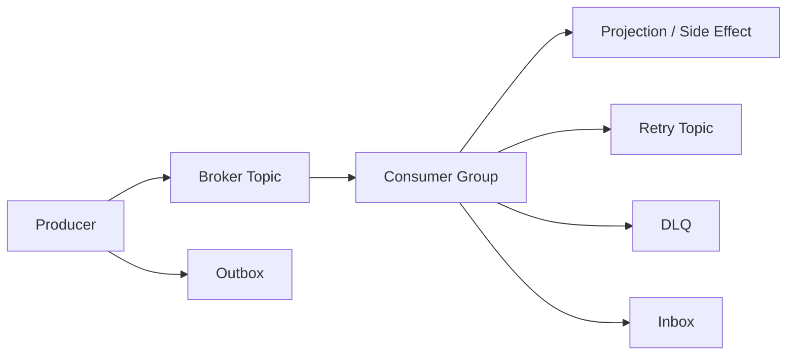
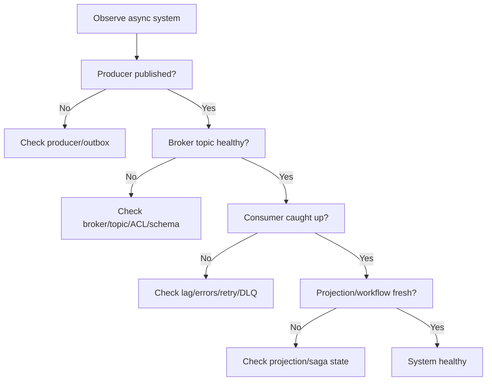

# Part 076 — Event-Driven Observability and Operations

Synchronous failures are visible quickly.

A user calls an API.

The API times out.

The error appears now.

Asynchronous failures are often delayed and hidden.

A producer publishes an event.

A consumer silently fails.

A DLQ grows.

A projection becomes stale.

A workflow waits forever.

A replay reprocesses old messages.

A retry topic grows for hours.

Users notice later.

Event-driven systems need a different observability model.

The production question is not only:

```text
Is the service up?
```

It is:

```text
Are events flowing, being processed, staying fresh, retrying safely, and producing correct derived state?
```

---

## 1. Async Observability Mental Model



Observe every stage:

- producer,
- outbox,
- broker,
- topic,
- partition,
- consumer group,
- consumer handler,
- retry,
- DLQ,
- inbox,
- projection,
- workflow,
- replay/backfill.

If you only observe consumer application health, you will miss the actual system health.

---

## 2. The Core Async Signals

Minimum signals:

| Signal | Meaning |
|---|---|
| produce rate | events entering system |
| produce failure | producer cannot publish |
| outbox pending age | event publication delayed |
| broker topic size/rate | data movement |
| consumer lag | consumer behind |
| processing latency | handler speed |
| processing error rate | consumer failures |
| retry rate | transient instability |
| DLQ count | terminal failures |
| inbox pending age | local processing backlog |
| projection lag | read model staleness |
| workflow in-progress age | saga stuck |
| replay progress | backfill/rebuild state |
| schema errors | contract break |
| duplicate rate | retry/rebalance/outbox duplicate behavior |

Together they tell the async story.

---

## 3. Lag Is Not One Metric

Lag can mean several things.

### Offset lag

```text
latest offset - committed offset
```

Useful broker metric.

### Time lag

```text
now - event time of oldest unprocessed record
```

Better business freshness metric.

### Processing lag

```text
time from event publish to consumer processing complete
```

Useful end-to-end metric.

### Projection lag

```text
source aggregate version - projection version
```

Correctness/freshness metric.

Track the lag that matches business impact.

For user-facing projections, time lag matters more than raw offset count.

---

## 4. Producer Metrics

Producer metrics:

```text
messaging.producer.records.sent.total{topic,event_type,status}
messaging.producer.send.duration{topic,event_type}
messaging.producer.failures.total{topic,event_type,reason}
messaging.producer.record.size.bytes{topic,event_type}
messaging.producer.serialization.failures.total{topic,event_type}
messaging.producer.null_key.total{topic,event_type}
messaging.producer.retry.total{topic,event_type}
messaging.producer.buffer.exhausted.total{producer}
```

Outbox producer metrics:

```text
outbox.rows.created.total{service,event_type}
outbox.pending.count{service}
outbox.oldest_pending_age.seconds{service}
outbox.publish.failures.total{service,reason}
outbox.publish.duration{service,event_type}
outbox.rows.parked.total{service,reason}
```

Outbox age is often more important than pending count.

One critical event stuck for 20 minutes may matter more than 1000 low-value telemetry events delayed for 5 seconds.

---

## 5. Broker and Topic Metrics

Broker/platform metrics:

```text
topic.bytes.in.total{topic}
topic.bytes.out.total{topic}
topic.records.in.total{topic}
topic.partition.count{topic}
topic.under_replicated_partitions
topic.offline_partitions
topic.log_size_bytes{topic}
topic.retention.ms{topic}
broker.request.latency
broker.produce.errors
broker.fetch.errors
```

Topic contract metrics:

```text
topic.null_key.total{topic}
topic.schema.validation.failures.total{topic}
topic.record.too.large.total{topic}
topic.unauthorized.produce.total{topic}
topic.unauthorized.consume.total{topic}
```

Kafka platform health and event contract health are both needed.

---

## 6. Consumer Metrics

Consumer metrics:

```text
messaging.consumer.records.received.total{topic,group,event_type}
messaging.consumer.records.processed.total{topic,group,event_type,outcome}
messaging.consumer.processing.duration{topic,group,event_type}
messaging.consumer.lag.offset{topic,group,partition}
messaging.consumer.lag.seconds{topic,group}
messaging.consumer.duplicates.total{topic,group,event_type}
messaging.consumer.deserialization.failures.total{topic,group,reason}
messaging.consumer.schema.unsupported.total{topic,group,event_type}
messaging.consumer.rebalances.total{topic,group}
messaging.consumer.paused{topic,group}
```

Outcomes:

- success,
- duplicate_skipped,
- retryable_failure,
- terminal_failure,
- dlq,
- parked,
- stale_ignored,
- sequence_gap,
- side_effect_suppressed.

Do not record only success/failure.

Async correctness needs richer outcomes.

---

## 7. Retry and DLQ Metrics

Retry metrics:

```text
messaging.retry.scheduled.total{topic,group,reason}
messaging.retry.attempts.total{topic,group,attempt}
messaging.retry.exhausted.total{topic,group,reason}
messaging.retry.oldest_age.seconds{topic,group}
messaging.retry.topic.lag{topic,group}
```

DLQ metrics:

```text
messaging.dlq.messages.total{topic,group,reason}
messaging.dlq.publish.failures.total{topic,group}
messaging.dlq.oldest_age.seconds{topic,group}
messaging.dlq.replayed.total{topic,group,status}
messaging.poison.detected.total{topic,group,event_type}
```

A DLQ with messages is not "handled."

It is work waiting for owner.

DLQ age should alert.

---

## 8. Inbox Metrics

Inbox metrics:

```text
inbox.messages.received.total{consumer,event_type}
inbox.pending.count{consumer}
inbox.oldest_pending_age.seconds{consumer}
inbox.in_progress.count{consumer}
inbox.stale_in_progress.count{consumer}
inbox.completed.total{consumer,event_type}
inbox.failed.total{consumer,event_type,reason}
inbox.parked.total{consumer,event_type,reason}
```

If consumer acks broker after storing inbox row, broker lag may be low.

But inbox pending may be high.

Dashboard must show both.

Otherwise work disappears from broker metrics but is not complete.

---

## 9. Projection Metrics

Projection metrics:

```text
projection.events.applied.total{projection,event_type}
projection.events.ignored_duplicate.total{projection,event_type}
projection.sequence.gaps.total{projection,event_type}
projection.lag.seconds{projection}
projection.version.behind{projection}
projection.query.stale.total{projection}
projection.rebuild.progress{projection}
projection.rebuild.errors.total{projection}
projection.shadow.diff.total{projection}
```

Projection SLO example:

```text
99% of case-search projection updates are visible within 30 seconds of CaseUpdated event.
```

This is business-level freshness.

Not just Kafka lag.

---

## 10. Saga/Workflow Metrics

Workflow metrics:

```text
saga.started.total{workflow_type}
saga.completed.total{workflow_type}
saga.failed.total{workflow_type,reason}
saga.compensated.total{workflow_type}
saga.compensation.failed.total{workflow_type}
saga.step.duration{workflow_type,step,status}
saga.step.retry.total{workflow_type,step,reason}
saga.timeout.total{workflow_type,step}
saga.in_progress.count{workflow_type,state}
saga.oldest_in_progress_age.seconds{workflow_type}
saga.manual_intervention.count{workflow_type}
```

A workflow can be broken while all individual services are "up."

Observe the workflow state.

---

## 11. Replay/Backfill Metrics

Replay metrics:

```text
replay.jobs.started.total{job_type,consumer}
replay.jobs.completed.total{job_type,consumer,status}
replay.records.processed.total{consumer,event_type,status}
replay.throughput.records_per_second{consumer}
replay.errors.total{consumer,event_type,reason}
replay.side_effects.suppressed.total{consumer,event_type}
replay.output.records.total{target,status}
backfill.checkpoint.age.seconds{job_type}
```

Replay should be tagged separately from live processing.

Otherwise replay can distort normal dashboards.

Example:

```text
consumer processed 10M events/min
```

may look like a traffic spike unless tagged as replay.

---

## 12. OpenTelemetry Messaging Semantics

OpenTelemetry defines semantic conventions for messaging spans, metrics, and logs.

The Kafka-specific semantic conventions extend messaging conventions with Kafka-specific attributes.

Useful span/metric attributes include concepts such as:

- messaging system,
- destination/topic,
- operation,
- consumer group,
- message ID,
- partition,
- offset,
- client ID.

Semantic conventions evolve, so platform libraries should pin and document the version they follow.

Use OpenTelemetry for consistency, but keep business-specific metrics too.

OpenTelemetry tells you messaging shape.

Your domain metrics tell you business correctness.

---

## 13. Tracing Async Flows

Tracing async flows is harder than synchronous calls.

Producer span:

```text
publish CaseEscalated to case-events
```

Consumer span:

```text
process CaseEscalated from case-events
```

Linking may use trace context headers.

But a consumer may process much later.

Trace may be sampled.

Replay may process old trace context.

Therefore:

- propagate trace context,
- include correlation ID,
- include causation ID,
- use span links when appropriate,
- do not rely on traces as durable business history.

Business correlation and event IDs are essential.

---

## 14. Span Links

Async consumers may create spans linked to producer context rather than strict parent-child.

Why?

The consumer processing is causally related to producer publish, but not synchronously nested in the same call stack.

Span links can represent this relationship.

Even if your instrumentation uses parent-child, understand semantic limitation.

For long-delayed events, parent-child traces can be misleading.

Design tracing conventions consistently.

---

## 15. Correlation ID vs Trace ID

Trace ID:

- technical observability concept,
- may be sampled,
- useful for request path.

Correlation ID:

- business/process grouping,
- should persist across async boundaries,
- useful in logs, events, workflow state,
- should not depend on tracing backend.

Causation ID:

- points to command/event that caused this message.

Use all three intentionally.

```text
eventId = identity of this event
correlationId = business flow
causationId = previous command/event
traceId = observability trace
```

---

## 16. Structured Logs

Log notable async events.

Examples:

```json
{
  "event": "message_processing_failed",
  "topic": "case-events",
  "partition": 3,
  "offset": 90210,
  "consumerGroup": "search-indexer",
  "eventType": "CaseEscalated.v1",
  "messageId": "evt-123",
  "reason": "SEQUENCE_GAP",
  "correlationId": "corr-456"
}
```

Avoid full payload.

Use:

- event type,
- safe ID,
- hashed key if sensitive,
- topic/partition/offset,
- group,
- reason,
- attempt,
- correlation.

Logs should let operators locate/replay a message without exposing sensitive data.

---

## 17. Payload Logging Policy

Default:

```text
do not log payload
```

If payload logging is needed:

- disabled by default,
- allowlist fields,
- sample,
- redact sensitive values,
- restricted environments,
- short retention,
- access-controlled,
- audited.

Events often contain data from many services and can be retained broadly.

Payload logging multiplies data exposure risk.

---

## 18. Dashboard: Producer Health

Producer dashboard:

- records sent by topic/event type,
- send failure rate,
- serialization failures,
- publish latency p95/p99,
- record size p95/p99,
- null key count,
- outbox pending count,
- oldest outbox age,
- relay publish rate,
- relay failure reason,
- schema registry errors.

Question answered:

```text
Are events being created and durably published?
```

---

## 19. Dashboard: Consumer Health

Consumer dashboard:

- consumption rate,
- processing success/failure by outcome,
- lag by partition,
- oldest unprocessed event age,
- processing latency,
- duplicate skipped count,
- retry scheduled,
- DLQ count/age,
- deserialization failure,
- rebalances,
- pause state.

Question answered:

```text
Are events being processed correctly and freshly?
```

---

## 20. Dashboard: Projection Freshness

Projection dashboard:

- projection lag seconds,
- version behind,
- stale query count,
- sequence gaps,
- duplicate ignored,
- rebuild progress,
- shadow diff,
- delete/tombstone processing,
- query latency,
- data freshness by source.

Question answered:

```text
Can users trust this read model right now?
```

---

## 21. Dashboard: Workflow/Saga

Workflow dashboard:

- started/completed/failed,
- workflows by state,
- oldest in-progress,
- step duration,
- retry count,
- compensation count,
- timeout count,
- manual intervention queue,
- DLQ/retry related to workflow.

Question answered:

```text
Are business processes completing?
```

---

## 22. SLOs for Event-Driven Systems

SLOs should include freshness and completion, not only availability.

Examples:

### Event publication SLO

```text
99.9% of committed CaseEscalated domain events appear in case-events topic within 10 seconds.
```

### Consumer freshness SLO

```text
99% of case-events are processed by search-indexer within 30 seconds.
```

### Projection freshness SLO

```text
99% of case search queries reflect source events within 60 seconds.
```

### Workflow completion SLO

```text
99% of escalation workflows reach COMPLETED or REQUIRES_MANUAL_REVIEW within 5 minutes.
```

Async systems need time-based SLOs.

---

## 23. Error Budget for Lag

For projection freshness:

```text
lag > 60 seconds counts against freshness SLO
```

Define:

- measurement point,
- excluded maintenance/replay windows,
- priority classes,
- event types,
- consumer groups,
- backfill behavior.

Lag error budget is powerful because it links technical backlog to user impact.

---

## 24. Alert Design

Good async alerts are specific.

Bad:

```text
Kafka lag high
```

Better:

```text
search-indexer lag for case-events has oldest unprocessed event age > 60s for 10m; case search freshness SLO at risk.
```

Good alert includes:

- topic,
- consumer group,
- affected business capability,
- lag age,
- rate of change,
- recent deploy,
- DLQ/retry context,
- runbook link.

Avoid paging on expected replay lag.

---

## 25. Alert Matrix

| Alert | Likely cause | First action |
|---|---|---|
| outbox age high | relay/broker/schema failure | check relay and broker send errors |
| producer serialization failure | schema bug | rollback producer or fix schema |
| consumer lag high | slow handler/downstream/poison | check processing errors and partition lag |
| one partition lagging | hot key or poison | inspect partition offset/key |
| DLQ > 0 | terminal failures | classify and remediate |
| retry storm | dependency outage | pause/throttle/circuit break |
| deserialization failures | schema incompatibility | check producer schema change |
| sequence gaps | missing/out-of-order event | inspect producer/outbox/key |
| projection stale | consumer lag or write failure | check projection handler |
| workflow timeout | participant failure | inspect saga step |

Alert should point to diagnosis.

---

## 26. Incident Runbook: Consumer Lag

When consumer lag is high:

1. Check if lag is all partitions or one partition.
2. Check processing error rate.
3. Check DLQ/retry rate.
4. Check downstream dependency latency.
5. Check recent deploy/schema change.
6. Check consumer rebalances.
7. Check handler p99.
8. Check DB pool/CPU.
9. Check poison message at stuck offset.
10. Decide: scale, pause, DLQ/park, rollback, throttle replay.

Do not blindly add consumers.

If one partition is hot, adding consumers may not help.

---

## 27. Incident Runbook: DLQ Spike

When DLQ grows:

1. Identify topic/group/event type.
2. Group by failure reason.
3. Determine retryable vs terminal.
4. Check if new producer version deployed.
5. Check schema compatibility.
6. Check if payload corrupt or consumer bug.
7. Stop/reduce consumer if DLQ flood risks loss.
8. Fix code/data/config.
9. Replay with preserved IDs.
10. Verify no duplicate side effects.

DLQ spike is a contract or processing incident.

---

## 28. Incident Runbook: Outbox Backlog

When outbox pending age grows:

1. Check relay running.
2. Check broker connectivity.
3. Check producer auth/ACL.
4. Check serialization/schema registry.
5. Check record too large.
6. Check relay error logs.
7. Check database lock/query performance.
8. Scale relay if safe.
9. Pause low-priority event-producing commands if disk risk.
10. Verify backlog drains.

Outbox backlog means committed business events are not published yet.

---

## 29. Incident Runbook: Projection Stale

When projection is stale:

1. Check source topic produce rate.
2. Check consumer lag.
3. Check projection write failures.
4. Check sequence gaps.
5. Check DLQ/retry backlog.
6. Check search/database health.
7. Check if projection rebuild running.
8. Check stale read SLO.
9. Communicate freshness degradation.
10. Rebuild/shadow replay if corrupted.

Projection stale is user-facing even if APIs are up.

---

## 30. Incident Runbook: Replay Accident

If replay triggers side effects:

1. Stop replay immediately.
2. Pause affected consumers.
3. Identify message range processed.
4. Identify external effects emitted.
5. Use idempotency/provider logs to deduplicate.
6. Communicate impacted users if needed.
7. Mark replay job failed.
8. Add suppression tests.
9. Review approval/runbook gap.
10. Remediate duplicate effects.

Replay safety failures are serious.

---

## 31. Capacity Planning

Async capacity includes:

- producer rate,
- broker throughput,
- partition count,
- consumer processing rate,
- handler dependency capacity,
- retry amplification,
- DLQ storage,
- outbox table growth,
- state store disk,
- projection database writes,
- replay/backfill load,
- observability pipeline volume.

Capacity formula:

```text
required consumer throughput >= peak produce throughput + replay/backfill allowance
```

If not, lag grows.

Plan for failure/replay, not just steady state.

---

## 32. Retry Amplification Metrics

If base event rate is 10,000/min and retry rate is 20%, attempt rate is:

```text
12,000/min
```

If retry storm hits 3 attempts:

```text
30,000/min
```

This affects:

- consumer CPU,
- DB load,
- external services,
- broker traffic,
- logs/metrics.

Track attempt rate separately from original message rate.

---

## 33. Multi-Tenant Observability

If topics carry multiple tenants:

- track tenant tier or class if low-cardinality,
- avoid raw tenant ID labels unless controlled,
- detect noisy tenant,
- enforce quotas,
- partition hot tenant strategy,
- support tenant-level lag in logs/debug tooling.

Metric label:

```text
tenant_tier=enterprise
```

Maybe okay.

Metric label:

```text
tenant_id=tenant-123456
```

can explode cardinality.

Use logs/search for precise tenant diagnostics.

---

## 34. Security and Audit

Event operations needing audit:

- replay/backfill,
- DLQ replay,
- offset reset,
- topic retention change,
- schema compatibility override,
- consumer group deletion,
- manual skip,
- payload remediation,
- pause/resume critical consumer.

Audit fields:

- actor,
- reason,
- topic,
- group,
- range,
- time,
- approval,
- result.

Async operations can change business state indirectly.

Audit them.

---

## 35. Testing Observability

Test telemetry.

Examples:

```java
@Test
void emitsDlqMetricForTerminalFailure() {
    consumer.onMessage(invalidMessage());

    assertThat(metrics.counter("messaging.dlq.messages.total")
        .tag("topic", "case-events")
        .tag("group", "search-indexer")
        .count()).isEqualTo(1);
}
```

Test logs redaction:

```java
@Test
void failedMessageLogDoesNotContainPayloadSecret() {
    consumer.onMessage(messageWithSecret());

    assertThat(logs).noneMatch(line -> line.contains("national_id"));
}
```

If observability is not tested, it breaks silently.

---

## 36. Production Observability Policy Template

```yaml
eventDrivenObservability:
  producer:
    required:
      - sendRate
      - sendFailures
      - serializationFailures
      - recordSize
      - nullKey
      - outboxPendingAge

  consumer:
    required:
      - processingRate
      - processingOutcome
      - lagByPartition
      - lagSeconds
      - duplicates
      - retries
      - dlq
      - deserializationFailures
      - rebalances

  projection:
    required:
      - freshnessLag
      - sequenceGaps
      - staleReads
      - rebuildProgress

  tracing:
    standard: opentelemetry
    propagate:
      - traceparent
      - tracestate
    businessCorrelationRequired: true

  logging:
    structured: true
    payloadLogging: disabled
    redactHeaders:
      - authorization
      - cookie
      - idempotency-key

  operations:
    replayAuditRequired: true
    dlqReplayAuditRequired: true
    offsetResetApprovalRequired: true
```

Policy makes async operations visible by default.

---

## 37. Common Anti-Patterns

### 37.1 Service health only

Consumer app is up, but lag/DLQ is broken.

### 37.2 Offset lag only

Business freshness not measured.

### 37.3 No outbox age metric

Committed events delayed invisibly.

### 37.4 DLQ with no alert

Terminal failures become silent backlog.

### 37.5 Replay not tagged

Dashboards look like traffic incident.

### 37.6 Payload logs for failed messages

Privacy/security leak.

### 37.7 Trace ID as only correlation

Sampled traces cannot be business history.

### 37.8 No workflow metrics

Saga stuck while services look healthy.

### 37.9 No per-partition lag

Hot partition hidden by averages.

### 37.10 No observability tests

Metrics/logs missing during incident.

---

## 38. Decision Model



Async diagnosis follows the message path.

---

## 39. Design Checklist

Before declaring async communication production-ready:

- Are producer send failures visible?
- Is outbox pending age monitored?
- Are topic metrics monitored?
- Is lag tracked per partition?
- Is lag converted to freshness?
- Are consumer outcomes classified?
- Are retry/DLQ metrics and alerts configured?
- Is inbox backlog monitored?
- Are projection freshness metrics exposed?
- Are saga states visible?
- Are replay/backfill jobs audited?
- Are trace/correlation/causation IDs propagated?
- Are payload logs disabled/redacted?
- Are dashboards organized by business capability?
- Are runbooks available?
- Are observability tests written?
- Are alert thresholds tied to SLOs?

---

## 40. The Real Lesson

Event-driven systems fail differently.

They fail by delay.

They fail by backlog.

They fail by duplicate.

They fail by poison message.

They fail by stale projection.

They fail by stuck workflow.

They fail by replay accident.

Therefore production observability must follow the event lifecycle:

```text
produce
publish
store
consume
process
retry
dead-letter
project
complete
replay
```

If you can see every stage, async systems become operable.

If you cannot, async systems become invisible queues of future incidents.

---

## References

- OpenTelemetry Messaging Semantic Conventions: https://opentelemetry.io/docs/specs/semconv/messaging/
- OpenTelemetry Kafka Semantic Conventions: https://opentelemetry.io/docs/specs/semconv/messaging/kafka/
- Apache Kafka Documentation: https://kafka.apache.org/documentation/
- Spring Kafka Reference: https://docs.spring.io/spring-kafka/reference/
- Enterprise Integration Patterns — Message Channel: https://www.enterpriseintegrationpatterns.com/patterns/messaging/MessageChannel.html
- Enterprise Integration Patterns — Dead Letter Channel: https://www.enterpriseintegrationpatterns.com/patterns/messaging/DeadLetterChannel.html
