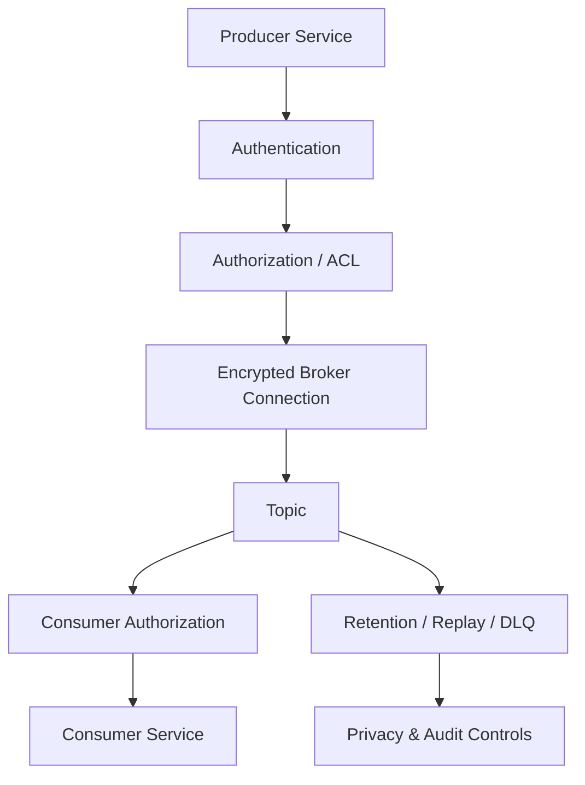
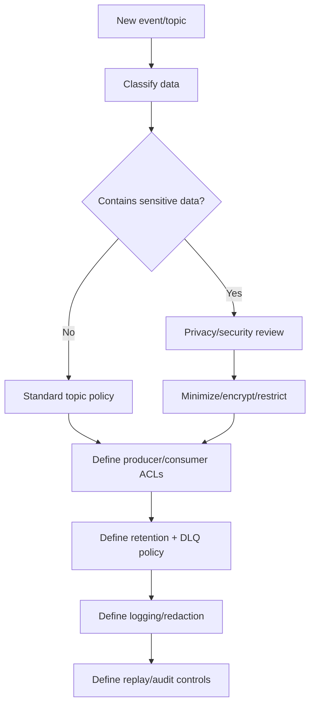

# Part 077 — Event-Driven Security, Privacy, and Access Control

Event-driven systems distribute data.

That is the power.

That is also the risk.

An event published to a topic may be:

- consumed by multiple services,
- retained for days or months,
- replayed later,
- copied to DLQ,
- moved to data lake,
- indexed in observability tools,
- used for analytics,
- reprocessed by new consumers,
- replicated across regions,
- inspected by operators.

Therefore event security is not just:

```text
use TLS
```

It is:

```text
who can produce
who can consume
what data is inside
how long it is retained
where it can be replayed
how it is audited
how secrets are protected
how privacy deletion is honored
```

A top-tier engineer designs event-driven security as data governance plus transport security plus runtime authorization.

---

## 1. Security Model



Security layers:

| Layer | Responsibility |
|---|---|
| Network | isolate broker access |
| TLS | encrypt traffic and authenticate endpoints |
| SASL/mTLS | authenticate clients |
| ACL/RBAC | authorize topic operations |
| Schema governance | prevent unsafe payloads |
| Data classification | determine sensitivity |
| Retention | limit data lifetime |
| Encryption at rest | protect stored data |
| Observability redaction | prevent leaks |
| Audit | record sensitive operations |
| Replay controls | prevent unsafe reprocessing |

No single layer is enough.

---

## 2. Authentication

Authentication answers:

```text
who is this producer/consumer?
```

Kafka authentication mechanisms commonly include:

- TLS client certificate authentication,
- SASL/SCRAM,
- SASL/PLAIN with TLS,
- SASL/OAUTHBEARER,
- Kerberos/GSSAPI,
- cloud provider IAM integrations,
- managed platform identities.

In Java client config, authentication is configured through producer/consumer properties.

Conceptual SASL/SCRAM:

```properties
security.protocol=SASL_SSL
sasl.mechanism=SCRAM-SHA-512
sasl.jaas.config=org.apache.kafka.common.security.scram.ScramLoginModule required \
  username="case-service" \
  password="${KAFKA_PASSWORD}";
```

Conceptual mTLS:

```properties
security.protocol=SSL
ssl.truststore.location=/etc/kafka/truststore.p12
ssl.truststore.password=${TRUSTSTORE_PASSWORD}
ssl.keystore.location=/etc/kafka/keystore.p12
ssl.keystore.password=${KEYSTORE_PASSWORD}
ssl.key.password=${KEY_PASSWORD}
```

Authentication identity should map to service identity.

Do not share one Kafka principal across many services.

---

## 3. Authorization and ACLs

Authorization answers:

```text
is this identity allowed to do this operation on this resource?
```

Kafka uses a pluggable authorization framework and ACLs to control operations.

Typical permissions:

- produce to topic,
- consume from topic,
- read as consumer group,
- create topic,
- describe topic,
- alter topic,
- read transactional ID,
- write transactional ID.

Example conceptual policy:

```yaml
principals:
  User:case-service:
    allow:
      - operation: Write
        resourceType: Topic
        resourceName: case-events
      - operation: Describe
        resourceType: Topic
        resourceName: case-events

  User:search-indexer:
    allow:
      - operation: Read
        resourceType: Topic
        resourceName: case-events
      - operation: Read
        resourceType: Group
        resourceName: search-indexer
```

Least privilege:

```text
producer can write only its topics
consumer can read only required topics
consumer can use only its group
```

Avoid wildcard access in production.

---

## 4. Topic-Level Access Is API Access

If a service can consume a topic, it can see all records retained in that topic.

This is stronger than calling an API method.

API access:

```text
service calls endpoint now
```

Topic access:

```text
service can read historical stream
```

Therefore topic ACL should consider:

- historical data,
- sensitive fields,
- replay ability,
- consumer purpose,
- retention,
- tenant scope,
- privacy classification.

Do not grant topic read access casually.

A topic is a data product/API.

---

## 5. Consumer Group Authorization

Kafka authorization often includes consumer group resources.

If a principal can use another group's group ID, it may interfere with offsets.

Risks:

- stealing partitions,
- committing offsets,
- disrupting consumers,
- consuming as a privileged group,
- hiding replay under existing group.

Policy:

```text
consumer principal may read only its own group ID
```

Example:

```yaml
User:search-indexer can Read Group search-indexer
User:analytics-service cannot Read Group search-indexer
```

Group ID is operational identity.

Protect it.

---

## 6. Producer Authorization

Producer ACLs should prevent:

- unauthorized writes,
- event spoofing,
- writing to another service's topic,
- test tools writing to production topics,
- low-trust service producing high-trust events.

Example risk:

```text
untrusted service writes PaymentCaptured event
```

Consumers react as if payment happened.

Producer authorization must align with domain ownership.

Only payment-service should produce payment domain events.

---

## 7. Event Spoofing

Event spoofing means a producer emits an event it should not be allowed to emit.

Mitigations:

- topic write ACLs,
- event type ownership,
- schema registry subject permissions,
- producer identity in header,
- broker audit logs,
- consumer validation of producer/source,
- signing events in high-trust systems,
- separate topics by domain/trust.

Consumer should not blindly trust `source` header if any producer can write to topic.

The broker authorization model must make `source` credible.

---

## 8. Tenant Isolation

Multi-tenant event systems need tenant controls.

Options:

- topic per tenant,
- tenant field in event payload,
- tenant field in header,
- partition by tenant,
- consumer filters,
- ACL per tenant topic,
- encryption per tenant,
- data-plane isolation,
- separate cluster for high-risk tenants.

Trade-offs:

| Strategy | Pros | Cons |
|---|---|---|
| topic per tenant | strong isolation | topic explosion |
| shared topic with tenant field | simpler ops | consumers can see all tenant data |
| cluster per tenant | strongest | expensive |
| encrypted payload per tenant | strong data protection | key management complexity |

Do not claim tenant isolation if consumers can read all tenants and merely filter in code.

That is logical filtering, not access isolation.

---

## 9. Data Minimization

Events should include only data consumers need.

Bad:

```json
{
  "caseId": "CASE-100",
  "customerName": "Alice",
  "email": "alice@example.com",
  "phone": "+62...",
  "nationalId": "...",
  "fullAddress": "...",
  "caseStatus": "ESCALATED"
}
```

if consumers only need:

```json
{
  "caseId": "CASE-100",
  "caseStatus": "ESCALATED",
  "customerTier": "ENTERPRISE"
}
```

Event-carried state transfer is useful.

But it can spread sensitive data widely.

Data minimization reduces:

- privacy risk,
- breach impact,
- retention obligations,
- compliance burden,
- observability redaction burden.

---

## 10. Data Classification

Every topic/event should have classification.

Example:

```yaml
topic: case-events
classification: internal-confidential
containsPii: true
containsSecrets: false
retention: 7d
allowedConsumers:
  - search-indexer
  - audit-service
privacyReviewRequired: true
```

Classification examples:

- public,
- internal,
- confidential,
- restricted,
- regulated,
- PII,
- payment-sensitive,
- health-sensitive,
- secret-bearing.

Classification drives:

- ACL,
- retention,
- encryption,
- logging,
- replay approval,
- consumer approval,
- data lake export,
- cross-region replication.

---

## 11. PII in Events

Personally identifiable information in events is dangerous because events are durable and fan out.

Rules:

- avoid PII unless necessary,
- prefer IDs/reference over raw attributes,
- tokenize sensitive fields,
- hash where lookup not needed,
- encrypt field-level if required,
- use restricted topics for sensitive events,
- limit retention,
- audit consumers,
- honor deletion/anonymization.

If PII is needed for projection/search, document:

- why,
- who consumes,
- retention,
- deletion behavior,
- access controls,
- redaction.

Do not put PII in low-governance shared topics.

---

## 12. Secrets in Events

Never put secrets in events.

Examples:

- access tokens,
- refresh tokens,
- passwords,
- API keys,
- private keys,
- session cookies,
- signed URLs with long expiry,
- authorization headers.

If a consumer needs access to a secret-protected resource:

- send resource ID,
- consumer obtains its own token,
- use short-lived scoped reference,
- use secret manager,
- use signed URL with strict expiry and scope only if approved.

Secrets in Kafka are hard to recall.

Retention and backups make it worse.

---

## 13. Encryption in Transit

Use encrypted client-broker communication.

Typical:

```properties
security.protocol=SSL
```

or:

```properties
security.protocol=SASL_SSL
```

Do not use plaintext for production sensitive data unless platform-level encryption and network boundary are explicitly approved.

TLS protects data between client and broker.

It does not protect:

- data stored in broker logs,
- data in consumer databases,
- data in DLQ,
- data in logs,
- data in observability backend.

Encryption in transit is necessary but insufficient.

---

## 14. Encryption at Rest

Kafka cluster storage may support encryption at rest through:

- disk encryption,
- cloud volume encryption,
- broker/platform managed encryption,
- application-level payload encryption,
- field-level encryption.

Broker-level encryption protects storage media.

It does not prevent authorized consumers from reading data.

Field-level encryption can restrict who can interpret sensitive fields, but adds:

- key management,
- schema complexity,
- search limitations,
- operational complexity,
- replay considerations.

Use field-level encryption for highly sensitive data when ACLs and cluster encryption are not enough.

---

## 15. Key Management

If encrypting payload fields:

- use KMS/HSM,
- rotate keys,
- version encrypted fields,
- support old key decryption for replay,
- restrict decrypt permission,
- audit key use,
- separate encryption domains,
- define deletion/crypto-shred semantics.

Example field:

```json
{
  "customerEmailEncrypted": {
    "keyId": "kms-key-v3",
    "algorithm": "AES-GCM",
    "ciphertext": "..."
  }
}
```

Do not implement custom crypto casually.

Use platform-approved libraries.

---

## 16. Schema Registry Security

Schema registry is part of event security.

Risks:

- unauthorized schema registration,
- incompatible schema overriding subject,
- sensitive field added without review,
- consumer reads schemas for restricted topics,
- schema deletion/changes breaking replay.

Policy:

- authenticate schema registry clients,
- authorize schema subjects,
- enforce compatibility,
- require review for sensitive fields,
- audit schema changes,
- protect schema registry credentials.

Schema is contract and data governance metadata.

Protect it.

---

## 17. Topic Creation Governance

Uncontrolled topic creation causes security drift.

Risks:

- topics with no ACL,
- wrong retention,
- no encryption policy,
- no owner,
- no classification,
- no schema,
- test topics in production,
- wildcard consumers.

Topic creation should require:

- owner,
- purpose,
- classification,
- retention,
- partition count,
- key policy,
- schema policy,
- ACL policy,
- DLQ/retry policy,
- monitoring.

Use infrastructure-as-code where possible.

---

## 18. Retention and Privacy

Retention is security policy.

Longer retention:

- improves replay/recovery,
- increases storage,
- increases breach impact,
- increases privacy obligations.

Shorter retention:

- reduces risk,
- may limit recovery/replay.

Choose per topic.

Example:

```yaml
case-events:
  retention: 7d
  pii: true

audit-events:
  retention: 7y
  pii: limited
  immutable: true

metrics-events:
  retention: 24h
  pii: false
```

Retention must match data classification and business recovery needs.

---

## 19. DLQ Security

DLQ often contains the worst data:

- malformed sensitive payload,
- failed records,
- old schema,
- raw bytes,
- exception metadata,
- original headers,
- possibly PII.

DLQ topics need ACLs and retention.

Do not make DLQ broadly readable.

DLQ replay must be audited.

DLQ payload inspection must be controlled.

DLQ is not a less important topic.

It may be more sensitive than main topic.

---

## 20. Replay Security

Replay can expose or recreate data.

Controls:

- approval required,
- source topic access checked,
- target topic/access checked,
- side-effect suppression verified,
- privacy deletion honored,
- replay job audited,
- rate-limited,
- runbook followed,
- output target classified.

Replay of sensitive topics should require security/privacy review.

Especially when writing to new target systems.

---

## 21. Observability Redaction

Messaging observability commonly includes:

- topic,
- key,
- headers,
- payload snippets,
- exception messages.

Danger:

- keys may contain PII,
- headers may contain tokens,
- exception messages may include payload,
- payload logs leak data,
- high-cardinality IDs explode metrics.

Policy:

```yaml
logging:
  payloadLogging: disabled
  keyLogging: hashed
  redactHeaders:
    - authorization
    - cookie
    - access_token
    - idempotency-key
    - "*-bin"
```

Do not let error handling log full failed records.

---

## 22. Safe Key Logging

Message key may be:

- case ID,
- user ID,
- tenant ID,
- account number,
- email,
- phone.

Do not log raw key if sensitive.

Use:

```text
key_hash = sha256(key + salt)
```

or log:

```text
key_present=true
```

For debugging, topic/partition/offset often identifies record without raw key.

Use controlled tools for exact payload/key inspection.

---

## 23. Audit Events

Security-sensitive operations:

- topic ACL change,
- schema compatibility override,
- topic creation/deletion,
- retention change,
- consumer group offset reset,
- DLQ replay,
- production replay/backfill,
- sensitive topic subscription approval,
- payload remediation,
- field-level decrypt access.

Audit fields:

- actor,
- time,
- action,
- topic,
- consumer group,
- resource,
- reason,
- approval,
- outcome.

Audit should be durable and access-controlled.

---

## 24. Consumer Authorization in Application

Broker ACL says consumer can read topic.

Application still may need authorization logic.

Example:

```text
shared topic contains events for many tenants
consumer may process only tenant A
```

If broker cannot isolate tenant access, consumer must enforce tenant policy.

But this is weaker than broker/topic isolation because data is already visible to consumer process.

Use application filtering only when acceptable.

Document it honestly.

---

## 25. Event-Level Authorization

Some systems sign or authenticate event payloads.

Example:

- event signature header,
- producer certificate identity,
- payload hash,
- HMAC,
- signed CloudEvent.

Useful when:

- events cross trust boundaries,
- multiple producers share broker,
- consumers need producer authenticity independent of broker,
- data travels through untrusted relay.

Trade-offs:

- key management,
- rotation,
- canonicalization,
- performance,
- schema evolution.

Most internal systems rely on broker ACLs and trusted platform.

High-trust systems may need event signatures.

---

## 26. Cross-Region Replication Security

Replicating topics across regions changes data boundary.

Questions:

- is data allowed in target region?
- does target cluster have same ACLs?
- are schemas replicated securely?
- are DLQs replicated?
- are encryption keys available?
- are privacy deletion events replicated?
- is audit preserved?
- is retention same?
- are consumers in target region approved?

Replication is data transfer.

Treat it as security-sensitive.

---

## 27. Java Secret Handling

Kafka credentials should come from:

- secret manager,
- Kubernetes secret mounted safely,
- cloud identity,
- workload identity,
- short-lived credentials where supported.

Avoid:

- credentials in Git,
- credentials in Docker image,
- logging config with passwords,
- passing secrets through event headers,
- one shared principal for all services.

Spring Boot config should avoid exposing secrets through actuator/env endpoints.

Sanitize.

---

## 28. Local Development Security

Local dev often uses plaintext broker.

That is okay if isolated.

But production config must fail closed.

Example:

```java
if (environment.isProduction() && kafkaSecurity.isPlaintext()) {
    throw new InvalidConfigurationException(
        "PLAINTEXT Kafka is forbidden in production"
    );
}
```

Do not let dev defaults become production.

Use profile-specific validation.

---

## 29. Testing Security

Minimum tests:

| Scenario | Expected |
|---|---|
| production plaintext config | startup fails |
| missing credentials | startup fails |
| unauthorized topic produce | send fails and alerts |
| unauthorized topic consume | consumer fails clearly |
| sensitive header logging | redacted |
| payload logging disabled | no payload in logs |
| PII field addition | schema/governance check fails |
| DLQ access | restricted |
| replay side effect sensitive topic | approval required |
| tenant isolation | unauthorized tenant not processed |

Some tests are CI policy tests, not unit tests.

---

## 30. Contract Test for No Secrets

Example:

```java
@Test
void eventDoesNotContainSecrets() {
    CaseEscalatedEvent event = fixtureEvent();

    String json = objectMapper.writeValueAsString(event);

    assertThat(json).doesNotContain("accessToken");
    assertThat(json).doesNotContain("refreshToken");
    assertThat(json).doesNotContain("password");
}
```

Better: schema-level denylist.

```yaml
forbiddenFieldNames:
  - password
  - accessToken
  - refreshToken
  - apiKey
  - authorization
```

Automate governance.

---

## 31. Log Redaction Test

```java
@Test
void failedRecordLogDoesNotLeakPayloadOrAuthorization() {
    ConsumerRecord<String, byte[]> record =
        recordWithHeader("authorization", "Bearer secret");

    consumer.handleFailure(record, new RuntimeException("boom"));

    assertThat(logs)
        .noneMatch(line -> line.contains("Bearer secret"))
        .noneMatch(line -> line.contains("nationalId"));
}
```

Most data leaks happen in error handling.

Test failure paths.

---

## 32. ACL Drift Detection

ACL should be managed as code.

Example policy:

```yaml
acl:
  - principal: User:case-service
    resourceType: Topic
    resource: case-events
    operation: Write
  - principal: User:search-indexer
    resourceType: Topic
    resource: case-events
    operation: Read
  - principal: User:search-indexer
    resourceType: Group
    resource: search-indexer
    operation: Read
```

CI or scheduled job compares desired vs actual.

Alert on:

- wildcard grants,
- unknown principal,
- stale service,
- unauthorized topic access,
- missing group ACL,
- direct human principal on sensitive topic.

---

## 33. Production Security Policy Template

```yaml
eventSecurity:
  kafka:
    encryptionInTransitRequired: true
    allowedProtocols:
      - SASL_SSL
      - SSL
    plaintextProductionAllowed: false

  identity:
    onePrincipalPerService: true
    sharedPrincipalsAllowed: false
    credentialRotationDays: 90

  authorization:
    aclManagedAsCode: true
    wildcardAclAllowed: false
    groupAclRequired: true
    topicWriteRestrictedToOwner: true

  dataGovernance:
    topicClassificationRequired: true
    piiRequiresPrivacyReview: true
    secretsInEventsForbidden: true
    dataMinimizationRequired: true

  observability:
    payloadLoggingDefault: disabled
    keyLogging: hash
    sensitiveHeadersRedacted:
      - authorization
      - cookie
      - access_token
      - idempotency-key

  replay:
    sensitiveTopicApprovalRequired: true
    auditRequired: true
    sideEffectSuppressionRequired: true

  dlq:
    sameClassificationAsSourceOrHigher: true
    ownerRequired: true
    accessRestricted: true
```

Security policy must be enforceable, not decorative.

---

## 34. Common Anti-Patterns

### 34.1 One Kafka user for every service

No accountability or least privilege.

### 34.2 Wildcard read/write ACLs

Any service can spoof or consume everything.

### 34.3 PII in broad events

Data leaks through fan-out.

### 34.4 DLQ less protected than source topic

Failed data may be more sensitive.

### 34.5 Payload logs on failure

Incident creates data breach.

### 34.6 Replay without approval

Historical sensitive data copied unsafely.

### 34.7 Dev plaintext config reused in prod

No encryption/authentication.

### 34.8 Topic creation without classification

Nobody knows data risk.

### 34.9 Consumer filters as claimed tenant isolation

Data already visible to process.

### 34.10 Schema change adds sensitive field without review

Compatibility passes, privacy fails.

---

## 35. Decision Model



Security starts before topic creation.

---

## 36. Design Checklist

Before shipping event-driven security:

- Is client-broker traffic encrypted?
- Is each service uniquely authenticated?
- Are ACLs least-privilege?
- Can only owner produce domain events?
- Are consumer groups protected?
- Is topic classified?
- Does event contain PII?
- Is data minimized?
- Are secrets forbidden?
- Is schema registry access controlled?
- Is retention appropriate?
- Is DLQ protected?
- Is replay controlled/audited?
- Are logs redacted?
- Are keys hashed in logs if sensitive?
- Are credentials rotated?
- Is ACL drift detected?
- Are security tests in CI?
- Is privacy deletion/replay behavior defined?

---

## 37. The Real Lesson

Event-driven systems are data distribution systems.

Kafka security is not only broker authentication.

It is the full lifecycle of event data:

```text
produce
store
consume
retain
replay
dead-letter
observe
replicate
delete
audit
```

If you secure only the network, you still may leak data through topics, DLQs, logs, replays, projections, and analytics.

Production-grade event security combines:

```text
identity
+ ACLs
+ data minimization
+ classification
+ encryption
+ retention
+ redaction
+ audit
+ replay control
```

That is how async communication stays trustworthy.

---

## References

- Apache Kafka Security — Authorization and ACLs: https://kafka.apache.org/43/security/authorization-and-acls/
- Apache Kafka Documentation: https://kafka.apache.org/documentation/
- Confluent ACL Concepts: https://docs.confluent.io/platform/current/security/authorization/acls/overview.html
- CloudEvents Specification: https://github.com/cloudevents/spec
- OpenTelemetry Messaging Semantic Conventions: https://opentelemetry.io/docs/specs/semconv/messaging/
