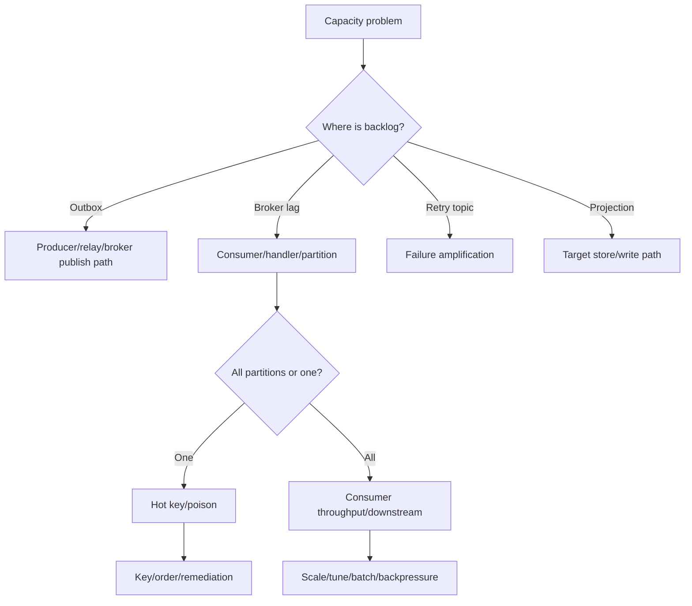

# Part 079 — Event-Driven Performance, Capacity Planning, and Backpressure

Event-driven systems scale well when designed well.

They also fail in slow motion when capacity is misunderstood.

A synchronous API often fails as:

```text
request timeout
```

An event-driven system often fails as:

```text
producer still publishes
broker still stores
consumer slowly falls behind
projection becomes stale
retry topics grow
DLQ ages
outbox fills database
workflow waits for hours
```

This is why event-driven performance is not just throughput.

It is:

```text
throughput
+ latency
+ lag
+ freshness
+ backlog
+ retry amplification
+ replay capacity
+ state store recovery
+ operational backpressure
```

A top-tier engineer does not ask only:

```text
How many messages per second can Kafka handle?
```

They ask:

```text
How much end-to-end event load can the business capability safely absorb while keeping freshness, correctness, and recovery SLOs?
```

---

## 1. Performance Mental Model

Event-driven performance path:


Every stage has capacity.

If any stage is slower than incoming rate, backlog grows.

Backlog is not automatically failure.

Backlog is failure when it violates freshness, storage, or business completion expectations.

---

## 2. Throughput Is a Pipeline Property

End-to-end sustainable throughput is approximately:

```text
minimum capacity of all stages
```

Example:

| Stage | Capacity |
|---|---:|
| producer serialization | 50k records/s |
| broker topic write | 100k records/s |
| consumer fetch | 80k records/s |
| consumer handler | 10k records/s |
| projection DB writes | 8k records/s |

The system capacity is not 100k records/s.

It is closer to 8k records/s.

Kafka may be fine.

Your projection database may be the bottleneck.

Do not benchmark broker only and call the system scalable.

---

## 3. Latency vs Lag vs Freshness

### Latency

Time to process one message.

```text
event received -> handler done
```

### Lag

How far consumer is behind broker.

```text
latest offset - committed offset
```

### Freshness

How stale the business view is.

```text
now - event time of oldest unprocessed event
```

A system can have:

```text
low per-message latency
high lag
```

if it is processing fast but not fast enough.

A system can have:

```text
low offset lag
high business staleness
```

if each message represents an old delayed event.

Measure all three.

---

## 4. Capacity Equation

For each consumer group:

```text
required_processing_rate >= incoming_rate + replay_rate + retry_rate
```

Where:

```text
incoming_rate = producer event rate
replay_rate = backfill/rebuild traffic
retry_rate = additional attempts from failures
```

If:

```text
incoming_rate = 10,000/min
retry_rate = 2,000/min
replay_rate = 5,000/min
```

then consumer must process:

```text
17,000/min
```

or lag grows.

Capacity planning must include abnormal but expected modes:

- deploy/restart catch-up,
- replay,
- DLQ replay,
- downstream slowness,
- retry storm,
- traffic spike,
- one hot partition.

---

## 5. Little's Law for Consumer Concurrency

Approximate:

```text
concurrency ≈ throughput × processing_time
```

If handler takes 100 ms and you need 1000 records/s:

```text
concurrency ≈ 1000 × 0.1 = 100 concurrent handlers
```

But Kafka partition assignment limits consumer parallelism.

If topic has 12 partitions:

```text
active partition consumers <= 12 per consumer group
```

To get more parallelism, you may need:

- more partitions,
- faster handler,
- batch processing,
- internal per-key parallelism,
- different topic design,
- remove downstream bottleneck,
- separate hot keys.

Do not add consumer instances beyond partition count and expect magic.

---

## 6. Partition Count and Capacity

Partitions enable parallelism.

But partitions also cost resources.

More partitions can improve:

- producer parallelism,
- consumer parallelism,
- broker distribution,
- failure isolation.

More partitions can increase:

- file handles,
- metadata,
- memory,
- rebalance cost,
- controller/broker overhead,
- recovery time,
- operational complexity.

Partition count is not a simple "more is better."

Choose based on:

- target throughput,
- key distribution,
- consumer parallelism,
- retention,
- broker count,
- future growth,
- ordering requirements,
- hot key risk.

Partition count is part of topic capacity contract.

---

## 7. Hot Partition Capacity

A topic with 48 partitions can still bottleneck on one partition.

Example:

```text
tenant-a creates 70% of traffic
key = tenantId
```

Result:

```text
one partition overloaded
47 partitions mostly idle
```

Symptoms:

- one partition lag high,
- one consumer instance hot,
- p99 processing high,
- one key dominates logs,
- scaling consumers does not help.

Mitigations:

- better key,
- split hot tenant,
- shard hot key with sub-key if ordering allows,
- separate topic,
- per-tenant throttling,
- backpressure hot producer,
- redesign ordering scope.

Hot partitions are capacity problems and data modeling problems.

---

## 8. Producer Performance

Producer performance depends on:

- serialization cost,
- record size,
- batching,
- compression,
- linger,
- partition distribution,
- acknowledgements,
- retries,
- buffer memory,
- network,
- broker latency,
- schema registry latency,
- outbox relay speed.

Important configs:

```properties
batch.size=32768
linger.ms=5
compression.type=zstd
buffer.memory=33554432
max.block.ms=60000
acks=all
enable.idempotence=true
delivery.timeout.ms=120000
```

Trade-off:

- higher batching improves throughput,
- linger adds latency,
- compression saves bytes but costs CPU,
- stronger acks improve durability but may add latency,
- retries improve resilience but can increase delivery latency.

Tune with real payloads.

---

## 9. Batching and Compression

Kafka is efficient partly because records are batched, and compressed batches can remain compressed through broker storage and network transfer.

Batching and compression interact:

```text
larger/more coherent batch -> better compression ratio
```

But:

```text
more linger -> more latency
more compression -> more CPU
```

Use cases:

| Workload | Possible tuning |
|---|---|
| user-facing business events | small linger, strong durability |
| telemetry/analytics | larger batch, compression |
| large JSON events | compression likely useful |
| tiny low-latency commands | minimal linger |
| cross-region replication | compression often valuable |

Measure:

- produce latency p99,
- broker bytes in,
- CPU,
- compression ratio,
- consumer CPU,
- end-to-end freshness.

---

## 10. Record Size

Large records hurt:

- producer memory,
- broker throughput,
- page cache efficiency,
- network,
- consumer memory,
- deserialization,
- DLQ storage,
- replay speed.

Set policy:

```yaml
maxRecordSizeBytes: 1048576
recommendedRecordSizeP95Bytes: 65536
```

For large payloads:

- store blob externally,
- publish reference,
- chunk intentionally,
- compress,
- split event,
- use compact snapshot topic carefully.

Do not let events become file transfer.

---

## 11. Schema Registry as Performance Dependency

If serialization depends on schema registry, registry availability and latency matter.

Mitigations:

- client-side schema cache,
- pre-register schemas in CI/deploy,
- avoid registering new schema on hot path when possible,
- monitor registry latency/errors,
- retry carefully,
- fail producer on incompatible schema.

Schema registry issues can become producer outage.

Treat it as critical infrastructure.

---

## 12. Outbox Relay Throughput

Outbox relay capacity depends on:

- pending query efficiency,
- DB locks,
- batch size,
- serialization,
- Kafka send latency,
- broker ack latency,
- marking published,
- concurrency,
- ordering constraints,
- cleanup overhead.

Metrics:

```text
outbox.publish.rate
outbox.pending.count
outbox.oldest_pending_age
outbox.claim.duration
outbox.mark_published.duration
outbox.publish.failure.rate
```

If business event production rate is 5000/min, relay sustainable publish rate must exceed 5000/min with margin.

Otherwise outbox age grows.

---

## 13. Outbox Backpressure

If outbox backlog grows, producer service database may fill.

Backpressure options:

- alert on oldest pending age,
- increase relay instances if safe,
- reduce low-priority event production,
- reject non-critical commands,
- throttle batch jobs,
- pause outbox-heavy workflows,
- fix broker/schema/ACL issue,
- clean published rows,
- protect disk.

Outbox backlog is not harmless.

It is deferred integration work stored in primary database.

---

## 14. Consumer Fetch Performance

Consumer performance depends on:

- fetch size,
- max poll records,
- deserialization,
- handler speed,
- DB writes,
- concurrency,
- batch processing,
- offset commit frequency,
- retry behavior,
- partition assignment,
- GC/memory,
- network.

Important configs:

```properties
max.poll.records=100
fetch.min.bytes=1
fetch.max.wait.ms=500
max.partition.fetch.bytes=1048576
max.poll.interval.ms=300000
```

Tuning depends on workload.

Large fetch/batch improves throughput but can increase latency and failure complexity.

Small fetch improves responsiveness but may waste overhead.

---

## 15. Handler Is Usually Bottleneck

Consumer handler may do:

- database writes,
- search index updates,
- HTTP/gRPC calls,
- validation,
- enrichment,
- idempotency table writes,
- DLQ publish,
- projection updates.

Often the bottleneck is not Kafka.

It is:

```text
consumer -> database/search/external dependency
```

Optimize:

- batch DB writes,
- use upsert efficiently,
- avoid per-message remote calls,
- use local snapshots,
- reduce transaction cost,
- tune indexes,
- use connection pools,
- limit concurrency to dependency capacity.

Do not blame Kafka before profiling handler.

---

## 16. Consumer Concurrency

Concurrency should be set from:

```text
partitions
handler cost
downstream capacity
ordering requirement
idempotency safety
```

Bad:

```yaml
concurrency: 100
```

with:

```text
DB pool = 20
partitions = 12
```

This creates contention and rebalances.

Good:

```yaml
concurrency: 12
dbPool: 30
maxPollRecords: 50
handlerP99Ms: 80
```

Measure.

Then tune.

---

## 17. Batch Processing

Batch processing improves throughput when the effect can be batched.

Examples:

- bulk insert projection rows,
- bulk index to OpenSearch,
- aggregate counters,
- batch update cache,
- batch write analytics.

But batch complicates:

- partial failure,
- ordering,
- offset commit,
- retry,
- duplicate handling,
- memory,
- transaction size.

Use batch when throughput gain justifies complexity.

Policy:

```text
batch size must match failure handling design
```

---

## 18. Offset Commit Cost

Committing offsets too frequently increases overhead.

Committing too rarely increases duplicate work after crash.

Balance:

- per-record ack for critical low-throughput,
- batch commit for high-throughput idempotent processing,
- transaction-aligned commit,
- commit after durable side effect.

Never optimize offset commits by committing before processing critical effects.

Correctness first.

---

## 19. Retry Amplification

Retry increases load.

Formula:

```text
attempt_rate = original_rate × average_attempts
```

If failure rate is 10% and each failure retries 3 times:

```text
attempt_rate = original_rate + 0.1 × original_rate × 3
```

Retry storm can overwhelm:

- consumer,
- broker,
- retry topics,
- database,
- external service,
- logs,
- metrics.

Use:

- bounded retry,
- jitter,
- circuit breaker,
- consumer pause,
- DLQ/parking,
- rate limit,
- backpressure.

Retry is capacity multiplier.

---

## 20. Replay Capacity

Replay is intentional overload.

If live rate is 5k records/s and replay adds 20k records/s, downstream must handle 25k records/s or live lag grows.

Replay policy:

```yaml
maxReplayRecordsPerSecond: 2000
pauseReplayWhenLiveLagSecondsAbove: 30
allowedWindow: "00:00-05:00"
```

Replay should be throttled by live SLO.

Backfill is not allowed to break production freshness unless explicitly approved.

---

## 21. Projection Capacity

Projection capacity depends on:

- event rate,
- write model shape,
- upsert cost,
- indexes,
- search cluster bulk capacity,
- version checks,
- enrichment,
- deletes,
- rebuild load,
- query load.

Projection write path competes with query path.

For search indexes:

- use bulk indexing,
- version updates,
- backoff on rate limit,
- monitor rejected writes,
- shadow rebuild for migration,
- throttle replay.

Projection lag is often caused by target store, not broker.

---

## 22. Kafka Streams Capacity

Kafka Streams capacity includes:

- input rate,
- processing topology cost,
- repartition traffic,
- state store size,
- changelog write/read,
- RocksDB compaction,
- restore time,
- output rate,
- transaction overhead if EOS,
- window retention.

Stateful processing can bottleneck on:

- disk,
- changelog topic,
- repartition topic,
- state restore,
- memory,
- CPU,
- network shuffle.

Monitor internal topics and state store metrics.

---

## 23. Broker Quotas and Fairness

Kafka supports quotas/rate limiting concepts in platforms/distributions to control producer/consumer resource usage.

Quotas protect clusters from noisy clients.

Use quotas for:

- tenant fairness,
- preventing one producer from flooding broker,
- limiting replay/backfill,
- isolating non-critical workloads,
- protecting shared clusters.

But quotas can cause:

- producer throttling,
- consumer slowdown,
- increased lag,
- unexpected latency.

Quotas must be visible to app teams.

If a producer is throttled, outbox may grow.

If a consumer is throttled, projection may go stale.

---

## 24. Backpressure Patterns

Backpressure options by stage:

| Stage | Backpressure |
|---|---|
| API command | reject/defer low-priority command |
| outbox | stop accepting non-critical writes |
| producer | fail direct publish or buffer less |
| broker | quotas, throttling |
| consumer | pause/resume partitions |
| retry | increase backoff, cap attempts |
| projection | throttle replay, bulk carefully |
| workflow | mark pending/manual review |
| upstream batch | slow or stop job |

Backpressure should be controlled and visible.

Silent backlog is not backpressure.

It is delayed failure.

---

## 25. Load Shedding in Async Systems

Load shedding can apply to event-driven work.

Examples:

- skip optional analytics event,
- drop best-effort telemetry,
- delay low-priority notification,
- pause non-critical replay,
- stop producing expensive enrichment events,
- shed low-priority consumer processing,
- move low-priority messages to delayed queue.

But do not shed:

- audit events,
- financial events,
- compliance events,
- state transition events,
- idempotency-critical commands,

unless policy explicitly allows.

Classify message priority.

---

## 26. Priority and Topic Design

Kafka does not provide classic priority queue semantics inside one ordered partition.

Options:

- separate topics by priority,
- separate consumer groups/resources,
- priority field plus consumer logic,
- separate partitions by priority if ordering allows,
- load shedding low-priority topics,
- quotas per priority.

Example:

```text
case-events-critical
case-events-analytics
```

or:

```text
notification-commands-high
notification-commands-low
```

Separate topics provide stronger operational isolation.

But topic sprawl must be governed.

---

## 27. Benchmarking Methodology

Benchmark with realistic:

- payload size,
- schema serialization,
- key distribution,
- partition count,
- producer acks/idempotence,
- compression,
- consumer handler logic,
- database/search target,
- retry behavior,
- DLQ path,
- replay/backfill load,
- TLS/security,
- observability enabled,
- deployment topology.

Avoid:

```text
tiny payload, localhost, no handler, no TLS, no schema, no DB
```

unless measuring only broker/client baseline.

Clearly state what benchmark measures.

---

## 28. Load Test Scenarios

Minimum scenarios:

1. normal steady-state,
2. peak expected load,
3. burst load,
4. hot partition,
5. broker restart,
6. consumer restart/rebalance,
7. downstream DB slow,
8. retry storm,
9. replay/backfill with live traffic,
10. DLQ flood,
11. outbox relay down then recovery,
12. projection rebuild.

Capacity without failure scenarios is optimistic fiction.

---

## 29. Capacity Envelope

Example:

```yaml
capability: case-search-projection

input:
  topic: case-events
  partitions: 48
  peakRecordsPerSecond: 5000
  recordSizeP95Bytes: 12000

consumer:
  groupId: search-indexer
  instances: 12
  concurrencyPerInstance: 4
  maxPollRecords: 100
  handlerP99Ms: 80

target:
  searchClusterBulkWritesPerSecond: 8000

slo:
  freshnessP99Seconds: 30

replay:
  maxReplayRecordsPerSecond: 1000
  pauseWhenFreshnessLagAboveSeconds: 45
```

This becomes a reviewable contract between application and platform.

---

## 30. JVM and GC

Java event consumers/producers should monitor:

- heap usage,
- allocation rate,
- GC pauses,
- direct memory,
- thread count,
- blocked threads,
- serialization CPU,
- deserialization CPU,
- object churn,
- byte buffer usage.

High-throughput consumers often allocate heavily.

Optimization options:

- reduce object mapping,
- avoid JSON when too expensive,
- batch writes,
- use efficient serializers,
- reuse buffers only if safe,
- tune heap,
- reduce payload size,
- profile handler.

Do not tune JVM blindly.

Profile first.

---

## 31. Database Pool Sizing

Consumer concurrency must respect database pool.

If:

```text
consumer concurrency = 50
db pool = 10
```

then 40 handlers may wait for DB connection.

This increases processing time and risks poll interval.

Sizing:

```text
dbPool >= active DB-bound handler concurrency
```

But increasing DB pool can overload database.

Often better:

- limit consumer concurrency,
- batch writes,
- optimize queries,
- reduce indexes,
- split workload,
- use projection-specific database.

---

## 32. Graceful Degradation

If projection lags, API can:

- show stale marker,
- return partial data,
- fallback to source service,
- delay response until min version,
- show "updating" status,
- temporarily disable expensive filter,
- route to cached previous view.

This is user-facing backpressure.

Do not hide stale data for critical decisions.

Freshness is part of API contract.

---

## 33. Observability for Capacity

Capacity dashboard:

- produce rate,
- consume rate,
- lag seconds,
- lag by partition,
- retry attempt rate,
- DLQ rate,
- outbox pending age,
- handler p99,
- DB/search write latency,
- consumer concurrency,
- rebalance rate,
- hot partition,
- record size p95/p99,
- broker throttle time,
- JVM CPU/GC,
- replay rate.

Capacity incidents are multi-layer.

Dashboard must show the whole pipeline.

---

## 34. Alerting for Backpressure

Alerts:

| Alert | Meaning |
|---|---|
| produce rate > capacity | lag soon |
| lag seconds > freshness SLO | user impact |
| outbox age high | events delayed |
| retry attempt rate high | hidden amplification |
| broker throttling high | quota/capacity issue |
| one partition lag high | hot key/poison |
| DB write p99 high | target bottleneck |
| replay impacts live lag | throttle replay |
| state restore too long | recovery risk |
| record size p99 high | payload/schema issue |

Alert on leading indicators before data loss or freshness breach.

---

## 35. Production Performance Policy Template

```yaml
eventPerformance:
  topics:
    case-events:
      partitions: 48
      maxRecordSizeBytes: 1048576
      recommendedRecordSizeP95Bytes: 65536
      keyDistributionReview: true

  producer:
    acks: all
    idempotence: true
    compression: zstd
    lingerMs: 5
    batchSizeBytes: 32768
    outbox:
      pendingAgeAlertSeconds: 60
      relayMinThroughputRecordsPerSecond: 6000

  consumers:
    search-indexer:
      targetThroughputRecordsPerSecond: 5000
      freshnessSloSeconds: 30
      maxPollRecords: 100
      concurrency: 48
      retryAmplificationAlertRatio: 0.2
      replay:
        maxRecordsPerSecond: 1000
        pauseWhenLiveLagSecondsAbove: 45

  capacityTesting:
    peakLoadRequired: true
    retryStormRequired: true
    replayWithLiveTrafficRequired: true
    hotPartitionRequired: true
```

Policy makes capacity explicit.

---

## 36. Common Anti-Patterns

### 36.1 Broker-only benchmark

Handler/projection bottleneck ignored.

### 36.2 Adding consumers beyond partition count

No additional parallelism.

### 36.3 More concurrency than DB can handle

Self-inflicted latency.

### 36.4 No replay throttle

Backfill breaks production.

### 36.5 Ignoring retry amplification

Failure traffic surprises system.

### 36.6 Average lag only

Hot partition hidden.

### 36.7 No outbox age alert

Publication delay invisible.

### 36.8 Compression without CPU measurement

p99 worsens.

### 36.9 Record size unlimited

Memory and broker pressure.

### 36.10 No capacity envelope

Performance decisions become folklore.

---

## 37. Decision Model



Find the bottleneck before tuning.

---

## 38. Design Checklist

Before declaring event-driven capacity ready:

- What is peak produce rate?
- What is record size distribution?
- What is partition count and key distribution?
- What is sustainable consumer throughput?
- What is downstream DB/search capacity?
- What is freshness SLO?
- What is replay allowance?
- What is retry amplification budget?
- What happens during broker/consumer restart?
- What happens during downstream outage?
- Are hot partitions monitored?
- Are quotas/throttling visible?
- Is outbox backlog handled?
- Is replay throttled?
- Are load tests realistic?
- Is capacity envelope documented?
- Are alerts tied to freshness and backlog?

---

## 39. The Real Lesson

Event-driven performance is not "Kafka is fast."

It is the whole business pipeline staying within freshness and correctness limits.

Production capacity requires:

```text
right partitioning
+ efficient producer
+ bounded record size
+ tuned consumer
+ downstream capacity
+ retry budget
+ replay throttle
+ backpressure
+ observability
+ load tests
```

If you cannot explain how backlog grows and drains, you do not yet understand the system's capacity.

---

## References

- Apache Kafka Documentation: https://kafka.apache.org/documentation/
- Apache Kafka Design — Efficiency, Batching, and Compression: https://kafka.apache.org/42/design/design/
- Apache Kafka Producer Configs: https://kafka.apache.org/41/configuration/producer-configs/
- Apache Kafka Operations — Monitoring: https://kafka.apache.org/0101/operations/monitoring/
- Spring Kafka Monitoring: https://docs.spring.io/spring-kafka/reference/kafka/micrometer.html
- Confluent Kafka Design — Quotas: https://docs.confluent.io/kafka/design/quotas.html
