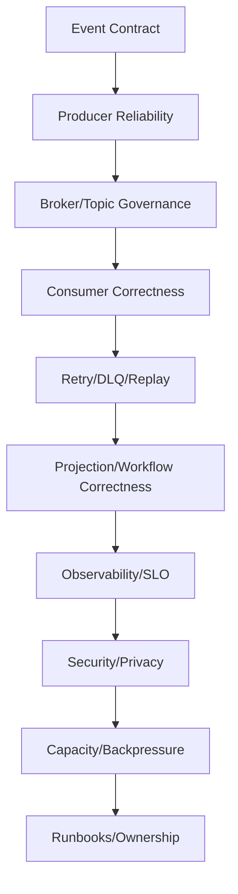

# Part 080 — Event-Driven Production Readiness Blueprint

This part closes the event-driven communication phase.

Event-driven architecture is not "use Kafka."

It is a governed distributed communication model with durable contracts, asynchronous correctness, and operational ownership.

A system is event-ready when:

```text
messages can be produced, evolved, consumed, retried, replayed, secured, observed, and operated safely
```

---

## 1. Event-Driven Readiness Model



Sending and receiving is not enough.

The full lifecycle must be safe.

---

## 2. When Event-Driven Communication Fits

Use events when you need:

- temporal decoupling,
- durable handoff,
- fan-out,
- eventual consistency,
- background processing,
- projection/read model updates,
- workflow integration,
- load leveling,
- replay/backfill,
- independent consumer scaling.

Avoid events when:

- caller needs immediate authoritative answer,
- strong consistency across boundary is required,
- duplicates cannot be made safe,
- no team owns DLQ/replay,
- event schema cannot be governed,
- privacy risk is unacceptable.

---

## 3. Event Contract Readiness

Every event must define:

- event type,
- topic/channel,
- owner,
- producer,
- schema,
- version,
- key,
- ordering scope,
- event ID,
- timestamp semantics,
- correlation/causation,
- compatibility mode,
- examples/fixtures,
- data classification,
- retention,
- replay policy,
- known consumers.

Contract artifact:

```text
AsyncAPI + schema registry + fixtures + catalog entry
```

---

## 4. Topic Readiness

Every topic should define:

```yaml
topic: case-events
owner: case-platform
purpose: case aggregate lifecycle events
partitions: 48
retention: 7d
cleanupPolicy: delete
key:
  field: caseId
ordering:
  scope: per-case
schema:
  format: json-schema
  compatibility: full-transitive
classification: internal-confidential
monitoring: required
```

Topic without owner/key/retention/schema policy should be blocked.

---

## 5. Producer Readiness

Producer checklist:

- emits correct event type,
- validates topic/key/header policy,
- uses stable event ID,
- uses schema-validated payload,
- includes correlation/causation,
- never puts secrets in payload/header,
- writes outbox row with business transaction for critical events,
- send failures monitored,
- outbox pending age monitored,
- contract tests verify topic/key/header/payload.

The producer publishes facts consumers can trust.

---

## 6. Outbox Readiness

Outbox checklist:

- business state and outbox row in same transaction,
- event ID generated once,
- message key stored explicitly,
- event type/version stored,
- relay marks published only after broker ack,
- duplicate publish possible and safe,
- pending count and oldest age monitored,
- cleanup implemented,
- ordering policy documented,
- consumers idempotent.

Outbox prevents missing events.

It does not remove duplicate handling.

---

## 7. Consumer Readiness

Consumer checklist:

- stable group ID,
- auto commit disabled for critical processing,
- ack after durable effect,
- idempotent processing,
- duplicate test,
- schema version handling,
- retry classification,
- DLQ/parking policy,
- ordering/sequence gap policy,
- lag metrics,
- graceful shutdown,
- replay policy,
- integration tests with real broker.

A consumer is production-ready only when duplicate delivery is safe.

---

## 8. Retry/DLQ Readiness

Retry/DLQ checklist:

- failure taxonomy defined,
- retryable exceptions classified,
- non-retryable exceptions classified,
- retry bounded,
- backoff/jitter configured,
- retry preserves key/message ID,
- DLQ preserves original metadata,
- DLQ owner defined,
- DLQ alerting enabled,
- DLQ replay tool available,
- DLQ access restricted.

A DLQ without replay/remediation is a backlog graveyard.

---

## 9. Schema Governance Readiness

Schema readiness:

- compatibility mode chosen,
- CI compatibility checks,
- semantic review process,
- old fixtures retained,
- unknown enum policy,
- breaking change process,
- subject naming documented,
- producer/consumer tests use real schema,
- privacy field scan,
- AsyncAPI updated.

Schema evolution must support rolling deploy and replay.

---

## 10. Projection Readiness

Projection readiness:

- source topics documented,
- source of truth clear,
- consistency model documented,
- lag/freshness SLO,
- version/idempotency checks,
- sequence gap handling,
- duplicate handling,
- delete/tombstone handling,
- rebuild supported,
- stale read contract.

A projection is derived state.

It must be rebuildable or explicitly accepted as not rebuildable.

---

## 11. Replay Readiness

Replay readiness:

- topic retention sufficient,
- old schema versions supported,
- replay-safe consumers identified,
- side-effect consumers protected,
- replay throttled,
- replay job audited,
- DLQ replay preserves IDs/keys,
- privacy deletion honored,
- approval process for sensitive topics,
- historical fixtures tested.

Offset reset is production change.

---

## 12. Saga/Workflow Readiness

Saga readiness:

- workflow owner defined,
- choreography/orchestration decision documented,
- local transactions identified,
- outbox/inbox used,
- workflow ID stable,
- command IDs stable,
- participant idempotency required,
- timeout modeled,
- compensation modeled,
- irreversible steps identified,
- workflow state persisted,
- manual intervention state,
- workflow dashboard,
- state-machine tests.

Cross-service workflow without state is hard to operate.

---

## 13. Security/Privacy Readiness

Security readiness:

- encrypted broker connections,
- one principal per service,
- least-privilege ACLs,
- producer write restricted to owner,
- consumer group ACLs,
- topic classification,
- PII minimized,
- secrets forbidden,
- DLQ protected,
- schema registry secured,
- replay audited,
- logs redacted,
- ACL drift detection,
- retention approved.

Event-driven systems distribute data.

Security must cover the full lifecycle.

---

## 14. Observability Readiness

Observability readiness:

- producer metrics,
- outbox metrics,
- broker/topic metrics,
- consumer lag by partition,
- processing outcomes,
- retry/DLQ metrics,
- inbox backlog,
- projection freshness,
- workflow state,
- replay/backfill metrics,
- trace/correlation/causation propagation,
- structured redacted logs,
- dashboards,
- SLOs,
- runbooks.

Async health is flow health.

---

## 15. Capacity Readiness

Capacity readiness:

- peak produce rate known,
- record size distribution known,
- partition/key distribution analyzed,
- consumer throughput measured,
- downstream capacity measured,
- retry amplification budget,
- replay throttle,
- outbox relay capacity,
- projection write capacity,
- hot partition test,
- failure load test,
- capacity envelope documented.

If backlog cannot drain, the system is not ready.

---

## 16. Testing Readiness

Required tests:

```text
schema tests
producer contract tests
consumer fixture tests
idempotency tests
ordering/gap tests
retry/DLQ tests
outbox/inbox tests
replay tests
projection rebuild tests
Spring Kafka/Testcontainers integration tests
workflow state-machine tests
security/redaction tests
load/failure tests
```

Do not rely on E2E tests alone.

---

## 17. Operational Ownership

Define owners:

| Artifact | Owner |
|---|---|
| topic | domain/platform team |
| schema | producer/API owner |
| producer | service owner |
| consumer group | consuming service owner |
| DLQ | consumer owner |
| projection | read model owner |
| workflow | workflow owner |
| broker/schema registry | platform |
| ACLs | platform/security |
| replay job | requesting team + owner approval |

No owner means no readiness.

---

## 18. Migration and Rollout

Migration to events:

1. define event contract,
2. publish event via outbox,
3. build passive consumer/projection,
4. compare with old behavior,
5. canary consumer,
6. gradually cut over,
7. deprecate old path.

Do not replace sync call with event overnight.

---

## 19. Phase 7 Final Checklist

- Is async communication the right fit?
- Is event contract explicit?
- Is topic governed?
- Is producer reliable?
- Is outbox used for critical events?
- Is event ID stable?
- Is key correct and tested?
- Is consumer idempotent?
- Is ack timing safe?
- Is retry bounded?
- Is DLQ owned?
- Is schema evolution governed?
- Is ordering scope explicit?
- Is replay safe?
- Are projections rebuildable?
- Are sagas observable?
- Is security/privacy reviewed?
- Are metrics and SLOs ready?
- Is capacity tested?
- Are runbooks ready?
- Is ownership clear?

---

## 20. The Real Lesson

Event-driven communication gives:

```text
temporal decoupling
+ durable handoff
+ fan-out
+ replay
+ independent scaling
+ projections
+ workflow integration
```

But production requires:

```text
delivery semantics
+ outbox
+ idempotent consumer
+ schema governance
+ ordering policy
+ retry/DLQ
+ replay safety
+ observability
+ security
+ capacity planning
+ ownership
```

Messaging is not a shortcut around distributed systems complexity.

It changes the shape of that complexity.

---

## References

- Apache Kafka Documentation: https://kafka.apache.org/documentation/
- Apache Kafka Operations — Monitoring: https://kafka.apache.org/0101/operations/monitoring/
- Apache Kafka Security — Authorization and ACLs: https://kafka.apache.org/43/security/authorization-and-acls/
- Spring Kafka Reference: https://docs.spring.io/spring-kafka/reference/
- AsyncAPI Specification: https://www.asyncapi.com/docs/reference/specification/latest
- Microservices.io — Transactional Outbox Pattern: https://microservices.io/patterns/data/transactional-outbox.html
- Microservices.io — Saga Pattern: https://microservices.io/patterns/data/saga.html
