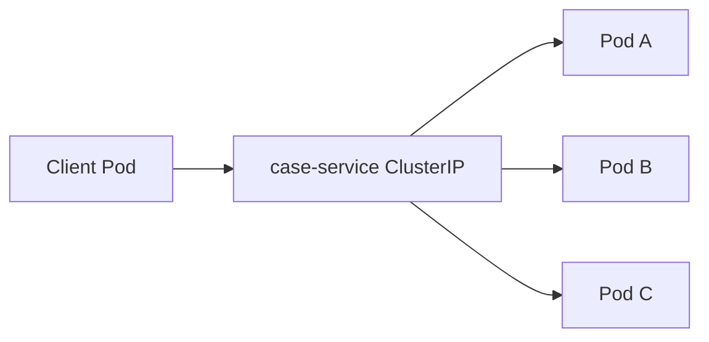
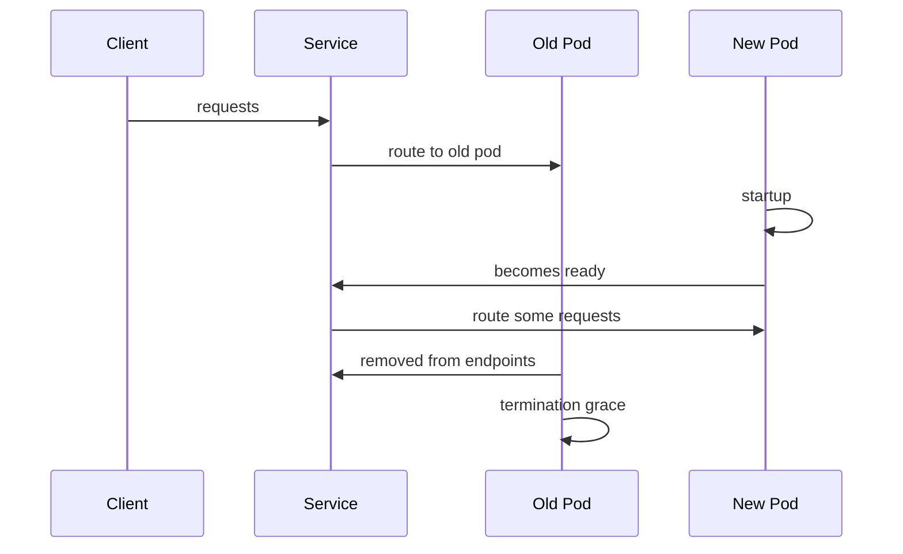
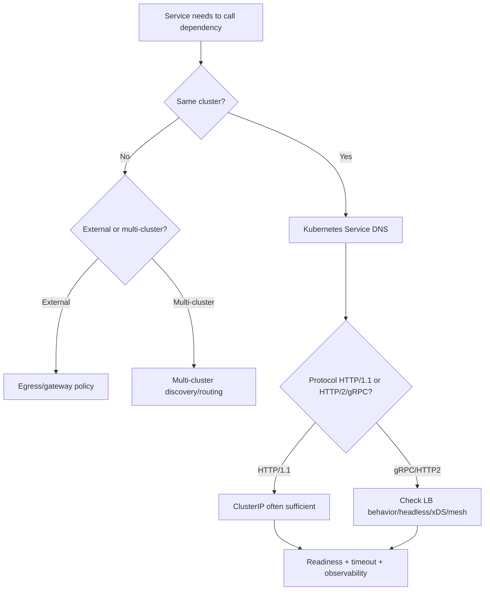

# Part 081 — Service Discovery, DNS, and Internal Routing Fundamentals

So far, we have studied direct HTTP clients, gRPC clients, and asynchronous messaging.

Now we move to the platform layer that helps services find and reach each other.

In a microservice system, a client usually should not call:

```text
10.42.3.17:8080
```

because pods/containers/instances are ephemeral.

Instances move.

Deployments roll.

Pods die.

Nodes fail.

Autoscaling changes capacity.

Service discovery answers:

```text
What stable name should a service call, and how does that name route to healthy backends?
```

Routing answers:

```text
Which backend instance receives the request, under which policy, with which readiness and load-balancing behavior?
```

A top-tier engineer knows that service discovery is not merely "DNS works."

It is a production contract between application, platform, DNS, load balancer, readiness, client behavior, and failure handling.

---

## 1. Service Discovery Mental Model


The client wants a logical dependency:

```text
case-service
```

The platform maps it to live network targets.

Important questions:

- what name does the client use?
- is name resolved to a virtual IP or endpoint list?
- who load balances?
- how are unhealthy pods removed?
- how quickly do changes propagate?
- how does the JVM cache DNS?
- how do connection pools react to backend changes?
- how does readiness affect routing?
- what happens during deploy?
- what happens if DNS fails?

Service discovery is on the hot path of communication reliability.

---

## 2. Stable Logical Names

Microservices should depend on stable logical names.

Example:

```yaml
dependencies:
  case-service:
    baseUrl: http://case-service.case.svc.cluster.local:8080
```

or shorter in same namespace/search domain:

```text
http://case-service:8080
```

Do not hardcode pod IPs.

Do not hardcode node IPs.

Do not hardcode individual instance hostnames unless the system is explicitly stateful and designed that way.

The logical name is part of dependency configuration.

---

## 3. Kubernetes Service

In Kubernetes, a Service exposes a set of Pods as a stable network endpoint.

A Service selects Pods by labels.

```yaml
apiVersion: v1
kind: Service
metadata:
  name: case-service
  namespace: case
spec:
  selector:
    app: case-service
  ports:
    - name: http
      port: 8080
      targetPort: 8080
```

Clients call:

```text
case-service.case.svc.cluster.local:8080
```

The Service abstracts away changing Pod IPs.

This is the basic internal discovery model in Kubernetes.

---

## 4. DNS for Services

Kubernetes creates DNS records for Services and Pods.

Typical Service DNS name:

```text
my-service.my-namespace.svc.cluster.local
```

For a Service named `case-service` in namespace `case`:

```text
case-service.case.svc.cluster.local
```

Within the same namespace, shorter names may resolve through search domains:

```text
case-service
```

For clarity in configuration, fully qualified names are often safer across namespaces.

---

## 5. ClusterIP Service

A normal Kubernetes Service gets a virtual IP called ClusterIP.

Clients resolve DNS to ClusterIP.

Then the platform routes traffic to backend Pods.



Who performs balancing depends on Kubernetes networking implementation.

Commonly kube-proxy/eBPF/IPVS/iptables or platform dataplane routes traffic.

Application sees one stable host.

This is simple and widely used.

---

## 6. Headless Service

A headless Service has:

```yaml
clusterIP: None
```

Instead of returning a single ClusterIP, DNS can return individual endpoint addresses.

Use cases:

- stateful systems,
- client-side load balancing,
- gRPC with endpoint-aware balancing,
- service mesh/data plane use cases,
- direct pod discovery where appropriate.

Example:

```yaml
apiVersion: v1
kind: Service
metadata:
  name: case-service-headless
spec:
  clusterIP: None
  selector:
    app: case-service
  ports:
    - port: 8080
```

Client DNS may return multiple A/AAAA records.

But this shifts more behavior to client/DNS caching/load balancing.

Use carefully.

---

## 7. Service Discovery Is Not Health Checking Alone

A Pod can be:

- running,
- not ready,
- terminating,
- overloaded,
- unhealthy,
- slow,
- returning 500,
- failing only one dependency.

Kubernetes readiness controls whether Pod is considered ready for Service endpoints.

Example:

```yaml
readinessProbe:
  httpGet:
    path: /ready
    port: 8080
  initialDelaySeconds: 10
  periodSeconds: 5
```

If readiness is false, traffic should not be routed to that Pod through the Service.

Readiness is part of service discovery.

Bad readiness causes bad routing.

---

## 8. Readiness vs Liveness

Readiness:

```text
should this pod receive traffic?
```

Liveness:

```text
should this pod be restarted?
```

Do not confuse them.

If downstream database is temporarily unavailable, should the pod be killed?

Maybe not.

But should it receive traffic?

Maybe depends on operation.

Readiness should reflect whether the service can safely handle normal traffic.

Liveness should detect unrecoverable process failure.

Bad liveness probes cause restart storms.

Bad readiness probes route traffic to broken pods or remove too many pods.

---

## 9. Startup Probe

Startup probe protects slow-starting applications.

Example:

```yaml
startupProbe:
  httpGet:
    path: /started
    port: 8080
  failureThreshold: 30
  periodSeconds: 10
```

Use when application startup is slow due to:

- JVM warmup,
- migrations,
- cache loading,
- schema registry,
- dependency initialization.

Without startup probe, liveness may kill app before it starts.

Communication readiness begins before first request.

---

## 10. EndpointSlice

Kubernetes represents Service backends using EndpointSlice resources.

EndpointSlices scale endpoint tracking and include endpoint readiness/conditions.

For application engineers, the key concept is:

```text
Service routes to a dynamic set of endpoints
```

The endpoint set changes during:

- deployments,
- autoscaling,
- pod failures,
- node failures,
- readiness transitions.

Clients and connection pools must tolerate backend churn.

---

## 11. Rolling Deployment Behavior

During rolling deploy:



Production requirements:

- new pod not ready until actually ready,
- old pod stops receiving new traffic before shutdown,
- graceful shutdown drains in-flight requests,
- client retries only safe operations,
- connection pools handle closed connections,
- load balancer endpoint updates propagate.

Rolling deploy is a communication event.

Test it.

---

## 12. Graceful Shutdown

Java service shutdown should:

1. receive SIGTERM,
2. mark readiness false,
3. stop accepting new requests,
4. finish in-flight requests within grace period,
5. close server,
6. close clients/channels,
7. flush telemetry,
8. exit.

Kubernetes:

```yaml
terminationGracePeriodSeconds: 30
```

Application:

```java
Runtime.getRuntime().addShutdownHook(new Thread(() -> {
    server.stopAcceptingNewRequests();
    server.awaitInFlight(Duration.ofSeconds(25));
}));
```

Frameworks like Spring Boot provide graceful shutdown support.

Configure and test it.

---

## 13. DNS Caching and JVM

Java caches DNS results.

This can be good for performance.

It can be bad when endpoint DNS records change.

Important:

- JVM DNS TTL can be controlled by security properties,
- OS resolver and CoreDNS also cache,
- client libraries may cache addresses,
- connection pools cache connections,
- gRPC channels cache resolved endpoints according to resolver behavior.

If service discovery changes but client holds old connections forever, traffic may keep hitting terminating/unhealthy endpoints until connections fail.

Understand your client stack.

For Kubernetes ClusterIP Services, DNS name resolves to stable ClusterIP, so endpoint churn is hidden behind service routing.

For headless Services, DNS caching matters much more.

---

## 14. Connection Pooling and Discovery

HTTP client connection pools keep connections to resolved addresses.

If using ClusterIP:

```text
connection to ClusterIP
platform routes new connections/backend flows
```

If using headless endpoints:

```text
connections to individual pod IPs
```

Pod IPs can disappear.

Connection pool must handle:

- connection reset,
- EOF,
- stale connection,
- DNS refresh,
- backend termination,
- max connection lifetime,
- idle eviction.

For long-lived HTTP/2/gRPC connections, balancing behavior is even more important.

A single long-lived connection can stick to one backend if topology is wrong.

---

## 15. Client-Side vs Platform-Side Load Balancing

### Platform-side balancing

Client calls Service ClusterIP.

Platform/load balancer selects backend.

Pros:

- simple client,
- common Kubernetes behavior,
- endpoint updates handled by platform.

Cons:

- connection-level stickiness may affect HTTP/2,
- less client-aware policy,
- limited per-request signals.

### Client-side balancing

Client receives endpoint list and selects backend.

Pros:

- endpoint-aware,
- can do per-request/pick policies,
- useful for gRPC/headless/xDS.

Cons:

- client complexity,
- DNS caching,
- endpoint churn handling,
- more config.

Choose based on protocol and platform.

---

## 16. HTTP/1.1 vs HTTP/2 Impact

HTTP/1.1 often opens multiple connections.

Load can distribute across backends through connection creation.

HTTP/2 multiplexes many streams on one connection.

If one HTTP/2 connection goes to one backend through ClusterIP/proxy behavior, traffic may concentrate.

For gRPC:

- use appropriate load balancing policy,
- understand `pick_first` vs `round_robin`,
- consider headless service or xDS/service mesh,
- monitor backend distribution.

Protocol affects discovery and routing.

---

## 17. ExternalName Service

Kubernetes `ExternalName` maps a Service to an external DNS name.

Example:

```yaml
apiVersion: v1
kind: Service
metadata:
  name: payment-provider
spec:
  type: ExternalName
  externalName: api.payment.example.com
```

Use carefully.

Risks:

- no normal Service endpoints/readiness,
- DNS behavior differs,
- security/TLS hostnames matter,
- policy/proxy support may vary,
- harder observability,
- egress governance concerns.

For external dependencies, consider explicit egress proxy/gateway policy rather than hiding all details behind ExternalName.

---

## 18. Service Discovery Failure Modes

Failures:

| Failure | Effect |
|---|---|
| DNS unavailable | clients cannot resolve new names |
| DNS slow | request startup latency |
| stale DNS | client uses old endpoint |
| wrong Service selector | no endpoints or wrong pods |
| readiness misconfigured | traffic to broken pods |
| endpoint churn | connection resets |
| ClusterIP routing issue | service unreachable |
| network policy block | connection timeout |
| port mismatch | connection refused |
| cross-namespace wrong name | calls wrong service or fails |
| headless caching | stale pod IPs |

Debugging service discovery requires platform visibility and client logs.

---

## 19. Wrong Selector Incident

Example Service:

```yaml
selector:
  app: case-service
```

Deployment Pods:

```yaml
labels:
  app: case-api
```

Result:

```text
Service has no endpoints
clients fail
```

Checklist:

```bash
kubectl get svc case-service -n case
kubectl get endpointslices -n case -l kubernetes.io/service-name=case-service
kubectl get pods -n case --show-labels
```

Application symptom may be connection timeout/refused.

Root cause is platform object mismatch.

---

## 20. Readiness Incident

Readiness returns 200 too early.

Traffic routes to pod before:

- server started,
- DB pool ready,
- schema loaded,
- cache warmed,
- gRPC server bound,
- migrations complete.

Symptom:

```text
errors spike during deploy
```

Fix:

- make readiness check real,
- add startup probe,
- enable graceful shutdown,
- test rolling deploy.

Readiness is production API of the service to the platform.

---

## 21. DNS Observability

Metrics/logs:

```text
dns.lookup.duration
dns.lookup.failures
dns.cache.hit
dns.cache.ttl
coredns.request.count
coredns.error.count
coredns.latency
```

Application logs should include dependency host when connection fails.

But avoid logging sensitive URLs/tokens.

Platform should monitor CoreDNS or DNS provider health.

DNS issues can cause system-wide incidents.

---

## 22. Service Routing Observability

Observe:

- request rate by dependency,
- error rate by dependency,
- connection failures,
- connection resets,
- backend distribution,
- p95/p99 latency,
- retries,
- circuit breaker state,
- endpoint count,
- readiness transitions,
- deploy correlation.

For Kubernetes:

- Service endpoint count,
- EndpointSlice changes,
- Pod readiness,
- Pod termination,
- network policy denies if available.

For gRPC:

- channel state,
- subchannel/backend distribution,
- resolver errors.

---

## 23. Debugging Internal Call Failure

When `order-service` cannot call `case-service`:

1. Is the Service name correct?
2. Is namespace correct?
3. Does DNS resolve?
4. Does Service have endpoints?
5. Are Pods ready?
6. Is target port correct?
7. Is network policy blocking?
8. Is mTLS/mesh policy blocking?
9. Is application listening on target port?
10. Are connection pools using stale endpoints?
11. Are pods terminating?
12. Is load balancer/proxy healthy?

Do not start by changing timeouts.

Find the layer.

---

## 24. Java Client Configuration

Dependency config:

```yaml
dependencies:
  case-service:
    base-url: http://case-service.case.svc.cluster.local:8080
    connect-timeout-ms: 100
    response-timeout-ms: 300
    max-connections: 200
    max-idle-time-ms: 30000
    max-connection-life-ms: 300000
```

For gRPC:

```yaml
dependencies:
  case-service:
    target: dns:///case-service.case.svc.cluster.local:9090
    load-balancing-policy: round_robin
    deadline-ms: 300
```

Configuration should be explicit.

Service discovery does not remove timeout/resilience policy.

---

## 25. NetworkPolicy

Kubernetes NetworkPolicy can restrict pod-to-pod traffic.

Example idea:

```yaml
allow order-service -> case-service on 8080
deny others
```

Network policies improve security.

They also create failure modes:

- connection timeout,
- unexpected deny after label change,
- namespace selector mismatch,
- egress DNS blocked.

Network policy should be tested.

Service discovery success does not mean traffic is permitted.

---

## 26. Cross-Namespace Calls

Kubernetes DNS short name behavior depends on namespace search path.

From namespace `order`, calling:

```text
case-service
```

looks for:

```text
case-service.order.svc.cluster.local
```

If actual service is in namespace `case`, call:

```text
case-service.case.svc.cluster.local
```

or:

```text
case-service.case
```

Use explicit namespace for cross-namespace dependencies.

Avoid accidental same-namespace service collision.

---

## 27. Multi-Cluster Discovery

Multi-cluster service discovery is harder.

Questions:

- is service local or remote?
- how is failover handled?
- does DNS return multiple clusters?
- what is latency?
- is identity trusted across clusters?
- are retries safe across regions?
- is data residency allowed?
- how are endpoints health-checked?
- how is traffic split?

Do not treat multi-cluster as normal DNS.

It is architecture-level routing.

---

## 28. Service Registry Outside Kubernetes

Non-Kubernetes platforms may use:

- Consul,
- Eureka,
- cloud service discovery,
- DNS SRV records,
- load balancer target groups,
- service mesh registry,
- custom registry.

Concepts remain:

- service name,
- instances/endpoints,
- health,
- metadata,
- load balancing,
- TTL,
- client caching,
- failure handling.

Avoid coupling application business logic to registry API unless necessary.

Use a dependency abstraction.

---

## 29. Testing Service Discovery

Test layers:

| Test | Purpose |
|---|---|
| unit config test | dependency URL/target present |
| contract environment test | service name resolves |
| readiness test | pod not ready until app can serve |
| rolling deploy test | no error spike |
| network policy test | allowed/denied paths |
| DNS failure drill | client behavior |
| endpoint churn test | connection pool behavior |
| gRPC balancing test | backend distribution |

A service that only works with stable endpoints is not cloud-native ready.

---

## 30. Kubernetes Manifest Test

Use policy tests:

```yaml
assertions:
  - service has selector
  - service targetPort matches containerPort
  - deployment has readinessProbe
  - deployment has startupProbe if startup > threshold
  - terminationGracePeriodSeconds >= graceful shutdown budget
  - network policy allows required dependencies
```

Tools can enforce these through CI/admission policy.

Platform communication readiness begins at manifests.

---

## 31. Rolling Deploy Test

Test:

1. start load against Service,
2. roll deployment,
3. observe errors,
4. verify old pods drain,
5. verify new pods become ready before traffic,
6. verify p99 acceptable,
7. verify no requests hit terminating pods after grace.

This catches readiness/shutdown mistakes.

Do this before production for critical services.

---

## 32. Production Policy Template

```yaml
serviceDiscovery:
  dependencies:
    case-service:
      discovery:
        mechanism: kubernetes-service-dns
        serviceName: case-service.case.svc.cluster.local
        serviceType: ClusterIP
      protocol: http
      port: 8080
      readinessRequired: true
      gracefulShutdownRequired: true
      crossNamespace: true
      networkPolicyRequired: true
      observability:
        dnsErrors: true
        endpointCount: true
        dependencyLatency: true
        backendDistribution: true
      client:
        connectTimeoutMs: 100
        responseTimeoutMs: 300
        maxConnectionLifeMs: 300000
```

Discovery policy belongs next to client policy.

---

## 33. Common Anti-Patterns

### 33.1 Hardcoded Pod IP

Breaks on restart/reschedule.

### 33.2 Readiness always returns 200

Traffic goes to broken pod.

### 33.3 Liveness checks dependencies

Temporary dependency issue restarts all pods.

### 33.4 No graceful shutdown

Terminating pods drop in-flight requests.

### 33.5 Headless service without DNS/client caching analysis

Stale endpoint calls.

### 33.6 Cross-namespace short name

Wrong service or failed resolution.

### 33.7 Assuming DNS success means network allowed

NetworkPolicy/mTLS may still block.

### 33.8 Ignoring HTTP/2 connection stickiness

gRPC load imbalance.

### 33.9 No endpoint count alert

Service with zero ready endpoints discovered by clients.

### 33.10 Changing labels without Service selector review

Traffic disappears.

---

## 34. Decision Model



Discovery strategy depends on topology and protocol.

---

## 35. Design Checklist

Before relying on service discovery:

- What stable name does client use?
- Is namespace explicit?
- Is Service selector correct?
- Does Service have endpoints?
- Are readiness/startup/liveness probes correct?
- Is graceful shutdown configured?
- Is target port correct?
- Is NetworkPolicy configured?
- Does DNS caching matter?
- Is the client using ClusterIP or headless endpoints?
- Who load balances?
- Does HTTP/2/gRPC distribution work?
- Are connection pools refreshed?
- Are endpoint count and DNS errors monitored?
- Is rolling deploy tested?
- Is multi-cluster/external dependency handled separately?

---

## 36. The Real Lesson

Service discovery is not just name resolution.

It is the production mechanism that binds logical service dependencies to dynamic runtime instances.

A reliable discovery setup requires:

```text
stable names
+ correct Service selectors
+ readiness
+ endpoint updates
+ load balancing
+ client timeout/resilience
+ DNS/cache awareness
+ graceful shutdown
+ observability
```

If discovery is wrong, every higher-level communication pattern fails.

Get the naming and routing foundation right before adding gateways, meshes, and advanced traffic policy.

---

## References

- Kubernetes Services: https://kubernetes.io/docs/concepts/services-networking/service/
- Kubernetes DNS for Services and Pods: https://kubernetes.io/docs/concepts/services-networking/dns-pod-service/
- Kubernetes Service Networking: https://kubernetes.io/docs/concepts/services-networking/
- Kubernetes Network Policies: https://kubernetes.io/docs/concepts/services-networking/network-policies/
- Kubernetes Probes: https://kubernetes.io/docs/concepts/configuration/liveness-readiness-startup-probes/
