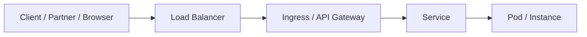
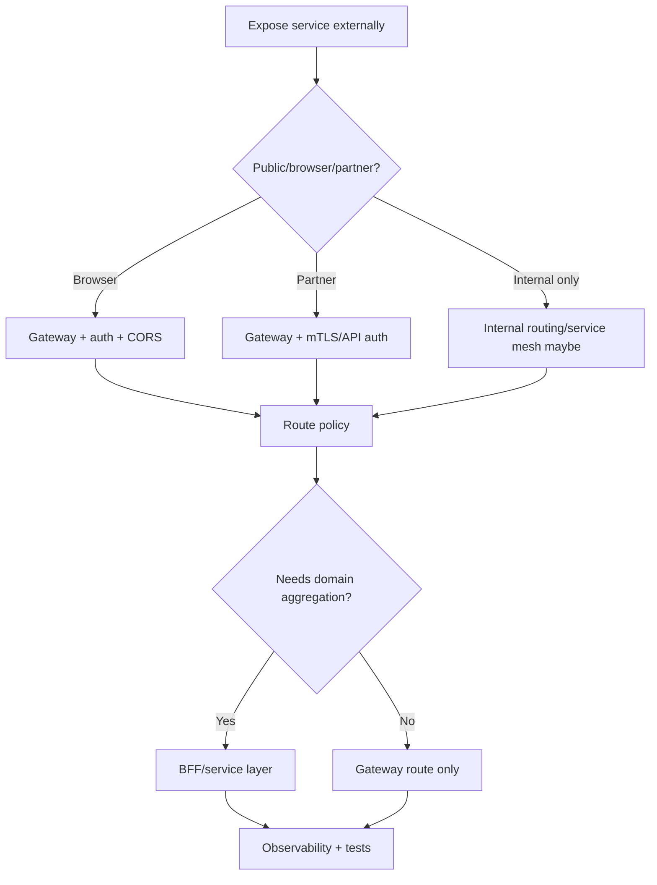

# Part 082 — API Gateway, Ingress, and Edge Routing

Internal service discovery answers:

```text
How does one service find another inside the platform?
```

Edge routing answers:

```text
How does external or north-south traffic enter the platform and reach the right service safely?
```

An API gateway or ingress layer often handles:

- host routing,
- path routing,
- TLS termination,
- authentication,
- authorization delegation,
- rate limiting,
- request size limits,
- CORS,
- header normalization,
- request/response transformation,
- canary routing,
- traffic splitting,
- observability,
- WAF/security integration,
- protocol bridging.

This layer is powerful.

It is also dangerous when it hides business behavior or duplicates application logic.

A top-tier engineer uses gateways to enforce cross-cutting edge policy, not to turn the gateway into a distributed monolith.

---

## 1. Edge Routing Mental Model



Gateway responsibilities:

```text
accept external traffic
apply edge policy
route to internal service
emit edge telemetry
protect backend
```

Backend service responsibilities:

```text
domain validation
business authorization
application behavior
data access
business errors
```

Do not confuse gateway policy with domain logic.

---

## 2. API Gateway vs Ingress vs Reverse Proxy

Terms overlap.

| Term | Typical focus |
|---|---|
| Reverse proxy | proxy HTTP traffic to upstreams |
| Ingress | Kubernetes API object/controller for external HTTP(S) access |
| API gateway | API-specific edge policy, auth, rate limits, routing, developer/API management |
| Gateway API | Kubernetes project for role-oriented, protocol-aware routing |
| Load balancer | L4/L7 traffic distribution, often infrastructure-managed |
| Edge proxy | proxy at boundary of platform/network |

In practice, products can do multiple roles.

Be precise about capability, not label.

---

## 3. Kubernetes Ingress

Kubernetes Ingress is an API object that manages external HTTP/HTTPS access to Services.

It maps traffic based on host/path rules.

Conceptual:

```yaml
apiVersion: networking.k8s.io/v1
kind: Ingress
metadata:
  name: case-api
spec:
  rules:
    - host: api.example.com
      http:
        paths:
          - path: /cases
            pathType: Prefix
            backend:
              service:
                name: case-service
                port:
                  number: 8080
```

An Ingress requires an Ingress controller implementation.

The API object alone does not route traffic without a controller.

---

## 4. Ingress Limitations

Ingress is useful but limited.

Common limitations:

- primarily HTTP/HTTPS,
- implementation-specific annotations,
- advanced routing varies by controller,
- role separation is weak,
- cross-namespace delegation limited,
- policy attachment often vendor-specific,
- traffic splitting/canary often annotation-specific.

Because of this, Kubernetes Gateway API was developed as a more expressive, role-oriented API family.

Ingress remains widely used.

Gateway API is increasingly preferred for advanced routing models.

---

## 5. Kubernetes Gateway API

Gateway API introduces resources such as:

- `GatewayClass`,
- `Gateway`,
- `HTTPRoute`,
- `GRPCRoute`,
- `TLSRoute`,
- `TCPRoute`,
- policy attachment patterns.

It separates roles:

| Role | Resource |
|---|---|
| infrastructure/platform | GatewayClass |
| cluster/operator/team | Gateway |
| application/team | Route |

Conceptual HTTPRoute:

```yaml
apiVersion: gateway.networking.k8s.io/v1
kind: HTTPRoute
metadata:
  name: case-route
spec:
  parentRefs:
    - name: public-gateway
  hostnames:
    - api.example.com
  rules:
    - matches:
        - path:
            type: PathPrefix
            value: /cases
      backendRefs:
        - name: case-service
          port: 8080
```

Gateway API makes routing contracts more explicit and extensible.

---

## 6. API Gateway Responsibilities

Good gateway responsibilities:

- TLS termination,
- client authentication integration,
- coarse authorization,
- rate limiting,
- request size limits,
- CORS,
- header normalization,
- routing,
- API version routing,
- canary traffic split,
- observability,
- WAF integration,
- protocol-level protection,
- request ID injection.

Bad gateway responsibilities:

- complex domain validation,
- business workflow,
- data joins,
- hidden transformations changing semantics,
- compensating for bad backend API design,
- embedding service-specific business logic,
- serving as universal orchestrator.

Gateway should protect and route.

Backend should own domain behavior.

---

## 7. Backend-for-Frontend vs API Gateway

Backend-for-Frontend (BFF) is a backend tailored to a specific client experience.

API gateway is shared edge infrastructure/policy.

BFF may:

- aggregate backend data for mobile/web,
- shape responses for UI,
- handle client-specific workflow,
- reduce frontend chattiness.

Gateway should not become BFF accidentally.

If response aggregation is client-specific and domain-aware, create BFF service.

If behavior is cross-cutting edge policy, keep it in gateway.

---

## 8. Route Design

Route dimensions:

- host,
- path,
- method,
- headers,
- query,
- protocol,
- service version,
- tenant/region,
- canary weight.

Example:

```text
api.example.com /cases/** -> case-service
api.example.com /documents/** -> document-service
```

Avoid route ambiguity.

Bad:

```text
/case
/cases
/cases-v2
/cases/*
```

without clear matching priority.

Route definitions should be reviewed and tested.

---

## 9. Path Rewriting

Gateways can rewrite paths.

Example:

```text
external: /api/v1/cases/123
internal: /cases/123
```

Path rewriting can be useful.

But it creates debugging complexity.

Rules:

- document external and internal paths,
- preserve original path in header if useful,
- avoid hidden semantic transformations,
- test route rewrites,
- ensure generated links and redirects work,
- ensure observability uses both route and upstream path if needed.

Too much rewriting hides API shape.

---

## 10. Host-Based Routing

Host-based routing:

```text
api.example.com -> public API gateway
admin.example.com -> admin gateway
partner.example.com -> partner API
```

Benefits:

- clearer security policy,
- separate certificates,
- separate rate limits,
- separate authentication,
- separate ownership.

Hostnames are part of API contract.

Changing hostnames is a breaking client change.

---

## 11. TLS Termination

TLS can terminate at:

- external load balancer,
- ingress/gateway,
- service mesh sidecar,
- application,
- multiple layers.

Common edge:

```text
client HTTPS -> gateway terminates TLS -> internal HTTP or mTLS
```

Questions:

- where is TLS terminated?
- is traffic re-encrypted internally?
- are client certificates used?
- how are certificates rotated?
- is HSTS configured?
- are weak ciphers disabled?
- are backend identities verified?

TLS termination is security architecture, not just YAML.

---

## 12. mTLS at Edge

For partner/internal clients, gateway may require client certificates.

mTLS provides:

- client authentication,
- certificate-based identity,
- stronger machine-to-machine trust.

But requires:

- certificate issuance,
- rotation,
- revocation,
- mapping cert identity to principal,
- error handling,
- partner onboarding,
- audit.

For public browser APIs, OAuth/OIDC is more common.

For B2B/private APIs, mTLS can be strong.

---

## 13. Authentication at Gateway

Gateway can validate:

- JWT,
- OAuth2/OIDC tokens,
- API keys,
- mTLS certificates,
- signed requests,
- session cookies.

Benefits:

- consistent edge auth,
- reject unauthenticated traffic early,
- reduce backend load,
- central policy.

But backend should still receive trustworthy identity context and enforce domain authorization.

Authentication at gateway is not full application authorization.

---

## 14. Identity Propagation

After authentication, gateway may pass identity to backend.

Headers:

```text
X-Authenticated-Subject
X-Authenticated-Client
X-Tenant-Id
X-Scopes
```

or standardized token forwarding.

Risks:

- header spoofing if backend accepts direct traffic,
- missing signature,
- too much identity data,
- stale claims,
- confused deputy.

Mitigations:

- block direct external access to backend,
- strip inbound identity headers before setting trusted ones,
- sign internal identity headers or use mTLS/mesh identity,
- backend validates trust boundary,
- minimize propagated identity.

Never trust `X-User-Id` from the internet.

---

## 15. Authorization Split

Gateway authorization:

- coarse route access,
- token valid,
- scope/role allowed for API group,
- tenant route allowed,
- API key quota.

Backend authorization:

- can this user act on this specific resource?
- is tenant/resource relation valid?
- is workflow state allowed?
- is data visibility allowed?
- are domain policies satisfied?

Do not move resource-level domain authorization entirely to gateway unless gateway has authoritative domain data, which usually creates coupling.

---

## 16. Rate Limiting

Gateway is a natural place for rate limiting.

Dimensions:

- client ID,
- API key,
- user,
- tenant,
- route,
- method,
- source IP,
- plan/tier,
- token subject,
- global protection.

Example policy:

```yaml
rateLimits:
  - route: /cases/**
    clientTier: free
    limit: 100/min
  - route: /cases/**
    clientTier: enterprise
    limit: 5000/min
```

Rate limits should return clear responses.

Use `429 Too Many Requests` and retry hints where appropriate.

Backend may still need domain-specific limits.

---

## 17. Request Size Limits

Gateways should enforce:

- max body size,
- max header size,
- max path length,
- max query length,
- upload route exceptions,
- timeout limits.

This protects backend.

Example:

```yaml
maxRequestBodyBytes: 1048576
```

Do not let giant payloads reach Java services accidentally.

For file uploads, design dedicated upload path/object storage pattern.

---

## 18. Timeouts at Gateway

Gateway timeouts are critical.

Types:

- downstream/client idle timeout,
- upstream connect timeout,
- upstream request timeout,
- per-route timeout,
- stream timeout,
- header timeout.

Gateway timeout must align with backend and client timeouts.

Bad:

```text
client timeout = 60s
gateway timeout = 30s
backend timeout = 120s
```

Backend may continue work after gateway has given up.

Use deadline propagation when possible.

Gateway timeout is part of end-to-end budget.

---

## 19. Retries at Gateway

Gateway/proxy retries can help with transient upstream failures.

They can also duplicate unsafe requests.

Gateway retry policy must consider:

- HTTP method,
- idempotency key,
- status code,
- timeout budget,
- retry count,
- retry per try timeout,
- request body repeatability,
- upstream health,
- application retry policy.

Do not enable gateway retries broadly for POST commands.

If gateway retries and client also retries, amplification occurs.

Coordinate retry owner.

---

## 20. Circuit Breaking and Outlier Detection

Gateways/proxies may support:

- circuit breaking,
- connection limits,
- pending request limits,
- outlier detection,
- ejection of unhealthy upstreams.

These protect backend and gateway.

But they can hide application problems.

Expose:

- upstream ejection count,
- circuit open,
- pending overflow,
- connection overflow,
- 503 generated by gateway.

Backend teams need visibility into gateway-generated failures.

---

## 21. Canary and Traffic Splitting

Gateway can route traffic by weight.

Example:

```text
95% -> case-service-v1
5% -> case-service-v2
```

Canary dimensions:

- percentage,
- header,
- cookie,
- user segment,
- tenant,
- region,
- route.

Traffic split must be observable.

Metrics should show:

- version,
- route,
- status,
- latency,
- errors.

Canary routing is powerful.

It can also create inconsistent user experience if state/schema compatibility is not ready.

---

## 22. Shadow Traffic

Shadowing copies request to another backend without affecting response.

Use for:

- testing new version,
- performance comparison,
- migration validation,
- API compatibility.

Risks:

- duplicate side effects if shadow backend writes,
- privacy data exposure,
- extra load,
- confusing telemetry,
- backend not truly read-only.

Shadow target must be safe.

Only shadow idempotent/read-only or explicitly side-effect-suppressed paths.

---

## 23. Header Policy

Gateway should normalize headers.

Actions:

- add request ID,
- propagate trace context,
- strip untrusted identity headers,
- set authenticated identity headers,
- remove hop-by-hop headers,
- control CORS headers,
- preserve forwarding headers safely,
- limit header size.

Important headers:

```text
X-Request-Id
traceparent
tracestate
X-Forwarded-For
X-Forwarded-Proto
Forwarded
Authorization
```

Do not pass arbitrary client headers into internal trust decisions.

---

## 24. CORS

CORS is browser security policy.

Gateway often handles CORS preflight.

Policy should specify:

- allowed origins,
- allowed methods,
- allowed headers,
- credentials allowed or not,
- max age,
- route-specific exceptions.

Bad:

```text
Access-Control-Allow-Origin: *
Access-Control-Allow-Credentials: true
```

Avoid broad CORS for authenticated APIs.

CORS is not authentication.

It is browser cross-origin control.

---

## 25. API Version Routing

Gateway can route versions:

```text
/api/v1/cases -> case-service-v1
/api/v2/cases -> case-service-v2
```

or by header:

```text
Accept: application/vnd.example.case.v2+json
```

Gateway version routing can help migrations.

But backend must still support contract and compatibility.

Do not hide breaking API behavior through gateway rewrites alone.

Versioning is API design, not just route config.

---

## 26. Protocol Bridging

Gateway may bridge:

- HTTPS to HTTP,
- HTTP/JSON to gRPC,
- gRPC-Web to gRPC,
- WebSocket to backend,
- REST facade to internal RPC.

Protocol bridging is useful.

But it can distort:

- status codes,
- streaming behavior,
- deadlines,
- metadata,
- errors,
- authentication context,
- payload size,
- schema evolution.

Bridging must be contract-tested.

---

## 27. gRPC at Gateway

gRPC through gateway/proxy requires:

- HTTP/2 support,
- TLS/ALPN support,
- correct timeout/stream config,
- metadata size limits,
- streaming support,
- gRPC status/trailer handling,
- load balancing behavior.

Some gateways support gRPC well.

Some only support HTTP/JSON easily.

Do not assume.

Test unary and streaming gRPC through the actual gateway.

---

## 28. WebSocket/SSE Routing

Long-lived connections need special policy:

- idle timeout,
- max connection duration,
- connection limits,
- backpressure,
- graceful deploy,
- authentication refresh,
- load balancing stickiness,
- observability,
- resource quotas.

Do not reuse short HTTP timeout defaults for WebSocket/SSE.

Long-lived routes deserve separate config.

---

## 29. Gateway Observability

Gateway metrics:

```text
gateway.requests.total{route,method,status,upstream}
gateway.request.duration{route,method,upstream}
gateway.upstream.connect.failures{upstream}
gateway.upstream.requests.total{upstream,status}
gateway.rate_limited.total{route,client}
gateway.auth.failures.total{route,reason}
gateway.request.size.bytes{route}
gateway.response.size.bytes{route}
gateway.retries.total{route,upstream}
gateway.timeout.total{route,upstream}
gateway.circuit_breaker.open{upstream}
gateway.canary.traffic{route,version}
```

Logs:

- request ID,
- route,
- upstream,
- authenticated subject/client,
- status,
- duration,
- rate limit decision,
- auth failure reason,
- correlation ID.

No sensitive payload logs.

---

## 30. Gateway SLOs

Gateway SLOs should distinguish:

- gateway availability,
- upstream availability,
- route-specific latency,
- gateway-generated errors,
- backend-generated errors,
- auth/rate-limit expected rejections.

Example:

```text
99.95% of valid authenticated requests to /cases are routed to upstream and receive a non-5xx gateway response within 300ms, excluding backend 4xx.
```

If gateway returns 503 due to no healthy upstream, is that gateway or backend/platform failure?

Classify carefully.

---

## 31. Failure Modes

| Failure | Symptom |
|---|---|
| route missing | 404 at gateway |
| wrong backend service | 502/503 |
| TLS cert expired | clients fail handshake |
| auth provider down | 401/503 depending policy |
| rate limit misconfigured | clients throttled |
| timeout too short | 504 |
| retry on unsafe method | duplicate commands |
| body limit too small | 413 |
| CORS wrong | browser failures |
| header stripping wrong | identity lost |
| direct backend exposed | header spoofing risk |
| canary bad | subset of users fail |

Gateway failures often look like backend failures to users.

Observability must identify source.

---

## 32. Testing Gateway Routes

Test:

- host routing,
- path routing,
- method matching,
- TLS certificate,
- auth success/failure,
- identity header propagation,
- untrusted header stripping,
- rate limit,
- request size limit,
- timeout,
- retry policy,
- canary split,
- CORS preflight,
- gRPC unary/streaming if used.

Use black-box tests against actual gateway environment.

Configuration unit tests are not enough.

---

## 33. Contract Test for Identity Headers

Test:

```text
client sends spoofed X-Authenticated-Subject
gateway strips it
gateway sets trusted subject after auth
backend receives trusted value only
```

This is critical.

Otherwise clients may spoof identity.

Backend should also reject requests that bypass gateway or lack trusted internal identity.

---

## 34. Route Drift Detection

Detect:

- route points to nonexistent Service,
- backend port wrong,
- route has no owner,
- TLS secret expiring,
- wildcard host too broad,
- public route without auth,
- unsafe retry on POST,
- no timeout,
- no rate limit,
- route not covered by tests,
- stale deprecated route still active.

Gateway config should be managed as code.

Run static checks in CI.

---

## 35. Production Policy Template

```yaml
edgeRouting:
  routes:
    case-api:
      host: api.example.com
      pathPrefix: /cases
      backend:
        service: case-service.case.svc.cluster.local
        port: 8080
      tls:
        termination: gateway
        hsts: true
      auth:
        required: true
        scheme: oidc-jwt
        stripUntrustedIdentityHeaders: true
      timeouts:
        connectMs: 100
        requestMs: 1000
      retries:
        enabled: true
        allowedMethods:
          - GET
          - HEAD
        maxAttempts: 2
      rateLimit:
        by: clientId
        default: 1000/min
      requestLimits:
        maxBodyBytes: 1048576
      observability:
        routeMetrics: true
        accessLogs: redacted
      ownership:
        team: case-platform
```

Every public route should have a policy.

---

## 36. Common Anti-Patterns

### 36.1 Gateway as business monolith

All domain logic migrates to edge.

### 36.2 Public route without owner

Nobody handles incidents.

### 36.3 Trusting client identity headers

Header spoofing.

### 36.4 Retry enabled for unsafe commands

Duplicate side effects.

### 36.5 No gateway timeout

Hanging resources.

### 36.6 Gateway timeout shorter than backend without cancellation

Wasted backend work.

### 36.7 CORS wildcard with credentials

Security risk.

### 36.8 Hidden path rewrites

Debugging and docs drift.

### 36.9 Canary without version metrics

Cannot see impact.

### 36.10 No route tests

Config drift reaches production.

---

## 37. Decision Model



Use gateway for edge policy.

Use BFF/application service for domain-aware aggregation.

---

## 38. Design Checklist

Before exposing a route:

- Who owns the route?
- What host/path/methods?
- What backend Service?
- Is TLS configured?
- Is auth required?
- Are identity headers protected?
- Is authorization split clear?
- Is rate limiting configured?
- Is request size limited?
- Are timeouts configured?
- Are retries safe?
- Is CORS correct?
- Is path rewriting documented?
- Is canary/shadow policy safe?
- Are access logs redacted?
- Are route metrics available?
- Are route tests written?
- Is rollback route ready?

---

## 39. The Real Lesson

The gateway is the front door of your microservice platform.

It should provide:

```text
secure entry
+ clear routing
+ edge protection
+ traffic policy
+ observability
```

It should not hide business semantics, duplicate domain logic, or make unsafe retries invisible.

A production-grade gateway setup requires:

```text
route ownership
+ TLS/auth
+ trusted identity propagation
+ timeout/retry policy
+ rate limits
+ route tests
+ redacted observability
+ safe rollout
```

Edge routing is API architecture.

Treat it with the same seriousness as code.

---

## References

- Kubernetes Ingress: https://kubernetes.io/docs/concepts/services-networking/ingress/
- Kubernetes Gateway API: https://kubernetes.io/docs/concepts/services-networking/gateway/
- Gateway API Project: https://gateway-api.sigs.k8s.io/
- Gateway API Overview: https://gateway-api.sigs.k8s.io/docs/concepts/api-overview/
- Envoy HTTP Connection Management: https://www.envoyproxy.io/docs/envoy/latest/intro/arch_overview/http/http_connection_management
- Envoy Proxy: https://www.envoyproxy.io/
