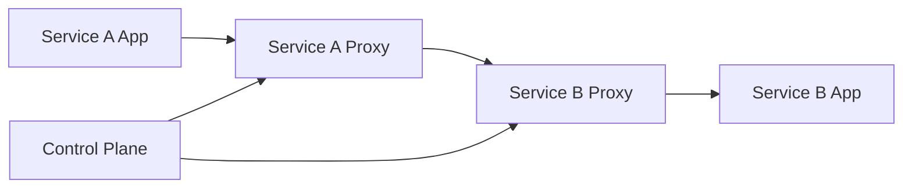
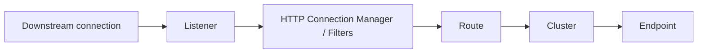
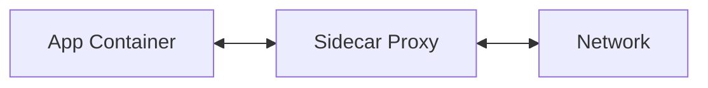
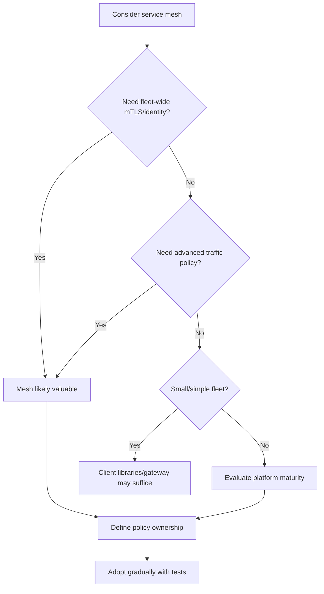

# Part 083 — Service Mesh Fundamentals and Mental Model

A service mesh is a platform layer for service-to-service communication.

It moves many cross-cutting network behaviors out of application code and into a managed proxy/data-plane layer.

Typical mesh capabilities:

- service-to-service mTLS,
- service identity,
- traffic routing,
- load balancing,
- retries,
- timeouts,
- circuit breaking,
- outlier detection,
- traffic mirroring,
- canary routing,
- telemetry,
- policy enforcement,
- authorization,
- egress control.

This is powerful.

It is also dangerous when teams treat mesh as magic.

A service mesh does not eliminate distributed systems problems.

It changes where some of them are configured and observed.

A top-tier engineer knows exactly which responsibility belongs to:

```text
application code
client library
gateway
service mesh
Kubernetes
broker
database
```

and does not blindly duplicate policies across layers.

---

## 1. Service Mesh Mental Model



Application sends request.

Proxy intercepts and forwards it.

Control plane configures proxies.

The mesh can apply communication policy without every application implementing it manually.

The core idea:

```text
common network behavior becomes platform policy
```

But application semantics still belong in application code.

---

## 2. Data Plane and Control Plane

A service mesh is commonly split into:

| Plane | Responsibility |
|---|---|
| Data plane | proxies that process actual traffic |
| Control plane | configures proxies, distributes policy, manages identity/config |

Data plane examples:

- Envoy sidecars,
- node-level proxies,
- waypoint proxies,
- ambient mesh components depending on implementation.

Control plane examples:

- Istio `istiod`,
- mesh management components,
- xDS control plane,
- certificate authority integration.

The data plane is on the request path.

The control plane is not usually on every request path, but if it fails, configuration updates and certificate rotation can be impacted.

---

## 3. Envoy Mental Model

Envoy is a high-performance proxy commonly used as a service mesh data plane.

Core Envoy concepts:

| Concept | Meaning |
|---|---|
| listener | accepts downstream connections |
| filter chain | processes traffic through filters |
| route | decides where traffic goes |
| cluster | logical upstream service/group |
| endpoint | concrete upstream host |
| load balancing policy | chooses endpoint |
| health checking | tracks endpoint health |
| xDS | dynamic configuration APIs |
| stats/logs/traces | observability outputs |

Simplified request path:



When debugging mesh traffic, learn to think in Envoy terms:

```text
listener -> route -> cluster -> endpoint
```

---

## 4. Sidecar Mode

Traditional service mesh deployment injects one proxy sidecar per workload pod.



Benefits:

- per-pod traffic control,
- strong workload identity,
- transparent interception,
- uniform telemetry,
- fine-grained policy.

Costs:

- extra container per pod,
- CPU/memory overhead,
- startup/shutdown coordination,
- proxy upgrades,
- debugging complexity,
- port interception complexity,
- increased latency,
- operational learning curve.

Sidecar mode is powerful but not free.

---

## 5. Ambient / Sidecarless Mesh

Some mesh implementations support sidecarless or ambient modes.

The goal is to reduce per-pod sidecar overhead and simplify adoption.

General idea:

```text
move some mesh behavior from per-pod sidecar to node/shared data-plane components
```

Benefits may include:

- fewer sidecars,
- easier onboarding,
- reduced pod resource overhead,
- simplified application deployment.

Trade-offs may include:

- different policy granularity,
- different debugging model,
- additional data-plane components,
- feature differences,
- migration complexity.

Do not assume sidecar and ambient modes are identical.

Read the implementation's data-plane model carefully.

---

## 6. Transparent Proxying

Service mesh often intercepts outbound/inbound traffic transparently.

Application still calls:

```text
http://case-service:8080
```

But traffic is redirected through local proxy.

Benefits:

- no application code change for many features,
- central policy,
- uniform telemetry.

Risks:

- application does not know proxy behavior,
- timeouts/retries may be hidden,
- local debugging harder,
- direct localhost/loopback behavior can surprise,
- startup order matters,
- network failures may be proxy failures.

Transparent does not mean invisible operationally.

The proxy is part of the runtime.

---

## 7. Mesh Identity

Mesh identity answers:

```text
which workload is calling?
```

In Kubernetes-oriented meshes, identity is often tied to:

- namespace,
- service account,
- workload,
- certificate/SPIFFE-like identity,
- trust domain.

Example conceptual identity:

```text
spiffe://cluster.local/ns/case/sa/case-service
```

Identity enables:

- mTLS,
- authorization policy,
- telemetry by source workload,
- zero-trust service-to-service controls.

Identity must be stable and meaningful.

Do not run many services under one shared service account if you want fine-grained policy.

---

## 8. mTLS in Mesh

Mesh can automate service-to-service mTLS.

Benefits:

- encryption in transit,
- peer authentication,
- workload identity,
- certificate rotation,
- policy enforcement.

But mTLS does not solve everything.

It does not answer:

- is this user allowed to access case CASE-100?
- is the business command valid?
- is tenant isolation enforced in domain?
- is payload safe?
- is downstream side effect idempotent?

mTLS authenticates workload-to-workload communication.

Application authorization still matters.

---

## 9. Authorization Policy

Mesh authorization can enforce coarse service-to-service policy.

Example:

```text
only order-service may call case-service /internal/cases/*
```

Good for:

- deny-by-default service communication,
- restricting sensitive services,
- enforcing namespace/service-account policies,
- blocking unexpected dependencies,
- reducing blast radius.

Not enough for:

- resource-level domain authorization,
- user-specific ownership,
- workflow state checks,
- business invariants.

Use mesh authorization as perimeter/micro-perimeter.

Use application authorization for domain decisions.

---

## 10. Mesh Traffic Management

Mesh traffic management can include:

- route by host/path/header,
- route by version/subset,
- canary traffic split,
- fault injection,
- mirroring/shadowing,
- retries,
- timeouts,
- connection pool settings,
- outlier detection,
- circuit breaking,
- locality-aware routing.

This is useful for platform-driven traffic behavior.

But it must align with application policies.

If application retries and mesh retries and gateway retries, you may create retry amplification.

One request can become many attempts.

---

## 11. Timeouts in Mesh

Mesh can set request timeouts.

This is useful for enforcing platform budgets.

But application must still:

- observe cancellation/disconnect,
- stop work when caller no longer cares,
- set downstream timeouts,
- return correct errors,
- handle partial effects.

Bad:

```text
mesh timeout = 1s
application keeps DB transaction running for 30s
```

The client sees timeout.

Backend continues wasting resources.

Timeout policy must be end-to-end.

---

## 12. Retries in Mesh

Mesh retries can help safe idempotent operations.

They can hurt unsafe operations.

Do not enable broad retries for all HTTP methods/statuses.

Retry policy should consider:

- operation idempotency,
- method,
- status code,
- retry budget,
- timeout budget,
- request body replayability,
- application retry policy,
- gateway retry policy.

A mesh retry is still a retry.

It can duplicate side effects if applied incorrectly.

---

## 13. Outlier Detection

Outlier detection ejects unhealthy upstream endpoints based on observed failures.

Benefits:

- avoids sending traffic to bad pod,
- improves availability during partial failure,
- reduces tail latency.

Risks:

- ejects too many pods under systemic failure,
- masks application bug,
- interacts with Kubernetes readiness,
- reduces capacity,
- causes traffic concentration,
- noisy metrics if not understood.

Outlier detection should complement readiness, not replace it.

---

## 14. Circuit Breaking in Mesh

Mesh/proxy circuit breaking often means limits such as:

- max connections,
- max pending requests,
- max requests,
- max retries,
- connection pool overflow.

This protects upstreams and proxies.

But application-level circuit breakers often understand business operation semantics better.

Mesh circuit breaking is usually transport/resource-level.

Application circuit breaking can be operation/dependency-aware.

Use both carefully, with clear ownership.

---

## 15. Telemetry

Mesh can emit telemetry for service-to-service traffic:

- request count,
- latency,
- status code,
- source workload,
- destination workload,
- protocol,
- response flags,
- mTLS status,
- retries,
- upstream failures.

This is valuable because it covers traffic even when app instrumentation is incomplete.

But mesh telemetry lacks application semantics unless enriched.

It may know:

```text
GET /cases/123 returned 500
```

It may not know:

```text
CreateEscalation failed due to business precondition
```

Use mesh telemetry plus application telemetry.

---

## 16. Distributed Tracing

Mesh can participate in tracing.

But application must propagate trace headers.

If application does not propagate, mesh cannot reconstruct full logical trace across service boundaries.

Mesh traces are useful for network path.

Application spans are needed for:

- domain operation,
- DB calls,
- Kafka publish,
- business errors,
- retries,
- cache behavior.

Do not treat mesh tracing as replacement for app instrumentation.

---

## 17. Access Logs

Mesh/proxy access logs can be very useful.

Fields:

- source workload,
- destination workload,
- route,
- status,
- duration,
- upstream service time,
- response flags,
- request ID,
- trace ID,
- mTLS identity.

But access logs can be high volume.

Policy:

- sample if necessary,
- redact sensitive headers,
- avoid payload logs,
- preserve request/correlation ID,
- route logs to searchable backend,
- use structured format.

Proxy logs are operational evidence during incidents.

---

## 18. Mesh and Java Applications

Java applications still need:

- timeouts,
- retries for operation semantics,
- idempotency,
- cancellation handling,
- connection pool sizing,
- graceful shutdown,
- health/readiness,
- domain auth,
- observability,
- error mapping.

Mesh does not remove Java communication design.

It can reduce duplicated infrastructure code and add uniform policy.

But the application remains responsible for correctness.

---

## 19. Mesh and gRPC

Service mesh can handle gRPC if proxy supports HTTP/2/gRPC correctly.

Important:

- gRPC status/trailers,
- streaming timeouts,
- max stream duration,
- metadata size,
- retries only for safe methods,
- load balancing behavior,
- connection pooling,
- mTLS identity,
- reflection/health routing,
- long-lived streams.

Test gRPC through actual mesh.

Do not assume HTTP settings map cleanly to gRPC streams.

---

## 20. Mesh and Messaging

Service mesh usually focuses on network calls, not Kafka semantics.

It may secure TCP traffic to brokers, but it does not understand:

- Kafka offsets,
- consumer lag,
- DLQ,
- event schema,
- outbox,
- idempotent consumer,
- replay.

Do not think service mesh solves event-driven reliability.

Kafka/messaging still needs its own governance and observability.

---

## 21. Mesh and Egress

Egress control governs outbound traffic from services to external systems.

Mesh can provide:

- explicit egress gateways,
- external service registry entries,
- TLS origination,
- audit of external calls,
- policy for allowed domains,
- traffic routing through controlled path.

Benefits:

- reduces uncontrolled internet access,
- improves audit,
- centralizes external dependency policy.

Risks:

- egress gateway bottleneck,
- TLS/SNI confusion,
- certificate validation issues,
- hidden external dependency failures.

External dependencies should be explicit.

---

## 22. Mesh Adoption Costs

Costs:

- proxy CPU/memory,
- latency overhead,
- operational complexity,
- learning curve,
- certificate/policy management,
- control plane upgrades,
- debugging complexity,
- config drift,
- policy conflicts,
- developer friction,
- incident blast radius if control plane/data plane misconfigured.

Mesh is not free.

Adopt it for clear platform benefits.

Do not deploy it because it is fashionable.

---

## 23. When Mesh Is a Good Fit

Mesh is useful when you need:

- uniform mTLS,
- workload identity,
- service-to-service authorization,
- traffic splitting/canary,
- standardized telemetry,
- egress control,
- multi-language fleet policy,
- platform-level traffic management,
- zero-trust posture,
- gradual policy rollout,
- proxy-level observability.

Especially valuable when many services/languages would otherwise implement inconsistent networking code.

---

## 24. When Mesh Is Not a Good Fit

Mesh may be overkill when:

- small number of services,
- one language/framework with strong client libraries,
- no need for mTLS/traffic policy,
- platform team cannot operate it,
- latency/resource budget is tight,
- debugging maturity is low,
- existing gateway/API management solves most needs,
- workloads are mostly asynchronous broker-based.

Mesh complexity must be justified.

---

## 25. Mesh vs Library

| Concern | Library | Mesh |
|---|---|---|
| domain-aware retry | strong | weak |
| mTLS identity | hard fleet-wide | strong |
| traffic split | harder | strong |
| app-level idempotency | strong | none |
| telemetry uniformity | varies | strong |
| language independence | weak | strong |
| debugging locality | app-level | proxy/platform |
| rollout policy | per app | platform |
| business errors | strong | weak |

Use library and mesh together with clear boundaries.

---

## 26. Policy Ownership

Decide who owns:

| Policy | Better owner |
|---|---|
| business timeout budget | service/API owner |
| default route timeout | platform + service owner |
| retry eligibility | service/API owner |
| retry enforcement | app/mesh/gateway by agreement |
| mTLS | platform/security |
| service authz | platform/security + service owner |
| domain authz | service owner |
| traffic split | release owner/platform |
| telemetry | platform + service owner |
| egress allowlist | platform/security |

Unclear ownership creates dangerous duplicate behavior.

---

## 27. Failure Modes

| Failure | Symptom |
|---|---|
| sidecar not injected | policy missing or traffic blocked |
| proxy not ready | app starts but network unavailable |
| mTLS policy mismatch | connection failures |
| authorization policy too strict | 403/denied traffic |
| route config wrong | traffic to wrong version |
| retry policy unsafe | duplicate commands |
| timeout too short | 504/timeout spike |
| control plane down | config/cert updates fail |
| proxy CPU exhausted | latency/errors |
| telemetry cardinality high | observability cost/outage |
| egress blocked | external dependency fails |

Mesh incidents can look like application bugs.

Debug both layers.

---

## 28. Debugging Mesh Traffic

Questions:

1. Is sidecar/proxy present and ready?
2. Is app listening?
3. Is Service discovery correct?
4. Is route config correct?
5. Is mTLS mode compatible?
6. Is authorization policy allowing source?
7. Is destination endpoint healthy?
8. Is proxy reporting upstream errors?
9. Is retry/timeout generated by proxy?
10. Are response flags indicating proxy failure?
11. Did traffic go to expected subset/version?
12. Is control plane distributing config?

Use mesh CLI/tools and proxy config inspection.

Do not debug only application logs.

---

## 29. Mesh Observability

Metrics:

```text
mesh.requests.total{source,destination,route,status}
mesh.request.duration{source,destination,route}
mesh.tcp.connections{source,destination}
mesh.mtls.enabled{source,destination}
mesh.authz.denied.total{source,destination,policy}
mesh.retries.total{source,destination,route}
mesh.timeouts.total{source,destination,route}
mesh.upstream_rq_pending_overflow{destination}
mesh.outlier.ejections.total{destination}
mesh.proxy.cpu{workload}
mesh.proxy.memory{workload}
mesh.config.push.errors.total
```

Also observe application metrics.

Proxy success does not mean business success.

---

## 30. Readiness and Sidecar Startup

App and sidecar startup order matters.

Problems:

- app tries to call dependency before proxy ready,
- proxy intercepts before app ready,
- readiness checks bypass or include proxy unexpectedly,
- shutdown drains incorrectly.

Mitigations:

- startup probes,
- sidecar readiness checks,
- hold application until proxy ready if platform supports,
- graceful termination ordering,
- avoid startup dependency storms,
- test deployment lifecycle.

Mesh changes pod lifecycle.

Account for it.

---

## 31. Mesh Configuration as Code

Mesh policies should be versioned.

Examples:

- PeerAuthentication,
- AuthorizationPolicy,
- VirtualService,
- DestinationRule,
- ServiceEntry,
- Gateway,
- Sidecar/Egress policy.

Use CI checks:

- no wildcard allow by default,
- no unsafe retry on POST,
- timeout required,
- owner labels required,
- mTLS policy consistent,
- route destination exists,
- subset labels exist,
- egress host approved.

Mesh config is production code.

---

## 32. Testing Mesh

Test:

- mTLS enforced,
- unauthorized service denied,
- authorized service allowed,
- traffic split weights,
- canary route by header,
- timeout generated as expected,
- retry only safe methods,
- fault injection in staging,
- egress allow/deny,
- gRPC through mesh,
- streaming routes,
- rolling deploy with sidecars.

Use black-box tests through actual mesh.

YAML validation alone is not enough.

---

## 33. Mesh Readiness Checklist

Before enabling mesh for service:

- Is sidecar/ambient mode chosen?
- Is service identity correct?
- Is mTLS policy defined?
- Are authorization policies defined?
- Are timeouts/retries coordinated with app?
- Are traffic routes documented?
- Is observability dashboard ready?
- Are proxy resource requests/limits set?
- Is graceful shutdown tested?
- Is gRPC/streaming tested if used?
- Is egress policy configured?
- Are config changes reviewed?
- Is rollback plan ready?

Mesh onboarding is a production migration.

---

## 34. Production Policy Template

```yaml
serviceMesh:
  workload: case-service
  namespace: case

  identity:
    serviceAccount: case-service
    mtls: strict

  authorization:
    inbound:
      allow:
        - source: order-service.order
          paths:
            - /internal/cases/*
        - source: gateway.edge
          paths:
            - /cases/*
    defaultDeny: true

  trafficPolicy:
    timeoutMs: 500
    retries:
      enabled: true
      methods:
        - GET
      attempts: 2
    outlierDetection:
      enabled: true

  observability:
    accessLogs: sampled
    metrics: enabled
    tracing: enabled

  resources:
    proxyCpuRequest: 50m
    proxyMemoryRequest: 128Mi

  testing:
    mtlsTestRequired: true
    authzTestRequired: true
    retrySafetyTestRequired: true
```

Policy should be owned by platform and service team together.

---

## 35. Common Anti-Patterns

### 35.1 Mesh as magic reliability

App still needs correctness.

### 35.2 Retry everywhere in mesh

Unsafe duplicate commands.

### 35.3 No coordination with app timeouts

Wasted backend work.

### 35.4 Domain authorization in mesh only

Resource-level decisions missing.

### 35.5 No proxy resource sizing

Sidecar CPU/memory starvation.

### 35.6 Ignoring sidecar startup/shutdown

Deploy incidents.

### 35.7 Mesh telemetry replacing app telemetry

No business context.

### 35.8 Wildcard authz policies

False sense of zero trust.

### 35.9 No mesh config tests

YAML typo becomes outage.

### 35.10 Adopting mesh without platform ownership

Operational burden lands on app teams.

---

## 36. Decision Model



Mesh adoption is a platform decision, not only app decision.

---

## 37. The Real Lesson

A service mesh is a powerful communication platform.

It gives uniform controls for:

```text
identity
+ mTLS
+ authorization
+ routing
+ traffic policy
+ telemetry
```

But it does not understand your business semantics.

It cannot know which commands are idempotent.

It cannot decide resource-level authorization.

It cannot fix bad API design.

It cannot replace outbox/idempotency/replay design.

Use mesh to standardize the network.

Use application code to preserve business correctness.

That boundary is the difference between mature mesh adoption and proxy-shaped chaos.

---

## References

- Istio Architecture: https://istio.io/latest/docs/ops/deployment/architecture/
- Istio Data Plane Modes: https://istio.io/latest/docs/overview/dataplane-modes/
- Istio Traffic Management Concepts: https://istio.io/latest/docs/concepts/traffic-management/
- Envoy Life of a Request: https://www.envoyproxy.io/docs/envoy/latest/intro/life_of_a_request
- Envoy Architecture Overview: https://www.envoyproxy.io/docs/envoy/latest/intro/arch_overview/arch_overview
- Envoy Terminology: https://www.envoyproxy.io/docs/envoy/latest/intro/arch_overview/intro/terminology
