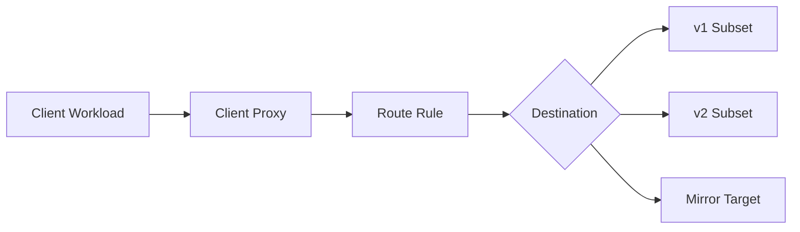
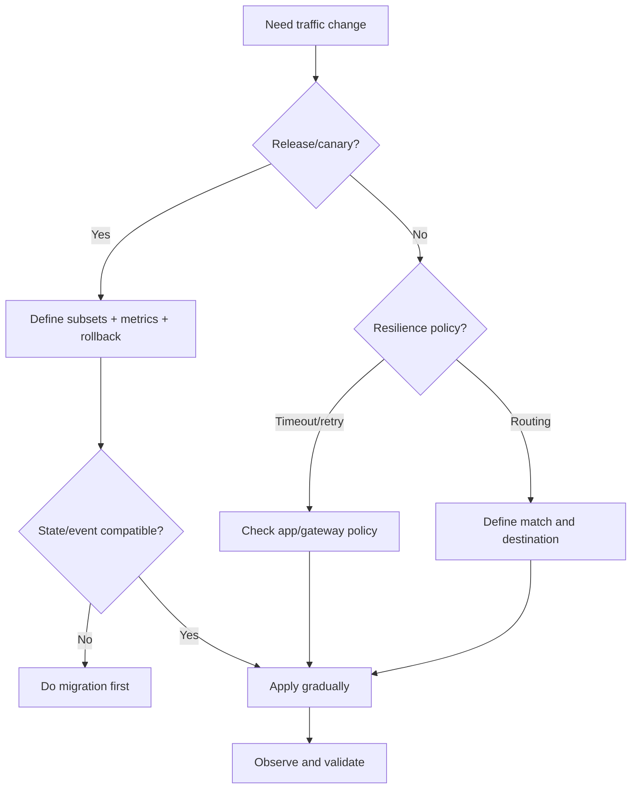

# Part 084 — Service Mesh Traffic Management and Progressive Delivery

Service mesh traffic management lets the platform influence how requests move between services.

This includes:

- routing by host/path/header,
- traffic splitting,
- canary releases,
- subset/version routing,
- mirroring,
- fault injection,
- timeout policy,
- retry policy,
- connection pool limits,
- outlier detection,
- locality-aware routing,
- egress routing.

These features are powerful.

They also create risk if traffic policy is not aligned with application semantics.

A mesh can route traffic.

It cannot know whether a command is safe to retry, whether a shadow request has side effects, or whether canary state is schema-compatible.

Progressive delivery is not just traffic percentage.

It is traffic percentage plus correctness, observability, rollback, and data compatibility.

---

## 1. Traffic Management Mental Model



The mesh can decide:

```text
which request goes to which backend subset
```

based on policy.

But backend versions must remain compatible with:

- API contract,
- database schema,
- event schema,
- auth policy,
- idempotency behavior,
- client expectations.

Traffic management is release engineering plus communication policy.

---

## 2. Istio Traffic Resources Mental Model

In Istio-style traffic management:

- VirtualService controls routing rules.
- DestinationRule controls policies applied after routing, such as subsets, load balancing, connection pool, and outlier detection.
- Gateway controls ingress/egress entry points.
- ServiceEntry can describe external services.

Conceptual split:

```text
VirtualService = where traffic goes
DestinationRule = how traffic behaves after destination selected
```

This separation is useful.

Do not mix routing intent with connection policy mentally.

---

## 3. VirtualService

A VirtualService defines routing rules for traffic addressed to hosts.

Conceptual:

```yaml
apiVersion: networking.istio.io/v1
kind: VirtualService
metadata:
  name: case-service
spec:
  hosts:
    - case-service.case.svc.cluster.local
  http:
    - route:
        - destination:
            host: case-service.case.svc.cluster.local
            subset: v1
          weight: 90
        - destination:
            host: case-service.case.svc.cluster.local
            subset: v2
          weight: 10
```

Use cases:

- canary,
- route by header,
- path routing,
- fault injection,
- retries/timeouts,
- mirroring.

Routing rules are production behavior.

Review them like code.

---

## 4. DestinationRule

A DestinationRule defines policies for traffic intended for a service after routing.

It can define subsets.

Example:

```yaml
apiVersion: networking.istio.io/v1
kind: DestinationRule
metadata:
  name: case-service
spec:
  host: case-service.case.svc.cluster.local
  subsets:
    - name: v1
      labels:
        version: v1
    - name: v2
      labels:
        version: v2
```

Subsets map to workload labels.

If labels are wrong, traffic may not reach intended pods.

DestinationRule can also define traffic policy:

- load balancing,
- connection pool,
- outlier detection,
- TLS settings.

---

## 5. Subsets Are Release Contract

Subset labels must match Deployment labels.

Deployment:

```yaml
metadata:
  labels:
    app: case-service
    version: v2
```

DestinationRule:

```yaml
subsets:
  - name: v2
    labels:
      version: v2
```

If labels mismatch:

```text
route points to empty subset
```

This can cause 503s.

CI should verify subset labels exist in target workloads.

Progressive delivery begins with label discipline.

---

## 6. Canary Routing

Canary routing sends small percentage to new version.

Example:

```text
99% v1
1% v2
```

Then:

```text
90/10
75/25
50/50
100 v2
```

Canary requires:

- versioned metrics,
- error rate by version,
- latency by version,
- business metrics by version,
- rollback route,
- compatibility,
- no unsafe state migration,
- enough traffic for signal.

Canary without metrics is gambling.

---

## 7. Header-Based Canary

Route specific users/clients to canary.

Example:

```yaml
http:
  - match:
      - headers:
          x-canary:
            exact: "true"
    route:
      - destination:
          host: case-service
          subset: v2
  - route:
      - destination:
          host: case-service
          subset: v1
```

Use cases:

- internal testing,
- beta tenants,
- specific clients,
- region testing.

Risks:

- header spoofing if public,
- inconsistent user state,
- cache issues,
- hidden dependency differences.

For public clients, canary selection should be controlled by trusted gateway/header injection, not arbitrary user header.

---

## 8. Cookie/User/Tenant Routing

Canary by user/tenant requires sticky routing.

Approaches:

- gateway injects trusted header,
- consistent hash load balancing,
- cookie-based routing,
- tenant-based routing,
- service mesh route match.

Important:

- all calls in workflow may need same version,
- state/database compatibility must hold,
- caches/projections must be compatible,
- async events from canary must be compatible with old consumers.

Traffic routing is not isolated to one request.

It affects workflows.

---

## 9. Dark Launch

Dark launch deploys code without serving user-visible traffic.

Options:

- deploy v2 with zero traffic,
- route internal test traffic only,
- enable feature flag off,
- shadow traffic read-only,
- run synthetic probes.

Dark launch validates:

- startup,
- readiness,
- mesh config,
- dependencies,
- resource usage,
- basic route correctness.

It does not validate full user behavior unless traffic executes relevant paths.

---

## 10. Traffic Mirroring / Shadowing

Mirroring sends a copy of live traffic to another destination.

Main response comes from primary.

Shadow response is ignored.

Use for:

- validating new version,
- performance comparison,
- migration testing,
- protocol compatibility,
- read-path comparison.

Danger:

- shadow request may create side effects,
- duplicate writes,
- duplicate downstream calls,
- privacy exposure,
- extra load,
- trace/log confusion.

Shadow targets must be side-effect-safe.

For commands, do not mirror unless the target is explicitly no-op/dry-run.

---

## 11. Fault Injection

Mesh can inject faults:

- delays,
- aborts,
- HTTP errors,
- connection failures.

Use for:

- resilience testing,
- timeout validation,
- retry behavior,
- fallback testing,
- chaos engineering.

Example:

```yaml
fault:
  delay:
    percentage:
      value: 5
    fixedDelay: 2s
```

Fault injection must be controlled.

Do not run broad fault injection in production without approval, blast-radius limit, and observability.

---

## 12. Timeouts

Mesh timeout:

```yaml
timeout: 500ms
```

sets route-level request timeout.

Design rules:

- align with client deadline,
- align with backend processing budget,
- backend should observe cancellation,
- do not set timeout longer than upstream gateway/client,
- include retry attempts in total budget,
- configure separately for streaming.

Bad:

```text
mesh route timeout 500ms
Java handler DB timeout 5s
```

Timeout should cut useless work end-to-end.

---

## 13. Retries

Mesh retry example:

```yaml
retries:
  attempts: 2
  perTryTimeout: 200ms
  retryOn: 5xx,connect-failure,refused-stream
```

Use retries only for safe operations.

Safer:

- GET idempotent reads,
- idempotent commands with idempotency keys,
- transient connection failures,
- clearly bounded budget.

Dangerous:

- POST create without idempotency,
- payment capture,
- email send,
- state-changing commands.

Coordinate retries across:

- client library,
- gateway,
- mesh,
- backend,
- caller.

One layer should own primary retry when possible.

---

## 14. Retry Budget

A mesh route with:

```text
attempts = 3
```

does not mean one request.

It can produce three upstream attempts.

If client also retries twice:

```text
2 client attempts × 3 mesh attempts = 6 upstream attempts
```

If gateway retries too:

```text
amplification grows again
```

Define retry budget:

```yaml
operation: GetCase
maxTotalAttemptsAcrossLayers: 2
retryOwner: client
meshRetries: disabled
```

or:

```yaml
retryOwner: mesh
clientRetries: disabled
```

Avoid accidental multiplication.

---

## 15. Connection Pool Settings

Mesh/proxy may limit:

- max TCP connections,
- max pending requests,
- max requests per connection,
- max retries,
- idle timeout,
- HTTP/2 max requests/streams depending proxy settings.

These protect upstream.

But if too low, proxy returns errors.

If too high, upstream overloads.

Connection pool policy must align with backend capacity.

Example intent:

```yaml
connectionPool:
  tcp:
    maxConnections: 100
  http:
    http1MaxPendingRequests: 1000
    maxRequestsPerConnection: 100
```

Exact fields depend on mesh/proxy version.

Understand semantics.

---

## 16. Outlier Detection

Outlier detection can eject unhealthy endpoints.

Example concepts:

- consecutive 5xx,
- consecutive gateway errors,
- interval,
- base ejection time,
- max ejection percent.

Benefits:

- avoid bad pods,
- reduce p99,
- survive partial failure.

Risks:

- ejects many endpoints during systemic issue,
- reduces capacity,
- interacts with readiness and HPA,
- masks deployment bug,
- causes traffic imbalance.

Monitor ejections.

Ejection is not free.

---

## 17. Locality-Aware Routing

Locality-aware routing sends traffic to nearby endpoints.

Useful for:

- lower latency,
- reduced cross-zone cost,
- zone failure behavior,
- regional compliance.

Risks:

- uneven capacity,
- local overload,
- failover behavior surprise,
- data residency issues,
- cross-zone retries during partial outage.

Define locality policy explicitly.

Test zone failure.

---

## 18. Load Balancing Policy

Mesh/proxy load balancing may support:

- round robin,
- least request,
- random,
- consistent hash,
- locality weighted,
- ring hash.

Choose based on workload.

| Policy | Use |
|---|---|
| round robin | general |
| least request | variable latency/load |
| consistent hash | session/key affinity |
| locality aware | zone/region optimization |
| random | simple distribution |

For sticky/keyed routing, understand failure behavior when endpoint set changes.

---

## 19. gRPC Traffic Management

gRPC through mesh requires:

- HTTP/2 support,
- correct method matching if route by path,
- timeout semantics,
- retry support limitations,
- streaming route handling,
- max stream duration,
- mTLS metadata,
- status/trailer handling.

gRPC method path often looks like:

```text
/package.Service/Method
```

Route rules may match this path.

Streaming calls should not use short unary timeouts.

Test all RPC types through mesh:

- unary,
- server streaming,
- client streaming,
- bidi streaming.

---

## 20. Progressive Delivery and Database Compatibility

Canary traffic works only if versions are compatible with shared state.

Deployment v2 must be compatible with:

- database schema,
- event schema,
- cache format,
- projection schema,
- downstream API contracts,
- idempotency keys,
- authorization model.

Use expand/contract migration:

1. add new schema fields,
2. deploy code that writes/reads both,
3. migrate data,
4. switch traffic,
5. remove old fields later.

Traffic split cannot fix incompatible persistence.

---

## 21. Progressive Delivery and Events

If v2 emits new event shape, old consumers may break even if only 1% traffic goes to v2.

Canary event compatibility requires:

- schema compatibility,
- event type versioning,
- consumer readiness,
- dual publish if needed,
- contract tests,
- DLQ monitoring by event version.

Canary does not isolate event impact if events go to shared topics.

One canary request may publish event consumed by many services.

---

## 22. Progressive Delivery and Idempotency

If canary/rollback causes duplicate requests or retries, idempotency must be stable across versions.

Do not change idempotency key semantics between v1 and v2 during canary.

Example bad:

```text
v1 idempotency key = client key
v2 idempotency key = generated server key
```

Rollback/traffic split can duplicate commands.

Version compatibility includes idempotency semantics.

---

## 23. Rollback

Traffic management makes rollback fast.

Example:

```text
v2 weight 10 -> 0
v1 weight 90 -> 100
```

But rollback is safe only if:

- v2 did not perform irreversible migrations,
- v2 event outputs are compatible,
- v2 writes can be read by v1,
- idempotency keys compatible,
- background jobs not changed incompatibly,
- caches/projections can handle both.

Traffic rollback is not data rollback.

Plan both.

---

## 24. Observability for Traffic Splits

Metrics must include version/subset.

```text
requests.total{service,subset,status}
request.duration{service,subset}
retries.total{service,subset}
timeouts.total{service,subset}
outlier_ejections.total{service,subset}
business_errors.total{service,version}
```

Compare:

- v1 vs v2 latency,
- v1 vs v2 error rate,
- backend saturation,
- DLQ/events by version,
- database errors,
- business KPIs.

If metrics do not distinguish versions, canary is blind.

---

## 25. Canary Promotion Criteria

Example:

```yaml
canary:
  step: 10%
  duration: 30m
  promoteIf:
    errorRateDifference: < 0.2%
    p99LatencyRegression: < 10%
    noCriticalAlerts: true
    dlqMessages: 0
    businessFailureRateRegression: < 0.1%
  rollbackIf:
    errorRateDifference: >= 0.5%
    p99LatencyRegression: >= 25%
    anyCriticalAlert: true
```

Promotion must be based on technical and business signals.

Not just "no 500s."

---

## 26. Automated Progressive Delivery

Tools can automate canary analysis.

But automation needs good metrics.

Automated rollout without correct signals can promote bad versions.

Minimum:

- versioned route metrics,
- service metrics,
- business metrics,
- dependency metrics,
- alert integration,
- rollback automation,
- manual override.

Automation accelerates decision-making.

It does not replace readiness.

---

## 27. Mesh Traffic Policy as Code

Traffic policies should be:

- versioned,
- reviewed,
- linted,
- tested,
- owned,
- promoted through environments.

CI checks:

- destination host exists,
- subsets match labels,
- weights sum correctly,
- unsafe retries not allowed,
- timeouts present,
- owner label present,
- mirror target safe,
- route does not bypass auth,
- canary metrics configured.

Traffic YAML is production code.

---

## 28. Testing Traffic Rules

Test:

- v1/v2 weight distribution,
- header route,
- timeout behavior,
- retry behavior,
- mirror target safety,
- fault injection scope,
- outlier detection with bad pod,
- rollback route,
- gRPC route,
- mTLS/authz interaction,
- route after rolling deploy.

Use staged environment with real mesh.

Static validation cannot prove runtime behavior.

---

## 29. Fault Injection Test

Example scenario:

```text
inject 2s delay for 5% GetCase calls
```

Expected:

- client deadline handles delay,
- retries remain within budget,
- p99 alert behaves,
- fallback/stale read if designed,
- no retry storm,
- business SLO impact understood.

Fault injection validates resilience assumptions.

Use it carefully.

---

## 30. Shadow Traffic Test

Before mirroring:

- ensure target is read-only or side-effect disabled,
- use separate database if needed,
- tag traces/logs as shadow,
- throttle mirror percentage,
- monitor target capacity,
- verify response comparison pipeline,
- ensure no external calls.

Shadow traffic should never accidentally mutate production state.

---

## 31. Failure Modes

| Failure | Symptom |
|---|---|
| subset label mismatch | 503/no healthy upstream |
| weights wrong | too much traffic to canary |
| retry unsafe | duplicate commands |
| timeout too short | false failures |
| mirror writes | duplicate side effects |
| fault injection left on | sustained errors |
| route match too broad | wrong service receives traffic |
| route match too narrow | 404/default route |
| outlier ejects all pods | outage |
| version metrics missing | blind canary |
| rollback data incompatible | v1 fails after rollback |

Traffic management failures are often self-inflicted config bugs.

---

## 32. Runbook: Bad Canary

When canary fails:

1. Stop promotion.
2. Route canary weight to 0.
3. Confirm traffic returns to stable subset.
4. Check if v2 wrote incompatible data.
5. Check events emitted by v2.
6. Check DLQ/retry from v2.
7. Check database migrations.
8. Keep v2 pods for debugging if safe.
9. Roll back deployment/config.
10. Document root cause.

Do not delete evidence before analyzing.

---

## 33. Runbook: Mesh Retry Storm

When upstream traffic spikes unexpectedly:

1. Check gateway/client/mesh retry policies.
2. Compute attempt amplification.
3. Disable or reduce mesh retry if unsafe.
4. Check downstream dependency health.
5. Check timeout settings.
6. Check retryOn status list.
7. Check recent route policy changes.
8. Verify idempotency.
9. Monitor recovery.
10. Add policy test to prevent recurrence.

Retry storms are often policy composition bugs.

---

## 34. Production Policy Template

```yaml
meshTrafficManagement:
  services:
    case-service:
      subsets:
        - name: v1
          labels:
            version: v1
        - name: v2
          labels:
            version: v2

      defaultRoute:
        timeoutMs: 500
        retries:
          enabled: true
          attempts: 2
          methods:
            - GET
          unsafeMethodsForbidden: true

      canary:
        enabled: true
        maxInitialWeight: 5
        metrics:
          versionLabelRequired: true
          businessMetricsRequired: true
        rollback:
          automaticOnCriticalAlert: true

      mirroring:
        allowed: true
        sideEffectSafetyRequired: true
        maxMirrorPercent: 5

      outlierDetection:
        enabled: true
        maxEjectionPercent: 50

      testing:
        subsetLabelCheck: true
        retrySafetyCheck: true
        routeIntegrationTest: true
```

Traffic policy should be explicit and reviewable.

---

## 35. Common Anti-Patterns

### 35.1 Canary without version metrics

No signal.

### 35.2 Retry POST by default

Duplicate side effects.

### 35.3 Shadow traffic to real writer

Duplicate writes.

### 35.4 Timeout only in mesh

Backend keeps working after caller timeout.

### 35.5 DestinationRule subset label mismatch

Canary outage.

### 35.6 Changing event schema during canary without compatibility

Shared consumers break.

### 35.7 Traffic rollback assumed to rollback data

It does not.

### 35.8 Fault injection left enabled

Self-inflicted incident.

### 35.9 Route config changed manually in prod

No review/audit.

### 35.10 Mesh policy duplicates app/gateway retries

Attempt amplification.

---

## 36. Decision Model



Traffic management is safe only when compatibility is ready.

---

## 37. Design Checklist

Before applying mesh traffic policy:

- Is destination host correct?
- Do subsets match workload labels?
- Are route matches precise?
- Do weights sum correctly?
- Are timeouts aligned with app budgets?
- Are retries safe for operation?
- Is retry owner clear?
- Is canary version observable?
- Are business metrics available?
- Is rollback safe for data/schema/events?
- Is mirroring side-effect-safe?
- Is fault injection scoped?
- Is outlier detection monitored?
- Are gRPC/streaming routes tested?
- Is policy stored as code?
- Are route tests run?
- Is runbook ready?

---

## 38. The Real Lesson

Service mesh traffic management is not just routing YAML.

It is a production control plane for request flow.

Used well, it enables:

```text
safe canary
+ traffic split
+ fault injection
+ controlled retries
+ timeouts
+ resilience experiments
+ fast rollback
```

Used carelessly, it creates:

```text
duplicate commands
+ invisible retry storms
+ broken canaries
+ shadow side effects
+ timeout mismatch
+ policy drift
```

The mesh can move traffic.

Only disciplined engineering can make that movement safe.

---

## References

- Istio Traffic Management Concepts: https://istio.io/latest/docs/concepts/traffic-management/
- Istio VirtualService Reference: https://istio.io/latest/docs/reference/config/networking/virtual-service/
- Istio DestinationRule Reference: https://istio.io/latest/docs/reference/config/networking/destination-rule/
- Envoy Life of a Request: https://www.envoyproxy.io/docs/envoy/latest/intro/life_of_a_request
- Envoy Architecture Overview: https://www.envoyproxy.io/docs/envoy/latest/intro/arch_overview/arch_overview
- Gateway API HTTP Routing: https://gateway-api.sigs.k8s.io/guides/user-guides/http-routing/
